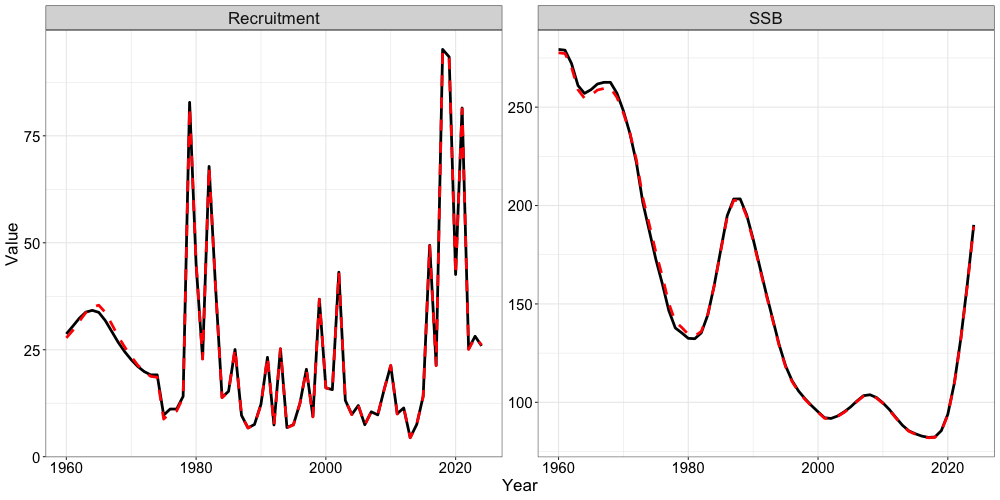

# Setting up a Single Region Model (Alaska Sablefish)

The `SPoRC` package utilizes several helper functions to facilitate the
set up of an age-structured assessment model. In this vignette, we will
demonstrate how these helper functions might be used to set up a
single-region model for Alaska sablefish. The vignette sets up the model
following the parameterization of the 2024 federal Alaska sablefish
stock assessment and compares model outputs from `SPoRC` to the existing
ADMB model. The 2024 federal Alaska sablefish stock assessment is
assessed on an Alaska-wide scale (from the Bering Sea to Eastern Gulf of
Alaska) as a panmictic single-region model, with 2 sexes (females and
males), 2 fishery fleets (fixed-gear and trawl), and 3 survey fleets
(domestic longline, Japanese longline, and a domestic trawl survey).

First, let us load in any necessary packages.

``` r

# Load in packages
library(SPoRC) 
library(here)
library(RTMB)
library(ggplot2)
data("sgl_rg_sable_data") # load in data
```

## Setup Model Dimensions

To initially set the model up, an input list containing a data list,
parameter list, and a mapping list needs to be constructed. This is
aided with the function `Setup_Mod_Dim`, where users specify a vector of
years, ages, and lengths. Additionally, users need to specify the number
of regions modelled (n_regions), number of sexes modelled (n_sexes),
number of fishery fleets (n_fish_fleets), and number of survey fleets
(n_srv_fleets)

``` r

input_list <- Setup_Mod_Dim(years = 1:length(sgl_rg_sable_data$years), # vector of years 
                            # (corresponds to year 1960 - 2024)
                            ages = 1:length(sgl_rg_sable_data$ages), # vector of ages
                            lens = seq(41,99,2), # number of lengths
                            n_regions = 1, # number of regions
                            n_sexes = sgl_rg_sable_data$n_sexes, # number of sexes == 1,
                            # female, == 2 male
                            n_fish_fleets = sgl_rg_sable_data$n_fish_fleets, # number of fishery
                            # fleet == 1, fixed gear, == 2 trawl gear
                            n_srv_fleets = sgl_rg_sable_data$n_srv_fleets, # number of survey fleets
                            verbose = FALSE
                            )
```

## Setup Recruitment Dynamics

Following the initialization of `input_list`, we can pass the created
object into the next function (`Setup_Mod_Rec`) to parameterize
recruitment dynamics. In the case of Alaska sablefish, recruitment is
parameterized as such:

1.  Mean Recruitment, with no stock recruitment relationship assumed,
2.  A recruitment bias ramp is used, following the methods of Methot and
    Taylor 2011 (`do_bias_ramp = 1`),
3.  Two values for `sigmaR` are used, the first value represents an
    early period `sigmaR`, which is fixed at 0.4, while the second value
    represents a late period `sigmaR`, which is freely estimated
    (although should be fixed).
4.  Recruitment deviations are estimated in a penalized likelihood
    framework,
5.  Recruitment deviations are estimated for all years, except for the
    terminal year,
6.  Recruitment sex-ratios are fixed at 0.5 for each sex (as default),
7.  Initial age structure is derived by assuming a geometric series
    (`init_age_strc = 1`; the alternative is iterating age structure to
    some equilibrium `init_age_strc = 0`), and
8.  A 10% fraction of the mean fishing mortality rate is assumed for
    initalizing the age structure.

``` r

input_list <- Setup_Mod_Rec(input_list = input_list, # input data list from above
                            # Model options
                            do_rec_bias_ramp = 1, # do bias ramp 
                            # (0 == don't do bias ramp, 1 == do bias ramp)
                            # breakpoints for bias ramp 
                            # (1 == no bias ramp - 1960 - 1980, 
                            # 2 == ascending limb of bias ramp - 1980 - 1990,
                            # 3 == full bias correction - 1990 - 2022, == 4 
                            # no bias correction - terminal year of 
                            # recruitment estimate)
                            bias_year = c(length(1960:1979),
                                          length(1960:1989), 
                                          (length(1960:2023) - 5), 
                                          length(1960:2024) - 2) + 1,
                            sigmaR_switch = as.integer(length(1960:1975)), 
                            # when to switch from early to late sigmaR
                            dont_est_recdev_last = 1, 
                            # don't estimate last recruitment deviate
                            ln_sigmaR = log(c(0.4, 1.2)),
                            rec_model = "mean_rec", # recruitment model
                            sigmaR_spec = "fix_early_est_late", 
                            # fix early sigmaR, estiamte late sigmaR
                            init_age_strc = 1, # how to derive inital age strc
                            init_F_prop = 0.1 # fraction of mean F from 
                            # dominant fleet to apply to initial age strc
                            )
```

## Setup Biological Dynamics

Passing on the `input_list` that was updated in the previous helper
function, we can then parameterize the biological dynamics of the model.
The `Setup_Mod_Biologicals` requires data inputs for weight-at-age
(`WAA`) and maturity-at-age (`MatAA`), both of which are dimensioned by
`n_regions`, `n_years`, `n_ages`, `n_sexes`. Optional model inputs
include a single ageing-error matrix `AgeingError`, dimensioned by
`n_ages`, `n_ages`. This can be left as NULL if no ageing-error matrix
is available, and the model will assume an identity matrix for the
ageing-error for age-composition data. Additionally, a size-age
transition matrix can be supplied if length data are being fit to
`fit_lengths = 1`, which are dimensioned by `n_regions`, `n_years`,
`n_lens`, `n_ages`, `n_sexes`. Although the Alaska sablefish assessment
utilizes priors for natural mortality, it is not possible to get an
exact match with the 2024 assessment, given differences in the
parameterization of natural mortality. Thus, for demonstration purposes,
M will be fixed in this case. The `M_spec` argument specifies that
natural mortality should be fixed and an array of fixed values is
provided `Fixed_natmort = fixed_natmort`. Starting values and fixed
parameters can be specified using the `...`, where the parameter name is
supplied, and the values provided to the parameter name represent the
starting value.

``` r

# Specificying natural mortality fixed array
fixed_natmort <- array(0, dim = c(input_list$data$n_regions, length(input_list$data$years), length(input_list$data$ages), input_list$data$n_sexes))
fixed_natmort[,,,1] <- 0.1134156 # fix female M
fixed_natmort[,,,2] <- 0.1052175 # fix male M

input_list <- Setup_Mod_Biologicals(input_list = input_list,
                                    # Data inputs
                                    WAA = rtmb_data$WAA, # weight-at-age
                                    MatAA = rtmb_data$MatAA, # maturity at age
                                    AgeingError = as.matrix(ageing_dat$age_error), # ageing error
                                    SizeAgeTrans = rtmb_data$SizeAgeTrans, # size age transition matrix
                                    # Model options
                                    Use_M_prior = 0, # use natural mortality prior
                                    fit_lengths = 1, # fitting length compositions
                                    M_spec = "fix",
                                    Fixed_natmort = fixed_natmort)
```

## Setup Movement and Tagging Dynamics

Given that the Alaska sablefish assessment is a single region model, no
movement dynamics are specified. However, users will still need to
define how movement dynamics are parameterized. In this case, the
following code chunk specifies that movement is not estimated
(`use_fixed_movement = 1`), movement is an identity matrix
(`Fixed_Movement = NA`), and recruits do not move
(`do_recruits_move = 0`).

``` r

input_list <- Setup_Mod_Movement(input_list = input_list,
                                 use_fixed_movement = 1, # don't est move
                                 Fixed_Movement = NA, # use identity move
                                 do_recruits_move = 0 # recruits don't move
                                 )
```

Specification of tagging dynamics will follow a similar fashion since
this is a single-region model. All that is necessary is updating the
`input_list` and setting the `UseTagging` argument to a value of 0.

``` r

input_list <- Setup_Mod_Tagging(input_list = input_list,
                                UseTagging = 0
                                )
```

## Setup Catch and Fishing Mortality

Following the parameterization of biological dynamics, fishery dynamics
can then be specified and set up using the `Setup_Mod_Catch_and_F`
function. Again, the input_list that gets updated from previous helper
functions. Users will need to supply the function with an array of
observed catches `ObsCatch`, which are dimensioned as `n_regions`,
`n_years`, and `n_fish_fleets`. Similarly, users will also need to
specify the catch type of these observations with the `Catch_Type`
argument. This argument expects a matrix dimensioned by `n_years` and
`n_fish_fleets`, and is really only applicable in a spatial model
(values of 0 indicate that catch is aggregated across regions in some
periods and fleets, while values of 1 indicate catch is specific to each
region in all periods and fleets). Thus, in a single region model,
values of `1` should always be supplied. The function also expects the
`UseCatch` argument to be specified, which is dimensioned as
`n_regions`, `n_years`, and `n_fish_fleets`. Essentially, users will
need to fill out whether catch is fit to for those particular
partitions. Most use cases of this argument are scenarios in which catch
is observed to be a value of 0, where the helper function automatically
turns off the estimation of fishing mortality deviations for those
partitions. Additional model options specified for this case study
include: 1) whether fishing mortality penalties are utilized to help
estimate deviations `Use_F_pen = 1`, to fix the standard deviation for
catches and fishing mortality (`sigmaC_spec = 'fix'`,
`sigmaF_spec = 'fix'`).

``` r

input_list <- Setup_Mod_Catch_and_F(input_list = input_list,
                                    # Data inputs
                                    ObsCatch = sgl_rg_sable_data$ObsCatch,
                                    Catch_Type = 
                                      array(1, dim = c(length(input_list$data$years), 
                                                       input_list$data$n_fish_fleets)),
                                    UseCatch = sgl_rg_sable_data$UseCatch,
                                    # Model options
                                    Use_F_pen = 1, 
                                    # whether to use f penalty, == 0 don't use, == 1 use
                                    sigmaC_spec = 'fix',
                                    sigmaF_spec = "fix",

                                    # Fixing sigma C and F
                                    ln_sigmaC = array(log(sqrt(1/2)), dim = c(input_list$data$n_regions, length(input_list$data$years), input_list$data$n_fish_fleets)),
                                    ln_sigmaF = array(log(sqrt(1/2)), dim = c(input_list$data$n_regions, input_list$data$n_fish_fleets))
                                    )
```

## Setup Index and Composition Data (Fishery and Survey)

Some of the more involved helper functions used to set up the single
region model are the `Setup_Mod_FishIdx_and_Comps`,
`Setup_Mod_SrvIdx_and_Comps`, `Setup_Mod_Fishsel_and_Q`, and
`Setup_Mod_Srvsel_and_Q` functions. These helper functions essentially
facilitate the parameterization of selectivity and catchability for both
the fishery and survey, compositional likelihood types, how composition
data are structured, and the types of indices used (biomass
vs. abundance). The fishery and survey helper functions described in the
following sections are essentially equivalent with respect to data
arguments and inputs that are expected, but are specified independently
for fisheries and surveys.

To set up fishery indices and composition data, users will need to
supply arrays of observed fishery indices and their associated standard
errors (`ObsFishIdx` and `ObsFishIdx_SE`), which are dimensioned by by
`n_regions`, `n_years`, `n_fish_fleets`. If fleets do not have data,
this can be input as `NA` and the `UseFishIdx` argument (also
dimensioned by `n_regions`, `n_years`, `n_fish_fleets`) can be used to
ensure that these data are not fit to. Similarly, users will need to
supply both fishery age composition data and length composition data.
Both `ObsFishAgeComps` and `ObsFishLenComps` are dimensioned by
`n_regions`, `n_years`, `n_bins (n_ages | n_lens)`, `n_sexes`,
`n_fish_fleets`. Data inputs are also required to denote whether
composition data are used or available for thos regions, years, and
fleets. This can be specified using both `UseFishAgeComps` and
`UseFishLenComps`, which expects values of 0 (don’t fit) or 1 (fit), and
are dimensioned by `n_regions`, `n_years`, and `n_fish_fleets`. Users
can optionally supply `ISS_FishAgeComps` and `ISS_FishLenComps` data
inputs which specify the input sample size for these composition data,
and are dimensioned by `n_regions`, `n_years`, `n_sexes`, and
`n_fish_fleets`. If this is not specified (i.e., left NULL), the helper
function will automatically sum up the `ObsFishAgeComps` and
`ObsFishLenComps` by their partitions and use the those sums as the
input sample size. Thus, if observed composition data are input as
proportions, the model will potentially incorrectly assume an input
sample size of 1 for these data.

For Alaska sablefish, fishery indices are currently utilized for the
fixed-gear fleet (dominant fleet), which are biomass based, while the
trawl fleet does not fit to fishery indices. This can be specified using
the `fish_idx_type` argument, where `biom` represents biomass indices,
and `none` indicates not fishery indices are available. Multinomial
likelihoods are also assumed for fishery ages, which are specified with
`FishAgeComps_LikeType`. However, only the fixed-gear fleet has fishery
age compositions available. Thus, the `FishAgeComps_LikeType` is
specified as `c("Multinomial", "none")`. Fishery length compositions
`FishLenComps_LikeType` are available for both fleets and are specified
as Multinomial. Currently, Alaska sablefish is a sex-structured model
but age-compositions are not sex-specific. This is specified using
`FishAgeComps_Type = c("agg_Year_1-terminal_Fleet_1", "none_Year_1-terminal_Fleet_2")`,
which indicates to the model that these data should be fit to as
aggregated across sexes for all years and for fleet 1 (fixed-gear)
(i.e., the Multinomial expected proportions are summed across sexes).
The `none_Year_1-terminal_Fleet_2` character indicates to not do
anything with the age compositions for the trawl fishery, since these
are not availiable. For fishery length compositions, these are specified
as
`FishLenComps_Type = c("spltRspltS_Year_1-terminal_Fleet_1", "spltRspltS_Year_1-terminal_Fleet_2")`
because both fleets have length composition data that are sex-specific.
Here, the `spltRspltS` character indicates to the model that these data
sum to 1 for each sex and each region, and no implicit sex-ratios can be
inferred using these composition data from the model.

``` r

input_list <- Setup_Mod_FishIdx_and_Comps(input_list = input_list,
                                          # data inputs
                                          ObsFishIdx = sgl_rg_sable_data$ObsFishIdx,
                                          ObsFishIdx_SE = sgl_rg_sable_data$ObsFishIdx_SE / sgl_rg_sable_data$ObsFishIdx,
                                          UseFishIdx =  sgl_rg_sable_data$UseFishIdx,
                                          ObsFishAgeComps = sgl_rg_sable_data$ObsFishAgeComps,
                                          UseFishAgeComps = sgl_rg_sable_data$UseFishAgeComps,
                                          ISS_FishAgeComps = sgl_rg_sable_data$ISS_FishAgeComps,
                                          ObsFishLenComps = sgl_rg_sable_data$ObsFishLenComps,
                                          UseFishLenComps = sgl_rg_sable_data$UseFishLenComps,
                                          ISS_FishLenComps = sgl_rg_sable_data$ISS_FishLenComps,

                                          # Model options
                                          fish_idx_type = 
                                            c("biom", "none"), 
                                          # biomass indices for fishery fleet 1 and 2
                                          FishAgeComps_LikeType = 
                                            c("Multinomial", "none"), 
                                          # age comp likelihoods for fishery fleet 1 and 2
                                          FishLenComps_LikeType = 
                                            c("Multinomial", "Multinomial"), 
                                          # length comp likelihoods for fishery fleet 1 and 2
                                          FishAgeComps_Type =  
                                            c("agg_Year_1-terminal_Fleet_1",
                                              "none_Year_1-terminal_Fleet_2"), 
                                          # age comp structure for fishery fleet 1 and 2
                                          FishLenComps_Type =  
                                            c("spltRspltS_Year_1-terminal_Fleet_1",
                                              "spltRspltS_Year_1-terminal_Fleet_2")
                                          # length comp structure for fishery fleet 1 and 2
                                          )
```

The same arguments are expected for survey indices and compositions.
Here, 3 survey fleets are specified, where they are abundance based for
survey fleet 1 and 3, and biomass based for survey fleet 2. Age
compositions are aggregated by sex for survey fleet 1 and 3, and are not
available for survey fleet 2, while length compositions are split by sex
for all survey fleets. All compositions for the survey fleets assume a
Multinomial likelihood.

``` r

input_list <- Setup_Mod_SrvIdx_and_Comps(input_list = input_list,
                                         # data inputs
                                         ObsSrvIdx = sgl_rg_sable_data$ObsSrvIdx,
                                         ObsSrvIdx_SE = sgl_rg_sable_data$ObsSrvIdx_SE / sgl_rg_sable_data$ObsSrvIdx,
                                         UseSrvIdx =  sgl_rg_sable_data$UseSrvIdx,
                                         ObsSrvAgeComps = sgl_rg_sable_data$ObsSrvAgeComps,
                                         ISS_SrvAgeComps = sgl_rg_sable_data$ISS_SrvAgeComps,
                                         UseSrvAgeComps = sgl_rg_sable_data$UseSrvAgeComps,
                                         ObsSrvLenComps = sgl_rg_sable_data$ObsSrvLenComps,
                                         UseSrvLenComps = sgl_rg_sable_data$UseSrvLenComps,
                                         ISS_SrvLenComps = sgl_rg_sable_data$ISS_SrvLenComps,

                                         # Model options
                                         srv_idx_type = c("abd", "biom", "abd"),
                                         # abundance and biomass for survey fleet 1, 2, and 3
                                         SrvAgeComps_LikeType = 
                                           c("Multinomial", "none", "Multinomial"), 
                                         # survey age composition likelihood for survey fleet 
                                         # 1, 2, and 3
                                         SrvLenComps_LikeType = 
                                           c("Multinomial", "Multinomial", "Multinomial"), 
                                         #  survey length composition likelihood for survey fleet 
                                         # 1, 2, and 3
                                         SrvAgeComps_Type = c("agg_Year_1-terminal_Fleet_1",
                                                              "none_Year_1-terminal_Fleet_2",
                                                              "agg_Year_1-terminal_Fleet_3"), 
                                         # survey age comp type
                                         SrvLenComps_Type = c("spltRspltS_Year_1-terminal_Fleet_1",
                                                              "spltRspltS_Year_1-terminal_Fleet_2",
                                                              "spltRspltS_Year_1-terminal_Fleet_3")
                                         # survey length comp type
)
```

## Setup Selectivity and Catchability (Fishery and Survey)

Specifying fishery/survey selectivity and catchability options (the
function arguments are the same for both the fishery and survey) can be
a bit involved as well. In `SPoRC`, there are several selectivity
options, which include:

1.  Whether we have continuous time-varying selectivity processes
    (`cont_tv_fish_sel` or `cont_tv_srv_sel`). For sablefish, continuous
    time-varying selectivity is not used and is specified as
    `none_Fleet_x`,
2.  Whether we have selectivity blocks (`fish_sel_blocks` or
    `srv_sel_blocks`). Sablefish assumes 3 time-blocks for the
    fixed-gear fleet and time-invariant selectivity for the trawl
    fishery. In general, time-blocks can be specified as
    `Block_v_Year_x-y_Fleet_z`, where `Block_v` represents the block
    number, `Year_x-y` represents the year range (`x-y`) for which the
    block number applies to, and `Fleet_z` represents the fleet to
    time-block for. If no time-blocks are specified, this can be left as
    `none_Fleet_z`,
3.  The type of parametric selectivity form to specify for the different
    fleets (`fish_sel_model` or `srv_sel_model`). Sablefish assumes
    `logist1` for the fixed-gear fleet (logistic specified as `a50` and
    `k`), and `gamma` dome-shaped selectivity for the trawl fleet,
4.  The number of catchability blocks specified (`fish_q_blocks` or
    `srv_q_blocks`). This is specified in an identical manner as
    selectivity blocks (point 2),
5.  How fishery or survey selectivity parameters should be estimated
    (`fish_fixed_sel_pars`). In the case of sablefish, we are first
    specifying that all selectivity parameters (by time-blocks and
    sexes) should be estimated. However, there are some more nuanced
    parameter sharing across sexes and time-blocks that are used for
    sablefish to help stabilize the model (last part of this code
    chunk), and cannot be easily generalized. Thus, users can manually
    extract the `map` list from the updated `input_list` object to
    modify how parameters should be fixed or shared,
6.  Lastly, how fishery or survey catchability should be estimated
    (`fish_q_spec` or `srv_q_spec`). For the fishery, catchability is
    estimated for all regions (`est_all`, since this is a single-region
    model) for the fixed-gear fleet, and specified as `fix` for the
    trawl fishery (since no indices are available).

``` r

input_list <- Setup_Mod_Fishsel_and_Q(input_list = input_list,
                                      
                                      # Model options
                                      cont_tv_fish_sel = c("none_Fleet_1", "none_Fleet_2"),
                                      # fishery selectivity, whether continuous time-varying

                                      # fishery selectivity blocks
                                      fish_sel_blocks = 
                                        c("Block_1_Year_1-35_Fleet_1", 
                                          # block 1, fishery ll selex
                                          "Block_2_Year_36-56_Fleet_1", 
                                          # block 2 fishery ll selex
                                          "Block_3_Year_57-terminal_Fleet_1",  
                                          # block 3 fishery ll selex
                                          "none_Fleet_2"), 
                                          # no blocks for trawl fishery

                                      # fishery selectivity form
                                      fish_sel_model = 
                                        c("logist1_Fleet_1", 
                                          "gamma_Fleet_2"),

                                      # fishery catchability blocks
                                      fish_q_blocks = 
                                        c("Block_1_Year_1-35_Fleet_1", 
                                          # block 1, fishery ll selex
                                          "Block_2_Year_36-56_Fleet_1", 
                                          # block 2 fishery ll selex
                                          "Block_3_Year_57-terminal_Fleet_1",  
                                          # block 3 fishery ll selex
                                          "none_Fleet_2"),
                                          # no blocks for trawl fishery

                                      # whether to estimate all fixed effects 
                                      # for fishery selectivity and later modify
                                      # to fix and share parameters 
                                      fish_fixed_sel_pars_spec = 
                                        c("est_all", "est_all"),

                                      # whether to estimate all fixed effects 
                                      # for fishery catchability
                                      fish_q_spec = 
                                        c("est_all", "fix") 
                                      # estimate fishery q for fleet 1, not for fleet 2
                                      )

# additional mapping for fishery selectivity
# sharing delta across sexes from early domestic fishery (first time block)
input_list$map$ln_fish_fixed_sel_pars <- factor(c(1:7, 2, 8:11, rep(12:13,3), rep(c(14,13),3)))
```

Again, the same arguments are expected for setting up survey
selectivity, and there are similarly some nuanced parameter fixing and
sharing to help facilitate model stability.

``` r

input_list <- Setup_Mod_Srvsel_and_Q(input_list = input_list,

                                     # Model options
                                     # survey selectivity, whether continuous time-varying
                                     cont_tv_srv_sel =
                                       c("none_Fleet_1", 
                                         "none_Fleet_2", 
                                         "none_Fleet_3"),

                                     # survey selectivity blocks
                                     srv_sel_blocks = 
                                       c("Block_1_Year_1-56_Fleet_1", 
                                         # block 1 for domestic ll survey
                                         "Block_2_Year_57-terminal_Fleet_1", 
                                         # block 2 for domestic ll survey
                                         "none_Fleet_2",
                                         "none_Fleet_3"
                                         ), # no blocks for trawl and jp survey

                                     # survey selectivity form
                                     srv_sel_model = 
                                       c("logist1_Fleet_1",
                                         "exponential_Fleet_2", 
                                         "logist1_Fleet_3"),

                                     # survey catchability blocks
                                     srv_q_blocks = 
                                       c("none_Fleet_1", 
                                         "none_Fleet_2", 
                                         "none_Fleet_3"),

                                     # whether to estiamte all fixed effects 
                                     # for survey selectivity and later
                                     # modify to fix/share parameters
                                     srv_fixed_sel_pars_spec = 
                                       c("est_all", 
                                         "est_all", 
                                         "est_all"),

                                     # whether to estiamte all 
                                     # fixed effects for survey catchability
                                     srv_q_spec = 
                                       c("est_all", 
                                         "est_all", 
                                         "est_all")
                                     )

# ll survey, share delta female (index 2) across time blocks and to the coop jp ll survey delta
# ll survey, share delta male (index 5) across time blocks and to the coop jp ll survey delta
# coop jp survey does not estimate parameters and shares deltas with longline survey
# single time block with trawl survey and only one parameter hence, 
# only one parameter estimated across blocks (indices 7 and 8)
input_list$map$ln_srv_fixed_sel_pars <- 
  factor(c(1:3, 2, 4:6, 5,rep(7,4), 
           rep(8, 4), rep(c(NA,2), 2), rep(c(NA, 5), 2)))

# Coop JP Survey (Logistic) Single time block (these estimates are fixed!)
input_list$par$ln_srv_fixed_sel_pars[1,,,1,3] <- c(0.980660760456, 0.9295241)
input_list$par$ln_srv_fixed_sel_pars[1,,,2,3] <- c(1.22224502478, 0.8821623)
```

## Setup Model Weighting

The last helper function that needs to be utilized to setup and run the
model is the `Setup_Mod_Weighting` function. Data sources can be
weighted with a combination of $`\lambda`$ (which weights the entire
data source likelihood, e.g., $`\lambda*Catch_{nLL}`$) and the specified
“observed” standard errors / input sample sizes (defined in previous
functions). In the context of composition data, these $`\lambda`$ values
are determined using Francis reweighting to right-weight these data. If
Francis-reweighting is not used, then values of 1 can be input for the
weights of these data.

``` r

# set up data weighting stuff
Wt_FishAgeComps <- array(NA, dim = c(input_list$data$n_regions,
                                     length(input_list$data$years),
                                     input_list$data$n_sexes, 
                                     input_list$data$n_fish_fleets)) 
# weights for fishery age comps
Wt_FishAgeComps[1,,1,1] <- 0.826107286513784
# Weight for fixed gear age comps

# Fishery length comps
Wt_FishLenComps <- array(NA, dim = c(input_list$data$n_regions, 
                                     length(input_list$data$years), 
                                     input_list$data$n_sexes, 
                                     input_list$data$n_fish_fleets)) 
Wt_FishLenComps[1,,1,1] <- 4.1837057381917 
# Weight for fixed gear len comps females
Wt_FishLenComps[1,,2,1] <- 4.26969350917589 
# Weight for fixed gear len comps males
Wt_FishLenComps[1,,1,2] <- 0.316485920691651
# Weight for trawl gear len comps females
Wt_FishLenComps[1,,2,2] <- 0.229396580680981 
# Weight for trawl gear len comps males

# survey age comps
Wt_SrvAgeComps <- array(NA, dim = c(input_list$data$n_regions, 
                                    length(input_list$data$years), 
                                    input_list$data$n_sexes, 
                                    input_list$data$n_srv_fleets)) 
# weights for survey age comps
Wt_SrvAgeComps[1,,1,1] <- 3.79224544725927 
# Weight for domestic survey ll gear age comps
Wt_SrvAgeComps[1,,1,3] <- 1.31681114024037
# Weight for coop jp survey ll gear age comps

# Survey length comps
Wt_SrvLenComps <- array(0, dim = c(input_list$data$n_regions, 
                                   length(input_list$data$years), 
                                   input_list$data$n_sexes, 
                                   input_list$data$n_srv_fleets)) 
Wt_SrvLenComps[1,,1,1] <- 1.43792019016567 
# Weight for domestic ll survey len comps females
Wt_SrvLenComps[1,,2,1] <- 1.07053763450712
# Weight for domestic ll survey len comps males
Wt_SrvLenComps[1,,1,2] <- 0.670883273592302 
# Weight for domestic trawl survey len comps females
Wt_SrvLenComps[1,,2,2] <- 0.465207132450763
# Weight for domestic trawl survey len comps males
Wt_SrvLenComps[1,,1,3] <- 1.27772810174693
# Weight for coop jp ll survey len comps females
Wt_SrvLenComps[1,,2,3] <- 0.857519546948587 
# Weight for coop jp ll survey len comps males

input_list <- Setup_Mod_Weighting(input_list = input_list,
                                  Wt_Catch = 50,
                                  Wt_FishIdx = 0.448,
                                  Wt_SrvIdx = 0.448,
                                  Wt_Rec = 1.5,
                                  Wt_F = 0.1,
                                  Wt_Tagging = 0,
                                  Wt_FishAgeComps = Wt_FishAgeComps,
                                  Wt_FishLenComps = Wt_FishLenComps,
                                  Wt_SrvAgeComps = Wt_SrvAgeComps,
                                  Wt_SrvLenComps = Wt_SrvLenComps
                                  )
```

## Fit Model and Plot

We are finally done with the setup! Now, we can run our model. This is
aided by the `fit_model` function, which expects a `data`, `mapping`,
and `parameters` list and uses the `MakeADFUN` function internally.
These lists can be extracted from the `input_list` constructed. If users
want to utilize and integrate random effects out using Laplace
Approximation, they can supply a character vector to the `random`
argument. For instance, if we wanted to integrate recruitment deviations
out, we would set: `random = c("ln_RecDevs")`. The `newton_loops`
argument indicates whether or not the user wants to take additional
newton steps to ensure that the model has achieved a local minimum, and
uses both the Hessian and gradients to compute this (and thus, serves as
an additional check for model convergence). The report file is extracted
out internally from `fit_model` and standard errors can then be
extracted using the `RTMB::sdreport` function.

``` r

# extract out lists updated with helper functions
data <- input_list$data
parameters <- input_list$par
mapping <- input_list$map

# Fit model
sabie_rtmb_model <- fit_model(data,
                              parameters,
                              mapping,
                              random = NULL,
                              newton_loops = 3,
                              silent = TRUE
                              )

# Get standard error report
sabie_rtmb_model$sd_rep <- RTMB::sdreport(sabie_rtmb_model)
```

Finally, we can compare outputs from ADMB to RTMB. For brevity, we will
only show comparisons of spawning biomass and recruitment between the
two models.

``` r

# Get recruitment time-series
rec_series <- data.frame(Par = "Recruitment",
                         Year = 1960:2024,
                         RTMB = t(sabie_rtmb_model$rep$Rec),
                         ADMB = sgl_rg_sable_data$admb_recr)

# Get SSB time-series
ssb_series <- data.frame(Par = "SSB",
                         Year = 1960:2024,
                         RTMB = t(sabie_rtmb_model$rep$SSB),
                         ADMB = sgl_rg_sable_data$admb_spbiom)

ts_df <- rbind(ssb_series,rec_series) # bind together
```

``` r

ggplot() +
  geom_line(ts_df, mapping = aes(x = Year, y = RTMB, color = 'RTMB'), size = 1.3, lty = 1) +
  geom_line(ts_df, mapping = aes(x = Year, y = ADMB, color = 'ADMB'), size = 1.3, lty = 2) +
  facet_wrap(~Par, scales = "free_y") +
  scale_color_manual(values = c('RTMB' = 'black', 'ADMB' = 'red')) +
  labs(x = "Year", color = 'Model', y = "Value") +
  SPoRC::theme_sablefish()
```


