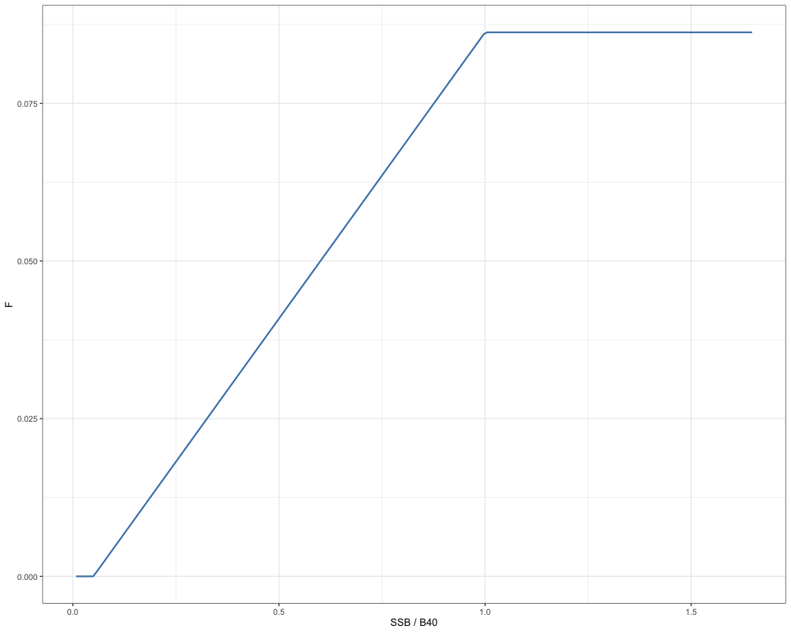
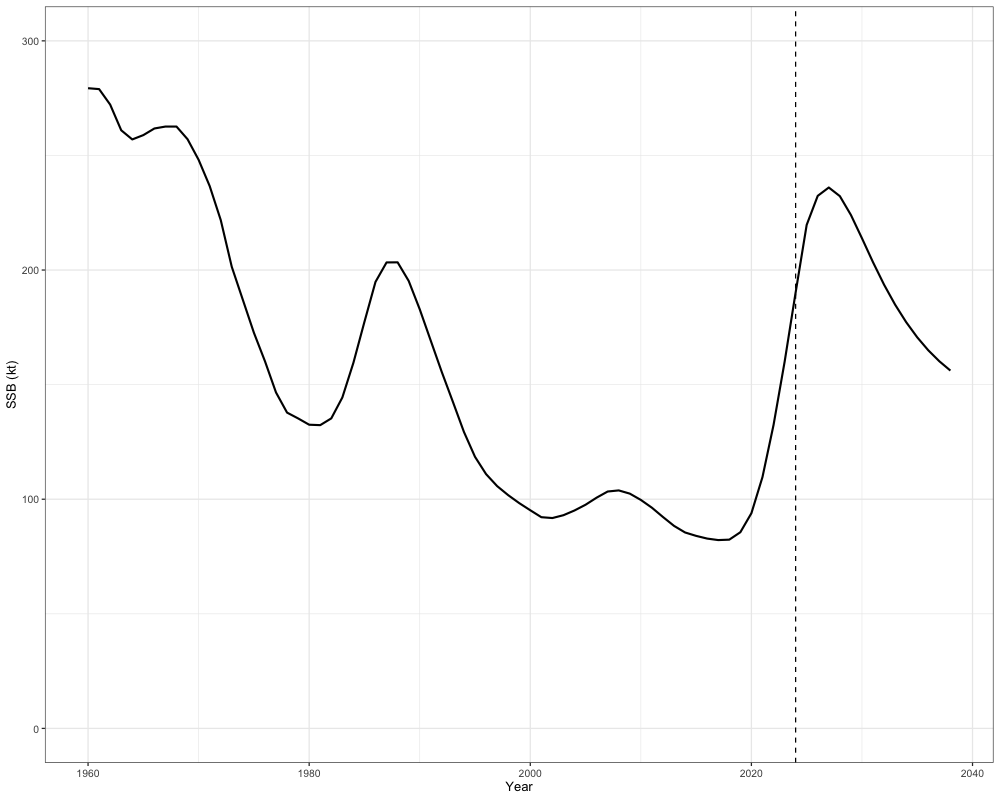
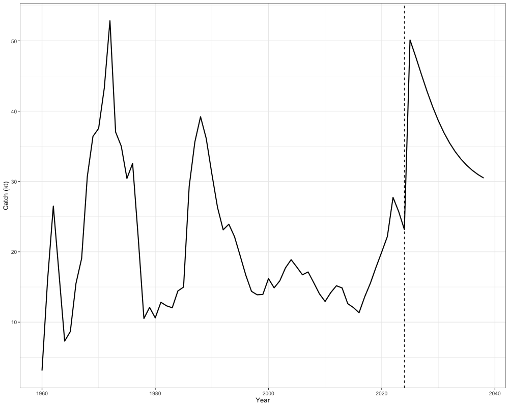
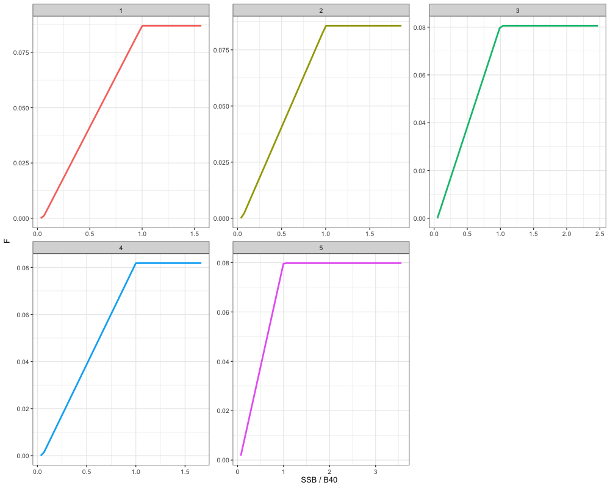
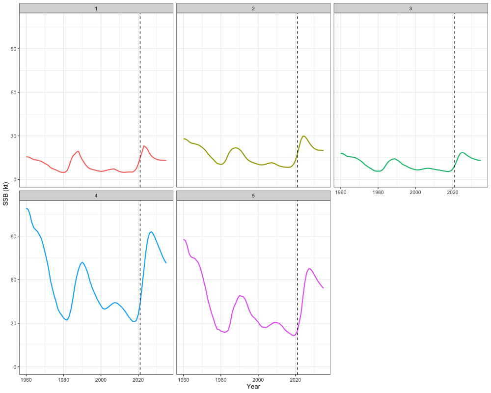
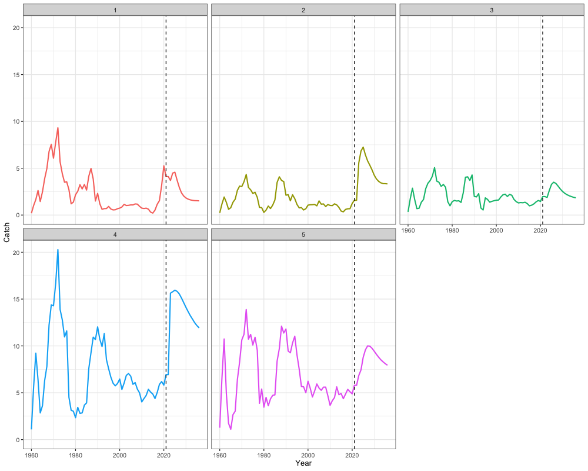
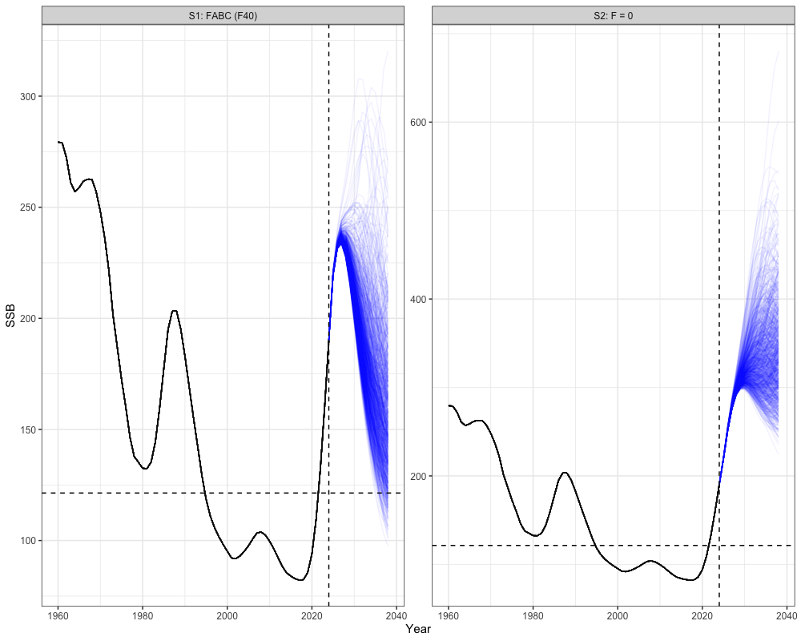
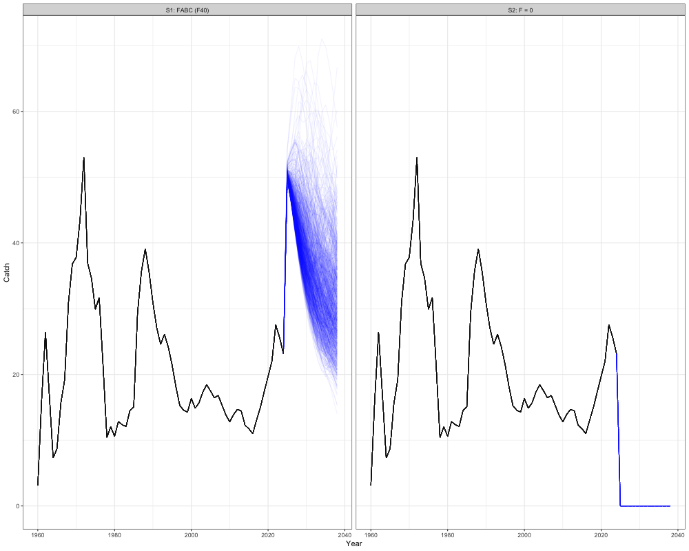

# Deriving Reference Points, Catch Advice, and Projections

``` r
# Load in packages
library(SPoRC) 
library(here)
library(RTMB)
library(ggplot2)
library(dplyr)
library(tidyr)
library(purrr)
```

Several options exist for deriving management reference points and catch
advice in `SPoRC`. In this vignette, we will first discuss the
mathematical details for deriving different management reference points,
and then demonstrate how catch advice might be developed with estimated
reference points.

### Reference Points

Deriving reference points in SPoRC is generally divided into
single-region and multi-region reference points, along with spawning
potential ratio ($SPR$) and maximum sustainable yield ($MSY$) reference
points. In the following, we will discuss the mathematical details
pertaining to these key management quantities.

#### Single Region

Single-region reference points can currently be derived for $SPR$
reference points, which estimate the fishing mortality rate that reduces
spawning biomass per recruit ($SSBPR$) to $x\%\ $of the unfished level.
Additionally, $MSY$ reference points based on a Beverton-Holt
relationship, which estimate the fishing mortality rate that maximizes
long-term yield, can also be derived if density-dependence is assumed.

##### Spawning Potential Ratio

To derive $SPR$ reference points, a target percentage must be specified,
representing the $SSBPR$ under fishing relative to the unfished level.
Following that, several additional quantities are needed to compute
these reference points. These include:

- the relative fishing mortality between fishery fleets
  ($Frat_{f} = Fmort_{y = n_{y},f}/\sum_{f}^{}{Fmort_{y = n_{y},f}}$),
- fleet-specific fishery selectivity
  ($\text{Sel}_{y = y^{*}a,s,f}^{\text{Fsh}}$),
- natural mortality for females ($\text{Natmort}_{y = y^{*},a,s = 1}$),
- spawning weight at age for females ($W_{y = y^{*},a,s = 1}^{spawn}$),
- maturity at age for females ($Mat_{y = y^{*},a,s = 1}$),
- spawn timing ($t^{spwn}$),
- estimated recruitment values (${Rec}_{y,s}$),
- the female recruitment sex ratio ($\psi_{y = y^{*},s = 1}$),
- recruitment age ($RecAge$), and
- the first year in the recruitment vector ($RecYear$) to be used for
  mean recruitment calculations.

For relative fishing mortality between fleets, the terminal year is
utilized for these calculations. In contrast, estimates based on a
user-defined period ($y^{*}$; e.g., three-year average) are used for
natural mortality, weight at age, maturity at age, and fleet-specific
selectivity.

$SPR\ $reference points are then derived by initially setting numbers
per-recruit at the female recruitment sex-ratio:

$$N_{a = 1}^{fished} = \psi_{y = y^{*},s = 1}$$

$$N_{a = 1}^{unfished} = \psi_{y = y^{*},s = 1}$$

where $N_{a = 1}^{fished}$ and $N_{a = 1}^{unfished}$ are the fished and
unfished numbers at age per-recruit, respectively. Subsequent numbers at
age per-recruit are then computed with an exponential mortality model,
where fished numbers at age per-recruit are decremented with both
natural and fishing mortality, while unfished numbers at age per-recruit
are only decremented with natural mortality. For $N_{a}^{fished}$, this
is computed as:

$$N_{a}^{\text{fished}} = \left\{ \begin{matrix}
{N_{a - 1}^{\text{fished}} \cdot \exp\left\lbrack - \left( NatMort_{y = y^{*},a - 1,s = 1} + \sum\limits_{f}^{}\text{Frat}_{f} \cdot F_{x} \cdot \text{Sel}_{y = y^{*},a - 1,s = 1,f}^{\text{Fsh}} \right) \right\rbrack} & {{\text{if}\mspace{6mu}}2 < a < a_{+}} \\
 & \\
{N_{a - 1}^{\text{fished}} \cdot \frac{\exp\left( - \left( NatMort_{y = y^{*},a_{+} - 1,s = 1} + \sum\limits_{f}^{}\text{Frat}_{f} \cdot F_{x} \cdot \text{Sel}_{y = y^{*},a_{+} - 1,s = 1,f}^{\text{Fsh}} \right) \right)}{1 - exp\left( - \left( NatMort_{y = y^{*},a_{+},s = 1} + \sum\limits_{f}^{}\text{Frat}_{f} \cdot F_{x} \cdot \text{Sel}_{y = y^{*},a_{+},s = 1,f}^{\text{Fsh}} \right) \right)}} & {{\text{if}\mspace{6mu}}a = a_{+}} \\
 & 
\end{matrix} \right.\ $$

where $F_{x}$ represents the estimated fishing mortality rate that
reduces the $SSBPR$ to $x\%$, relative to the unfished level. For
$N_{a = 1}^{unfished}$, this is defined as:

$$N_{a}^{\text{unfished}} = \left\{ \begin{matrix}
{N_{a - 1}^{\text{unfished}} \cdot exp\left( - NatMort_{y = y^{*},a - 1,s = 1} \right)} & {{\text{if}\mspace{6mu}}2 < a < a_{+}} \\
 & \\
{N_{a - 1}^{\text{unfished}} \cdot \frac{\exp\left( - NatMort_{y = y^{*},a_{+} - 1,s = 1} \right)}{1 - exp\left( - NatMort_{y = y^{*},a_{+},s = 1} \right)}} & {{\text{if}\mspace{6mu}}a = a_{+}} \\
 & 
\end{matrix} \right.\ $$

$N_{a}^{\text{fished}}$ can then be converted to fished $SSBPR$
($SS{BPR}^{\text{fished}})\ $with the following equation:

$$SS{BPR}^{\text{fished}} = \sum\limits_{a}^{}N_{a}^{\text{fished}} \cdot W_{y = y^{*},a,s = 1}^{spawn} \cdot \text{Mat}_{y = y^{*},a,s = 1} \cdot exp\left( - t^{spawn} \cdot NatMort_{y = y^{*},a,s = 1} + \sum\limits_{f}^{}\text{Frat}_{f} \cdot F_{x} \cdot \text{Sel}_{y = y^{*}a,s = 1,f}^{\text{Fsh}} \right)$$

Similarly, $N_{a = 1}^{unfished}$ can be converted to unfished $SSBPR$
($SS{BPR}^{\text{unfished}})$:

$$SS{BPR}^{\text{unfished}} = \sum\limits_{a}^{}N_{a}^{\text{unfished}} \cdot W_{y = y^{*},a,s = 1}^{spawn} \cdot \text{Mat}_{y = y^{*},a,s = 1} \cdot exp\left( - t_{\text{spwn}} \cdot NatMort_{y = y^{*},a,s = 1} \right)$$

The $SPR$ rate can then be defined as the fraction of
$SS{BPR}^{\text{fished}}$ and $SS{BPR}^{\text{unfished}}$:

$$SPR = \frac{SS{BPR}^{\text{fished}}}{SS{BPR}^{\text{unfished}}}$$

$F_{x}$ can then be solved for using a non-linear function minimizer by
minimizing the following criteria:

$$F_{x} = arg\min\limits_{F}\left\{ 100 \cdot \left( \text{SPR}(F) - \text{x\%} \right)^{2} \right\}$$

Biological $SPR$-based reference points ($B_{x}$) can then be computed
as:

$$B_{x} = SS{BPR}^{\text{fished}} \cdot \frac{\sum\limits_{RecYear}^{n_{y} - RecAge}{Rec}_{y,s}}{n_{y} - RecAge - RecYear}$$

where $SS{BPR}^{\text{fished}}\ $is multiplied by mean recruitment over
a user-defined period (i.e., $n_{y} - RecAge - RecYear$).

##### Maximum Sustainable Yield (Beverton-Holt)

Deriving $MSY$ based reference points using a Beverton-Holt stock
recruitment relationship involves maximizing the equilibrium yield per
recruit ($YPR$) and requires several additional inputs. These inputs
include:

- the relative fishing mortality between fishery fleets
  ($Frat_{f} = Fmort_{y = n_{y},f}/\sum_{f}^{}{Fmort_{y = n_{y},f}}$),
- fleet-specific fishery selectivity
  ($\text{Sel}_{y = y^{*}a,s,f}^{\text{Fsh}}$),
- natural mortality for females ($\text{Natmort}_{y = y^{*},a,s = 1}$),
- spawning weight at age for females ($W_{y = y^{*},a,s = 1}^{spawn}$),
- maturity at age for females ($Mat_{y = y^{*},a,s = 1}$),
- spawn timing ($t^{spawn})$,
- estimated recruitment values (${Rec}_{y,s}$),
- the female recruitment sex ratio ($\psi_{y = y^{*},s = 1}$),
- an estimate of virgin recruitment ($\mu^{Rec}$), and
- an estimate of steepness ($h$).

$MSY$ reference points can then be derived using the standard
per-recruit calculations, where the initial number of fished and
unfished individuals are set at the female recruitment sex ratio:

$$N_{a = 1}^{fished} = \psi_{y = y^{*},s = 1}$$

$$N_{a = 1}^{unfished} = \psi_{y = y^{*},s = 1}$$

The numbers-at-age can then be decremented following an exponential
mortality model. For $N_{a = 1}^{fished}$, this is given by:

$$N_{a}^{\text{fished}} = \left\{ \begin{matrix}
{N_{a - 1}^{\text{fished}} \cdot \exp\left\lbrack - \left( NatMort_{y = y^{*},a - 1,s = 1} + \sum\limits_{f}^{}\text{Frat}_{f} \cdot F_{msy} \cdot \text{Sel}_{y = y^{*},a - 1,s = 1,f}^{\text{Fsh}} \right) \right\rbrack} & {{\text{if}\mspace{6mu}}2 < a < a_{+}} \\
 & \\
{N_{a - 1}^{\text{fished}} \cdot \frac{\exp\left( - \left( NatMort_{y = y^{*},a_{+} - 1,s = 1} + \sum\limits_{f}^{}\text{Frat}_{f} \cdot F_{msy} \cdot \text{Sel}_{y = y^{*},a_{+} - 1,s = 1,f}^{\text{Fsh}} \right) \right)}{1 - exp\left( - \left( NatMort_{y = y^{*},a_{+},s = 1} + \sum\limits_{f}^{}\text{Frat}_{f} \cdot F_{msy} \cdot \text{Sel}_{y = y^{*},a_{+},s = 1,f}^{\text{Fsh}} \right) \right)}} & {{\text{if}\mspace{6mu}}a = a_{+}} \\
 & 
\end{matrix} \right.\ $$

where $F_{msy}$ here represents the fishing mortality that would result
in equilibrium yield being maximized. For $N_{a = 1}^{unfished}$, this
is defined as:

$$N_{a}^{\text{unfished}} = \left\{ \begin{matrix}
{N_{a - 1}^{\text{unfished}} \cdot exp\left( - NatMort_{y = y^{*},a - 1,s = 1} \right)} & {{\text{if}\mspace{6mu}}2 < a < a_{+}} \\
 & \\
{N_{a - 1}^{\text{unfished}} \cdot \frac{\exp\left( - NatMort_{y = y^{*},a_{+} - 1,s = 1} \right)}{1 - exp\left( - NatMort_{y = y^{*},a_{+},s = 1} \right)}} & {{\text{if}\mspace{6mu}}a = a_{+}} \\
 & 
\end{matrix} \right.\ $$

$YPR$ is then computed using Baranov’s catch equation:

$$C_{a} = \frac{\sum\limits_{f}^{}\text{Frat}_{f} \cdot F_{\text{msy}} \cdot \text{Sel}_{y = y^{*},a,s = 1,f}^{\text{Fsh}}}{\left( NatMort_{y = y^{*},a,s = 1} + \sum\limits_{f}^{}\text{Frat}_{f} \cdot F_{\text{msy}} \cdot \text{Sel}_{y = y^{*},a,s = 1,f}^{\text{Fsh}} \right)} \cdot N_{a}^{\text{fished}} \cdot \left( 1 - exp\left\lbrack - \left( NatMort_{y = y^{*},a,s = 1} + \sum\limits_{f}^{}\text{Frat}_{f} \cdot F_{\text{msy}} \cdot \text{Sel}_{y = y^{*},a,s = 1,f}^{\text{Fsh}} \right) \right\rbrack \right)$$

where $C_{a}$ is the catch-at-age per-recruit resulting from Baranov’s
catch equation. Equilibrium recruitment can then computed using the
Beverton-Holt stock recruitment relationship. Estimates of equilibrium
recruitment are needed to convert per-recruit quantities to yield and
$B_{msy}$ (the biomass that would achieve $MSY$). Here, we first
$SS{BPR}^{\text{fished}}$ and $SS{BPR}^{\text{unfished}}$, which are
necessary quantities in the Beverton-Holt stock recruitment
relationship:

$$SS{BPR}^{\text{fished}} = \sum\limits_{a}^{}N_{a}^{\text{fished}} \cdot W_{y = y^{*},a,s = 1}^{spawn} \cdot \text{Mat}_{y = y^{*},a,s = 1} \cdot exp\left( - t^{spawn} \cdot NatMort_{y = y^{*},a,s = 1} + \sum\limits_{f}^{}\text{Frat}_{f} \cdot F_{msy} \cdot \text{Sel}_{y = y^{*}a,s = 1,f}^{\text{Fsh}} \right)$$

$$SS{BPR}^{\text{unfished}} = \sum\limits_{a}^{}N_{a}^{\text{unfished}} \cdot W_{y = y^{*},a,s = 1}^{spawn} \cdot \text{Mat}_{y = y^{*},a,s = 1} \cdot exp\left( - t_{\text{spwn}} \cdot NatMort_{y = y^{*},a,s = 1} \right)$$

Equilibrium recruitment ($EqRec$) can then be derived with the following
equation:

$$EqRec = \frac{4 \cdot h \cdot \mu^{Rec} \cdot SS{BPR}^{\text{fished}}}{SS{BPR}^{\text{unfished}} \cdot (1 - h) + SS{BPR}^{\text{fished}} \cdot (5 \cdot h - 1)}$$

Yield and $B_{msy}$ is then derived by multiplying the $YPR\ $and
$SS{BPR}^{\text{fished}}$ by an estimate of equilibrium recruitment:

$$Yield = \sum\limits_{a}^{}C_{a} \cdot W_{y = y^{*},a,s = 1}^{spawn} \cdot EqRec$$

$$B_{msy} = SS{BPR}^{\text{fished}} \cdot EqRec$$

Lastly, $F_{msy}$ is solved for using a non-linear function minimizer by
minimizing the following criteria (maximizing yield):

$$F_{msy} = arg\min\limits_{F}\ Yield$$

#### Multi-Region

In general, multi region reference points can be computed in a similar
manner as single region reference points. The additional complication
when calculating spatial reference points includes the additional region
subscript for all quantities, as well as the potential need to account
for movement processes.

##### Spawning Potential Ratio

###### Independent

In the case where independent spatial regions are assumed (i.e., no
movement occurs among regions), $SPR$ rates can be calculated
independently for each region, which results in region-specific
$F_{r,x}$ and $B_{r,x}$ estimates. All calculations are derived in the
same manner as computing $SPR$ rates in the single region case, with the
exception that an additional subscript is added to all demographic
rates. Following that, $F_{r,x}$ can then be solved for by minimizing
the following criteria for each region:

$$F_{r,x} = arg\min\limits_{F_{r}}\left\{ 100 \cdot \left( \text{SPR}\left( F_{r} \right) - x\%\  \right)^{2} \right\}$$

Regional biological $SPR$-based reference points ($B_{x}$) can then be
derived by multiplying $SS{BPR}_{r}^{\text{fished}}$ by regional mean
recruitment over a user-defined period and the recruitment sex-ratio:

$$B_{r,x} = SS{BPR}_{r}^{\text{fished}} \cdot \sum\limits_{r}\frac{\sum\limits_{RecYear}^{n_{y} - RecAge}{Rec}_{r,y,s}}{n_{y} - RecAge - RecYear}$$

###### Global

In contrast to computing reference points when assuming independent
spatial dynamics, $SPR$ rates can also be computed globally, where
movement occurs among regions. Given the assumption of global $SPR$
rates, this results in a global $F_{x}$ estimate, but regional estimates
of $B_{r,x}$ because mean recruitment estimates are defined on a
regional scale. Thus, the global $SPR$ solution results in a $F_{x}$
that reduces the global $SSBPR$ to $x\%$ of its unfished value, such
that the aggregate spawning biomass reaches equilibrium at
$\sum_{r}^{}B_{r,x}$ if applied over the long-term. However, this
solution does not result in each region equilibrating at $B_{r,x}$. Note
that the same value of $F_{x}$ is applied to each region in the global
$SPR$ case.

Deriving global $SPR$ reference points requires a different set of
inputs. These include:

- the relative fishing mortality between fishery fleets
  ($Frat_{r,f} = Fmort_{r,y = n_{y},f}/\sum_{f}^{}{Fmort_{r,y = n_{y},f}}$),
- fleet-specific fishery selectivity
  ($\text{Sel}_{r,y = y^{*}a,s,f}^{\text{Fsh}}$),
- natural mortality for females
  ($\text{Natmort}_{r,y = y^{*},a,s = 1}$),
- spawning weight at age for females
  ($W_{r,y = y^{*},a,s = 1}^{spawn}$),
- maturity at age for females ($Mat_{r,y = y^{*},a,s = 1}$),
- a matrix of movement values ($\mathbf{M}_{y = y^{*},\, a,\, s = 1}$),
- spawn timing ($t^{spwn}$),
- estimated recruitment values (${Rec}_{r,y,s}$),
- the female recruitment sex ratio ($\psi_{r,y = y^{*},s = 1}$),
- the recruitment proportions (apportionment) by area ($\zeta_{r}$),
- recruitment age ($RecAge$), and
- the first year in the recruitment vector ($RecYear$) to be used for
  mean recruitment calculations.

Global $SPR$ reference points are calculated by first setting the
regional numbers-at-age per-recruit model to the estimated recruitment
apportionment parameters ($\zeta_{r}$) multiplied by the recruitment sex
ratio, which sum to 1:

$$N_{r,a = 1}^{\text{fished}} = \zeta_{r} \cdot \psi_{r,y = y^{*},s = 1}$$

$$N_{r,a = 1}^{\text{unfished}} = \zeta_{r} \cdot \psi_{r,y = y^{*},s = 1}$$

where $N_{r,a = 1}^{\text{fished}}$ and $N_{r,a = 1}^{\text{unfished}}$
are the regional numbers-at-age per-recruit under fished and unfished
conditions, respectively. Following the initialization of these
quantities, movement dynamics are then applied:

$$\mathbf{N}_{a}^{\text{fished}} = \left( \mathbf{N}_{a}^{\text{fished}} \right)^{\top}\mathbf{M}_{y = y^{*},a,s = 1}\quad{\text{for}\mspace{6mu}}a = a_{\min},\ldots,A,\quad a_{\min} = \left\{ \begin{matrix}
1 & \text{if recruits move} \\
2 & \text{otherwise} \\
 & 
\end{matrix} \right.\ $$

$$\mathbf{N}_{a}^{\text{unfished}} = \left( \mathbf{N}_{a}^{\text{unfished}} \right)^{\top}\mathbf{M}_{y = y^{*},a,s = 1}\quad{\text{for}\mspace{6mu}}a = a_{\min},\ldots,A,\quad a_{\min} = \left\{ \begin{matrix}
1 & \text{if recruits move} \\
2 & \text{otherwise} \\
 & 
\end{matrix} \right.\ $$

In the above expressions, $A$ denotes the number of modeled ages
($a_{+}$) multiplied by 10. For example, if 30 ages are modeled, then
$A = 300$. This extension enables iterative propagation of the plus
group under movement. For $a \geq a_{+}$, all demographic and fishery
quantities are held constant at the values for the last modeled age
($a_{+}$). Following the application of movement, an exponential
mortality model is then applied. $N_{r,a}^{fished}$ is expressed as:

$$N_{r,a}^{\text{fished}} = {N_{r,a - 1}^{fished} \cdot exp}\begin{matrix}
\left\lbrack - \left( NatMort_{r,y = y^{*},a - 1,s = 1} + \sum\limits_{f}^{}\text{Frat}_{r,f} \cdot F_{x} \cdot \text{Sel}_{r,y = y^{*},a - 1,s = 1,f}^{\text{Fsh}} \right) \right\rbrack \\
{{\text{if}\mspace{6mu}}2 < a < A} \\

\end{matrix}$$

For $N_{r,a}^{\text{unfished}}$, this is given by:

$$N_{r,a}^{\text{un}\text{fished}} = {N_{r,a - 1}^{unfished} \cdot exp}\begin{matrix}
{\left\lbrack - \left( NatMort_{r,y = y^{*},a - 1,s = 1} \right) \right\rbrack,\ \ \ {\text{if}\mspace{6mu}}2 < a < A} \\

\end{matrix}$$

Regional fished and unfished numbers-at-age per-recruit can then be
converted to *SSBPR* quantities. For regional fished *SSBPR*
($SS{BPR}_{r}^{\text{fished}})$, this is written as:

$$SS{BPR}_{r}^{\text{fished}} = \sum\limits_{a}^{}N_{r,a}^{\text{fished}} \cdot W_{r,y = y^{*},a,s = 1}^{spawn} \cdot \text{Mat}_{r,y = y^{*},a,s = 1} \cdot exp\left( - t^{spawn} \cdot NatMort_{r,y = y^{*},a,s = 1} + \sum\limits_{f}^{}\text{Frat}_{r,f} \cdot F_{x} \cdot \text{Sel}_{r,y = y^{*}a,s = 1,f}^{\text{Fsh}} \right)$$

Regional unfished $SSBPR$ ($SS{BPR}_{r}^{\text{unfished}})$ is computed
in a similar manner:

$$SS{BPR}_{r}^{\text{unfished}} = \sum\limits_{a}^{}N_{r,a}^{\text{unfished}} \cdot W_{r,y = y^{*},a,s = 1}^{spawn} \cdot \text{Mat}_{r,y = y^{*},a,s = 1} \cdot exp\left( - t_{\text{spwn}} \cdot NatMort_{r,y = y^{*},a,s = 1} \right)$$

The global $SPR$ rate is then defined as:

$$SPR = \frac{\sum\limits_{r}^{}{SS{BPR}_{r}^{\text{fished}}}}{\sum\limits_{r}^{}{SS{BPR}_{r}^{\text{unfished}}}}$$

$F_{x}$ can then be solved for using a non-linear function minimizer by
minimizing the following criteria for global $SPR$:

$$F_{x} = arg\min\limits_{F}\left\{ 100 \cdot \left( \text{SPR}(F) - \text{x\%} \right)^{2} \right\}$$

Biological $SPR$-based reference points are assumed to be regional
($B_{r,x}$) and are derived by multiplying $SS{BPR}_{r}^{\text{fished}}$
by regional mean recruitment over a user-defined period:

$$B_{r,x} = SS{BPR}_{r}^{\text{fished}} \cdot \frac{\sum\limits_{RecYear}^{n_{y} - RecAge}{Rec}_{r,y,s}}{n_{y} - RecAge - RecYear}$$

Thus, the global $SPR$ calculations result in a global $F_{x}$ and
regional $B_{r,x}$ estimates.

##### Maximum Sustainable Yield (Beverton-Holt)

Similar to deriving spatial reference points for $SPR$ rates,
$MSY$-based reference points assuming a Beverton-Holt stock recruitment
relationship can be derived either assuming independent populations
without movement or a global population with movement processes
incorporated. In cases where density-dependence is defined locally
(i.e., area-specific stock-recruitment curves), local $MSY$-based
reference points can also be derived (Kapur et al., 2021).

###### Independent

In the case where independent spatial regions are assumed,
region-specific $F_{r,msy}$ and $B_{r,msy}$ estimates can be obtained.
In general, all calculations are derived in the same manner as equations
described for computing $MSY$ in a single region case, with the
exception that demographic rates and fishery selectivity additionally
include a region subscript. Notably, in these calculations, virgin
recruitment is considered to be regional to compute equilibrium
recruitment and is derived in the following manner:

$$\mu_{r}^{Rec} = \mu^{Rec}\zeta_{r}$$

$${EqRec}_{r} = \frac{4 \cdot h_{r} \cdot \mu_{r}^{Rec} \cdot SS{BPR}_{r}^{\text{fished}}}{SS{BPR}_{r}^{\text{unfished}} \cdot \left( 1 - h_{r} \right) + SS{BPR}_{r}^{\text{fished}} \cdot \left( 5 \cdot h_{r} - 1 \right)}$$

$F_{r,msy}$ can then be solved for by minimizing (maximizing) yield for
each region independently:

$$F_{r,msy} = arg\min\limits_{F_{r}}\ Yield_{r}$$

and $B_{r,msy}$ can then be written as:

$$B_{r,msy} = SS{BPR}_{r}^{fished}{EqRec}_{r}$$

###### Global

In a spatial context, global $MSY$ explicitly accounts for movement
dynamics and results in a global $F_{msy}$ estimate, but regional
estiamtes of $B_{r,msy}$ because recruitment parameters are defined
regionally. Thus, global $MSY$ results in a reference point that
achieves $\sum_{r}^{}B_{r,msy}$ for the entire population if $F_{msy}$
is applied to each region, but does not ensure that each region
equilibrates at $B_{r,msy}$.

The following inputs are required for computing global $MSY$:

- the relative fishing mortality between fishery fleets
  ($Frat_{r,f} = Fmort_{r,y = n_{y},f}/\sum_{f}^{}{Fmort_{r,y = n_{y},f}}$),
- fleet-specific fishery selectivity
  ($\text{Sel}_{r,y = y^{*}a,s,f}^{\text{Fsh}}$),
- natural mortality for females
  ($\text{Natmort}_{r,y = y^{*},a,s = 1}$),
- spawning weight at age for females
  ($W_{r,y = y^{*},a,s = 1}^{spawn}$),
- maturity at age for females ($Mat_{r,y = y^{*},a,s = 1}$),
- a matrix of movement values ($\mathbf{M}_{y = y^{*},\, a,\, s = 1}$),
- spawn timing ($t^{spwn}$),
- the female recruitment sex ratio ($\psi_{r,y = y^{*},s = 1}$),
- an estimate of virgin recruitment ($\mu^{Rec}$),
- the global steepness value to be used, which is taken as the mean
  across all regions if steepness is estimated to be regional,
  consistent with the definitions of global density dependence
  ($h = \frac{\sum_{r}^{}h_{r}}{n_{r}}$), and
- the recruitment proportions (apportionment) by area ($\zeta_{r}$).

Using the standard per-recruit computations, global $MSY$ reference
points are calculated by first setting the regional numbers-at-age
per-recruit equal to the estimated recruitment apportionment parameters
($\zeta_{r}$) multiplied by the female recruitment sex ratio, which sum
to 1:

$$N_{r,a = 1}^{\text{fished}} = \zeta_{r} \cdot \psi_{r,y = y^{*},s = 1}$$

$$N_{r,a = 1}^{\text{unfished}} = \zeta_{r} \cdot \psi_{r,y = y^{*},s = 1}$$

After the numbers-at-age per-recruit quantities are initialized,
Markovian movement dynamics are applied:

$$\mathbf{N}_{a}^{\text{fished}} = \left( \mathbf{N}_{a}^{\text{fished}} \right)^{\top}\mathbf{M}_{y = y^{*},a,s = 1}\quad{\text{for}\mspace{6mu}}a = a_{\min},\ldots,A,\quad a_{\min} = \left\{ \begin{matrix}
1 & \text{if recruits move} \\
2 & \text{otherwise} \\
 & 
\end{matrix} \right.\ $$

$$\mathbf{N}_{a}^{\text{unfished}} = \left( \mathbf{N}_{a}^{\text{unfished}} \right)^{\top}\mathbf{M}_{y = y^{*},a,s = 1}\quad{\text{for}\mspace{6mu}}a = a_{\min},\ldots,A,\quad a_{\min} = \left\{ \begin{matrix}
1 & \text{if recruits move} \\
2 & \text{otherwise} \\
 & 
\end{matrix} \right.\ $$

$N_{r,a}^{fished}$ can then be projected forward as:

$$N_{r,a}^{\text{fished}} = {N_{r,a - 1}^{fished} \cdot exp}\begin{matrix}
\left\lbrack - \left( NatMort_{r,y = y^{*},a - 1,s = 1} + \sum\limits_{f}^{}\text{Frat}_{r,f} \cdot F_{msy} \cdot \text{Sel}_{r,y = y^{*},a - 1,s = 1,f}^{\text{Fsh}} \right) \right\rbrack \\
{{\text{if}\mspace{6mu}}2 < a < A} \\

\end{matrix}$$

For $N_{r,a}^{\text{unfished}}$, this is given by:

$$N_{r,a}^{\text{un}\text{fished}} = {N_{r,a - 1}^{unfished} \cdot exp}\begin{matrix}
{\left\lbrack - \left( NatMort_{r,y = y^{*},a - 1,s = 1} \right) \right\rbrack,\ \ \ {\text{if}\mspace{6mu}}2 < a < A} \\

\end{matrix}$$

Baranov’s catch equation is then invoked to compute regional $YPR$:

$$C_{r,a} = \frac{\sum\limits_{f}^{}\text{Frat}_{r,f} \cdot F_{\text{msy}} \cdot \text{Sel}_{r,y = y^{*},a,s = 1,f}^{\text{Fsh}}}{\left( NatMort_{r,y = y^{*},a,s = 1} + \sum\limits_{f}^{}\text{Frat}_{r,f} \cdot F_{\text{msy}} \cdot \text{Sel}_{r,y = y^{*},a,s = 1,f}^{\text{Fsh}} \right)} \cdot N_{r,a}^{\text{fished}} \cdot \left( 1 - exp\left\lbrack - \left( NatMort_{r,y = y^{*},a,s = 1} + \sum\limits_{f}^{}\text{Frat}_{r,f} \cdot F_{\text{msy}} \cdot \text{Sel}_{r,y = y^{*},a,s = 1,f}^{\text{Fsh}} \right) \right\rbrack \right)$$

Regional equilibrium recruitment is then computed using the
Beverton-Holt stock recruitment relationship. To first derive these
quantities, regional fished and unfished numbers-at-age per-recruit need
to be converted to *SSBPR* quantities. For regional fished *SSBPR*
($SS{BPR}_{r}^{\text{fished}})$, this is written as:

$$SS{BPR}_{r}^{\text{fished}} = \sum\limits_{a}^{}N_{r,a}^{\text{fished}} \cdot W_{r,y = y^{*},a,s = 1}^{spawn} \cdot \text{Mat}_{r,y = y^{*},a,s = 1} \cdot exp\left( - t^{spawn} \cdot NatMort_{r,y = y^{*},a,s = 1} + \sum\limits_{f}^{}\text{Frat}_{r,f} \cdot F_{msy} \cdot \text{Sel}_{r,y = y^{*}a,s = 1,f}^{\text{Fsh}} \right)$$

Regional unfished $SSBPR$ ($SS{BPR}_{r}^{\text{unfished}})$ is computed
in a similar manner:

$$SS{BPR}_{r}^{\text{unfished}} = \sum\limits_{a}^{}N_{r,a}^{\text{unfished}} \cdot W_{r,y = y^{*},a,s = 1}^{spawn} \cdot \text{Mat}_{r,y = y^{*},a,s = 1} \cdot exp\left( - t_{\text{spwn}} \cdot NatMort_{r,y = y^{*},a,s = 1} \right)$$

Calculations for equilibrium recruitment then follow as:

$${EqRec}_{r} = \frac{4 \cdot h \cdot \mu^{Rec}\zeta_{r} \cdot \sum\limits_{r}^{}{SS{BPR}_{r}^{\text{fished}}}}{\sum\limits_{r}^{}{SS{BPR}_{r}^{\text{un}\text{fished}}} \cdot (1 - h) + \sum\limits_{r}^{}{SS{BPR}_{r}^{\text{fished}}} \cdot (5 \cdot h - 1)}$$

Yield and $B_{r,msy}$ are calculated as:

$${Yield = \sum\limits_{a}^{}{\sum\limits_{r}^{}C_{r,a}} \cdot W_{r,y = y^{*},a,s = 1}^{spawn} \cdot {EqRec}_{r}}{B_{r,msy} = SS{BPR}_{r}^{\text{fished}} \cdot \sum\limits_{r}{EqRec}_{r}}$$

$F_{msy}$ can then be solved for using the following:

$$F_{msy} = arg\min\limits_{F}\ Yield$$

where the system wide yield is minimized (or maximized).

###### Local

A key challenge in estimating local spatial reference points (i.e.,
meta-population dynamics) is that combinations of local fishing
mortality rates can sometimes be non-identifiable, because multiple
combinations of local reference points can produce similar solutions.
However, as highlighted by Kapur et al., 2021, local spatial reference
points under density-dependence can potentially be estimated by tracking
area-specific yields resulting from a single recruit in each spawning
area. This allows the yield surface to be defined and can be used to
compute local reference points such as $F_{r,msy}$ and $B_{r,msy}$.

The following inputs are required for computing local $MSY$:

- the relative fishing mortality between fishery fleets
  ($Frat_{r,f} = Fmort_{r,y = n_{y},f}/\sum_{f}^{}{Fmort_{r,y = n_{y},f}}$),
- fleet-specific fishery selectivity
  ($\text{Sel}_{r,y = y^{*}a,s,f}^{\text{Fsh}}$),
- natural mortality for females
  ($\text{Natmort}_{r,y = y^{*},a,s = 1}$),
- spawning weight at age for females
  ($W_{r,y = y^{*},a,s = 1}^{spawn}$),
- maturity at age for females ($Mat_{r,y = y^{*},a,s = 1}$),
- a matrix of movement values ($\mathbf{M}_{y = y^{*},\, a,\, s = 1}$),
- spawn timing ($t^{spwn}$),
- the female recruitment sex ratio ($\psi_{r,y = y^{*},s = 1}$),
- an estimate of global virgin recruitment ($\mu^{Rec}$),
- the local steepness value to be used ($h_{r}$),
- the recruitment proportions (apportionment) by area ($\zeta_{r}$),
  which partitions out the estimate of global virgin recruitment.

To ensure identifiability, quantities are tracked by origin region ($o$)
and destination region ($r$). Using standard per-recruit calculations,
each region is initialized with one female recruit (i.e., the
recruitment sex ratio):

$$N_{o,r,a = 1}^{\text{fished}} = \left\{ \begin{matrix}
{\psi_{r,y = y^{*},s = 1},\ \ \ ifo = r} \\
{0,\ \ \ ifo\  \neq r} \\

\end{matrix} \right.\ ,\ \ N_{o,r,a = 1}^{\text{un}\text{fished}} = \left\{ \begin{matrix}
{\psi_{r,y = y^{*},s = 1},\ \ \ ifo = r} \\
{0,\ \ \ ifo\  \neq r} \\

\end{matrix} \right.\ $$

Markovian movement dynamics are then applied:

$$\mathbf{N}_{o,a}^{\text{fished}} = \left( \mathbf{N}_{o,a}^{\text{fished}} \right)^{\top}\mathbf{M}_{y = y^{*},a,s = 1}\quad{\text{for}\mspace{6mu}}a = a_{\min},\ldots,A,\quad a_{\min} = \left\{ \begin{matrix}
1 & \text{if recruits move} \\
2 & \text{otherwise} \\
 & 
\end{matrix} \right.\ $$

$$\mathbf{N}_{o,a}^{\text{unfished}} = \left( \mathbf{N}_{o,a}^{\text{unfished}} \right)^{\top}\mathbf{M}_{y = y^{*},a,s = 1}\quad{\text{for}\mspace{6mu}}a = a_{\min},\ldots,A,\quad a_{\min} = \left\{ \begin{matrix}
1 & \text{if recruits move} \\
2 & \text{otherwise} \\
 & 
\end{matrix} \right.\ $$

$N_{o,d,a}^{fished}$ can then be projected forward as:

$$N_{o,r,a}^{\text{fished}} = {N_{o,r,a - 1}^{fished} \cdot exp}\begin{matrix}
\left\lbrack - \left( NatMort_{r,y = y^{*},a - 1,s = 1} + \sum\limits_{f}^{}\text{Frat}_{r,f} \cdot F_{r,msy} \cdot \text{Sel}_{r,y = y^{*},a - 1,s = 1,f}^{\text{Fsh}} \right) \right\rbrack \\
{{\text{if}\mspace{6mu}}2 < a < A} \\

\end{matrix}$$

For $N_{o,r,a}^{\text{unfished}}$, this is given by:

$$N_{o,r,a}^{\text{un}\text{fished}} = {N_{o,r,a - 1}^{unfished} \cdot exp}\begin{matrix}
{\left\lbrack - \left( NatMort_{r,y = y^{*},a - 1,s = 1} \right) \right\rbrack,\ \ \ {\text{if}\mspace{6mu}}2 < a < A} \\

\end{matrix}$$

Using Baranov’s catch equation, area-specific $YPR$ can be calculated
as:

$$C_{o,r,a} = \frac{\sum\limits_{f}^{}\text{Frat}_{r,f} \cdot F_{r,msy} \cdot \text{Sel}_{r,y = y^{*},a,s = 1,f}^{\text{Fsh}}}{\left( NatMort_{r,y = y^{*},a,s = 1} + \sum\limits_{f}^{}\text{Frat}_{r,f} \cdot F_{r,msy} \cdot \text{Sel}_{r,y = y^{*},a,s = 1,f}^{\text{Fsh}} \right)} \cdot N_{o,r,a}^{\text{fished}} \cdot \left( 1 - exp\left\lbrack - \left( NatMort_{r,y = y^{*},a,s = 1} + \sum\limits_{f}^{}\text{Frat}_{r,f} \cdot F_{\text{msy}} \cdot \text{Sel}_{r,y = y^{*},a,s = 1,f}^{\text{Fsh}} \right) \right\rbrack \right)$$

Regional equilibrium recruitment in each destination is computed by
solving a non-linear Beverton-Holt stock-recruitment relationship that
ensures internal consistency. To derive these quantities, regional
fished and unfished numbers-at-age per-recruit are converted to *SSBPR*
quantities. For regional fished *SSBPR*
($SS{BPR}_{o,r}^{\text{fished}})$, this is written as:

$$SS{BPR}_{o,r}^{\text{fished}} = \sum\limits_{a}^{}N_{o,r,a}^{\text{fished}} \cdot W_{r,y = y^{*},a,s = 1}^{spawn} \cdot \text{Mat}_{r,y = y^{*},a,s = 1} \cdot exp\left( - t^{spawn} \cdot NatMort_{r,y = y^{*},a,s = 1} + \sum\limits_{f}^{}\text{Frat}_{r,f} \cdot F_{msy} \cdot \text{Sel}_{r,y = y^{*}a,s = 1,f}^{\text{Fsh}} \right)$$

Regional unfished $SSBPR$ ($SS{BPR}_{o,r}^{\text{unfished}})$ is
computed in a similar manner:

$$SS{BPR}_{o,r}^{\text{unfished}} = \sum\limits_{a}^{}N_{o,r,a}^{\text{unfished}} \cdot W_{r,y = y^{*},a,s = 1}^{spawn} \cdot \text{Mat}_{r,y = y^{*},a,s = 1} \cdot exp\left( - t_{\text{spwn}} \cdot NatMort_{r,y = y^{*},a,s = 1} \right)$$

Next, define the components of a Beverton-Holt stock recruitment
function:

$$A_{r} = 4 \cdot h_{r} \cdot \zeta_{r} \cdot \mu^{Rec}$$

$$B_{r} = \left( 1 - h_{r} \right) \cdot \ \sum\limits_{o}^{}{SS{BPR}_{o,r}^{\text{unfished}} \cdot \zeta_{r} \cdot \mu^{Rec}}$$

$$D_{r} = 5 \cdot h_{r} - 1$$

Equilibrium recruitment in the destination region (${DestEqRec}_{r}$) is
then defined as a function of contributions from all origin regions
(${OrigEqRec}_{o}$):

$${{DestEqRec}_{r} = g\left( {OrigEqRec}_{o} \right) = \frac{A_{r} \cdot EqSSB_{r}^{\text{fished}}}{B_{r} + D_{r} \cdot EqSSB_{r}^{\text{fished}}}}{EqSSB_{r}^{\text{fished}} = \sum\limits_{o}^{}{SS{BPR}_{o,r}^{\text{fished}} \cdot {OrigEqRec}_{o}}}$$

where $EqSSB_{r}^{\text{fished}}$ is the fished equilibrium $SSB$ in
destination $r$ generated by contributions from all origin regions. The
aforementioned equation is a non-linear system and does not have an
analytical solution. Thus, an iterative solution is obtained using
Newton-Raphson’s method. Although the function is expressed in terms of
destination recruitment, it is the origin recruitment that is
iteratively solved for. Specifically, Newton-Raphson’s method adjusts
${OrigEqRec}_{o}$ until the contributions from all origins result in
self-consistent ${DestEqRec}_{r}$ values.

Total yield ($Yield$) and yield in the destination region
(${Yield}_{r}$) is then defined as:

$${{Yield}_{r} = \sum\limits_{o}^{}{\left( \sum\limits_{a}^{}{C_{o,r,a}W_{r,y = y^{*},a,s = 1}^{spawn}} \right){OrigEqRec}_{o}}}{Yield = \sum\limits_{r}^{}{Yield}_{r}}$$

$$B_{r,msy} = \sum\limits_{o}^{}{SS{BPR}_{o,r}^{\text{fished}} \cdot {OrigEqRec}_{o}}$$

Lastly, regional estimates of $F_{r,msy}$ are solved for by minimizing
total yield:

$$F_{r,msy} = \arg\min\limits_{F_{r,msy}}\ Yield$$

where the system wide yield is minimized (or maximized).

## Deriving Catch Advice and Projections

A core part of the assessment process is to convert reference point
estimates into catch advice. In the following sections, we will
mathematically describe how catch advice is derived, and proceed to
provide code examples for demonstration. To conduct projection from the
terminal year, users must define the following quantities:

- Terminal year estimates of numbers-at-age,
- A user defined period of of recruitment values to use,
- A user defined period of weight-at-age values to use for projections,
- A user defined period of natural mortality-atage values to use for
  projections,
- A user defined period of maturity-at-age values to use for
  projections,
- A user defined period of fishery selectivity values to use for
  projections,
- A user defined period of movement values to use for projections,
- Terminal year estimates of fishing mortality,
- Fishing mortality rate to use to decrement the population,

Optionally, users can define:

- Biological reference points to use to project fishing mortality in the
  subsequent years, if a harvest control rule is utilized, and
- A function describing a harvest control rule.

In the first year of the projection period, projected fishing mortality
is determined with estimates of fishing mortality in the terminal year
of the assessment:

$$projF_{r,y} = \sum\limits_{f}Fmort_{r,y = term,f}$$

Total mortality can then be computed as:

$$F_{r,y,a,s,f} = projF_{r,y} \cdot Frat_{r,f} \cdot Sel_{r,y,a,s,f}^{Fsh}$$

$$Z_{r,y,a,s,f} = \sum\limits_{f}F_{r,y,a,s,f} + NatMort_{r,y,a,s}$$

Similarly, projected numbers at age in the first year utilizes estimates
of numbers at age in the terminal year of the assessment, for which
movement has already been applied. An exponential mortality model is
then used to determine the numbers at age in the next year ($y + 1$):

$$projN_{r,y,a,s} = N_{r,y = term,a,s}$$

$$\begin{array}{r}
{projN_{r,y + 1,a + 1,s} = projN_{r,y,a,s}\exp\left( - Z_{r,y,a,s} \right),\quad{\text{for}\mspace{6mu}}1 \leq a < a_{+}} \\
{projN_{r,y + 1,a,s} = projN_{r,y,a - 1,s}\exp\left( - Z_{r,y,a - 1,s} \right) + projN_{r,y,a,s}\exp\left( - Z_{r,y,a,s} \right),\quad{\text{for}\mspace{6mu}}a = a_{+}}
\end{array}$$

Quantities of spawning stock biomass can then be computed as:

$$projSSB_{r,y} = \sum\limits_{a}^{a +}projN_{r,y,a,s = 1}W_{r,y,a,s = 1}Mat_{r,y,a,s = 1}$$

Additionally, quantities of projected catch can be derived using
Baranov’s catch equation:

$$projC_{r,y,a,s,f}^{a} = \frac{Fmort_{r,y,f}Sel_{r,y,a,s,f}^{Fsh}}{Z_{r,y,a,s}}projN_{r,y,a,s}\left\lbrack 1 - \exp\left( - Z_{r,y,a,s} \right) \right\rbrack$$

$$projCatch_{r,y,f} = \sum\limits_{a}^{a_{+}}\sum\limits_{s}^{n_{s}}projC_{r,y,a,s,f}^{a}W_{r,y,a,s}$$

Fishing mortality in the next year can then be projected forward using
either a harvest control rule, or projected forward using user inputs:

$$projF_{r,y + 1} = \begin{cases}
{f\left( SSB_{r,y};BRP_{r,y};FRP_{r,y} \right)} & \text{if using a HCR} \\
{f\left( Finput_{r,y} \right)} & \text{if using a user defined fishing mortality rate}
\end{cases}$$

where $f{()}$ is a harvest control function that takes the inputs $SSB$,
$BRP$ (biological reference points), and $FRP$ (a fishery reference
point). Alternatively, $f{()}$ can be a user defined matrix of fishing
mortality rates to use during the projection period across regions.
Projected fishing mortality is then summed with natural mortaltiy to
compute the projected total mortality in a given projection year.

Recruitment dynamics are then projected in each year following the
initial projection year. In particular, several recruitment projection
options are availiable. These include both deterministic predictions as
well as the ability to incorporate stochasticity into recruitment
projections.

In particular, deterministic recruitment has the option to be projected
forward as `zero`:

$$projN_{r,y,1,s} = 0,\text{if y > 1}$$

where no recruitment occurs. Deterministic recruitment can also be
projected forward using mean recruitment (`mean_rec`) from a matrix of
estimated recruitment values from the assessment model supplied by the
user:

$$projN_{r,y,1,s} = \frac{\sum\limits_{y}Rec_{r,y}}{n},\text{if y > 1}$$

Alternatively, users can also specify a Beverton-Holt stock recruitment
function (`bh_rec`) to be used for deterministic recruitment projection,
which then requires users to supply the necessary parameter inputs. In
the case where local recruitment is specified, this is computed as
(i.e., metapopulation dynamics):

$$projN_{r,y,1,s} = \frac{4 \cdot h_{r} \cdot R_{r,0} \cdot projSSB_{r}}{SSB_{r}^{\text{unfished}} \cdot \left( 1 - h_{r} \right) + projSSB_{r} \cdot \left( 5 \cdot h_{r} - 1 \right)}$$

By contrast, if global recruitment is specified, this is computed as:

$$projN_{r,y,1,s} = \left( \frac{4 \cdot h \cdot R_{0} \cdot \sum\limits_{r}projSSB_{r}}{\sum\limits_{r}SSB_{r}^{\text{unfished}} \cdot (1 - h) + \sum\limits_{r}projSSB_{r} \cdot (5 \cdot h - 1)} \right)\zeta_{r}$$

where density-dependence occurs globally, and a recruitment
apportionment parameter is utilized to partition global recruits in a
given year.

Lastly, users can specify recruitment projections to be stochastic,
wherein an inverse Gaussian (`inv_gauss`) distribution parameterized
based on estimated recruitment values from the assessment model is
utilized to project recruitment into the future:

$$\text{AMeanRec}_{r} = \frac{1}{Y}\sum\limits_{y = avg}^{Y}\text{Rec}_{r,y}$$

$$\text{HMeanRec}_{r} = \left( \frac{1}{Y}\sum\limits_{y = avg}^{Y}\frac{1}{\text{Rec}_{r,y}} \right)^{- 1}$$

$$\gamma_{r} = \frac{\text{AMeanRec}_{r}}{\text{HMeanRec}_{r}}$$

$$\beta_{r} = \text{AMeanRec}_{r}$$

$$\delta_{r} = \frac{1}{\gamma_{r} - 1}$$

$$\text{CVRec}_{r} = \sqrt{\frac{1}{\delta_{r}}}$$

For each year a random draw is made from a standard normal distribution,
which is then transformed:

$$\psi_{y} = B_{y}^{2},\quad{\text{where}\mspace{6mu}}B_{y} \sim N(0,1)$$

$$\omega_{r,y} = \beta_{r}\left( 1 + \frac{\psi_{y} - \sqrt{4\delta_{r}\psi_{y} + \psi_{y}^{2}}}{2\delta_{r}} \right)$$

$$\zeta_{r,y} = \beta_{r}\left( 1 + \frac{\psi_{y} + \sqrt{4\delta_{r}\psi_{y} + \psi_{y}^{2}}}{2\delta_{r}} \right)$$

$$\theta_{r,y} = \frac{\beta_{r}}{\beta_{r} + \omega_{r,i}}$$

Then, a draw is conducted $\sim U(0,1)$, and simulated recruitment is
defined as:

$$\text{Rec}_{r,y}^{\text{sim}} = \begin{cases}
{\omega_{r,y},} & {{\text{if}\mspace{6mu}}U_{y} \leq \theta_{r,y}} \\
{\zeta_{r,y},} & \text{otherwise}
\end{cases}$$

Thus, this inverse gaussian mixture ensures the simulated values have
approximately the correct mean and variability based on historical
recruitment values.

After recruitment processes occur, the usual dynamics are then applied
to project the population forward. Here, movement of individuals first
occurs:

$${\mathbf{p}\mathbf{r}\mathbf{o}\mathbf{j}\mathbf{N}}_{a}^{=}\left( {\mathbf{p}\mathbf{r}\mathbf{o}\mathbf{j}\mathbf{N}}_{a} \right)^{\top}\mathbf{M}_{y,a,s}\quad{\text{for}\mspace{6mu}}a = a_{\min},\ldots,A,\quad a_{\min} = \begin{cases}
1 & \text{if recruits move} \\
2 & \text{otherwise}
\end{cases}$$

Following movement, which is only applied in projected years $y > 1$, as
it has already been accounted for in the terminal year estimates of
numbers at age, the exponential mortality model is applied. Projected
spawning stock biomass and catch are then derived. Fishing mortality in
subsequent years is updated accordingly. This sequence of steps is
repeated until the specified number of projection years is reached.
Thus, catch advice for the year following the terminal assessment year
corresponds to the projected catch in projection year 2 (i.e.,
$projCatch_{r,y = 2,f}$).

## Code Demonstration

In the subsequent sections, we will demonstrate how reference points,
catch projections, catch advice, and stochastic projections can be
derived and conducted using `SPoRC`. These features rely on users to
have a report file from a `SPoRC` model, and we have generally coded
this in a way that there is flexibility for users to define how
projections are done.

### Getting Reference Points

#### Single Region

To illustrate how reference points are derived, we begin by extracting
the report file from the single-region sablefish case study
(sgl_rg_sable_rep). We then call the Get_Reference_Points function to
calculate the reference points. In the example below, we estimate the
$F_{40}$ and $B_{40}$ values in a single-region context. This requires
passing the sablefish data file (`sgl_reg_sable_data`) to the data
argument, the report file to the rep argument, and setting the SPR rate
(`SPR_x`) to 0.4. We also specify that the reference point is SPR-based
and pertains to a single region. Additional inputs include the first
year of recruitment used for calculating $B_{40}$, the recruitment age
(which excludes the last `rec_age` years when computing the mean), the
timing of spawning, and the sex ratio used in the $B_{40}$ calculation.
Note that the sablefish example does not utilize a stock recruitment
relationship. However, if a Beverton-Holt stock recruitment relationship
is utilized and users want to estimate MSY-based reference points, this
can be derived by setting `what = 'BH_MSY'`.

``` r
data("sgl_rg_sable_rep") # read in single region report
data("sgl_rg_sable_data") # read in single region data 

# single area model
sgl_ref_pt <- SPoRC::Get_Reference_Points(data = sgl_rg_sable_data, # data file
                                          rep = sgl_rg_sable_rep, # report file
                                          SPR_x = 0.4, # spr rate
                                          type = 'single_region', # single region reference point
                                          what = 'SPR', # SPR reference point
                                          calc_rec_st_yr = 20, # first year to calculate mean recruitment
                                          rec_age = 2,  # exclues the last rec_age years when computing mean recruitment
                                          t_spwn = 0,  # spawn timing
                                          sex_ratio_f = 0.5 # recruitment sex-ratio for females
                                          )
sgl_ref_pt$f_ref_pt # F40
#> [1] 0.08625413
sgl_ref_pt$b_ref_pt # B40
#> [1] 121.3814
```

Note that the sablefish example does not utilize a stock recruitment
relationship. However, if a Beverton-Holt stock recruitment relationship
is utilized and users want to estimate MSY-based reference points, this
can be derived by setting `what = 'BH_MSY'`.

#### Multi Region

In the following, we will demonstrate how spatial reference points can
be derived. In general, this is similar to the single region case,
except that a spatial model and associated report files will be needed
(report file needs to be spatially-explicit). Again, we will use the
five-region sablefish case study as an example, where we will estimate
both independent SPR rates and global SPR rates. In contrast to the
single region case, `type` would now need to be specified as
`multi_region`. Additionally, for independent SPR rates where movement
dynamics are ignored, `what` is now set at `independent_SPR`. All the
other arguments are defined the same as the example above. Given that
these are treated as independent populations, fishery reference points
and biological reference points are region-specific and can be applied
accordingly.

``` r
data("mlt_rg_sable_rep") # read in multi region report
data("mlt_rg_sable_data") # read in multi region data 

# multi region model with independent SPR
mlt_ref_pt_indp <- Get_Reference_Points(data = mlt_rg_sable_data, # data file
                                          rep = mlt_rg_sable_rep, # report file
                                          SPR_x = 0.4, # spr rate
                                          type = 'multi_region', # multi region reference point
                                          what = 'independent_SPR', # SPR reference point
                                          calc_rec_st_yr = 20, # first year to calculate mean recruitment
                                          rec_age = 2,  # exclues the last rec_age years when computing mean recruitment
                                          t_spwn = 0,  # spawn timing
                                          sex_ratio_f = rep(0.5, mlt_rg_sable_data$n_regions) # recruitment sex-ratio for females
                                          )
mlt_ref_pt_indp$f_ref_pt # F40
#> [1] 0.08702899 0.08571633 0.08056453 0.08181050 0.07977200
mlt_ref_pt_indp$b_ref_pt # B40
#> [1] 31.93313 26.89321 20.22807 30.01715 14.03777
```

By contrast, users can also specify global SPR rates. This involves
simply changing the `what` argument to `global_SPR`, which results in a
single $F_{40}$ being estimated, but region-specific $B_{r,40}$ given
that regional estimates of recruitment are utilized. Note that the
$F_{40}$ outputs 5 values for the 5 regions modelled in the case study,
but these values are all identical.

``` r
data("mlt_rg_sable_rep") # read in multi region report
data("mlt_rg_sable_data") # read in multi region data 

# multi region model with global SPR
mlt_ref_pt_global <- SPoRC::Get_Reference_Points(data = mlt_rg_sable_data, # data file
                                                 rep = mlt_rg_sable_rep, # report file
                                                 SPR_x = 0.4, # spr rate
                                                 type = 'multi_region', # multi region reference point
                                                 what = 'global_SPR', # SPR reference point
                                                 calc_rec_st_yr = 20, # first year to calculate mean recruitment
                                                 rec_age = 2,  # exclues the last rec_age years when computing mean recruitment
                                                 t_spwn = 0,  # spawn timing
                                                 sex_ratio_f = rep(0.5, mlt_rg_sable_data$n_regions) # recruitment sex-ratio for females
                                                 )
mlt_ref_pt_global$f_ref_pt # F40
#> [1] 0.08071231 0.08071231 0.08071231 0.08071231 0.08071231
mlt_ref_pt_global$b_ref_pt # B40
#> [1]  9.452354 14.343612  9.479421 52.144410 37.689547
```

Similarly, MSY-based reference points assuming a Beverton-Holt stock
recruitment function can be specified as well. This can be easily
specified and involves either assuming independent populations
(`what = 'independent_BH_MSY'`) or a population with global density
dependence (`what = 'global_BH_MSY'`).

### Conducting Catch Projections to Derive Catch Advice (Deterministic Recruitment)

#### Single Region

Next, using the reference points derived from the single region case
study, we can conduct population and catch projections to derive catch
advice. Note that this will require users to have a data file to extract
the relevant demographic rates and data components, as well as a report
file to extract necessary estimates to conduct projections. Let us first
define a threshold harvest control rule to utilize in our population
projections, although note that this is not strictly necessary.

``` r
# Define HCR to use
HCR_function <- function(x, frp, brp, alpha = 0.05) {
  stock_status <- x / brp # define stock status
  # If stock status is > 1
  if(stock_status >= 1) f <- frp
  # If stock status is between brp and alpha
  if(stock_status > alpha && stock_status < 1) f <- frp * (stock_status - alpha) / (1 - alpha)
  # If stock status is less than alpha
  if(stock_status < alpha) f <- 0
  return(f)
}

# Create a tibble for plotting
hcr_df <- tibble(
  i = 1:200,
  SSB_B40 = i / sgl_ref_pt$b_ref_pt,
  F = sapply(i, function(x) {
    HCR_function(x = x, frp = sgl_ref_pt$f_ref_pt, brp = sgl_ref_pt$b_ref_pt)
  })
)

# Plot
ggplot(hcr_df, aes(x = SSB_B40, y = F)) +
  geom_line(color = "steelblue", size = 1) +
  labs(x = "SSB / B40", y = "F") +
  theme_bw(base_size = 13)
```



We can define all the inputs needed to run the population projection:

``` r

data("sgl_rg_sable_rep") # read in single region report
data("sgl_rg_sable_data") # read in single region data 

# Setup necessary inputs
t_spawn <- 0 # spawn timing
n_proj_yrs <- 15 # number of projection years
n_regions <- 1 # number of regions
n_ages <- length(sgl_rg_sable_data$ages) # number of ages
n_sexes <- sgl_rg_sable_data$n_sexes # number of sexes
n_fish_fleets <- sgl_rg_sable_data$n_fish_fleets # number of fishery fleets
do_recruits_move <- 0 # recruits don't move
terminal_NAA <- array(sgl_rg_sable_rep$NAA[,length(sgl_rg_sable_data$years),,], dim = c(n_regions, n_ages, n_sexes)) # terminal numbers at age
terminal_NAA0 <- array(sgl_rg_sable_rep$NAA0[,length(sgl_rg_sable_data$years),,], dim = c(n_regions, n_ages, n_sexes)) # terminal numbers at age
WAA <- array(rep(sgl_rg_sable_data$WAA[,length(sgl_rg_sable_data$years),,], each = n_proj_yrs), dim = c(n_regions, n_proj_yrs, n_ages, n_sexes)) # weight at age
WAA_fish <- array(rep(sgl_rg_sable_data$WAA[,length(sgl_rg_sable_data$years),,], each = n_proj_yrs), dim = c(n_regions, n_proj_yrs, n_ages, n_sexes, n_fish_fleets)) # weight at age for fishery
MatAA <- array(rep(sgl_rg_sable_data$MatAA[,length(sgl_rg_sable_data$years),,], each = n_proj_yrs), dim = c(n_regions, n_proj_yrs, n_ages, n_sexes)) # maturity at age
fish_sel <- array(rep(sgl_rg_sable_rep$fish_sel[,length(sgl_rg_sable_data$years),,,], each = n_proj_yrs), dim = c(n_regions, n_proj_yrs, n_ages, n_sexes, n_fish_fleets)) # selectivity
Movement <- array(rep(sgl_rg_sable_rep$Movement[,,length(sgl_rg_sable_data$years),,], each = n_proj_yrs), dim = c(n_regions, n_regions, n_proj_yrs, n_ages, n_sexes)) # movement
terminal_F <- array(sgl_rg_sable_rep$Fmort[,length(sgl_rg_sable_data$years),], dim = c(n_regions, n_fish_fleets)) # terminal F
natmort <- array(sgl_rg_sable_rep$natmort[,length(sgl_rg_sable_data$years),,], dim = c(n_regions, n_proj_yrs, n_ages, n_sexes)) # natural mortality
recruitment <- array(sgl_rg_sable_rep$Rec[,20:(length(sgl_rg_sable_data$years) - 2)], dim = c(n_regions, length(20:length(sgl_rg_sable_data$years) - 2))) # recruitment values to use for mean recruitment calculations or inverse gaussian parameterization
sexratio <- array(0.5, dim = c(n_regions, n_proj_yrs, n_sexes)) # recruitment sex ratio 

# Define reference points to use in HCR
f_ref_pt = array(sgl_ref_pt$f_ref_pt, dim = c(n_regions, n_proj_yrs))
b_ref_pt = array(sgl_ref_pt$b_ref_pt, dim = c(n_regions, n_proj_yrs))
```

Note that in these projections, all demographic rates (e.g.,
weight-at-age, movement, maturity) use estimates from the terminal year
of the assessment. However, this is not required - users may instead
define demographic rates for the projection period using other
approaches (e.g., averages over the last 5 years). Regardless of the
approach, rates must be provided by the user in the format and
dimensions described above. A population projection can then be
conducted with the `Do_Population_Projection` function:

``` r
# do population projection
out <- Do_Population_Projection(n_proj_yrs = n_proj_yrs, # Number of projection years
                               n_regions = n_regions, # number of regions
                               n_ages = n_ages, # number of ages
                               n_sexes = n_sexes, # number of sexes
                               sexratio = sexratio, # sex ratio for recruitment
                               n_fish_fleets = n_fish_fleets, # number of fishery fleets
                               do_recruits_move = do_recruits_move, # whether recruits move (not used since single area)
                               recruitment = recruitment, # recruitment values to use for mean recruitment 
                               terminal_NAA = terminal_NAA, # terminal numbers at age
                               terminal_NAA0 = terminal_NAA0, 
                               terminal_F = terminal_F, # terminal F
                               natmort = natmort, # natural mortality values to use in projection
                               WAA = WAA, # weight at age values to use in projection spawning
                               WAA_fish = WAA_fish, # weight at age values to use in projection fishery
                               MatAA = MatAA, # maturity at age values to use in projection
                               fish_sel = fish_sel, # fishery selectivity values to use in projection
                               Movement = Movement, # movement values (not used since single area)
                               f_ref_pt = f_ref_pt, # fishery reference points (f40)
                               b_ref_pt = b_ref_pt, # biological reference points (b40)
                               HCR_function = HCR_function, # threshold control rule defined above
                               recruitment_opt = "mean_rec", # recruitment assumption utilizes the mean recruits for the supplied recruitment estimates
                               fmort_opt = "HCR", # Fishing mortality in projection years are determined using a HCR
                               t_spawn = t_spawn # Spawn timing
                               )
```

The outputted object from the function then includes the projected
fishing mortality rates, the projected catch (i.e., the catch advice),
the projected spawning stock biomass, the projected numbers at age, and
the projected total mortality at age. We can plot a few of these
quantities out below. In the example below, we show the projected SSB:

``` r
combined_ssb <- c(sgl_rg_sable_rep$SSB[1, -65], out$proj_SSB[1,]) # removing terminal year becauase repeated in projection calculations
years <- 1960:(2023 + n_proj_yrs)

ssb_df <- tibble(
  Year = years,
  SSB = combined_ssb
)

# Plot
ggplot(ssb_df, aes(x = Year, y = SSB)) +
  geom_line(size = 1) +
  geom_vline(xintercept = 2024, linetype = "dashed") + # projection start
  scale_y_continuous(limits = c(0, 300)) +
  labs(x = "Year", y = "SSB (kt)") +
  theme_bw(base_size = 13)
```



as well as projected catches, which can then be the basis of management
advice:

``` r
combined_catch <- c(
  rowSums(sgl_rg_sable_rep$PredCatch[1, -65, ]), # removing terminal year becauase repeated in projection calculations
  rowSums(out$proj_Catch[1, , ])
)

years <- 1960:(2023 + n_proj_yrs)

catch_df <- tibble(
  Year = years,
  Catch = combined_catch
)

# Plot
ggplot(catch_df, aes(x = Year, y = Catch)) +
  geom_line(size = 1) +
  geom_vline(xintercept = 2024, linetype = "dashed") +  # projection start
  labs(x = "Year", y = "Catch (kt)") +
  theme_bw(base_size = 13)
sum(out$proj_Catch[1,2,]) # Catch advice in terminal year + 1
```



Importantly, catch advice should be based on terminal year+1 rather than
the first projection year, since the first projection year serves only
as an initialization step for the projection.

#### Multi Region

In the following, we will then demonstrate how catch projections can be
conducted in a multi-region context, using independent SPR rates, such
that there are region-specific estimates of $F_{r,40}$ and $B_{r,40}$.
In general, the steps are similar to the single-region case. Again, we
will utilize the harvest control rule function defined above. Given that
each region has their own unique estimates, this will result in
different harvest control rules being applied to each region:

``` r
# Define HCR to use
HCR_function <- function(x, frp, brp, alpha = 0.05) {
  stock_status <- x / brp # define stock status
  # If stock status is > 1
  if(stock_status >= 1) f <- frp
  # If stock status is between brp and alpha
  if(stock_status > alpha && stock_status < 1) f <- frp * (stock_status - alpha) / (1 - alpha)
  # If stock status is less than alpha
  if(stock_status < alpha) f <- 0
  return(f)
}

# Build a dataframe by looping over j and i scalars
hcr_df <- expand.grid(
  j = 1:5,
  i = 1:50
) %>%
  mutate(
    frp = mapply(function(j) mlt_ref_pt_indp$f_ref_pt[j], j),
    brp = mapply(function(j) mlt_ref_pt_indp$b_ref_pt[j], j),
    F = mapply(function(i, j) {
      HCR_function(x = i, frp = mlt_ref_pt_indp$f_ref_pt[j], brp = mlt_ref_pt_indp$b_ref_pt[j])
    }, i, j),
    SSB_B40 = i / brp
  )

ggplot(hcr_df, aes(x = SSB_B40, y = F, color = factor(j))) +
  geom_line(lwd = 1.3) +
  facet_wrap(~j, scales = 'free') +
  labs(x = "SSB / B40", y = "F",  color = 'Region') +
  theme_bw(base_size = 13) +
  theme(legend.position = 'none')
```



Let’s then define all the inputs needed to run the population
projection:

``` r

data("mlt_rg_sable_rep") # read in multi region report
data("mlt_rg_sable_data") # read in multi region data 

# Setup necessary inputs
t_spawn <- 0 # spawn timing
n_proj_yrs <- 15 # number of projection years
n_regions <- 5 # number of regions
n_ages <- length(mlt_rg_sable_data$ages) # number of ages
n_sexes <- mlt_rg_sable_data$n_sexes # number of sexes
n_fish_fleets <- mlt_rg_sable_data$n_fish_fleets # number of fishery fleets
do_recruits_move <- 0 # recruits don't move
terminal_NAA <- array(mlt_rg_sable_rep$NAA[,length(mlt_rg_sable_data$years),,], dim = c(n_regions, n_ages, n_sexes)) # terminal numbers at age
terminal_NAA0 <- array(mlt_rg_sable_rep$NAA0[,length(mlt_rg_sable_data$years),,], dim = c(n_regions, n_ages, n_sexes)) # terminal numbers at age
WAA <- array(rep(mlt_rg_sable_data$WAA[,length(mlt_rg_sable_data$years),,], each = n_proj_yrs), dim = c(n_regions, n_proj_yrs, n_ages, n_sexes)) # weight at age
WAA_fish <- array(rep(mlt_rg_sable_data$WAA[,length(mlt_rg_sable_data$years),,], each = n_proj_yrs), dim = c(n_regions, n_proj_yrs, n_ages, n_sexes, n_fish_fleets)) # weight at age
MatAA <- array(rep(mlt_rg_sable_data$MatAA[,length(mlt_rg_sable_data$years),,], each = n_proj_yrs), dim = c(n_regions, n_proj_yrs, n_ages, n_sexes)) # maturity at age
fish_sel <- array(rep(mlt_rg_sable_rep$fish_sel[,length(mlt_rg_sable_data$years),,,], each = n_proj_yrs), dim = c(n_regions, n_proj_yrs, n_ages, n_sexes, n_fish_fleets)) # selectivity
Movement <- aperm(abind::abind(replicate(n_proj_yrs, mlt_rg_sable_rep$Movement[,,length(mlt_rg_sable_data$years),,], simplify = FALSE), along = 5), perm = c(1,2,5,3,4)) # movement
terminal_F <- array(mlt_rg_sable_rep$Fmort[,length(mlt_rg_sable_data$years),], dim = c(n_regions, n_fish_fleets)) # terminal F
natmort <- array(mlt_rg_sable_rep$natmort[,length(mlt_rg_sable_data$years),,], dim = c(n_regions, n_proj_yrs, n_ages, n_sexes)) # natural mortality
recruitment <- array(mlt_rg_sable_rep$Rec[,20:(length(mlt_rg_sable_data$years) - 2)], dim = c(n_regions, length(20:length(mlt_rg_sable_data$years) - 2))) # recruitment values to use for mean recruitment calculations or inverse gaussian parameterization
sexratio <- array(0.5, dim = c(n_regions, n_proj_yrs, n_sexes)) # recruitment sex ratio 

# Define independent SPR reference points to use in HCR
f_ref_pt_indp = array(mlt_ref_pt_indp$f_ref_pt, dim = c(n_regions, n_proj_yrs))
b_ref_pt_indp = array(mlt_ref_pt_indp$b_ref_pt, dim = c(n_regions, n_proj_yrs))
```

When global reference points (SPR or MSY-based) are used, the same
fishing mortality ($F$) is applied across all regions because only a
single global $F$ is estimated. This is illustrated below:

``` r
f_ref_pt_global = array(mlt_ref_pt_global$f_ref_pt, dim = c(n_regions, n_proj_yrs))
b_ref_pt_global = array(mlt_ref_pt_global$b_ref_pt, dim = c(n_regions, n_proj_yrs))
```

By contrast, the independent SPR approach assigns a region-specific $F$
value. For example, in the first projection year:

``` r
# F40
f_ref_pt_indp[,2] # independent SPR
#> [1] 0.08702899 0.08571633 0.08056453 0.08181050 0.07977200
f_ref_pt_global[,2] # global SPR
#> [1] 0.08071231 0.08071231 0.08071231 0.08071231 0.08071231

# b40
b_ref_pt_indp[,2] # independent SPR
#> [1] 31.93313 26.89321 20.22807 30.01715 14.03777
b_ref_pt_global[,2] # global SPR
#> [1]  9.452354 14.343612  9.479421 52.144410 37.689547
```

For the projections that follow, we use independent SPR rates to allow
for region-specific reference points:

``` r
# do population projection
out <- Do_Population_Projection(n_proj_yrs = n_proj_yrs, # Number of projection years
                              n_regions = n_regions, # number of regions
                              n_ages = n_ages, # number of ages
                              n_sexes = n_sexes, # number of sexes
                              sexratio = sexratio, # sex ratio for recruitment
                              n_fish_fleets = n_fish_fleets, # number of fishery fleets
                              do_recruits_move = do_recruits_move, # whether recruits move (not used since single area)
                              recruitment = recruitment, # recruitment values to use for mean recruitment 
                              terminal_NAA = terminal_NAA, # terminal numbers at age
                              terminal_NAA0 = terminal_NAA0,
                              terminal_F = terminal_F, # terminal F
                              natmort = natmort, # natural mortality values to use in projection
                              WAA = WAA, # weight at age values to use in projection spawning
                              WAA_fish = WAA_fish, # weight at age values to use in projection fishery
                              MatAA = MatAA, # maturity at age values to use in projection
                              fish_sel = fish_sel, # fishery selectivity values to use in projection
                              Movement = Movement, # movement values (not used since single area)
                              f_ref_pt = f_ref_pt_indp, # fishery reference points (f40)
                              b_ref_pt = b_ref_pt_indp, # biological reference points (b40)
                              HCR_function = HCR_function, # threshold control rule defined above
                              recruitment_opt = "mean_rec", # recruitment assumption utilizes the mean recruits for the supplied recruitment estimates
                              fmort_opt = "HCR", # Fishing mortality in projection years are determined using a HCR
                              t_spawn = t_spawn # Spawn timing
                              )
```

Again, we can visualize what these projections look like in terms of SSB
and catch advice:

``` r
combined_ssb <- cbind(mlt_rg_sable_rep$SSB[,-62], out$proj_SSB[,]) # removing terminal year becauase repeated in projection calculations
combined_ssb_df <- reshape2::melt(combined_ssb) %>% 
  rename(Region = Var1, Year = Var2, SSB = value)

# Plot
ggplot(combined_ssb_df, aes(x = Year + 1959, y = SSB, color = factor(Region))) +
  geom_line(size = 1) +
  geom_vline(xintercept = 2021, linetype = "dashed") + # projection start
  facet_wrap(~Region) +
  scale_y_continuous(limits = c(0, NA)) +
  labs(x = "Year", y = "SSB (kt)") +
  theme_bw(base_size = 13) +
  theme(legend.position = 'none')
```



``` r
combined_catch <- cbind(apply(mlt_rg_sable_rep$PredCatch, c(1,2), sum), apply(out$proj_Catch, c(1,2), sum))
combined_catch_df <- reshape2::melt(combined_catch) %>% 
  rename(Region = Var1, Year = Var2, Catch = value)

# Plot
ggplot(combined_catch_df, aes(x = Year + 1959, y = Catch, color = factor(Region))) +
  geom_line(size = 1) +
  geom_vline(xintercept = 2021, linetype = "dashed") + # projection start
  facet_wrap(~Region) +
  scale_y_continuous(limits = c(0, NA)) +
  labs(x = "Year", y = "Catch") +
  theme_bw(base_size = 13) +
  theme(legend.position = 'none')

rowSums(out$proj_Catch[,2,]) # Catch advice by region in terminal year + 1
```



### Conducting Stochastic Population Projections

In the final section of this vignette, we demonstrate how to conduct
stochastic population projections. For simplicity, we focus on the
single-region case, though the approach extends similarly to
multi-region scenarios. Stochastic projections follow the same general
structure as deterministic ones, with the key difference being that
`recruitment_opt = 'inv_gauss`’ is specified to introduce variability in
recruitment. For demonstration purposes, we will set up the following
projection scenarios, which include:

1.  Using $F_{40}$ for projections, where an HCR is applied to adjust
    the $F_{40}$ in each projection year,
2.  Using $F = 0$ for projections.

Let us first redefine our single region inputs to use in our projection
function, but also define the number of simulations to conduct (1000):

``` r

data("sgl_rg_sable_rep") # read in single region report
data("sgl_rg_sable_data") # read in single region data 

# Setup necessary inputs
n_sims <- 1e3 # number of simulations to conduct
t_spawn <- 0 # spawn timing
n_proj_yrs <- 15 # number of projection years
n_regions <- 1 # number of regions
n_ages <- length(sgl_rg_sable_data$ages) # number of ages
n_sexes <- sgl_rg_sable_data$n_sexes # number of sexes
n_fish_fleets <- sgl_rg_sable_data$n_fish_fleets # number of fishery fleets
do_recruits_move <- 0 # recruits don't move
terminal_NAA <- array(sgl_rg_sable_rep$NAA[,length(sgl_rg_sable_data$years),,], dim = c(n_regions, n_ages, n_sexes)) # terminal numbers at age
terminal_NAA0 <- array(sgl_rg_sable_rep$NAA0[,length(sgl_rg_sable_data$years),,], dim = c(n_regions, n_ages, n_sexes)) # terminal numbers at age
WAA <- array(rep(sgl_rg_sable_data$WAA[,length(sgl_rg_sable_data$years),,], each = n_proj_yrs), dim = c(n_regions, n_proj_yrs, n_ages, n_sexes)) # weight at age
WAA_fish <- array(rep(sgl_rg_sable_data$WAA[,length(sgl_rg_sable_data$years),,], each = n_proj_yrs), dim = c(n_regions, n_proj_yrs, n_ages, n_sexes, n_fish_fleets)) # weight at age for the fishery
MatAA <- array(rep(sgl_rg_sable_data$MatAA[,length(sgl_rg_sable_data$years),,], each = n_proj_yrs), dim = c(n_regions, n_proj_yrs, n_ages, n_sexes)) # maturity at age
fish_sel <- array(rep(sgl_rg_sable_rep$fish_sel[,length(sgl_rg_sable_data$years),,,], each = n_proj_yrs), dim = c(n_regions, n_proj_yrs, n_ages, n_sexes, n_fish_fleets)) # selectivity
Movement <- array(rep(sgl_rg_sable_rep$Movement[,,length(sgl_rg_sable_data$years),,], each = n_proj_yrs), dim = c(n_regions, n_regions, n_proj_yrs, n_ages, n_sexes)) # movement
terminal_F <- array(sgl_rg_sable_rep$Fmort[,length(sgl_rg_sable_data$years),], dim = c(n_regions, n_fish_fleets)) # terminal F
natmort <- array(sgl_rg_sable_rep$natmort[,length(sgl_rg_sable_data$years),,], dim = c(n_regions, n_proj_yrs, n_ages, n_sexes)) # natural mortality
recruitment <- array(sgl_rg_sable_rep$Rec[,20:(length(sgl_rg_sable_data$years) - 2)], dim = c(n_regions, length(20:length(sgl_rg_sable_data$years) - 2))) # recruitment values to use for mean recruitment calculations or inverse gaussian parameterization
sexratio <- array(0.5, dim = c(n_regions, n_proj_yrs, n_sexes)) # recruitment sex ratio 
```

We can then define our two projection scenarios to use in this example,
as well as arrays to store our projection results in:

``` r
# Define the F used for each scenario 
proj_inputs <- list(
  # Scenario 1 - Using HCR to adjust f40
  list(f_ref_pt = array(sgl_ref_pt$f_ref_pt, dim = c(n_regions, n_proj_yrs)),
       b_ref_pt = array(sgl_ref_pt$b_ref_pt, dim = c(n_regions, n_proj_yrs)),
       fmort_opt = 'HCR'
  ),
  # Scenario 2 - F is set at 0
  list(f_ref_pt = array(0, dim = c(n_regions, n_proj_yrs)),
       b_ref_pt = NULL,
       fmort_opt = 'Input'
  )
)

# store outputs
all_scenarios_f <- array(0, dim = c(n_regions, n_proj_yrs, n_sims, length(proj_inputs)))
all_scenarios_ssb <- array(0, dim = c(n_regions, n_proj_yrs, n_sims, length(proj_inputs)))
all_scenarios_catch <- array(0, dim = c(n_regions, n_proj_yrs, n_fish_fleets, n_sims, length(proj_inputs)))
```

Next, we can then run our projections by iteration through our
scenarios, as well as the number of simulations to conduct. Note that we
switch from `fmort_opt = 'HCR'` to `fmort_opt = 'Input'` when going from
scenario 1 to scenario 2, given that scenario 2 does not use an HCR (the
HCR used is the threshold control rule defined earlier).

``` r
set.seed(123)
for (i in seq_along(proj_inputs)) {
  for (sim in 1:n_sims) {

    # do population projection
    out <- Do_Population_Projection(n_proj_yrs = n_proj_yrs, # number of projection years
                                    n_regions = n_regions, # number of regions
                                    n_ages = n_ages, # number of ages
                                    n_sexes = n_sexes, # number of sexes
                                    sexratio = sexratio, # sex ratio
                                    n_fish_fleets = n_fish_fleets, # number of fleets
                                    do_recruits_move = do_recruits_move, # whether recruits move
                                    recruitment = recruitment, # recruitment values to use to parameterize inverse gaussian
                                    terminal_NAA = terminal_NAA, # terminal numbers at age
                                    terminal_NAA0 = terminal_NAA0, # terminal unfished numbers at age
                                    terminal_F = terminal_F, # terminal fishing mortality at age
                                    natmort = natmort, # natural mortality 
                                    WAA = WAA, # weight at age for spawning
                                    WAA_fish = WAA_fish, # weight at age for fishery
                                    MatAA = MatAA, # maturity at age
                                    fish_sel = fish_sel, # fishery selectivity
                                    Movement = Movement, # movement
                                    f_ref_pt = proj_inputs[[i]]$f_ref_pt, # fishing mortality to use for projection
                                    b_ref_pt = proj_inputs[[i]]$b_ref_pt, # biological reference point to use in HCR
                                    HCR_function = HCR_function, # harvest control rule function
                                    recruitment_opt = "inv_gauss", # stochastic simulation for recruitment
                                    fmort_opt = proj_inputs[[i]]$fmort_opt, # fishing mortality option (either HCR or a user input)
                                    t_spawn = t_spawn # spawn timing
    )

    # store results
    all_scenarios_ssb[,,sim,i] <- out$proj_SSB
    all_scenarios_catch[,,,sim,i] <- out$proj_Catch
    all_scenarios_f[,,sim,i] <- out$proj_F[,-(n_proj_yrs+1)] # remove last year, since it's not used
    
  } # end sim loop
  print(i)
} # end i loop
```

Finally, we can plot these stochastic simulations to inspect results:

``` r
# Get historical SSB
historical <- reshape2::melt(array(rep(sgl_rg_sable_rep$SSB, n_sims),
                                   dim = c(n_regions, length(sgl_rg_sable_data$years), n_sims))) %>%
  mutate(Year = Var2 + 1959,
         Scenario = "FABC (F40)",  # or change to match the scenarios you're plotting
         Type = "Historical") %>%
  rename(Region = Var1, Simulation = Var3, SSB = value)

# Get all scenario projections
scenarios <- reshape2::melt(all_scenarios_ssb) %>%
  mutate(Year = Var2 + 2023,
         Scenario = case_when(
           Var4 == 1 ~ "S1: FABC (F40)",
           Var4 == 2 ~ "S2: F = 0"
         ),
         Type = "Projection") %>%
  rename(Region = Var1, Simulation = Var3, SSB = value)

# expand historical SSB for plotting
scenarios_unique <- unique(scenarios$Scenario)
historical_expanded <- historical[rep(1:nrow(historical), times = length(scenarios_unique)), ]
historical_expanded$Scenario <- rep(scenarios_unique, each = nrow(historical))

# combine
combined_ssb <- bind_rows(historical_expanded, scenarios)

# Plot
combined_ssb %>%
  ggplot(aes(x = Year, y = SSB, group = interaction(Scenario, Simulation), color = Type)) +
  geom_line(alpha = 0.05) +
  facet_wrap(~Scenario, scales = 'free') +
  geom_hline(yintercept = sgl_ref_pt$b_ref_pt, lty = 2) + # b40
  geom_vline(xintercept = 2024, lty = 2) + # projection start
  scale_color_manual(values = c("Historical" = "black", "Projection" = "blue")) +
  theme_bw(base_size = 15) +
  theme(legend.position = 'none')
```



``` r
# Get historical catch
historical <- reshape2::melt(array(rep(sgl_rg_sable_data$ObsCatch, n_sims),
                                   dim = c(n_regions, length(sgl_rg_sable_data$years), sgl_rg_sable_data$n_fish_fleets, n_sims))) %>%
  mutate(Year = Var2 + 1959,
         Scenario = "FABC (F40)",  # or change to match the scenarios you're plotting
         Type = "Historical") %>%
  rename(Region = Var1, Simulation = Var4, Fleet = Var3, Catch = value) %>%
  select(-Var2)

historical$Catch[is.na(historical$Catch)] <- 0

# Get all scenario projections
scenarios <- reshape2::melt(all_scenarios_catch) %>%
  mutate(Year = Var2 + 2023,
         Scenario = case_when(
           Var5 == 1 ~ "S1: FABC (F40)",
           Var5 == 2 ~ "S2: F = 0"
         ),
         Type = "Projection") %>%
  rename(Region = Var1, Simulation = Var4, Catch = value, Fleet = Var3) %>%
  select(-c(Var2, Var5))

# expand historical SSB for plotting
scenarios_unique <- unique(scenarios$Scenario)
historical_expanded <- historical[rep(1:nrow(historical), times = length(scenarios_unique)), ]
historical_expanded$Scenario <- rep(scenarios_unique, each = nrow(historical))

# combine
combined_cat <- bind_rows(historical_expanded, scenarios)

# Plot
combined_cat %>%
  group_by(Year, Scenario, Simulation, Type, Region) %>%
  summarize(Catch = sum(Catch)) %>%
  ggplot(aes(x = Year, y = Catch, group = interaction(Scenario, Simulation), color = Type)) +
  geom_line(alpha = 0.05) +
  facet_wrap(~Scenario) +
  coord_cartesian(ylim = c(0, NA)) +
  scale_color_manual(values = c("Historical" = "black", "Projection" = "blue")) +
  theme_bw() +
  theme(legend.position = 'none')
```



## References

Kapur, M.S., Siple, M.C., Olmos, M., Privitera-Johnson, K.M., Adams, G.,
Best, J., Castillo-Jordán, C., Cronin-Fine, L., Havron, A.M., Lee, Q.,
Methot, R.D., Punt, A.E., 2021. Equilibrium reference point calculations
for the next generation of spatial assessments. Fisheries Research 244,
106132. <https://doi.org/10.1016/j.fishres.2021.106132>
