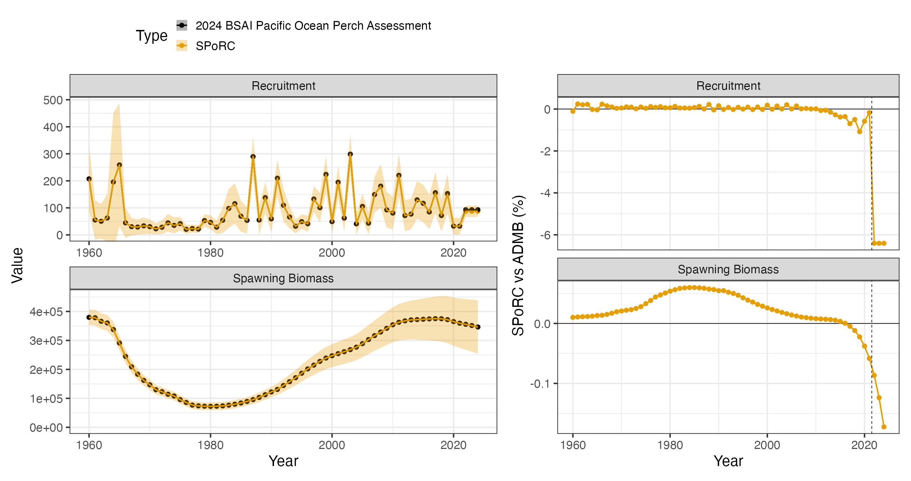
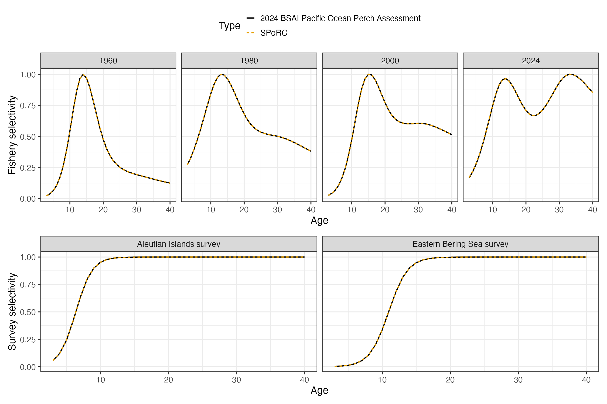

# Case Study: Bering Sea and Aleutian Islands Pacific Ocean Perch

## Overview

This case study reproduces the 2024 Bering Sea and Aleutian Islands
Pacific ocean perch assessment in `SPoRC`. Every structural choice below
follows the assessment rather than `SPoRC`’s defaults. It is the most
structurally involved of the five rockfish case studies: two survey
fleets, a first year equilibrium under a fixed historical fishing
mortality, and a bicubic spline fishery selectivity surface over year
and age.

| Source | Years | Observations | Likelihood |
|----|----|----|----|
| Catch | 1960–2024 | 65 | Lognormal, weighted |
| Aleutian Islands survey biomass | 1991–2024 | 14 | Lognormal |
| Eastern Bering Sea slope survey biomass | 2002–2016 | 6 | Lognormal |
| Fishery age compositions | 1981–2023 | 22 | Multinomial |
| Fishery length compositions | 1964–2022 | 32 | Multinomial |
| Aleutian Islands survey age compositions | 1991–2022 | 13 | Multinomial |
| Eastern Bering Sea survey age compositions | 2002–2016 | 6 | Multinomial |
| Aleutian Islands survey length compositions | 2024 | 1 | Multinomial |

Model ages run 3 to 46 with a plus group, while the assessment reports
over observed ages 3 to 40 with its last column an age 40 plus
aggregation. Lengths run 15 to 39 cm.

``` r

library(SPoRC)
library(dplyr)
library(ggplot2)
data("sgl_rg_bsai_pop_data")

dat <- sgl_rg_bsai_pop_data
yrs <- dat$years
n_yrs <- length(yrs)
n_obs_ages <- length(dat$obs_ages)
nsel <- dat$nselages
```

## Model dimensions

Because the model is single region and single sex, the population,
region, season and sex subscripts used in the model equations all
collapse to one, and are dropped from the notation below.

``` r

input_list <- Setup_Mod_Dim(
  n_pop = dat$n_pop,
  years = yrs,
  ages = dat$ages,
  lens = dat$lens,
  n_regions = dat$n_regions,
  n_sexes = dat$n_sexes,
  n_fish_fleets = dat$n_fish_fleets,
  n_srv_fleets = dat$n_srv_fleets,
  n_seas = dat$n_seas,
  verbose = FALSE
)
```

## Recruitment and the initial age structure

Recruitment is a mean with annual deviations rather than a stock recruit
function, and the last three years take the mean outright.

The first year sits in equilibrium under a fixed historical fishing
mortality of $`0.01`$, which the assessment holds independent of the
estimated mean $`F`$. `init_F_form = "abs"` is what keeps the two
separate. Under the alternative `"prop"` form the initial $`F`$ would be
a multiple of $`\exp(\mu^{\text{Fsh}})`$, so raising the estimated mean
would deplete the initial age structure, which is not what the
assessment does.

``` math
N_{1,a} = R_{0}\exp\left(-\sum_{a' < a}\left[M + F^{\text{init}}\text{Sel}_{a'}\right]\right)
```

`bias_year` is indexed in deviation space rather than in calendar years,
so `c(1, 1, n_yrs + 1, n_yrs + 1)` puts the whole series in the fully
bias corrected limb of the ramp. That centres the recruitment penalty on
$`-\sigma_{R}^{2}/2`$, which is what the shifted deviations in the
seeding section below require.

``` r

init_F_par <- array(log(1e-10), dim = c(dat$n_regions, dat$n_seas, dat$n_fish_fleets))
init_F_par[1, 1, 1] <- log(dat$mle$historic_F)

input_list <- Setup_Mod_Rec(
  input_list = input_list,
  rec_model = "mean_rec",
  do_rec_bias_ramp = 1,
  bias_year = c(1, 1, n_yrs + 1, n_yrs + 1),
  sigmaR_switch = 1,
  ln_sigmaR = array(log(c(dat$sigmaR, dat$sigmaR)), dim = c(2, dat$n_pop, dat$n_regions)),
  dont_est_recdev_last = dat$fixedrec,
  equil_init_age_strc = "equil",
  sigmaR_spec = "fix",
  init_age_strc = 1,
  init_F_form = "abs",
  init_F_spec = "fix",
  init_F_par = init_F_par,
  t_spawn = (dat$spawn_mo - 1) / 12,
  use_rinit = 1
)
```

## Biological dynamics

Natural mortality is estimated under a lognormal prior. The assessment
states its prior as a mean of $`0.05`$ on the natural scale, so the
median supplied to `SPoRC` is shifted by $`\exp(-\text{CV}^{2}/2)`$ to
put the prior mean where the assessment puts it.

Maturity is estimated inside the assessment’s template and is absent
from its report object, so the fitted logistic is rebuilt when the data
object is constructed and held fixed here. That is why the assessment’s
maturity likelihood is removed from its side of the objective in the
crosswalk below.

``` r

input_list <- Setup_Mod_Biologicals(
  input_list = input_list,
  WAA = dat$WAA,
  MatAA = dat$MatAA,
  fit_lengths = 1,
  SizeAgeTrans = dat$SizeAgeTrans,
  AgeingError = dat$AgeingError,
  M_spec = "est_ln_M",
  Use_M_prior = 1,
  M_prior = data.frame(popblk = 1, regionblk = 1, yearblk = 1, ageblk = 1, sexblk = 1,
                       mu = dat$mean_M * exp(-dat$cv_M^2 / 2), sd = dat$cv_M),
  addtosrvidx = 1e-13,
  addtocomp = 1e-13
)
```

## Movement and tagging

The model is single region, so movement is an identity matrix and no
tagging data are used. Both still have to be declared.

``` r

input_list <- Setup_Mod_Movement(input_list = input_list, use_fixed_movement = 1,
                                 Fixed_Movement = NA, do_recruits_move = 0)

input_list <- Setup_Mod_Tagging(input_list = input_list, use_conv_fish_tagging = 0)
```

## Catch and fishing mortality

The assessment writes its catch and F statements as weighted sums of
squares with weights $`500`$ and $`0.1`$. A weighted sum of squares and
a normal likelihood with a fixed standard deviation are the same
statement up to a constant, related by $`\sigma = 1/\sqrt{2w}`$, so both
weights are carried inside the standard deviations rather than applied
outside the sums.

``` r

suppressWarnings(
  input_list <- Setup_Mod_Catch_and_F(
    input_list = input_list,
    ObsCatch = dat$ObsCatch,
    UseCatch = dat$UseCatch,
    Use_F_pen = 1,
    sigmaC_spec = "fix",
    ln_sigmaC = array(log(sqrt(1 / (2 * dat$catch_wt))),
                      dim = c(dat$n_regions, n_yrs, dat$n_seas, dat$n_fish_fleets)),
    ln_sigmaF = array(log(sqrt(1 / (2 * dat$fmort_wt))),
                      dim = c(dat$n_regions, dat$n_seas, dat$n_fish_fleets))
  )
)
```

## Fishery compositions

There is no fishery index in this assessment, only compositions, so
`fish_idx_type` is `"none"` and the index arrays are declared empty.

``` r

input_list <- Setup_Mod_FishIdx_and_Comps(
  input_list = input_list,
  ObsFishIdx = array(NA, dim = c(dat$n_regions, n_yrs, dat$n_seas, dat$n_fish_fleets)),
  ObsFishIdx_SE = array(NA, dim = c(dat$n_regions, n_yrs, dat$n_seas, dat$n_fish_fleets)),
  UseFishIdx = array(0, dim = c(dat$n_regions, n_yrs, dat$n_seas, dat$n_fish_fleets)),
  ObsFishAgeComps = dat$ObsFishAgeComps,
  UseFishAgeComps = dat$UseFishAgeComps,
  ISS_FishAgeComps = dat$ISS_FishAgeComps,
  ObsFishLenComps = dat$ObsFishLenComps,
  UseFishLenComps = dat$UseFishLenComps,
  ISS_FishLenComps = dat$ISS_FishLenComps,
  fish_idx_type = "none",
  FishAgeComps_LikeType = "Multinomial",
  FishLenComps_LikeType = "Multinomial",
  FishAgeComps_Type = "agg_Year_1-terminal_Fleet_1",
  FishLenComps_Type = "agg_Year_1-terminal_Fleet_1"
)
```

## Survey indices and compositions

Two survey fleets are declared, the Aleutian Islands bottom trawl survey
and the eastern Bering Sea slope survey, both fit to biomass and both
lognormal. Every argument is a vector over the two fleets.

``` r

input_list <- Setup_Mod_SrvIdx_and_Comps(
  input_list = input_list,
  ObsSrvIdx = dat$ObsSrvIdx,
  ObsSrvIdx_SE = dat$ObsSrvIdx_SE,
  UseSrvIdx = dat$UseSrvIdx,
  ObsSrvAgeComps = dat$ObsSrvAgeComps,
  ISS_SrvAgeComps = dat$ISS_SrvAgeComps,
  UseSrvAgeComps = dat$UseSrvAgeComps,
  ObsSrvLenComps = dat$ObsSrvLenComps,
  UseSrvLenComps = dat$UseSrvLenComps,
  ISS_SrvLenComps = dat$ISS_SrvLenComps,
  srv_idx_type = rep("biom", dat$n_srv_fleets),
  SrvAgeComps_LikeType = rep("Multinomial", dat$n_srv_fleets),
  SrvLenComps_LikeType = rep("Multinomial", dat$n_srv_fleets),
  SrvAgeComps_Type = paste0("agg_Year_1-terminal_Fleet_", 1:dat$n_srv_fleets),
  SrvLenComps_Type = paste0("agg_Year_1-terminal_Fleet_", 1:dat$n_srv_fleets)
)
```

## Fishery selectivity and catchability

Fishery selectivity is a bicubic spline over a five year by five age
node grid, exponentiated with no normalisation:

``` math
\log \text{Sel}_{y,a}^{\text{Fsh}} = \left(\mathbf{W}^{\text{yr}}\,\Theta\,\mathbf{W}^{\text{bin}\top}\right)_{y,a}
```

where $`\Theta`$ is the $`5\times5`$ matrix of node values and the two
$`\mathbf{W}`$ matrices are the spline bases over years and over ages.

`SelStyr` and `NSelBins` in the specification string are not cosmetic.
They set the year range and the bin count that the smoothness penalties
normalise by, and they impose the assessment’s two edge holds:
selectivity is flat before 1964 and flat beyond age 40. Getting either
wrong changes both the surface and the penalty.

``` r

fish_sel_spec <- paste0("bicubic_Bin_", dat$fsh_age_nodes,
                        "_Yr_", dat$fsh_yr_nodes,
                        "_Fleet_1",
                        "_SelStyr_", dat$fsh_sel_styr,
                        "_NSelBins_", dat$nselages)

input_list <- Setup_Mod_Fishsel_and_Q(
  input_list = input_list,
  cont_tv_fish_sel = "none_Fleet_1",
  fish_sel_blocks = "none_Fleet_1",
  fish_sel_model = fish_sel_spec,
  fish_q_blocks = "none_Fleet_1",
  fish_fixed_sel_pars_spec = "est_all",
  fish_q_spec = "fix",
  use_fixed_fish_sel = 0
)
```

## Survey selectivity and catchability

Survey selectivity is logistic in both fleets, using the slope and
$`a_{50}`$ parameterisation:

``` math
\text{Sel}_{a} = \dfrac{1}{1 + \exp\left[-k\left(a - a_{50}\right)\right]}
```

Only the Aleutian Islands survey carries a catchability prior. Supplying
a single row for fleet 1 in `srv_q_prior` is what restricts it to that
fleet; the eastern Bering Sea catchability is estimated freely.

``` r

input_list <- Setup_Mod_Srvsel_and_Q(
  input_list = input_list,
  cont_tv_srv_sel = paste0("none_Fleet_", 1:dat$n_srv_fleets),
  srv_sel_blocks = paste0("none_Fleet_", 1:dat$n_srv_fleets),
  srv_sel_model = paste0("logist1_Fleet_", 1:dat$n_srv_fleets),
  srv_q_blocks = paste0("none_Fleet_", 1:dat$n_srv_fleets),
  srv_fixed_sel_pars_spec = rep("est_all", dat$n_srv_fleets),
  srv_q_spec = rep("est_all", dat$n_srv_fleets),
  Use_srv_q_prior = 1,
  srv_q_prior = data.frame(region = 1, block = 1, fleet = 1,
                           mu = dat$mean_q[1] * exp(-dat$cv_q[1]^2 / 2), sd = dat$cv_q[1]),
  t_srv = array(0.5, dim = c(dat$n_regions, dat$n_seas, dat$n_srv_fleets))
)
```

## Weighting and selectivity penalties

Beyond the data weights, the assessment carries smoothness penalties on
the bicubic surface, its lambdas 3 to 6, plus a mean centering term its
template hardcodes. Those five terms ship in the data object as
`sel_pen_wts` and are passed straight through. Survey selectivity is
logistic with no deviations, so it carries no smoothness penalty and
`srv_sel_pen_wts` is `NULL`.

``` r

input_list <- Setup_Mod_Weighting(
  input_list = input_list,
  Wt_Catch = 1, Wt_FishIdx = 1, Wt_SrvIdx = 1,
  Wt_Rec = dat$lam_rec, Wt_F = 1, Wt_Tagging = 0,
  Wt_FishAgeComps = dat$Wt_FishAgeComps,
  Wt_FishLenComps = dat$Wt_FishLenComps,
  Wt_SrvAgeComps = dat$Wt_SrvAgeComps,
  Wt_SrvLenComps = dat$Wt_SrvLenComps,
  fish_sel_pen_wts = dat$sel_pen_wts,
  srv_sel_pen_wts = NULL
)
```

## Starting at the ADMB estimate

Before optimizing anything, it is worth checking that the model is
reproduced *at a known point*. Setting every parameter to the
assessment’s maximum likelihood estimate and evaluating there separates
a specification error from an optimization difference: if the population
and the likelihood agree at the ADMB solution, the two models are the
same model.

Two conversions are needed. The assessment builds its three deviation
free terminal recruits as $`\exp(\overline{\log R} + \sigma_{R}^{2}/2)`$
while leaving the estimated years raw, and it starts the first year
equilibrium from the mean of the lognormal rather than from
$`\exp(\log R^{\text{init}})`$. Carrying both corrections in
`ln_global_R0` and `ln_rinit` and shifting every seeded deviation down
by the same amount reproduces the recruitment series, the initial age
structure, and the penalty value at once.

The second is the node grid orientation. The assessment declares its
bicubic grid with year nodes as the outer dimension and writes the
parameter file row major, so the file’s five rows are age nodes. `SPoRC`
wants $`[\text{year node} \times \text{age node}]`$ flattened column
major, hence the transpose.

``` r

mle <- dat$mle
s2 <- dat$sigmaR^2 / 2

input_list$par$ln_global_R0[] <- mle$mean_log_rec + s2
input_list$par$ln_rinit <- mle$log_rinit + s2
input_list$par$ln_RecDevs[1, 1, ] <- mle$rec_dev - s2
input_list$par$ln_M[] <- log(mle$M)
input_list$par$ln_F_mean[] <- mle$log_avg_fmort
input_list$par$ln_F_devs[1, , 1, 1] <- mle$fmort_dev
input_list$par$ln_srv_q[1, 1, 1] <- log(mle$q_srv[1])
input_list$par$ln_srv_q[1, 1, 2] <- log(mle$q_srv[2])

for(sf in 1:dat$n_srv_fleets) {
  input_list$par$srv_fixed_sel_pars[1, , 1, 1, sf] <-
    c(log(mle$sel_a50_srv[sf]), log(mle$sel_aslope_srv[sf]))
} # end sf loop

node_admb <- matrix(mle$fsh_sel_par, nrow = dat$fsh_age_nodes,
                    ncol = dat$fsh_yr_nodes, byrow = TRUE)
input_list$par$fish_fixed_sel_pars[1, , 1, 1, 1] <- as.vector(t(node_admb))

obj <- fit_model(input_list$data, input_list$par, input_list$map,
                 do_optim = FALSE, silent = TRUE)
r <- obj$rep
```

One reporting convention has to be undone before comparing selectivity.
The assessment divides selectivity by its within year maximum and
multiplies $`F`$ by the same factor, which leaves their product
invariant, but its *internal* selectivity is the raw exponentiated
surface. Putting both sides on the reported convention makes this the
sharpest single check in the bridge: it covers the node orientation, the
1964 edge hold and the age 40 edge hold across all $`65\times38`$ cells
at once.

``` r

normalize <- function(m) m / apply(m, 1, max)
sel_bridge <- normalize(r$fish_sel[1, 1, 1:n_yrs, 1, 1:nsel, 1, 1])
```

    fishery selectivity surface max pct diff: 4.5e-04
    numbers at age              max pct diff: 3.4e-04
    spawning biomass            max pct diff: 4.1e-04
    recruitment                 max pct diff: 3.1e-04
    total biomass               max pct diff: 2.5e-04

Total biomass needs a note. `SPoRC`’s reported `Total_Biom` is spawning
time biomass and carries the $`\exp(-Z t^{\text{spawn}})`$ discount,
while the assessment reports January 1 biomass. The like for like
quantity is rebuilt from numbers at age, which is what the figure above
compares. Comparing the two reported quantities directly instead is a 6
percent difference that says nothing about the model.

The likelihood is checked the same way. `SPoRC` writes each component as
a proper density while the assessment drops normalising constants, so a
like for like comparison subtracts exactly the constants the assessment
omits.

| Component                                   | `SPoRC`      | Assessment   |
|---------------------------------------------|--------------|--------------|
| Catch sum of squares                        | 0.0572       | 0.000114     |
| Aleutian Islands survey index               | 8.10752      | 8.10061      |
| Eastern Bering Sea survey index             | 1.99709      | 1.99677      |
| Fishery age compositions                    | 295.378      | 295.378      |
| Fishery length compositions                 | 195.915      | 195.915      |
| Aleutian Islands survey age compositions    | 176.202      | 176.208      |
| Eastern Bering Sea survey age compositions  | 74.1169      | 74.1183      |
| Aleutian Islands survey length compositions | 7.6463       | 7.4970       |
| Recruitment                                 | 11.2427      | 11.2427      |
| F regularity                                | 7.27706      | 7.27706      |
| Selectivity penalty                         | 111.454      | 111.454      |
| $`M`$ prior                                 | 0.341077     | 0.341077     |
| Aleutian Islands $`q`$ prior                | 0.289064     | 0.289064     |
| **Like for like total**                     | **890.0234** | **889.8747** |

Two components do not land exactly. The catch statement is numerically
zero on both sides against an objective of $`890`$: the assessment fits
catch to $`10^{-4}`$ and `SPoRC` to $`6\times10^{-2}`$, which is a
difference in how near exactly catch is driven rather than a difference
in the statement. The Aleutian Islands survey contributes a single year
of length compositions, and its gap is $`0.15`$ on a term of $`7.5`$,
which is a $`0.07`$ percent difference in the predicted proportions
carried through an applied sample size of $`224`$. That is consistent
with the multinomial offset convention rather than with the size at age
transition, and it is $`0.017`$ percent of the objective.

## Fitting and comparison

``` r

est <- fit_model(input_list$data, input_list$par, input_list$map,
                 random = NULL, newton_loops = 3, silent = TRUE)
est$sdrep <- RTMB::sdreport(est)
```

    free parameters: 162
    final jnLL: 886.9266   max |gradient|: 1.7e-11
    pdHess: TRUE

| Quantity                     | Median difference | Maximum difference |
|------------------------------|-------------------|--------------------|
| Spawning biomass             | 0.025 %           | 0.173 %            |
| Recruitment, estimated years | 0.084 %           | 1.08 %             |



The dashed rule marks where the estimated recruitment deviations stop.
Over the three terminal years the two models differ by a constant factor
of $`1.068452`$, and the shift in the estimated recruitment level
between the two fits accounts for $`1.068451`$ of it. Those recruits are
deviation free, so they carry the level and nothing else; the
assessment’s sum to zero `dev_vector` cannot move the level while
`SPoRC`’s free deviations can.

Fishery selectivity is a bicubic surface over year and age, held flat
before 1964 and past the last selectivity node, so a handful of years
carries the whole shape change. Four years are shown; the full
$`65\times38`$ surface is what the bridge test checks. Survey
selectivity is logistic and time invariant in each of the two surveys.


