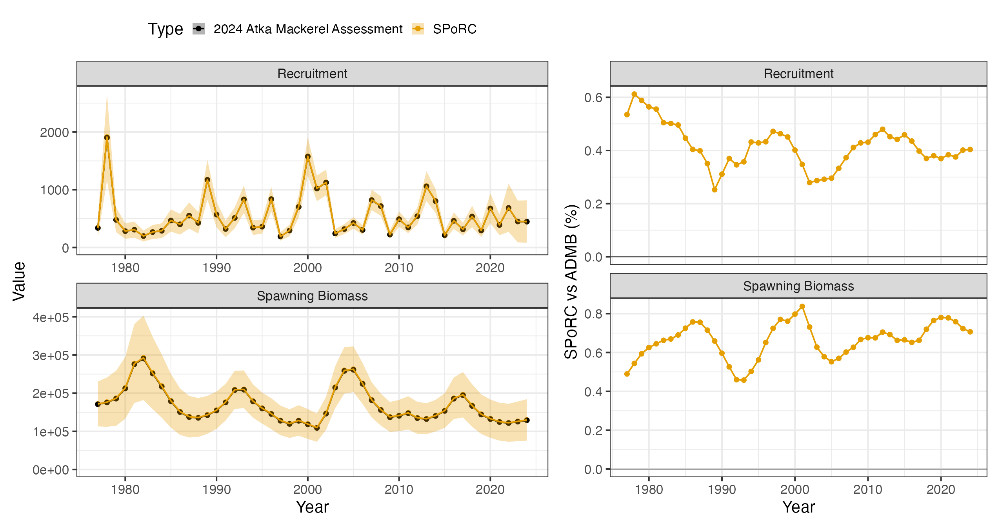
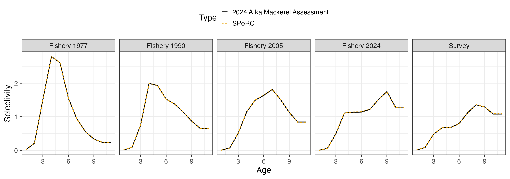

# Case Study: Bering Sea and Aleutian Islands Atka Mackerel

## Overview

This case study reproduces the 2024 Bering Sea and Aleutian Islands Atka
mackerel assessment, Model 16.0b, in `SPoRC`.

The model is single region, single sex, single season, with one fishery
fleet and one survey:

| Source                           | Years     | Observations | Likelihood         |
|----------------------------------|-----------|--------------|--------------------|
| Catch                            | 1977–2024 | 48           | Lognormal, CV 0.05 |
| NMFS bottom trawl survey biomass | 1991–2024 | 14           | Lognormal          |
| Fishery age compositions         | 1977–2023 | 46           | Multinomial        |
| Survey age compositions          | 1991–2022 | 13           | Multinomial        |

Ages run $`a = 1`$ to $`a_{+} = 11`$, the plus group. Model years run
$`y_{1} = 1967`$ to $`y_{\text{end}} = 2024`$; the assessment reports
from $`y_{0} = 1977`$.

AMAK initializes its age structure by starting from an equilibrium at
$`y_{1}`$ and running ten years forward with no fishing, adding a
recruitment deviation each year. Two recruitment scales appear and are
not interchangeable. $`\log R_{0}`$ (`log_Rzero`) sets the equilibrium,
and through it $`B_{0}`$ and the stock recruit curve’s own scale, so it
decides where the curve sits and therefore what the penalty on the
recruitment residual is measured against. $`\overline{\log R}`$
(`mean_log_rec`) sets the level recruitment is generated from. Here
$`R_{0} = 474.0`$ against $`e^{\overline{\log R}} = 447.0`$, and which
of the two the curve takes is what `sr_R0_spec` decides below.

Writing $`S_{a} = e^{-M_{a}}`$, the equilibrium is

``` math
N_{y_{1},1} = R_{0} = e^{\log R_{0}}
\qquad N_{y_{1},a} = N_{y_{1},a-1}S_{a-1}
\qquad N_{y_{1},a_{+}} \leftarrow \frac{N_{y_{1},a_{+}}}{1 - S_{a_{+}}}
```

and the ten years are

``` math
N_{y,1} = e^{\overline{\log R}\,+\,\varepsilon_{y}}
\qquad N_{y+1,a} = N_{y,a-1}S_{a-1}
\qquad N_{y+1,a_{+}} \mathrel{+}= N_{y,a_{+}}S_{a_{+}}
\qquad y_{1} \le y < y_{0}
```

with $`\varepsilon_{y}`$ (`rec_dev`) estimated over $`y_{1}`$ to
$`y_{\text{end}}`$ rather than over $`y_{0}`$ to $`y_{\text{end}}`$.
AMAK penalizes $`\varepsilon_{y}`$ about zero, so
$`e^{\overline{\log R}}`$ is median recruitment. Penalizing about
$`-\tfrac{1}{2}\sigma_{R}^{2}`$ instead makes it mean recruitment, which
is what `SPoRC` does by default and is turned off under Recruitment
below.

`SPoRC` gets there by carrying those ten years as model years with
$`F_{y,a} = 0`$, which makes $`Z_{y,a} = M`$ and the recursion above the
ordinary dynamics. Its initial age structure would be the alternative,
but that puts one deviation on each age rather than one on each year.
Below the plus group the two agree, since each age is one cohort; the
plus group mixes the $`y_{1}`$ recruitment with equilibrium carried
forward, and responds to $`\varepsilon_{y_{1}}`$ only in proportion to
the $`23.7`$ percent of it that recruitment supplies.

The model therefore spans $`y_{1}`$ to $`y_{\text{end}}`$ while `dat`
covers $`y_{0}`$ to $`y_{\text{end}}`$, so each year-indexed input is
extended back to $`y_{1}`$ before it goes in: biological arrays repeat
$`y_{0}`$, and catch, compositions and the index take zero or `NA` with
their use flags off.

``` r

library(SPoRC)
library(dplyr)
library(ggplot2)
data("sgl_rg_bsai_atka_data")

dat <- sgl_rg_bsai_atka_data
n_pre <- 10                                     # 1967 to 1976
yrs <- (min(dat$years) - n_pre):max(dat$years)
n_yrs <- length(yrs)
n_ages <- length(dat$ages)
n_obs <- length(dat$years)
i_amak <- which(yrs %in% dat$years)             # the years the assessment reports
```

``` r

# The assessment's arrays run 1977 to 2024. Put ten years in front of whichever
# margin holds the years, so they run 1967 to 2024.
pad <- function(x, fill = NULL) {
  m <- which(dim(x) == n_obs)
  pre <- if(is.null(fill)) abind::asub(x, rep(1, n_pre), m, drop = FALSE)
         else array(fill, dim = replace(dim(x), m, n_pre))
  unname(abind::abind(pre, x, along = m))
}
```

## Model dimensions

Single region, single sex and single season, so the population, region,
season and sex subscripts collapse to one and are dropped throughout.

``` r

input_list <- Setup_Mod_Dim(
  years = yrs,
  ages = dat$ages,
  lens = NA,
  n_regions = dat$n_regions,
  n_sexes = dat$n_sexes,
  n_fish_fleets = dat$n_fish_fleets,
  n_srv_fleets = dat$n_srv_fleets,
  n_seas = dat$n_seas,
  n_pop = dat$n_pop,
  natal_region = dat$natal_region,
  verbose = FALSE
)
```

## Recruitment and the stock-recruit penalty

AMAK carries two recruitment parameters that are not interchangeable.
`mean_log_rec` sets the level of recruitment and generates it, while
`log_Rzero` sets the scale of the stock-recruit curve and builds the
unfished age structure. The curve never generates recruitment; it
appears in the objective only through the residual
$`\chi_{y} = \log R_{y} - \log \widehat{R}_{y}`$.

That is `rec_model = "mean_rec"` with `sr_penalty = "bh"`. Recruitment
is a mean with annual deviations, and the Beverton-Holt curve is fitted
as a penalty on the residual rather than driving the dynamics.

``` r

inv_steepness <- function(s) qlogis((s - 0.2) / 0.8)

input_list <- Setup_Mod_Rec(
  input_list = input_list,
  rec_model = "mean_rec",
  rec_lag = 1,
  SR_ref_yr = 1,
  sr_penalty = "bh",
  sr_pen_sigma = dat$sigmaR / sqrt(1 + 1 / (2 * dat$nrecs_est)),
  sr_pen_yrs = dat$styr_rec_est:dat$endyr_rec_est,
  sr_R0_spec = "rinit",
  steepness_h = array(inv_steepness(dat$steepness), dim = c(1, 1)),
  h_spec = "fix",
  do_rec_bias_ramp = 1,
  bias_year = rep(n_yrs + 1, 4),
  sigmaR_switch = 1,
  sigmaR_spec = "fix",
  ln_sigmaR = array(rep(log(dat$sigmaR), 2), dim = c(2, 1, 1)),
  InitDevs_spec = "fix",
  init_age_strc = 1,
  equil_init_age_strc = 2,
  ln_global_R0 = dat$mle$mean_log_rec,
  ln_rinit = dat$mle$log_Rzero,
  use_rinit = 1,
  t_spawn = dat$t_spawn,
  dont_est_recdev_last = 0,
  Use_rec_level_pen = 0
)
```

`sr_R0_spec` picks where the curve’s scale comes from. `"shared"` uses
`ln_global_R0`, the mean recruitment level. `"est"` gives the curve its
own parameter. `"rinit"` uses `ln_rinit`, the recruitment the initial
age structure is built from.

AMAK’s `log_Rzero` does two jobs: it builds the initial age structure
and it sets the curve. `"rinit"` is the setting that does the same.
`"shared"` would put the curve on mean recruitment, and `"est"` would
add a parameter the assessment does not have.

Starting in 1967 rather than 1977 is what removes the initial age
structure as a problem. At a 1977 start the first year has to absorb ten
years of propagated deviations, its plus group accumulates them rather
than carrying one, and matching the assessment’s numbers there costs its
penalty on them. Starting where AMAK starts makes those ten years
ordinary model years with ordinary recruitment deviations, so
`InitDevs_spec = "fix"` leaves the initial age structure as a bare
equilibrium. It also supplies the 1976 spawning biomass that AMAK’s 1977
stock-recruit residual needs, so `sr_pen_yrs` covers the assessment’s
window in full rather than dropping its first year.

Steepness is fixed at 0.8 and carried on a logit bounded to (0.2, 1), so
the fixed value goes in transformed. Passing `h = 0.8` is read as a
starting value rather than as steepness, and leaves the default of 0.6.

`ln_sigmaR` is the assessment’s $`\sigma_{R} = 0.477`$ in both slots. It
pairs with `Wt_Rec`, set under Weighting below, and the two together are
what reproduce AMAK’s recruitment statements.

`do_rec_bias_ramp = 1` with every break past the last year is how the
penalty is centred on zero. Setting `do_rec_bias_ramp = 0` does not do
that: it sets the ramp to one throughout, which centres on
$`-\sigma_{R}^{2}/2`$.

`dont_est_recdev_last` stays at zero. AMAK estimates every deviation and
restricts only the years its stock-recruit likelihood covers.

## Biological dynamics

Weight and maturity at age are time invariant in the assessment but are
still extended back to $`y_{1}`$ anyway, since `SPoRC` carries them by
year. Natural mortality is fixed at 0.3.

``` r

input_list <- Setup_Mod_Biologicals(
  input_list = input_list,
  WAA = pad(dat$WAA),
  WAA_fish = pad(dat$WAA_fish),
  WAA_srv = pad(dat$WAA_srv),
  MatAA = pad(dat$MatAA),
  AgeingError = dat$AgeingError,
  fit_lengths = 0,
  M_spec = "fix",
  Fixed_natmort = pad(dat$Fixed_natmort),
  addtocomp = 1e-3,
  comp_const_obs = 1,
  addtosrvidx = 0,
  addtofishidx = 0
)
```

## Movement and tagging

Neither is used.

``` r

input_list <- Setup_Mod_Movement(input_list = input_list, use_fixed_movement = 1,
                                 Fixed_Movement = NA, do_recruits_move = 0)

input_list <- Setup_Mod_Tagging(input_list = input_list, use_conv_fish_tagging = 0)
```

## Catch and fishing mortality

AMAK has no mean fishing mortality parameter. `fmort` is the annual rate
itself, estimated directly, so `ln_F_mean_spec = "fix"` pins the mean at
zero and the deviations carry all of $`\log F`$.

``` r

input_list <- Setup_Mod_Catch_and_F(
  input_list = input_list,
  ObsCatch = pad(dat$ObsCatch, 0),
  UseCatch = pad(dat$UseCatch, 0),
  ln_F_mean_spec = "fix",
  Use_F_pen = 0,
  sigmaC_spec = "fix",
  ln_sigmaC = array(log(dat$sigmaC), dim = c(1, n_yrs, 1, 1))
)
```

`ObsCatch = 0` with `UseCatch = 0` over the initialization years forces
$`F`$ to zero and drops the deviation from the parameter vector, which
is what leaves those years running on natural mortality alone. Using
`NA` would declare a missing observation and still estimate an $`F`$
there.

`Use_F_pen = 0` because AMAK’s only fishing mortality statement
penalizes the realized $`F`$ at age surface toward 0.2, which `SPoRC`
has no counterpart for. Every `SPoRC` fishing mortality penalty is a
normal density on log deviations and none of them receives selectivity.

## Fishery compositions

There is no fishery index, so the index arrays are supplied unused.

``` r

input_list <- Setup_Mod_FishIdx_and_Comps(
  input_list = input_list,
  ObsFishIdx = array(NA_real_, dim = c(1, n_yrs, 1, 1)),
  ObsFishIdx_SE = array(NA_real_, dim = c(1, n_yrs, 1, 1)),
  UseFishIdx = array(0, dim = c(1, n_yrs, 1, 1)),
  ObsFishAgeComps = pad(dat$ObsFishAgeComps, 0),
  UseFishAgeComps = pad(dat$UseFishAgeComps, 0),
  ISS_FishAgeComps = pad(dat$ISS_FishAgeComps, 0),
  ObsFishLenComps = array(NA_real_, dim = c(1, n_yrs, 1, length(input_list$data$lens), 1, 1)),
  UseFishLenComps = array(0, dim = c(1, n_yrs, 1, 1)),
  ISS_FishLenComps = array(0, dim = c(1, n_yrs, 1, 1, 1)),
  fish_idx_type = c("biom"),
  FishIdx_LikeType = c("lognormal"),
  FishAgeComps_LikeType = c("Multinomial"),
  FishLenComps_LikeType = c("none"),
  FishAgeComps_Type = c("agg_Year_1-terminal_Fleet_1"),
  FishLenComps_Type = c("none_Year_1-terminal_Fleet_1")
)
```

`FishIdx_LikeType` has no `"none"` level, so it takes a placeholder
value and `UseFishIdx = 0` keeps the term out of the objective.

`comp_const_obs = 1`, set with the biologicals above, puts the
composition constant on the observed side as well as the expected side,
which is AMAK’s multinomial. `addtocomp` is that constant.

## Survey index and compositions

``` r

input_list <- Setup_Mod_SrvIdx_and_Comps(
  input_list = input_list,
  ObsSrvIdx = pad(dat$ObsSrvIdx, NA_real_),
  ObsSrvIdx_SE = pad(dat$ObsSrvIdx_SE, NA_real_),
  UseSrvIdx = pad(dat$UseSrvIdx, 0),
  ObsSrvAgeComps = pad(dat$ObsSrvAgeComps, 0),
  UseSrvAgeComps = pad(dat$UseSrvAgeComps, 0),
  ISS_SrvAgeComps = pad(dat$ISS_SrvAgeComps, 0),
  ObsSrvLenComps = array(NA_real_, dim = c(1, n_yrs, 1, length(input_list$data$lens), 1, 1)),
  UseSrvLenComps = array(0, dim = c(1, n_yrs, 1, 1)),
  ISS_SrvLenComps = array(0, dim = c(1, n_yrs, 1, 1, 1)),
  srv_idx_type = c("biom"),
  SrvIdx_LikeType = c("lognormal"),
  SrvAgeComps_LikeType = c("Multinomial"),
  SrvLenComps_LikeType = c("none"),
  SrvAgeComps_Type = c("agg_Year_1-terminal_Fleet_1"),
  SrvLenComps_Type = c("none_Year_1-terminal_Fleet_1"),
  t_srv = array(dat$t_srv, dim = c(1, 1, 1))
)
```

The survey is a biomass index read at $`t^{\text{srv}} = 6.5/12`$.

## Fishery selectivity and catchability

Selectivity is non-parametric on the log scale, exponentiated and
standardized so each year averages one. The oldest estimated coefficient
is held flat to the plus group before the standardization, which is a
bin grouping rather than a separate parameter.

The assessment lists 46 change years and the template prepends the first
model year, so there are 47 blocks and the terminal year shares the one
before it. The closed years ride on the first block, which never reaches
the dynamics because $`F`$ is zero there.

``` r

bin_groups <- function(nsel) c(as.list(seq_len(nsel - 1)), list(nsel:n_ages))

blk <- c(paste0("Block_1_Year_1-", n_pre + 1, "_Fleet_1"),
         paste0("Block_", 2:(dat$n_blk_fsh - 1), "_Year_", (n_pre + 2):(n_yrs - 2), "-",
                (n_pre + 2):(n_yrs - 2), "_Fleet_1"),
         paste0("Block_", dat$n_blk_fsh, "_Year_", n_yrs - 1, "-terminal_Fleet_1"))

input_list <- Setup_Mod_Fishsel_and_Q(
  input_list = input_list,
  cont_tv_fish_sel = c("none_Fleet_1"),
  fish_sel_blocks = blk,
  fish_sel_model = c("nonparlog_Fleet_1"),
  fish_sel_nonpar_est_bins = list(rep(list(bin_groups(dat$nselages_fsh)), dat$n_blk_fsh)),
  fish_fixed_sel_pars_spec = c("est_all"),
  fish_q_blocks = c("none_Fleet_1"),
  fish_q_spec = c("fix"),
  use_fixed_fish_sel = 0,
  Use_fish_selex_penalty = 1,
  fish_selex_penalty = dat$fish_selex_penalty
)
```

The fishery standardizes over every age, which is the default window.

## Survey selectivity and catchability

The survey standardizes over ages 4 to 10, the ages catchability is
defined against, rather than over every age.

``` r

input_list <- Setup_Mod_Srvsel_and_Q(
  input_list = input_list,
  cont_tv_srv_sel = c("none_Fleet_1"),
  srv_sel_blocks = c("none_Fleet_1"),
  srv_sel_model = c("nonparlog_Fleet_1"),
  srv_sel_nonpar_est_bins = list(list(bin_groups(dat$nselages_srv))),
  srv_sel_norm_bins = list(dat$q_age_min:dat$q_age_max),
  srv_fixed_sel_pars_spec = c("est_all"),
  srv_q_blocks = c("none_Fleet_1"),
  srv_q_spec = c("est_all"),
  srv_q_type = c("est"),
  use_fixed_srv_sel = 0,
  Use_srv_selex_penalty = 1,
  srv_selex_penalty = dat$srv_selex_penalty,
  Use_srv_q_prior = 1,
  srv_q_prior = dat$srv_q_prior,
  t_srv = array(dat$t_srv, dim = c(1, 1, 1))
)
```

## Weighting

The selectivity shape weights are set here rather than in the
selectivity setup, where they are read as starting values and every
smoothness penalty evaluates to zero.

Three terms act on the realized selectivity surface, so they apply
whatever functional form produced it. Over bins $`b`$ and years $`y`$,
with $`\ell_{y,b} = \log \text{Sel}_{y,b}`$:

``` math
\text{curvature}\quad w^{\text{curve}}_{y}\sum_{b}\big(\ell_{y,b+1} - 2\ell_{y,b} + \ell_{y,b-1}\big)^{2}
```

``` math
\text{year difference}\quad w^{\Delta}_{y}\sum_{b}\big(\ell_{y,b} - \ell_{y-1,b}\big)^{2}
```

``` math
\text{dome}\quad w^{\text{dome}}_{y}\sum_{b}\max\big(\ell_{y,b} - \ell_{y,b+1},\,0\big)^{2}
```

`fish_sel_pen_wts` and `srv_sel_pen_wts` take one named list per fleet,
or a single named list applied to every fleet. The six term names are
`smooth_bin_curve`, `smooth_bin_diff`, `smooth_yr_diff`,
`smooth_yr_curve`, `smooth_dome` and `smooth_mean_center`, and anything
left out is zero, which is how a fleet names only the terms it
constrains. Each is either a scalar used in every year or a vector with
one value per model year. Three settings sit alongside them:
`bin_range`, a length two vector giving the first and last bin the terms
run over, every bin by default; `normalize`, which divides a term by the
number of bins or years in its sum so the weight reads as a mean rather
than a total, `TRUE` by default; and `yr_diff_ref`, a value to hold the
walk’s first penalized year against.

Here `bin_range` is ages 4 to 10 and `normalize` is `FALSE`, since AMAK
sums rather than averages. Left at the default, the curvature weight
would be divided by the seven bins and the year difference by the 58
years. The dome term is not normalized either way.

Here every active term is a per-year vector, which is what lets a term
act only in the years a block changes. The years before $`y_{0}`$ carry
none, since the first block would otherwise be penalized on its
curvature and dome eleven times over. The year difference is zeroed at
$`y_{0}`$ to match AMAK, whose walk starts there with nothing before it;
the term would come out zero anyway, since $`y_{0}`$ and $`y_{0}-1`$
share the first block and so share coefficients.

``` r

fw <- dat$fish_sel_pen_wts
for(nm in c("smooth_bin_curve", "smooth_yr_diff", "smooth_dome")) {
  fw[[1]][[nm]] <- c(rep(0, n_pre), dat$fish_sel_pen_wts[[1]][[nm]])
} # end nm loop
fw[[1]]$smooth_yr_diff[n_pre + 1] <- 0

sw <- dat$srv_sel_pen_wts
for(nm in c("smooth_bin_curve", "smooth_yr_diff", "smooth_dome")) {
  if(length(sw[[1]][[nm]]) == n_obs) sw[[1]][[nm]] <- c(rep(0, n_pre), dat$srv_sel_pen_wts[[1]][[nm]])
} # end nm loop
```

`SPoRC` penalizes a recruitment deviation by
$`w_{y}\,\varepsilon_{y}^{2}/(2\sigma^{2})`$, where $`w_{y}`$ is that
year’s `Wt_Rec` and $`\sigma`$ is `ln_sigmaR` exponentiated. AMAK
penalizes $`\varepsilon_{y}^{2}`$ on every year, a raw sum of squares
carrying no $`\sigma`$, then adds $`0.5/\sigma_{R}^{2}`$ more over the
first and last part of the time series. With $`\sigma = \sigma_{R}`$,
$`w_{y}`$ is whatever cancels the $`1/(2\sigma_{R}^{2})`$:

``` math
w_{y}\frac{\varepsilon_{y}^{2}}{2\sigma_{R}^{2}} = \varepsilon_{y}^{2}
\;\Longrightarrow\; w_{y} = 2\sigma_{R}^{2} = 0.455
```

``` math
w_{y}\frac{\varepsilon_{y}^{2}}{2\sigma_{R}^{2}}
 = \Big(1+\tfrac{0.5}{\sigma_{R}^{2}}\Big)\varepsilon_{y}^{2}
\;\Longrightarrow\; w_{y} = 2\sigma_{R}^{2}+1 = 1.455
```

The $`\sigma_{R}^{2}`$ cancels in the second, so the added component is
worth exactly one whatever $`\sigma_{R}`$ is.

``` r

tail_yrs <- c(dat$styr_rec:dat$styr_rec_est, dat$endyr_rec_est:max(yrs))
Wt_Rec <- array(2 * dat$sigmaR^2, dim = c(1, 1, n_yrs))
Wt_Rec[1, 1, which(yrs %in% tail_yrs)] <- 2 * dat$sigmaR^2 + 1

input_list <- Setup_Mod_Weighting(
  input_list = input_list,
  Wt_Catch = 1, Wt_FishIdx = 1, Wt_SrvIdx = 1,
  Wt_Rec = Wt_Rec, Wt_Init_Rec = 1, Wt_F = 1, Wt_Tagging = 0,
  Wt_FishAgeComps = array(1, dim = c(1, n_yrs, 1, 1, 1)),
  Wt_FishLenComps = array(1, dim = c(1, n_yrs, 1, 1, 1)),
  Wt_SrvAgeComps = array(1, dim = c(1, n_yrs, 1, 1, 1)),
  Wt_SrvLenComps = array(1, dim = c(1, n_yrs, 1, 1, 1)),
  fish_sel_pen_wts = fw,
  srv_sel_pen_wts = sw
)

data <- input_list$data
parameters <- input_list$par
mapping <- input_list$map
```

## Starting at the AMAK estimate

Every parameter is set to the assessment’s maximum likelihood estimate,
and the objective is evaluated there before anything is optimized.

``` r

parameters$ln_F_devs[1, n_pre + seq_len(n_obs), 1, 1] <- log(dat$mle$fmort)
for(b in seq_len(dat$n_blk_fsh)) {
  parameters$fish_fixed_sel_pars[1, , b, 1, 1] <-
    c(dat$mle$log_selcoffs_fsh[b, ], dat$mle$log_selcoffs_fsh[b, dat$nselages_fsh])
} # end b loop
parameters$srv_fixed_sel_pars[1, , 1, 1, 1] <-
  c(dat$mle$log_selcoffs_ind, dat$mle$log_selcoffs_ind[dat$nselages_srv])
parameters$ln_RecDevs[1, 1, ] <- dat$amak$rec_dev[as.character(yrs)]

# Catchability absorbs the selectivity standardization, so it is added to the
# current value rather than set to the assessment's.
pass1 <- fit_model(data, parameters, mapping, do_optim = FALSE, silent = TRUE)
parameters$ln_srv_q[1, 1, 1] <- parameters$ln_srv_q[1, 1, 1] +
  log(mean(dat$amak$pred_ind / pass1$rep$PredSrvIdx[1, 1, i_srv, 1, 1]))

seed <- fit_model(data, parameters, mapping, do_optim = FALSE, silent = TRUE)
```

The following provides a comparison of the difference prior to
optimization:

    numbers at age                   9.5e-14 %
    fishing mortality at age         7.1e-14 %
    catch at age                     1.3e-13 %
    spawning biomass                 5.6e-14 %
    recruitment                      5.8e-14 %
    predicted catch                  4.1e-14 %
    predicted survey index           3.8e-14 %
    fishery selectivity              4.7e-14 %
    survey selectivity               4.8e-14 %
    recruitment deviations           0

`SPoRC` writes each likelihood component as a proper density while AMAK
drops normalising constants, so the comparison subtracts exactly the
constants AMAK omits:

| Component | `SPoRC` less constants | AMAK | Difference |
|----|----|----|----|
| Catch | 0.0618957043 | 0.0618957040 | $`2.5\times10^{-10}`$ |
| Fishery age compositions | 147.5587066215 | 147.5587066215 | $`2.0\times10^{-12}`$ |
| Survey index | 12.4723703086 | 12.4723703086 | $`3.6\times10^{-15}`$ |
| Survey age compositions | 30.9399388260 | 29.6027421985 | $`+1.337`$ |
| Selectivity penalties | 111.2203965047 | 111.2203965047 | $`7.1\times10^{-14}`$ |
| Catchability prior | 3.9508772733 | 3.9508772733 | $`8.9\times10^{-16}`$ |

## Fitting and comparison

``` r

est <- fit_model(data, parameters, mapping, do_optim = TRUE, newton_loops = 3, silent = TRUE)
est$sdrep <- RTMB::sdreport(est, hessian.fixed = est$he())
```

589 parameters, which matches the AMAK assessment’s own parameter count.
The objective falls from 265.046 at the assessment’s estimate to
265.034.

|                  | Median | Maximum |
|------------------|--------|---------|
| Spawning biomass | 0.67 % | 0.84 %  |
| Recruitment      | 0.41 % | 0.61 %  |



## Why the two differ

Everything in the population dynamics and the observation model agrees
to $`10^{-13}`$ percent, and five of the six likelihood components agree
to $`10^{-12}`$. What is left is a quirk with the compositions.

AMAK renormalizes its fishery expected compositions after applying
ageing error and does not renormalize its survey ones. Its ageing error
rows sum to between 0.972 and 1.013, so its survey expectation is not a
probability vector. That is the $`+1.337`$ in the table above, and it is
an inconsistency between AMAK’s two fleets rather than a modelling
choice, so `SPoRC` does not reproduce it.
