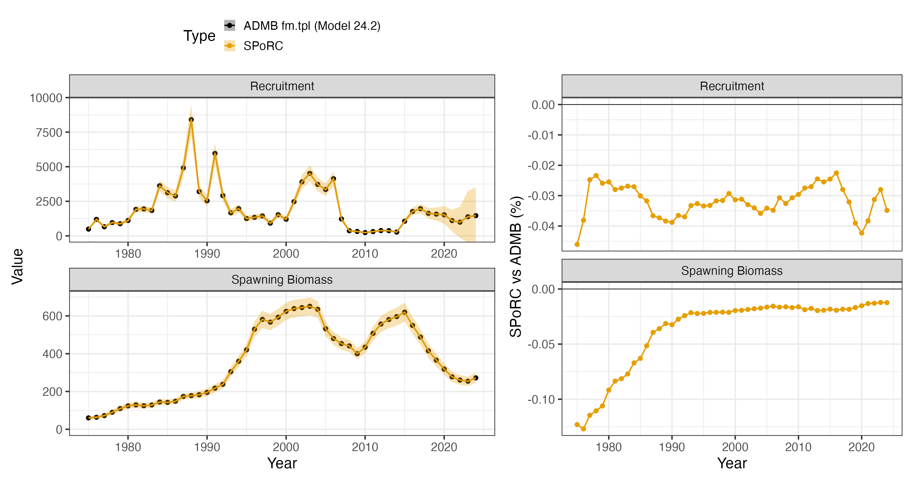
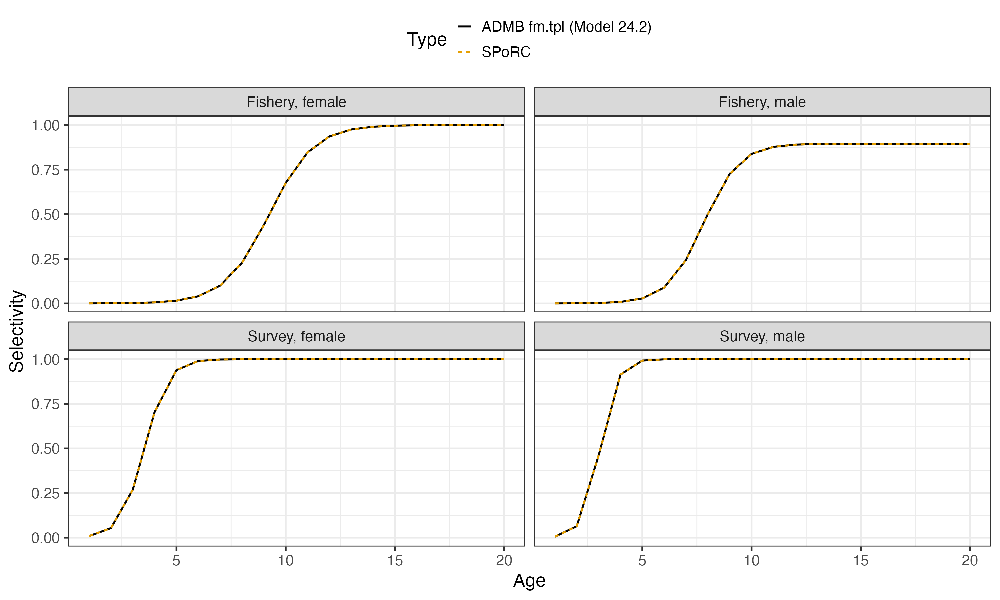

# Case Study: Bering Sea and Aleutian Islands Northern Rock Sole

## Overview

This case study reproduces the 2024 Bering Sea and Aleutian Islands
northern rock sole assessment, Model 24.2, in `SPoRC`. The assessment
runs on the flatfish model `fm.tpl`.

The model is single region, single season, two sex, with one fishery
fleet and one survey:

| Source | Years | Observations | Likelihood |
|----|----|----|----|
| Catch | 1975–2024 | 50 | Lognormal, weight 300 |
| Bottom trawl survey biomass | 1982–2024 | 42 | Lognormal |
| Fishery age compositions | 1979–2023 | 42 | Multinomial, joint across sexes |
| Survey age compositions | 1979–2023 | 44 | Multinomial, joint across sexes |

Ages run $`a = 1`$ to $`a_{+} = 20`$, the plus group, and years
$`y_{1} = 1975`$ to $`y_{\text{end}} = 2024`$. Both surveys’ 2020 year
is absent, so the index and the compositions each skip it.

Two sexes is what makes this assessment different from the other single
region case studies here, and it shows up in four places.

Natural mortality is sex specific and estimated, $`M_{f} = 0.192`$ and
$`M_{m} = 0.226`$, with a lognormal prior on the female’s only.

Initial numbers at age are free and estimated separately for each sex.
The assessment writes

``` math
N_{y_{1},a,s} = \tfrac{1}{2}\exp\left(\overline{\log N^{\text{init}}} + \epsilon^{\text{init}}_{a,s}\right)
\qquad a = 2, \ldots, a_{+}
```

so one level $`\overline{\log N^{\text{init}}}`$ is shared and each sex
carries its own deviations $`\epsilon^{\text{init}}_{a,s}`$. Those
deviations are penalized about zero, and separately the two sexes are
compared to each other by
$`\sum_{a}(\epsilon^{\text{init}}_{a,m} - \epsilon^{\text{init}}_{a,f})^{2}`$.
The penalty is a statement about how far apart the sexes’ initial age
structures may sit, which is not the same statement as how variable each
one is: initial numbers at age carry the exploitation the stock had
already seen before $`y_{1}`$ as well as year-class strength, and with
sex specific selectivity and mortality the two sexes need not have
departed from equilibrium by the same amount.

Fishery selectivity is logistic in both parameters of both sexes,
varying annually, with the male curve scaled by a constant:

``` math
\text{Sel}^{\text{Fsh}}_{y,a,f} = \frac{1}{1 + \exp\left[-k_{f}e^{\delta^{k}_{y,f}}\left(a - a^{50}_{f}e^{\delta^{50}_{y,f}}\right)\right]}
\qquad \text{Sel}^{\text{Fsh}}_{y,a,m} = \frac{e^{\gamma}}{1 + \exp\left[-k_{m}e^{\delta^{k}_{y,m}}\left(a - a^{50}_{m}e^{\delta^{50}_{y,m}}\right)\right]}
```

with $`\gamma`$ (`male_sel_offset`) estimated at $`-0.110`$, so the male
curve tops out at $`e^{\gamma} = 0.895`$ rather than one. Survey
selectivity is time invariant and its male parameters are multiplicative
offsets on the female’s, $`k_{m} = k_{f}e^{\delta_{k}}`$ and
$`a^{50}_{m} = a^{50}_{f}e^{\delta_{50}}`$.

Both curves stop at age 17. The assessment’s `nselages` evaluates the
logistic through age 17 and holds ages 18 to 20 at the age-17 value.
That is not cosmetic here: in years where the estimated slope is shallow
the curve has not saturated by 17, and evaluating it smoothly instead
moves total biomass by about two percent.

Recruitment is a mean with annual deviations and a Ricker curve is
fitted as a penalty on the residual over 1978 to 2018, never generating
recruitment.

``` r

library(SPoRC)
data(sgl_rg_bsai_nrs_data)
dat <- sgl_rg_bsai_nrs_data
yrs <- dat$years
n_yrs <- length(yrs)
n_ages <- length(dat$ages)
n_sexes <- dat$n_sexes
n_srv <- dat$n_srv_fleets
mle <- dat$mle
i_srv <- match(dat$yrs_srv, yrs)
```

## Model dimensions

Single region, single season and single population, so those subscripts
collapse to one and are dropped throughout. The sex subscript does not.

The survey enters as two fleets. The assessment reads its index in July
and its compositions on January 1, off one selectivity curve. Two fleets
sharing a curve is how that is written: fleet 1 carries the index at
$`t^{\text{srv}} = (7 - 1)/12`$, fleet 2 carries the compositions at
$`t^{\text{srv}} = 0`$ (inconsistent in the flatfish model).

``` r

input_list <- Setup_Mod_Dim(
  years = yrs,
  ages = dat$ages,
  lens = NA,
  n_regions = dat$n_regions,
  n_sexes = dat$n_sexes,
  n_fish_fleets = dat$n_fish_fleets,
  n_srv_fleets = dat$n_srv_fleets,
  n_seas = dat$n_seas,
  n_pop = dat$n_pop,
  natal_region = dat$natal_region,
  verbose = FALSE
)
```

## Recruitment and the initial age structure

Recruitment is a mean with deviations, and the Ricker appears in the
objective only through the residual
$`\chi_{y} = \log R_{y} - \log \widehat{R}_{y}`$. That is
`rec_model = "mean_rec"` with `sr_penalty = "ricker"`.

The assessment parameterizes its curve as $`R = A S e^{-BS}`$. `SPoRC`
writes the Ricker in depletion form,
$`R = R_{0}(S/S_{0})\exp\left(\alpha\left(1 - S/S_{0}\right)\right)`$
with $`\alpha = \log(4h/(1-h))`$, and the two are the same curve at
$`\alpha = \log(A\phi_{0})`$ and $`R_{0} = \alpha/(B\phi_{0})`$, where
$`\phi_{0}`$ is unfished female spawning biomass per recruit at the
reference year. Both are estimated here, so the conversion supplies
starting values rather than fixed ones.

Initial numbers at age are free (`init_age_strc = 4`), estimated per sex
(`InitDevs_sex_spec = "est_all"`), sharing one level
(`InitDevs_pen_center = "own_mean"`), and compared to each other
(`Use_init_sex_pen = 1`).

``` r

inv_steepness <- function(s) qlogis((s - 0.2) / 0.8)

# The Ricker conversion, evaluated at the assessment's own M and terminal
# biologicals
Nspr <- numeric(n_ages)
Nspr[1] <- 0.5
for(a in 2:n_ages) Nspr[a] <- Nspr[a-1] * exp(-mle$M_f)
Nspr[n_ages] <- Nspr[n_ages] / (1 - exp(-mle$M_f))
phi0 <- sum(Nspr * exp(-dat$t_spawn * mle$M_f) * dat$WAA[1,1,n_yrs,1,,1] * dat$MatAA[1,1,n_yrs,1,,1])
a_sr <- log(exp(mle$R_logalpha) * phi0)
h_sr <- exp(a_sr) / (4 + exp(a_sr))
sr_R0 <- a_sr / (exp(mle$R_logbeta) * phi0)

input_list <- Setup_Mod_Rec(
  input_list = input_list,
  rec_model = "mean_rec",
  rec_lag = 1,
  SR_ref_yr = n_yrs,
  sr_penalty = "ricker",
  sr_pen_sigma = dat$sr_pen_sigma,
  sr_pen_yrs = dat$sr_pen_yrs,
  sr_R0_spec = "est",
  steepness_h = array(inv_steepness(h_sr), dim = c(1, 1)),
  h_spec = "est_shared_pop_r",
  ln_sr_R0 = array(log(sr_R0), dim = 1),
  do_rec_bias_ramp = 1,
  bias_year = rep(n_yrs + 1, 4),
  sigmaR_switch = 1,
  sigmaR_spec = "fix",
  ln_sigmaR = array(log(dat$sigmaR), dim = c(2, 1, 1)),
  RecDevs_pen_center = "fixed",
  dont_est_recdev_last = 0,
  init_age_strc = 4,
  equil_init_age_strc = 2,
  InitDevs_spec = NULL,
  InitDevs_sex_spec = "est_all",
  InitDevs_pen_center = "own_mean",
  Use_init_sex_pen = 1,
  init_sex_pen_sigma = dat$sigmaR,
  ln_global_R0 = mle$mean_log_rec,
  t_spawn = dat$t_spawn,
  use_rinit = 0
)
```

`init_age_strc = 4` projects no equilibrium at all: the deviations are
the initial numbers themselves rather than multipliers on an
equilibrium, which is what the assessment estimates. Under that option
the deviations are log abundances, so the penalty on them is a prior on
log abundance directly.

`InitDevs_sex_spec = "est_all"` gives each sex its own curve. Pairing it
with `InitDevs_pen_center = "own_mean"` pools the centre over every
penalized cell across both sexes, so the sexes share one estimated
level. That is stationary at the same point as the assessment, whose
shared $`\overline{\log N^{\text{init}}}`$ forces the pooled deviations
to sum to zero at its own estimate.

`Use_init_sex_pen` adds the likelihood penalty between the sexes. A sum
of squares with weight one corresponds to $`\sigma = 1/\sqrt{2}`$, which
is `dat$sigmaR` here.

The recruitment deviation penalty is a sum of squares about zero.
Turning the bias ramp on with every break past the last year is what
centres it there; `do_rec_bias_ramp = 0` would instead hold the ramp at
one and centre the penalty on $`-\sigma_{R}^{2}/2`$.

## Biological dynamics

Weight at age and maturity are year specific empirical inputs, and
spawning biomass is female only, so the male slice of maturity is never
read. Natural mortality is estimated by sex, with a lognormal prior on
the female’s.

``` r

input_list <- Setup_Mod_Biologicals(
  input_list = input_list,
  WAA = dat$WAA,
  WAA_fish = dat$WAA_fish,
  WAA_srv = dat$WAA_srv,
  MatAA = dat$MatAA,
  AgeingError = dat$AgeingError,
  fit_lengths = 0,
  M_spec = "est_ln_M",
  M_popblk_spec = list(1),
  M_regionblk_spec = list(1),
  M_yearblk_spec = list(1:n_yrs),
  M_ageblk_spec = list(1:n_ages),
  M_sexblk_spec = list(1, 2),
  Use_M_prior = 1,
  M_prior = data.frame(popblk = 1, regionblk = 1, yearblk = 1, ageblk = 1, sexblk = 1,
                       mu = dat$m_prior$mu, sd = dat$m_prior$sd),
  addtocomp = 1e-3,
  comp_const_obs = 1,
  addtosrvidx = 0,
  addtofishidx = 0
)
```

`M_sexblk_spec = list(1, 2)` is what makes mortality sex specific: one
block per sex, so two parameters. Every other block specification is a
single group.

`comp_const_obs = 1` puts the 0.001 constant on both sides of the
multinomial likelihood (i.e., on the observed and predicted
compositions).

## Movement and tagging

Neither is used.

``` r

input_list <- Setup_Mod_Movement(input_list = input_list, use_fixed_movement = 1,
                                 Fixed_Movement = NA, do_recruits_move = 0)

input_list <- Setup_Mod_Tagging(input_list = input_list, use_conv_fish_tagging = 0)
```

## Catch and fishing mortality

The assessment weights its catch likelihood by 300, which is a lognormal
at $`\sigma = 1/\sqrt{600}`$.

``` r

input_list <- Setup_Mod_Catch_and_F(
  input_list = input_list,
  ObsCatch = dat$ObsCatch,
  UseCatch = dat$UseCatch,
  Use_F_pen = 0,
  ln_F_mean_spec = "fix",
  sigmaC_spec = "fix",
  ln_sigmaC = array(log(dat$sigmaC), dim = c(1, n_yrs, 1, 1))
)
```

The assessment carries two weak penalties on fishing mortality, one
pulling annual $`F`$ toward 0.2 and one forcing the mean deviation to
zero. `ln_F_mean_spec = "fix"` does the same thing by fixing the mean,
so the deviations carry all of $`\log F`$. Hoervrt, yhr first has no
counterpart in `SPoRC` is left out.

## Fishery compositions

Compositions are joint across sexes, females then males, so each year’s
observation carries the sex ratio as well as the age structure.

``` r

input_list <- Setup_Mod_FishIdx_and_Comps(
  input_list = input_list,
  ObsFishIdx = array(NA, dim = c(1, n_yrs, 1, 1)),
  ObsFishIdx_SE = array(NA, dim = c(1, n_yrs, 1, 1)),
  UseFishIdx = array(0, dim = c(1, n_yrs, 1, 1)),
  ObsFishAgeComps = dat$ObsFishAgeComps,
  UseFishAgeComps = dat$UseFishAgeComps,
  ISS_FishAgeComps = dat$ISS_FishAgeComps,
  ObsFishLenComps = array(NA, dim = c(1, n_yrs, 1, length(input_list$data$lens), n_sexes, 1)),
  UseFishLenComps = array(0, dim = c(1, n_yrs, 1, 1)),
  ISS_FishLenComps = array(0, dim = c(1, n_yrs, 1, n_sexes, 1)),
  fish_idx_type = "none",
  FishIdx_LikeType = "lognormal",
  FishAgeComps_LikeType = "Multinomial",
  FishLenComps_LikeType = "none",
  FishAgeComps_Type = "spltRjntS_Year_1-terminal_Fleet_1",
  FishLenComps_Type = "none_Year_1-terminal_Fleet_1"
)
```

`spltRjntS` is the joint form: one multinomial over both sexes at once,
which carries the sex ratio. The input sample size goes in the first
sex’s slot, since the joint composition is one observation rather than
two. There is no fishery index, so `fish_idx_type = "none"` with the use
flags off; `FishIdx_LikeType` still has to name a family, and it is
never evaluated.

## Survey index and compositions

The index is on fleet 1 and the compositions on fleet 2.

``` r

input_list <- Setup_Mod_SrvIdx_and_Comps(
  input_list = input_list,
  ObsSrvIdx = dat$ObsSrvIdx,
  ObsSrvIdx_SE = dat$ObsSrvIdx_SE,
  UseSrvIdx = dat$UseSrvIdx,
  ObsSrvAgeComps = dat$ObsSrvAgeComps,
  UseSrvAgeComps = dat$UseSrvAgeComps,
  ISS_SrvAgeComps = dat$ISS_SrvAgeComps,
  ObsSrvLenComps = array(NA, dim = c(1, n_yrs, 1, length(input_list$data$lens), n_sexes, n_srv)),
  UseSrvLenComps = array(0, dim = c(1, n_yrs, 1, n_srv)),
  ISS_SrvLenComps = array(0, dim = c(1, n_yrs, 1, n_sexes, n_srv)),
  srv_idx_type = c("biom", "none"),
  SrvIdx_LikeType = rep("lognormal", n_srv),
  SrvAgeComps_LikeType = c("none", "Multinomial"),
  SrvLenComps_LikeType = rep("none", n_srv),
  SrvAgeComps_Type = c("none_Year_1-terminal_Fleet_1", "spltRjntS_Year_1-terminal_Fleet_2"),
  SrvLenComps_Type = paste0("none_Year_1-terminal_Fleet_", 1:n_srv),
  t_srv = array(dat$t_srv, dim = c(1, 1, n_srv))
)
```

The observed index standard errors go in on the log scale, converted
from the assessment’s coefficients of variation by
$`\sigma = \sqrt{\log(\text{CV}^{2} + 1)}`$.

## Fishery selectivity and catchability

``` r

input_list <- Setup_Mod_Fishsel_and_Q(
  input_list = input_list,
  fish_sel_model = paste0("logist1_Fleet_1_NSelBins_", dat$nselages),
  cont_tv_fish_sel = "iid_Fleet_1",
  fish_sel_blocks = "none_Fleet_1",
  fish_q_blocks = "none_Fleet_1",
  fish_fixed_sel_pars_spec = "est_all",
  fish_sel_devs_spec = "est_all",
  fish_sel_sex_offset = "scale",
  fishsel_pe_pars_spec = "fix",
  fish_q_spec = "fix"
)
```

Three things are worth naming here.

`_NSelBins_17` is the plateau. Bins beyond 17 are held at bin 17’s value
rather than evaluated through the logistic, which is the assessment’s
`nselages`.

`fish_sel_sex_offset = "scale"` multiplies the male curve by an
estimated constant $`e^{\gamma}`$. Each sex keeps its own $`a^{50}`$ and
$`k`$; only the scale links them. The scaled curve is allowed above one,
though here it sits below.

`fishsel_pe_pars_spec = "fix"` holds the deviation penalties at the
assessment’s own standard deviations, 0.35 on $`a^{50}`$ and 0.2 on the
slope, for both sexes. The deviations are independent across years,
which is `cont_tv_fish_sel = "iid"`.

## Survey selectivity and catchability

``` r

input_list <- Setup_Mod_Srvsel_and_Q(
  input_list = input_list,
  srv_sel_model = paste0("logist1_Fleet_", 1:n_srv, "_NSelBins_", dat$nselages),
  cont_tv_srv_sel = paste0("none_Fleet_", 1:n_srv),
  srv_sel_blocks = paste0("none_Fleet_", 1:n_srv),
  srv_q_blocks = paste0("none_Fleet_", 1:n_srv),
  srv_fixed_sel_pars_spec = c("est_all", "est_shared_f_1"),
  srv_sel_sex_offset = rep("par", n_srv),
  srv_q_spec = c("est_all", "fix"),
  Use_srv_q_prior = 1,
  srv_q_prior = data.frame(region = 1, fleet = 1, block = 1,
                           mu = dat$q_prior$mu, sd = dat$q_prior$sd),
  t_srv = array(dat$t_srv, dim = c(1, 1, n_srv))
)
```

`est_shared_f_1` on fleet 2 is what makes the composition fleet read the
index fleet’s curve, so the two survey fleets are one gear seen at two
times. Fleet 2’s catchability is fixed, since it has no index to scale.
This is needed given the inconsistency with the survey timing with
respect to when it observes the index and composition information
(should be identical between the two data sources, but is not).

`srv_sel_sex_offset = "par"` is the other offset form: the male
parameter slots hold offsets on the female’s rather than parameters of
their own, so $`a^{50}_{m} = a^{50}_{f}e^{\delta_{50}}`$ and
$`k_{m} = k_{f}e^{\delta_{k}}`$, which is how the assessment writes
them.

The catchability prior needs care. The assessment penalizes $`\log q`$
against $`\log 1.5`$ at $`\sigma = 0.2`$, but it writes the penalty over
a vector of $`q`$ with one element per survey year, so the same prior is
accidentally counted 42 times. One parameter at
$`\sigma = 0.2/\sqrt{42}`$ carries the same information, which is what
`dat$q_prior$sd` holds.

## Weighting

``` r

input_list <- Setup_Mod_Weighting(
  input_list = input_list,
  Wt_Catch = 1, Wt_FishIdx = 0, Wt_SrvIdx = 1,
  Wt_Rec = 1, Wt_Init_Rec = 1, Wt_F = 1, Wt_Tagging = 0,
  Wt_FishAgeComps = array(1, dim = c(1, n_yrs, 1, n_sexes, 1)),
  Wt_FishLenComps = array(1, dim = c(1, n_yrs, 1, n_sexes, 1)),
  Wt_SrvAgeComps = array(1, dim = c(1, n_yrs, 1, n_sexes, n_srv)),
  Wt_SrvLenComps = array(1, dim = c(1, n_yrs, 1, n_sexes, n_srv))
)

data <- input_list$data
parameters <- input_list$par
mapping <- input_list$map
```

Every weight is one. The assessment’s own weights are carried as
standard deviations where they belong instead: the catch weight of 300
became $`\sigma_{C}`$, and the composition weights of one are the input
sample sizes.

## Starting at the assessment’s estimate

Every parameter is set to the assessment’s maximum likelihood estimate,
and the objective is evaluated there before anything is optimized.

``` r

parameters$ln_F_mean[1,1,1] <- mle$log_avg_fmort
parameters$ln_F_devs[1,,1,1] <- mle$fmort_dev
parameters$ln_RecDevs[1,1,] <- mle$rec_dev

# free numbers at age absorb the assessment's shared mean_log_init
parameters$ln_InitDevs[1,1,,1] <- mle$mean_log_init + mle$init_dev_f
parameters$ln_InitDevs[1,1,,2] <- mle$mean_log_init + mle$init_dev_m

parameters$ln_M[1] <- log(mle$M_f)
parameters$ln_M[2] <- log(mle$M_m)
parameters$ln_srv_q[1,1,1] <- mle$ln_q

parameters$fish_fixed_sel_pars[1,1,1,1,1] <- log(mle$sel50_fsh_f)
parameters$fish_fixed_sel_pars[1,2,1,1,1] <- log(mle$sel_slope_fsh_f)
parameters$fish_fixed_sel_pars[1,1,1,2,1] <- log(mle$sel50_fsh_m)
parameters$fish_fixed_sel_pars[1,2,1,2,1] <- log(mle$sel_slope_fsh_m)
parameters$ln_fishsel_devs[1,,1,1,1] <- mle$sel50_devs_f
parameters$ln_fishsel_devs[1,,2,1,1] <- mle$slope_devs_f
parameters$ln_fishsel_devs[1,,1,2,1] <- mle$sel50_devs_m
parameters$ln_fishsel_devs[1,,2,2,1] <- mle$slope_devs_m
parameters$ln_fishsel_sex_scale[1,1,2,1] <- mle$male_sel_offset
parameters$fishsel_pe_pars[1,1,,1] <- log(dat$a50_sigma)
parameters$fishsel_pe_pars[1,2,,1] <- log(dat$slp_sigma)

# The two survey fleets share these through the map, and a collapsed parameter
# starts at the mean of its cells, so both fleets carry the value.
for(sf in 1:n_srv) {
  parameters$srv_fixed_sel_pars[1,1,1,1,sf] <- log(mle$sel50_srv)
  parameters$srv_fixed_sel_pars[1,2,1,1,sf] <- log(mle$sel_slope_srv)
  parameters$srv_fixed_sel_pars[1,1,1,2,sf] <- mle$sel50_srv_m
  parameters$srv_fixed_sel_pars[1,2,1,2,sf] <- mle$sel_slope_srv_m
} # end sf loop

seed <- fit_model(data, parameters, mapping, do_optim = FALSE, silent = TRUE)
```

The following provides a comparison of the difference prior to
optimization:

    spawning biomass                 0.0044 %
    recruitment                      0.0035 %
    total biomass (January 1)        0.0037 %
    predicted catch                  0.0004 %
    fishery selectivity, both sexes  6.1e-16
    survey selectivity, both sexes   4.4e-16

Those are the assessment’s own reported values, which print six
significant digits, so the comparison is at the precision the files were
written.

`SPoRC` writes each likelihood component as a proper density while the
assessment drops normalising constants, so the comparison subtracts
exactly the constants the assessment omits:

| Component | `SPoRC` less constants | Assessment | Difference |
|----|----|----|----|
| Survey index | 39.5985376517 | 39.598500 | $`3.8\times10^{-5}`$ |
| Catch | 0.6064001814 | 0.606399 | $`1.2\times10^{-6}`$ |
| Fishery age compositions | 1311.1426871787 | 1311.140000 | $`2.7\times10^{-3}`$ |
| Survey age compositions | 105.4014222156 | 105.401000 | $`4.2\times10^{-4}`$ |
| Recruitment deviations | 34.9402161182 | 34.940200 | $`1.6\times10^{-5}`$ |
| Initial age deviations | 69.6462663837 | 69.646300 | $`3.4\times10^{-5}`$ |
| Initial age sex penalty | 3.8347157423 | 3.834720 | $`4.3\times10^{-6}`$ |
| Stock-recruit penalty | 45.8810127892 | 45.881000 | $`1.3\times10^{-5}`$ |
| Selectivity deviations | 89.0529773910 | 89.052900 | $`7.7\times10^{-5}`$ |
| Catchability prior | 3.7852767335 | 3.785280 | $`3.3\times10^{-6}`$ |
| Natural mortality prior | 0.7504986404 | 0.750499 | $`3.6\times10^{-7}`$ |

Every difference is at the assessment’s own print precision. The
largest, the fishery compositions, is 2.7 thousandths on a component of
1311.

## Fitting and comparison

``` r

est <- fit_model(data, parameters, mapping, do_optim = TRUE, newton_loops = 3, silent = TRUE)
est$sdrep <- RTMB::sdreport(est, hessian.fixed = est$he(est$optim$par))
```

353 parameters against the assessment’s 405, the difference being the
projection block the assessment estimates alongside the model. The
objective falls from 1518.549 at the assessment’s estimate to 1518.543,
and the gradient reaches $`1.7\times10^{-11}`$.

|                  | Median | Maximum |
|------------------|--------|---------|
| Spawning biomass | 0.02 % | 0.13 %  |
| Recruitment      | 0.03 % | 0.05 %  |

| Quantity                       | `SPoRC` | Assessment |
|--------------------------------|---------|------------|
| $`M`$ female                   | 0.19163 | 0.19165    |
| $`M`$ male                     | 0.22569 | 0.22571    |
| Survey catchability            | 1.6332  | 1.6329     |
| Male fishery selectivity scale | 0.89532 | 0.89542    |



## Why the two differ

One penalty is left. The assessment adds
$`0.01\sum_{y}(F_{y} - 0.2)^{2}`$, pulling every year’s fishing
mortality toward 0.2. Its weight of 0.01 is $`\sigma \approx 7`$ on the
$`F`$ scale, which is a numerical stabilizer carried over from the early
estimation phases rather than a statement about fishing mortality, so
`SPoRC` does not carry it.

Adding it back closes the rest of the gap. With it the assessment’s
estimate is stationary in `SPoRC`’s objective to better than the
assessment’s own convergence level, the optimizer moves the objective by
$`4\times10^{-11}`$, and every quantity above matches to the digits the
assessment reports. Without it, spawning biomass sits 0.02 percent from
the assessment at the median and 0.13 percent in 1975.

Two constants remain and neither matters: the assessment adds
$`10^{-6}`$ inside its catch logarithms and $`10^{-3}`$ to its Ricker
prediction, worth $`10^{-7}`$ and $`4\times10^{-6}`$ objective units.
