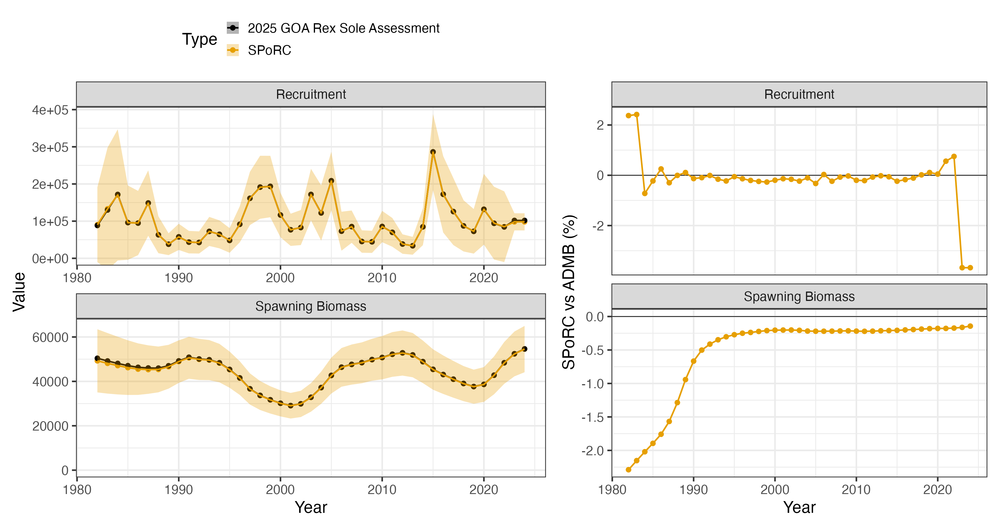
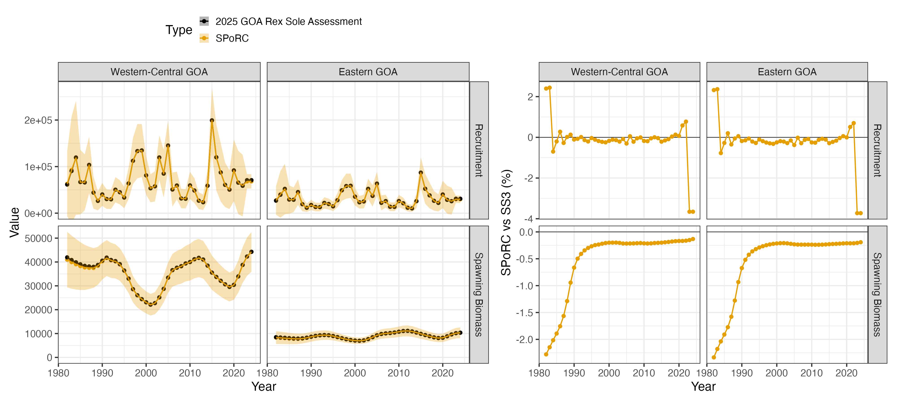
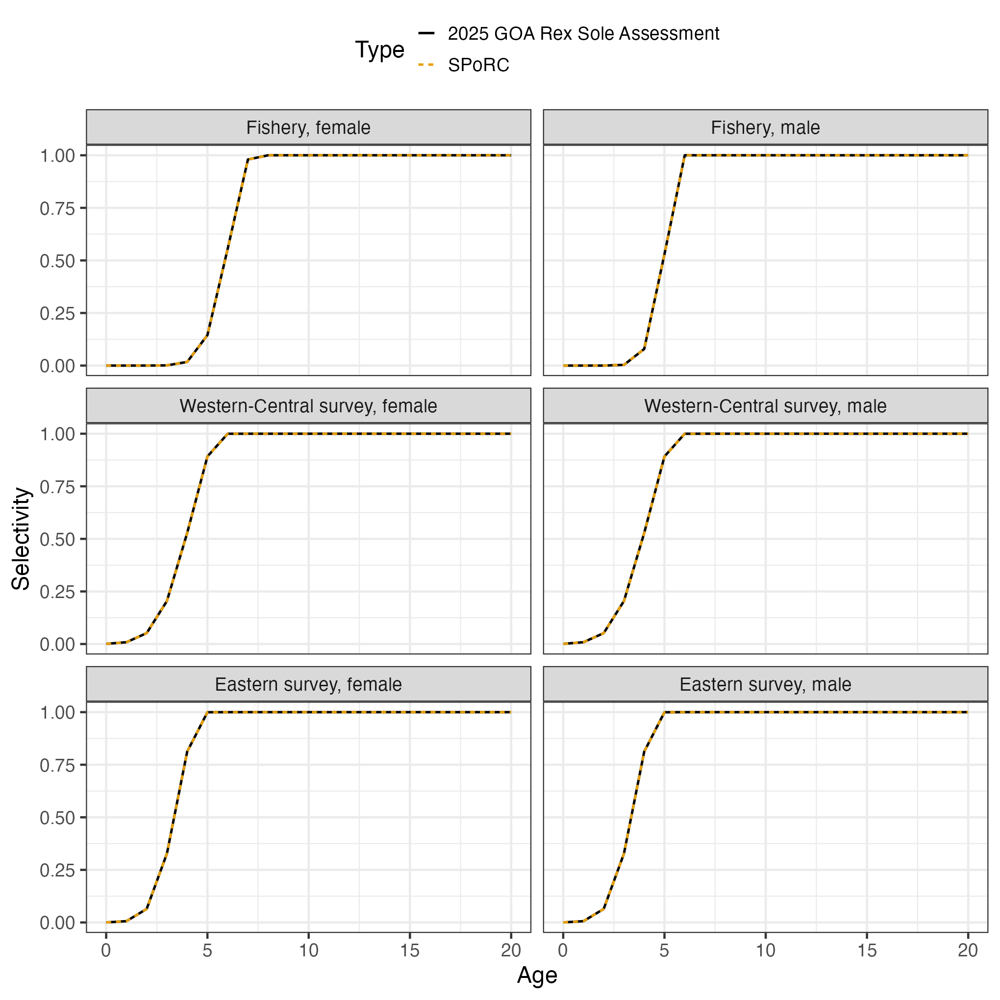
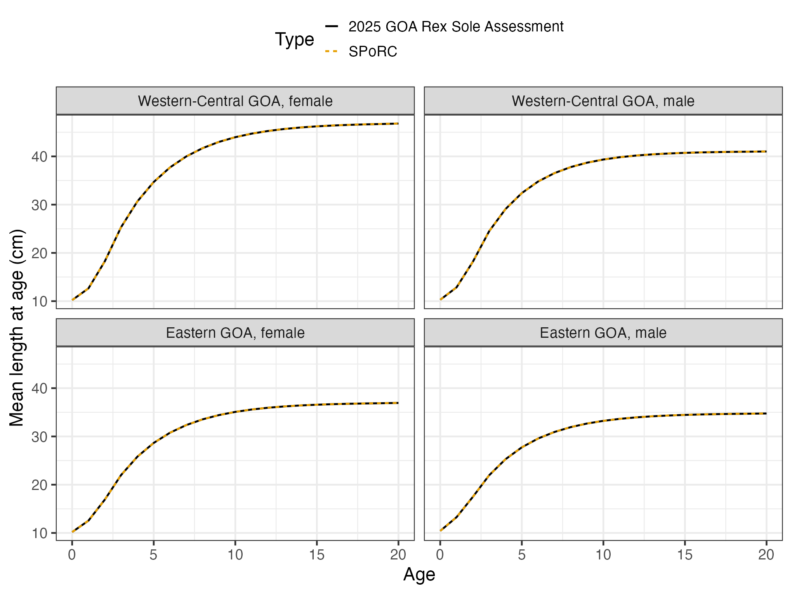

# Case Study: GOA Rex Sole

## Overview

This case study reproduces Model 25.1 of the 2025 Gulf of Alaska rex
sole assessment, run in Stock Synthesis 3, in `SPoRC`.

The model is two area, two sex, single season, with one fishery and one
bottom trawl survey in each area. Growth is estimated separately in each
area and sex from the survey’s conditional age-at-length data, which is
what this case study exercises: `SPoRC`’s parametric growth module and
its conditional age-at-length likelihood, both added for it.

| Source | Years | Observations | Likelihood |
|----|----|----|----|
| Catch, Western-Central GOA | 1982–2024 | 43 | Lognormal, CV 0.01 |
| Survey biomass, both areas | 1990–2023 | 31 | Lognormal |
| Fishery length compositions | 1982–2024 | 21 | Multinomial |
| Fishery age compositions | 1992–2022 | 18 | Multinomial |
| Survey length compositions, both areas | 1990–2023 | 31 | Multinomial |
| Survey conditional age-at-length, both areas | 1993–2019 | 482 length bins | Multinomial |

Ages run $`a = 0`$ to $`a_{+} = 20`$ with ages observed from $`1`$ to
$`20`$, lengths are 29 two centimeter bins from 10 to 66 cm, and model
years run $`y_{1} = 1982`$ to $`y_{\text{end}} = 2024`$. Recruitment is
age 0, mean recruitment apportioned between the two areas by an
estimated fraction, with $`\sigma_{R} = 0.6`$. The Eastern area has no
catch, so its population is shaped entirely by the survey.

``` r

library(SPoRC)
library(dplyr)
library(ggplot2)
data("mlt_rg_goa_rex_data")

dat <- mlt_rg_goa_rex_data
yrs <- dat$years
n_yrs <- length(yrs)
ages <- dat$ages
n_ages <- length(ages)
n_reg <- dat$n_regions
n_sex <- dat$n_sexes
n_fish <- dat$n_fish_fleets
n_srv <- dat$n_srv_fleets
```

## Model dimensions

``` r

input_list <- Setup_Mod_Dim(
  years = yrs,
  ages = ages,
  lens = dat$lens,
  n_regions = n_reg,
  n_sexes = n_sex,
  n_fish_fleets = n_fish,
  n_srv_fleets = n_srv,
  n_seas = 1,
  n_pop = 1,
  natal_region = 1,
  verbose = FALSE
)
```

## Recruitment

Recruitment is age 0 at the start of the year under mean recruitment
with global density dependence, apportioned to the two areas by an
estimated logit. The first year’s ages 1 to 17 are set by early
deviations shared across areas and sexes, and the bias ramp’s four
breakpoints are given in deviation index space, where the first model
year is 1.

``` r

input_list <- Setup_Mod_Rec(
  input_list = input_list,
  rec_model = "mean_rec",
  rec_dd = "global",
  rec_lag = 0,
  SR_ref_yr = 1,
  t_spawn = 0,
  sigmaR_spec = "fix",
  ln_sigmaR = array(log(dat$rec$sigmaR), dim = c(2, 1, n_reg)),
  sigmaR_switch = 1,
  do_rec_bias_ramp = 1,
  bias_year = dat$rec$bias_years - yrs[1] + 1,
  max_bias_ramp_fct = dat$rec$max_bias_adj,
  RecDevs_spec = "est_shared_pop_r",
  RecDevs_pen_center = "fixed",
  dont_est_recdev_last = 0,
  init_age_strc = 2,
  equil_init_age_strc = 1,
  InitDevs_spec = "est_shared_pop_r",
  InitDevs_sex_spec = "est_shared_s",
  InitDevs_pen_center = "fixed",
  rec_region_prop_spec = NULL,
  ln_global_R0 = dat$mle$ln_R0
)
```

Two of the breakpoints fall before the first model year, 1958.7 and
1988.5 become $`-22.3`$ and $`7.5`$, which is how the early deviations
find their ramp values. The bridge stage checks both ramps against the
assessment’s own.

## Biological dynamics

Natural mortality is fixed at 0.17. Maturity is logistic on age for
females, with none below age 3, and males have none. Growth is
estimated, one Schnute-Francis curve per area and sex, starting from the
assessment’s estimates, and weight at age is derived from it through the
weight-length relationship.

``` r

MatAA <- array(0, dim = c(1, n_reg, n_yrs, 1, n_ages, n_sex))
mat_f <- 1 / (1 + exp(dat$mat$slope * (ages - dat$mat$a50)))
mat_f[ages < dat$mat$first_mature_age] <- 0
for(r in 1:n_reg) for(y in 1:n_yrs) MatAA[1, r, y, 1, , 1] <- mat_f

wl <- array(NA_real_, dim = c(1, n_reg, n_sex, 2))
for(r in 1:n_reg) {
  wl[1, r, 1, ] <- dat$wtlen$fem
  wl[1, r, 2, ] <- dat$wtlen$mal
}

input_list <- Setup_Mod_Biologicals(
  input_list = input_list,
  WAA = NULL,
  MatAA = MatAA,
  fit_lengths = 1,
  SizeAgeTrans = NA,
  AgeingError = dat$AgeingError,
  M_spec = "fix",
  do_caal = 1,
  Fixed_natmort = array(dat$growth[[1]]$M, dim = c(1, n_reg, n_yrs, n_ages, n_sex)),
  addtocomp = dat$comp$addtocomp_age,
  comp_const_obs = 1,
  addtosrvidx = 0,
  addtofishidx = 0,
  growth_model = "vb_schnute",
  ln_growth_pars = log(dat$mle$growth),
  growth_spec = "est_all",
  growth_A1 = dat$growth_A1,
  growth_A2 = dat$growth_A2,
  growth_len_lower = dat$lens_lower,
  growth_L0 = dat$lens_lower[1],
  growth_plus_group = "mixture",
  waa_model = "wt_len",
  wt_len_pars = wl
)
```

`WAA = NULL` and `SizeAgeTrans = NA` because both come out of the growth
module rather than going in as data. Each fleet’s age-length key and
weight at age are read at that fleet’s own timing: the surveys’ at
`t_srv` and the fishery’s at `t_fish`, both the middle of the year here,
where the assessment reads them, and the spawning weight at `t_spawn`.
`growth_len_lower` holds the lower edges of the bins, which is what the
assessment’s key is built on, rather than the midpoints in `lens`.

The ageing error matrix is the assessment’s, a normal on observed age
with the standard deviation growing with true age, binned to the
observed ages 1 to 20 with the tails accumulated into the end bins.

## Movement and tagging

Nothing moves, so movement is fixed at the identity and tagging is off.

``` r

input_list <- Setup_Mod_Movement(
  input_list = input_list,
  use_fixed_movement = 1,
  Fixed_Movement = NA,
  do_recruits_move = 0
)

input_list <- Setup_Mod_Tagging(input_list = input_list, use_conv_fish_tagging = 0)
```

## Catch and fishing mortality

Catch is in the Western-Central area only. Fishing mortality is a free
parameter per year with no penalty, kept to the catch by a lognormal
likelihood at CV 0.01.

``` r

input_list <- Setup_Mod_Catch_and_F(
  input_list = input_list,
  ObsCatch = dat$ObsCatch,
  UseCatch = dat$UseCatch,
  Use_F_pen = 0,
  ln_F_mean_spec = "fix",
  sigmaC_spec = "fix",
  ln_sigmaC = array(log(dat$catch_se_value), dim = c(n_reg, n_yrs, 1, n_fish))
)
```

## Fishery compositions

The fishery has no index and has joint-sex marginal lengths and ages.

``` r

joint <- function(n) paste0("spltRjntS_Year_1-terminal_Fleet_", seq_len(n))
none <- function(n) paste0("none_Year_1-terminal_Fleet_", seq_len(n))

input_list <- Setup_Mod_FishIdx_and_Comps(
  input_list = input_list,
  ObsFishIdx = array(NA_real_, dim = c(n_reg, n_yrs, 1, n_fish)),
  ObsFishIdx_SE = array(NA_real_, dim = c(n_reg, n_yrs, 1, n_fish)),
  UseFishIdx = array(0, dim = c(n_reg, n_yrs, 1, n_fish)),
  fish_idx_type = rep("none", n_fish),
  FishIdx_LikeType = rep("lognormal", n_fish),
  ObsFishAgeComps = dat$ObsFishAgeComps,
  UseFishAgeComps = dat$UseFishAgeComps,
  ISS_FishAgeComps = dat$ISS_FishAgeComps,
  ObsFishLenComps = dat$ObsFishLenComps,
  UseFishLenComps = dat$UseFishLenComps,
  ISS_FishLenComps = dat$ISS_FishLenComps,
  FishAgeComps_LikeType = rep("Multinomial", n_fish),
  FishLenComps_LikeType = rep("Multinomial", n_fish),
  FishAgeComps_Type = joint(n_fish),
  FishLenComps_Type = joint(n_fish)
)
```

## Survey indices and compositions

Each area’s survey has a biomass index at mid year, joint-sex length
compositions, and conditional age-at-length. The assessment also holds
the surveys’ marginal ages as ghost fleets, so those go in but are not
fit.

The conditional age-at-length arrays are indexed by region, year,
season, length bin, age, sex and fleet, with a use flag and a sample
size per length bin. `Srv_caal_Type` is split by sex as well as region,
since each row holds one sex’s otoliths.

``` r

t_srv <- array(rep(dat$t_srv, each = n_reg), dim = c(n_reg, 1, n_srv))

input_list <- Setup_Mod_SrvIdx_and_Comps(
  input_list = input_list,
  ObsSrvIdx = dat$ObsSrvIdx,
  ObsSrvIdx_SE = dat$ObsSrvIdx_SE,
  UseSrvIdx = dat$UseSrvIdx,
  srv_idx_type = rep("biom", n_srv),
  SrvIdx_LikeType = rep("lognormal", n_srv),
  ObsSrvAgeComps = dat$ObsSrvAgeComps,
  UseSrvAgeComps = array(0, dim = dim(dat$UseSrvAgeComps)),
  ISS_SrvAgeComps = dat$ISS_SrvAgeComps,
  ObsSrvLenComps = dat$ObsSrvLenComps,
  UseSrvLenComps = dat$UseSrvLenComps,
  ISS_SrvLenComps = dat$ISS_SrvLenComps,
  SrvAgeComps_LikeType = rep("none", n_srv),
  SrvLenComps_LikeType = rep("Multinomial", n_srv),
  SrvAgeComps_Type = none(n_srv),
  SrvLenComps_Type = joint(n_srv),
  ObsSrv_caal = dat$ObsSrv_caal,
  UseSrv_caal = dat$UseSrv_caal,
  ISS_Srv_caal = dat$ISS_Srv_caal,
  Srv_caal_LikeType = rep("Multinomial", n_srv),
  Srv_caal_Type = paste0("spltRspltS_Year_1-terminal_Fleet_", seq_len(n_srv)),
  t_srv = t_srv
)
```

## Selectivity

Every fleet is an age-based double normal, time invariant, with the male
curve a parameter offset from the female one. The assessment leaves the
ascending limb’s starting height unanchored and takes the descending
limb to one, which `fish_sel_dbnrml_raw` and `srv_sel_dbnrml_raw`
express.

``` r

input_list <- Setup_Mod_Fishsel_and_Q(
  input_list = input_list,
  fish_sel_model = paste0("dbnrml_Fleet_", seq_len(n_fish)),
  cont_tv_fish_sel = paste0("none_Fleet_", seq_len(n_fish)),
  fish_sel_blocks = paste0("none_Fleet_", seq_len(n_fish)),
  fish_q_blocks = paste0("none_Fleet_", seq_len(n_fish)),
  fish_fixed_sel_pars_spec = rep("est_all", n_fish),
  fish_sel_sex_offset = rep("par", n_fish),
  fish_sel_dbnrml_raw = matrix(c(1, 0), n_fish, 2, byrow = TRUE),
  fish_q_spec = rep("fix", n_fish)
)

q_prior <- data.frame(region = 1, fleet = 1, block = 1,
                      mu = exp(dat$q$prior_mean), sd = dat$q$prior_sd)

input_list <- Setup_Mod_Srvsel_and_Q(
  input_list = input_list,
  srv_sel_model = paste0("dbnrml_Fleet_", seq_len(n_srv)),
  cont_tv_srv_sel = paste0("none_Fleet_", seq_len(n_srv)),
  srv_sel_blocks = paste0("none_Fleet_", seq_len(n_srv)),
  srv_q_blocks = paste0("none_Fleet_", seq_len(n_srv)),
  srv_fixed_sel_pars_spec = rep("est_all", n_srv),
  srv_sel_sex_offset = rep("par", n_srv),
  srv_sel_dbnrml_raw = matrix(c(1, 0), n_srv, 2, byrow = TRUE),
  srv_q_spec = rep("est_all", n_srv),
  Use_srv_q_prior = 1,
  srv_q_prior = q_prior,
  t_srv = t_srv
)
```

The Western-Central survey’s catchability holds the assessment’s normal
prior on the log scale. The Eastern survey’s is mirrored onto it by the
map, which the bridge helper sets once the parameters are seeded.

## Weighting

Francis weights, one per fleet, on the lengths and on the ages, with the
conditional age-at-length taking each survey’s age weight.

``` r

wl_f <- dat$var_adj_len[dat$fish_fleets]; wa_f <- dat$var_adj_age[dat$fish_fleets]
wl_s <- dat$var_adj_len[dat$srv_fleets]; wa_s <- dat$var_adj_age[dat$srv_fleets]

per_fleet <- function(w, n_fl, extra = NULL) {
  d <- c(n_reg, n_yrs, 1, if(!is.null(extra)) extra, n_sex, n_fl)
  arr <- array(1, dim = d)
  for(f in seq_len(n_fl)) if(is.null(extra)) arr[, , , , f] <- w[f] else arr[, , , , , f] <- w[f]
  arr
}

input_list <- Setup_Mod_Weighting(
  input_list = input_list,
  Wt_Catch = 1, Wt_FishIdx = 0, Wt_SrvIdx = 1, Wt_Rec = 1, Wt_F = 1, Wt_Tagging = 0,
  Wt_FishAgeComps = per_fleet(wa_f, n_fish),
  Wt_FishLenComps = per_fleet(wl_f, n_fish),
  Wt_SrvAgeComps = per_fleet(rep(1, n_srv), n_srv),
  Wt_SrvLenComps = per_fleet(wl_s, n_srv),
  Wt_Srv_caal = per_fleet(wa_s, n_srv, extra = length(dat$lens))
)
```

## Starting at the assessment’s estimate

Every parameter is set to the assessment’s estimate and the model is
evaluated there without optimizing. The bridge helper does this in one
call; the pieces are the recruitment and early deviations less their
bias corrections, log fishing mortality as a fixed mean plus deviations,
the shared catchability, and the growth and selectivity parameters in
`SPoRC`’s transforms.

``` r

source(system.file("tests", "testthat", "helper-bridge_goa_rex.R", package = "SPoRC"))

input_list <- seed_goa_rex_mle(build_goa_rex_input(dat), dat)
seed <- fit_model(input_list$data, input_list$par, input_list$map,
                  do_optim = FALSE, silent = TRUE)
```

The comparison before anything is optimized, against a report file with
six significant digits:

    numbers at age                       5.1e-03 %
    spawning biomass                     4.7e-03 %
    recruitment                          5.0e-03 %
    total biomass, January 1             4.8e-03 %
    predicted catch                      5.0e-03 %
    survey indices                       4.7e-03 %
    mean length at age                   4.9e-04 %
    SD of length at age                  4.7e-04 %
    weight at age                        9.4e-04 %
    bias ramps, main and early           1e-06    (absolute)
    selectivity, all six curves          2.7e-06  (absolute)
    mid-season age-length key            1.8e-06  (absolute)
    expected conditional age-at-length   1e-04    (absolute)

`SPoRC` writes each likelihood component as a proper density where the
assessment drops normalizing constants and renormalizes after its
composition constant, so the comparison subtracts exactly what it omits:

| Component | `SPoRC` less constants | Assessment | Difference |
|----|----|----|----|
| Survey indices | -16.624337 | -16.624600 | $`2.6\times10^{-4}`$ |
| Length compositions | 173.730454 | 173.730000 | $`4.5\times10^{-4}`$ |
| Age compositions, marginal and conditional | 472.900640 | 472.878000 | $`2.3\times10^{-2}`$ |
| Recruitment deviations, early and main | -3.195058 | -3.195050 | $`-7.8\times10^{-6}`$ |
| Catchability prior | 0.161410 | 0.161411 | $`-5.1\times10^{-7}`$ |

The total comes to 626.9731 against the assessment’s 626.9510. The whole
difference sits in the age compositions, $`5\times10^{-5}`$ of their
value, and is the conditional age-at-length rows, where the assessment’s
constant is added before the row is filtered to the observed bins and
`SPoRC`’s after.

## Fitting and comparison

``` r

est <- fit_model(input_list$data, input_list$par, input_list$map,
                 do_optim = TRUE, newton_loops = 3, silent = TRUE)
est$sdrep <- RTMB::sdreport(est, hessian.fixed = est$he(est$optim$par))
```

132 parameters, 20 of them growth and 22 selectivity, which is the
assessment’s own count. The objective falls by 0.10 from the
assessment’s estimate, and the fitted selectivity stays within
$`1\times10^{-3}`$ of the assessment’s on every curve.

|                                       | Median  | Maximum |
|---------------------------------------|---------|---------|
| Spawning biomass, total               | -0.22 % | 2.3 %   |
| Recruitment, total                    | -0.13 % | 3.7 %   |
| Spawning biomass, Western-Central GOA | -0.21 % | 2.3 %   |
| Spawning biomass, Eastern GOA         | -0.24 % | 2.3 %   |

|                                   | `SPoRC`  | Assessment |
|-----------------------------------|----------|------------|
| $`\ln R_{0}`$                     | 11.49400 | 11.53150   |
| Catchability                      | 1.09617  | 1.09349    |
| Eastern apportionment, logit      | -0.82909 | -0.82836   |
| $`L_{1}`$, Western-Central female | 13.8667  | 13.8634    |
| $`L_{2}`$, Western-Central female | 46.7532  | 46.7417    |
| $`K`$, Western-Central female     | 0.28356  | 0.28384    |
| $`L_{1}`$, Eastern female         | 13.7195  | 13.7239    |
| $`L_{2}`$, Eastern female         | 36.9039  | 36.9021    |
| $`K`$, Eastern female             | 0.29256  | 0.29252    |



## Why the two differ

Everything in the population dynamics, the growth, the observation model
and the selectivity agrees at the assessment report’s own print
precision, and so does every likelihood component but the conditional
age-at-length constant. The refit moves spawning biomass by a quarter of
a percent and $`\ln R_{0}`$ by 0.04.

The difference is the sum-to-zero constraint on the assessment’s
recruitment deviations. Stock Synthesis declares them a `devvector`, so
the 41 deviations of 1982 to 2022 sum to zero and $`R_{0}`$ is the mean
recruitment of those years by construction. `SPoRC` estimates its
deviations freely under the penalty, so the mean recruitment of the
years with deviations can differ from $`R_{0}`$, which also sets the
initial equilibrium and the two terminal years without deviations. Under
mean recruitment with no stock-recruit curve the data prefer about two
percent more recruitment in the deviation years, so $`R_{0}`$ falls
almost 4 percent with the deviations rising to match, and the early
years, set by the prior on the initial-age deviations rather than by
data, follow $`R_{0}`$ part of the way.
