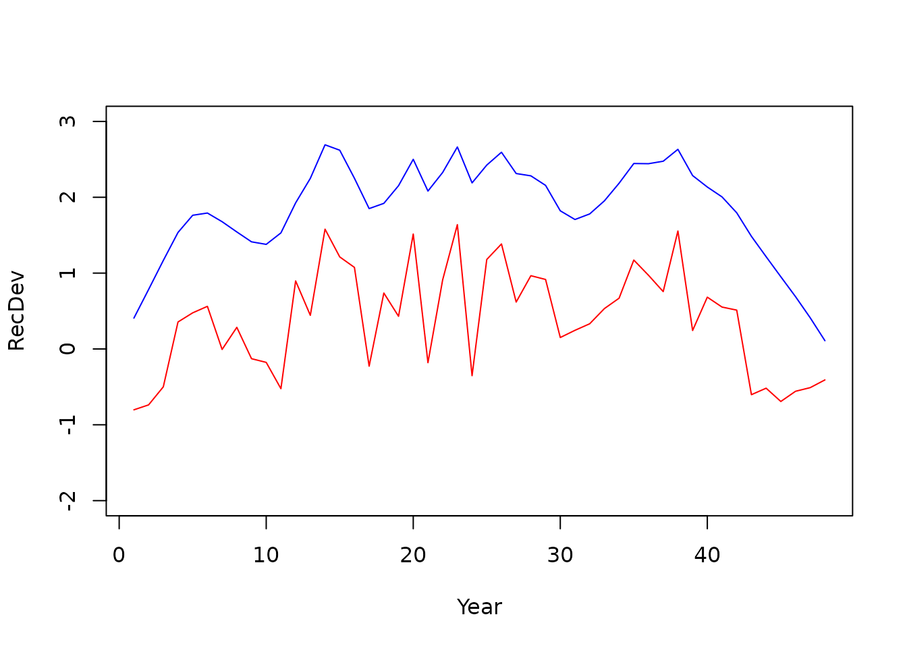

# Dynamic Structural Equation Models

A dynamic structural equation model (dsem) specifies how a set of
time-series affect each other using an arrow lag notation, and computes
a joint density over all time-series. Within the context of a stock
assessment, the time-series we are primarily focused on are deviation
process errors (e.g., recruitment), and how these process errors might
be explained by environmental covariates. In `SPoRC`, various population
processes can be linked to a dsem model, thereby replacing the process
error penalty a given process originally had (e.g., iid recruitment
deviations) with a dsem density (which can express iid recruitment
deviations and more). In the following, we demonstrate how a dsem can be
specified (Thorson et al. 2024) using `SPoRC`, and the various processes
to which a dsem can be linked. Specifically, we first demonstrate the
dsem model and the mathematical underpinnings of it, fit a dsem within
the context of a stock assessment model, conduct a self test and cross
test (more on this later), illustrate dsem forecasting capabilities
(more on this later), and conclude with a closed loop simulation using a
dsem integrated model (more on this later).

``` r

library(SPoRC)
library(RTMB)
```

## What a dsem is

### Arrow and Lag notation

In general, a dsem can be specified using arrow and lag notation (and
see Thorson et al. 2024 for further details). Here, we specify one arrow
per line, which follows the nomenclature of
`from -> to, lag, name, start`. The time-series `from`, `lag` years
earlier, affects the time-series `to`. The coefficient is the parameter
`name`, or is fixed at `start` when the name is set to `NA`. This
formulation therefore specifies a path coefficient in a dsem model
(i.e., analogous to a regression coefficient in a linear model). An sd
line can then be specified using a double-headed arrow notation
`a <-> a, 0, name, start`, while a covariance between two series’
innovations is `a <-> b, 0, name, start`. A name used on two arrows is
one shared parameter (i.e., the same name in two lines). An example is
provided below where we specify that an environmental covariate in year
`x` has an impact on recruitment in year `x`, while the environmental
covariate itself follows an AR(1) like process
$`x_t = \rho x_{t-1} + \varepsilon_t`$. Process error for the
environmental covariate and recruitment deviations is then specified as
well.

``` r

arrows <- c("env -> rec, 0, b_env, 0.5",     # this year's covariate affects this year's recruitment
            "env -> env, 1, rho, 0.5",       # the covariate follows itself from last year
            "env <-> env, 0, sd_env, 0.5",   # covariate innovation sd
            "rec <-> rec, 0, sd_rec, 0.5")   # recruitment innovation sd

m <- read_dsem_arrows(arrows, variables = c("env", "rec"))
m$arrows[, c("type", "from", "to", "lag", "name")]
#>   type from  to lag   name
#> 1 path  env rec   0  b_env
#> 2 path  env env   1    rho
#> 3   sd  env env   0 sd_env
#> 4   sd  rec rec   0 sd_rec
```

`read_dsem_arrows` is not used directly by the user but can be a useful
way to understand the various processes specified within the dsem as
well as where things fit within matrices used when specifying a dsem.

### Going from arrows to a density function

Building off of this simplified example, we hope to provide intuition
for how a dsem likelihood is computed. In this case, we continue using
the `env` time-series and `rec` time-series, while specifying three
years and the four arrows written as above. Here, we write the values as
a matrix / grid, years in the rows and series in the column, and number
the cells series by series:

              env     rec
    year 1    1       4
    year 2    2       5
    year 3    3       6

Note that each cell has an innovation (i.e., the part that the arrows
themselves do not explain). For example, the recruitment innovation in
year 2 is cell 5 minus `b_env` times cell 2, because `env -> rec, 0`:

``` math
\begin{aligned}
\varepsilon^{rec}_2 &= rec_2 - b_{env}\,env_2 \\
rec_2 &= b_{env}\,env_2 + \varepsilon^{rec}_2
\end{aligned}
```

The covariate innovation in year 2 is cell 2 minus `rho` times cell 1,
given that `env -> env, 1`:

``` math
\begin{aligned}
\varepsilon^{env}_2 &= env_2 - \rho\,env_1 \\
env_2 &= \rho\,env_1 + \varepsilon^{env}_2
\end{aligned}
```

Note that year 1 has nothing before it so the covariate innovation is
just cell 1. We can then collect all those subtractions into a matrix
called `B` with one row per cell: e.g., row 5 has `b_env` in column 2,
row 2 has `rho` in column 1. Then the vector of innovations can be
expressed as:

``` math
\varepsilon = (I - B)(x - \mu)
```

where

- $`x`$ is the grid stacked into one vector of length 6, cell order as
  above
- $`\mu`$ is each cell’s mean, a constant per series (zero for a
  deviation)
- $`B`$ is the 6 by 6 matrix of path coefficients, row $`k`$ holding the
  coefficients on the cells that point into cell $`k`$
- $`I`$ is the identity, so $`I - B`$ has ones on the diagonal and minus
  each coefficient off it
- $`\varepsilon`$ is the vector of innovations, one per cell

Written out in full for this 3-year, 2-series example, $`B`$ is (rows
are the cell being predicted, columns are the cell doing the
predicting):

``` math
B =
\begin{pmatrix}
0 & 0 & 0 & 0 & 0 & 0 \\
\rho & 0 & 0 & 0 & 0 & 0 \\
0 & \rho & 0 & 0 & 0 & 0 \\
b_{env} & 0 & 0 & 0 & 0 & 0 \\
0 & b_{env} & 0 & 0 & 0 & 0 \\
0 & 0 & b_{env} & 0 & 0 & 0
\end{pmatrix}
\begin{matrix}
\leftarrow env_1 \\ \leftarrow env_2 \\ \leftarrow env_3 \\ \leftarrow rec_1 \\ \leftarrow rec_2 \\ \leftarrow rec_3
\end{matrix}
```

Rows 2-3 hold `env -> env, 1, rho` (one step off the diagonal within the
`env` block), rows 4–6 hold `env -> rec, 0, b_env` (the diagonal of the
lower-left block, since the lag is 0), and row 1 is empty because year 1
has no previous values. Given that, it follows that:

``` math
I - B =
\begin{pmatrix}
1 & 0 & 0 & 0 & 0 & 0 \\
-\rho & 1 & 0 & 0 & 0 & 0 \\
0 & -\rho & 1 & 0 & 0 & 0 \\
-b_{env} & 0 & 0 & 1 & 0 & 0 \\
0 & -b_{env} & 0 & 0 & 1 & 0 \\
0 & 0 & -b_{env} & 0 & 0 & 1
\end{pmatrix}
\begin{matrix}
\leftarrow env_1 \\ \leftarrow env_2 \\ \leftarrow env_3 \\ \leftarrow rec_1 \\ \leftarrow rec_2 \\ \leftarrow rec_3
\end{matrix}
```

Writing the centered values as $`\tilde{x} = x - \mu`$, and taking
$`\mu = 0`$ as it is for a deviation series, multiplying through
recovers every innovation at once:

``` math
\varepsilon = (I - B)\,x =
\begin{pmatrix}
1 & 0 & 0 & 0 & 0 & 0 \\
-\rho & 1 & 0 & 0 & 0 & 0 \\
0 & -\rho & 1 & 0 & 0 & 0 \\
-b_{env} & 0 & 0 & 1 & 0 & 0 \\
0 & -b_{env} & 0 & 0 & 1 & 0 \\
0 & 0 & -b_{env} & 0 & 0 & 1
\end{pmatrix}
\begin{pmatrix}
env_1 \\ env_2 \\ env_3 \\ rec_1 \\ rec_2 \\ rec_3
\end{pmatrix}
=
\begin{pmatrix}
env_1 \\
env_2 - \rho\,env_1 \\
env_3 - \rho\,env_2 \\
rec_1 - b_{env}\,env_1 \\
rec_2 - b_{env}\,env_2 \\
rec_3 - b_{env}\,env_3
\end{pmatrix}
=
\begin{pmatrix}
\varepsilon^{env}_1 \\ \varepsilon^{env}_2 \\ \varepsilon^{env}_3 \\ \varepsilon^{rec}_1 \\ \varepsilon^{rec}_2 \\ \varepsilon^{rec}_3
\end{pmatrix}
\begin{matrix}
\leftarrow env_1 \\ \leftarrow env_2 \\ \leftarrow env_3 \\ \leftarrow rec_1 \\ \leftarrow rec_2 \\ \leftarrow rec_3
\end{matrix}
```

Next, the two `<->` lines then fill a diagonal matrix of innovation
standard deviations:

``` math
\Gamma = \mathrm{diag}(sd_{env},\, sd_{env},\, sd_{env},\, sd_{rec},\, sd_{rec},\, sd_{rec}), \qquad \varepsilon \sim \mathrm{MVN}(0,\, \Gamma\Gamma^\top)
```

The two `<->` lines give the variance of each innovation:
$`\mathrm{Var}(\varepsilon^{env}_t) = sd_{env}^2`$ and
$`\mathrm{Var}(\varepsilon^{rec}_t) = sd_{rec}^2`$, with all innovations
assumed to be independent. From these, we can work out the variance of
the time-series themselves, one cell at a time, using the same equations
as above.

In the case of the covariate, year 1 is only its own innovation, so:

``` math
\mathrm{Var}(env_1) = sd_{env}^2
```

Year 2 is $`env_2 = \rho\, env_1 + \varepsilon^{env}_2`$. The two terms
are independent, so their variances add:

``` math
\mathrm{Var}(env_2) = \rho^2\,\mathrm{Var}(env_1) + sd_{env}^2 = (1 + \rho^2)\, sd_{env}^2
```

Lastly, year 3 works the same way:

``` math
\mathrm{Var}(env_3) = \rho^2\,\mathrm{Var}(env_2) + sd_{env}^2 = (1 + \rho^2 + \rho^4)\, sd_{env}^2
```

In words, each year keeps a shrunken copy of last year’s variability and
adds a new shock. For $`|\rho| < 1`$, this levels off at
$`sd_{env}^2 / (1 - \rho^2)`$ (i.e., it is stationary).

For recruitment defined as
$`rec_t = b_{env}\, env_t + \varepsilon^{rec}_t`$, the variance can be
written as:

``` math
\mathrm{Var}(rec_t) = b_{env}^2\,\mathrm{Var}(env_t) + sd_{rec}^2
```

Recruitment variability is its own shock plus whatever the covariate
passes through $`b_{env}`$. When $`b_{env} = 0`$, this is just
$`sd_{rec}^2`$ every year, which is the usual iid recruitment deviation.

In addition to the variances, the covariances can also be written out
as:

``` math
\mathrm{Cov}(env_1, env_2) = \rho\, sd_{env}^2, \qquad
\mathrm{Cov}(env_t, rec_t) = b_{env}\,\mathrm{Var}(env_t), \qquad
\mathrm{Cov}(rec_1, rec_2) = b_{env}^2\,\rho\, sd_{env}^2
```

Note that recruitment deviations become autocorrelated even though there
is no `rec -> rec` arrow, because they inherit the covariate’s
autocorrelation through $`b_{env}`$. Putting this together in a compact
matrix form, this can be expressed as:

``` math
\Sigma = \mathrm{Var}(x) = (I - B)^{-1}\,\Gamma\Gamma^\top\,(I - B)^{-\top}
```

Here, $`(I - B)^{-1}`$ substitutes the equations into each other, as we
did by hand above. Each row writes a cell as a sum of the innovations
that flow into it:

``` math
(I - B)^{-1} =
\begin{pmatrix}
1 & 0 & 0 & 0 & 0 & 0 \\
\rho & 1 & 0 & 0 & 0 & 0 \\
\rho^2 & \rho & 1 & 0 & 0 & 0 \\
b_{env} & 0 & 0 & 1 & 0 & 0 \\
b_{env}\rho & b_{env} & 0 & 0 & 1 & 0 \\
b_{env}\rho^2 & b_{env}\rho & b_{env} & 0 & 0 & 1
\end{pmatrix}
\begin{matrix}
\leftarrow env_1 \\ \leftarrow env_2 \\ \leftarrow env_3 \\ \leftarrow rec_1 \\ \leftarrow rec_2 \\ \leftarrow rec_3
\end{matrix}
```

For example, row 3 says
$`env_3 = \rho^2\varepsilon^{env}_1 + \rho\,\varepsilon^{env}_2 + \varepsilon^{env}_3`$.
The innovations themselves are independent, with variance:

``` math
\Gamma\Gamma^\top =
\begin{pmatrix}
sd_{env}^2 & 0 & 0 & 0 & 0 & 0 \\
0 & sd_{env}^2 & 0 & 0 & 0 & 0 \\
0 & 0 & sd_{env}^2 & 0 & 0 & 0 \\
0 & 0 & 0 & sd_{rec}^2 & 0 & 0 \\
0 & 0 & 0 & 0 & sd_{rec}^2 & 0 \\
0 & 0 & 0 & 0 & 0 & sd_{rec}^2
\end{pmatrix}
```

Multiplying these out, and writing $`v_1 = sd_{env}^2`$,
$`v_2 = (1+\rho^2)\,sd_{env}^2`$, and
$`v_3 = (1+\rho^2+\rho^4)\,sd_{env}^2`$ for the covariate variances
derived above, the full variance is:

``` math
\Sigma =
\begin{pmatrix}
v_1 & \rho v_1 & \rho^2 v_1 & b_{env} v_1 & b_{env}\rho v_1 & b_{env}\rho^2 v_1 \\
\rho v_1 & v_2 & \rho v_2 & b_{env}\rho v_1 & b_{env} v_2 & b_{env}\rho v_2 \\
\rho^2 v_1 & \rho v_2 & v_3 & b_{env}\rho^2 v_1 & b_{env}\rho v_2 & b_{env} v_3 \\
b_{env} v_1 & b_{env}\rho v_1 & b_{env}\rho^2 v_1 & b_{env}^2 v_1 + sd_{rec}^2 & b_{env}^2\rho v_1 & b_{env}^2\rho^2 v_1 \\
b_{env}\rho v_1 & b_{env} v_2 & b_{env}\rho v_2 & b_{env}^2\rho v_1 & b_{env}^2 v_2 + sd_{rec}^2 & b_{env}^2\rho v_2 \\
b_{env}\rho^2 v_1 & b_{env}\rho v_2 & b_{env} v_3 & b_{env}^2\rho^2 v_1 & b_{env}^2\rho v_2 & b_{env}^2 v_3 + sd_{rec}^2
\end{pmatrix}
\begin{matrix}
\leftarrow env_1 \\ \leftarrow env_2 \\ \leftarrow env_3 \\ \leftarrow rec_1 \\ \leftarrow rec_2 \\ \leftarrow rec_3
\end{matrix}
```

The structure of the covariance can then be seen as:

- The top-left block is the covariate’s AR(1) variance.
- The off-diagonal blocks are that same block scaled by $`b_{env}`$.
- The bottom-right block is that same block scaled by $`b_{env}^2`$,
  plus recruitment’s own $`sd_{rec}^2`$ on the diagonal.

Every entry of $`\Sigma`$ is non-zero, because every cell shares at
least one innovation with every other cell (only in one direction for
later years).

In practice, the density is evaluated using the precision
$`Q = \Sigma^{-1} = (I - B)^\top(\Gamma\Gamma^\top)^{-1}(I - B)`$ rather
than $`\Sigma`$. Written out, $`Q`$ is sparse:

``` math
Q =
\begin{pmatrix}
\frac{1+\rho^2}{sd_{env}^2} + \frac{b_{env}^2}{sd_{rec}^2} & -\frac{\rho}{sd_{env}^2} & 0 & -\frac{b_{env}}{sd_{rec}^2} & 0 & 0 \\
-\frac{\rho}{sd_{env}^2} & \frac{1+\rho^2}{sd_{env}^2} + \frac{b_{env}^2}{sd_{rec}^2} & -\frac{\rho}{sd_{env}^2} & 0 & -\frac{b_{env}}{sd_{rec}^2} & 0 \\
0 & -\frac{\rho}{sd_{env}^2} & \frac{1}{sd_{env}^2} + \frac{b_{env}^2}{sd_{rec}^2} & 0 & 0 & -\frac{b_{env}}{sd_{rec}^2} \\
-\frac{b_{env}}{sd_{rec}^2} & 0 & 0 & \frac{1}{sd_{rec}^2} & 0 & 0 \\
0 & -\frac{b_{env}}{sd_{rec}^2} & 0 & 0 & \frac{1}{sd_{rec}^2} & 0 \\
0 & 0 & -\frac{b_{env}}{sd_{rec}^2} & 0 & 0 & \frac{1}{sd_{rec}^2}
\end{pmatrix}
\begin{matrix}
\leftarrow env_1 \\ \leftarrow env_2 \\ \leftarrow env_3 \\ \leftarrow rec_1 \\ \leftarrow rec_2 \\ \leftarrow rec_3
\end{matrix}
```

The non-zero entries in $`Q`$ correspond exactly to the arrows. There is
one entry for each `env -> env` link between adjacent years and one for
each `env -> rec` link in the same year. A zero means two cells are
independent given all the others (conditional independence, which
induces sparsity). For example, $`rec_1`$ and $`rec_2`$ are unrelated
once $`env_1`$ and $`env_2`$ are known. $`Q`$ is built directly from the
sparse $`I - B`$ without inverting anything, which is why dsem (and
RTMB) can evaluate the density efficiently even when there are many
years and series. An example of this is shown below.

``` r

cells <- SPoRC:::get_dsem_cells(m, n_grid_yrs = 3)   # internal helpers, so the package prefix
parts <- SPoRC:::get_dsem_matrices(dsem_beta = c(b_env = 0.5, rho = 0.6), ln_dsem_sd = log(c(sd_env = 1, sd_rec = 0.8)),
                                   dsem_model = m, dsem_cells = cells)
as.matrix(parts$IminusB)
#>      [,1] [,2] [,3] [,4] [,5] [,6]
#> [1,]  1.0  0.0  0.0    0    0    0
#> [2,] -0.6  1.0  0.0    0    0    0
#> [3,]  0.0 -0.6  1.0    0    0    0
#> [4,] -0.5  0.0  0.0    1    0    0
#> [5,]  0.0 -0.5  0.0    0    1    0
#> [6,]  0.0  0.0 -0.5    0    0    1
parts$sd_cell
#> [1] 1.0 1.0 1.0 0.8 0.8 0.8
```

### Conditional and Marginal Variance in dsem

A dsem time-series has two ways to represent spread, and the sd line
(e.g., `rec <-> rec, 0, sd_rec, 0.5`) can describe either one:

- Conditional (the default): the sd line is the size of each year’s new
  shock, $`\varepsilon_t`$. It is “conditional” because it is how much
  the series would still vary if we already knew last year’s value and
  any covariates pointing in. It is analogous to the residual sd in a
  regression. The series itself ends up more variable than this, because
  the arrows pass variability forward from the past.
- Marginal: the sd line is the size of the series itself, $`x_t`$, i.e.,
  how much the series itself varies overall, including what goes in
  through the arrows. It is analogous to the raw sd of $`y`$ in a
  regression. The model then works out how big each year’s shock must be
  to hit that target.

The two are equal only when no arrows point into the series. The
`dsem_variance` setting in the setup functions (introduced later)
chooses which one the sd line fixes.

#### Example: an AR(1) series

Let’s use an AR1 series to motivate the difference between conditional
and marginal variance, where $`x_t = \rho\, x_{t-1} + \varepsilon_t`$
with sd line $`s`$. Substituting back, year 3 is a sum of past
innovations, with older ones shrunk by $`\rho`$:

``` math
x_3 = \varepsilon_3 + \rho\,\varepsilon_2 + \rho^2\varepsilon_1
\quad\Rightarrow\quad
\mathrm{var}(x_3) = \mathrm{var}(\varepsilon_3) + \rho^2\,\mathrm{var}(\varepsilon_2) + \rho^4\,\mathrm{var}(\varepsilon_1)
```

The two parameterizations fix opposite sides of this equation:

- `"conditional"` (the default) sets
  $`\mathrm{var}(\varepsilon_t) = s^2`$ every year. The series’ spread
  then grows and settles at $`s^2 / (1 - \rho^2)`$ (i.e., the stationary
  variance of $`x_t`$).
- `"diagonal"` / `"marginal"` set $`\mathrm{var}(x_t) = s^2`$ every year
  and then solve backwards for the innovation (i.e., figures out what
  the innovations should be to satisfy the condition).

With $`\rho = 0.5`$ and $`s = 1`$:

| Year | Conditional $`\mathrm{sd}(\varepsilon_t)`$ | Conditional $`\mathrm{var}(x_t)`$ | Marginal $`\mathrm{sd}(\varepsilon_t)`$ | Marginal $`\mathrm{var}(x_t)`$ |
|----|----|----|----|----|
| 1 | 1 | 1.00 | 1 | 1 |
| 2 | 1 | 1.25 | 0.87 | 1 |
| 3 | 1 | 1.31 | 0.87 | 1 |
| $`\infty`$ | 1 | 1.33 | 0.87 | 1 |

In short, under conditional $`s`$ is the size of each year’s new shock.
Under marginal, $`s`$ is the size of the swings you actually see in the
series.

Note that a random walk ($`\rho = 1`$) cannot use the marginal form. The
past alone already fills the target
($`\mathrm{var}(\varepsilon_2) = s^2 - s^2 = 0`$), which leaves no room
for new noise, so the setup refuses that pairing (i.e., because the
random walk series is non-stationary).

#### Why it matters for recruitment

The choice matters most for recruitment. Take `env -> rec, 0, b_env`, so
each year’s recruitment deviation is the covariate’s effect plus a
recruitment shock:

``` math
rec_t = b_{env}\, env_t + \varepsilon^{rec}_t
```

The two pieces are independent, so their variances add:

``` math
\mathrm{var}(rec_t) = b_{env}^2\,\mathrm{var}(env_t) + \mathrm{var}(\varepsilon^{rec}_t)
```

To make this concrete, suppose $`b_{env} = 0.5`$,
$`\mathrm{var}(env_t) = 1`$, and the sd line is `sd_rec` $`= 0.6`$. The
covariate’s contribution is then $`0.5^2 \times 1 = 0.25`$, and the two
settings split things differently:

|  | Covariate part | Shock part, $`\mathrm{var}(\varepsilon^{rec}_t)`$ | Total, $`\mathrm{var}(rec_t)`$ | Total sd |
|----|----|----|----|----|
| No covariate ($`b_{env} = 0`$) | 0 | 0.36 | 0.36 | 0.60 |
| Conditional | 0.25 | $`0.6^2 = 0.36`$ | $`0.25 + 0.36 = 0.61`$ | 0.78 |
| Marginal | 0.25 | $`0.36 - 0.25 = 0.11`$ | $`0.6^2 = 0.36`$ | 0.60 |

- Thus, under conditional, `sd_rec` fixes the shock, so the covariate
  adds variability on top of it. Recruitment deviations become more
  variable (sd 0.78) than in a model without the covariate.
- By contrast, under marginal, `sd_rec` fixes the total, so the
  covariate takes a share of it. Recruitment deviations keep the same
  spread (sd 0.60) as an iid model, and the covariate explains
  $`0.25 / 0.36 \approx 70\%`$ of it, leaving a smaller shock (sd 0.33).

In other words, marginal keeps `sd_rec` comparable to a standard
assessment with iid recruitment deviations. Conditional keeps it
comparable to `dsem`, where `sd_rec` is the variability left over after
the covariate.

#### Diagonal versus marginal

In general, `"diagonal"` and `"marginal"` both read the sd line as the
spread of the series, i.e., $`\mathrm{var}(x_t) = s^2`$. They differ
only in how they handle covariance between series (`a <-> b`). Without
covariance specified, the two give identical results.

Consider the recruitment example again where,
$`rec_t = b_{env}\, env_t + \varepsilon^{rec}_t`$, and add
`env <-> rec`, so the environmental and recruitment innovations are
themselves correlated (correlation $`r`$). The two pieces of $`rec_t`$
are then no longer independent, and their variances no longer simply
add. Therefore, a cross term appears:

``` math
\mathrm{var}(rec_t) = \underbrace{b_{env}^2\,\mathrm{var}(env_t)}_{\text{covariate}} + \underbrace{\mathrm{var}(\varepsilon^{rec}_t)}_{\text{shock}} + \underbrace{2\, b_{env}\, r\, \mathrm{sd}(\varepsilon^{env}_t)\, \mathrm{sd}(\varepsilon^{rec}_t)}_{\text{cross term}}
```

- In this context, `"diagonal"` solves for the shock as if the cross
  term were not there, i.e.,
  $`\mathrm{var}(\varepsilon^{rec}_t) = s^2 - b_{env}^2\,\mathrm{var}(env_t)`$.
  The cross term is then added on top, so the series misses the target.
- `"marginal"` includes the cross term when solving. Because the unknown
  shock sd appears in the cross term as well, there is no simple closed
  form, so the model finds it with a short fixed-point iteration (guess,
  update, repeat until it converges to some solution).

Using the same numbers as above ($`b_{env} = 0.5`$,
$`\mathrm{var}(env_t) = 1`$, target $`s^2 = 0.36`$) plus $`r = 0.3`$:

|  | Shock variance | Covariate part | Cross term | Total $`\mathrm{var}(rec_t)`$ |
|----|----|----|----|----|
| Diagonal | $`0.36 - 0.25 = 0.11`$ | 0.25 | $`2(0.5)(0.3)(1)(0.33) = 0.10`$ | 0.46 (misses 0.36) |
| Marginal | 0.046 | 0.25 | $`2(0.5)(0.3)(1)(0.21) = 0.064`$ | 0.36 (hits target) |

In practice, use `"diagonal"` when there are no covariance lines, since
it is simpler and gives the same answer. However, we recommend
specifying `"marginal"` when there are covariance lines and you need the
series’ spread to equal the sd line exactly.

### Series observed with error

In the above, we assumed that the grid holds a series $`x_t`$ observed
without error, and the arrows specify how it may move from year to year.
However, this is rarely the case, where there is often observation
error. In such a case, this can be specified as:

``` math
y_t \sim f(x_t)
```

where $`y_t`$ is what you measured in year $`t`$ and $`f`$ is whatever
density suits the measurement. That is what the `dsem_family` argument
does (more on this later). The mean of $`f`$ is $`x_t`$ through a link
function, so that $`x_t`$ sits on a scale where a normal makes sense:
counts take a log and $`x_t`$ is the log mean count, while proportions
take a logit link instead.

| `dsem_family` | link | mean of $`y_t`$ | extra spread |
|----|----|----|----|
| `fixed` | identity | $`x_t`$ itself | none, and no observation density |
| `normal`, `gaussian` | identity | $`x_t`$ | estimated sd |
| `gaussian_fixed_sd` | identity | $`x_t`$ | one supplied per observation |
| `lognormal` | log | median $`e^{x_t}`$ | estimated sd, log scale |
| `poisson` | log | $`e^{x_t}`$ | none, set by the mean |
| `bernoulli`, `binomial` | logit | $`1/(1+e^{-x_t})`$ | none, set by the mean |
| `gamma`, `Gamma` | log | $`e^{x_t}`$ | estimated coefficient of variation |
| `tweedie` | log | $`e^{x_t}`$ | estimated sd and power |

Because $`y_t`$ is an observation of the time-series and not the true
time-series itself, $`x_t`$ (the true underlying state that generated
the time-series) can be estimated in every year, whether or not that
year has an observation. Thus, $`x_t`$ becomes the random effect for
that time-series, and the years you did not observe are interpolated by
the arrow-lag notation specified. In the case where a year with no
observation contributes no $`y_t \sim f(x_t)`$ term, the arrows decide
what that value should be (i.e., its conditional mean given the other
years). For instance, under an AR1 it comes back as
$`\rho(x_{t-1} + x_{t+1})/(1+\rho^2)`$ with standard deviation
$`\sigma/\sqrt{1+\rho^2}`$, where $`\sigma`$ is the innovation sd. Under
independent deviations it returns the series mean at the full
$`\sigma`$. Supplying known values is the one case with no observation
density at all, and there the series is the data and nothing is
estimated for it (i.e., `dsem_family = fixed`).

## Using dsem inside an assessment model

Having described the underpinnings of a dsem model, we next seek to
integrate such a model class within the context of a stock assessment
model. The following example does so using recruitment deviations as the
series we attempt to model using a dsem. We use a contrived example of
the packaged GOA dusky rockfish fit (`dusky_rtmb_model`) and demonstrate
various ways in which dsem can be used to specify recruitment
deviations, ranging from penalized likelihood with iid deviations,
random effects with iid deviations, and environmental linkages to
recruitment. In the following example, we demonstrate a penalized
likelihood approach, which yields the same model results as the GOA
dusky vignette.

``` r

# setup base config
data("dusky_rtmb_model")
base <- list(data = dusky_rtmb_model$data, par = dusky_rtmb_model$parameters, map = dusky_rtmb_model$mapping, verbose = FALSE, store_config = FALSE)

# setup recruitment for dsem
pen_base <- Setup_Mod_Rec(
  input_list = base,
  do_rec_bias_ramp = 1,
  bias_year = rep(length(base$data$years), 4),
  sigmaR_switch = 1,
  ln_sigmaR = array(-0.1068576, dim = c(2, base$data$n_pop, base$data$n_regions)),
  rec_model = "mean_rec",
  init_age_strc = 1,
  ln_global_R0 = log(2.7),
  t_spawn = base$data$t_spawn,
  RecDevs_model = "dsem" # set recdev model as dsem
)

# setup dsem - penalized likelihood w/ sigmaR fixed
pen_recdev <- Setup_Mod_DSEM(
  pen_base,
  dsem_arrows = "
  rec <-> rec, 0, NA, 0.8986536
  ",
  dsem_data = NULL
)

# fit model
pen_recdev_mod <- fit_model(
  pen_recdev$data,
  pen_recdev$par,
  pen_recdev$map,
  NULL, silent = TRUE
)

# get sd report
pen_recdev_mod$sd_rep <- sdreport(pen_recdev_mod)
pen_recdev_mod$sd_rep
#> sdreport(.) result
#>                          Estimate Std. Error
#> ln_global_R0         1.043143e+00 0.11998074
#> ln_InitDevs         -5.257375e-01 0.62311006
#> ln_InitDevs         -5.680952e-01 0.63574810
#> ln_InitDevs         -5.542043e-01 0.63640868
#> ln_InitDevs         -6.142696e-01 0.63929572
#> ln_InitDevs         -7.134141e-01 0.64029736
#> ln_InitDevs         -8.081946e-01 0.63130111
#> ln_InitDevs         -9.367116e-01 0.63382286
#> ln_InitDevs         -9.965692e-01 0.62877758
#> ln_InitDevs         -1.008470e+00 0.63106237
#> ln_InitDevs         -9.995241e-01 0.63625409
#> ln_InitDevs         -9.759925e-01 0.64078591
#> ln_InitDevs         -9.463947e-01 0.64548678
#> ln_InitDevs         -9.156647e-01 0.65066938
#> ln_InitDevs         -8.857505e-01 0.65578365
#> ln_InitDevs         -8.561040e-01 0.66093793
#> ln_InitDevs         -8.267753e-01 0.66616243
#> ln_InitDevs         -7.972086e-01 0.67155672
#> ln_InitDevs         -7.679506e-01 0.67702695
#> ln_InitDevs         -7.391797e-01 0.68254095
#> ln_InitDevs         -7.108242e-01 0.68811112
#> ln_InitDevs         -6.829066e-01 0.69373256
#> ln_InitDevs         -6.553989e-01 0.69940990
#> ln_InitDevs         -6.284536e-01 0.70511102
#> ln_InitDevs         -6.021375e-01 0.71081879
#> ln_InitDevs         -5.764641e-01 0.71652580
#> ln_InitDevs         -5.514656e-01 0.72222003
#> ln_InitDevs         -5.271836e-01 0.72788636
#> ln_InitDevs         -5.035824e-01 0.73352635
#> ln_RecDevs          -5.013247e-01 0.62221907
#> ln_RecDevs          -4.435092e-01 0.62474088
#> ln_RecDevs          -1.991349e-01 0.66054707
#> ln_RecDevs           6.096637e-01 0.55727179
#> ln_RecDevs           7.577637e-01 0.62645941
#> ln_RecDevs           8.109376e-01 0.55131619
#> ln_RecDevs           2.914522e-01 0.66027880
#> ln_RecDevs           5.369985e-01 0.48377835
#> ln_RecDevs           1.519536e-01 0.57425054
#> ln_RecDevs           8.620679e-02 0.50013782
#> ln_RecDevs          -2.232118e-01 0.56482525
#> ln_RecDevs           1.151719e+00 0.24233816
#> ln_RecDevs           7.216159e-01 0.35705286
#> ln_RecDevs           1.838721e+00 0.18021536
#> ln_RecDevs           1.480816e+00 0.21996342
#> ln_RecDevs           1.333956e+00 0.21571937
#> ln_RecDevs           6.280117e-02 0.44847886
#> ln_RecDevs           9.962015e-01 0.22081534
#> ln_RecDevs           7.049473e-01 0.28066183
#> ln_RecDevs           1.775528e+00 0.15361070
#> ln_RecDevs           1.062535e-01 0.41268563
#> ln_RecDevs           1.175499e+00 0.20521056
#> ln_RecDevs           1.900187e+00 0.14973429
#> ln_RecDevs          -5.176011e-02 0.48956380
#> ln_RecDevs           1.441764e+00 0.18314086
#> ln_RecDevs           1.649284e+00 0.17302691
#> ln_RecDevs           8.880795e-01 0.27369461
#> ln_RecDevs           1.231601e+00 0.21541989
#> ln_RecDevs           1.181117e+00 0.21694387
#> ln_RecDevs           4.245275e-01 0.33325095
#> ln_RecDevs           5.137750e-01 0.29736287
#> ln_RecDevs           6.021673e-01 0.28319472
#> ln_RecDevs           8.006671e-01 0.26124367
#> ln_RecDevs           9.398914e-01 0.26323772
#> ln_RecDevs           1.439355e+00 0.20810005
#> ln_RecDevs           1.240739e+00 0.24414469
#> ln_RecDevs           1.031174e+00 0.28900585
#> ln_RecDevs           1.821163e+00 0.19883188
#> ln_RecDevs           5.334778e-01 0.43208930
#> ln_RecDevs           9.551468e-01 0.33792063
#> ln_RecDevs           8.345406e-01 0.40870370
#> ln_RecDevs           7.976714e-01 0.44998879
#> ln_RecDevs          -2.595073e-01 0.68947241
#> ln_RecDevs          -1.657025e-01 0.71033310
#> ln_RecDevs          -3.197950e-01 0.77163426
#> ln_RecDevs          -1.703372e-01 0.82480525
#> ln_RecDevs          -1.149960e-01 0.85111758
#> ln_RecDevs          -6.392756e-06 0.89865073
#> ln_F_mean           -3.158879e+00 0.12439878
#> ln_F_devs           -3.683397e-01 0.38284609
#> ln_F_devs           -8.386628e-01 0.37242937
#> ln_F_devs           -6.548590e-01 0.37364913
#> ln_F_devs           -9.482682e-02 0.38380901
#> ln_F_devs            1.303441e-01 0.38996555
#> ln_F_devs            1.591323e-01 0.39058135
#> ln_F_devs            2.889583e-01 0.39531925
#> ln_F_devs           -1.140556e-01 0.38137875
#> ln_F_devs           -1.585070e+00 0.36223720
#> ln_F_devs           -1.984709e+00 0.35956843
#> ln_F_devs           -1.988907e+00 0.35823603
#> ln_F_devs           -1.224912e-02 0.35805311
#> ln_F_devs            1.907052e-01 0.35652294
#> ln_F_devs           -2.063470e-02 0.33335285
#> ln_F_devs            9.245421e-02 0.32943533
#> ln_F_devs            9.593984e-01 0.13023137
#> ln_F_devs            8.969966e-01 0.13061739
#> ln_F_devs            8.284592e-01 0.12987587
#> ln_F_devs            7.339391e-01 0.12932564
#> ln_F_devs            4.047988e-01 0.12978166
#> ln_F_devs            3.441709e-01 0.12948680
#> ln_F_devs            4.747308e-01 0.12885926
#> ln_F_devs            8.293187e-01 0.12807800
#> ln_F_devs            6.103719e-01 0.12771351
#> ln_F_devs            3.687051e-01 0.12731588
#> ln_F_devs            4.251441e-01 0.12700562
#> ln_F_devs            3.017301e-01 0.12684874
#> ln_F_devs            1.346996e-01 0.12675356
#> ln_F_devs           -9.285710e-02 0.12714403
#> ln_F_devs           -6.093880e-02 0.12695465
#> ln_F_devs            2.084532e-01 0.12681741
#> ln_F_devs            2.461153e-01 0.12676685
#> ln_F_devs            4.370727e-02 0.12656656
#> ln_F_devs            4.141997e-02 0.12649221
#> ln_F_devs           -1.819119e-01 0.12648059
#> ln_F_devs            2.593642e-01 0.12627564
#> ln_F_devs            5.881368e-02 0.12712734
#> ln_F_devs            5.044975e-02 0.12753530
#> ln_F_devs           -2.385876e-02 0.12838330
#> ln_F_devs            1.508495e-01 0.12883076
#> ln_F_devs           -8.868660e-02 0.12972577
#> ln_F_devs           -1.568900e-02 0.13031426
#> ln_F_devs           -1.873739e-01 0.13193671
#> ln_F_devs           -3.428433e-01 0.13285383
#> ln_F_devs           -8.811551e-02 0.13479762
#> ln_F_devs           -2.157729e-01 0.13623878
#> ln_F_devs            8.146503e-02 0.13896690
#> ln_F_devs           -3.543348e-01 0.14087558
#> fish_fixed_sel_pars  2.308789e+00 0.01463054
#> fish_fixed_sel_pars  9.024543e-01 0.07558503
#> srv_fixed_sel_pars   2.221258e+00 0.03451709
#> srv_fixed_sel_pars   1.544718e+00 0.09499803
#> ln_srv_q            -2.789523e-01 0.11272184
#> Maximum gradient component: 1.372117e-12

# check if fit with dsem is the same with previous penalized fit (should be)
pen_recdev_mod$rep$jnLL # dsem
#> [1] 1425.732
dusky_rtmb_model$rep$jnLL # original
#> [1] 1425.732

# show plot
plot(pen_recdev_mod$rep$dsem_x_grid, ylab = 'RecDev', xlab = 'Year')
lines(as.vector(dusky_rtmb_model$rep$ln_RecDevs))
```


Having shown the equivalence above, we next estimate recruitment
deviations as random effects using the dsem interface. Note that using
the dsem interface here to specify iid recruitment is also equivalent to
simply estimating `sigmaR` and treating recruitment deviations as random
effects (without the dsem interface):

``` r

# random effect deviations take the full lognormal correction, so no ramp
dsem_base <- Setup_Mod_Rec(
  input_list = base,
  do_rec_bias_ramp = 0,
  sigmaR_switch = 1,
  ln_sigmaR = array(-0.1068576, dim = c(2, base$data$n_pop, base$data$n_regions)),
  rec_model = "mean_rec",
  init_age_strc = 1,
  ln_global_R0 = log(2.7),
  t_spawn = base$data$t_spawn,
  RecDevs_model = "dsem"
)

# setup dsem - iid state space w/ sigmaR estimate
re_dsem_recdev <- Setup_Mod_DSEM(
  dsem_base,
  dsem_arrows = "
  rec <-> rec, 0, sd_rec, 0.8986536
  ",
  dsem_data = NULL
)

# fit model
re_dsem_recdev_mod <- fit_model(
  re_dsem_recdev$data,
  re_dsem_recdev$par,
  re_dsem_recdev$map,
  "ln_RecDevs", silent = TRUE
)

# get sd report
re_dsem_recdev_mod$sd_rep <- sdreport(re_dsem_recdev_mod)
re_dsem_recdev_mod$sd_rep
#> sdreport(.) result
#>                         Estimate Std. Error
#> ln_global_R0         1.304274926 0.11809189
#> ln_InitDevs         -0.799762087 0.63201967
#> ln_InitDevs         -0.877761220 0.65777195
#> ln_InitDevs         -0.868388191 0.65636114
#> ln_InitDevs         -0.932008594 0.65903109
#> ln_InitDevs         -1.035474993 0.66022119
#> ln_InitDevs         -1.135706204 0.65138241
#> ln_InitDevs         -1.272093107 0.65611215
#> ln_InitDevs         -1.336315765 0.65194581
#> ln_InitDevs         -1.352467673 0.65482299
#> ln_InitDevs         -1.348165517 0.66030234
#> ln_InitDevs         -1.327462044 0.66480660
#> ln_InitDevs         -1.299350702 0.66935925
#> ln_InitDevs         -1.269880750 0.67437984
#> ln_InitDevs         -1.241054019 0.67935843
#> ln_InitDevs         -1.212372650 0.68438723
#> ln_InitDevs         -1.183990879 0.68948325
#> ln_InitDevs         -1.155421096 0.69473620
#> ln_InitDevs         -1.127191474 0.70005635
#> ln_InitDevs         -1.099468872 0.70541406
#> ln_InitDevs         -1.072187073 0.71081928
#> ln_InitDevs         -1.045367805 0.71626646
#> ln_InitDevs         -1.018987133 0.72175801
#> ln_InitDevs         -0.993185942 0.72726464
#> ln_InitDevs         -0.968024432 0.73277058
#> ln_InitDevs         -0.943514826 0.73826803
#> ln_InitDevs         -0.919685307 0.74374553
#> ln_InitDevs         -0.896571583 0.74918905
#> ln_InitDevs         -0.874141184 0.75459850
#> ln_F_mean           -3.159842264 0.12430907
#> ln_F_devs           -0.394662936 0.38456726
#> ln_F_devs           -0.864924501 0.37373702
#> ln_F_devs           -0.677186061 0.37503476
#> ln_F_devs           -0.110474716 0.38567894
#> ln_F_devs            0.119218175 0.39213773
#> ln_F_devs            0.150158306 0.39262403
#> ln_F_devs            0.283320818 0.39762031
#> ln_F_devs           -0.121490871 0.38274734
#> ln_F_devs           -1.595262510 0.36302305
#> ln_F_devs           -1.992930381 0.36017784
#> ln_F_devs           -1.994854653 0.35868031
#> ln_F_devs           -0.009497495 0.35942596
#> ln_F_devs            0.196768473 0.35830695
#> ln_F_devs           -0.018591007 0.33398333
#> ln_F_devs            0.095561736 0.33008261
#> ln_F_devs            0.957731478 0.13044130
#> ln_F_devs            0.895776779 0.13081376
#> ln_F_devs            0.827934721 0.13001832
#> ln_F_devs            0.734300796 0.12941356
#> ln_F_devs            0.405702169 0.12982976
#> ln_F_devs            0.345446010 0.12951452
#> ln_F_devs            0.476338468 0.12887793
#> ln_F_devs            0.831200654 0.12809249
#> ln_F_devs            0.612791792 0.12772784
#> ln_F_devs            0.371441810 0.12733377
#> ln_F_devs            0.427924895 0.12702623
#> ln_F_devs            0.304676941 0.12687326
#> ln_F_devs            0.137974570 0.12678515
#> ln_F_devs           -0.089501962 0.12718893
#> ln_F_devs           -0.057453883 0.12700344
#> ln_F_devs            0.212131006 0.12686375
#> ln_F_devs            0.249898155 0.12681940
#> ln_F_devs            0.047761032 0.12663732
#> ln_F_devs            0.045730173 0.12657317
#> ln_F_devs           -0.177348977 0.12658525
#> ln_F_devs            0.263970321 0.12637022
#> ln_F_devs            0.063951350 0.12725868
#> ln_F_devs            0.055930699 0.12768480
#> ln_F_devs           -0.017957025 0.12857000
#> ln_F_devs            0.156981423 0.12903389
#> ln_F_devs           -0.082146565 0.12999134
#> ln_F_devs           -0.008950811 0.13061849
#> ln_F_devs           -0.180153751 0.13233194
#> ln_F_devs           -0.335426354 0.13331839
#> ln_F_devs           -0.080347508 0.13535055
#> ln_F_devs           -0.207413708 0.13687315
#> ln_F_devs            0.090568968 0.13973233
#> ln_F_devs           -0.344616047 0.14173006
#> fish_fixed_sel_pars  2.308637637 0.01463070
#> fish_fixed_sel_pars  0.901565209 0.07561975
#> srv_fixed_sel_pars   2.219947359 0.03440640
#> srv_fixed_sel_pars   1.540144173 0.09500949
#> ln_srv_q            -0.276813841 0.11249676
#> ln_dsem_sd          -0.101665306 0.10025550
#> Maximum gradient component: 1.549452e-09

# setup w/o dsem. one sigmaR across the early and late period
nodsem_base <- Setup_Mod_Rec(
  input_list = base,
  do_rec_bias_ramp = 0,
  sigmaR_switch = 1,
  ln_sigmaR = array(-0.1068576, dim = c(2, base$data$n_pop, base$data$n_regions)),
  rec_model = "mean_rec",
  init_age_strc = 1,
  ln_global_R0 = log(2.7),
  t_spawn = base$data$t_spawn,
  RecDevs_model = "iid",
  sigmaR_spec = "est_shared_all"
)

# fit model w/o dsem
re_nodsem_recdev_mod <- fit_model(
  nodsem_base$data,
  nodsem_base$par,
  nodsem_base$map,
  "ln_RecDevs", silent = TRUE
)

# get sd report
re_nodsem_recdev_mod$sd_rep <- sdreport(re_nodsem_recdev_mod)
re_nodsem_recdev_mod$sd_rep
#> sdreport(.) result
#>                         Estimate Std. Error
#> ln_global_R0         1.304274926 0.11809189
#> ln_InitDevs         -0.799762087 0.63201967
#> ln_InitDevs         -0.877761220 0.65777195
#> ln_InitDevs         -0.868388191 0.65636114
#> ln_InitDevs         -0.932008594 0.65903109
#> ln_InitDevs         -1.035474993 0.66022119
#> ln_InitDevs         -1.135706204 0.65138241
#> ln_InitDevs         -1.272093107 0.65611215
#> ln_InitDevs         -1.336315765 0.65194581
#> ln_InitDevs         -1.352467673 0.65482299
#> ln_InitDevs         -1.348165517 0.66030234
#> ln_InitDevs         -1.327462044 0.66480660
#> ln_InitDevs         -1.299350702 0.66935925
#> ln_InitDevs         -1.269880750 0.67437984
#> ln_InitDevs         -1.241054019 0.67935843
#> ln_InitDevs         -1.212372650 0.68438723
#> ln_InitDevs         -1.183990879 0.68948325
#> ln_InitDevs         -1.155421096 0.69473620
#> ln_InitDevs         -1.127191474 0.70005635
#> ln_InitDevs         -1.099468872 0.70541406
#> ln_InitDevs         -1.072187073 0.71081928
#> ln_InitDevs         -1.045367805 0.71626646
#> ln_InitDevs         -1.018987133 0.72175801
#> ln_InitDevs         -0.993185942 0.72726464
#> ln_InitDevs         -0.968024432 0.73277058
#> ln_InitDevs         -0.943514826 0.73826803
#> ln_InitDevs         -0.919685307 0.74374553
#> ln_InitDevs         -0.896571583 0.74918905
#> ln_InitDevs         -0.874141184 0.75459850
#> ln_sigmaR           -0.101665306 0.10025550
#> ln_F_mean           -3.159842264 0.12430907
#> ln_F_devs           -0.394662936 0.38456726
#> ln_F_devs           -0.864924501 0.37373702
#> ln_F_devs           -0.677186061 0.37503476
#> ln_F_devs           -0.110474716 0.38567894
#> ln_F_devs            0.119218175 0.39213773
#> ln_F_devs            0.150158306 0.39262403
#> ln_F_devs            0.283320818 0.39762031
#> ln_F_devs           -0.121490871 0.38274734
#> ln_F_devs           -1.595262510 0.36302305
#> ln_F_devs           -1.992930381 0.36017784
#> ln_F_devs           -1.994854653 0.35868031
#> ln_F_devs           -0.009497495 0.35942596
#> ln_F_devs            0.196768473 0.35830695
#> ln_F_devs           -0.018591007 0.33398333
#> ln_F_devs            0.095561736 0.33008261
#> ln_F_devs            0.957731478 0.13044130
#> ln_F_devs            0.895776779 0.13081376
#> ln_F_devs            0.827934721 0.13001832
#> ln_F_devs            0.734300796 0.12941356
#> ln_F_devs            0.405702169 0.12982976
#> ln_F_devs            0.345446010 0.12951452
#> ln_F_devs            0.476338468 0.12887793
#> ln_F_devs            0.831200654 0.12809249
#> ln_F_devs            0.612791792 0.12772784
#> ln_F_devs            0.371441810 0.12733377
#> ln_F_devs            0.427924895 0.12702623
#> ln_F_devs            0.304676941 0.12687326
#> ln_F_devs            0.137974570 0.12678515
#> ln_F_devs           -0.089501962 0.12718893
#> ln_F_devs           -0.057453883 0.12700344
#> ln_F_devs            0.212131006 0.12686375
#> ln_F_devs            0.249898155 0.12681940
#> ln_F_devs            0.047761032 0.12663732
#> ln_F_devs            0.045730173 0.12657317
#> ln_F_devs           -0.177348977 0.12658525
#> ln_F_devs            0.263970321 0.12637022
#> ln_F_devs            0.063951350 0.12725868
#> ln_F_devs            0.055930699 0.12768480
#> ln_F_devs           -0.017957025 0.12857000
#> ln_F_devs            0.156981423 0.12903389
#> ln_F_devs           -0.082146565 0.12999134
#> ln_F_devs           -0.008950811 0.13061849
#> ln_F_devs           -0.180153751 0.13233194
#> ln_F_devs           -0.335426354 0.13331839
#> ln_F_devs           -0.080347508 0.13535055
#> ln_F_devs           -0.207413708 0.13687315
#> ln_F_devs            0.090568968 0.13973233
#> ln_F_devs           -0.344616047 0.14173006
#> fish_fixed_sel_pars  2.308637637 0.01463070
#> fish_fixed_sel_pars  0.901565209 0.07561975
#> srv_fixed_sel_pars   2.219947359 0.03440640
#> srv_fixed_sel_pars   1.540144173 0.09500949
#> ln_srv_q            -0.276813841 0.11249676
#> Maximum gradient component: 4.311929e-10

# should give equivalent results
re_dsem_recdev_mod$rep$jnLL
#> [1] 1432.773
re_nodsem_recdev_mod$rep$jnLL
#> [1] 1432.773

# show plot
plot(re_dsem_recdev_mod$rep$dsem_x_grid, ylab = 'RecDev', xlab = 'Year')
lines(as.vector(re_nodsem_recdev_mod$rep$ln_RecDevs))
```


Next, we can specify an AR(1) process on recruitment deviations for
Dusky Rockfish. This is done using arrow-lag notation, and is shown in
the following:

``` r

# random effect deviations take the full lognormal correction, so no ramp
dsem_base <- Setup_Mod_Rec(
  input_list = base,
  do_rec_bias_ramp = 0,
  sigmaR_switch = 1,
  ln_sigmaR = array(-0.1068576, dim = c(2, base$data$n_pop, base$data$n_regions)),
  rec_model = "mean_rec",
  init_age_strc = 1,
  ln_global_R0 = log(2.7),
  t_spawn = base$data$t_spawn,
  RecDevs_model = "dsem"
)

# setup dsem - ar1 state space w/ sigmaR estimate
re_ar1_dsem_recdev <- Setup_Mod_DSEM(
  dsem_base,
  dsem_arrows = "
  rec -> rec, 1, ar1_rho, 0.5
  rec <-> rec, 0, sd_rec, 0.8986536
  ",
  dsem_data = NULL
)

# fit model
re_ar1_dsem_recdev_mod <- fit_model(
  re_ar1_dsem_recdev$data,
  re_ar1_dsem_recdev$par,
  re_ar1_dsem_recdev$map,
  "ln_RecDevs", silent = TRUE
)

# get sd report
re_ar1_dsem_recdev_mod$sd_rep <- sdreport(re_ar1_dsem_recdev_mod)
re_ar1_dsem_recdev_mod$sd_rep
#> sdreport(.) result
#>                         Estimate  Std. Error
#> ln_global_R0         0.015210019 0.150267651
#> ln_InitDevs          0.017970558 0.247186935
#> ln_InitDevs          0.028529269 0.248560725
#> ln_InitDevs          0.030321494 0.249041220
#> ln_InitDevs          0.016317745 0.248012829
#> ln_InitDevs         -0.005425592 0.246432031
#> ln_InitDevs         -0.024975855 0.244573769
#> ln_InitDevs         -0.048237866 0.243456847
#> ln_InitDevs         -0.061028675 0.242559159
#> ln_InitDevs         -0.064452669 0.242494803
#> ln_InitDevs         -0.063734532 0.242776020
#> ln_InitDevs         -0.061676078 0.243007040
#> ln_InitDevs         -0.059537557 0.243212889
#> ln_InitDevs         -0.057500604 0.243423488
#> ln_InitDevs         -0.055798657 0.243600636
#> ln_InitDevs         -0.054303350 0.243758303
#> ln_InitDevs         -0.052908613 0.243906995
#> ln_InitDevs         -0.051537037 0.244053427
#> ln_InitDevs         -0.050227836 0.244193659
#> ln_InitDevs         -0.048995250 0.244326228
#> ln_InitDevs         -0.047823814 0.244452623
#> ln_InitDevs         -0.046710190 0.244573140
#> ln_InitDevs         -0.045644295 0.244688750
#> ln_InitDevs         -0.044638615 0.244798171
#> ln_InitDevs         -0.043696561 0.244901028
#> ln_InitDevs         -0.042813846 0.244997715
#> ln_InitDevs         -0.041989304 0.245088322
#> ln_InitDevs         -0.041222770 0.245172842
#> ln_InitDevs         -0.040505230 0.245252163
#> ln_F_mean           -3.197452025 0.131565021
#> ln_F_devs           -0.177987864 0.367405904
#> ln_F_devs           -0.621544056 0.364379477
#> ln_F_devs           -0.455414276 0.363208520
#> ln_F_devs            0.048172102 0.362449622
#> ln_F_devs            0.239489245 0.362033411
#> ln_F_devs            0.259904216 0.362002547
#> ln_F_devs            0.358998203 0.362234092
#> ln_F_devs           -0.005361776 0.361392984
#> ln_F_devs           -1.419179041 0.358986751
#> ln_F_devs           -1.841570430 0.357217583
#> ln_F_devs           -1.872790886 0.355458333
#> ln_F_devs           -0.026569402 0.338955463
#> ln_F_devs            0.132739307 0.335065092
#> ln_F_devs           -0.018916533 0.325336536
#> ln_F_devs            0.082485967 0.322454246
#> ln_F_devs            1.016092417 0.130985162
#> ln_F_devs            0.933277882 0.131258524
#> ln_F_devs            0.844881349 0.130423404
#> ln_F_devs            0.737595677 0.129732688
#> ln_F_devs            0.404809068 0.130073468
#> ln_F_devs            0.345743090 0.129680082
#> ln_F_devs            0.474772556 0.129025013
#> ln_F_devs            0.824164908 0.128258507
#> ln_F_devs            0.594464211 0.127869436
#> ln_F_devs            0.346008625 0.127444071
#> ln_F_devs            0.401175789 0.127151812
#> ln_F_devs            0.274589796 0.127028547
#> ln_F_devs            0.101533520 0.126948176
#> ln_F_devs           -0.127864377 0.127302669
#> ln_F_devs           -0.097574191 0.127169225
#> ln_F_devs            0.167873925 0.127121739
#> ln_F_devs            0.203331256 0.127160215
#> ln_F_devs           -0.002297125 0.126990635
#> ln_F_devs           -0.008071041 0.127011427
#> ln_F_devs           -0.234415128 0.127032911
#> ln_F_devs            0.205785443 0.127050462
#> ln_F_devs           -0.003344734 0.128005000
#> ln_F_devs           -0.018183473 0.128571272
#> ln_F_devs           -0.100122386 0.129496050
#> ln_F_devs            0.070425365 0.130149110
#> ln_F_devs           -0.174847495 0.131032560
#> ln_F_devs           -0.104684357 0.131735867
#> ln_F_devs           -0.283553303 0.133310943
#> ln_F_devs           -0.441363024 0.134278173
#> ln_F_devs           -0.190941404 0.136196142
#> ln_F_devs           -0.325970317 0.137737910
#> ln_F_devs           -0.037052356 0.140449170
#> ln_F_devs           -0.478694944 0.142641873
#> fish_fixed_sel_pars  2.309180548 0.014663319
#> fish_fixed_sel_pars  0.897264867 0.076046607
#> srv_fixed_sel_pars   2.230364273 0.035223796
#> srv_fixed_sel_pars   1.556844629 0.095848072
#> ln_srv_q            -0.353060150 0.125016419
#> dsem_beta            1.032106186 0.009070677
#> ln_dsem_sd          -1.401610082 0.163822222
#> Maximum gradient component: 1.994308e-07

# compare with iid version
plot(re_ar1_dsem_recdev_mod$rep$dsem_x_grid, ylab = 'RecDev', xlab = 'Year', col = 'blue', ylim = c(-2, 3), type = 'l')
lines(re_dsem_recdev_mod$rep$dsem_x_grid, col = 'red')
```



As shown in the plot above, the AR(1) process is a lot smoother relative
to an `iid` assumption, as would be expected.

### Linking covariates to recruitment

A covariate can appear correlated with recruitment only because it
drives something else that matters. For instance, a large-scale climate
index `x` might affect local temperature `y`, which then affects
recruitment. Regressed on its own `x` looks to be useful, but once `y`
is in it has nothing left to add. Defining a dsem writes both paths at
once and allows us to better understand causal drivers, which is the
case Champagnat et al. (2026) make for ecosystem and climate-linked
assessments generally:

``` math
\begin{aligned}
y_t &= b_{xy}\, x_t + \varepsilon^{y}_t \\
rec_t &= b_{x,rec}\, x_t + b_{y,rec}\, y_t + \varepsilon^{rec}_t
\end{aligned}
```

where $`x_t`$ and $`y_t`$ are the two covariates in year $`t`$,
$`rec_t`$ is the recruitment deviation, each $`b`$ is the path
coefficient named on its arrow, and each $`\varepsilon`$ is that series’
innovation. The direct effect of `x` is $`b_{x,rec}`$ and its indirect
effect is $`b_{xy} \times b_{y,rec}`$. Under full mediation
$`b_{x,rec} = 0`$ by the way we have defined this model, so the
$`b_{x,rec}\,x_t`$ term drops out and recruitment depends on `x` only
through `y`.

We use the packaged dusky recruitment deviations and build two contrived
simulated covariates. `y` is those deviations plus noise, so it relates
to recruitment directly. `x` is `y` plus noise, so it relates to
recruitment only through `y`. Both are standardized.

``` r

set.seed(777)
rec_dev <- as.vector(dusky_rtmb_model$rep$ln_RecDevs[1,1,])
y <- as.vector(scale(rec_dev + rnorm(length(rec_dev), 0, 0.9)))
x <- as.vector(scale(y + rnorm(length(y), 0, 0.5)))
cov_df <- data.frame(year = base$data$years, x = x, y = y)

# x correlates with recruitment, but adds nothing once y is in the regression
c(cor_xy = cor(x, y),
  cor_x_rec = cor(x, rec_dev),
  cor_y_rec = cor(y, rec_dev),
  partial_x = coef(lm(rec_dev ~ x + y))["x"])
#>      cor_xy   cor_x_rec   cor_y_rec partial_x.x 
#>   0.9194017   0.5773979   0.6561950  -0.1123701
```

`x` correlates with recruitment at 0.58, which is what regressing one
covariate at a time would pick up, and its coefficient in a regression
holding both is -0.11.

Both fits below reuse `dsem_base`, the input list from the comparison
above, which already hands the recruitment deviations to the dsem. Both
covariates are standardized so their means are fixed at zero, and both
are observed in every year, so the recruitment deviations are the only
random effects.

``` r

fit_dsem_cov <- function(arrows) {
  il <- Setup_Mod_DSEM(
    dsem_base,
    dsem_arrows = arrows,
    dsem_data = cov_df,
    dsem_mu_spec = c(x = 0, y = 0)
  )
  mod <- fit_model(il$data, il$par, il$map, "ln_RecDevs", silent = TRUE)
  mod$sd_rep <- sdreport(mod)
  mod$arrow_names <- c(il$data$dsem_model$beta_names, il$data$dsem_model$ln_sd_names)
  mod
}

# x regressed on its own, with the mediator left out of recruitment
x_only <- fit_dsem_cov("
  x <-> x, 0, sd_x, 1
  x -> y, 0, b_xy, 0.9
  y <-> y, 0, sd_y, 0.5
  x -> rec, 0, b_x_rec, 0.3
  rec <-> rec, 0, sd_rec, 0.8986536
")

# both paths in, so the fit can find a direct effect of x if one is there
both <- fit_dsem_cov("
  x <-> x, 0, sd_x, 1
  x -> y, 0, b_xy, 0.9
  y <-> y, 0, sd_y, 0.5
  x -> rec, 0, b_x_rec, 0
  y -> rec, 0, b_y_rec, 0.3
  rec <-> rec, 0, sd_rec, 0.8986536
")

# arrow estimates, named
lapply(list(x_only = x_only, both = both), function(m) {
  tab <- summary(m$sd_rep, "fixed")
  tab <- tab[rownames(tab) %in% c("dsem_beta", "ln_dsem_sd"), , drop = FALSE]
  rownames(tab) <- m$arrow_names
  round(tab, 4)
})
#> $x_only
#>         Estimate Std. Error
#> b_xy      0.9194     0.0568
#> b_x_rec   0.6643     0.1579
#> sd_x     -0.0105     0.1021
#> sd_y     -0.9437     0.1021
#> sd_rec   -0.2376     0.1121
#> 
#> $both
#>         Estimate Std. Error
#> b_xy      0.9194     0.0568
#> b_x_rec  -0.0301     0.4081
#> b_y_rec   0.7181     0.3908
#> sd_x     -0.0105     0.1021
#> sd_y     -0.9437     0.1021
#> sd_rec   -0.2638     0.1121
```

Regressed on its own, `x` gets a direct effect of 0.664 with a standard
error of 0.158. Put `y` in beside it and the same coefficient is -0.030
against a standard error of 0.408, while `y` takes 0.718. The path from
`x` to `y` comes back at 0.919 in both fits, since it is just the path
for the two covariates alone. Holding both paths in one fit is what
separates those effects, and regressing one covariate at a time cannot,
demonstrating the utility of a dsem approach.

## References

Champagnat, J., Monnahan, C. C., Sullivan, J. Y., Thorson, J. T.,
Shotwell, S. K., Rogers, L., and Punt, A. E. 2026. Causal models as a
scientific framework for next-generation ecosystem and climate-linked
stock assessments. Fish and Fisheries, 27: 942–959.

Thorson, J. T., Andrews, A. G., Essington, T. E., and Large, S. I. 2024.
Dynamic structural equation models synthesize ecosystem dynamics
constrained by ecological mechanisms. Methods in Ecology and Evolution,
15: 744–755.
