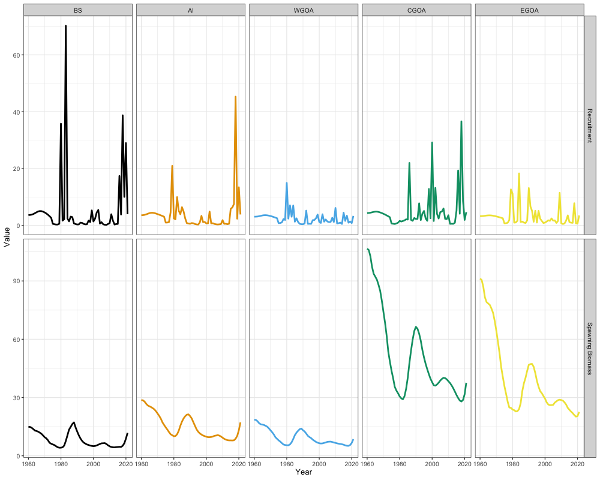

# Case Study: Alaska Sablefish (Spatial)

## Overview

This case study sets up a five-region spatial assessment for Alaska
sablefish. Where the [single region case
study](https://chengmatt.github.io/SPoRC/dev/articles/e_single_region_sablefish_case_study.md)
bridges an existing operational model, this one has no operational
counterpart: it is a demonstration of what the spatial routines does, so
the emphasis is on the equations that only appear once $`n_{r} > 1`$ and
on reading the resulting regional trajectories.

| Dimension      | Value                                                |
|----------------|------------------------------------------------------|
| Regions        | 5 (BS, AI, WGOA, CGOA, EGOA)                         |
| Years          | 1960–2021                                            |
| Ages           | 2–31 (30 age classes)                                |
| Sexes          | 2 (female, male)                                     |
| Fishery fleets | 2 (fixed gear, trawl), operating in all regions      |
| Survey fleets  | 2 (domestic longline, cooperative Japanese longline) |
| Tagging        | Longline survey releases, fixed-gear recoveries      |

Three things distinguish this from the panmictic model, and each has its
own block of equations below: fish **move** between regions, recruitment
is **apportioned** among regions from a single global parameter, and
**tag** releases and recoveries inform the movement rates that the age
and length compositions alone cannot.

The domestic longline survey operates annually in the Gulf of Alaska and
biennially across the Bering Sea and Aleutian Islands. Everything the
case study needs ships with the package in `mlt_rg_sable_data`.

``` r

library(SPoRC)
library(RTMB)
library(ggplot2)
library(dplyr)
data(mlt_rg_sable_data)

dat <- mlt_rg_sable_data
n_yrs <- length(dat$years)
n_ages <- length(dat$ages)
n_regions <- dat$n_regions
```

## Model dimensions

``` r

input_list <- Setup_Mod_Dim(
  years = 1:length(dat$years),
  ages = 1:length(dat$ages),
  lens = dat$lens,
  n_regions = dat$n_regions,
  n_sexes = dat$n_sexes,
  n_fish_fleets = dat$n_fish_fleets,
  n_srv_fleets = dat$n_srv_fleets,
  n_pop = dat$n_pop,
  verbose = TRUE
)
```

## Spatial population dynamics

The seasonal transition of the population is where the spatial model
departs from the panmictic one. Numbers at age are advanced across a
season by an operator that combines movement with survival. With a
single season, movement applied first (`move_timing = 0`, the default),
that operator is

``` math
\mathbf{\Phi}_{y,\tau,a,s} = \mathbf{M}_{y,\tau,a,s}\,\text{diag}\left(\exp\left(-\mathbf{Z}_{y,\tau,a,s}\right)\right)
```

and the population advances as

``` math
\left(\mathbf{N}_{y+1,a+1,s}\right)^{\!\top} = \left(\mathbf{N}_{y,a,s}\right)^{\!\top}\mathbf{\Phi}_{y,\tau,a,s}
```

where $`\mathbf{N}_{y,a,s}`$ is the length-$`n_{r}`$ vector of numbers
across regions and $`\mathbf{M}`$ is the row-stochastic movement matrix.
Because movement precedes mortality here, fish are caught where they end
up rather than where they started, and the region-local Baranov equation
applies to the post-movement distribution.

Total mortality is region specific, since fishing mortality is estimated
separately in each region:

``` math
Z_{r,y,\tau,a,s} = M^{\text{nat}}_{r,y,a,s} + \sum_{f} \text{Sel}^{\text{Fsh}}_{y,a,s,f}\,F_{r,y,\tau,f}
```

This is the reason $`\mathbf{M}`$ and $`\text{diag}(\exp(-\mathbf{Z}))`$
do not commute and the ordering has to be declared. When $`\mathbf{Z}`$
happens to be constant across regions the three `move_timing` options
coincide exactly.

## Recruitment and regional apportionment

Recruitment follows a mean-recruitment parameterization with no stock
recruit relationship, and a single global parameter is apportioned among
regions:

``` math
N_{r,y,a=1,s} = \mu^{\text{Rec}}\,\zeta_{r}\exp\left(\epsilon^{\text{Rec}}_{r,y} - \dfrac{\sigma^{2}_{\text{Rec},y}}{2}b_{y}\right)\psi_{s}
```

The apportionment vector $`\boldsymbol{\zeta}`$ is estimated through a
multinomial logit so that it stays on the simplex, with the first region
as the reference:

``` math
\zeta_{r} = \dfrac{\exp\left(\varsigma_{r}\right)}{\sum_{k}\exp\left(\varsigma_{k}\right)},\qquad \varsigma_{1} \equiv 0
```

Apportionment parameters are weakly identified, because regional
recruitment, regional fishing mortality and movement can trade off
against one another to produce nearly the same regional abundances. A
Dirichlet prior regularizes them:

``` math
P\left(\boldsymbol{\zeta}\right) = \dfrac{\Gamma\left(\sum_{r}\alpha_{r}\right)}{\prod_{r}\Gamma\left(\alpha_{r}\right)}\prod_{r=1}^{n_{r}}\zeta_{r}^{\alpha_{r}-1}
```

with $`\alpha_{r} = 3`$ in every region. A symmetric
$`\boldsymbol{\alpha}`$ with $`\alpha > 1`$ has its mode at $`1/n_{r}`$,
so this is a prior centered on *equal* recruitment across regions,
informative rather than vague. The concentration
$`\kappa = \sum_{r}\alpha_{r} - n_{r} = 10`$ behaves as the number of
prior pseudo-observations, which is what to adjust if the prior is
fighting the data. Setting $`\boldsymbol{\alpha} = \mathbf{1}`$ would
instead be uniform over the simplex and contribute nothing to the
objective.

Initial age deviations are shared across regions
(`InitDevs_spec = "est_shared_r"`) while recruitment deviations remain
region specific. Estimating both freely leaves the initial condition
badly underdetermined, since there is no data before the first model
year to separate a regional difference in the initial age structure from
a regional difference in early recruitment.

``` r

input_list <- Setup_Mod_Rec(
  input_list = input_list,
  rec_model = "mean_rec",
  do_rec_bias_ramp = 0,
  sigmaR_switch = 16,
  dont_est_recdev_last = 1,
  sigmaR_spec = "fix",
  # initial deviations shared across regions; recruitment deviations are not
  InitDevs_spec = "est_shared_r",
  ln_sigmaR = array(log(c(0.4, 1.2)), dim = c(2, input_list$data$n_pop, input_list$data$n_regions)),
  ln_global_R0 = log(20),
  # Dirichlet prior on the apportionment vector; alpha = 3 everywhere puts the
  # mode at equal recruitment with a concentration of 10 pseudo-observations
  use_rec_region_prop_prior = 1,
  rec_region_prop_prior = data.frame(pop = 1, alpha = I(list(rep(3, input_list$data$n_regions)))),
  rec_region_prop_pars = array(c(0.2, 0.2, 0.2, 0.2), dim = c(input_list$data$n_pop, input_list$data$n_regions - 1))
)
```

## Biological dynamics

Natural mortality is fixed at a single sex-invariant value. Spatial
models are heavily parameterized and $`M`$ is poorly identified once
movement is also being estimated, since both remove fish from a region,
so fixing it removes a confounding that the data cannot resolve.

``` r

input_list <- Setup_Mod_Biologicals(
  input_list = input_list,
  WAA = dat$WAA,
  MatAA = dat$MatAA,
  AgeingError = dat$AgeingError,
  fit_lengths = 1,
  SizeAgeTrans = dat$SizeAgeTrans,
  M_spec = "fix",
  Fixed_natmort = array(0.104884, dim = c(dat$n_pop, dat$n_regions, n_yrs, n_ages, dat$n_sexes))
)
```

## Movement

Movement is an unstructured discrete-time Markov process. The fraction
of fish moving from region $`r`$ to region $`k`$ is estimated on a
multinomial logit scale, which guarantees each row of $`\mathbf{M}`$ is
non-negative and sums to one:

``` math
M_{r,k,y,\tau,a,s} = \dfrac{\exp\left(\omega_{r,k,y,\tau,a,s}\right)}{\sum_{j}\exp\left(\omega_{r,j,y,\tau,a,s}\right)},\qquad \omega_{r,k=1,y,\tau,a,s} \equiv 0
```

giving $`n_{r}\times(n_{r}-1)`$ free parameters per stratum. With five
regions that is 20 parameters for every distinct combination of year,
season, age and sex, so blocking is essential. This application
estimates three age blocks and holds movement constant across years and
sexes:

``` math
\text{age blocks} = \left\{1\text{--}6,\ 7\text{--}15,\ 16\text{--}30\right\}
```

which is 60 movement parameters in total. The blocks are chosen to
separate juveniles, maturing fish, and adults, matching the observation
that sablefish disperse eastward as juveniles and become more resident
with age.

Recruits are not allowed to move. Recruitment apportionment and
first-year movement are severely confounded, since both determine where
age-1 fish are found, and allowing both leaves the pair unidentified.

A Dirichlet prior is placed on each row of the movement matrix:

``` math
P\left(\mathbf{M}_{r,\cdot}\right) = \dfrac{\Gamma\left(\sum_{k}c_{r,k}\right)}{\prod_{k}\Gamma\left(c_{r,k}\right)}\prod_{k=1}^{n_{r}}M_{r,k}^{c_{r,k}-1}
```

with $`c_{r,k} = 3`$ throughout. The same caution applies as for the
recruitment apportionment: a symmetric $`c > 1`$ is centered on *equal
movement to every region*, which for a residency-dominated stock is a
strong assumption, not a vague one. It is used here to keep the
estimates away from the boundaries of the simplex, where the multinomial
logit becomes numerically awkward. To target a particular movement
vector at a chosen strength instead, set
$`c_{k} = 1 + \kappa\,\text{mode}_{k}`$.

The prior is expanded over every combination of origin region,
representative age (one per age block), and sex. Wrapping the $`\alpha`$
list in [`I()`](https://rdrr.io/r/base/AsIs.html) keeps `expand.grid`
from splitting it across rows.

``` r

Movement_prior <- expand.grid(
  pop = 1,
  region_from = 1:5,
  year = 1,       # single block, so the first year stands for all
  seas = 1,
  age = c(6, 7, 16),  # one representative age per age block
  sex = 1,
  alpha = I(list(rep(3, 5)))
)

input_list <- Setup_Mod_Movement(
  input_list = input_list,
  # ages 1-6, 7-15, 16-30
  Movement_ageblk_spec = list(c(1:6), c(7:15), c(16:30)),
  Movement_yearblk_spec = "constant",
  Movement_sexblk_spec = "constant",
  # recruits moving is confounded with recruitment apportionment
  do_recruits_move = 0,
  use_fixed_movement = 0,
  Use_Movement_Prior = 1,
  Movement_prior = Movement_prior
)
```

## Tagging

Tag cohorts are indexed by the combination of release region, release
year and release season, and follow a Brownie attrition framework.
Immediately after release a cohort is decremented by an initial tagging
mortality,

``` math
T^{k}_{r,y,\tau,a,s} \leftarrow T^{k}_{r,y,\tau,a,s}\exp\left(-\eta^{\text{mort}}\right)
```

and thereafter advances through the same seasonal operator as the
population, but evaluated with a tag-specific total mortality:

``` math
Z^{\text{Tag}}_{r,y,\tau,a,s} = \omega^{k}_{\tau}\left(\kappa + M^{\text{nat}}_{r,y,a,s} + \sum_{f \in \mathcal{F}^{\text{Tag}}}\text{Sel}^{\text{Fsh}}_{y,a,s,f}F_{r,y,\tau,f}\right)
```

Three terms here do not appear in the population’s $`Z`$. The first is
$`\kappa`$, the chronic tag shedding rate. The second is
$`\omega^{k}_{\tau}`$, the fraction of the season the cohort was
actually at liberty, which equals $`t^{\text{tag}}`$ in the release
season and one thereafter. It multiplies *every* mortality component
rather than the total, so that $`F/Z^{\text{Tag}}`$ stays a genuine
fraction of deaths. The third is the restriction of the sum to
$`\mathcal{F}^{\text{Tag}}`$, the fleets that actually report tags,
which here is the fixed-gear fleet only. Restricting the sum keeps the
trawl fleet from influencing reporting rates and movement through data
it contributes nothing to.

Recaptures follow a modified Baranov equation with a fleet-specific
reporting rate $`\beta`$:

``` math
\text{Recap}^{k}_{r,y,\tau,a,s,f} = \beta_{r,y,f}\dfrac{\text{Sel}^{\text{Fsh}}_{y,a,s,f}F_{r,y,\tau,f}}{Z^{\text{Tag}}_{r,y,\tau,a,s}}T^{k}_{r,y,\tau,a,s}\left[1 - \exp\left(-Z^{\text{Tag}}_{r,y,\tau,a,s}\right)\right]
```

Fitting is release conditioned with a multinomial likelihood, meaning
both the recaptured and the *non*-recaptured state are fit. Proportions
are taken relative to the number released in the cohort,

``` math
\text{PRecap}^{k}_{r,y,\tau,a,s,f} = \dfrac{\text{Recap}^{k}_{r,y,\tau,a,s,f}}{\text{InitTag}^{k}},\qquad \text{PNonRecap}^{k} = 1 - \sum \text{PRecap}^{k}
```

and the two are concatenated into a single vector before the multinomial
is evaluated. Including the non-recapture cell is what makes the tag
data informative about total mortality rather than only about the
*relative* distribution of recoveries across regions.

Several settings control cost and identifiability rather than structure:

- **Maximum tag liberty of 15 years.** Cohorts stop being tracked after
  15 years. Tag cohorts are release *events*, not release groups, so
  this bound is the dominant driver of how long the model takes to
  build.
- **A two-year mixing period.** Recaptures are not fit until the year
  after release, since newly released fish have not mixed with the
  population and would otherwise be read as evidence of extreme
  residency.
- **Releases at $`t^{\text{tag}} = 0.5`$.** Tagging happens midway
  through the year, and movement does not occur within the release year.
- **Initial tagging mortality and shedding fixed.** Both are confounded
  with natural mortality, which is itself already fixed.
- **Reporting rates shared across regions**, estimated in two time
  blocks, under a symmetric beta prior with $`\sigma = 5`$ that
  penalizes the extremes of $`[0,1]`$ without asserting a central value.

``` r

tag_prior <- data.frame(
  region = 1,
  block = c(1, 2),
  fleet = 1,
  mu = NA,   # symmetric beta needs no mean
  sd = 5,    # larger values penalize the 0/1 extremes less
  type = 0
)

input_list <- Setup_Mod_Tagging(
  input_list = input_list,
  use_conv_fish_tagging = c(1, 0),   # fixed gear reports tags; trawl does not
  conv_tag_max_liberty = 15,

  conv_tag_release_indicator = dat$conv_tag_release_indicator,
  conv_tagged_fish = dat$conv_tagged_fish,
  obs_conv_tag_fish_recap = dat$obs_conv_tag_fish_recap,

  conv_fish_tag_like = "Multinomial_Release",
  conv_tag_mixing_period = 2,        # don't fit until release year + 1
  conv_tag_t_tagging = 0.5,
  use_conv_tag_fishrep_prior = 1,
  conv_tag_fishrep_prior = tag_prior,
  conv_tag_age_pool = as.list(1:30),
  conv_tag_sex_pool = list(c(1:2)),
  # confounded with natural mortality, which is itself fixed
  init_conv_tag_mort_spec = "fix",
  conv_tag_shed_spec = "fix",
  conv_tagrep_spec = "est_shared_r_f",
  conv_tag_fish_reporting_blocks = c(
    apply(expand.grid(1:input_list$data$n_regions, 1:input_list$data$n_fish_fleets), 1, function(x)
      paste0("Block_1_Year_1-35_Region_", x[1], "_Fleet_", x[2])),
    apply(expand.grid(1:input_list$data$n_regions, 1:input_list$data$n_fish_fleets), 1, function(x)
      paste0("Block_2_Year_36-terminal_Region_", x[1], "_Fleet_", x[2]))
  ),
  conv_fish_tag_attr = 'p_a_s',
  ln_init_conv_tag_mort = log(0.1),
  ln_conv_tag_shed = log(0.02),
  ln_conv_fish_tag_theta = log(0.5),
  conv_tag_fish_reporting_pars = array(log(0.2 / (1 - 0.2)),
                                       dim = c(input_list$data$n_regions, 2, input_list$data$n_fish_fleets))
)
```

## Catch and fishing mortality

Fishing mortality is estimated separately in each region, which is what
makes $`\mathbf{Z}`$ region specific and the movement ordering
consequential. Catch is fit lognormally with a small fixed standard
deviation, so observed catch is matched closely and the parameters are
free to be informed by the other data.

``` r

input_list <- Setup_Mod_Catch_and_F(
  input_list = input_list,
  ObsCatch = dat$ObsCatch,
  UseCatch = dat$UseCatch,
  Use_F_pen = 1,
  sigmaC_spec = 'fix',
  ln_sigmaC = array(log(0.05), dim = c(input_list$data$n_regions, n_yrs,
                                       input_list$data$n_seas,
                                       input_list$data$n_fish_fleets))
)

# ln_F_mean cannot be passed through ... because R partially matches the name to
# the ln_F_mean_spec formal, so the starting value is assigned post-hoc.
input_list$par$ln_F_mean[] <- -2
```

## Indices and compositions

No fishery indices are used. The composition structure is where the
spatial model differs most visibly from the panmictic one: compositions
are `spltRjntS`, split by region and *joint* across sexes. Each region’s
compositions sum to one across both sexes together,

``` math
\sum_{a}\sum_{s} p_{r,y,a,s} = 1 \quad \text{for each region } r
```

so the data have information about the sex ratio within a region but not
about the relative abundance *between* regions. That between-region
information is deliberately left to the indices and the tagging data.
Fitting compositions that were normalized across regions instead would
let composition data speak to regional apportionment, which is precisely
the quantity the tags are there to inform.

``` r

input_list <- Setup_Mod_FishIdx_and_Comps(
  input_list = input_list,
  ObsFishIdx = dat$ObsFishIdx,
  ObsFishIdx_SE = dat$ObsFishIdx_SE,
  UseFishIdx = dat$UseFishIdx,
  ObsFishAgeComps = dat$ObsFishAgeComps,
  UseFishAgeComps = dat$UseFishAgeComps,
  ISS_FishAgeComps = dat$ISS_FishAgeComps,
  ObsFishLenComps = dat$ObsFishLenComps,
  UseFishLenComps = dat$UseFishLenComps,
  ISS_FishLenComps = dat$ISS_FishLenComps,
  fish_idx_type = c("none", "none"),
  FishAgeComps_LikeType = c("Multinomial", "none"),
  FishLenComps_LikeType = c("Multinomial", "Multinomial"),
  # split by region, joint across sexes
  FishAgeComps_Type = c("spltRjntS_Year_1-terminal_Fleet_1",
                        "none_Year_1-terminal_Fleet_2"),
  FishLenComps_Type = c("spltRjntS_Year_1-terminal_Fleet_1",
                        "spltRjntS_Year_1-terminal_Fleet_2")
)
```

``` r

input_list <- Setup_Mod_SrvIdx_and_Comps(
  input_list = input_list,
  ObsSrvIdx = dat$ObsSrvIdx,
  ObsSrvIdx_SE = dat$ObsSrvIdx_SE,
  UseSrvIdx = dat$UseSrvIdx,
  ObsSrvAgeComps = dat$ObsSrvAgeComps,
  ISS_SrvAgeComps = dat$ISS_SrvAgeComps,
  UseSrvAgeComps = dat$UseSrvAgeComps,
  ObsSrvLenComps = dat$ObsSrvLenComps,
  UseSrvLenComps = dat$UseSrvLenComps,
  ISS_SrvLenComps = dat$ISS_SrvLenComps,
  srv_idx_type = c("abd", "abd"),
  SrvAgeComps_LikeType = c("Multinomial", "Multinomial"),
  SrvLenComps_LikeType = c("none", "none"),
  SrvAgeComps_Type = c("spltRjntS_Year_1-terminal_Fleet_1",
                       "spltRjntS_Year_1-terminal_Fleet_2"),
  SrvLenComps_Type = c("none_Year_1-terminal_Fleet_1",
                       "none_Year_1-terminal_Fleet_2"),
  t_srv = array(0.5, dim = c(input_list$data$n_regions,
                             input_list$data$n_seas,
                             input_list$data$n_srv_fleets))
)
```

## Selectivity and catchability

All selectivity and catchability processes are spatially invariant
(`est_shared_r`). This is the central simplifying assumption of the
application: regional differences in the compositions are attributed to
differences in the underlying age structure, which movement and
recruitment apportionment produce, rather than to regional differences
in gear. Allowing both would leave them confounded.

The fixed-gear fleet is logistic and the trawl fleet dome-shaped gamma,
as in the panmictic model, but with a single time block rather than
three. Both survey fleets are logistic.

Lognormal priors on the selectivity parameters keep them in a plausible
range. The prior rows must match the parameter mapping exactly: a prior
placed on a parameter that is mapped off contributes a constant to the
objective and a gradient to nothing, so the `filter` calls below remove
rows for parameters that are shared rather than estimated.

``` r

sex_par <- expand.grid(sex = 1:2, par = 1:2)
fleet_blocks <- data.frame(fleet = c(1, 2), block = 1)

# Rows must match the mapping below: drop priors for parameters that are shared
# rather than estimated. par 1 = a50 / bmax, par 2 = delta / gamma.
fish_selex_structure <- merge(fleet_blocks, sex_par) %>%
  dplyr::filter(!(fleet == 1 & block == 1 & sex == 2 & par == 2)) %>%
  dplyr::filter(!(fleet == 2 & block == 1 & sex == 2 & par == 1))

fish_selex_prior <- cbind(region = 1, fish_selex_structure, mu = 2, sd = 3)

input_list <- Setup_Mod_Fishsel_and_Q(
  input_list = input_list,
  cont_tv_fish_sel = c("none_Fleet_1", "none_Fleet_2"),
  fish_sel_blocks = c("none_Fleet_1", "none_Fleet_2"),
  fish_sel_model = c("logist1_Fleet_1", "gamma_Fleet_2"),
  fish_q_blocks = c("none_Fleet_1", "none_Fleet_2"),
  # spatially-invariant selectivity
  fish_fixed_sel_pars = c("est_shared_r", "est_shared_r"),
  fish_q_spec = c("fix", "fix"),
  Use_fish_selex_prior = 1,
  fish_selex_prior = fish_selex_prior
)

map_fish_fixed <- array(input_list$map$fish_fixed_sel_pars, dim = dim(input_list$par$fish_fixed_sel_pars))
map_fish_fixed[,2,1,2,1] <- map_fish_fixed[,2,1,1,1] # share fixed-gear delta across sexes
map_fish_fixed[,1,1,2,2] <- map_fish_fixed[,1,1,1,2] # share trawl bmax across sexes
input_list$map$fish_fixed_sel_pars <- factor(map_fish_fixed)
```

``` r

sex_par <- expand.grid(sex = 1:2, par = 1:2)
fleet_blocks <- data.frame(fleet = c(1, 2), block = c(1, 1))

srv_selex_prior <- cbind(region = 1, merge(fleet_blocks, sex_par), mu = 1, sd = 5) %>%
  dplyr::filter(!(fleet == 2 & par == 2 & sex == 2)) %>%
  dplyr::mutate(mu = ifelse(fleet == 2, 2, mu),
                sd = ifelse(fleet == 2, 3, sd))

input_list <- Setup_Mod_Srvsel_and_Q(
  input_list = input_list,
  cont_tv_srv_sel = c("none_Fleet_1", "none_Fleet_2"),
  srv_sel_blocks = c("none_Fleet_1", "none_Fleet_2"),
  srv_sel_model = c("logist1_Fleet_1", "logist1_Fleet_2"),
  srv_q_blocks = c("none_Fleet_1", "none_Fleet_2"),
  srv_fixed_sel_pars_spec = c("est_shared_r", "est_shared_r"),
  # spatially-invariant catchability
  srv_q_spec = c("est_shared_r", "est_shared_r"),
  Use_srv_selex_prior = 1,
  srv_selex_prior = srv_selex_prior
)

map_srv_fixed <- array(input_list$map$srv_fixed_sel_pars, dim = dim(input_list$par$srv_fixed_sel_pars))
map_srv_fixed[,2,1,2,2] <- map_srv_fixed[,2,1,1,2] # share JP longline delta across sexes
input_list$map$srv_fixed_sel_pars <- factor(map_srv_fixed)
```

## Weighting and input sample sizes

All data weights are one, except tagging, which is down-weighted by
half. Tag data comprise a very large number of individual cells, so
their nominal likelihood contribution can dominate the objective long
before their information content justifies it.

Input sample sizes are set so that each composition data source sums to
roughly 100 *across all regions combined*, rather than 100 per region.
Splitting compositions by region multiplies the number of cells by
$`n_{r}`$ without adding any new sampling, so leaving per-region sample
sizes at their panmictic values would overstate the composition
information fivefold.

``` r

comp_wt <- function(n_fleets) {
  array(1, dim = c(input_list$data$n_regions, n_yrs, input_list$data$n_seas,
                   input_list$data$n_sexes, n_fleets))
}

input_list <- Setup_Mod_Weighting(
  input_list = input_list,
  Wt_Catch = 1,
  Wt_FishIdx = 1,
  Wt_SrvIdx = 1,
  Wt_Rec = 1,
  Wt_F = 1,
  Wt_Tagging = 0.5,
  Wt_FishAgeComps = comp_wt(input_list$data$n_fish_fleets),
  Wt_FishLenComps = comp_wt(input_list$data$n_fish_fleets),
  Wt_SrvAgeComps = comp_wt(input_list$data$n_srv_fleets),
  Wt_SrvLenComps = comp_wt(input_list$data$n_srv_fleets)
)
```

``` r

# Sample sizes are set so each source totals ~100 ACROSS regions, not per region
input_list$data$ISS_SrvAgeComps[] <- 20

input_list$data$ISS_FishAgeComps[1,,,,] <- 25  # BS
input_list$data$ISS_FishAgeComps[2,,,,] <- 20  # AI
input_list$data$ISS_FishAgeComps[3,,,,] <- 14  # WGOA
input_list$data$ISS_FishAgeComps[4,,,,] <- 18  # CGOA
input_list$data$ISS_FishAgeComps[5,,,,] <- 18  # EGOA

input_list$data$ISS_FishLenComps[1,,,,] <- 12  # BS
input_list$data$ISS_FishLenComps[2,,,,] <- 12  # AI
input_list$data$ISS_FishLenComps[3,,,,] <-  7  # WGOA
input_list$data$ISS_FishLenComps[4,,,,] <-  7  # CGOA
input_list$data$ISS_FishLenComps[5,,,,] <-  7  # EGOA
```

## Fitting

Spatial models with tagging are expensive to build. Most of the runtime
is the `MakeADFun` tape construction rather than the optimization, and
the cost scales with the number of tag cohorts times the maximum tag
liberty, so this takes considerably longer than the panmictic model.

``` r

data <- input_list$data
parameters <- input_list$par
mapping <- input_list$map

sabie_rtmb_model <- fit_model(data, parameters, mapping,
                              random = NULL, newton_loops = 5, silent = FALSE)

sabie_rtmb_model$sd_rep <- RTMB::sdreport(sabie_rtmb_model)
```

## Results

Spawning biomass and recruitment are now dimensioned
$`n_{\text{pop}} \times n_{r} \times n_{y}`$, so they are melted to long
format rather than coerced to a vector.

``` r

ts_df <- rbind(
  reshape2::melt(sabie_rtmb_model$rep$SSB) %>% dplyr::mutate(Par = "Spawning Biomass"),
  reshape2::melt(sabie_rtmb_model$rep$Rec) %>% dplyr::mutate(Par = "Recruitment")
) %>%
  dplyr::rename(Pop = Var1, Region = Var2, Year = Var3) %>%
  dplyr::mutate(
    Region = factor(c('BS', 'AI', 'WGOA', 'CGOA', 'EGOA')[Region],
                    levels = c("BS", "AI", "WGOA", "CGOA", "EGOA")),
    Year = Year + 1959
  )

ggplot(ts_df, aes(x = Year, y = value, color = Region)) +
  geom_line(linewidth = 1.3) +
  facet_grid(Par ~ Region, scales = "free_y") +
  ggthemes::scale_color_colorblind() +
  labs(y = "Value") +
  theme_bw(base_size = 13) +
  theme(legend.position = 'none')
```



Reading the regional trajectories, spawning biomass is highest in the
CGOA, followed by the EGOA, with the three western regions at broadly
comparable and lower levels. Recruitment shows a different ordering: the
western regions (BS and AI) together with the CGOA hold the highest
levels. That mismatch between where fish recruit and where spawning
biomass accumulates is likely reflecting eastward movement, and it is
the pattern the age-blocked movement matrix and the tag recoveries are
jointly resolving.
