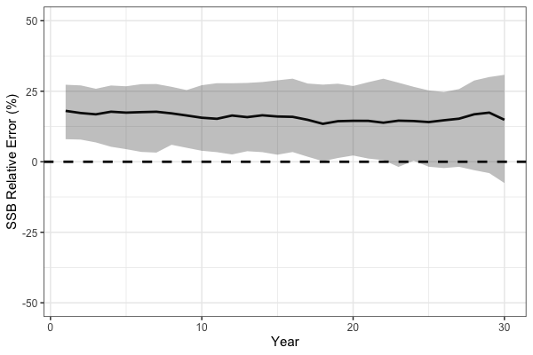
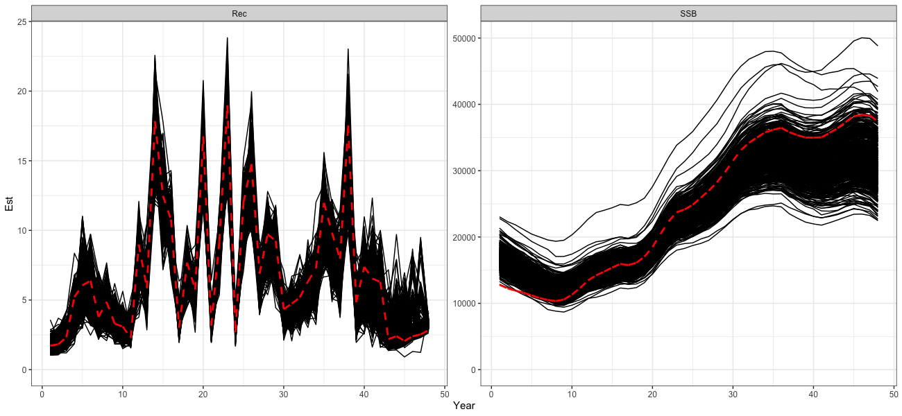

# Simulation Testing (Cross and Self Tests)

## Simulation Cross-Testing in `SPoRC`

Simulation testing stock assessment models is integral to evaluating
robustness and understanding how models perform under model
misspecification. The `SPoRC` framework supports simulation testing in
three forms:  
- Self-testing: the estimation model (EM) has the same structure as the
operating model (OM).  
- Cross-testing: the EM differs structurally from the OM, allowing
assessment of bias and sensitivity to incorrect assumptions.  
- Closed loop simulations (see Closed Loop Simulations vignette
example).

In this first section of the vignette, we present a cross-test example.
The operating model (OM; simulated truth) assumes a logistic selectivity
curve for the fishery, while the estimation model (`SPoRC`; EM)
incorrectly specifies a dome-shaped (gamma) selectivity curve.

The OM defines the biological processes, fishing dynamics, survey
structure, and recruitment assumptions. Unless otherwise noted, the OM
observation model uses default settings:

- Composition Input Sample Size = 100, with Multinomial sampling
  (Fishery and Survey)
- Survey index SD = 0.2, with lognormal observations
- Catch SD = 0.02, with lognormal observations

### Define Model Dimensions

We start by defining the structural dimensions of the operating model.

``` r

library(SPoRC)
library(dplyr)
library(ggplot2)

sim_list <- Setup_Sim_Dim(
  n_sims        = 50,  # number of simulations
  n_yrs         = 30,  # number of years
  n_regions     = 1,   # single region
  n_ages        = 10,  # number of ages
  n_lens        = NULL,# no length structure
  n_sexes       = 1,   # single sex
  n_fish_fleets = 1,   # one fishery fleet
  n_srv_fleets  = 1,    # one survey fleet
  n_pop         = 1    # number of pops
)

# Create storage containers
sim_list <- Setup_Sim_Containers(sim_list)
```

### Fishing Processes

The fishery selectivity in the OM is logistic, centered around age 5.

``` r

sim_list <- Setup_Sim_Fishing(sim_list = sim_list, # update simulate list
                              # Logistic selectivity
                              fish_sel_input = replicate(
                                n = sim_list$n_sims,
                                array(rep(1 / (1 + exp(-3 * ((1:sim_list$n_ages) - 5))), each = sim_list$n_yrs),
                                      dim = c(sim_list$n_pop, sim_list$n_regions, sim_list$n_yrs, sim_list$n_seas, sim_list$n_ages,
                                              sim_list$n_sexes, sim_list$n_fish_fleets))
                              )
)
```

### Survey Processes

We specify survey selectivity as logistic, centered around age 3.

``` r

sim_list <- Setup_Sim_Survey(
  sim_list = sim_list,
  # Logistic selectivity
  srv_sel_input = replicate(
    n = sim_list$n_sims,
    array(rep(1 / (1 + exp(-1 * ((1:sim_list$n_ages) - 3))), each = sim_list$n_yrs),
          dim = c(sim_list$n_pop, sim_list$n_regions, sim_list$n_yrs, sim_list$n_seas, sim_list$n_ages,
                  sim_list$n_sexes, sim_list$n_srv))
  )
)
```

### Biological Dynamics

Biological parameters are set for natural mortality, maturity-at-age,
and weight-at-age. These values are relatively arbitrary and are
specified to generically represent a fairly short-lived species.

``` r

sim_list <- Setup_Sim_Biologicals(
  sim_list = sim_list, # simualtion list
  natmort_input = replicate(n = sim_list$n_sims, array(0.3, dim = c(sim_list$n_pop, sim_list$n_regions, sim_list$n_yrs,
                                                                    sim_list$n_ages, sim_list$n_sexes))), # natural mortality
  WAA_input = replicate(n = sim_list$n_sims, array(rep(5 / (1 + exp(-3 * ((1:sim_list$n_ages) - 3))), each = sim_list$n_yrs),
                                                   dim = c(sim_list$n_pop, sim_list$n_regions, sim_list$n_yrs, sim_list$n_seas, sim_list$n_ages, sim_list$n_sexes))), # weight at age
  WAA_fish_input = replicate(n = sim_list$n_sims, array(rep(5 / (1 + exp(-3 * ((1:sim_list$n_ages) - 3))), each = sim_list$n_yrs),
                                                        dim = c(sim_list$n_pop, sim_list$n_regions, sim_list$n_yrs, sim_list$n_seas, sim_list$n_ages, sim_list$n_sexes, sim_list$n_fish_fleets))), # fishery weight at age
  WAA_srv_input = replicate(n = sim_list$n_sims, array(rep(5 / (1 + exp(-3 * ((1:sim_list$n_ages) - 3))), each = sim_list$n_yrs),
                                                       dim = c(sim_list$n_pop, sim_list$n_regions, sim_list$n_yrs, sim_list$n_seas, sim_list$n_ages, sim_list$n_sexes, sim_list$n_srv_fleets))), # survey weight at age
  MatAA_input = replicate(n = sim_list$n_sims, array(rep(1 / (1 + exp(-3 * ((1:sim_list$n_ages) - 3))), each = sim_list$n_yrs),
                                                     dim = c(sim_list$n_pop, sim_list$n_regions, sim_list$n_yrs, sim_list$n_seas, sim_list$n_ages, sim_list$n_sexes))) # maturity at age
)
```

### Tagging and Movement

For this example, tagging is disabled and no movement is modeled.

``` r

sim_list <- Setup_Sim_Tagging(
  sim_list = sim_list, # simulation list
  use_conv_fish_tagging = 0
)

# No Movement
sim_list$Movement <- array(1, dim = c(sim_list$n_pop, sim_list$n_regions, sim_list$n_regions, sim_list$n_yrs, sim_list$n_seas, sim_list$n_ages, sim_list$n_sexes, sim_list$n_sims))
```

### Recruitment

Recruitment is modeled with mean recruitment dynamics, where `R0_input`
is the mean recruitment parameter centered at a value of 5.

``` r

sim_list <- Setup_Sim_Rec(
  sim_list = sim_list,
  R0_input = replicate(n = sim_list$n_sims, expr = array(5, dim = c(sim_list$n_pop, sim_list$n_regions, sim_list$n_yrs))), # R0
  ln_sigmaR = array(log(1), dim = c(2, sim_list$n_pop, sim_list$n_regions)),
  recruitment_opt = 'mean_rec',
  init_age_strc = 1 # using geometric series scalar to initialize popn
)
```

### Run the Operating Model

``` r

set.seed(123)
sim_obj <- Simulate_Pop_Static(sim_list = sim_list, output_path = NULL) # get simulated datasets
```

The object `sim_obj` contains the simulated population, fishery, and
survey data ready to pass to the EM for cross-testing.

### Define Estimation Model

After simulating the operating model (OM), we can set up the estimation
model (EM) in `SPoRC`.  
In this cross-test, the EM incorrectly assumes a dome-shaped (gamma)
fishery selectivity,  
even though the OM used logistic selectivity. In general, EM settings
are identical to the OM, except for fishery selectivity.

``` r

setup_em <- function(sim_obj, sim) {

  # Extract simulation data for current year and replicate
  sim_data <- simulation_data_to_SPoRC(sim_env = sim_obj, y = sim_obj$n_years, sim = sim)

  # Setup model dimensions
  input_list <- Setup_Mod_Dim(
    years = 1:sim_obj$n_years,
    ages = 1:sim_obj$n_ages,
    lens = sim_obj$n_lens,
    n_regions = sim_obj$n_regions,
    n_sexes = sim_obj$n_sexes,
    n_fish_fleets = sim_obj$n_fish_fleets,
    n_srv_fleets = sim_obj$n_srv_fleets,
    n_pop = sim_obj$n_pop,
    verbose = FALSE
  )

  # Recruitment setup
  input_list <- Setup_Mod_Rec(
    input_list = input_list,
    do_rec_bias_ramp = 0, # not doing bias ramp
    sigmaR_switch = 1, # when to switch from early to late sigmaR (switch in first year)
    ln_sigmaR = array(log(1), dim = c(2, input_list$data$n_pop, input_list$data$n_regions)), # 2 values for early and late sigma
    rec_model = "mean_rec",
    sigmaR_spec = "fix", # fix early sigmaR and late sigmaR
    init_age_strc = 1, # geometric series to derive initial age structure
    equil_init_age_strc = 2, # estimating all intial age deviations
    ln_global_R0 = log(5)
  )

  # Biological setup
  input_list <- Setup_Mod_Biologicals(
    input_list = input_list,
    # Data inputs
    WAA = sim_data$WAA,
    MatAA = sim_data$MatAA,
    WAA_fish = sim_data$WAA_fish,
    WAA_srv = sim_data$WAA_srv,
    fit_lengths = 0, # not fitting lengths
    AgeingError = sim_data$AgeingError,
    M_spec = "fix",     # fixing natural mortality
    Fixed_natmort = array(0.3, dim = c(input_list$data$n_pop, input_list$data$n_regions, length(input_list$data$years),  length(input_list$data$ages), input_list$data$n_sexes))
  )

  # Movement and tagging
  input_list <- Setup_Mod_Tagging(input_list = input_list, use_conv_fish_tagging = 0)
  input_list <- Setup_Mod_Movement(
    input_list = input_list,
    use_fixed_movement = 1,
    Fixed_Movement = NA,
    do_recruits_move = 0
  )

  # Fishery catch & fishing mortality
  input_list <- Setup_Mod_Catch_and_F(
    input_list = input_list,
    # Data inputs
    ObsCatch = sim_data$ObsCatch,
    UseCatch = sim_data$UseCatch,
    # Model options
    Use_F_pen = 1,
    sigmaC_spec = "fix",
    # Fixing sigma C and F
    ln_sigmaC = sim_data$ln_sigmaC,
    ln_sigmaF = array(log(1), dim = c(input_list$data$n_regions, input_list$data$n_seas, input_list$data$n_fish_fleets))
    )

  # Survey selectivity and catchability
  input_list <- Setup_Mod_FishIdx_and_Comps(
    input_list = input_list,
    # Data inputs
    ObsFishIdx = sim_data$ObsFishIdx,
    ObsFishIdx_SE = sim_data$ObsFishIdx_SE,
    UseFishIdx = sim_data$UseFishIdx,
    ObsFishAgeComps = sim_data$ObsFishAgeComps,
    ObsFishLenComps = sim_data$ObsFishLenComps,
    UseFishAgeComps = sim_data$UseFishAgeComps,
    UseFishLenComps = sim_data$UseFishLenComps,
    ISS_FishAgeComps = sim_data$ISS_FishAgeComps,
    ISS_FishLenComps = sim_data$ISS_FishLenComps,
    # Model options
    fish_idx_type = c("biom"),
    FishAgeComps_LikeType = c("Multinomial"),
    FishLenComps_LikeType = c("none"),
    FishAgeComps_Type = c("agg_Year_1-terminal_Fleet_1"),
    FishLenComps_Type = c("none_Year_1-terminal_Fleet_1")
  )

  # Survey indices and compositions
  input_list <- Setup_Mod_SrvIdx_and_Comps(
    input_list = input_list,
    # Data inputs
    ObsSrvIdx = sim_data$ObsSrvIdx,
    ObsSrvIdx_SE = sim_data$ObsSrvIdx_SE,
    UseSrvIdx = sim_data$UseSrvIdx,
    ObsSrvAgeComps = sim_data$ObsSrvAgeComps,
    ObsSrvLenComps = sim_data$ObsSrvLenComps,
    UseSrvAgeComps = sim_data$UseSrvAgeComps,
    UseSrvLenComps = sim_data$UseSrvLenComps,
    ISS_SrvAgeComps = sim_data$ISS_SrvAgeComps,
    ISS_SrvLenComps = sim_data$ISS_SrvLenComps,
    # Model options
    srv_idx_type = c("biom"),
    SrvAgeComps_LikeType = c("Multinomial"),
    SrvLenComps_LikeType = c("none"),
    SrvAgeComps_Type = c("agg_Year_1-terminal_Fleet_1"),
    SrvLenComps_Type = c("none_Year_1-terminal_Fleet_1")
  )


  # Fishery selectivity and catchability
  input_list <- Setup_Mod_Fishsel_and_Q(
    input_list = input_list,
    # Model options
    fish_sel_model = c("gamma_Fleet_1"), # fishery selex model (NOTE: ASSUMES DOMED)
    fish_fixed_sel_pars_spec = c("est_all"), # whether to estiamte all fixed effects for fishery selectivity
    fish_q_spec = "est_all" # estimate fishery q
  )

  # Survey selectivity and catchability
  input_list <- Setup_Mod_Srvsel_and_Q(
    input_list = input_list,
    # Model options
    srv_sel_model = c("logist2_Fleet_1"), # survey selectivity form
    srv_fixed_sel_pars_spec = c("est_all"), # whether to estimate all fixed effects for survey selectivity
    srv_q_spec = c("est_all")  # whether to estiamte all fixed effects for survey catchability
  )

  # Data weighting
  input_list <- Setup_Mod_Weighting(
    input_list = input_list,
    Wt_Catch = 1,
    Wt_FishIdx = 1,
    Wt_SrvIdx = 1,
    Wt_Rec = 1,
    Wt_F = 1,
    Wt_Tagging = 0,
    Wt_FishAgeComps = array(1, dim = c(input_list$data$n_regions, length(input_list$data$years), input_list$data$n_seas,
                                       input_list$data$n_sexes, input_list$data$n_fish_fleets)),
    Wt_FishLenComps = array(1, dim = c(input_list$data$n_regions, length(input_list$data$years), input_list$data$n_seas,
                                       input_list$data$n_sexes, input_list$data$n_fish_fleets)),
    Wt_SrvAgeComps = array(1, dim = c(input_list$data$n_regions,length(input_list$data$years), input_list$data$n_seas,
                                      input_list$data$n_sexes, input_list$data$n_srv_fleets)),
    Wt_SrvLenComps = array(0, dim = c(input_list$data$n_regions, length(input_list$data$years), input_list$data$n_seas,
                                      input_list$data$n_sexes, input_list$data$n_srv_fleets))
  )

  return(input_list)

}
```

### Run Cross-Test Analysis

After setting up the EM, we can run the cross-test by fitting the model
to each simulated dataset.  
We store the resulting spawning stock biomass (SSB) estimates for
comparison with the OM.

``` r

ssb_results <- array(NA, dim = c(sim_list$n_yrs, sim_list$n_sims)) # storage container
for(i in 1:sim_obj$n_sims) {

  input_list <- setup_em(sim_obj, sim = i) # setup EM

  # fit model
  model <- fit_model(input_list$data,
                     input_list$par,
                     input_list$map,
                     random = NULL,
                     silent = TRUE
                     )

  ssb_results[,i] <- as.vector(model$rep$SSB) # save results

} # end i loop
```

As expected, the simulation cross-test demonstrates that
misspecification of fishery selectivity leads to biased estimates of key
population quantities. In particular, spawning stock biomass (SSB) is
positively biased because the EM incorrectly assumes dome-shaped
selectivity while the true OM selectivity is logistic, treating a
portion of the population as invulnerable to the fishery, leading to an
overestimation of stock size.

``` r

# Process SSB results
ssb_df_res <- reshape2::melt(ssb_results) %>%
  rename(Year = Var1, Sim = Var2, Est = value) %>%
  dplyr::left_join(reshape2::melt(sim_obj$SSB) %>%
                     dplyr::rename(Region = Var2, Year = Var3, Sim = Var4, True = value), by = c("Year", "Sim")) %>%
  dplyr::mutate(RE = (Est - True) / True * 100) %>%
  dplyr::group_by(Year) %>%
  dplyr::summarize(median = median(RE, na.rm = TRUE),
                   lwr = quantile(RE, 0.1, na.rm = TRUE),
                   upr = quantile(RE, 0.8, na.rm = TRUE))

# plot!
print(
  ggplot(ssb_df_res, aes(x = Year, y = median, ymin = lwr, ymax = upr)) +
    geom_line(lwd = 1.3) +
    geom_hline(yintercept = 0, lwd = 1.3, lty = 2) +
    coord_cartesian(ylim = c(-50, 50)) +
    geom_ribbon(alpha = 0.3) +
    theme_bw(base_size = 15) +
    labs(x = 'Year', y = 'SSB Relative Error (%)')
)
```



## Self Testing

In addition to simulation cross-testing, users can also conduct
self-tests. Simulation self-testing is useful because it helps evaluate
model robustness in the context of parameter identifiability. Ideally, a
simulation self-test should return unbiased parameter estimates on
average. If it does not, this generally indicates a lack of
identifiability for some parameters given the available data. Here, we
demonstrate simulation self-testing using Dusky Rockfish as an example.
Simulation self-testing is facilitated by the helper function
`simulation_self_test`, which allows users to conduct simulations using
a fitted `SPoRC` model (i.e., providing `data`, `parameters`, `mapping`,
`rep`, and `sd_rep`). To reduce computation time, we parallelize the
simulations across 8 cores and output estimates of SSB and recruitment.

``` r

# load in dusky rockfish model
data("dusky_rtmb_model")

# Using Dusky Rockfish as example to conduct simulation self-testing
self_test <- simulation_self_test(
  data = dusky_rtmb_model$data,
  parameters = dusky_rtmb_model$parameters,
  mapping = dusky_rtmb_model$mapping,
  random = NULL,
  rep = dusky_rtmb_model$rep,
  sd_rep = dusky_rtmb_model$sdrep,
  n_sims = 300,
  newton_loops = 3,
  do_sdrep = FALSE,
  do_par = TRUE,
  n_cores = 8,
  output_path = NULL,
  what = c("SSB", "Rec")
)
```

A fit with movement random effects (`move_year_re`, `move_age_re`,
`move_pop_re`, `move_seas_re` or `move_sex_re` in
[`Setup_Mod_Movement()`](https://chengmatt.github.io/SPoRC/dev/reference/Setup_Mod_Movement.md))
comes into the self test and the closed loop on its own without
additional setup. Over the conditioning years (`n_cond_yrs`, every year
of the fit by default) each replicate keeps the fit’s own deviations, or
under `sim_type = "joint"` its own draw of them, so the historical
movement is the conditioned fit’s; the years after them are drawn from
the process the estimation model penalizes, at the fitted / specified sd
and correlations, with an AR1 continuing from the last fitted year, and
the movement matrix is rebuilt from them before the population is run.
An operating model built by hand from such a fit takes the same step
through
[`Setup_Sim_Movement()`](https://chengmatt.github.io/SPoRC/dev/reference/Setup_Sim_Movement.md),
which stores the fit’s switches, process error parameters and movement
arguments on the simulation list;
[`Setup_sim_env()`](https://chengmatt.github.io/SPoRC/dev/reference/Setup_sim_env.md)
then draws and rebuilds. A fit whose movement deviations a dsem holds or
links is drawn by
[`Setup_Sim_DSEM()`](https://chengmatt.github.io/SPoRC/dev/reference/Setup_Sim_DSEM.md)
instead and rebuilt through the same arguments.

``` r

# a fit with AR1 movement deviations over years, sex-specific and correlated across sexes
input_list <- Setup_Mod_Movement(input_list, use_fixed_movement = 0, Fixed_Movement = NA,
                                 move_year_re = "ar1", move_sex_re = "us")
fit <- fit_model(input_list$data, input_list$par, input_list$map, random = "move_devs")

# an operating model built by hand: the fit's movement, then its deviation process
sim_list$Movement <- replicate(sim_list$n_sims, fit$rep$Movement)
sim_list <- Setup_Sim_Movement(sim_list, fit$data, fit$env$parList())
sim_env <- Setup_sim_env(sim_list) # every replicate now holds its own move_devs and Movement
```

A fit with growth deviations (`growth_tv_model` or `growth_semipar` in
[`Setup_Mod_Biologicals()`](https://chengmatt.github.io/SPoRC/dev/reference/Setup_Mod_Biologicals.md))
can be setup in the same way. Over the conditioning years each replicate
keeps the fit’s own deviations, or under `sim_type = "joint"` its own
draw of them and of the growth parameters, as it does for movement, and
the years after them are drawn given those from the form the estimation
model penalizes them under, iid, random walk, separable AR1 or the three
dimensional field, at the fitted process error parameters and under the
fit’s maps, so a random walk steps on from the last fitted year, the
correlated forms are drawn conditional on the fitted years, a cell the
map fixes stays at zero and a shared level takes one draw; weight at
age, the size-age keys and selectivity at age are then rebuilt through
the fit’s own
[`Get_Growth()`](https://chengmatt.github.io/SPoRC/dev/reference/Get_Growth.md).
An operating model built by hand without `n_cond_yrs` on its simulation
list draws every year. Under cohort growth only the years before the
propagation starts are built up front, and the annual cycle advances the
rest from each replicate’s own numbers at age. An operating model built
by hand takes the step through
[`Setup_Sim_Growth_RE()`](https://chengmatt.github.io/SPoRC/dev/reference/Setup_Sim_Growth_RE.md),
which needs the fit’s report under selectivity at length. A dsem holding
or linking any growth deviation draws both arrays through
[`Setup_Sim_DSEM()`](https://chengmatt.github.io/SPoRC/dev/reference/Setup_Sim_DSEM.md)
instead. One convention differs from the penalty: a random walk’s first
year is drawn at the walk’s own sd rather than the diffuse
`growth_rw_init_sigma` the estimation model gives it.

``` r

# a fit with iid deviations on L1 and a random walk on K, their sds estimated
input_list <- Setup_Mod_Biologicals(input_list, ..., growth_tv_model = c(L1 = "iid", K = "rw"), growth_tv_sigma_spec = "est")
fit <- fit_model(input_list$data, input_list$par, input_list$map, random = "ln_growth_devs")

# an operating model built by hand: the fit's growth, then its deviation process
sim_list$WAA <- replicate(sim_list$n_sims, fit$rep$WAA) # and WAA_fish, WAA_srv, SizeAgeTrans_fish, SizeAgeTrans_srv the same way
sim_list <- Setup_Sim_Growth_RE(sim_list, fit$data, fit$env$parList(), rep = fit$rep)
sim_env <- Setup_sim_env(sim_list) # every replicate now holds its own ln_growth_devs and weight at age
```

A fit with catchability deviations (`fish_q_model` or `srv_q_model` set
to `"iid"`, `"rw"` or `"ar1"`) is treated the same way in the self test.
Over the conditioning years each replicate keeps the fit’s own
deviations, or under `sim_type = "joint"` its own draw of them, and the
years after them are drawn from the form the estimation model penalizes,
at the fitted sigma and correlation (each replicate’s own draw of them
under joint), so a random walk steps on from the last conditioned year.
A year that `q_re_years` leaves out, or a region with no index, keeps
the fit’s value, since the fit estimates no deviation there. An
operating model built by hand sets the same process through
[`Setup_Sim_q_devs()`](https://chengmatt.github.io/SPoRC/dev/reference/Setup_Sim_q_devs.md).

A fit whose length compositions are recorded on coarser bins than the
population (`LenBinMap` in
[`Setup_Mod_Biologicals()`](https://chengmatt.github.io/SPoRC/dev/reference/Setup_Mod_Biologicals.md)),
or are selected at length (`FishLenComps_sel` or `SrvLenComps_sel` set
to `"length"`), also comes into the self test and the closed loop
without additional setup. The operating model maps each expected length
composition onto the recorded bins before drawing it, as the estimation
model maps it before evaluating the likelihood, and reads each expected
age composition and each age-at-length row through the fleet’s ageing
error the same way, so a simulated composition comes from the
distribution the fit evaluates. Under selectivity at length it spreads
the fish at each age over length and selects them length by length from
the fit’s selectivity at length, as the estimation model does, and the
conditional age-at-length is drawn from that same catch or index at
length and age. An operating model built by hand takes the map through
`n_obs_lens` in
[`Setup_Sim_Dim()`](https://chengmatt.github.io/SPoRC/dev/reference/Setup_Sim_Dim.md)
and `LenBinMap_input` in
[`Setup_Sim_Biologicals()`](https://chengmatt.github.io/SPoRC/dev/reference/Setup_Sim_Biologicals.md),
and the selectivity at length through `fish_sel_l_input` and
`ret_sel_l_input` in
[`Setup_Sim_Fishing()`](https://chengmatt.github.io/SPoRC/dev/reference/Setup_Sim_Fishing.md)
and `srv_sel_l_input` in
[`Setup_Sim_Survey()`](https://chengmatt.github.io/SPoRC/dev/reference/Setup_Sim_Survey.md).

Neither
[`Setup_Sim_Movement()`](https://chengmatt.github.io/SPoRC/dev/reference/Setup_Sim_Movement.md)
nor
[`Setup_Sim_Growth_RE()`](https://chengmatt.github.io/SPoRC/dev/reference/Setup_Sim_Growth_RE.md)
is required to read anything that an optimizer produced; both only need
`data` and a parameter list in a fit’s own array shape, so a process
error series can be specified manually in place of an estimated one.
This can be done with the function
[`Setup_Sim_Movement()`](https://chengmatt.github.io/SPoRC/dev/reference/Setup_Sim_Movement.md)’s
own replicate loop calls, matched to `data` and `pars` by
[`match_model_args()`](https://chengmatt.github.io/SPoRC/dev/reference/match_model_args.md)
the same way; although both functions are internal. Movement is
self-contained enough that
[`Setup_Mod_Dim()`](https://chengmatt.github.io/SPoRC/dev/reference/Setup_Mod_Dim.md)
and
[`Setup_Mod_Movement()`](https://chengmatt.github.io/SPoRC/dev/reference/Setup_Mod_Movement.md)
alone give it everything it reads, with no `input_list` needed
beforehand either, the same way a pure cross-test never uses one:

``` r

# a bare input_list built from the OM's own dimensions, no EM or data involved
input_list <- Setup_Mod_Dim(years = 1:sim_list$n_yrs, ages = 1:sim_list$n_ages, lens = NULL,
                            n_regions = sim_list$n_regions, n_sexes = sim_list$n_sexes,
                            n_fish_fleets = sim_list$n_fish_fleets, n_srv_fleets = sim_list$n_srv_fleets,
                            n_pop = sim_list$n_pop)

# movement specified by hand instead of estimated
input_list <- Setup_Mod_Movement(input_list, use_fixed_movement = 0, Fixed_Movement = NA,
                                 move_year_re = "ar1", move_sex_re = "us")
input_list$par$move_pe_pars[] <- ... # chosen sd / correlation, not an estimate

move_args <- SPoRC:::match_model_args(SPoRC:::Get_Movement, input_list$data, input_list$par,
                                      n_yrs = sim_list$n_yrs, n_proj_yrs_devs = 0, n_ages = sim_list$n_ages)
movement <- do.call(SPoRC:::Get_Movement, move_args)

sim_list$Movement <- replicate(sim_list$n_sims, movement$Movement)
sim_list <- Setup_Sim_Movement(sim_list, input_list$data, input_list$par)
sim_env <- Setup_sim_env(sim_list) # every replicate now holds its own move_devs and Movement
```

Growth setup needs a little bit more, since
[`Get_Growth()`](https://chengmatt.github.io/SPoRC/dev/reference/Get_Growth.md)
also reads `t_fish`, `t_srv`, `spawn_seas` and `t_spawn`, the
within-season timing that
[`Setup_Mod_FishIdx_and_Comps()`](https://chengmatt.github.io/SPoRC/dev/reference/Setup_Mod_FishIdx_and_Comps.md),
[`Setup_Mod_SrvIdx_and_Comps()`](https://chengmatt.github.io/SPoRC/dev/reference/Setup_Mod_SrvIdx_and_Comps.md)
and
[`Setup_Mod_Rec()`](https://chengmatt.github.io/SPoRC/dev/reference/Setup_Mod_Rec.md)
would otherwise supply from real fleet data. Plain placeholders for that
timing, written onto `data` directly, serve just as well when nothing is
actually being fit:

``` r

# growth specified by hand instead of estimated, same dimensions plus length bins
input_list <- Setup_Mod_Biologicals(input_list, ..., growth_tv_model = c(L1 = "iid", K = "rw"), growth_tv_sigma_spec = "est")
input_list$par$growth_pe_pars[] <- ... # chosen sd, not an estimate

# the timing Setup_Mod_FishIdx_and_Comps / Setup_Mod_SrvIdx_and_Comps / Setup_Mod_Rec would otherwise supply
input_list$data$t_fish <- array(0, dim = c(input_list$data$n_regions, input_list$data$n_seas, input_list$data$n_fish_fleets))
input_list$data$t_srv <- array(0, dim = c(input_list$data$n_regions, input_list$data$n_seas, input_list$data$n_srv_fleets))
input_list$data$spawn_seas <- 1
input_list$data$t_spawn <- 0

growth_args <- SPoRC:::match_model_args(SPoRC:::Get_Growth, input_list$data, input_list$par, n_yrs = sim_list$n_yrs)
growth <- do.call(SPoRC:::Get_Growth, growth_args)

sim_list$WAA <- replicate(sim_list$n_sims, growth$WAA) # and WAA_fish, WAA_srv, SizeAgeTrans_fish, SizeAgeTrans_srv the same way
sim_list <- Setup_Sim_Growth_RE(sim_list, input_list$data, input_list$par, rep = NULL)
sim_env <- Setup_sim_env(sim_list) # every replicate now holds its own ln_growth_devs and weight at age
```

When no process error is wanted at all, none of this internal stuff is
needed either: `sim_list$Movement` and growth’s `sim_list$WAA` /
`WAA_fish` / `WAA_srv` / `SizeAgeTrans_fish` / `SizeAgeTrans_srv` can be
filled in directly, the same way the cross-test example above sets a
flat `sim_list$Movement` by hand.
[`Setup_Sim_Movement()`](https://chengmatt.github.io/SPoRC/dev/reference/Setup_Sim_Movement.md)
and
[`Setup_Sim_Growth_RE()`](https://chengmatt.github.io/SPoRC/dev/reference/Setup_Sim_Growth_RE.md)
exist only to draw and rebuild a deviation series around those arrays;
skip both, and the internal calls above, once the arrays themselves are
what is being specified.

The self-test indicates that the model is generally able to recover the
overall trends well. However, some biases manifest in the early and late
periods, likely due to uncertainty in catch data in the early period and
a lack of age composition data during these periods.

``` r

# Process self test results
self_test_res <- reshape2::melt(self_test$SSB) %>%
  dplyr::rename(Pop = Var1, Region = Var2, Year = Var3, Sim = Var4, Est = value) %>%
  dplyr::left_join(reshape2::melt(dusky_rtmb_model$rep$SSB) %>%
                     dplyr::rename(Region = Var2, Year = Var3, Best = value),
                   by = c("Region", "Year")) %>%
  dplyr::mutate(Type = 'SSB') %>%
  dplyr::bind_rows(
    reshape2::melt(self_test$Rec) %>%
  dplyr::rename(Pop = Var1, Region = Var2, Year = Var3, Sim = Var4, Est = value) %>%
      dplyr::left_join(reshape2::melt(dusky_rtmb_model$rep$Rec) %>%
                         dplyr::rename(Region = Var2, Year = Var3, Best = value),
                       by = c("Region", "Year")) %>%
      dplyr::mutate(Type = 'Rec')
  )

print(
  ggplot() +
    geom_line(self_test_res, mapping = aes(x = Year, y = Est, group = Sim)) +
    geom_line(self_test_res, mapping = aes(x = Year, y = Best), color = 'red', lty = 2, lwd = 1.3) +
    coord_cartesian(ylim = c(0, NA)) +
    facet_wrap(~Type, scales = 'free') +
    theme_bw(base_size = 15)
)
```


