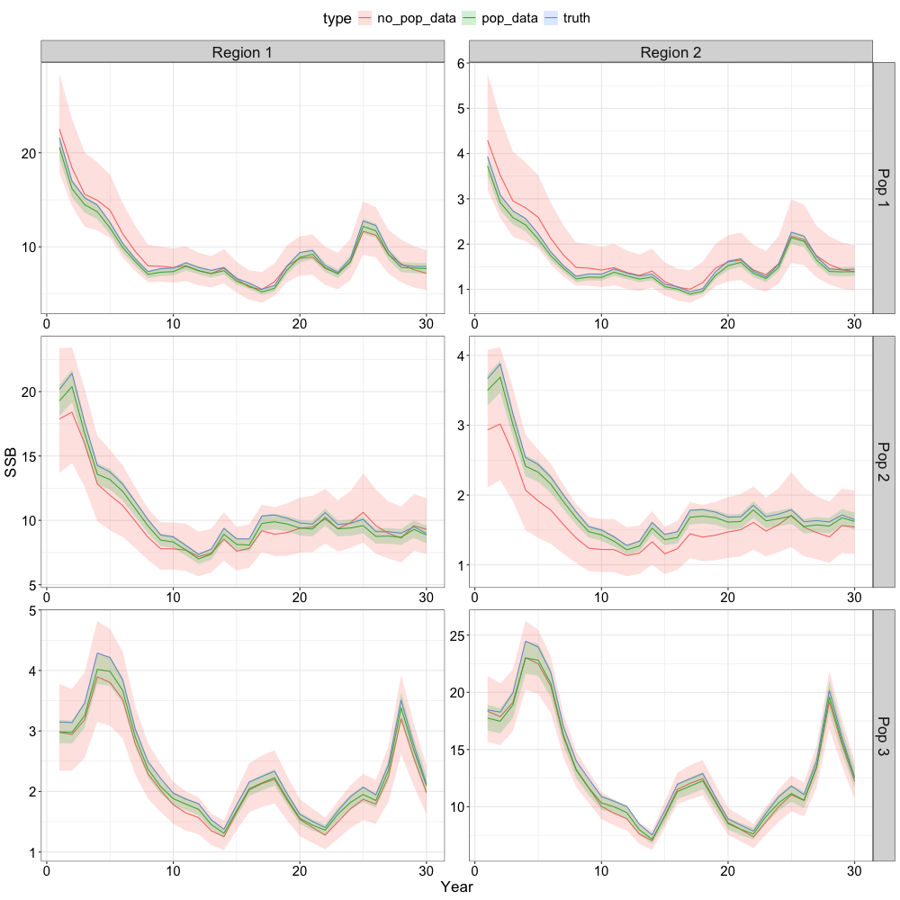
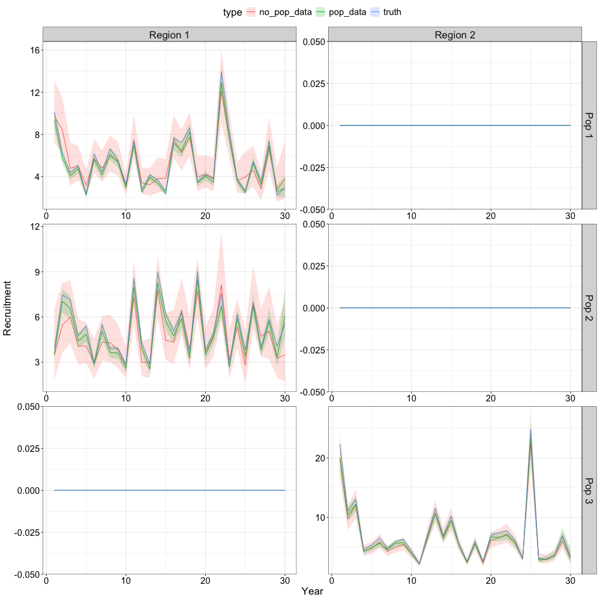

# Specifying a Natal Homing Model

## Overview

This vignette demonstrates SPoRC’s support for natal homing population
structure. The scenario here has 3 populations distributed across 2
regions:

| Population | Natal Region | Recruitment Region |
|:----------:|:------------:|:------------------:|
|     1      |   Region 1   |      Region 1      |
|     2      |   Region 1   |      Region 1      |
|     3      |   Region 2   |      Region 2      |

Such a configuration is motivated by systems where fish from different
origin populations intermix on common feeding grounds but return to
distinct natal areas to spawn.

In the following, we simulate data under an operating model, then fit
two estimation models that differ only in the data available:

- `no_pop_data`, region-aggregated catch, compositions, and survey index
  only (although tagging is population-specific).
- `pop_data`, population-disaggregated catch, compositions, and survey
  indices, as would be available from genetic stock identification or
  otolith microchemistry.

The comparison illustrates the identifiability benefit of
population-specific data when multiple populations share the same
spatial footprint.

### Operating Model Setup

#### Dimensions

``` r

library(SPoRC)
library(ggplot2)
library(here)
set.seed(555)

sim_list <- Setup_Sim_Dim(
  n_sims        = 1,
  n_yrs         = 30,
  n_regions     = 2,
  n_ages        = 10,
  n_lens        = NULL,
  n_sexes       = 1,
  n_fish_fleets = 1,
  n_srv_fleets  = 1,
  n_seas        = 2,
  n_pop         = 3,
  natal_region  = c(1, 1, 2)   # pops 1 & 2 natal to region 1; pop 3 natal to region 2
)

sim_list <- Setup_Sim_Containers(sim_list)
```

`natal_region` is the key argument in `Setup_Sim_Dim` where it maps each
population index to the region where that population spawns. Populations
1 and 2 both natally home towards Region 1 and are intentionally
overlapping in that they occupy the same space but represent distinct
populations

#### Fishing

Fishing mortality follows a sinusoidal trajectory that is out of phase
between regions, producing different exploitation histories:

``` r

sim_list <- Setup_Sim_Fishing(
  sim_list = sim_list,

  # logistic selectivity
  fish_sel_input = replicate(
    n = sim_list$n_sims,
    {
      arr <- array(NA, dim = c(sim_list$n_pop, sim_list$n_regions, sim_list$n_yrs, sim_list$n_seas,
                               sim_list$n_ages, sim_list$n_sexes, sim_list$n_fish_fleets))
      for (r in 1:sim_list$n_regions)
        for (y in 1:sim_list$n_yrs)
          for (s in 1:sim_list$n_sexes) {
            for(p in 1:sim_list$n_pop) {
              for(seas in 1:sim_list$n_seas) {
                arr[p,r, y,seas, , s, 1] <-  1 / (1 + exp(-1.5 * (1:sim_list$n_ages - 4)))
              }
            }
          }
      arr
    }
  ),

  Fmort_input = {
    n = sim_list$n_yrs * sim_list$n_seas * sim_list$n_sims * sim_list$n_fish_fleets
    t = seq(0, 2*pi, length.out = n)
    arr <- array(NA, dim = c(sim_list$n_regions, sim_list$n_yrs, sim_list$n_seas,
                             sim_list$n_fish_fleets, sim_list$n_sims))
    arr[1,,,,] <- 0.15 * exp(sin(t) + rnorm(n, 0, 0.1))   # region 1 higher F, peaks early
    arr[2,,,,] <- 0.05 * exp(-sin(t) + rnorm(n, 0, 0.1))  # region 2 lower F, peaks late
    arr
  },

  # Fishery Age ISS
  ISS_FishAgeComps = array(500, dim = c(sim_list$n_regions, sim_list$n_yrs, sim_list$n_seas, sim_list$n_sexes,
                                        sim_list$n_fish_fleets, sim_list$n_sims)),
  ISS_FishAgeComps_pop = array(round(500 / sim_list$n_pop), dim = c(sim_list$n_pop, sim_list$n_regions,
                                                               sim_list$n_yrs, sim_list$n_seas, sim_list$n_sexes,
                                                               sim_list$n_fish_fleets, sim_list$n_sims)),


  # Sigma for catch
  ln_sigmaC = array(log(0.01), dim = c(sim_list$n_regions, sim_list$n_yrs, sim_list$n_seas, sim_list$n_fish_fleets)),
  ln_sigmaC_pop = array(log(0.01), dim = c(sim_list$n_pop, sim_list$n_regions, sim_list$n_yrs, sim_list$n_seas, sim_list$n_fish_fleets))

)
```

#### Survey

``` r

sim_list <- Setup_Sim_Survey(
  sim_list = sim_list,

  # Logistic selectivity
  srv_sel_input = replicate(
    n = sim_list$n_sims,
    {
      arr <- array(NA, dim = c(sim_list$n_pop, sim_list$n_regions, sim_list$n_yrs, sim_list$n_seas,
                               sim_list$n_ages, sim_list$n_sexes, sim_list$n_srv_fleets))
      for (r in 1:sim_list$n_regions)
        for (y in 1:sim_list$n_yrs)
          for (s in 1:sim_list$n_sexes) {
            for(p in 1:sim_list$n_pop) {
              for(seas in 1:sim_list$n_seas) {
                arr[p,r, y,seas, , s, 1] <-  1 / (1 + exp(-1 * (1:sim_list$n_ages - 2.5)))

              }
            }
          }
      arr
    }
  ),

  # Survey Age ISS
  ISS_SrvAgeComps = array(500, dim = c(sim_list$n_regions, sim_list$n_yrs, sim_list$n_seas, sim_list$n_sexes,
                                        sim_list$n_srv_fleets, sim_list$n_sims)),
  ISS_SrvAgeComps_pop = array(round(500 / sim_list$n_pop), dim = c(sim_list$n_pop, sim_list$n_regions,
                                                        sim_list$n_yrs, sim_list$n_seas, sim_list$n_sexes,
                                                        sim_list$n_srv_fleets, sim_list$n_sims)),

  # Sigma for Survey Index
  ObsSrvIdx_SE = array(0.15, dim = c(sim_list$n_regions, sim_list$n_yrs, sim_list$n_seas, sim_list$n_srv_fleets)),
  ObsSrvIdx_pop_SE = array(0.15, dim = c(sim_list$n_pop, sim_list$n_regions,
                                         sim_list$n_yrs, sim_list$n_seas, sim_list$n_srv_fleets))

)
```

#### Biological Parameters

All populations share the same von Bertalanffy growth curve and maturity
schedule for simplicity. Natural mortality is set at $`M = 0.3`$ for all
populations, regions, ages, and years.

``` r

sim_list <- Setup_Sim_Biologicals(
  sim_list = sim_list,

  # Natural Mortality
  natmort_input = array(0.3, dim = c(sim_list$n_pop, sim_list$n_regions,
                                    sim_list$n_yrs, sim_list$n_ages,
                                    sim_list$n_sexes, sim_list$n_sims)),

  # Weight at age - Same for all pops
  WAA_input = replicate(
    n = sim_list$n_sims,
    array(
      rep(5 / (1 + exp(-3 * ((1:sim_list$n_ages) - 3))),
          each = sim_list$n_pop * sim_list$n_regions * sim_list$n_yrs * sim_list$n_seas,
          times = sim_list$n_sexes),
      dim = c(sim_list$n_pop, sim_list$n_regions, sim_list$n_yrs,
              sim_list$n_seas, sim_list$n_ages, sim_list$n_sexes)
    )
  ),

  # Fishery weight at age - same as WAA_input
  WAA_fish_input = replicate(
    n = sim_list$n_sims,
    array(
      rep(5 / (1 + exp(-3 * ((1:sim_list$n_ages) - 3))),
          each = sim_list$n_pop * sim_list$n_regions * sim_list$n_yrs * sim_list$n_seas,
          times = sim_list$n_sexes * sim_list$n_fish_fleets),
      dim = c(sim_list$n_pop, sim_list$n_regions, sim_list$n_yrs, sim_list$n_seas, sim_list$n_ages, sim_list$n_sexes, sim_list$n_fish_fleets)
    )
  ),

  # Survey weight at age - same as WAA_input
  WAA_srv_input = replicate(
    n = sim_list$n_sims,
    array(
      rep(5 / (1 + exp(-3 * ((1:sim_list$n_ages) - 3))),
          each = sim_list$n_pop * sim_list$n_regions * sim_list$n_yrs * sim_list$n_seas,
          times = sim_list$n_sexes * sim_list$n_srv_fleets),
      dim = c(sim_list$n_pop, sim_list$n_regions, sim_list$n_yrs, sim_list$n_seas, sim_list$n_ages, sim_list$n_sexes, sim_list$n_srv_fleets)
    )
  ),

  # Maturity at age
  MatAA_input = replicate(
    n = sim_list$n_sims,
    array(
      rep(1 / (1 + exp(-3 * ((1:sim_list$n_ages) - 3))),
          each = sim_list$n_pop * sim_list$n_regions * sim_list$n_yrs * sim_list$n_seas,
          times = sim_list$n_sexes),
      dim = c(sim_list$n_pop, sim_list$n_regions, sim_list$n_yrs, sim_list$n_seas, sim_list$n_ages, sim_list$n_sexes)
    )
  )
)
```

#### Tagging

Conventional tagging is enabled with 1,000 releases and a Poisson
recapture likelihood, with a maximum liberty period of 10 years. Note
that tagging data incorporate information about the origin population.

``` r

sim_list <- Setup_Sim_Tagging(
  sim_list          = sim_list,
  use_conv_fish_tagging = 1,
  n_tags            = 1e3,
  conv_tag_max_liberty  = 10,
  conv_fish_tag_like = "Poisson"
)
```

#### Movement

Movement is parameterized with two seasons and three populations. The
seasonal structure captures two distinct behavioral phases:

- Season 1 (dispersal): diffusive mixing, each population has a moderate
  probability of remaining in its current region, with the remainder
  spread uniformly to other regions.
- Season 2 (natal return): strong homing back to the natal region with a
  small rate of homing natally.

Because a proportion of individuals do not natally home, a stray rate an
be specified to represent components of the population that temporarily
transfer population memerbship. By default, this is set at 0, and thus,
individuals do not stray. Rather, individuals that do not natally home
represent skipped spawning (i.e., do not contribute to spawning
biomass).

``` r

sim_list$Movement <- array(
  0,
  dim = c(sim_list$n_pop, sim_list$n_regions, sim_list$n_regions,
          sim_list$n_yrs, sim_list$n_seas, sim_list$n_ages,
          sim_list$n_sexes, sim_list$n_sims)
)

# Fill in movement matrix
stay_prob <- c(0.7, 0.3, 0.7)  # probability of staying in current region during dispersal season
disperse_prob <- (1 - stay_prob) / (sim_list$n_regions - 1)  # spread remainder equally
non_natal_rate <- 0.15 # non natal homing rate

for (p in seq_len(sim_list$n_pop)) {
  nr <- sim_list$natal_region[p]
  for (r_from in seq_len(sim_list$n_regions)) {

    # Season 1: diffusive dispersal, mostly stay, some movement out
    for (r_to in seq_len(sim_list$n_regions)) {
      prob <- if (r_to == r_from) stay_prob[p] else disperse_prob[p]
      sim_list$Movement[p, r_from, r_to, , 1, , , ] <- prob
    }

    # Season 2: natal return with straying
    for (r_to in seq_len(sim_list$n_regions)) {
      prob <- if (r_to == nr) 1 - non_natal_rate * (sim_list$n_regions - 1) else non_natal_rate
      sim_list$Movement[p, r_from, r_to, , 2, , , ] <- prob
    }
  }
}
```

Note that populations 1 and 2 have different dispersal retention
probabilities (0.7 vs 0.3) despite sharing the same natal region,
creating distinct mixing dynamics for two co-occurring populations.

#### Recruitment

Beverton-Holt recruitment with local density dependence
(`rec_dd = 'local'`). $`R_0`$ and steepness are specified per population
× natal region cell; all other cells are zero. Spawning occurs at
midpoint of season 2.

``` r

sim_list <- Setup_Sim_Rec(
  sim_list = sim_list,
  R0_input = {
    R0_arry <- array(0, dim = c(sim_list$n_pop, sim_list$n_regions, sim_list$n_yrs, sim_list$n_sims))
    R0_arry[1, 1, , ] <- 7   # pop 1 recruits to region 1
    R0_arry[2, 1, , ] <- 7   # pop 2 recruits to region 1
    R0_arry[3, 2, , ] <- 7   # pop 3 recruits to region 2
    R0_arry
  },
  ln_sigmaR = array(log(0.5), dim = c(2, sim_list$n_pop, sim_list$n_regions)),
  init_age_strc = "matrix",
  recruitment_opt = 'bh_rec',
  rec_dd = 'local',
  spawn_seas = 2,
  t_spawn = 0.5,
  h_input = {
    h_arry <- array(NA, dim = c(sim_list$n_pop, sim_list$n_regions, sim_list$n_yrs, sim_list$n_sims))
    h_arry[1, 1, , ] <- 0.75 # pop 1 in region 1
    h_arry[2, 1, , ] <- 0.75 # pop 2 in region 1
    h_arry[3, 2, , ] <- 0.75 # pop 3 in region 2
    h_arry
  }
)
```

#### Simulate

``` r

sim_obj <- Simulate_Pop_Static(sim_list = sim_list, output_path = NULL)
```

### Estimation Model Setup

A single `setup_em()` function constructs both estimation models. The
`use_pop_specific_cat_comps` flag toggles whether
population-disaggregated data are passed in. Both models estimate
movement freely (`use_fixed_movement = 0`) and share the same
selectivity, $`q`$, and recruitment parameterization.

Key estimation choices include:

| Component | Specification |
|:---|:---|
| $`M`$ | Estimated constant (`est_ln_M`) |
| Steepness $`h`$ | Fixed at true value |
| $`\sigma_R`$ | Fixed at true value |
| `rec_region_prop_spec` | Specified at `no_dispersal` as in the operating model. However, this can be relaxed, by allowing population-specific recruitment dispersal proportions if desired |
| Initial age structure | Matrix geometric series; all deviations shared by region |
| Movement | Estimated; 3 population blocks × 2 season blocks |
| Tag reporting rate | Estimated, shared by region |
| Fishery / survey selectivity | Logistic, shared by region |
| Survey $`q`$ | Estimated, shared by region |

``` r

setup_em <- function(sim_obj, sim, use_pop_specific_cat_comps) {

  # Extract simulation data for current year and replicate
  sim_data <- simulation_data_to_SPoRC(sim_env = sim_obj, y = sim_obj$n_yrs, sim = sim)

  # Setup model dimensions
  input_list <- Setup_Mod_Dim(
    years = 1:sim_obj$n_years,
    ages = 1:sim_obj$n_ages,
    lens = sim_obj$n_lens,
    n_regions = sim_obj$n_regions,
    n_sexes = sim_obj$n_sexes,
    n_fish_fleets = sim_obj$n_fish_fleets,
    n_srv_fleets = sim_obj$n_srv_fleets,
    n_seas = sim_obj$n_seas,
    n_pop = sim_obj$n_pop,
    seasdur = sim_obj$seasdur,
    natal_region = c(1,1,2),
    verbose = FALSE
  )

  input_list <- Setup_Mod_Rec(
    input_list = input_list,
    do_rec_bias_ramp = 0,
    sigmaR_switch = 1,
    init_age_strc = "matrix",
    equil_init_age_strc = "stoch_all",

    # spawning dynamics
    spawn_seas = sim_obj$spawn_seas,
    t_spawn = sim_obj$t_spawn,

    rec_model = "bh_rec",
    sigmaR_spec = "fix",
    rec_dd = 'local',
    InitDevs_spec = "est_shared_r",
    RecDevs_spec = "est_shared_r",
    sexratio_spec = "fix",
    rec_region_prop_spec = 'no_dispersal',
    h_spec = 'fix',

    # starting values / fixed parameters
    steepness_h = {
      h_arry <- array(0, dim = c(sim_list$n_pop, sim_list$n_regions))
      h_arry[1,1] <- qlogis((0.75 - 0.2) / 0.8)
      h_arry[2,1] <- qlogis((0.75 - 0.2) / 0.8)
      h_arry[3,2] <- qlogis((0.75 - 0.2) / 0.8)
      h_arry
    },
    ln_sigmaR = array(log(0.5), dim = c(2, sim_list$n_pop, sim_list$n_regions)),
    ln_global_R0 = array(c(log(7), log(5), log(10)), dim = input_list$data$n_pop)
  )

  # Biological setup
  input_list <- Setup_Mod_Biologicals(
    input_list = input_list,
    WAA = sim_data$WAA,
    MatAA = sim_data$MatAA,
    WAA_fish = sim_data$WAA_fish,
    WAA_srv = sim_data$WAA_srv,
    fit_lengths = 0,
    AgeingError = sim_data$AgeingError,
    M_spec = "est_ln_M"
  )

  # Movement and tagging
  input_list <- Setup_Mod_Tagging(input_list = input_list,
                                  use_conv_fish_tagging = 1,
                                  conv_tagged_fish = sim_data$conv_tagged_fish_attr,
                                  conv_tag_max_liberty = dim(sim_data$obs_conv_tag_fish_recap)[1],
                                  obs_conv_tag_fish_recap = sim_data$obs_conv_tag_fish_recap,
                                  conv_fish_tag_like = 'Poisson',
                                  init_conv_tag_mort_spec = 'fix',
                                  conv_tag_shed_spec = 'fix',
                                  conv_tagrep_spec = 'est_shared_r',
                                  conv_fish_tag_attr = "p_a_s",
                                  conv_tag_release_indicator = sim_data$conv_tag_release_indicator
  )

  input_list <- Setup_Mod_Movement(
    input_list = input_list,
    do_recruits_move = 0,
    use_fixed_movement = 0,
    Movement_popblk_spec = list(1,2,3),
    Movement_seasblk_spec = list(1,2)
  )

  # Catch & F ---------------------------------------------------------------
  if(use_pop_specific_cat_comps) {
    input_list <- Setup_Mod_Catch_and_F(
      input_list = input_list,
      ObsCatch = sim_data$ObsCatch,
      UseCatch = array(0, dim = dim(sim_data$UseCatch)),
      ObsCatch_pop = sim_data$ObsCatch_pop,
      UseCatch_pop = sim_data$UseCatch_pop,
      Use_F_pen = 1,
      sigmaC_spec = "fix",
      sigmaC_pop_spec = 'fix',
      ln_sigmaC = sim_data$ln_sigmaC,
      ln_sigmaC_pop = sim_data$ln_sigmaC_pop,
      ln_sigmaF = array(log(1), dim = c(input_list$data$n_regions,
                                           input_list$data$n_seas,
                                           input_list$data$n_fish_fleets))
    )
  } else {
    input_list <- Setup_Mod_Catch_and_F(
      input_list = input_list,
      ObsCatch = sim_data$ObsCatch,
      UseCatch = array(1, dim = dim(sim_data$UseCatch)),
      Use_F_pen = 1,
      sigmaC_pop_spec = 'fix',
      sigmaF_spec = 'fix',
      ln_sigmaC = sim_data$ln_sigmaC,
      ln_sigmaC_pop = sim_data$ln_sigmaC_pop,
      ln_sigmaF = array(log(1), dim = c(input_list$data$n_regions,
                                        input_list$data$n_seas,
                                        input_list$data$n_fish_fleets))
    )
  }

  # Fishery index & comps ---------------------------------------------------
  if(use_pop_specific_cat_comps) {
    input_list <- Setup_Mod_FishIdx_and_Comps(
      input_list = input_list,
      ObsFishIdx = sim_data$ObsFishIdx,
      ObsFishIdx_SE = sim_data$ObsFishIdx_SE,
      UseFishIdx = array(0, dim = dim(sim_data$UseFishIdx)),
      ObsFishAgeComps = sim_data$ObsFishAgeComps,
      ObsFishLenComps = sim_data$ObsFishLenComps,
      UseFishAgeComps = array(0, dim = dim(sim_data$UseFishAgeComps)),
      UseFishLenComps = sim_data$UseFishLenComps,
      ISS_FishAgeComps = sim_data$ISS_FishAgeComps,
      ISS_FishLenComps = sim_data$ISS_FishLenComps,
      ObsFishAgeComps_pop = sim_data$ObsFishAgeComps_pop,
      UseFishAgeComps_pop = sim_data$UseFishAgeComps_pop,
      ISS_FishAgeComps_pop = sim_data$ISS_FishAgeComps_pop,
      FishAgeComps_pop_LikeType = c("Multinomial"),
      FishAgeComps_pop_Type = c("spltRjntS_Year_1-terminal_Fleet_1"),
      fish_idx_type = 'none',
      FishAgeComps_LikeType = c("Multinomial"),
      FishLenComps_LikeType = c("none"),
      FishAgeComps_Type = c("spltRjntS_Year_1-terminal_Fleet_1"),
      FishLenComps_Type = c("none_Year_1-terminal_Fleet_1")
    )
  } else {
    input_list <- Setup_Mod_FishIdx_and_Comps(
      input_list = input_list,
      ObsFishIdx = sim_data$ObsFishIdx,
      ObsFishIdx_SE = sim_data$ObsFishIdx_SE,
      UseFishIdx = array(0, dim = dim(sim_data$UseFishIdx)),
      ObsFishAgeComps = sim_data$ObsFishAgeComps,
      ObsFishLenComps = sim_data$ObsFishLenComps,
      UseFishAgeComps = sim_data$UseFishAgeComps,
      UseFishLenComps = sim_data$UseFishLenComps,
      ISS_FishAgeComps = sim_data$ISS_FishAgeComps,
      ISS_FishLenComps = sim_data$ISS_FishLenComps,
      fish_idx_type = 'none',
      FishAgeComps_LikeType = c("Multinomial"),
      FishLenComps_LikeType = c("none"),
      FishAgeComps_Type = c("spltRjntS_Year_1-terminal_Fleet_1"),
      FishLenComps_Type = c("none_Year_1-terminal_Fleet_1")
    )
  }

  # Survey index & comps ----------------------------------------------------
  if(use_pop_specific_cat_comps) {
    input_list <- Setup_Mod_SrvIdx_and_Comps(
      input_list = input_list,
      ObsSrvIdx = sim_data$ObsSrvIdx,
      ObsSrvIdx_SE = sim_data$ObsSrvIdx_SE,
      UseSrvIdx = array(0, dim = dim(sim_data$UseSrvIdx)),
      ObsSrvIdx_pop = sim_data$ObsSrvIdx_pop,
      ObsSrvIdx_pop_SE = sim_data$ObsSrvIdx_pop_SE,
      UseSrvIdx_pop = array(1, dim = dim(sim_data$UseSrvIdx_pop)),
      ObsSrvAgeComps = sim_data$ObsSrvAgeComps,
      ObsSrvLenComps = sim_data$ObsSrvLenComps,
      UseSrvAgeComps = array(0, dim = dim(sim_data$UseSrvAgeComps)),
      UseSrvLenComps = sim_data$UseSrvLenComps,
      ISS_SrvAgeComps = sim_data$ISS_SrvAgeComps,
      ISS_SrvLenComps = sim_data$ISS_SrvLenComps,
      ObsSrvAgeComps_pop = sim_data$ObsSrvAgeComps_pop,
      UseSrvAgeComps_pop = sim_data$UseSrvAgeComps_pop,
      ISS_SrvAgeComps_pop = sim_data$ISS_SrvAgeComps_pop,
      SrvAgeComps_pop_LikeType = c("Multinomial"),
      SrvAgeComps_pop_Type = c("spltRjntS_Year_1-terminal_Fleet_1"),
      srv_idx_type = c("biom"),
      SrvAgeComps_LikeType = c("Multinomial"),
      SrvLenComps_LikeType = c("none"),
      SrvAgeComps_Type = c("spltRjntS_Year_1-terminal_Fleet_1"),
      SrvLenComps_Type = c("none_Year_1-terminal_Fleet_1")
    )
  } else {
    input_list <- Setup_Mod_SrvIdx_and_Comps(
      input_list = input_list,
      ObsSrvIdx = sim_data$ObsSrvIdx,
      ObsSrvIdx_SE = sim_data$ObsSrvIdx_SE,
      UseSrvIdx = sim_data$UseSrvIdx,
      ObsSrvAgeComps = sim_data$ObsSrvAgeComps,
      ObsSrvLenComps = sim_data$ObsSrvLenComps,
      UseSrvAgeComps = sim_data$UseSrvAgeComps,
      UseSrvLenComps = sim_data$UseSrvLenComps,
      ISS_SrvAgeComps = sim_data$ISS_SrvAgeComps,
      ISS_SrvLenComps = sim_data$ISS_SrvLenComps,
      srv_idx_type = c("biom"),
      SrvAgeComps_LikeType = c("Multinomial"),
      SrvLenComps_LikeType = c("none"),
      SrvAgeComps_Type = c("spltRjntS_Year_1-terminal_Fleet_1"),
      SrvLenComps_Type = c("none_Year_1-terminal_Fleet_1")
    )
  }

  input_list <- Setup_Mod_Fishsel_and_Q(
    input_list = input_list,
    fish_sel_model = c("logist1_Fleet_1"),
    fish_fixed_sel_pars_spec = c("est_shared_r"),
    fish_q_spec = c("fix")
  )

  input_list <- Setup_Mod_Srvsel_and_Q(
    input_list = input_list,
    srv_sel_model = c("logist1_Fleet_1"),
    srv_fixed_sel_pars_spec = c("est_shared_r"),
    srv_q_spec = c("est_shared_r")
  )

  # Weighting ---------------------------------------------------------------
  if(use_pop_specific_cat_comps) {
    input_list <- Setup_Mod_Weighting(
      input_list = input_list,
      Wt_Catch = 1,
      Wt_Catch_pop = 1,
      Wt_SrvIdx_pop = 1,
      Wt_FishIdx = 1,
      Wt_SrvIdx = 1,
      Wt_Rec = 1,
      Wt_F = 1,
      Wt_Tagging = 1,
      Wt_FishAgeComps = array(0, dim = c(input_list$data$n_regions, length(input_list$data$years),
                                         input_list$data$n_seas, input_list$data$n_sexes, input_list$data$n_fish_fleets)),
      Wt_SrvAgeComps = array(0, dim = c(input_list$data$n_regions, length(input_list$data$years),
                                        input_list$data$n_seas, input_list$data$n_sexes, input_list$data$n_srv_fleets)),
      Wt_FishAgeComps_pop = array(1, dim = c(input_list$data$n_pop, input_list$data$n_regions, length(input_list$data$years),
                                             input_list$data$n_seas, input_list$data$n_sexes, input_list$data$n_fish_fleets)),
      Wt_SrvAgeComps_pop = array(1, dim = c(input_list$data$n_pop, input_list$data$n_regions, length(input_list$data$years),
                                            input_list$data$n_seas, input_list$data$n_sexes, input_list$data$n_srv_fleets))
    )
  } else {
    input_list <- Setup_Mod_Weighting(
      input_list = input_list,
      Wt_Catch = 1,
      Wt_Catch_pop = 1,
      Wt_FishIdx = 1,
      Wt_SrvIdx = 1,
      Wt_Rec = 1,
      Wt_F = 1,
      Wt_Tagging = 1,
      Wt_FishAgeComps = array(1, dim = c(input_list$data$n_regions, length(input_list$data$years),
                                         input_list$data$n_seas, input_list$data$n_sexes, input_list$data$n_fish_fleets)),
      Wt_SrvAgeComps = array(1, dim = c(input_list$data$n_regions, length(input_list$data$years),
                                        input_list$data$n_seas, input_list$data$n_sexes, input_list$data$n_srv_fleets))
    )
  }

  return(input_list)
}
```

### Fitting

Both models are fit with
[`fit_model()`](https://chengmatt.github.io/SPoRC/dev/reference/fit_model.md)
and standard errors are obtained via `sdreport()`.

``` r

# Aggregated data only
input_list  <- setup_em(sim_obj, sim = 1, use_pop_specific_cat_comps = FALSE)
non_pop_obj <- fit_model(input_list$data, input_list$par, input_list$map,
                         NULL, 3, silent = FALSE, do_optim = TRUE)
non_pop_obj$sd_rep <- sdreport(non_pop_obj)

# Population-disaggregated data
input_list  <- setup_em(sim_obj, sim = 1, use_pop_specific_cat_comps = TRUE)
pop_obj     <- fit_model(input_list$data, input_list$par, input_list$map,
                         NULL, 3, silent = FALSE, do_optim = T)
pop_obj$sd_rep <- sdreport(pop_obj)
```

``` r

ssb_comp <- rbind(
  reshape2::melt(non_pop_obj$rep$SSB) %>%
    mutate(type = "no_pop_data",
           se   = non_pop_obj$sd_rep$sd[names(non_pop_obj$sd_rep$value) == "log_SSB"]),
  reshape2::melt(pop_obj$rep$SSB) %>%
    mutate(type = "pop_data",
           se   = pop_obj$sd_rep$sd[names(pop_obj$sd_rep$value) == "log_SSB"]),
  reshape2::melt(sim_obj$SSB[, , , 1]) %>%
    mutate(type = "truth", se = NA)
) %>%
  rename(Pop = Var1, Region = Var2, Year = Var3) %>%
  mutate(Pop    = paste("Pop", Pop),
         Region = paste("Region", Region))

ggplot(ssb_comp, aes(x = Year, y = value, color = type, fill = type)) +
  geom_line(aes(group = interaction(type, Pop, Region))) +
  geom_ribbon(
    aes(
      ymin  = exp(log(value) - 1.96 * se),
      ymax  = exp(log(value) + 1.96 * se),
      group = interaction(type, Pop, Region)
    ),
    alpha = 0.2, color = NA
  ) +
  ggh4x::facet_grid2(Pop ~ Region, scales = "free", independent = "all") +
  theme_sablefish() +
  labs(y = "SSB")
```



``` r

rec_comp <- rbind(
  reshape2::melt(non_pop_obj$rep$Rec) %>%
    mutate(type = "no_pop_data",
           se   = non_pop_obj$sd_rep$sd[names(non_pop_obj$sd_rep$value) == "log_Rec"]),
  reshape2::melt(pop_obj$rep$Rec) %>%
    mutate(type = "pop_data",
           se   = pop_obj$sd_rep$sd[names(pop_obj$sd_rep$value) == "log_Rec"]),
  reshape2::melt(sim_obj$Rec[, , , 1]) %>%
    mutate(type = "truth", se = NA)
) %>%
  rename(Pop = Var1, Region = Var2, Year = Var3) %>%
  mutate(Pop    = paste("Pop", Pop),
         Region = paste("Region", Region))

ggplot(rec_comp, aes(x = Year, y = value, color = type, fill = type)) +
  geom_line(aes(group = interaction(type, Pop, Region))) +
  geom_ribbon(
    aes(
      ymin  = exp(log(value) - 1.96 * se),
      ymax  = exp(log(value) + 1.96 * se),
      group = interaction(type, Pop, Region)
    ),
    alpha = 0.2, color = NA
  ) +
  ggh4x::facet_grid2(Pop ~ Region, scales = "free", independent = "all") +
  theme_sablefish() +
  labs(y = "Recruitment")
```



With mostly region-aggregated data, the model has little direct
information about which recruits belong to which population or where
they originated (except for tagging data). When multiple populations
co-occur in the same region, as populations 1 and 2 do in Region 1 here,
the aggregated age compositions and survey indices have a mixed signal,
and the model must attempt to decompose it using movement dynamics,
tagging data, and spatial contrast alone (as well as fixed parameters).
However, incorporating population-specific data greatly enhances the
identifiability of this model, which results in improved estimates of
spawning stock biomass and recruitment relative to the truth.
