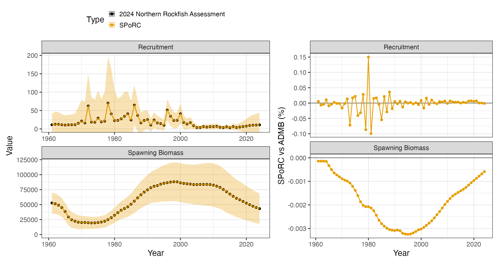
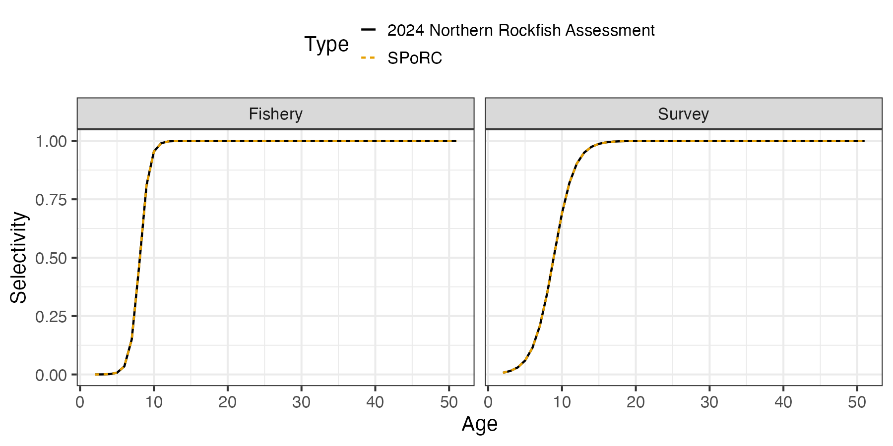

# Case Study: Gulf of Alaska Northern Rockfish

## Overview

This case study reproduces the 2024 Gulf of Alaska northern rockfish
assessment in `SPoRC`. Every structural choice below follows the
assessment rather than `SPoRC`’s defaults, and the result is an exact
bridge: evaluated at the assessment’s own maximum likelihood estimate,
spawning biomass agrees to $`8\times10^{-9}`$ percent and every
likelihood component reproduces to six significant figures.

The model is single region, single sex, single season, with one fishery
fleet and one survey:

| Source                      | Years     | Observations | Likelihood          |
|-----------------------------|-----------|--------------|---------------------|
| Catch                       | 1961–2024 | 64           | Lognormal, weighted |
| Bottom trawl survey biomass | 1990–2023 | 16           | Lognormal           |
| Fishery age compositions    | 1998–2022 | 16           | Multinomial         |
| Fishery length compositions | 1991–2023 | 17           | Multinomial         |
| Survey age compositions     | 1990–2023 | 16           | Multinomial         |

Model ages run 2 to 51 with a plus group, while the assessment reports
over observed ages 2 to 45. Lengths run 15 to 45 cm.

``` r

library(SPoRC)
library(dplyr)
library(ggplot2)
data("sgl_rg_goa_nork_data")

dat <- sgl_rg_goa_nork_data
yrs <- dat$years
n_yrs <- length(yrs)
n_ages <- length(dat$ages)
```

The object carries three kinds of content: the model inputs (`ObsCatch`,
`WAA`, `ObsSrvIdx`, and so on), the ADMB maximum likelihood estimate in
`dat$mle`, used both as a starting point and to verify the objective
before any optimization, and the ADMB output in `dat$admb`, which is the
comparison target.

``` r

names(dat$mle)
names(dat$admb)
```

## Model dimensions

Because the model is single region and single sex, the population,
region, season and sex subscripts used in the model equations all
collapse to one, and are dropped from the notation below.

``` r

input_list <- Setup_Mod_Dim(
  n_pop = dat$n_pop,
  years = yrs,
  ages = dat$ages,
  lens = dat$lens,
  n_regions = dat$n_regions,
  n_sexes = dat$n_sexes,
  n_fish_fleets = dat$n_fish_fleets,
  n_srv_fleets = dat$n_srv_fleets,
  n_seas = dat$n_seas,
  verbose = FALSE
)
```

## Recruitment

Recruitment is a mean with annual deviations rather than a stock recruit
function:

``` math
\text{Rec}_{y} = R_{0}\exp\left(\epsilon_{y}^{\text{Rec}}\right),\qquad \ell^{\text{Rec}} = \sum_{y}\dfrac{\left(\epsilon_{y}^{\text{Rec}}\right)^{2}}{2\sigma_{R}^{2}}
```

with $`\sigma_{R} = 1.5`$ fixed. There is no lognormal bias correction,
so `do_rec_bias_ramp = 0` and the penalty is centered on zero, which is
what the ADMB template does. Every year carries a deviation, including
the terminal years, so `dont_est_recdev_last = 0`. The first year sits
in an unfished equilibrium age structure with its own deviations, which
is `init_age_strc = 1`, and spawning occurs at the start of the year.

``` r

input_list <- Setup_Mod_Rec(
  input_list = input_list,
  rec_model = "mean_rec",
  do_rec_bias_ramp = 0,
  bias_year = rep(n_yrs, 4),
  sigmaR_switch = 1,
  ln_sigmaR = array(log(dat$sigmaR), dim = c(2, dat$n_pop, dat$n_regions)),
  dont_est_recdev_last = 0,
  sigmaR_spec = "fix",
  init_age_strc = 1,
  t_spawn = 0
)
```

## Biological dynamics

Natural mortality is estimated under a lognormal prior centered on
$`0.06`$ with a coefficient of variation of $`0.05`$:

``` math
\ell^{M} = \dfrac{\left(\log M - \log \mu_{M}\right)^{2}}{2\,\text{CV}_{M}^{2}}
```

Length compositions are fit through a size at age transition matrix, and
age compositions pass through an ageing error matrix, so both are
declared here rather than at the composition call.

``` r

input_list <- Setup_Mod_Biologicals(
  input_list = input_list,
  WAA = dat$WAA,
  MatAA = dat$MatAA,
  fit_lengths = 1,
  SizeAgeTrans = dat$SizeAgeTrans,
  AgeingError = dat$AgeingError,
  M_spec = "est_ln_M",
  Use_M_prior = 1,
  M_prior = data.frame(popblk = 1, regionblk = 1, yearblk = 1, ageblk = 1, sexblk = 1,
                       mu = dat$mean_M, sd = dat$cv_M),
  addtosrvidx = 0.00001,
  addtocomp = 0.00001
)
```

## Movement and tagging

The model is single region, so movement is an identity matrix and no
tagging data are used. Both still have to be declared.

``` r

input_list <- Setup_Mod_Movement(input_list = input_list, use_fixed_movement = 1,
                                 Fixed_Movement = NA, do_recruits_move = 0)

input_list <- Setup_Mod_Tagging(input_list = input_list, use_conv_fish_tagging = 0)
```

## Catch and fishing mortality

The assessment writes its catch and F statements as weighted sums of
squares. A weighted sum of squares and a normal likelihood with a fixed
standard deviation are the same statement up to a constant, related by
$`\sigma = 1/\sqrt{2w}`$, so the weights enter through `ln_sigmaC` and
`ln_sigmaF` rather than through a separate multiplier:

``` math
\ell^{\text{Catch}} = \sum_{y} w_{y}^{\text{Catch}}\left(\log C_{y}^{\text{obs}} - \log C_{y}^{\text{pred}}\right)^{2},\qquad \sigma_{y}^{C} = \sqrt{1/(2w_{y}^{\text{Catch}})}
```

The reconstructed catches before 1978 carry a weight of $`5`$ and the
observer era series a weight of $`50`$, which is the assessment’s way of
saying the early series is less certain. The F deviations carry
$`\sigma_{F} = 1/\sqrt{2}`$ with the overall weight of $`0.1`$ applied
in the weighting section.

``` r

ln_sigmaC <- array(NA_real_, dim = c(dat$n_regions, n_yrs, dat$n_seas, dat$n_fish_fleets))
ln_sigmaC[1, , 1, 1] <- log(sqrt(1 / (2 * dat$catch_wt)))

suppressWarnings(
  input_list <- Setup_Mod_Catch_and_F(
    input_list = input_list,
    ObsCatch = dat$ObsCatch,
    UseCatch = dat$UseCatch,
    Use_F_pen = 1,
    sigmaC_spec = "fix",
    ln_sigmaC = ln_sigmaC,
    ln_sigmaF = array(log(sqrt(1 / 2)),
                      dim = c(dat$n_regions, dat$n_seas, dat$n_fish_fleets))
  )
)
```

## Fishery compositions

There is no fishery index in this assessment, only compositions, so
`fish_idx_type` is `"none"` and the index arrays are declared empty.
Both age and length compositions are aggregated over the region and fit
multinomially.

``` r

input_list <- Setup_Mod_FishIdx_and_Comps(
  input_list = input_list,
  ObsFishIdx = array(NA, dim = c(dat$n_regions, n_yrs, dat$n_seas, dat$n_fish_fleets)),
  ObsFishIdx_SE = array(NA, dim = c(dat$n_regions, n_yrs, dat$n_seas, dat$n_fish_fleets)),
  UseFishIdx = array(0, dim = c(dat$n_regions, n_yrs, dat$n_seas, dat$n_fish_fleets)),
  ObsFishAgeComps = dat$ObsFishAgeComps,
  UseFishAgeComps = dat$UseFishAgeComps,
  ISS_FishAgeComps = dat$ISS_FishAgeComps,
  ObsFishLenComps = dat$ObsFishLenComps,
  UseFishLenComps = dat$UseFishLenComps,
  ISS_FishLenComps = dat$ISS_FishLenComps,
  fish_idx_type = "none",
  FishAgeComps_LikeType = "Multinomial",
  FishLenComps_LikeType = "Multinomial",
  FishAgeComps_Type = "agg_Year_1-terminal_Fleet_1",
  FishLenComps_Type = "agg_Year_1-terminal_Fleet_1"
)
```

## Survey index and compositions

The bottom trawl survey supplies a biomass index and age compositions.
The index is lognormal with year specific standard errors, and the
survey is fit at the start of the year, which `t_srv = 0` sets in the
selectivity section below.

``` r

input_list <- Setup_Mod_SrvIdx_and_Comps(
  input_list = input_list,
  ObsSrvIdx = dat$ObsSrvIdx,
  ObsSrvIdx_SE = dat$ObsSrvIdx_SE,
  UseSrvIdx = dat$UseSrvIdx,
  ObsSrvAgeComps = dat$ObsSrvAgeComps,
  ISS_SrvAgeComps = dat$ISS_SrvAgeComps,
  UseSrvAgeComps = dat$UseSrvAgeComps,
  ObsSrvLenComps = dat$ObsSrvLenComps,
  UseSrvLenComps = dat$UseSrvLenComps,
  ISS_SrvLenComps = dat$ISS_SrvLenComps,
  srv_idx_type = "biom",
  SrvAgeComps_LikeType = "Multinomial",
  SrvLenComps_LikeType = "Multinomial",
  SrvAgeComps_Type = "agg_Year_1-terminal_Fleet_1",
  SrvLenComps_Type = "agg_Year_1-terminal_Fleet_1"
)
```

## Fishery selectivity and catchability

Both fleets use the $`a_{50}`$ and $`a_{95}`$ parameterization of the
logistic, which is `logist2`:

``` math
\text{Sel}_{a} = \dfrac{1}{1 + 19^{\left(a_{50} - a\right)/a_{95}}}
```

Selectivity is time invariant, so there are no deviations and no process
error. Fishery catchability is not used, because there is no fishery
index to scale.

``` r

input_list <- Setup_Mod_Fishsel_and_Q(
  input_list = input_list,
  cont_tv_fish_sel = "none_Fleet_1",
  fish_sel_blocks = "none_Fleet_1",
  fish_sel_model = "logist2_Fleet_1",
  fish_q_blocks = "none_Fleet_1",
  fish_fixed_sel_pars_spec = "est_all",
  fish_q_spec = "fix"
)
```

## Survey selectivity and catchability

Survey selectivity takes the same logistic form. Catchability is
estimated under a lognormal prior centered on $`1`$ with a coefficient
of variation of $`0.45`$, which is loose enough to let the data move it:

``` math
\ell^{q} = \dfrac{\left(\log q - \log \mu_{q}\right)^{2}}{2\,\text{CV}_{q}^{2}}
```

``` r

input_list <- Setup_Mod_Srvsel_and_Q(
  input_list = input_list,
  cont_tv_srv_sel = "none_Fleet_1",
  srv_sel_blocks = "none_Fleet_1",
  srv_sel_model = "logist2_Fleet_1",
  srv_q_blocks = "none_Fleet_1",
  srv_fixed_sel_pars_spec = "est_all",
  srv_q_spec = "est_all",
  Use_srv_q_prior = 1,
  srv_q_prior = data.frame(region = 1, block = 1, fleet = 1,
                           mu = dat$mean_q, sd = dat$cv_q),
  t_srv = array(0, dim = c(dat$n_regions, dat$n_seas, dat$n_srv_fleets))
)
```

## Weighting

The survey index carries a weight of $`0.25`$ and the F penalty a weight
of $`0.1`$. Every composition source carries the assessment’s own
multipliers, which ship in the data object.

``` r

input_list <- Setup_Mod_Weighting(
  input_list = input_list,
  Wt_Catch = 1, Wt_FishIdx = 1, Wt_SrvIdx = dat$srv_wt,
  Wt_Rec = 1, Wt_F = dat$fmort_wt, Wt_Tagging = 0,
  Wt_FishAgeComps = dat$Wt_FishAgeComps,
  Wt_FishLenComps = dat$Wt_FishLenComps,
  Wt_SrvAgeComps = dat$Wt_SrvAgeComps,
  Wt_SrvLenComps = dat$Wt_SrvLenComps
)
```

## Starting at the ADMB estimate

Before optimizing anything, it is worth checking that the model is
reproduced *at a known point*. Setting every parameter to the
assessment’s maximum likelihood estimate and evaluating there separates
a specification error from an optimization difference: if the population
and the likelihood agree at the ADMB solution, the two models are the
same model.

Every parameter can be assigned directly here, because recruitment is a
mean with deviations rather than a stock recruit function and nothing
has to be solved by substitution. The initial age deviations were back
derived from the ADMB numbers at age when the data object was built, so
seeding them reproduces the ADMB starting conditions exactly.

``` r

mle <- dat$mle

input_list$par$ln_global_R0[] <- mle$log_mean_R
input_list$par$ln_RecDevs[1, 1, ] <- mle$log_Rt
input_list$par$ln_InitDevs[1, 1, , ] <- mle$init_devs
input_list$par$ln_M[] <- log(mle$M)
input_list$par$ln_F_mean[] <- mle$log_mean_F
input_list$par$ln_F_devs[1, , 1, 1] <- mle$log_Ft
input_list$par$fish_fixed_sel_pars[] <- log(c(mle$a50C, mle$deltaC))
input_list$par$srv_fixed_sel_pars[] <- log(c(mle$a50S, mle$deltaS))
input_list$par$ln_srv_q[] <- log(mle$q)

obj <- fit_model(input_list$data, input_list$par, input_list$map,
                 do_optim = FALSE, silent = TRUE)
r <- obj$rep
```

At that point every reported quantity agrees with the ADMB model to
numerical precision:

    fishery selectivity max pct diff: 5.5e-08
    survey selectivity  max pct diff: 2.7e-08
    numbers at age      max pct diff: 1.5e-08
    spawning biomass    max pct diff: 7.5e-09
    recruitment         max pct diff: 4.7e-14

The likelihood is checked the same way. `SPoRC` writes each component as
a proper density while the assessment drops normalizing constants, so a
like for like comparison subtracts exactly the constants the assessment
omits. The catch statement is a weighted sum of squares, so subtracting
`SPoRC`’s per observation $`\tfrac{1}{2}\log 2\pi + \log\sigma^{C}`$
leaves it. The survey statement keeps its $`\log\sigma`$ term but drops
$`\sqrt{2\pi}`$. The recruitment penalty is the sum of squares over the
recruitment deviations and the initial age deviations together, with no
constants at all.

| Component                   | `SPoRC`    | Assessment |
|-----------------------------|------------|------------|
| Catch sum of squares        | 0.0994676  | 0.0994676  |
| Survey index                | -0.6442737 | -0.6442737 |
| Fishery age compositions    | 46.3671    | 46.3700    |
| Fishery length compositions | 63.1396164 | 63.1396164 |
| Survey age compositions     | 84.3318    | 84.3389    |
| Recruitment                 | 9.9131179  | 9.9131179  |
| F regularity                | 5.7786429  | 5.7786429  |
| $`M`$ prior                 | 0.0406345  | 0.0406345  |
| $`q`$ prior                 | 0.1734080  | 0.1734080  |

Seven of the nine components are exact. The two age composition terms
agree to about $`10^{-4}`$ relative, which is the two templates’
different robustifying constants inside the multinomial and not a
difference in the compositions themselves.

## Fitting and comparison

Optimizing from that point moves very little, which is the expected
result when a model is already close to its own optimum.

``` r

est <- fit_model(input_list$data, input_list$par, input_list$map,
                 random = NULL, newton_loops = 3, silent = TRUE)
est$sdrep <- RTMB::sdreport(est)
```

    free parameters: 184
    final jnLL: 293.9339   max |gradient|: 1.4e-12
    pdHess: TRUE

Spawning biomass and recruitment are compared below. Because the two
series overplot, the percent difference needs its own panel to be
readable.

| Quantity         | Median difference | Maximum difference |
|------------------|-------------------|--------------------|
| Spawning biomass | 0.0019 %          | 0.0032 %           |
| Recruitment      | 0.0060 %          | 0.150 %            |



Selectivity is time invariant in both fleets, so a single curve per gear
carries everything.


