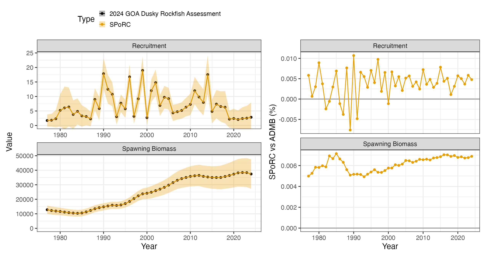
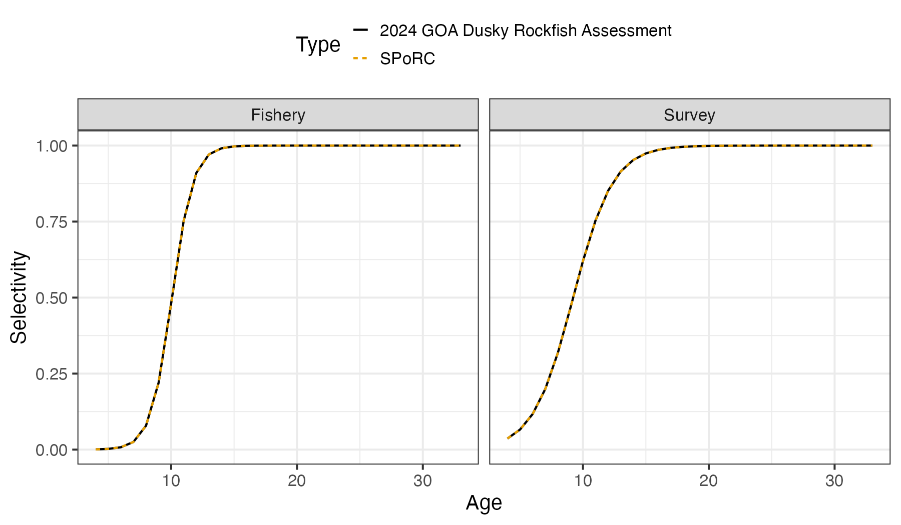

# Case Study: Gulf of Alaska Dusky Rockfish

## Overview

This case study reproduces the 2024 Gulf of Alaska dusky rockfish
assessment in `SPoRC`. Every structural choice below follows the
assessment rather than `SPoRC`’s defaults, and the two fits agree to a
median of $`6\times10^{-3}`$ percent in spawning biomass.

The model is single region, single sex, single season, with one fishery
fleet and one survey:

| Source                      | Years     | Observations | Likelihood          |
|-----------------------------|-----------|--------------|---------------------|
| Catch                       | 1977–2024 | 48           | Lognormal, weighted |
| Bottom trawl survey biomass | 1990–2023 | 16           | Lognormal           |
| Fishery age compositions    | 2000–2022 | 15           | Multinomial         |
| Fishery length compositions | 1991–2023 | 18           | Multinomial         |
| Survey age compositions     | 1990–2023 | 16           | Multinomial         |

Model ages run 4 to 33 with a plus group, and lengths 21 to 52 cm.

``` r

library(SPoRC)
library(dplyr)
library(ggplot2)
data("sgl_rg_dusky_data")

dat <- sgl_rg_dusky_data
yrs <- dat$years
n_yrs <- length(yrs)
```

## Model dimensions

Because the model is single region and single sex, the population,
region, season and sex subscripts used in the model equations all
collapse to one, and are dropped from the notation below.

``` r

input_list <- Setup_Mod_Dim(
  n_pop = dat$n_pop,
  natal_region = dat$natal_region,
  years = dat$years,
  ages = dat$mod_ages,
  lens = dat$lens,
  n_regions = dat$n_regions,
  n_sexes = dat$n_sexes,
  n_fish_fleets = dat$n_fish_fleets,
  n_srv_fleets = dat$n_srv_fleets,
  n_seas = dat$n_seas,
  verbose = FALSE,
  store_config = TRUE
)
```

## Recruitment

Recruitment is a mean with annual deviations rather than a stock recruit
function:

``` math
\text{Rec}_{y} = R_{0}\exp\left(\epsilon_{y}^{\text{Rec}}\right),\qquad \ell^{\text{Rec}} = \sum_{y}\dfrac{\left(\epsilon_{y}^{\text{Rec}}\right)^{2}}{2\sigma_{R}^{2}}
```

with $`\sigma_{R}`$ fixed at $`\exp(-0.1068576)`$, roughly $`0.899`$.
The bias ramp is switched on but every ramp year is set to the terminal
year, which leaves the ramp at zero over the whole series and so leaves
recruitment uncorrected. That combination is deliberate: it reads as the
assessment’s own convention rather than as `SPoRC`’s default, and it is
what `do_rec_bias_ramp = 1` with `bias_year` at the terminal year means.
Spawning occurs at the start of the year.

``` r

input_list <- Setup_Mod_Rec(
  input_list = input_list,
  do_rec_bias_ramp = 1,
  bias_year = rep(length(dat$years), 4),
  sigmaR_switch = 1,
  ln_sigmaR = array(-0.1068576, dim = c(2, input_list$data$n_pop, input_list$data$n_regions)),
  rec_model = "mean_rec",
  sigmaR_spec = "fix",
  init_age_strc = 1,
  ln_global_R0 = log(2.7),
  t_spawn = dat$spwn_month
)
```

## Biological dynamics

Natural mortality is fixed at $`0.07`$ for every age and year, so no
prior is needed. Length compositions are fit through a size at age
transition matrix, and age compositions pass through an ageing error
matrix.

``` r

input_list <- Setup_Mod_Biologicals(
  input_list = input_list,
  WAA = dat$waa_arr,
  MatAA = dat$mataa_arr,
  fit_lengths = 1,
  SizeAgeTrans = dat$sizeage,
  AgeingError = dat$age_error_matrix,
  M_spec = "fix",
  Fixed_natmort = dat$fix_natmort,
  addtocomp = 0.00001
)
```

## Movement and tagging

The model is single region, so movement is an identity matrix and no
tagging data are used. Both still have to be declared.

``` r

input_list <- Setup_Mod_Movement(
  input_list = input_list,
  use_fixed_movement = 1,
  Fixed_Movement = NA,
  do_recruits_move = 0
)

input_list <- Setup_Mod_Tagging(input_list = input_list, use_conv_fish_tagging = 0)
```

## Catch and fishing mortality

The assessment writes its catch and F statements as weighted sums of
squares. A weighted sum of squares and a normal likelihood with a fixed
standard deviation are the same statement up to a constant, related by
$`\sigma = 1/\sqrt{2w}`$. Here $`\sigma^{C}`$ and $`\sigma^{F}`$ are
both fixed at $`1/\sqrt{2}`$, which makes the quadratic term an
unweighted sum of squares, and the year specific catch weights are then
applied through `Wt_Catch` in the weighting section.

``` math
\ell^{\text{Catch}} = \sum_{y} w_{y}^{\text{Catch}}\left(\log C_{y}^{\text{obs}} - \log C_{y}^{\text{pred}}\right)^{2}
```

``` r

suppressWarnings(
  input_list <- Setup_Mod_Catch_and_F(
    input_list = input_list,
    ObsCatch = dat$ObsCatch,
    UseCatch = dat$UseCatch,
    Use_F_pen = 1,
    sigmaC_spec = "fix",
    ln_sigmaC = array(log(sqrt(1 / 2)), dim = c(input_list$data$n_regions,
                                                length(input_list$data$years),
                                                input_list$data$n_seas,
                                                input_list$data$n_fish_fleets)),
    ln_sigmaF = array(log(sqrt(1 / 2)), dim = c(input_list$data$n_regions,
                                                input_list$data$n_seas,
                                                input_list$data$n_fish_fleets))
  )
)
```

## Fishery compositions

There is no fishery index in this assessment, only compositions, so
`fish_idx_type` is `"none"`. Both age and length compositions are
aggregated over the region and fit multinomially.

``` r

input_list <- Setup_Mod_FishIdx_and_Comps(
  input_list = input_list,
  ObsFishIdx = dat$ObsFishIdx,
  ObsFishIdx_SE = dat$ObsFishIdx_SE,
  UseFishIdx = dat$UseFishIdx,
  ObsFishAgeComps = dat$ObsFishAgeComps,
  UseFishAgeComps = dat$UseFishAgeComps,
  ISS_FishAgeComps = dat$ISS_FishAgeComps,
  ObsFishLenComps = dat$ObsFishLenComps,
  UseFishLenComps = dat$UseFishLenComps,
  ISS_FishLenComps = dat$ISS_FishLenComps,
  fish_idx_type = c("none"),
  FishAgeComps_LikeType = c("Multinomial"),
  FishLenComps_LikeType = c("Multinomial"),
  FishAgeComps_Type = c("agg_Year_1-terminal_Fleet_1"),
  FishLenComps_Type = c("agg_Year_1-terminal_Fleet_1")
)
```

## Survey index and compositions

The survey index is lognormal, so its standard error has to be on the
log scale. The assessment reports an arithmetic standard error, and the
conversion is the coefficient of variation, which for a lognormal is the
log scale standard deviation to first order. That is the only
transformation applied to the survey data.

``` r

input_list <- Setup_Mod_SrvIdx_and_Comps(
  input_list = input_list,
  ObsSrvIdx = dat$ObsSrvIdx,
  # the assessment reports an arithmetic SE, so it is divided by the index
  ObsSrvIdx_SE = dat$ObsSrvIdx_SE / dat$ObsSrvIdx,
  UseSrvIdx = dat$UseSrvIdx,
  ObsSrvAgeComps = dat$ObsSrvAgeComps,
  ISS_SrvAgeComps = dat$ISS_SrvAgeComps,
  UseSrvAgeComps = dat$UseSrvAgeComps,
  ObsSrvLenComps = dat$ObsSrvLenComps,
  UseSrvLenComps = dat$UseSrvLenComps,
  ISS_SrvLenComps = dat$ISS_SrvLenComps,
  srv_idx_type = c("biom"),
  SrvAgeComps_LikeType = c("Multinomial"),
  SrvLenComps_LikeType = c("Multinomial"),
  SrvAgeComps_Type = c("agg_Year_1-terminal_Fleet_1"),
  SrvLenComps_Type = c("agg_Year_1-terminal_Fleet_1")
)
```

## Fishery selectivity and catchability

Both fleets use the $`a_{50}`$ and $`a_{95}`$ parameterization of the
logistic, which is `logist2`:

``` math
\text{Sel}_{a} = \dfrac{1}{1 + 19^{\left(a_{50} - a\right)/a_{95}}}
```

Selectivity is time invariant, so there are no deviations and no process
error. Fishery catchability is not used, because there is no fishery
index to scale.

``` r

input_list <- Setup_Mod_Fishsel_and_Q(
  input_list = input_list,
  cont_tv_fish_sel = c("none_Fleet_1"),
  fish_sel_blocks = c("none_Fleet_1"),
  fish_sel_model = c("logist2_Fleet_1"),
  fish_q_blocks = c("none_Fleet_1"),
  fish_fixed_sel_pars_spec = c("est_all"),
  fish_q_spec = c("fix")
)
```

## Survey selectivity and catchability

Survey selectivity takes the same logistic form. Catchability is
estimated under a lognormal prior centered on $`1`$ with a standard
deviation of $`1/\sqrt{5}`$:

``` math
\ell^{q} = \dfrac{\left(\log q - \log \mu_{q}\right)^{2}}{2\sigma_{q}^{2}}
```

``` r

srv_q_prior <- data.frame(
  region = 1,
  block = 1,
  fleet = 1,
  mu = 1,
  sd = 0.447213595
)

input_list <- Setup_Mod_Srvsel_and_Q(
  input_list = input_list,
  cont_tv_srv_sel = c("none_Fleet_1"),
  srv_sel_blocks = c("none_Fleet_1"),
  srv_sel_model = c("logist2_Fleet_1"),
  srv_q_blocks = c("none_Fleet_1"),
  srv_fixed_sel_pars_spec = c("est_all"),
  srv_q_spec = c("est_all"),
  Use_srv_q_prior = 1,
  srv_q_prior = srv_q_prior,
  t_srv = array(0, dim = c(input_list$data$n_regions,
                           input_list$data$n_seas,
                           input_list$data$n_srv_fleets))
)
```

## Weighting

The assessment down weights the early catch series, which was
reconstructed, relative to the observer era: a weight of $`2`$ through
1991 and $`50`$ after. The survey index has $`1.66`$ and the F penalty
$`2`$. Survey length compositions are present in the data object but are
given a weight of zero, which is how the assessment treats them.

``` r

Wt_Catch <- array(0, dim = c(dat$n_regions, length(dat$years), dat$n_seas, dat$n_fish_fleets))
Wt_Catch[, which(dat$years %in% 1977:1991), 1, ] <- 2
Wt_Catch[, -which(dat$years %in% 1977:1991), 1, ] <- 50

comp_dim <- c(input_list$data$n_regions,
              length(input_list$data$years),
              input_list$data$n_seas,
              input_list$data$n_sexes,
              input_list$data$n_fish_fleets)

srv_comp_dim <- c(input_list$data$n_regions,
                  length(input_list$data$years),
                  input_list$data$n_seas,
                  input_list$data$n_sexes,
                  input_list$data$n_srv_fleets)

input_list <- Setup_Mod_Weighting(
  input_list = input_list,
  Wt_Catch = Wt_Catch,
  Wt_FishIdx = 1,
  Wt_SrvIdx = 1.66,
  Wt_Rec = 1,
  Wt_F = 2,
  Wt_Tagging = 0,
  Wt_FishAgeComps = array(1, dim = comp_dim),
  Wt_FishLenComps = array(1, dim = comp_dim),
  Wt_SrvAgeComps = array(1, dim = srv_comp_dim),
  Wt_SrvLenComps = array(0, dim = srv_comp_dim)
)
```

## Fitting and comparison

``` r

est <- fit_model(input_list$data, input_list$par, input_list$map,
                 random = NULL, newton_loops = 3, silent = TRUE)
est$sdrep <- RTMB::sdreport(est)
```

    free parameters: 131
    final jnLL: 1425.732   max |gradient|: 5.8e-13
    pdHess: TRUE

The assessment’s own quantities are read from its report file, which is
a flat label then numbers dump, so each quantity is pulled by its label
rather than by line number. The figure script holds the reader; the
fields used here are spawning biomass, numbers at age, fully selected F
and the two selectivity curves.

Five quantities are compared, and all five agree to better than
$`0.014`$ percent at their worst year:

| Quantity            | Median difference | Maximum difference |
|---------------------|-------------------|--------------------|
| Spawning biomass    | 0.0063 %          | 0.0071 %           |
| Recruitment         | 0.0046 %          | 0.0107 %           |
| Fishing mortality   | 0.0083 %          | 0.0099 %           |
| Fishery selectivity | 0.00002 %         | 0.0119 %           |
| Survey selectivity  | 0.0002 %          | 0.0135 %           |



Selectivity is time invariant in both fleets, so a single curve per gear
has everything.


