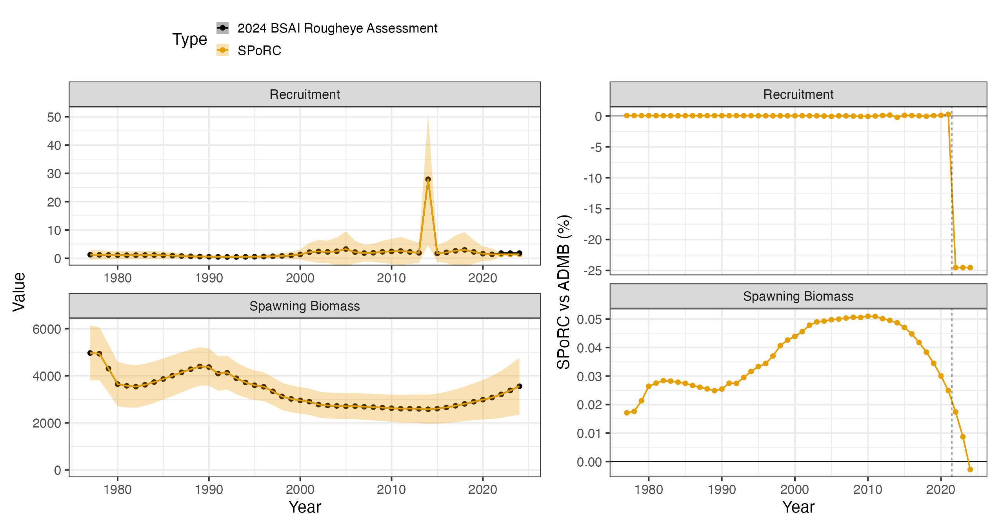
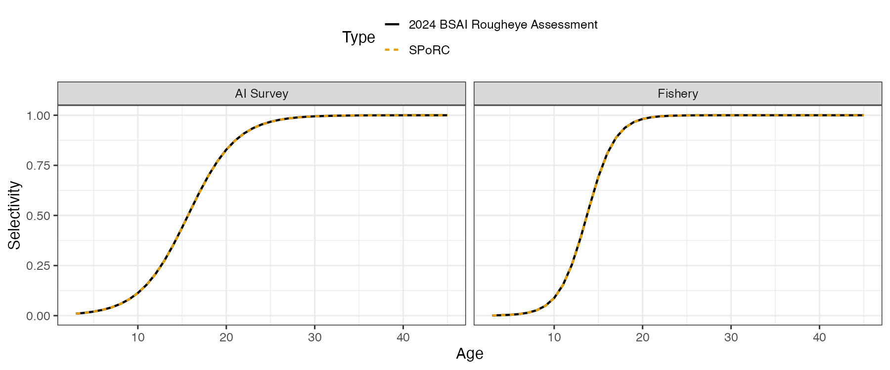

# Case Study: Bering Sea and Aleutian Islands Blackspotted and Rougheye Rockfish

## Overview

This case study reproduces the 2024 Bering Sea and Aleutian Islands
blackspotted and rougheye rockfish assessment in `SPoRC`. Every
structural choice below follows the assessment rather than `SPoRC`’s
defaults.

The model is single region, single sex, single season, with one fishery
fleet and one survey:

| Source                          | Years     | Observations | Likelihood          |
|---------------------------------|-----------|--------------|---------------------|
| Catch                           | 1977–2024 | 48           | Lognormal, weighted |
| Aleutian Islands survey biomass | 1991–2024 | 14           | Lognormal           |
| Fishery age compositions        | 2004–2023 | 13           | Multinomial         |
| Fishery length compositions     | 1979–2022 | 11           | Multinomial         |
| Survey age compositions         | 1991–2022 | 13           | Multinomial         |
| Survey length compositions      | 2024      | 1            | Multinomial         |

Model ages run 3 to 54 with a plus group, while the assessment reports
over observed ages 3 to 45 with its last column pooling the model’s ages
45 to 54. Lengths run 12 to 50 cm.

``` r

library(SPoRC)
library(dplyr)
library(ggplot2)
data("sgl_rg_rebs_data")

dat <- sgl_rg_rebs_data
yrs <- dat$years
n_yrs <- length(yrs)
n_ages <- length(dat$ages)
n_obs_ages <- length(dat$obs_ages)
```

## Model dimensions

Because the model is single region and single sex, the population,
region, season and sex subscripts used in the model equations all
collapse to one, and are dropped from the notation below.

``` r

input_list <- Setup_Mod_Dim(
  n_pop = dat$n_pop,
  years = yrs,
  ages = dat$ages,
  lens = dat$lens,
  n_regions = dat$n_regions,
  n_sexes = dat$n_sexes,
  n_fish_fleets = dat$n_fish_fleets,
  n_srv_fleets = dat$n_srv_fleets,
  n_seas = dat$n_seas,
  verbose = FALSE
)
```

## Recruitment and the initial age structure

Recruitment is a mean with annual deviations rather than a stock recruit
function, and the last three years take the mean outright:

``` math
\text{Rec}_{y} = R_{0}\exp\left(\epsilon_{y}^{\text{Rec}}\right),\qquad \epsilon_{y}^{\text{Rec}} \equiv 0 \text{ for the last three years}
```

The initial age structure is where this assessment differs most from a
`SPoRC` default. Its `fyear_ac_option 3` gives the first year its own
scalar, independent of the recruitment level, with deviations that ages
beyond the observed range share:

``` math
N_{1,a} = \exp\left(\log R^{\text{init}} - M(a-1) + \phi_{a}\right)
```

`use_rinit = 1` is what creates that separate scalar, and
`equil_init_age_strc = "stoch_shared_ages"` with an explicit
`init_age_devs_shared` vector is what makes the ages past the observed
range share the last deviation. Here the observed range runs to age 45,
so the deviations are free over the first 42 ages and the final nine
share the 42nd. `SPoRC` carries the initial numbers as multiplicative
deviations from an equilibrium age structure rather than as the
structure itself, so the seeding step below converts between the two.

``` r

input_list <- Setup_Mod_Rec(
  input_list = input_list,
  rec_model = "mean_rec",
  do_rec_bias_ramp = 1,
  bias_year = rep(n_yrs, 4),
  sigmaR_switch = 1,
  ln_sigmaR = array(log(dat$sigmaR), dim = c(2, dat$n_pop, dat$n_regions)),
  equil_init_age_strc = "stoch_shared_ages",
  init_age_devs_shared = c(1:42, rep(42, 9)),
  dont_est_recdev_last = 3,
  sigmaR_spec = "fix",
  init_age_strc = 1,
  t_spawn = (3 - 1) / 12,
  use_rinit = 1
)
```

## Biological dynamics

Natural mortality is estimated under a lognormal prior. The assessment
states its prior as a mean of $`0.045`$ on the natural scale, so the
median supplied to `SPoRC` is shifted by $`\exp(-\text{CV}^{2}/2)`$ to
put the prior mean where the assessment puts it:

``` math
\ell^{M} = \dfrac{\left(\log M - \log\left[\mu_{M}e^{-\text{CV}_{M}^{2}/2}\right]\right)^{2}}{2\,\text{CV}_{M}^{2}}
```

``` r

input_list <- Setup_Mod_Biologicals(
  input_list = input_list,
  WAA = dat$WAA,
  MatAA = dat$MatAA,
  fit_lengths = 1,
  SizeAgeTrans = dat$SizeAgeTrans,
  AgeingError = dat$AgeingError,
  M_spec = "est_ln_M",
  Use_M_prior = 1,
  M_prior = data.frame(popblk = 1, regionblk = 1, yearblk = 1, ageblk = 1, sexblk = 1,
                       mu = dat$mean_M * exp(-dat$cv_M^2 / 2), sd = dat$cv_M),
  addtosrvidx = 1e-13,
  addtocomp = 1e-13
)
```

## Movement and tagging

The model is single region, so movement is an identity matrix and no
tagging data are used. Both still have to be declared.

``` r

input_list <- Setup_Mod_Movement(input_list = input_list, use_fixed_movement = 1,
                                 Fixed_Movement = NA, do_recruits_move = 0)

input_list <- Setup_Mod_Tagging(input_list = input_list, use_conv_fish_tagging = 0)
```

## Catch and fishing mortality

The assessment writes its catch and F statements as weighted sums of
squares with weights $`50`$ and $`0.1`$. A weighted sum of squares and a
normal likelihood with a fixed standard deviation are the same statement
up to a constant, related by $`\sigma = 1/\sqrt{2w}`$, so both weights
are carried inside the standard deviations rather than applied outside
the sums.

``` r

suppressWarnings(
  input_list <- Setup_Mod_Catch_and_F(
    input_list = input_list,
    ObsCatch = dat$ObsCatch,
    UseCatch = dat$UseCatch,
    Use_F_pen = 1,
    sigmaC_spec = "fix",
    ln_sigmaC = array(log(sqrt(1 / (2 * 50))),
                      dim = c(dat$n_regions, n_yrs, dat$n_seas, dat$n_fish_fleets)),
    ln_sigmaF = array(log(sqrt(1 / (2 * 0.1))),
                      dim = c(dat$n_regions, dat$n_seas, dat$n_fish_fleets))
  )
)
```

## Fishery compositions

There is no fishery index in this assessment, only compositions, so
`fish_idx_type` is `"none"` and the index arrays are declared empty.

``` r

input_list <- Setup_Mod_FishIdx_and_Comps(
  input_list = input_list,
  ObsFishIdx = array(NA, dim = c(dat$n_regions, n_yrs, dat$n_seas, dat$n_fish_fleets)),
  ObsFishIdx_SE = array(NA, dim = c(dat$n_regions, n_yrs, dat$n_seas, dat$n_fish_fleets)),
  UseFishIdx = array(0, dim = c(dat$n_regions, n_yrs, dat$n_seas, dat$n_fish_fleets)),
  ObsFishAgeComps = dat$ObsFishAgeComps,
  UseFishAgeComps = dat$UseFishAgeComps,
  ISS_FishAgeComps = dat$ISS_FishAgeComps,
  ObsFishLenComps = dat$ObsFishLenComps,
  UseFishLenComps = dat$UseFishLenComps,
  ISS_FishLenComps = dat$ISS_FishLenComps,
  fish_idx_type = "none",
  FishAgeComps_LikeType = "Multinomial",
  FishLenComps_LikeType = "Multinomial",
  FishAgeComps_Type = "agg_Year_1-terminal_Fleet_1",
  FishLenComps_Type = "agg_Year_1-terminal_Fleet_1"
)
```

## Survey index and compositions

The Aleutian Islands bottom trawl survey supplies a biomass index, age
compositions, and a single year of length compositions. The index is
lognormal with year specific standard errors, and the survey is fit at
mid year.

``` r

input_list <- Setup_Mod_SrvIdx_and_Comps(
  input_list = input_list,
  ObsSrvIdx = dat$ObsSrvIdx,
  ObsSrvIdx_SE = dat$ObsSrvIdx_SE,
  UseSrvIdx = dat$UseSrvIdx,
  ObsSrvAgeComps = dat$ObsSrvAgeComps,
  ISS_SrvAgeComps = dat$ISS_SrvAgeComps,
  UseSrvAgeComps = dat$UseSrvAgeComps,
  ObsSrvLenComps = dat$ObsSrvLenComps,
  UseSrvLenComps = dat$UseSrvLenComps,
  ISS_SrvLenComps = dat$ISS_SrvLenComps,
  srv_idx_type = "biom",
  SrvAgeComps_LikeType = "Multinomial",
  SrvLenComps_LikeType = "Multinomial",
  SrvAgeComps_Type = "agg_Year_1-terminal_Fleet_1",
  SrvLenComps_Type = "agg_Year_1-terminal_Fleet_1"
)
```

## Fishery selectivity and catchability

Both fleets use the slope and $`a_{50}`$ parameterisation of the
logistic, which is `logist1`:

``` math
\text{Sel}_{a} = \dfrac{1}{1 + \exp\left[-k\left(a - a_{50}\right)\right]}
```

Selectivity is time invariant, so there are no deviations and no process
error. Fishery catchability is not used, because there is no fishery
index to scale.

``` r

input_list <- Setup_Mod_Fishsel_and_Q(
  input_list = input_list,
  cont_tv_fish_sel = "none_Fleet_1",
  fish_sel_blocks = "none_Fleet_1",
  fish_sel_model = "logist1_Fleet_1",
  fish_q_blocks = "none_Fleet_1",
  fish_fixed_sel_pars_spec = "est_all",
  fish_q_spec = "fix"
)
```

## Survey selectivity and catchability

Survey selectivity takes the same logistic form. Catchability is
estimated under a lognormal prior centred on $`1`$ with a coefficient of
variation of $`0.05`$, with the same $`\exp(-\text{CV}^{2}/2)`$ shift
applied to the median so the prior mean lands where the assessment puts
it.

``` r

input_list <- Setup_Mod_Srvsel_and_Q(
  input_list = input_list,
  cont_tv_srv_sel = "none_Fleet_1",
  srv_sel_blocks = "none_Fleet_1",
  srv_sel_model = "logist1_Fleet_1",
  srv_q_blocks = "none_Fleet_1",
  srv_fixed_sel_pars_spec = "est_all",
  srv_q_spec = "est_all",
  Use_srv_q_prior = 1,
  srv_q_prior = data.frame(region = 1, block = 1, fleet = 1,
                           mu = dat$mean_q * exp(-dat$cv_q^2 / 2), sd = dat$cv_q),
  t_srv = array(0.5, dim = c(dat$n_regions, dat$n_seas, dat$n_srv_fleets))
)
```

## Weighting

The catch and F weights are already inside their standard deviations, so
the only weights left are the composition multipliers, which are the
assessment’s stage 2 values and ship in the data object.

``` r

input_list <- Setup_Mod_Weighting(
  input_list = input_list,
  Wt_Catch = 1, Wt_FishIdx = 1, Wt_SrvIdx = 1,
  Wt_Rec = 1, Wt_F = 1, Wt_Tagging = 0,
  Wt_FishAgeComps = dat$Wt_FishAgeComps,
  Wt_FishLenComps = dat$Wt_FishLenComps,
  Wt_SrvAgeComps = dat$Wt_SrvAgeComps,
  Wt_SrvLenComps = dat$Wt_SrvLenComps
)
```

## Starting at the ADMB estimate

Before optimizing anything, it is worth checking that the model is
reproduced *at a known point*. Setting every parameter to the
assessment’s maximum likelihood estimate and evaluating there separates
a specification error from an optimization difference: if the population
and the likelihood agree at the ADMB solution, the two models are the
same model.

Most parameters can be assigned directly. The recruitment deviations are
seeded only over the years the assessment estimates them for, and the
initial age structure needs the conversion described above: the
assessment writes the first year directly, while `SPoRC` carries
multiplicative deviations from an equilibrium age structure, so the
deviations are the log ratio of the two.

``` r

mle <- dat$mle

input_list$par$ln_global_R0[] <- mle$mean_log_rec
input_list$par$ln_rinit <- mle$log_rinit
input_list$par$ln_M[] <- log(mle$M)
input_list$par$ln_srv_q[] <- log(mle$q_srv)
input_list$par$ln_F_mean[] <- mle$log_avg_fmort
input_list$par$ln_F_devs[1, , 1, 1] <- mle$fmort_dev
input_list$par$fish_fixed_sel_pars[] <- log(c(mle$sel_a50_fish, mle$sel_aslope_fish))
input_list$par$srv_fixed_sel_pars[] <- log(c(mle$sel_a50_srv, mle$sel_aslope_srv))
input_list$par$ln_RecDevs[1, 1, 1:length(mle$rec_dev)] <- mle$rec_dev

# The assessment's initial numbers at age against SPoRC's equilibrium reference.
NAA_equil <- exp(mle$log_rinit) * exp(-(0:(n_ages - 1)) * mle$M)
NAA_equil[n_ages] <- NAA_equil[n_ages - 1] * exp(-mle$M) / (1 - exp(-mle$M))
NAA_styr <- NAA_equil
for(j in 2:n_obs_ages) {
  NAA_styr[j] <- exp(mle$log_rinit - mle$M * (j - 1) + mle$fydev[j - 1])
} # end j loop
for(j in (n_obs_ages + 1):n_ages) {
  NAA_styr[j] <- exp(mle$log_rinit - mle$M * (j - 1) + mle$fydev[length(mle$fydev)])
} # end j loop
NAA_styr[n_ages] <- exp(mle$log_rinit - mle$M * (n_ages - 1) +
                          mle$fydev[length(mle$fydev)]) / (1 - exp(-mle$M))
input_list$par$ln_InitDevs[1, 1, ] <- (log(NAA_styr) - log(NAA_equil))[-1]

obj <- fit_model(input_list$data, input_list$par, input_list$map,
                 do_optim = FALSE, silent = TRUE)
r <- obj$rep
```

At that point every reported quantity agrees with the ADMB model:

    fishery selectivity max pct diff: 4.3e-04
    survey selectivity  max pct diff: 4.2e-04
    numbers at age, 4+  max pct diff: 4.9e-04
    spawning biomass    max pct diff: 7.7e-03
    fishing mortality   max pct diff: 3.7e-04
    jnLL at the assessment MLE: 297.5081
    max |gradient| there      : 0.0864

The gradient at the seed point is small but not zero, which is what an
ADMB maximum likelihood estimate reported to six significant figures
looks like when it is read back in.

Recruitment splits into two windows. Over the years the assessment
estimates a deviation for, the two agree outright. Over the terminal
three years the assessment multiplies mean recruitment by
$`\exp(\sigma_{R}^{2}/2)`$ while leaving the estimated recruitments
uncorrected, so `SPoRC` sits exactly that factor low: the observed ratio
is $`0.754839`$ against $`\exp(-\sigma_{R}^{2}/2) = 0.7548396`$. This is
a convention difference and not an error. It moves terminal spawning
biomass by $`8\times10^{-5}`$ percent, because maturity at age 3 is
$`0.003`$.

## Fitting and comparison

``` r

est <- fit_model(input_list$data, input_list$par, input_list$map,
                 random = NULL, newton_loops = 3, silent = TRUE)
est$sdrep <- RTMB::sdreport(est)
```

    free parameters: 144
    final jnLL: 297.508   max |gradient|: 9.1e-13
    pdHess: TRUE

The optimised objective is the value the seed point already had, to four
decimal places, so the assessment’s maximum likelihood estimate is
`SPoRC`’s optimum as well.

| Quantity                     | Median difference | Maximum difference |
|------------------------------|-------------------|--------------------|
| Spawning biomass             | 0.034 %           | 0.051 %            |
| Recruitment, estimated years | 0.043 %           | 0.263 %            |
| Recruitment, terminal three  | 24.5 %            | 24.5 %             |

The last row is the bias correction convention described above, at its
exact expected size of $`1 - \exp(-\sigma_{R}^{2}/2)`$, and it is why
the dashed rule in the figure marks where the estimated deviations stop.



Selectivity is time invariant in both fleets, so a single curve per
fleet suffices.


