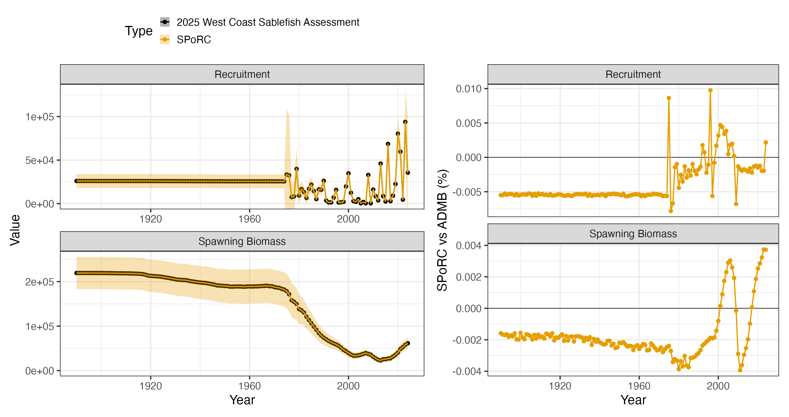
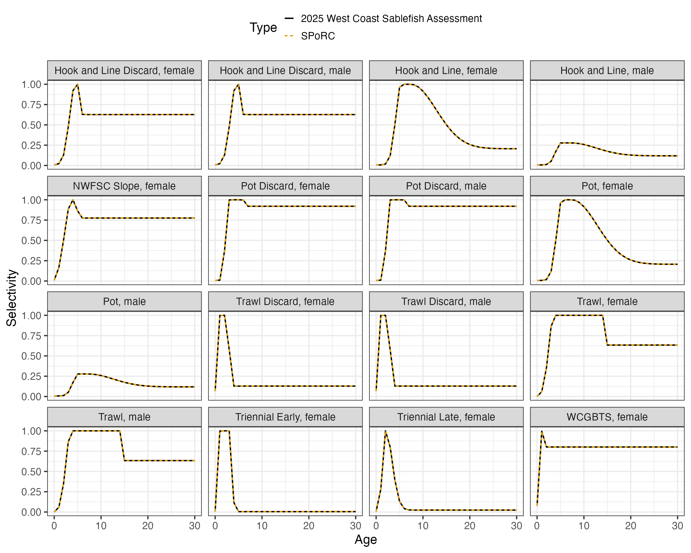

```{r, include = FALSE, eval = FALSE}
knitr::opts_chunk$set(
  collapse = TRUE,
  comment = "#>",
  eval = FALSE
)
```

## Overview

This case study reproduces the 2025 West Coast sablefish assessment, run in
Stock Synthesis 3, in `SPoRC`. 

The model is single region, two sex, single season, with six catch fleets, four
trawl surveys and an index built on the recruitment deviations themselves:

| Source | Years | Observations | Likelihood |
|---|---|---|---|
| Catch, three gears and their discard fleets | 1890--2024 | 620 | Lognormal, CV 0.01 |
| Triennial early and late, NWFSC slope, WCGBTS | 1980--2024 | 35 | Lognormal |
| Recruitment index | 2020--2024 | 5 | Normal on the deviation |
| Fishery age compositions, six fleets | 1983--2024 | 198 | Multinomial |
| Survey age compositions, four surveys | 1983--2024 | 52 | Multinomial |

Ages run $a = 0$ to $a_{+} = 70$ with compositions binned to $0$ to $50$, and
model years run $y_{1} = 1890$ to $y_{\text{end}} = 2024$. Recruitment is age 0
and comes off the same year's spawning biomass, on a Beverton-Holt curve with
steepness fixed at 0.75 and $\sigma_{R} = 1.4$.

```{r setup, warning = FALSE, message = FALSE, eval = FALSE}
library(SPoRC)
library(dplyr)
library(ggplot2)
data("sgl_rg_wc_sablefish_data")

dat <- sgl_rg_wc_sablefish_data
yrs <- dat$years
n_yrs <- length(yrs)
n_ages <- length(dat$ages)
n_fish <- dat$n_fish_fleets
n_srv <- dat$n_srv_fleets
```

### What Stock Synthesis says differently

Seven conventions carry the whole bridge, and each of them can easily forgotten if missed.
Age 0 fish spawn in the equilibrium year only. Spawning biomass is female
numbers times fecundity at age, formed before the year's recruits settle, so
the age 0 cell is empty in every year the model runs. The unfished equilibrium
is different: it already holds $R_{0}/2$ at age 0, and that is what
$SSB_{y_{1}}$ and $S_{0}$ are built from. Dropping those fish everywhere moves
$S_{0}$ by 0.009 percent, which the Beverton-Holt then carries into recent
recruitment. `SPoRC` forms the first year's spawning biomass from the initial
numbers and every later year's from the survivors, so a maturity at age 0 that
is the fecundity ratio in $y_{1}$ and zero afterwards is exact.

The recruitment deviation is not the deviation. Stock Synthesis generates
recruitment as

$$R_{y} = f(SSB_{y}) \cdot \exp\left(\varepsilon_{y} - \tfrac{1}{2}b_{y}\sigma_{R}^{2}\right)$$

with $b_{y}$ the bias ramp, so `SPoRC`'s deviation is the assessment's less the
bias term. The ramp's four breakpoints (1974, 1979, 2023, 2024) are given to
`bias_year` in deviation index space rather than as calendar years.

Fishing mortality is solved, not estimated. Under the hybrid method Stock
Synthesis conditions $F$ on the catch, while `SPoRC` estimates it against a
lognormal catch likelihood at the data file's CV of 0.01. The two agree to six
digits, which is as close as that likelihood's CV of 0.01 holds them.

Extra survey standard deviation is added, not combined in quadrature. For
each survey, $\sigma_{y} = \sigma_{y}^{\text{input}} + \sigma^{\text{extra}}$.
`SPoRC` currently has no parameter for it, so it is held at the assessment's estimate.

The recruitment index is a likelihood on the deviations. Fleet 11 is units
36, a normal likelihood on $\varepsilon_{y}$ itself rather than on abundance.
`SPoRC` carries this as `srv_idx_type = "recdev"`, a survey fleet that observes
year class strength directly and reads no part of the population.

Two fleets carry two composition streams. The trawl fishery and the West
Coast groundfish bottom trawl survey each have sexed and unsexed compositions
in the same years. `SPoRC` holds one composition type per fleet, so each gets a
second fleet sharing the first's selectivity: a fishery fleet companion with no catch
observation, and a survey fleet companion with no index.

## Model dimensions

Single region, single season and two sexes, so the population, region and
season subscripts collapse to one and are dropped throughout.

```{r, eval = FALSE}
input_list <- Setup_Mod_Dim(
  years = yrs,
  ages = dat$ages,
  lens = dat$lens,
  n_regions = dat$n_regions,
  n_sexes = dat$n_sexes,
  n_fish_fleets = n_fish,
  n_srv_fleets = n_srv,
  n_seas = dat$n_seas,
  n_pop = dat$n_pop,
  natal_region = dat$natal_region,
  verbose = FALSE
)
```

## Recruitment

Recruitment is age 0 off the same year's spawning biomass, which is
`rec_lag = 0`, on a Beverton-Holt curve at fixed steepness. The model starts
from an unfished equilibrium with no initial deviations and no initial fishing
mortality, so `InitDevs_spec = "fix"` and the initial age structure is the bare
geometric series.

```{r, eval = FALSE}
input_list <- Setup_Mod_Rec(
  input_list = input_list,
  rec_model = "bh_rec",
  rec_lag = 0,
  SR_ref_yr = 1,
  t_spawn = dat$t_spawn,
  h_spec = "fix",
  steepness_h = array(qlogis((dat$steepness - 0.2) / 0.8), dim = c(1, 1)),
  sigmaR_spec = "fix",
  ln_sigmaR = array(log(dat$sigmaR), dim = c(2, 1, 1)),
  sigmaR_switch = 1,
  do_rec_bias_ramp = 1,
  bias_year = dat$bias_year,
  max_bias_ramp_fct = dat$max_bias_adj,
  RecDevs_pen_center = "fixed",
  dont_est_recdev_last = 0,
  init_age_strc = 2,
  equil_init_age_strc = 0,
  InitDevs_spec = "fix",
  ln_global_R0 = dat$mle$ln_R0
)
```

Steepness is bounded on a logit over $(0.2, 1)$, so the fixed value goes in
transformed. `SR_ref_yr = 1` puts the unfished spawning biomass per recruit on
the first year's weight and fecundity at age, which is where the assessment
computes $S_{0}$.

`bias_year` is the one argument here that is easy to get wrong. It is indexed
in deviation space, not in calendar years, and the assessment's four
breakpoints are the `last_early_yr_nobias_adj`, `first_yr_fullbias_adj`,
`last_yr_fullbias_adj` and `first_recent_yr_nobias_adj` of its control file.
The bridge stage below checks the resulting ramp against the assessment's own
`biasadjuster` column, which is the cheapest way to know it went in right.

## Biological dynamics

Weight at age and fecundity at age are empirical and year specific, read from
the assessment's `wtatage.ss`. Maturity is the ratio of the two, so spawning
biomass is numbers times fecundity, with the age 0 cell carrying its value in
the equilibrium year alone.

```{r, eval = FALSE}
input_list <- Setup_Mod_Biologicals(
  input_list = input_list,
  WAA = dat$WAA,
  WAA_fish = array(dat$WAA, dim = c(dim(dat$WAA), n_fish)),
  WAA_srv = array(dat$WAA, dim = c(dim(dat$WAA), n_srv)),
  MatAA = dat$MatAA,
  fit_lengths = 0,
  AgeingError = dat$AgeingError,
  M_spec = "est_ln_M",
  Use_M_prior = 1,
  M_prior = dat$M_prior,
  addtocomp = dat$addtocomp,
  comp_const_obs = 1,
  addtosrvidx = 0,
  addtofishidx = 0
)

# the age 0 fish are spawners in the equilibrium year only, and setup refuses a
# non-zero maturity at the recruit age under rec_lag = 0
input_list$data$MatAA[1, 1, 1, 1, 1, 1] <- dat$mat_age0_yr1
```

Natural mortality is one value for both sexes, the assessment's male parameter
being set equal to the female's, under a lognormal prior with median
$e^{-2.631}$ and standard deviation 0.31 on the log scale.

The ageing error matrix maps the 71 modelled ages onto the 51 composition bins,
the last of which accumulates. The assessment prints it with the observed bins
descending, so it is transposed on the way in.

## Movement and tagging

Neither is used.

```{r, eval = FALSE}
input_list <- Setup_Mod_Movement(input_list = input_list, use_fixed_movement = 1,
                                 Fixed_Movement = NA, do_recruits_move = 0)

input_list <- Setup_Mod_Tagging(input_list = input_list, use_conv_fish_tagging = 0)
```

## Catch and fishing mortality

```{r, eval = FALSE}
input_list <- Setup_Mod_Catch_and_F(
  input_list = input_list,
  ObsCatch = dat$ObsCatch,
  UseCatch = dat$UseCatch,
  Use_F_pen = 0,
  ln_F_mean_spec = "fix",
  sigmaC_spec = "fix",
  ln_sigmaC = array(log(dat$sigmaC), dim = c(1, n_yrs, 1, n_fish))
)
```

The assessment has no fishing mortality penalty and no mean fishing mortality
parameter, so `Use_F_pen = 0` and `ln_F_mean_spec = "fix"` leave the deviations
carrying all of $\log F$. Fixing the mean matters: with the deviations
unpenalized the mean and their average are exactly redundant, and fixing one
of them is what keeps that ridge from going off the rails.

Years before a fleet's first landing are true fishery closures, entered as a zero catch
with `UseCatch = 0`, which forces $F$ to zero and drops the deviation. The
trawl fleet's composition companion is different: it has no catch observation at
all, entered as `NA`, which leaves its fishing mortality estimated. Seeded at
$10^{-12}$ it takes nothing out of the population, so its catch at age is the
trawl fleet's numbers at age scaled by the same selectivity, which is what
makes its compositions the right expectation. This is needed because one fleet can't carry two sets of composition data.

## Fishery compositions

```{r, eval = FALSE}
input_list <- Setup_Mod_FishIdx_and_Comps(
  input_list = input_list,
  ObsFishIdx = array(NA_real_, dim = c(1, n_yrs, 1, n_fish)),
  ObsFishIdx_SE = array(NA_real_, dim = c(1, n_yrs, 1, n_fish)),
  UseFishIdx = array(0, dim = c(1, n_yrs, 1, n_fish)),
  fish_idx_type = rep("none", n_fish),
  FishIdx_LikeType = rep("lognormal", n_fish),
  ObsFishAgeComps = dat$ObsFishAgeComps,
  UseFishAgeComps = dat$UseFishAgeComps,
  ISS_FishAgeComps = dat$ISS_FishAgeComps,
  ObsFishLenComps = array(NA_real_, dim = c(1, n_yrs, 1, 1, dat$n_sexes, n_fish)),
  UseFishLenComps = array(0, dim = c(1, n_yrs, 1, n_fish)),
  ISS_FishLenComps = array(0, dim = c(1, n_yrs, 1, dat$n_sexes, n_fish)),
  FishAgeComps_LikeType = rep("Multinomial", n_fish),
  FishLenComps_LikeType = rep("none", n_fish),
  FishAgeComps_Type = paste0(ifelse(dat$fish_sex == 3, "spltRjntS", "agg"),
                             "_Year_1-terminal_Fleet_", seq_len(n_fish)),
  FishLenComps_Type = paste0("none_Year_1-terminal_Fleet_", seq_len(n_fish))
)
```

`FishAgeComps_Type` is where the two composition streams show up. The three
gear fleets carry sexed compositions, which is `spltRjntS`, females and males
in one vector normalized together. The three discard fleets and the trawl companion
carry compositions with the sexes pooled, which is `agg`.

The sample sizes were built as

$$\text{ISS}_{y} = N_{y} \cdot \nu_{f} \big/ \left(1 + n_{\text{bins}} \cdot 0.001\right)$$

with $\nu_{f}$ the assessment's variance adjustment for that fleet, which run
from 0.005 to 0.97 here, and $n_{\text{bins}}$ 102 for a sexed composition and
51 for a pooled one.

## Survey indices and compositions

```{r, eval = FALSE}
t_srv <- array(dat$t_srv, dim = c(1, 1, n_srv))

input_list <- Setup_Mod_SrvIdx_and_Comps(
  input_list = input_list,
  ObsSrvIdx = dat$ObsSrvIdx,
  ObsSrvIdx_SE = dat$ObsSrvIdx_SE,
  UseSrvIdx = dat$UseSrvIdx,
  srv_idx_type = c(rep("biom", n_srv - 1), "none"),
  SrvIdx_LikeType = rep("lognormal", n_srv),
  ObsSrvAgeComps = dat$ObsSrvAgeComps,
  UseSrvAgeComps = dat$UseSrvAgeComps,
  ISS_SrvAgeComps = dat$ISS_SrvAgeComps,
  ObsSrvLenComps = array(NA_real_, dim = c(1, n_yrs, 1, 1, dat$n_sexes, n_srv)),
  UseSrvLenComps = array(0, dim = c(1, n_yrs, 1, n_srv)),
  ISS_SrvLenComps = array(0, dim = c(1, n_yrs, 1, dat$n_sexes, n_srv)),
  SrvAgeComps_LikeType = rep("Multinomial", n_srv),
  SrvLenComps_LikeType = rep("none", n_srv),
  SrvAgeComps_Type = paste0(ifelse(dat$srv_sex == 3, "spltRjntS", "agg"),
                            "_Year_1-terminal_Fleet_", seq_len(n_srv)),
  SrvLenComps_Type = paste0("none_Year_1-terminal_Fleet_", seq_len(n_srv)),
  t_srv = t_srv
)
```

All four surveys are in month 7, so `t_srv = 0.5` and the index is formed from
numbers decayed half a year. The standard errors already carry the extra
standard deviation added to them.

## Selectivity

Every fleet is on the age based double normal, `dbnrml`, six parameters
controlling the start of the plateau, its end, the ascending and descending
widths, and the selectivity at the first and last bins. Three things about how
the assessment arranges them have to come across.

The trawl and hook and line fleets change in 2002 and the two trawl and hook
and line discard fleets in 2011 and 2019, which are time blocks. The pot fleet
mirrors hook and line outright, and each composition companion mirrors its parent,
which is `est_shared_f_x`. And the hook and line male curve is offsets on the
female's, with a fifth male parameter scaling the whole curve, which is
`fish_sel_sex_offset = "par_apical"`.

```{r, eval = FALSE}
# selectivity blocks are named by the years the assessment's surfaces change
blk_string <- function(blocks, fleet) {
  st <- blocks[[fleet]]$blk_yr
  en <- c(st[-1] - 1, n_yrs)
  paste0("Block_", seq_along(st), "_Year_", st, "-",
         ifelse(en == n_yrs, "terminal", en), "_Fleet_", fleet)
}

input_list <- Setup_Mod_Fishsel_and_Q(
  input_list = input_list,
  fish_sel_model = paste0("dbnrml_Fleet_", seq_len(n_fish)),
  cont_tv_fish_sel = paste0("none_Fleet_", seq_len(n_fish)),
  fish_sel_blocks = unlist(lapply(seq_len(n_fish), function(f) blk_string(dat$fish_sel_blocks_ss3, f))),
  fish_q_blocks = paste0("none_Fleet_", seq_len(n_fish)),
  fish_fixed_sel_pars_spec = replace(rep("est_all", n_fish), c(3, n_fish),
                                     c("est_shared_f_2", "est_shared_f_1")),
  fish_sel_sex_offset = replace(rep("par", n_fish), c(2, 3), "par_apical"),
  fish_q_spec = rep("fix", n_fish)
)

input_list <- Setup_Mod_Srvsel_and_Q(
  input_list = input_list,
  srv_sel_model = paste0("dbnrml_Fleet_", seq_len(n_srv)),
  cont_tv_srv_sel = paste0("none_Fleet_", seq_len(n_srv)),
  srv_sel_blocks = unlist(lapply(seq_len(n_srv), function(sf) blk_string(dat$srv_sel_blocks_ss3, sf))),
  srv_q_blocks = paste0("none_Fleet_", seq_len(n_srv)),
  srv_fixed_sel_pars_spec = replace(rep("est_all", n_srv), n_srv,
                                    paste0("est_shared_f_", n_srv - 1)),
  srv_sel_sex_offset = rep("par", n_srv),
  srv_q_spec = c(rep("est_all", n_srv - 1), "fix"),
  t_srv = t_srv
)
```

Catchability floats in the assessment, meaning it is solved rather than
estimated, which reaches the same optimum as estimating it. The composition
companion of the bottom trawl survey carries no index, so its catchability stays out
of the parameter vector.

All six parameters are on the same scale in both, so the assessment's values go
straight in as starting values, and the parameter count comes out at the
assessment's own 32.

`fish_sel_sex_offset = "par_apical"` is what carries the male curve. The `par`
half makes the male slots offsets on the female's, which is how the assessment
writes the peak and the selectivity at the last bin. The `apical` half is the
assessment's fifth male parameter: the height the male ascending and descending
limbs are built up to and the plateau sits at, with the two ends left where
their own parameters put them. That is a different statement from a `"scale"`
offset, which multiplies the finished curve and carries the ends along with it,
and the difference is not cosmetic: the two agree on the curve at any one point
but disagree about how it moves, so under a scale offset the assessment's
estimate is not a stationary point and the fit walks away from it. The male
ascending and descending widths take no offset and the selectivity at the male
first bin is read from the female's parameter, exactly as the assessment does,
so those three offsets are zero.

## Weighting

```{r, eval = FALSE}
input_list <- Setup_Mod_Weighting(
  input_list = input_list,
  Wt_Catch = 1, Wt_FishIdx = 0, Wt_SrvIdx = 1, Wt_Rec = 1, Wt_F = 1, Wt_Tagging = 0,
  Wt_FishAgeComps = array(1, dim = c(1, n_yrs, 1, dat$n_sexes, n_fish)),
  Wt_FishLenComps = array(1, dim = c(1, n_yrs, 1, dat$n_sexes, n_fish)),
  Wt_SrvAgeComps = array(1, dim = c(1, n_yrs, 1, dat$n_sexes, n_srv)),
  Wt_SrvLenComps = array(1, dim = c(1, n_yrs, 1, dat$n_sexes, n_srv))
)

data <- input_list$data
parameters <- input_list$par
mapping <- input_list$map
```

The assessment's composition weights are already in the sample sizes, so every
weight here is one.

## The recruitment index

The last survey fleet observes the recruitment deviations themselves rather
than any part of the population. That is `srv_idx_type = "recdev"`, set with
the other survey fleets above. Its predicted value is

$$\widehat{I}_{y} = q\left( \varepsilon_{y} - \mu_{y} \right)$$

with $\mu_{y}$ the centre the recruitment penalty asserts for that year. The
difference matters here: under a bias ramp `SPoRC`'s stored deviation and the
deviation the assessment reports differ by the bias correction, and it is the
anomaly, how strong the year class was against what the model expected, that
such an index measures. Taking it from the penalty's own centre is what makes
the two agree without any special casing.

Two things follow from the deviations being signed. The fleet takes
`SrvIdx_LikeType = "normal"`, since a lognormal cannot carry a negative
observation, and setup refuses any other choice for it. It also reads no
numbers at age, so its selectivity, survey timing and weight at age are never
used and its compositions are left off. Its catchability is an ordinary
element of `ln_srv_q`, carried on the log scale where the assessment carries
it on the natural scale.


## Starting at the assessment's estimate

Every parameter is set to the assessment's maximum likelihood estimate, read
from `ss3.par` at twelve significant digits rather than from the report file,
which prints six. The bridge helper does this in one call; the pieces are the
recruitment deviations less their bias correction, log fishing mortality as a
fixed mean plus deviations, the four catchabilities, natural mortality, and the
selectivity parameters in `SPoRC`'s transforms.

```{r, eval = FALSE}
source(system.file("tests", "testthat", "helper-bridge_wc_sablefish.R", package = "SPoRC"))

input_list <- seed_wc_sablefish_mle(build_wc_sablefish_input(dat), dat)
seed <- fit_model(input_list$data, input_list$par, input_list$map,
                  do_optim = FALSE, silent = TRUE)
```

The comparison before anything is optimized, against a report file carrying six
significant digits:

```
numbers at age                     5.8e-04 %
spawning biomass                   4.5e-04 %
recruitment                        3.9e-04 %
total biomass, January 1           5.1e-04 %
predicted catch                    4.9e-04 %
survey indices                     5.4e-04 %
bias ramp                          0        (absolute)
selectivity, all twelve fleets     5.0e-07  (absolute)
expected age compositions          6.5e-07  (absolute)
```

`SPoRC` writes each likelihood component as a proper density where the
assessment drops normalising constants, so the comparison subtracts exactly the
constants it omits:

| Component | `SPoRC` less constants | Assessment | Difference |
|---|---|---|---|
| Catch | 0.0000072 | 0.0000000 | $7.2\times10^{-6}$ |
| Triennial early index | -9.5934212 | -9.5934200 | $-1.2\times10^{-6}$ |
| Triennial late index | -4.8821916 | -4.8822100 | $1.8\times10^{-5}$ |
| NWFSC slope index | -4.6967965 | -4.6968000 | $3.5\times10^{-6}$ |
| WCGBTS index | -25.5881300 | -25.5880000 | $-1.3\times10^{-4}$ |
| Trawl ages | 262.1262400 | 262.1260000 | $2.4\times10^{-4}$ |
| Hook and line ages | 303.7876300 | 303.7880000 | $-3.7\times10^{-4}$ |
| Pot ages | 86.7638400 | 86.7638000 | $4.0\times10^{-5}$ |
| Trawl discard ages | 248.4356900 | 248.4360000 | $-3.1\times10^{-4}$ |
| Hook and line discard ages | 54.7879350 | 54.7879000 | $3.5\times10^{-5}$ |
| Pot discard ages | 65.7715190 | 65.7715000 | $1.9\times10^{-5}$ |
| Triennial early ages | 12.2708500 | 12.2709000 | $-5.0\times10^{-5}$ |
| Triennial late ages | 73.2284320 | 73.2284000 | $3.2\times10^{-5}$ |
| NWFSC slope ages | 35.3020090 | 35.3020000 | $8.7\times10^{-6}$ |
| WCGBTS ages | 199.0197000 | 199.0200000 | $-3.0\times10^{-4}$ |
| Recruitment deviations | 22.4041000 | 22.4041400 | $-3.9\times10^{-5}$ |
| Natural mortality prior | 0.2040659 | 0.2040690 | $-3.1\times10^{-6}$ |
| Recruitment index | 1.2484147 | 1.2484100 | $4.7\times10^{-6}$ |

The total comes to 1335.7715 against the assessment's 1335.7716, a difference
of $3.9\times10^{-5}$, which is the report file's own print precision.

## Fitting and comparison

```{r, eval = FALSE}
est <- fit_model(input_list$data, input_list$par, input_list$map,
                 do_optim = TRUE, newton_loops = 3, silent = TRUE)
est$sdrep <- RTMB::sdreport(est, hessian.fixed = est$he(est$optim$par))
```

709 parameters, 32 of them selectivity, which is the assessment's own count.
The objective falls from -879.4254 at the assessment's estimate to -879.4297, a
drop of 0.0043, and the fitted selectivity stays within
$1.5\times10^{-5}$ of the assessment's on every one of the twelve fleets.

| | Median | Maximum |
|---|---|---|
| Spawning biomass | -0.0020 % | 0.0039 % |
| Recruitment | -0.0054 % | 0.0098 % |

| | `SPoRC` | Assessment |
|---|---|---|
| $\ln R_{0}$ | 10.165054 | 10.165108 |
| Natural mortality | 0.0877750 | 0.0877770 |
| Triennial early catchability | 1.022891 | 1.022873 |
| Triennial late catchability | 2.770002 | 2.770076 |
| NWFSC slope catchability | 0.509775 | 0.509779 |
| WCGBTS catchability | 1.049713 | 1.049699 |
| Recruitment index catchability | 0.237148 | 0.237144 |




## Why the two differ

Everything in the population dynamics, the observation model and the
selectivity agrees at the assessment report's own print precision, and so does
every likelihood component. Refitting moves spawning biomass by four
thousandths of a percent.

Two things account for that much. The assessment solves fishing mortality from
the catch where `SPoRC` estimates it against a lognormal catch likelihood at
CV 0.01, so the two agree only to the precision that likelihood enforces; and
the extra survey standard deviation is held at the assessment's estimate,
because `SPoRC` has no parameter for it. Neither moves the fit, but the second
does mean the standard errors here do not carry that source of uncertainty.

Worth recording is what it took to get here, because it was not obvious from
the fit. Under a `"scale"` male offset every quantity above still matched at
the assessment's estimate to $5\times10^{-7}$, and the model still looked
bridged. What gave it away was the gradient: the male offset sat at 4.2 while
every other selectivity parameter was at 0.02, and the refit then walked to
0.42 percent in spawning biomass. A selectivity offset that reproduces a curve
is not the same as one that means what the assessment means by it, and only the
gradient distinguishes them.
