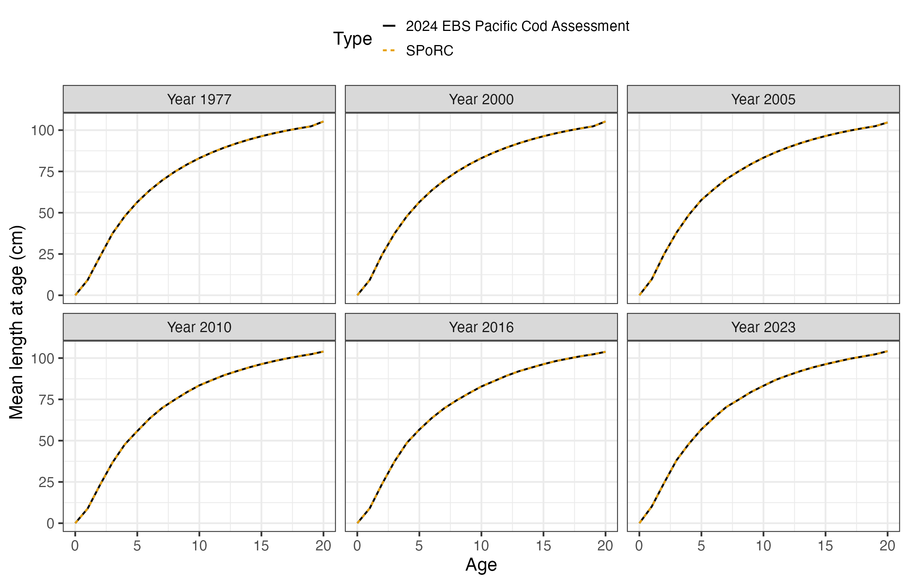
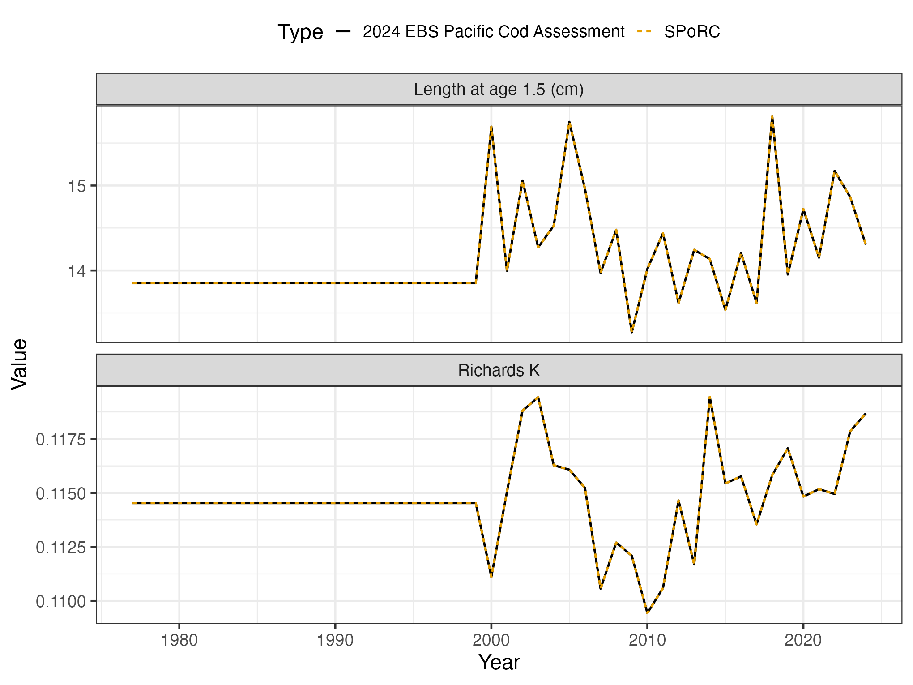
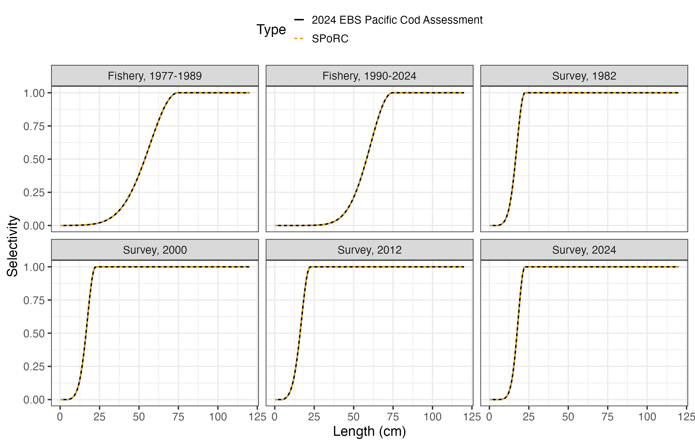
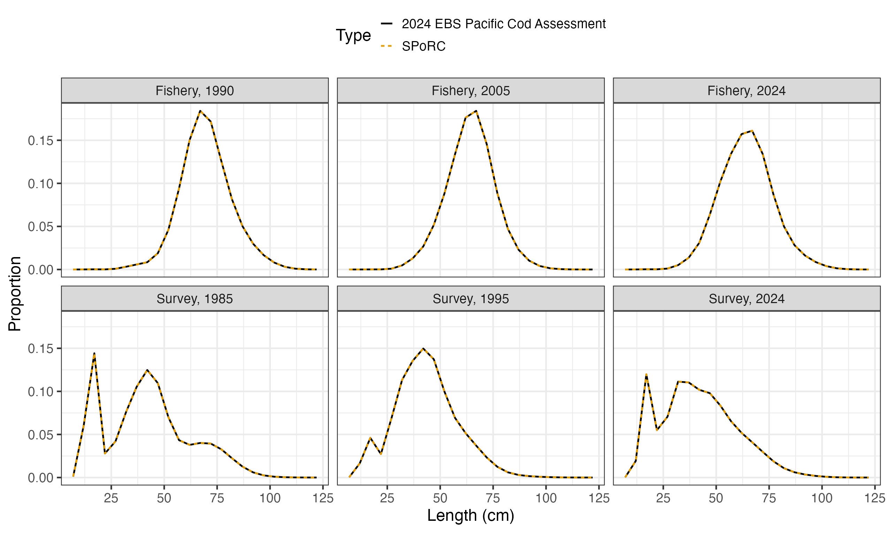
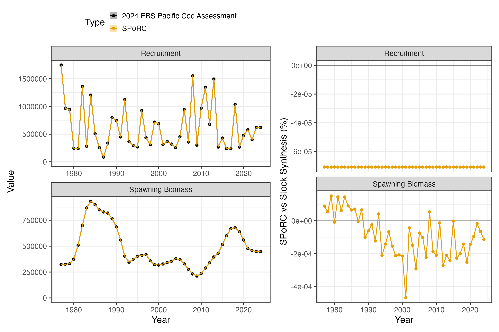
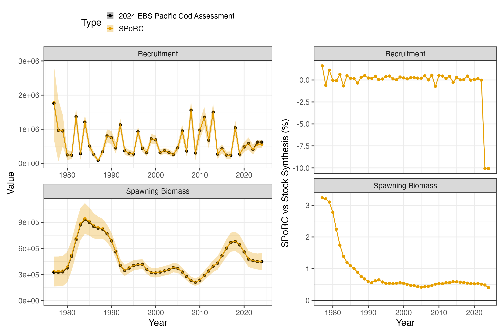

```{r, include = FALSE, eval = FALSE}
knitr::opts_chunk$set(
  collapse = TRUE,
  comment = "#>",
  eval = FALSE
)
```

## Overview

This case study reproduces Model 24.1 of the 2024 eastern Bering Sea Pacific cod
assessment (Barbeaux et al. 2024), run in Stock Synthesis 3, in `SPoRC`.

The model is one area, one sex and one season, with a single fishery and a
single bottom trawl survey. Everything is fit
at length, on 121 population length bins reported to 24 five centimetre data
bins.

| Source | Years | Observations | Likelihood |
|---|---|---|---|
| Catch | 1977--2024 | 48 | Lognormal |
| Survey abundance, in numbers | 1982--2024 | 42 | Lognormal, extra SD |
| Fishery length compositions | 1977--2024 | 48 | Multinomial |
| Survey length compositions | 1982--1999, 2024 | 19 | Multinomial |
| Survey age compositions | 2000--2023 | 23 | Multinomial |

Ages run $a = 0$ to $a_{+} = 20$, with ages observed from 0 to 12 and 12
accumulating. Population lengths are 121 one centimetre bins and the
compositions are recorded on 24 bins of 5 cm from 4.5. Model years run
$y_{1} = 1977$ to $y_{\text{end}} = 2024$. Recruitment is age 0 entering at the
start of the year, mean recruitment with $\sigma_{R} = 0.6908$, and natural
mortality is fixed at 0.3866.

```{r setup, warning = FALSE, message = FALSE, eval = FALSE}
library(SPoRC)
library(dplyr)
library(ggplot2)
data("sgl_rg_ebs_pcod_data")

dat <- sgl_rg_ebs_pcod_data
yrs <- dat$years
n_yrs <- length(yrs)
ages <- dat$ages
n_ages <- length(ages)
n_reg <- 1; n_sex <- 1; n_fish <- 1; n_srv <- 1
sigmaR <- dat$rec$sigmaR
```

The object carries the model inputs, the assessment's maximum likelihood
estimate in `dat$mle`, used both as a starting point and to check the objective
before anything is optimized, and the reported quantities in `dat$ss3`, which
are the comparison target.

## Model dimensions

One area, one sex and one season, so the region, sex and season subscripts in
`vignette("c_model_equations")` all collapse to one. The lengths given here are
the population bins the fish are grown on, not the coarser bins the
compositions are reported on.

```{r, eval = FALSE}
input_list <- Setup_Mod_Dim(
  years = yrs, ages = ages, lens = dat$lens,
  n_regions = n_reg, n_sexes = n_sex, n_fish_fleets = n_fish, n_srv_fleets = n_srv,
  n_seas = 1, n_pop = 1, natal_region = 1, verbose = FALSE
)
```

## Recruitment

Recruitment is a mean with annual deviations rather than a stock recruit
function. The start year's ages 1 to 20 are set by twenty early deviations, and
`equil_init_age_strc = "stoch_all"` estimates and penalizes all twenty,
including the one at the accumulator age, which is what the assessment does.
The alternative, `"stoch_plus_grp"`, holds that last deviation at zero and
leaves it out of the penalty.

A separate initial equilibrium recruitment is penalized towards $R_{0}$ with the
assessment's standard deviation, $\sigma_{R}$ over the average age. Initial
fishing mortality is held at the assessment's value, since `SPoRC` has no
equilibrium catch to fit it against.

```{r, eval = FALSE}
ave_age <- 1 / dat$growth$M - 0.5

input_list <- Setup_Mod_Rec(
  input_list = input_list,
  rec_model = "mean_rec", rec_dd = "global", rec_lag = 0, SR_ref_yr = 1, t_spawn = 0,
  sigmaR_spec = "fix", ln_sigmaR = array(log(sigmaR), dim = c(2, 1, n_reg)), sigmaR_switch = 1,
  do_rec_bias_ramp = 1,
  bias_year = dat$rec$bias_years - yrs[1] + 1,
  max_bias_ramp_fct = dat$rec$max_bias_adj,
  RecDevs_spec = "est_shared_pop_r", RecDevs_pen_center = "fixed", dont_est_recdev_last = 0,
  init_age_strc = 2, equil_init_age_strc = 2,
  InitDevs_spec = "est_shared_pop_r", InitDevs_pen_center = "fixed",
  rec_region_prop_spec = NULL,
  use_rinit = 1, Use_rinit_pen = 1, rinit_pen_sd = sigmaR / ave_age,
  init_F_form = "abs", init_F_spec = "fix",
  init_F_par = array(log(dat$mle$init_F), dim = c(n_reg, 1, n_fish)),
  ln_global_R0 = dat$mle$ln_R0, ln_rinit = dat$mle$ln_R0 + dat$mle$regime
)
```

The bias ramp years are given in deviation-index space, 1 being the first model
year, and each early deviation reads the ramp at its own birth year.

## Biological dynamics

Natural mortality is fixed. Growth is
the Richards curve, which generalises von Bertalanffy with a sixth parameter
raising the lengths to a power, and weight at age is derived from it through the
weight-length relationship rather than supplied as data.

Three arguments carry the assessment's growth conventions.
`growth_tv_model = c(L1 = "iid", K = "iid")` names which parameters vary and
how, with `growth_tv_years` giving each its own active years.
`growth_tv_link = "logit"` makes each deviation an offset inside the parameter's
bounds. `growth_tv_type = "cohort"` carries size at age forward cohort by
cohort. The deviations' standard deviations live in the first stream of
`growth_pe_pars`, one slot per growth parameter in the order `L1`, `L2`, `K`,
`CV1`, `CV2`, `rho`, with a placeholder in the four slots that do not vary. The
second stream belongs to the semi-parametric surface and is unread here.

Maturity at age is taken from the assessment rather than modelled, because
maturity is length based and fixed there. `LenBinMap` maps the 121 population
bins onto the 24 the compositions are recorded on.

```{r, eval = FALSE}
g <- dat$growth
pe_start <- array(log(0.05), dim = c(1, n_reg, max(4, n_ages, 6), n_sex, 2))
pe_start[1, 1, 1:6, 1, 1] <- log(c(g$dev_sd[["L1"]], 1, g$dev_sd[["K"]], 1, 1, 1))
MatAA <- array(0, dim = c(1, n_reg, n_yrs, 1, n_ages, n_sex))
MatAA[1, 1, , 1, , 1] <- dat$MatAA

input_list <- Setup_Mod_Biologicals(
  input_list = input_list,
  WAA = NULL, MatAA = MatAA,
  fit_lengths = 1, SizeAgeTrans = NA,
  AgeingError = dat$AgeingError,
  M_spec = "fix", Fixed_natmort = array(g$M, dim = c(1, n_reg, n_yrs, n_ages, n_sex)),
  addtocomp = dat$comp$addtocomp_len, comp_const_obs = 1, addtosrvidx = 0, addtofishidx = 0,
  growth_model = "richards",
  ln_growth_pars = array(log(dat$mle$growth[c("L1", "L2", "K", "CV1", "CV2", "rho")]), dim = c(1, n_reg, n_sex, 6)),
  growth_spec = "est_all", growth_fix = !g$est[c("L1", "L2", "K", "CV1", "CV2", "rho")],
  growth_A1 = g$A1,
  growth_A2 = if(g$A2 == 999) "Linf" else g$A2,
  growth_len_lower = dat$lens_lower, growth_L0 = dat$lens_lower[1],
  growth_plus_group = "mixture",
  growth_tv_model = c(L1 = "iid", K = "iid"), growth_tv_years = g$dev_years,
  growth_tv_link = "logit",
  growth_par_bounds = g$bounds[c("L1", "L2", "K", "CV1", "CV2", "rho"), ],
  growth_pe_pars = pe_start,
  growth_tv_sigma_spec = "fix",
  growth_tv_type = "cohort",
  waa_model = "wt_len", wt_len_pars = dat$wtlen,
  LenBinMap = dat$LenBinMap
)
```

The control file records a second reference age of 999 to mean that $L_{2}$ is
the asymptote itself, which is what the conditional on `growth_A2` translates.
Two ageing error definitions are carried in `AgeingError`, a biased reader
through 2007 and an unbiased one after.

## Movement and tagging

One area, so nothing moves and nothing is tagged.

```{r, eval = FALSE}
input_list <- Setup_Mod_Movement(input_list = input_list, use_fixed_movement = 1,
                                 Fixed_Movement = NA, do_recruits_move = 0)
input_list <- Setup_Mod_Tagging(input_list = input_list, use_conv_fish_tagging = 0)
```

## Catch and fishing mortality

The assessment solves fishing mortality from the catch with its hybrid method,
so it spends no parameters on $F$. `SPoRC` estimates a deviation per year
against the assessment's catch error with no penalty on the deviations, which
fits the catch almost exactly on both sides.

```{r, eval = FALSE}
input_list <- Setup_Mod_Catch_and_F(
  input_list = input_list,
  ObsCatch = dat$ObsCatch, UseCatch = dat$UseCatch,
  Use_F_pen = 0, ln_F_mean_spec = "fix",
  sigmaC_spec = "fix", ln_sigmaC = array(log(dat$catch_se), dim = c(n_reg, n_yrs, 1, n_fish))
)
```

## Fishery compositions

No fishery index and no fishery ages, lengths only. Two arguments carry
conventions rather than choices. `FishLenComps_sel = "length"` applies
selectivity at length and sums over ages instead of folding it to age first, and
`fish_waa_selected = 1` puts the catch in biomass on the selection weighted
weight at age.

`t_fish` is 0.5 because a fishing fleet's compositions are read at mid season
whatever month the data file records, so the age-length key, the selected weight
behind the catch biomass, and the compositions all sit there.

```{r, eval = FALSE}
joint <- function(n) paste0("spltRjntS_Year_1-terminal_Fleet_", seq_len(n))
none <- function(n) paste0("none_Year_1-terminal_Fleet_", seq_len(n))

input_list <- Setup_Mod_FishIdx_and_Comps(
  input_list = input_list,
  t_fish = array(0.5, dim = c(n_reg, 1, n_fish)),
  FishLenComps_sel = "length", fish_waa_selected = 1,
  ObsFishIdx = array(NA_real_, dim = c(n_reg, n_yrs, 1, n_fish)),
  ObsFishIdx_SE = array(NA_real_, dim = c(n_reg, n_yrs, 1, n_fish)),
  UseFishIdx = array(0, dim = c(n_reg, n_yrs, 1, n_fish)),
  fish_idx_type = rep("none", n_fish), FishIdx_LikeType = rep("lognormal", n_fish),
  ObsFishAgeComps = array(NA_real_, dim = c(n_reg, n_yrs, 1, length(dat$obs_ages), n_sex, n_fish)),
  UseFishAgeComps = array(0, dim = c(n_reg, n_yrs, 1, n_fish)),
  ObsFishLenComps = dat$ObsFishLenComps, UseFishLenComps = dat$UseFishLenComps,
  ISS_FishLenComps = dat$ISS_FishLenComps,
  FishAgeComps_LikeType = rep("none", n_fish),
  FishLenComps_LikeType = rep("Multinomial", n_fish),
  FishAgeComps_Type = none(n_fish), FishLenComps_Type = joint(n_fish)
)
```

## Survey index and compositions

The index is in numbers, so weight at age never enters it. The extra standard
deviation the assessment estimates is added to the observed standard errors
here rather than estimated, which is the one parameter of the assessment's that
`SPoRC` folds into data. Ages come through the ageing error definitions,
lengths on the data bins, all read at mid year.

```{r, eval = FALSE}
t_srv <- array(dat$t_srv, dim = c(n_reg, 1, n_srv))

input_list <- Setup_Mod_SrvIdx_and_Comps(
  input_list = input_list,
  ObsSrvIdx = dat$ObsSrvIdx, ObsSrvIdx_SE = dat$ObsSrvIdx_SE + dat$mle$extra_sd,
  UseSrvIdx = dat$UseSrvIdx,
  srv_idx_type = rep("abd", n_srv), SrvIdx_LikeType = rep("lognormal", n_srv),
  ObsSrvAgeComps = dat$ObsSrvAgeComps, UseSrvAgeComps = dat$UseSrvAgeComps,
  ISS_SrvAgeComps = dat$ISS_SrvAgeComps,
  ObsSrvLenComps = dat$ObsSrvLenComps, UseSrvLenComps = dat$UseSrvLenComps,
  ISS_SrvLenComps = dat$ISS_SrvLenComps,
  SrvAgeComps_LikeType = rep("Multinomial", n_srv),
  SrvLenComps_LikeType = rep("Multinomial", n_srv),
  SrvAgeComps_Type = joint(n_srv), SrvLenComps_Type = joint(n_srv),
  SrvLenComps_sel = "length"
)
```

## Fishery selectivity

A double normal at length on the population bins, in two blocks. The 1977 to
1989 block replaces the peak and the ascending width and keeps the rest of the
base block's parameters, so two of the six are estimated in each block.

`fish_sel_dbnrml_raw` leaves the ascending limb as a raw Gaussian rather than
rescaling it, and `fish_sel_dbnrml_startbin` anchors the limb at the first data
bin rather than the first population bin, with bins below taking
$(b / b_{\text{start}})^{2}$ times the selectivity there.

```{r, eval = FALSE}
input_list <- Setup_Mod_Fishsel_and_Q(
  input_list = input_list,
  fish_selex_type = "length",
  fish_sel_model = c("dbnrml_Fleet_1_Block_1", "dbnrml_Fleet_1_Block_2"),
  cont_tv_fish_sel = paste0("none_Fleet_", seq_len(n_fish)),
  fish_sel_blocks = c(paste0("Block_1_Year_1-", dat$sel$blocks[[4]][2] - yrs[1] + 1, "_Fleet_1"),
                      paste0("Block_2_Year_", dat$sel$blocks[[4]][2] - yrs[1] + 2, "-terminal_Fleet_1")),
  fish_q_blocks = paste0("none_Fleet_", seq_len(n_fish)),
  fish_fixed_sel_pars_spec = rep("est_all", n_fish),
  fish_sel_dbnrml_raw = matrix(c(1, 0), n_fish, 2, byrow = TRUE),
  fish_sel_dbnrml_startbin = rep(dat$startbin, n_fish),
  fish_q_spec = rep("fix", n_fish)
)
```

Block years are given in year-index space, 1 being the first model year.

## Survey selectivity

The same double normal with independent annual deviations on the ascending
width from 1982, which is `cont_tv_srv_sel = "iid"` with the process error
standard deviation held at the assessment's value. Catchability is estimated.

```{r, eval = FALSE}
input_list <- Setup_Mod_Srvsel_and_Q(
  input_list = input_list,
  srv_selex_type = "length",
  srv_sel_model = paste0("dbnrml_Fleet_", seq_len(n_srv)),
  cont_tv_srv_sel = paste0("iid_Fleet_", seq_len(n_srv)),
  srv_sel_blocks = paste0("none_Fleet_", seq_len(n_srv)),
  srv_q_blocks = paste0("none_Fleet_", seq_len(n_srv)),
  srv_fixed_sel_pars_spec = rep("est_all", n_srv),
  srv_sel_devs_spec = rep("est_all", n_srv),
  srvsel_pe_pars_spec = rep("fix", n_srv),
  srv_sel_dbnrml_startbin = rep(dat$startbin, n_srv),
  srv_q_spec = rep("est_all", n_srv),
  t_srv = t_srv
)
```

## Weighting

One Francis weight per composition type. Stock Synthesis adds a constant to
every observed and expected proportion and then renormalizes, so each
composition likelihood is the `SPoRC` value scaled by
$1 + n_{\text{bins}} \times c$. Dividing the weight by that factor absorbs it.

```{r, eval = FALSE}
va <- dat$var_adj
w_len_fish <- va$value[va$factor == 4 & va$fleet == dat$fish_fleets[1]]
w_len_srv  <- va$value[va$factor == 4 & va$fleet == dat$srv_fleets[1]]
w_age_srv  <- va$value[va$factor == 5 & va$fleet == dat$srv_fleets[1]]
n_obs_lens <- ncol(dat$LenBinMap); n_obs_ages <- length(dat$obs_ages)

per_fleet <- function(w, n_fl) {
  arr <- array(1, dim = c(n_reg, n_yrs, 1, n_sex, n_fl))
  for(f in seq_len(n_fl)) arr[, , , , f] <- w
  arr
}

input_list <- Setup_Mod_Weighting(
  input_list = input_list,
  Wt_Catch = 1, Wt_FishIdx = 0, Wt_SrvIdx = 1, Wt_Rec = 1, Wt_F = 1, Wt_Tagging = 0,
  Wt_FishAgeComps = per_fleet(0, n_fish),
  Wt_FishLenComps = per_fleet(w_len_fish / (1 + n_obs_lens * dat$comp$addtocomp_len), n_fish),
  Wt_SrvAgeComps = per_fleet(w_age_srv / (1 + n_obs_ages * dat$comp$addtocomp_age), n_srv),
  Wt_SrvLenComps = per_fleet(w_len_srv / (1 + n_obs_lens * dat$comp$addtocomp_len), n_srv)
)
```

## Starting at the assessment's estimate

Every parameter is set to the assessment's estimate and the model is evaluated
there without optimizing, which is what makes the specification checkable one
piece at a time. The bridge helper does this in one call; the pieces are the
recruitment ratio, the early deviations less their own bias corrections, log
fishing mortality as a fixed mean plus deviations, the growth and selectivity
deviations rescaled from the assessment's unit normal form, and catchability.

```{r, eval = FALSE}
source(system.file("tests", "testthat", "helper-bridge_ebs_pcod.R", package = "SPoRC"))

input_list <- seed_ebs_pcod_mle(build_ebs_pcod_input(dat), dat)
seed <- fit_model(input_list$data, input_list$par, input_list$map,
                  do_optim = FALSE, silent = TRUE)
```

The comparison before anything is optimized, against a report file carrying six
significant digits:

```
numbers at age                      1.0e-03 %
spawning biomass                    4.7e-04 %
recruitment                         7.1e-05 %
total biomass                       4.8e-04 %
predicted catch                     4.9e-04 %
survey index                        3.7e-04 %
weight at age, three definitions    5.0e-04 %
growth parameters by year           4.2e-04 %
selectivity at length, both fleets  5.0e-07  (absolute)
expected length compositions        4.5e-06  (absolute)
```

Weight at age is checked against all three of the assessment's definitions, the
start-of-year population weight, the mid-year weight, and the fishery's
selection weighted weight, because the three separate the growth curve from the
key and the key from selectivity. Mean length at age is checked in years
spanning the time-varying period, and under cohort growth a late year only
reproduces if every earlier year's increment did.

`SPoRC` writes each likelihood component as a proper density where the
assessment drops normalising constants, so the comparison subtracts exactly
what it omits:

| Component | `SPoRC` less constants | Assessment |
|---|---|---|
| Survey index | -59.065728 | -59.0658 |
| Fishery lengths | 119.364878 | 119.365 |
| Survey lengths | 103.268624 | 103.269 |
| Survey ages | 57.440030 | 57.4390 |
| Recruitment, main and early | 5.065827 | 5.06581 |
| Initial equilibrium offset | 1.907037 | 1.90704 |
| Growth deviations | 10.415703 | 10.41565 |
| Survey selectivity deviations | 8.432246 | 8.43225 |

against the assessment's reported total of 246.832. The catch is fit
almost exactly on both sides, since the assessment conditions fishing
mortality on it.






## Fitting and comparison

```{r, eval = FALSE}
est <- fit_model(input_list$data, input_list$par, input_list$map,
                 do_optim = TRUE, newton_loops = 3, silent = TRUE)
est$sdrep <- RTMB::sdreport(est, hessian.fixed = est$he(est$env$last.par.best))
```

220 parameters against the assessment's 174. The two counts reconcile exactly:
`SPoRC` estimates 48 annual fishing mortality deviations where the hybrid solver
costs the assessment nothing, and holds two parameters the assessment estimates,
initial fishing mortality and the survey's extra standard deviation, so
$174 + 48 - 1 - 1 = 220$. Every other block is one for one, including the 50
growth deviations, the 43 survey selectivity deviations and the 20 initial age
deviations.

The objective falls 0.73 from the assessment's estimate and the fit converges to
a maximum gradient of $1.3\times10^{-9}$ with a positive definite Hessian.

| | Median | Maximum |
|---|---|---|
| Spawning biomass | +0.55 % | +3.2 % |
| Recruitment | +0.19 % | -10.1 % |

Growth returns within two tenths of a percent on every parameter, which is the
check that matters for this bridge:

| | `SPoRC` | Assessment |
|---|---|---|
| $L_{1}$ at age 1.5 | 13.83635 | 13.85056 |
| $L_{2}$, the asymptote | 112.22362 | 112.26005 |
| $K$ | 0.11432 | 0.11453 |
| Richards $\rho$ | 1.48810 | 1.48560 |




## Why the two differ

Everything in the population dynamics, the growth, the observation model and the
selectivity agrees at the report's own print precision, and so does every
likelihood component. The refit moves spawning biomass by half a percent.

The drift is the recruitment convention. The assessment declares its deviations
a `devvector`, which ADMB constrains to sum to zero, so $R_{0}$ is the geometric
mean recruitment of the deviation years by construction and the assessment's
main deviations sum to $-5\times10^{-14}$. `SPoRC` leaves its deviations free
under the penalty, so $R_{0}$ and their mean slide together: on refitting the
mean deviation is $-0.105$ and $\ln R_{0}$ falls 0.106, from 13.341 to 13.235,
leaving their product almost unchanged. 

The survey's extra standard deviation differs the same way. The assessment
estimates it, so how much weight the index carries is settled alongside
everything else. `SPoRC` has no estimated extra standard deviation on an index,
so here it is added to the observed standard errors and held at the assessment's
value. That is not a small term: $0.093$ against observed standard errors of
$0.044$ to $0.094$, so it roughly doubles them, and the index likelihood is
unrecognisable without it. Holding it costs nothing at the assessment's estimate,
where the total standard error is identical and the index likelihood reproduces
to six digits, but it fixes the index's weight where the assessment could still
move it. This is the second of the two parameters the count above holds rather
than estimates, initial fishing mortality being the first.

The gradient at the assessment's estimate is a bit larger on the growth parameters, the
recruitment deviations and the fishing mortality deviations even though every
reported quantity matches. That is the hybrid solver again: the assessment
conditions $F$ on the catch rather than estimating it, so `SPoRC`'s partials omit
the implicit $\mathrm{d}F/\mathrm{d}\theta$ and its catch likelihood stands in
for the exact solve.