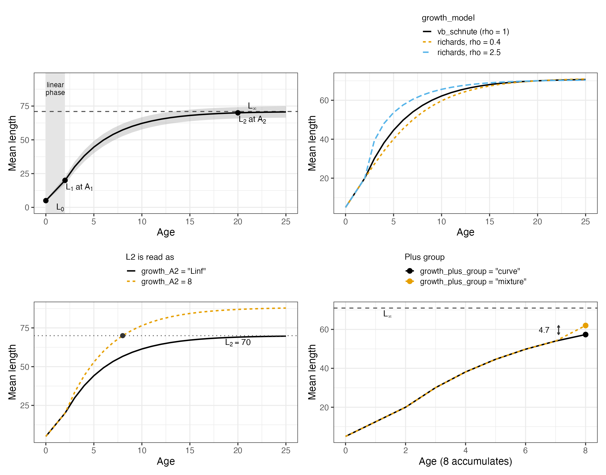
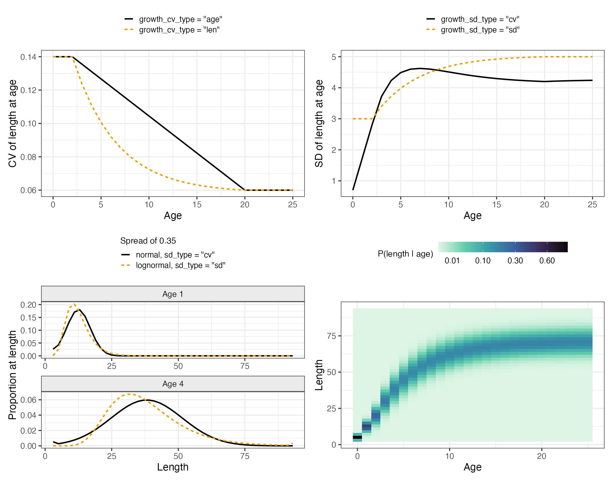
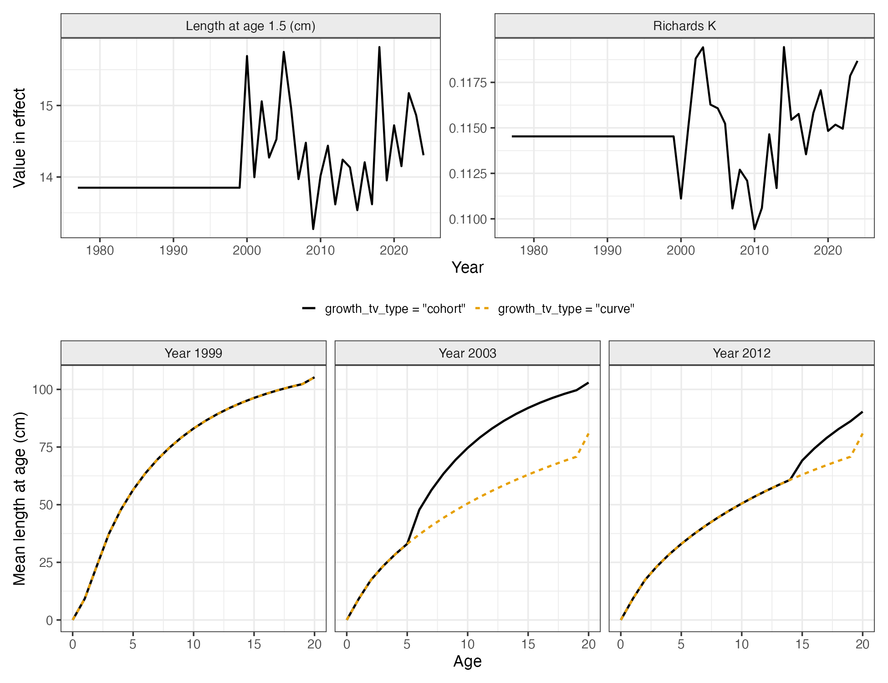
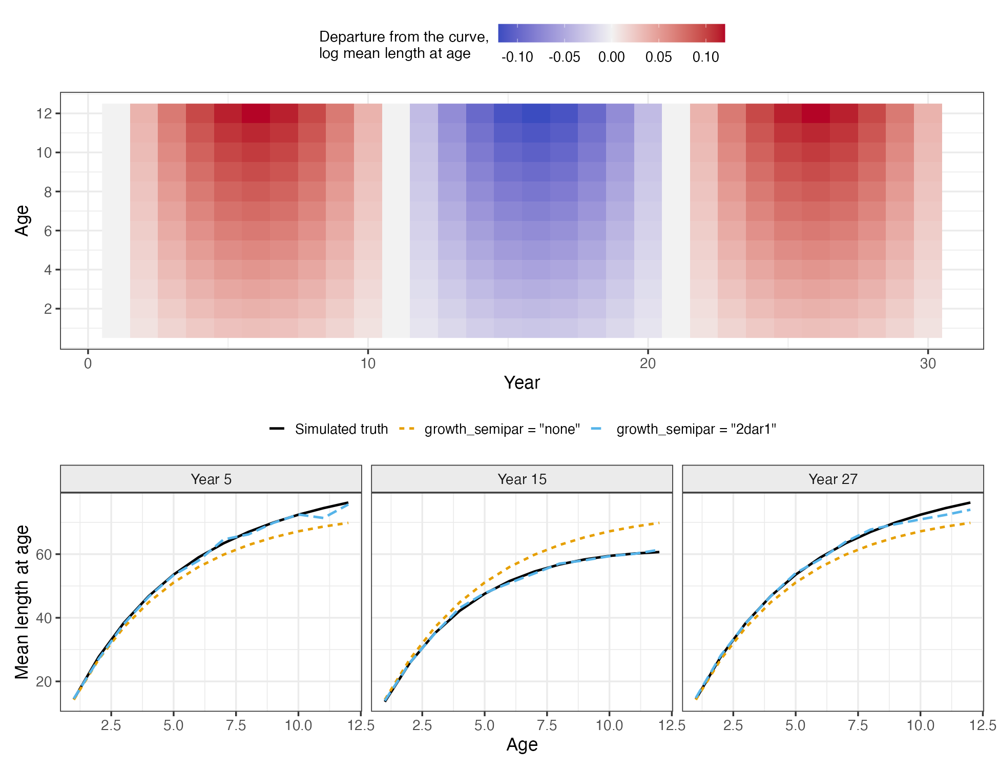

```{r, include = FALSE}
knitr::opts_chunk$set(
  collapse = TRUE,
  comment = "#>",
  eval = FALSE
)
```

The size-age transition matrix is used in four places: length compositions are
compared against it, length-based selectivity is applied through it,
conditional age-at-length rows are read from it, and when weight at age is
derived rather than supplied it converts numbers to biomass, and so enters
spawning biomass and the reference points.

All of the options that build it are arguments to `Setup_Mod_Biologicals()`.
This vignette covers what each one does and when to use it. The algebra is in
`vignette("c_model_equations")` and the full argument list is in
`vignette("t_model_options")`. Two case studies run the module end to end:
`vignette("ad_goa_rex_sole_case_study")` for constant parametric growth with
conditional age-at-length, and `vignette("ae_ebs_pacific_cod_case_study")` for
time-varying growth carried cohort by cohort.

The examples use the packaged EBS Pacific cod inputs, which have length bins, a
weight-length relationship and length compositions, so every option below can
be switched on against them.

```{r setup, warning = FALSE, message = FALSE}
library(SPoRC)
data("sgl_rg_ebs_pcod_data")

dat <- sgl_rg_ebs_pcod_data
yrs <- dat$years; n_yrs <- length(yrs)
ages <- dat$ages; n_ages <- length(ages)
n_reg <- 1; n_sex <- 1

# lens are the bin midpoints the population is carried on; the transition is
# built on the lower edges, which is what growth_len_lower supplies
input_list <- Setup_Mod_Dim(
  years = yrs, ages = ages, lens = dat$lens,
  n_regions = n_reg, n_sexes = n_sex, n_fish_fleets = 1, n_srv_fleets = 1,
  n_seas = 1, n_pop = 1, natal_region = 1, verbose = FALSE
)

# Setup_Mod_Rec() has to run before the biologicals, because the maturity check
# reads rec_lag
input_list <- Setup_Mod_Rec(
  input_list = input_list, rec_model = "mean_rec", rec_lag = 0, t_spawn = 0,
  sigmaR_spec = "fix", ln_sigmaR = array(log(dat$rec$sigmaR), dim = c(2, 1, n_reg)),
  sigmaR_switch = 1, do_rec_bias_ramp = 0,
  init_age_strc = 2, equil_init_age_strc = 2, ln_global_R0 = dat$mle$ln_R0
)
```

# Notation

Every symbol used below. Growth parameters additionally carry population,
region and sex subscripts $p, r, s$, which are dropped throughout because
sharing across them is a separate choice (`growth_spec`).

| Symbol | Meaning | Kind |
|---|---|---|
| $a$ | integer age class, $a = a_{1}, \dots, a_{+}$ | index |
| $a_{+}$ | accumulator age, holding every fish that old and older | index |
| $a^{\ast}$ | first age past $A_{1}$, where cohort propagation starts | index |
| $y$ | model year | index |
| $\tau$ | season, $\tau = 1, \dots, n_{\tau}$ | index |
| $l$ | length bin, $l = 1, \dots, n_{l}$ | index |
| $d_{\tau}$ | duration of season $\tau$ as a fraction of the year, $\sum_{\tau} d_{\tau} = 1$ (`seasdur`) | data |
| $t$ | fraction of a season elapsed at a reading point (`t_fish`, `t_srv`, `t_spawn`) | data |
| $e$ | fraction of the year elapsed at that reading point | derived |
| $x$ | real age, $x = a + e$ | derived |
| $\ell_{l}$ | lower edge of length bin $l$ (`growth_len_lower`) | data |
| $\tilde{\ell}_{l}$ | midpoint of length bin $l$ (`lens`) | data |
| $A_{1}, A_{2}$ | reference ages for $L_{1}$ and $L_{2}$ (`growth_A1`, `growth_A2`) | data |
| $A_{2}^{cv}$ | age at and above which $CV_{2}$ applies | data |
| $L_{0}$ | length at age zero, anchoring the linear phase (`growth_L0`) | data |
| $L_{1}, L_{2}$ | mean length at $A_{1}$ and at $A_{2}$ | estimated |
| $K$ | rate of approach to the asymptote | estimated |
| $\rho$ | Richards coefficient; $\rho = 1$ under `"vb_schnute"` | estimated |
| $CV_{1}, CV_{2}$ | spread parameters at the two reference ages | estimated |
| $L_{\infty}$ | asymptotic length, solved from $L_{1}$, $L_{2}$, $K$ | derived |
| $\bar{L}(x)$ | mean length at real age $x$ | derived |
| $\bar{L}_{+}$ | mean length of the plus group | derived |
| $c(x)$ | interpolated spread parameter at $x$ | derived |
| $\sigma_{L}(x)$ | standard deviation of length at $x$ | derived |
| $g_{y}(L)$ | growth increment over one year under year $y$'s parameters | derived |
| $A_{l,a}$ | size-age transition, $P(\ell_{l} \mid a)$ | derived |
| $N_{y,a}$ | numbers at age at the start of year $y$ | derived |
| $W_{a}$ | weight at age | derived |
| $\delta_{y}$ | time-varying deviation on a growth parameter in year $y$ | estimated |
| $\varepsilon_{y,a}$ | semi-parametric deviation on log mean length at age | estimated |
| $P, P^{lo}, P^{hi}$ | a growth parameter and its bounds (`growth_par_bounds`) | see above |
| $\alpha, \beta$ | weight-length parameters in $W = \alpha L^{\beta}$ (`wt_len_pars`) | data |
| $\Phi$ | standard normal distribution function | function |

# Data or parameters

Under `growth_model = "none"`, the default, `SizeAgeTrans` is data: an array
`[p x r x y x seas x l x a x s]` of $P(\ell \mid a)$ built outside the model,
column-stochastic, one slice per year and season. Weight at age is data too.
Nothing about size is estimated.

Under `growth_model = "vb_schnute"` or `"richards"`, the size-age transition is a function of
five or six estimable parameters. `SizeAgeTrans` is then ignored and may be
`NA`. One is built per fleet at that fleet's timing (`t_fish`, `t_srv`),
plus one at spawning time.

Use `"none"` if growth is determined externally and is not under study, if you
are bridging an assessment that fixes it, or if there are no length data.

Use an estimated curve if you fit length compositions or conditional
age-at-length, if size at age may have changed over the series, if growth
uncertainty should propagate into the biomass, or if selectivity is
length-based and would otherwise absorb a misspecified transition. The costs are
parameters and tape-build time.

# Prerequisites

The setup function will stop on each of these:

| Requirement | Where |
|---|---|
| Length bin midpoints | `lens` in `Setup_Mod_Dim()` |
| `fit_lengths = 1` | `Setup_Mod_Biologicals()` |
| `growth_len_lower` | lower edges of those same bins, one per bin |
| `growth_A1`, `growth_A2` | the two reference ages the curve is anchored at |

Which data you fit matters more than any switch below. Marginal length
compositions identify the curve weakly, because a length distribution is a
mixture over ages and abundance at age has to be separated from size at age.
Conditional age-at-length constrains growth much more directly: a CAAL row is
the age composition of the otoliths taken from one length bin, so it is
informative about size at age and carries little information about abundance.
If you have aged otoliths with their lengths, fit them as CAAL
(`ObsSrv_caal`, `do_caal = 1`) rather than as marginal age compositions.

# The curve and its anchors

```{r, eval = FALSE}
MatAA <- array(0, dim = c(1, n_reg, n_yrs, 1, n_ages, n_sex))
MatAA[1, 1, , 1, , 1] <- dat$MatAA

input_list <- Setup_Mod_Biologicals(
  input_list = input_list,
  WAA = NULL, MatAA = MatAA, AgeingError = dat$AgeingError,
  M_spec = "fix", Fixed_natmort = array(0.3866, dim = c(1, n_reg, n_yrs, n_ages, n_sex)),
  fit_lengths = 1, SizeAgeTrans = NA,
  growth_model = "vb_schnute",
  ln_growth_pars = array(log(c(L1 = 14, L2 = 100, K = 0.12, CV1 = 0.15, CV2 = 0.08)),
                         dim = c(1, n_reg, n_sex, 5)),
  growth_A1 = 1.5, growth_A2 = 20,
  growth_len_lower = dat$lens_lower, growth_L0 = dat$lens_lower[1],
  waa_model = "wt_len", wt_len_pars = dat$wtlen
)
```

`WAA = NULL` and `SizeAgeTrans = NA` because both come out of the growth
module. The later sections change one argument of this call at a time; `...`
in them stands for the rest of it unchanged.



*The Schnute curve and three of the switches that shape it. Top left: mean
length at age, with the linear phase below `growth_A1` shaded and a band one
standard deviation either side of the mean. Top right: the Richards coefficient
changes the shape of the approach to the asymptote, and equals von
Bertalanffy at one. Bottom left: the same $L_{2}$ of 70 read as the length at
age 8, from which the asymptote is solved, or read as the asymptote itself.
Bottom right: the plus-group adjustment adds 4.7 cm at an accumulator age of
8.*

Growth is parameterized in Schnute form rather than as $L_{\infty}$, $K$,
$t_{0}$. The parameters are lengths at named ages, so starting values can be
read off a length-at-age scatter and bounds are lengths. Writing $x$ for real
age (integer age plus the fraction of the year elapsed), and dropping the
population, region and sex subscripts on every parameter:

$$\bar{L}(x) = \begin{cases}
L_{0} + \dfrac{x}{A_{1}}\left( L_{1} - L_{0} \right) & x < A_{1} \\[2ex]
L_{\infty} + \left( L_{1} - L_{\infty} \right)e^{-K(x - A_{1})} & x \geq A_{1}
\end{cases}$$

with the asymptote solved from the two anchors,

$$L_{\infty} = L_{1} + \frac{L_{2} - L_{1}}{1 - e^{-K(A_{2} - A_{1})}}$$

and reported as `Linf`. The $L_{\infty}$, $K$, $t_{0}$ form is strongly
correlated between $L_{\infty}$ and $K$; the Schnute form is less so, because
each parameter is tied to an age with data behind it.

`growth_model = "richards"` applies the same curve to lengths raised to a power
$\rho$:

$$\bar{L}(x)^{\rho} = L_{\infty}^{\rho} + \left( L_{1}^{\rho} - L_{\infty}^{\rho} \right)e^{-K(x - A_{1})}$$

with $L_{\infty}^{\rho} = L_{1}^{\rho} + \left( L_{2}^{\rho} - L_{1}^{\rho} \right) / \left( 1 - e^{-K(A_{2} - A_{1})} \right)$.
At $\rho = 1$ this is the von Bertalanffy curve exactly, so the Richards form
nests it. The linear phase below $A_{1}$ is unchanged.

`growth_A1` and `growth_A2` are data, not parameters. Set `growth_A1` at or
just above the youngest age in the length data, since below it the curve is a
straight line from `growth_L0` and is an assumption rather than a fit. Set
`growth_A2` old enough that fish are near the asymptote but young enough that
the sample is not small.

`growth_A2 = "Linf"` reads $L_{2}$ as the asymptote itself, with no second
reference age to solve it from. Use it when matching a source parameterized
that way. The bottom-left
panel shows that the same $L_{2}$ gives a different curve under each reading.

`growth_L0` anchors the linear phase and defaults to the first length bin's
lower edge. It is rarely estimable, and only matters if recruits appear in the
length compositions.

$\rho$ gives a more flexible approach to the asymptote at the cost of one
parameter that is often unidentified. Start at $\rho = 1$; if the estimate
barely moves and its standard error is large, use `"vb_schnute"`.

# The spread around the mean

The curve gives mean length at age. The size-age transition also needs a spread, set by three
switches.



*Top left: the CV runs from `CV1` to `CV2` between the reference ages,
interpolated on mean length or on age. Top right: the same two parameters read
as CVs, which scale the mean, or as standard deviations, which do not. Bottom
left: the two dimensionally coherent pairings at a spread of 0.35, normal with
`growth_sd_type = "cv"` and lognormal with `"sd"`; note the mass the normal
puts in the smallest bin at age 1. Bottom right: the resulting size-age
transition, on a square root colour scale.*

Two parameters carry the spread, $CV_{1}$ and $CV_{2}$ at the two reference
ages, interpolated between them. `growth_cv_type` sets what the interpolation
runs on:

$$c(x) = \begin{cases}
CV_{1} & x < A_{1} \\[1ex]
CV_{1} + \left( CV_{2} - CV_{1} \right)\dfrac{\bar{L}(x) - L_{1}}{L_{2} - L_{1}} & A_{1} \leq x < A_{2}^{cv}, \quad \texttt{"len"} \\[2ex]
CV_{1} + \left( CV_{2} - CV_{1} \right)\dfrac{x - A_{1}}{A_{2}^{cv} - A_{1}} & A_{1} \leq x < A_{2}^{cv}, \quad \texttt{"age"} \\[2ex]
CV_{2} & x \geq A_{2}^{cv}
\end{cases}$$

where $A_{2}^{cv} = A_{2}$, or the oldest age evaluated when
`growth_A2 = "Linf"`. The branch is taken on age either way; only the middle
branch's value depends on $\bar{L}(x)$. The two agree at the reference ages and
differ most where growth is fast, because interpolating on length compresses
the change into the young ages. `"len"` is the Stock Synthesis convention;
`"age"` gives a CV that declines steadily with age.

`growth_sd_type` then turns $c(x)$ into the standard deviation the transition is
built from:

$$\sigma_{L}(x) = \begin{cases}
c(x)\,\bar{L}(x) & \texttt{"cv"} \\[1ex]
c(x) & \texttt{"sd"}
\end{cases}$$

Under `"cv"` the spread scales with size, so a 20 cm and a 60 cm fish have
standard deviations in the ratio 1:3. Under `"sd"` the absolute spread is the
same at every age. `"cv"` gives an implausibly tight distribution at the
youngest ages when the linear phase runs down to a very small `growth_L0`; use
`"sd"` in that case. A CV that declines with size ($CV_{2} < CV_{1}$) is the
usual estimate, since the lengths of young fish vary with birth date and early
growth while old fish have converged on the asymptote.

`growth_dist` sets the distribution that is binned. The two are close at
the spreads most assessments estimate; the panel above uses 0.35 to make the
difference visible. Use `"lognormal"` when the spread is large enough that a
normal puts appreciable mass below zero length.

Note the pairing. The transition is always built from the $\sigma_{L}(x)$ that
`growth_sd_type` produced, and the lognormal transform reads it as a log-scale
standard deviation. So `"lognormal"` belongs with `growth_sd_type = "sd"`;
combining it with `"cv"` passes a length-scale spread into a log-scale
transform.

# The plus group

The accumulator age holds every fish that old and older, so its mean size is
not the curve's value there.

`growth_plus_group = "mixture"`, the default, treats it as a mixture of the
ages it contains. The share of fish $k$ years past the accumulator age $a_{+}$
is taken as proportional to $e^{-0.2k}$, the survivorship under a total
mortality of 0.2 per year, and mean length is taken to rise linearly from
$\bar{L}(a_{+})$ to $L_{\infty}$ over a second lifetime of $a_{+}$ years:

$$\bar{L}_{+} = \frac{\sum_{k=0}^{a_{+}} e^{-0.2k}\left[ \bar{L}(a_{+}) + \dfrac{k}{a_{+}}\left( L_{\infty} - \bar{L}(a_{+}) \right) \right]}{\sum_{k=0}^{a_{+}} e^{-0.2k}}$$

The 0.2 is a fixed assumption about how fast numbers decline with age, not
an estimated rate, and it sets how much weight the older and larger fish carry.
$\bar{L}_{+}$ lies between $\bar{L}(a_{+})$ and $L_{\infty}$.
`growth_plus_group = "curve"` uses $\bar{L}(a_{+})$ directly.

The two agree closely when the accumulator age is old enough that little growth
remains, and diverge as the plus group moves younger. With an accumulator age
well short of the asymptote, `"curve"` undersizes the plus group and shifts its
length composition left.

# Binning

The mean and the spread are turned into the size-age transition by integrating the
distribution over each length bin. With $\ell_{l}$ the lower edge of bin $l$,
each edge is standardized,

$$z_{l,a} = \frac{\ell_{l} - \bar{L}(a)}{\sigma_{L}(a)}$$

and each bin takes the probability between its edges, with the two tails
accumulated into the end bins:

$$A_{l,a} = \begin{cases}
\Phi(z_{2,a}) & l = 1 \\[1ex]
\Phi(z_{l+1,a}) - \Phi(z_{l,a}) & 1 < l < n_{l} \\[1ex]
1 - \Phi(z_{n_{l},a}) & l = n_{l}
\end{cases}$$

The column sums to one for any $\bar{L}(a)$ and $\sigma_{L}(a)$,
including means outside the binned range entirely, which is what makes each
column a proper $P(\ell \mid a)$. Under `growth_dist = "lognormal"` the same
differences are taken on the log scale, about a median-corrected mean so that
$E[L] = \bar{L}(a)$:

$$z_{l,a} = \frac{\log \ell_{l} - \left( \log \bar{L}(a) - \sigma_{L}^{2}(a)/2 \right)}{\sigma_{L}(a)}$$

$\sigma_{L}(a)$ sets how many bins an age's mass spreads over: large values
flatten the column, small ones concentrate it near $\bar{L}(a)$.

# Timing within the year

Growth parameters are annual. `growth_pars_y` has no season dimension, and
none of $L_{1}, L_{2}, K, CV_{1}, CV_{2}, \rho$ changes within a year. What
changes within the year is the **age the curve is evaluated at**.

## Where each reading point falls

Each fleet reads its own size-age transition and weight at age at the point its
observations are taken: fishery fleet $f$ at $t^{fish}_{\tau,f}$, survey $g$ at
$t^{srv}_{\tau,g}$, and the spawning weight at $t^{spawn}$ in the spawning
season. Each $t$ is a fraction of *its own season*, in $[0, 1]$, not a fraction
of the year.

Converting one to a fraction of the year gives the elapsed time $e$. For a
reading at fraction $t$ of season $\tau$:

$$e(\tau, t) \;=\; \underbrace{\sum_{\tau' = 1}^{\tau - 1} d_{\tau'}}_{\text{seasons already completed}} \;+\; \underbrace{t\, d_{\tau}}_{\text{part of season } \tau \text{ elapsed}}$$

where $d_{\tau'}$ is the duration of season $\tau'$ as a fraction of the year,
from `seasdur`, and the seasons sum to a year, $\sum_{\tau = 1}^{n_{\tau}} d_{\tau} = 1$.
The empty sum is zero, so $e(1, 0) = 0$ is the start of the year.

The curve is then evaluated at the **real age**

$$x_{a} = a + e(\tau, t)$$

for every age class $a$, giving $\bar{L}(x_{a})$ and $\sigma_{L}(x_{a})$ from
the same two equations as before. Nothing is interpolated between integer ages.

A worked example, four equal quarters so $d_{\tau} = 0.25$ for all $\tau$, with
a survey read at the midpoint of the third quarter, $\tau = 3$ and $t = 0.5$:

$$e = (0.25 + 0.25) + 0.5 \times 0.25 = 0.625$$

so an age 4 fish is placed at $x = 4.625$ on the curve. Note that $t = 0.5$
puts the reading halfway through *that quarter*, not halfway through the year.
With a single season, $d_{1} = 1$, the two coincide and $t = 0.5$ does give
$x = a + 0.5$.

## Why seasons add no approximation

Write the one-year increment under year $y$'s parameters as

$$g_{y}(L) = \left[ L_{\infty,y}^{\rho_{y}} + \left( L^{\rho_{y}} - L_{\infty,y}^{\rho_{y}} \right)e^{-K_{y}} \right]^{1/\rho_{y}}$$

and the same map over an arbitrary elapsed time $e$ as $g_{y}(L; e)$, which
replaces $e^{-K_{y}}$ with $e^{-K_{y}e}$. Applied to a length already on the
curve it returns the curve's own value $e$ later:

$$g_{y}\!\left( \bar{L}(x);\, e \right) = \bar{L}(x + e)$$

The identity is exact for the von Bertalanffy form and holds to machine
precision for the Richards form (a maximum absolute difference of
$3 \times 10^{-14}$ cm at $\rho = 0.4$ and $\rho = 2.5$). Because the module
evaluates $\bar{L}(x_{a})$ directly rather than stepping season by season, the
season structure cannot introduce error: with growth constant over years, the
same mean length at age comes out whatever $n_{\tau}$ and $d_{\tau}$ are.

Only distinct values of $e$ within a season are evaluated, so fleets sharing a
timing cost nothing extra.

## The two exceptions

Two quantities are advanced by $g_{y}(\cdot\,; e)$ rather than read off the
curve, because neither sits on it:

$$\bar{L}_{\tau,a} = \begin{cases}
g_{y}\!\left( \bar{L}_{+};\, e \right) & a = a_{+} \\[1.5ex]
g_{y}\!\left( \bar{L}_{y,a};\, e \right) & a \geq a^{\ast}, \quad \texttt{growth\_tv\_type = "cohort"} \\[1.5ex]
\bar{L}(x_{a}) & \text{otherwise}
\end{cases}$$

The plus group starts from its mixture-adjusted size $\bar{L}_{+}$, which is a
weighted average of ages rather than a point on the curve. Under cohort growth,
every age at or past $a^{\ast}$ starts from $\bar{L}_{y,a}$, the size that
cohort actually reached.

# Sharing and fixing

```{r, eval = FALSE}
# one curve per sex, shared across regions, with the second CV held fixed
input_list <- Setup_Mod_Biologicals(
  input_list = input_list, ...,
  growth_model = "vb_schnute",
  growth_spec = "est_shared_r",
  growth_fix = c(L1 = FALSE, L2 = FALSE, K = FALSE, CV1 = FALSE, CV2 = TRUE)
)
```

`growth_spec` uses the same vocabulary as every other `_spec` argument:
`"est_all"` (one set per population, region and sex), `"est_shared_r"`,
`"est_shared_s"`, `"est_shared_r_s"`, or `"fix"`. `growth_fix` overrides it for
individual parameters, holding named ones at their starting values regardless
of the sharing.

Sex: if the sexes differ in size at age and the compositions are sex-split,
estimate them separately. Sharing growth across sexes that differ leaves the
difference to be absorbed by selectivity.

Region: share across regions unless there are regional length data to identify
a difference.

`CV2` is usually the first parameter to fix, since it is informed only by the
oldest ages, where samples are small and the plus group confounds it. Fix
`rho` at one unless it moves.

Starting values matter here more than in most parts of the model.
`ln_growth_pars` defaults to the ends of the length bins with a rate of 0.15
and CVs of 0.1, which is a placeholder rather than a prior. Supply your own on
the log scale, dimensioned `[n_pop x n_regions x n_sexes x n_gpars]` in the
order `L1, L2, K, CV1, CV2` and then `rho`. An external growth fit, even a
rough one, is a reasonable starting point.

# Growth that changes over time

There are two mechanisms, and they can be used together.

## Varying the parameters

```{r, eval = FALSE}
input_list <- Setup_Mod_Biologicals(
  input_list = input_list, ...,
  growth_model = "richards",
  growth_tv_model = c(L1 = "iid", K = "iid"),
  growth_tv_years = list(L1 = 2000:2024, K = 2000:2024),
  growth_tv_link = "logit",
  growth_par_bounds = dat$growth$bounds,
  growth_tv_sigma_spec = "fix",
  growth_tv_type = "cohort"
)
```

`growth_tv_model` names a structure per parameter, `"none"`, `"iid"` or
`"rw"`, either as a vector in parameter order or named with the rest left
constant. Each varying parameter gains a deviation series in `ln_growth_devs`
and a process error standard deviation. Growth parameters trade off against
each other, so letting all five vary at once tends to give a well-fitting
series that is hard to interpret. Name only the parameters you have a reason to
move.

`growth_tv_years` restricts each parameter's deviations to given calendar
years, as a vector applied to all of them or a list named per parameter.
Deviations outside the range are held at zero. Use the years in which the
length data are informative.

`growth_tv_link` sets the scale the deviation enters on. For a base parameter
$P$ with deviation $\delta_{y}$, the value in year $y$ is

$$P_{y} = \begin{cases}
P\exp(\delta_{y}) & \texttt{"log"} \\[1ex]
P^{lo} + \left( P^{hi} - P^{lo} \right)\,\mathrm{logit}^{-1}\left[ \mathrm{logit}\!\left( \dfrac{P - P^{lo}}{P^{hi} - P^{lo}} \right) + \delta_{y} \right] & \texttt{"logit"}
\end{cases}$$

The log link is unbounded and can drive a CV negative or a $K$ to an
implausible value. The logit link keeps the parameter strictly inside
$(P^{lo}, P^{hi})$ from `growth_par_bounds` however large the deviation. Growth
parameters are all bounded by construction, so `"logit"` with sensible bounds is
the better default. The realized $P_{y}$ are reported as `growth_pars_y`.

`growth_tv_sigma_spec` holds the process error standard deviations at their
starting values (`"fix"`) or estimates them (`"est"`). The starting values are
the first stream of `growth_pe_pars`, one slot per growth parameter. Fixing
them makes the deviations a penalized-likelihood problem in which you set how
much variation is allowed. Estimating them requires the deviations to be
integrated out; see below.

`growth_tv_spec` shares the deviation series across regions and sexes with the
same vocabulary as `growth_spec`. A deviation series per stratum adds
parameters quickly, so this is often worth sharing even when the base
parameters are not. `growth_rw_init_sigma` gives the first year of a random
walk its own standard deviation, defaulting to 5, which leaves the starting
point close to free.

## Curve or cohort



*Top: the two growth parameters that vary in the EBS Pacific cod model, as the
assessment's estimate realizes them year by year. Bottom: what the same
deviations do to mean length at age under each reading. The assessment's
deviations are small enough that the two nearly coincide, so the bottom panel
exaggerates them into one sustained drop in $K$ from 2000 to make the mechanism
visible. It is an illustration, not the assessment's estimate.*

`growth_tv_type = "curve"`, the default, reads every year's sizes off that
year's curve. Nothing is carried between years: if $K$ drops, every age is
immediately shorter, including fish that grew through twenty prior years. Use
it when the deviations represent something acting on all ages at once, or when
the curve describes the population sampled in a year rather than a growth
process.

`"cohort"` carries size at age forward instead. Writing $g_{y}$ for the growth
increment over one year under year $y$'s parameters,

$$g_{y}(L) = \left[ L_{\infty,y}^{\rho_{y}} + \left( L^{\rho_{y}} - L_{\infty,y}^{\rho_{y}} \right)e^{-K_{y}} \right]^{1/\rho_{y}}$$

the start-of-year mean length advances as

$$\bar{L}_{y+1,a} = \begin{cases}
L_{0} + \dfrac{a}{A_{1}}\left( L_{1,\,y+1-a} - L_{0} \right) & a < A_{1} \\[2ex]
\bar{L}_{y+1}(a) & a = a^{\ast} \\[2ex]
g_{y}\left( \bar{L}_{y,a-1} \right) & a^{\ast} < a < a_{+} \\[2ex]
\dfrac{\left( N_{y,a_{+}-1} + 0.01 \right)g_{y}\left( \bar{L}_{y,a_{+}-1} \right) + \left( N_{y,a_{+}} + 0.01 \right)g_{y}\left( \bar{L}_{y,a_{+}} \right)}{N_{y,a_{+}-1} + N_{y,a_{+}} + 0.02} & a = a_{+}
\end{cases}$$

with $a^{\ast}$ the first age past $A_{1}$. Three things follow. Ages still in
the linear phase take the length at $A_{1}$ their *birth year's* parameters
gave them, so a cohort born in a poor year carries that start forward. The plus
group blends the cohort entering it with the fish already there by their
numbers at age, which is the only place growth depends on abundance. And a poor
growth year tracks the affected cohorts up through the ages for the rest of the
series. Use it when the deviations represent conditions a fish lived through.

Two consequences of `"cohort"`: because the plus group reads abundance, growth
is evaluated inside the population dynamics year loop and the model costs more
to tape; and $c(x)$ is evaluated once from the first year's curve and then held
while the mean moves, so the deviations change mean size without also changing
the spread.

# Semi-parametric growth

`growth_semipar` adds a year-by-age surface of deviations multiplying the
parametric mean length at age,

$$\bar{L}_{y,a}^{\ast} = \bar{L}_{y,a}\exp\left( \varepsilon_{y,a} \right)$$

applied after the curve and after any cohort propagation. The curve remains the
parametric part and $\varepsilon$ holds departures from it. This represents
changes in the shape of size at age that no parameter of the curve can express:
a curve with five parameters cannot fit a year in which only the four-year-olds
were small, and an unconstrained transition per year is not identified.

```{r, eval = FALSE}
input_list <- Setup_Mod_Biologicals(
  input_list = input_list, ...,
  growth_model = "vb_schnute",
  growth_semipar = "2dar1",
  growth_semipar_spec = "est",
  growth_semipar_ages = 2:12,
  growth_semipar_years = 1990:2024
)
```



*Top: a known year-by-age surface used to simulate length compositions and
conditional age-at-length. Bottom: mean length at age recovered from those data
by a model with a 2D AR(1) surface and by one with the parametric curve alone,
against the truth. Over the whole surface the semi-parametric model is within
8.9% of the simulated mean length at age; the parametric curve alone is within
15.8%.*

The available forms are the process errors semi-parametric selectivity uses:
`"iid"`, `"rw"` (a random walk over years within an age), `"2dar1"` (a
separable first-order autoregression over ages and years), and `"3dmarg"` /
`"3dcond"` (a three-dimensional Gaussian Markov random field over age, year and
cohort, on the marginal or conditional variance).

The correlated forms are what make the surface estimable. A year-by-age
deviation is not identified from length data one cell at a time, so the process
error has to borrow strength across neighbouring cells. `"iid"` provides none of
that and is mainly useful as a null. `"2dar1"` is a reasonable default. The 3D
forms add a hyperparameter and correlate along the cohort diagonal as well as
over ages and years, which is worth it when a cohort signal is expected.

`growth_semipar_ages` and `growth_semipar_years` hold deviations outside them at
zero. Restrict the surface to the ages and years the length data cover;
elsewhere it adds unconstrained parameters.

The spread follows the deviated mean, so under `growth_cv_type = "len"` a
deviation that lengthens a fish also moves it along the CV ramp. Under `"age"`
the spread at age is unaffected.

The surface and the parametric time variation compose. Use the parameters for
changes that can be attributed to a named mechanism and the surface for the
residual, and avoid asking both to explain the same variation.

## Why the two deviation streams are separate

They are indexed over different dimensions and applied at different points:

```{r, eval = FALSE}
ln_growth_devs         # [n_pop, n_regions, n_yrs, n_gpars, n_sexes]  4th dim: parameter
ln_growth_semipar_devs # [n_pop, n_regions, n_yrs, n_ages,  n_sexes]  4th dim: age
```

`ln_growth_devs` is applied before the curve is evaluated, perturbing `L1`,
`L2`, `K`, `CV1`, `CV2` and `rho`. `ln_growth_semipar_devs` multiplies mean
length at age after the curve and after any cohort propagation.

Three things follow from that. The correlated process errors correlate over age,
year and cohort, which is only meaningful when the index is age, so `"2dar1"`
and the 3D forms are available to the surface and not to the parametric stream,
where `"iid"` and `"rw"` are the only sensible structures. Cohort propagation
works off the growth increment the year's parameters imply, so it acts on the
parametric stream; the surface multiplies in afterwards and is not carried
forward. And parametric deviations keep size at age inside the curve's shape,
whereas the surface lets it leave.

The two streams do share one array, `growth_pe_pars`: slot `[,,,,1]` holds the
time-varying standard deviations and `[,,,,2]` the surface's hyperparameters,
with slots a given form does not read mapped off.

# Deviations as random effects

Both streams can be integrated out with the Laplace approximation instead of
penalized, as selectivity deviations are in
`vignette("n_single_region_ebs_pollock_randomeff_case_study")`. Pass the
parameter name to `fit_model()`:

```{r, eval = FALSE}
# time-varying growth parameters, with their process error estimated
fit <- fit_model(input_list$data, input_list$par, input_list$map,
                 random = "ln_growth_devs", newton_loops = 3, silent = TRUE)

# a semi-parametric surface, or both together
fit <- fit_model(input_list$data, input_list$par, input_list$map,
                 random = c("ln_growth_devs", "ln_growth_semipar_devs"),
                 newton_loops = 3, silent = TRUE)
```

This is what `growth_tv_sigma_spec = "est"` and `growth_semipar_spec = "est"`
require. Maximizing over a process error standard deviation and the deviations
it penalizes at the same time, with both as fixed effects, drives the standard
deviation toward zero. Integrating the deviations out makes it a variance
parameter the data can inform. With the process error fixed, the fixed-effect
treatment is fine and cheaper.

`fit_model()` uses the tape Hessian for its Newton refinement only when there
are no random effects, so a random-effects fit takes the slower path.

# Weight at age

```{r, eval = FALSE}
input_list <- Setup_Mod_Biologicals(
  input_list = input_list,
  WAA = NULL, MatAA = MatAA, ...,
  growth_model = "richards",
  waa_model = "wt_len", wt_len_pars = dat$wtlen  # a, b in W = a L^b
)
```

`waa_model = "data"`, the default, reads `WAA`, `WAA_fish` and `WAA_srv` from
the arguments of the same name.

`waa_model = "wt_len"` builds them from the size-age transition and the weight-length
relationship $W = \alpha L^{\beta}$ applied at the bin midpoints
$\tilde{\ell}_{l}$:

$$W_{a} = \sum_{l} A_{l,a}\,\alpha\,\tilde{\ell}_{l}^{\beta}$$

Weight at age then reflects the spread of length at age rather than being the
weight of the mean length, which differ when $\beta \neq 1$. The spawning
weight uses the transition at spawning time and each fleet's weight the transition at that
fleet's timing, so weight at age becomes fleet-specific, and time-varying
whenever growth is. `WAA` may be `NULL`.

Use `"wt_len"` when growth is estimated and the biomass should inherit its
uncertainty and time variation. Use `"data"` when empirical weight at age is
available, which is generally better than a weight-length relationship, or when
matching an assessment that supplies it.

Under `"wt_len"` the weight arrays are model output, but reference point and
projection code read `data$WAA`. Copy the reported arrays into the data list
before calling `Get_Reference_Points()` or `Do_Population_Projection()`:

```{r, eval = FALSE}
rep <- fit$rep
input_list$data$WAA <- rep$WAA
input_list$data$WAA_fish <- rep$WAA_fish
input_list$data$WAA_srv <- rep$WAA_srv
```

A related switch sits with the fleets rather than here: `fish_waa_selected`
and `srv_waa_selected` put catch and index biomass on the selection-weighted
weight at age, which applies only with length-based selectivity and a derived
weight.

# Compositions on coarser bins

`LenBinMap` maps the model's length bins onto the bins the compositions are
recorded on, a matrix `[n_lens x n_obs_lens]` whose rows sum to one. Growing
fish on fine bins and fitting them on coarse ones gives a smoother transition and
better-behaved tails while keeping the compositions on the bins they were
collected on. The expected compositions are mapped through it inside the
likelihood, as the ageing error matrix maps ages.

# Checking the setup

`Setup_Mod_Biologicals()` prints what it built when `verbose = TRUE`. The EBS
Pacific cod setup, with a semi-parametric surface added on top, reports:

```
Growth is estimated (Richards); SizeAgeTrans is built inside the model
Growth parameters varying over time: L1 (iid), K (iid); link logit; size at age
  read from cohort propagation from 2000
Weight at age (spawning, fishery, survey) is derived from growth and the
  weight-length relationship
Semi-parametric growth: 2dar1 deviations on mean length at age over 48 years
  and 11 ages, process error fix
Length compositions are recorded on 24 bins, mapped from the model's 121 bins
  inside the likelihood
```

That covers which parameters vary and how, the link, the year cohort
propagation starts from, how many ages the surface covers, and where weight at
age comes from.

After fitting, the report contains:

| Field | What it holds |
|---|---|
| `growth_pars_y` | the parameters in effect, `[p x r x y x 6 x s]` |
| `Linf` | the derived asymptote, `[p x r x y x s]` |
| `L_beg` | mean length at age at the start of the year |
| `mean_LAA_fish`, `mean_LAA_srv`, `mean_LAA_spawn` | mean length at age at each fleet's timing and at spawning |
| `sd_LAA_*` | the matching spreads |
| `SizeAgeTrans_fish`, `SizeAgeTrans_srv`, `SizeAgeTrans_spawn` | the size-age transitions |
| `growth_tv_nLL`, `growth_semipar_nLL` | the deviation penalties |

Plot `growth_pars_y` against year before interpreting a time-varying fit, and
`mean_LAA_*` in a few years against any external length-at-age data. A growth
series that swings without an identifiable mechanism is usually absorbing
something else, most often selectivity or a change in sampling.

# Summary

| Question | Argument | Default and when to move off it |
|---|---|---|
| Estimate growth at all? | `growth_model` | `"none"`; move when fitting length or CAAL data |
| Which curve? | `growth_model` | `"vb_schnute"`; `"richards"` only if $\rho$ moves |
| Where to anchor? | `growth_A1`, `growth_A2` | no default; ages the data cover |
| Is $L_{2}$ the asymptote? | `growth_A2 = "Linf"` | no; use when matching a source that says so |
| How does the CV interpolate? | `growth_cv_type` | `"len"`; `"age"` for a steadier decline |
| CVs or SDs? | `growth_sd_type` | `"cv"`; `"sd"` if young ages get implausibly tight |
| Length distribution? | `growth_dist` | `"normal"`; `"lognormal"` at large spread, paired with `growth_sd_type = "sd"` |
| Plus group size? | `growth_plus_group` | `"mixture"`; `"curve"` only near the asymptote |
| Share across strata? | `growth_spec`, `growth_fix` | `"est_all"`; share regions, split sexes, fix `CV2` |
| Does growth move? | `growth_tv_model` | `NULL`; name only defensible parameters |
| Bounded deviations? | `growth_tv_link` | `"log"`; prefer `"logit"` with bounds |
| Memory of past years? | `growth_tv_type` | `"curve"`; `"cohort"` for lived conditions |
| Shape changes too? | `growth_semipar` | `"none"`; `"2dar1"` when the curve cannot express it |
| Penalized or integrated? | `random` in `fit_model()` | penalized; integrate to estimate a process error |
| Where does weight come from? | `waa_model` | `"data"`; `"wt_len"` to inherit growth's uncertainty |

# See also

- `vignette("c_model_equations")` for the algebra of every switch here.
- `vignette("t_model_options")` for the full argument reference.
- `vignette("ad_goa_rex_sole_case_study")` for constant parametric growth with
  conditional age-at-length in a two-region model.
- `vignette("ae_ebs_pacific_cod_case_study")` for Richards growth with
  time-varying parameters carried cohort by cohort.
- `vignette("n_single_region_ebs_pollock_randomeff_case_study")` for the
  random-effects machinery the growth deviations share with selectivity.
