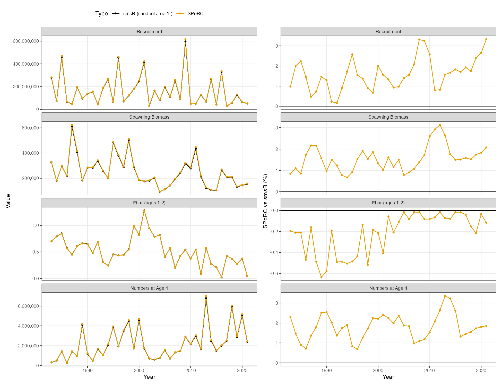

## Overview

This case study bridges `smsR`, the seasonal assessment model used for four
North Sea sandeel stocks and for sprat, into `SPoRC`. The stock is sandeel in
area 1r, 1983 to 2021, ages 0 to 4, two seasons, one region and one sex.

`smsR` is an ICES model rather than one of the US assessments the other case
studies here bridge, and it is built differently in two ways.
Fishing mortality is driven by an observed effort series rather than estimated
year by year, and there are no composition data at all: catch at age and survey
at age enter directly as lognormal observations, each age with its own
catchability and its own standard deviation.

`SPoRC` can fit both forms directly, so this reads as an ordinary specification
rather than a translation. Catch at age goes in through `ObsCatchAA` and the
survey through `ObsSrvIdxAA`, with observation error and age-specific
catchability. 

| Component | Years | Observations | Likelihood |
|---|---|---|---|
| Catch at age, ages 1 to 4, two seasons | 1983 to 2021 | 286 | Lognormal |
| Dredge survey, ages 0 to 1, season 2 | 2004 to 2021 | 36 | Lognormal |
| RTM survey, ages 1 to 3, season 1 | 2011 to 2020 | 30 | Lognormal |
| Recruitment deviations | 1983 to 2021 | 39 | Lognormal |

Because the model is single region and single sex, the population, region and
sex subscripts collapse to one and are dropped from the notation below. The
season subscript is retained in the following.

```{r, eval = FALSE}
library(SPoRC)
library(smsR)

yrs <- 1983:2021
n_yrs <- length(yrs)
ages <- 0:4
n_ages <- length(ages)
n_seas <- 2
lhs <- sandeel_1r$lhs
```

## Model dimensions

Two seasons of equal duration, one fishery fleet per season, and the two 
surveys. A fleet per season is what gives each season its own catch observation
error. 

```{r, eval = FALSE}
input_list <- Setup_Mod_Dim(
  n_pop = 1,
  years = yrs,
  ages = ages,
  lens = NA,
  n_regions = 1,
  n_sexes = 1,
  n_seas = n_seas,
  seasdur = c(0.5, 0.5),
  n_fish_fleets = 2,
  n_srv_fleets = 2,
  verbose = TRUE
)
```

## Recruitment

Recruitment is a mean with annual deviations. `smsR` treats its as
a hockey stick, but the population dynamics set recruitment to a free parameter
each year and the hockey stick enters only as a penalty on those deviations,
carrying a weight of 0.05.  Spawning is at the start of season 1 and recruits enter in season 2, one season
later. 

```{r, eval = FALSE}
input_list <- Setup_Mod_Rec(
  input_list = input_list,
  rec_model = "mean_rec",
  rec_lag = 1,
  spawn_seas = 1,
  t_spawn = 0,
  use_fixed_rec_seas_prop = 1,
  fixed_rec_seas_prop = matrix(c(0, 1), nrow = 1, ncol = n_seas),
  sigmaR_spec = "fix",
  do_rec_bias_ramp = 0,
  init_age_strc = "free",
  equil_init_age_strc = "equil",
  ln_global_R0 = log(2e8)
)

```

## Biological dynamics

`smsR` carries natural mortality as a free array over age, year and season.
`SPoRC` builds seasonal mortality as an annual rate scaled by season duration,
so a free seasonal array cannot currently represented. Setting the annual rate to the
sum over seasons preserves the annual trajectory exactly, because spawning
biomass is taken at the start of the spawning season and start of year numbers
depend only on annual totals. Only the within season split is approximated, and
that affects the observation layer rather than the trajectory.

The recruitment age needs separate handling. Age 0 fish do not exist until
season 2, so they are exposed to one season of mortality rather than two, and
their annual rate is set so that the realised exposure matches.

Maturity is doubled. `SPoRC` multiplies spawning biomass by 0.5 for single sex
models, on the reasoning that a single sex model represents both sexes combined,
whereas the `smsR` ogive already gives spawning biomass directly. Doubling
maturity cancels that convention and leaves the likelihood untouched. In a two
season model this factor is numerically identical to `seasdur[1]`, which is a
coincidence and not the reason it is there.

```{r, eval = FALSE}
# smsR carries its biologicals as [age, year, season]. SPoRC wants
# [pop, region, year, season, age, sex], the same numbers with three dimensions
# of length one, and one more for fleet on the weights a fleet sees.
WAA      <- array(0, dim = c(1, 1, n_yrs, n_seas, n_ages, 1))
MatAA    <- array(0, dim = c(1, 1, n_yrs, n_seas, n_ages, 1))
WAA_fish <- array(0, dim = c(1, 1, n_yrs, n_seas, n_ages, 1, 2))
WAA_srv  <- array(0, dim = c(1, 1, n_yrs, n_seas, n_ages, 1, 2))

for(y in 1:n_yrs) {
  for(seas in 1:n_seas) {
    WAA[1, 1, y, seas, , 1]   = lhs$west[, y, seas]   # stock weight at age
    MatAA[1, 1, y, seas, , 1] = lhs$mat[, y, seas]    # proportion mature at age
    for(f in 1:2) WAA_fish[1, 1, y, seas, , 1, f] = lhs$weca[, y, seas]  # catch weight
    for(k in 1:2) WAA_srv[1, 1, y, seas, , 1, k]  = lhs$west[, y, seas]
  } # end seas loop
} # end y loop

# smsR carries natural mortality by season; SPoRC scales an annual rate by season
# duration, so the annual sum preserves the annual trajectory...
M_sms <- lhs$M[, 1:n_yrs, ]
natmort <- array(0, dim = c(1, 1, n_yrs, n_ages, 1))
for(y in 1:n_yrs) {
  annual_M = M_sms[, y, 1] + M_sms[, y, 2]
  annual_M[1] = M_sms[1, y, 2] / 0.5   # age 0 is only present in season 2
  natmort[1, 1, y, , 1] = annual_M
} # end y loop

input_list <- Setup_Mod_Biologicals(
  input_list = input_list,
  WAA = WAA,
  WAA_fish = WAA_fish,
  WAA_srv = WAA_srv,
  MatAA = MatAA * 2, # cancels the single sex SSB halving in model dynamics 
  fit_lengths = 0,
  M_spec = "fix",
  Fixed_natmort = natmort,
  addtocomp = 1e-5
)
```

## Movement and tagging

Single region, so movement is an identity matrix and no tagging data are used.
However, both still have to be declared.

```{r, eval = FALSE}
input_list <- Setup_Mod_Movement(
  input_list = input_list,
  use_fixed_movement = 1,
  Fixed_Movement = NA,
  do_recruits_move = 0
)

input_list <- Setup_Mod_Tagging(input_list = input_list, use_conv_fish_tagging = 0)
```

## Catch and fishing mortality

The observation error is coupled by a key matrix over age and fleet, wjere
equal entries share a parameter and `NA` excludes one. `smsR` groups ages 1 and 2
against ages 3 and above, separately by season, which is four standard
deviations. With a fleet per season that is a plain age by fleet key. Age 0 is
never caught, so it is represented with an `NA`.

```{r, eval = FALSE}
# ages 1-2 and ages 3+ share a standard deviation, separately by season (fleets are defined as season x fishery fleet in this case to allow for seasonal selex)
sigmaCAA_key <- cbind(c(NA, 1, 1, 2, 2), c(NA, 3, 3, 4, 4))

nocatch <- as.matrix(sandeel_1r$nocatch)
ObsCatchAA <- UseCatchAA <- array(0, dim = c(1, n_yrs, n_seas, n_ages, 2))
for(y in 1:n_yrs) {
  for(s in 1:n_seas) {
    for(a in 2:n_ages) { # age 0 is not fished
      obs = sandeel_1r$Catch[a, y, s]
      if(!is.na(obs) && obs > 0 && nocatch[y, s] == 1) {
        ObsCatchAA[1, y, s, a, s] = obs
        UseCatchAA[1, y, s, a, s] = 1
      }
    } # end a loop
  } # end s loop
} # end y loop

input_list <- Setup_Mod_Catch_and_F(
  input_list = input_list,
  ObsCatch = array(0, dim = c(1, n_yrs, n_seas, 2)),
  UseCatch = array(0, dim = c(1, n_yrs, n_seas, 2)),
  ObsCatchAA = ObsCatchAA,
  UseCatchAA = UseCatchAA,
  sigmaCAA_key = sigmaCAA_key,
  sigmaCAA_spec = "est",
  catch_units = array("abd", dim = c(2)),
  Use_F_pen = 0,
  sigmaC_spec = "fix",
  sigmaF_spec = "fix"
)
```

A fleet fits the aggregated catch or the catch at age, never both. Supplying both
is an error rather than a warning: they are the same information stated twice,
and the factorisation of an at-age observation into a total and a composition is
exact for multinomial counts but not for the lognormal used here.

### Effort driven fishing mortality

`smsR` writes fishing mortality as a seasonal scale times a blocked age pattern
times observed effort:

$$F^{\text{smsR}}_{a,y,\tau} = E_{y,\tau} \cdot S_{a,b(y)} \cdot \exp(\mu_{\tau})$$

`SPoRC` builds it as selectivity times a mean and a deviation:

$$F_{a,y,\tau,f} = S_{a,b(y),f} \cdot \exp\!\left(\mu_{f} + \varepsilon_{y,\tau,f}\right)$$

where

| Symbol | Meaning | Here |
|---|---|---|
| $a$ | age | 0 to 4 |
| $y$ | year | 1983 to 2021 |
| $\tau$ | season | 1 or 2, each half a year |
| $f$ | fishery fleet | 1 or 2; fleet $f$ fishes season $f$ alone |
| $b(y)$ | the selectivity block year $y$ falls in | block 1 is 1983-1998, block 2 is 1999-2021 |
| $F_{a,y,\tau}$ | fishing mortality at age | what the two models have to agree on |
| $E_{y,\tau}$ | observed effort, a data series | median about 2100 |
| $S_{a,b(y)}$ | fishery selectivity at age, constant within a block | 6 estimated values |
| $\mu_{f}$ | log of the fleet's scale, `ln_F_mean` | 2 estimated values |
| $\varepsilon_{y,\tau,f}$ | fishing mortality deviation, `ln_F_devs` | held at $\log E_{y,\tau}$, not estimated |

Setting $\varepsilon_{y,\tau,f} = \log E_{y,\tau}$ and holding it there makes the
two identical, because $\exp(\mu + \log E) = E \exp(\mu)$.

Written that way $\exp(\mu_f)$ is a catchability. This is basically the effort model,

$$F = q E$$

with $q = \exp(\mu_f)$ scaling effort into fishing mortality and $S_{a,b(y)}$
spreading it over ages. The deviations hold data rather than
estimated quantities, so they are mapped off.

```{r, eval = FALSE}
effort <- sandeel_1r$effort
dev_dim <- dim(input_list$par$ln_F_devs)
ln_F_devs <- array(0, dim = dev_dim)
for(y in 1:dev_dim[2]) {
  for(seas in 1:dev_dim[3]) ln_F_devs[1, y, seas, ] = log(effort[y, seas])
} # end y loop

input_list$par$ln_F_devs <- ln_F_devs
input_list$map$ln_F_devs <- factor(array(NA, dim = dev_dim))
input_list$par$ln_F_mean[] <- -5 # starting values ... for 'q'
```

## Fishery selectivity

`smsR` zeroes fishing on age 0 through its age selectivity and shares selectivity across ages 3 and above. Both are
set through the selectivity map: age 0 held at a value giving zero selection, and
ages 3 and 4 sharing a parameter, in each of the two blocks.

Also, `smsR` writes its age pattern relative to a reference: ages 3 and above are the top of the curve
and the younger ages are ratios to them, with the overall level living in the
seasonal scale. To mimick this, we use a free non-parametric selectivity curve on log scale, without standardization:

$$S_{a,b} = \exp\!\left(\theta_{a,b}\right)$$

with $S_{a,b}$ the selectivity at age $a$ in block $b$ and $\theta_{a,b}$ the
estimated parameter behind it. Because nothing is divided out, $\theta = 0$ is a
selectivity of exactly one and a large negative $\theta$ is a selectivity of
zero, so both of the things `smsR` fixes are set by fixing $\theta$ rather than
by any extra machinery:

$$\theta_{0,b} = -10 \;\Rightarrow\; S_{0,b} \approx 0,
\qquad
\theta_{3,1} = \theta_{4,1} = 0 \;\Rightarrow\; S_{3,1} = S_{4,1} = 1$$

The first line is age 0, never fished. The second is block one's reference, held
at one so the level of fishing stays in $q$. Everything else is estimated, and
what it estimates is a ratio to that reference. Putting it together with the
effort model above, fishing mortality at age is

$$F_{a,y,\tau} = \underbrace{\exp\!\left(\theta_{a,b(y)}\right)}_{S_{a,b(y)}}
\; \underbrace{\exp\!\left(\mu_{f}\right)}_{q_{f}} \; E_{y,\tau}$$

There is no fishery index here, so that stream is declared empty.

```{r, eval = FALSE}
empty_fish <- list(
  ObsFishIdx = array(NA, dim = c(1, n_yrs, n_seas, 2)),
  ObsFishIdx_SE = array(NA, dim = c(1, n_yrs, n_seas, 2)),
  UseFishIdx = array(0, dim = c(1, n_yrs, n_seas, 2)),
  ObsFishAgeComps = array(0, dim = c(1, n_yrs, n_seas, n_ages, 1, 2)),
  UseFishAgeComps = array(0, dim = c(1, n_yrs, n_seas, 2)),
  ISS_FishAgeComps = array(0, dim = c(1, n_yrs, n_seas, 1, 2)),
  ObsFishLenComps = array(0, dim = c(1, n_yrs, n_seas, 1, 1, 2)),
  UseFishLenComps = array(0, dim = c(1, n_yrs, n_seas, 2)),
  ISS_FishLenComps = array(0, dim = c(1, n_yrs, n_seas, 1, 2)))

input_list <- do.call(Setup_Mod_FishIdx_and_Comps, c(
  list(input_list = input_list,
       fish_idx_type = rep("none", 2),
       FishAgeComps_LikeType = rep("none", 2),
       FishLenComps_LikeType = rep("none", 2),
       FishAgeComps_Type = c("agg_Year_1-terminal_Fleet_1", "agg_Year_1-terminal_Fleet_2"),
       FishLenComps_Type = c("agg_Year_1-terminal_Fleet_1", "agg_Year_1-terminal_Fleet_2")),
  empty_fish))

# non-parametric selectivity at age, two blocks, ages 3 and 4 grouped
input_list <- Setup_Mod_Fishsel_and_Q(
  input_list = input_list,
  cont_tv_fish_sel = c("none_Fleet_1", "none_Fleet_2"),
  fish_sel_blocks = c("Block_1_Year_1-16_Fleet_1", "Block_2_Year_17-terminal_Fleet_1",
                      "Block_1_Year_1-16_Fleet_2", "Block_2_Year_17-terminal_Fleet_2"),
  fish_sel_model = c("nonparfree_Fleet_1", "nonparfree_Fleet_2"),
  fish_q_blocks = c("none_Fleet_1", "none_Fleet_2"),
  fish_sel_nonpar_est_bins = rep(list(list(list(1, 2, 3, c(4, 5)), list(1, 2, 3, c(4, 5)))), 2),
  fish_fixed_sel_pars_spec = rep("est_all", 2),
  fish_q_spec = rep("fix", 2))

# Fishery selectivity is one value per age, per block, shared by the two season
# fleets because smsR's age pattern does not vary by season. 
sel_par <- rbind(block_1 = c(NA, 1L, 2L, NA, NA),
                 block_2 = c(NA, 3L, 4L, 5L, 5L))

# fish_fixed_sel_pars is [region, age, block, sex, fleet]. for "nonparfree" a
# value of 0 is a selectivity of one, and -10 is a selectivity of zero.
sel_start <- input_list$par$fish_fixed_sel_pars
sel_map <- array(NA_integer_, dim = dim(sel_start))
sel_start[1, , , 1, ] <- 0
sel_start[1, 1, , 1, ] <- -10                # age 0, never fished
for(b in 1:2) {
  for(f in 1:2) sel_map[1, , b, 1, f] <- sel_par[b, ]
} # end b loop

input_list$par$fish_fixed_sel_pars <- sel_start
input_list$map$fish_fixed_sel_pars <- factor(sel_map)
```

## Survey index

`smsR` fits each survey age as its own lognormal series with its own
catchability: the Dredge over ages 0 and 1 in season 2, the RTM over ages 1 to 3
in season 1, five catchabilities in total. `SPoRC` does that through
`ObsSrvIdxAA`.

Those five catchabilities do not need a parameter of their own. `smsR` predicts a
survey observation as

$$I_{a,y,k} = q_{a,k} \, N_{a,y} \, e^{-t_{k} Z_{a,y}}$$

with $I$ the index at age, $q_{a,k}$ a catchability estimated separately at every
age $a$ of survey $k$, $N$ the numbers at age, $t_{k}$ how far into its season the
survey happens, and $Z$ total mortality. `SPoRC` predicts the same thing as

$$I_{a,y,k} = S^{\text{Srv}}_{a,k} \, N_{a,y} \, e^{-t_{k} Z_{a,y}},
\qquad S^{\text{Srv}}_{a,k} = \exp\!\left(\theta^{\text{Srv}}_{a,k}\right)$$

which is the same equation with the age multiplier called selectivity instead of
catchability. A free catchability per age and a selectivity estimated at age are
one quantity written two ways, and estimating both would be estimating it twice.
So the age shape goes in selectivity, again through `"nonparfree"`, and there is
no age-specific $q$ at all:

$$q_{a,k} \;\equiv\; S^{\text{Srv}}_{a,k}$$

`srv_sel_nonpar_est_bins` then does the grouping a catchability key would, and an
age left out of the list gets no parameter, which is what an age a survey never
sees wants.

```{r, eval = FALSE}
# the Dredge runs in season 2 over ages 0-1, the RTM in season 1 over ages 1-3
srv_ages <- list(0:1, 1:3)
srv_seas <- c(2, 1)

ObsSrvIdxAA <- UseSrvIdxAA <- array(0, dim = c(1, n_yrs, n_seas, n_ages, 2))
for(k in 1:2) {
  for(a in srv_ages[[k]]) {
    arow = which(ages == a)
    for(y in 1:n_yrs) {
      obs = sandeel_1r$survey[arow, y, k]
      if(!is.na(obs) && obs > 0) {
        ObsSrvIdxAA[1, y, srv_seas[k], arow, k] = obs
        UseSrvIdxAA[1, y, srv_seas[k], arow, k] = 1
      }
    } # end y loop
  } # end a loop
} # end k loop

# smsR groups its survey standard deviations by age within a survey
sigmaSrvIdxAA_key <- array(NA, dim = c(n_ages, 2))
sigmaSrvIdxAA_key[2, 1] <- 1
sigmaSrvIdxAA_key[2, 2] <- 2
sigmaSrvIdxAA_key[3:4, 2] <- 3

# The Dredge's age-0 value is held rather than estimated. Age 0 appears in this
# one index and nowhere else, and the recruitment deviations are free, so they
# fit it exactly: the residual goes to zero and the likelihood is unbounded.
sigmaSrvIdxAA_start <- array(log(0.5), dim = c(n_ages, 2))
sigmaSrvIdxAA_start[1, 1] <- log(0.4052)   # smsR's own value

empty_srv <- list(
  ObsSrvAgeComps = array(0, dim = c(1, n_yrs, n_seas, n_ages, 1, 2)),
  UseSrvAgeComps = array(0, dim = c(1, n_yrs, n_seas, 2)),
  ISS_SrvAgeComps = array(0, dim = c(1, n_yrs, n_seas, 1, 2)),
  ObsSrvLenComps = array(0, dim = c(1, n_yrs, n_seas, 1, 1, 2)),
  UseSrvLenComps = array(0, dim = c(1, n_yrs, n_seas, 2)),
  ISS_SrvLenComps = array(0, dim = c(1, n_yrs, n_seas, 1, 2)))

input_list <- do.call(Setup_Mod_SrvIdx_and_Comps, c(
  list(input_list = input_list,
       ObsSrvIdx = array(NA, dim = c(1, n_yrs, n_seas, 2)),
       ObsSrvIdx_SE = array(0, dim = c(1, n_yrs, n_seas, 2)),
       UseSrvIdx = array(0, dim = c(1, n_yrs, n_seas, 2)),
       ObsSrvIdxAA = ObsSrvIdxAA,
       UseSrvIdxAA = UseSrvIdxAA,
       sigmaSrvIdxAA_key = sigmaSrvIdxAA_key,
       sigmaSrvIdxAA_spec = "est",
       ln_sigmaSrvIdxAA = sigmaSrvIdxAA_start,
       srv_idx_type = rep("abd", 2),
       SrvAgeComps_LikeType = rep("none", 2),
       SrvLenComps_LikeType = rep("none", 2),
       SrvAgeComps_Type = c("agg_Year_1-terminal_Fleet_1", "agg_Year_1-terminal_Fleet_2"),
       SrvLenComps_Type = c("agg_Year_1-terminal_Fleet_1", "agg_Year_1-terminal_Fleet_2")),
  empty_srv))

# each survey enters at its own point in its own season
t_srv <- array(0, dim = c(1, n_seas, 2))
for(k in 1:2) t_srv[1, srv_seas[k], k] <- c(0.75, 0)[k]

input_list <- Setup_Mod_Srvsel_and_Q(
  input_list = input_list,
  cont_tv_srv_sel = c("none_Fleet_1", "none_Fleet_2"),
  srv_sel_blocks = c("none_Fleet_1", "none_Fleet_2"),
  srv_sel_model = c("nonparfree_Fleet_1", "nonparfree_Fleet_2"),
  srv_q_blocks = c("none_Fleet_1", "none_Fleet_2"),
  # one value per age each survey observes: the Dredge ages 0-1, the RTM ages 1-3
  srv_sel_nonpar_est_bins = list(list(list(1, 2)), list(list(2, 3, 4))),
  srv_fixed_sel_pars_spec = rep("est_all", 2),
  srv_q_spec = rep("fix", 2),
  t_srv = t_srv)
```

## Weighting

Every likelihood component enters at weight one. The composition streams are
weighted zero because there are none, and the fishery index likewise.

```{r, eval = FALSE}
input_list <- Setup_Mod_Weighting(
  input_list = input_list,
  Wt_Catch = 1, Wt_FishIdx = 0, Wt_SrvIdx = 1, Wt_Rec = 1, Wt_F = 1, Wt_Tagging = 0,
  Wt_FishAgeComps = array(0, dim = c(1, n_yrs, n_seas, 1, 2)),
  Wt_FishLenComps = array(0, dim = c(1, n_yrs, n_seas, 1, 2)),
  Wt_SrvAgeComps = array(0, dim = c(1, n_yrs, n_seas, 1, 2)),
  Wt_SrvLenComps = array(0, dim = c(1, n_yrs, n_seas, 1, 2)))

```

## Fitting

The recruitment penalty has to be translated before the two models are asked to
find the same optimum. `smsR` penalises its deviations towards the hockey stick
at a weight of 0.05, set through `nllfactor`, with its recruitment standard
deviation estimated at 0.897, so the precision reaching the objective is
$0.05 / (2 \times 0.897^{2})$. `SPoRC` carries the weight and the standard
deviation separately, so the same statement at a weight of one needs
$\sigma_{R} = 4.013$. 

```{r, eval = FALSE}
input_list$par$ln_sigmaR[] <- log(4.0128) # matches nllfactor 0.05 at sigmaR 0.897
est <- fit_model(input_list$data, input_list$par, input_list$map,
                 random = NULL, newton_loops = 3, silent = F)
```

| Quantity | Correlation | Largest annual discrepancy |
|---|---|---|
| Spawning biomass | 0.9999 | 3.13 % |
| Recruitment | 0.9999 | 3.33 % |
| Numbers at ages 1 to 4 | 1.0000 | 3.01 to 3.43 % |
| Fbar, ages 1 and 2 | 1.0000 | 0.64 % |



## Discrepancies 

Some things still differ from the reference smsR model.

Seasonal natural mortality is approximated. `smsR` carries natural mortality
as a free array over age, year and season, whereas `SPoRC` scales an annual rate
by season duration. Setting the annual rate to the sum over seasons preserves the
annual trajectory, and only the within season split differs.

Also, the recruitment penalty is not the same statement. `smsR` penalises its
deviations towards a hockey stick at a weight of 0.05, while `SPoRC` assumes mean recruitment with some
annual deviations. 
