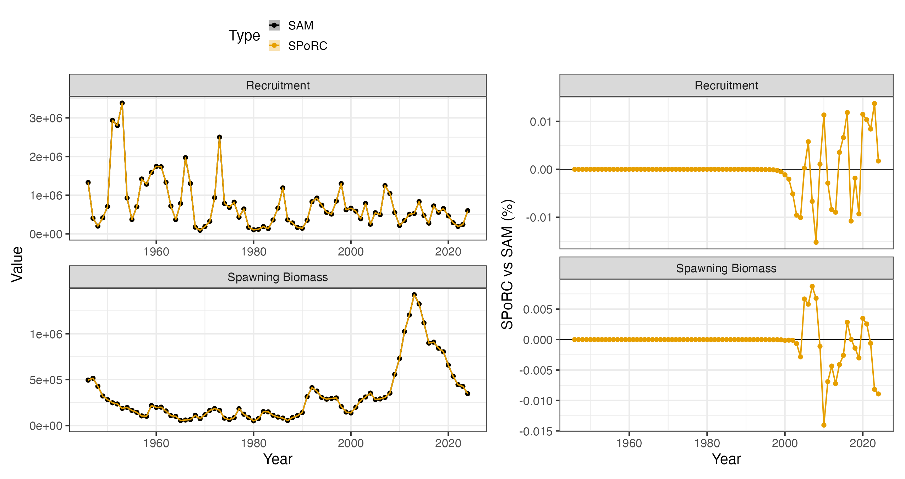
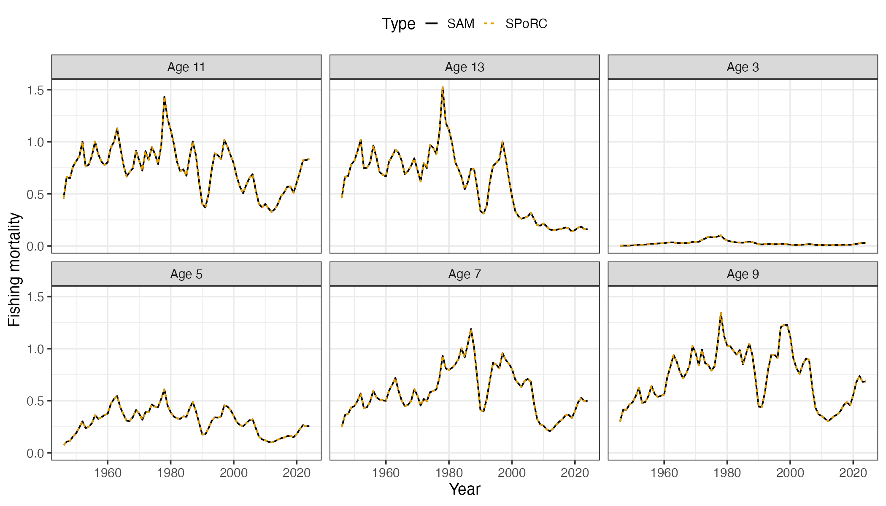
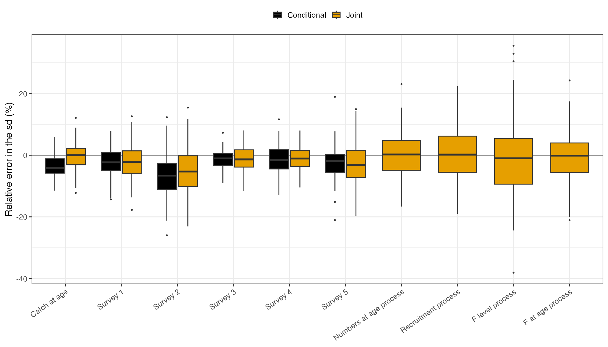

## Overview

This case study bridges the State-space Assessment Model (SAM), the model ICES uses
for many of its age-structured assessments, into `SPoRC` for Northeast Arctic cod. We
use the stock's input files from the ICES Arctic Fisheries Working Group, 1946 to
2024 at ages 3 to 15 with a plus group, fit through `samjr`, an R implementation of
SAM that returns the same fits as SAM itself, so that every number we compare against
is SAM's own.

SAM differs from the other assessments bridged in these case studies in three ways,
and each shapes a part of the specification below. There are no composition data:
catch at age and survey indices at age enter directly as lognormal observations, each
age with its own catchability in the surveys. Fishing mortality is not a product of an
annual level and a selectivity curve but a separate log F for each age, and these
follow correlated random walks through time. Finally, numbers at age are themselves a
state, so that survival from one age to the next is subject to process error rather
than being a deterministic consequence of mortality. `SPoRC` fits catch and survey
indices at age directly, and holds the numbers at age, recruitment, fishing mortality
and selectivity as random effects, so the specification reads as an ordinary one rather
than a translation.

| Component | Years | Ages | Observations | Likelihood |
|---|---|---|---|---|
| Catch at age | 1946 to 2023 | 3 to 15 | 1,002 | Lognormal |
| Norwegian bottom trawl survey, first series | 1981 to 2013 | 3 to 12 | 290 | Lognormal |
| Norwegian bottom trawl survey, second series | 2014 to 2024 | 3 to 12 | 110 | Lognormal |
| Norwegian acoustic survey | 1985 to 2024 | 3 to 12 | 383 | Lognormal |
| Russian swept area survey | 1982 to 2017 | 3 to 12 | 336 | Lognormal |
| Ecosystem survey | 2004 to 2023 | 3 to 12 | 170 | Lognormal |

SAM integrates out the 293 observations that are missing inside an otherwise observed
year and age range, so that they contribute nothing to its likelihood, and we
therefore leave them out of the fit rather than treating them as zeros. In the
following, we first walk through the specification in the order of the setup calls,
then compare the fit with SAM's, and finally use a self test to ask whether the model
recovers what it estimates when it is given data it generated itself.

```{r, eval = FALSE}
library(SPoRC)

d <- sgl_rg_neacod_data$inputs
sam <- sgl_rg_neacod_data$sam
years <- d$years
ages <- d$ages
n_yrs <- d$n_yrs
n_ages <- d$n_ages
n_srv <- d$n_srv_fleets
```

## Model dimensions

The stock is a single population in a single region, with one sex and one season,
since SAM fits the year as one time step. The five surveys are each their own fleet,
and the catch is one fleet.

```{r, eval = FALSE}
input_list <- Setup_Mod_Dim(
  n_pop = 1,
  years = years,
  ages = ages,
  lens = NA,
  n_regions = 1,
  n_sexes = 1,
  n_seas = 1,
  n_fish_fleets = 1,
  n_srv_fleets = n_srv,
  verbose = FALSE
)
```

## Recruitment

SAM has no stock-recruitment relationship. Recruitment at age 3 follows a random walk
on the log scale, the first year is free of any penalty, and there is no bias
correction. We therefore fit recruitment deviations as a random walk with the first
deviation unpenalized, keep the mean recruitment fixed so that the deviations hold
recruitment outright, and read the walk's standard deviation from the second of the two
recruitment variability parameters. The initial numbers at age are free parameters in
SAM, so they are estimated here without a penalty, and spawning is on January 1, since
SAM's proportions of fishing and natural mortality before spawning are zero for this
stock.

```{r, eval = FALSE}
input_list <- Setup_Mod_Rec(
  input_list,
  rec_model = "mean_rec",
  RecDevs_model = "rw",
  dont_pen_recdev_first = 1,
  sigmaR_spec = "fix_early_est_late",
  sigmaR_switch = 1,
  do_rec_bias_ramp = 0,
  init_age_strc = "free",
  equil_init_age_strc = "stoch_all_no_pen",
  t_spawn = 0,
  ln_global_R0_spec = "fix",
  ln_global_R0 = sam$logN[1, 1]
)
```

## Biological dynamics

Weight, maturity and natural mortality at age come directly from the ICES files and
are fixed. The survival process is where SAM differs most from a conventional
assessment: the log numbers at age in each year are the previous year's survivors plus
an independent normal deviation with one standard deviation shared across ages, so a
cohort can gain or lose fish beyond what natural and fishing mortality account for. In
`SPoRC` this is the state-space numbers at age, applied to every age above the first
and every year after the first, with a single process standard deviation across ages.

```{r, eval = FALSE}
input_list <- Setup_Mod_Biologicals(
  input_list,
  WAA = d$WAA,
  WAA_fish = d$WAA_fish,
  WAA_srv = d$WAA_srv,
  MatAA = d$MatAA,
  fit_lengths = 0,
  M_spec = "fix",
  Fixed_natmort = d$natmort,
  NAA_re = "iid",
  NAA_re_ages = ages[-1],
  NAA_re_years = years[-1],
  NAA_sigma_spec = "est",
  NAA_sigma_ageblk_spec_vals = list(seq_len(n_ages))
)
```

## Movement and tagging

There is one region and no tagging data.

```{r, eval = FALSE}
input_list <- Setup_Mod_Movement(input_list, use_fixed_movement = 1, do_recruits_move = 0, Fixed_Movement = NA)
input_list <- Setup_Mod_Tagging(input_list, use_conv_fish_tagging = 0)
```

## Catch and fishing mortality

The catch at age is the whole of the fishery likelihood, so the aggregate catch is
left out. We supply it as missing rather than as zero, which is what keeps the fleet
fishing in every year: a zero would be read as a closure. Each age is a lognormal
observation about the predicted catch at age, and the observation error key gives the
catch one standard deviation across all ages, as SAM's key does for this stock.

Fishing mortality is where the two models are written differently. SAM estimates a
log F for each age and year, and the year to year changes are correlated across ages
with compound symmetry, meaning every pair of ages shares the same correlation.
`SPoRC` writes log F at age as an annual level plus a selectivity at age, and when both
follow random walks the change in log F at an age is the sum of a change shared by
every age and a change of its own. The changes then have variance
$\sigma_F^2 + \sigma_s^2$ and covariance $\sigma_F^2$ between any two ages, which is
compound symmetry with $\text{sd}_F^2 = \sigma_F^2 + \sigma_s^2$ and
$\rho = \sigma_F^2 / \text{sd}_F^2$, where $\sigma_F$ is the standard deviation of the
annual level's walk and $\sigma_s$ that of each age's own walk. We therefore fix the
mean of the annual level at zero and let the two walks hold log F at age between them.
The identity holds for the likelihood once the random effects are integrated out, which
is the quantity both models maximize.

```{r, eval = FALSE}
input_list <- Setup_Mod_Catch_and_F(
  input_list,
  ObsCatch = array(NA, dim = c(1, n_yrs, 1, 1)),
  UseCatch = array(0, dim = c(1, n_yrs, 1, 1)),
  catch_units = "abd",
  ObsCatchAA = d$ObsCatchAA,
  UseCatchAA = d$UseCatchAA,
  CatchAA_LikeType = "lognormal",
  CatchAA_Type = "spltRaggS",
  sigmaCAA_key = d$sigmaCAA_key,
  sigmaCAA_spec = "est",
  sigmaC_spec = "fix",
  ln_F_mean_spec = "fix",
  Fdev_model = "rw",
  sigmaF_spec = "est_all",
  Use_F_pen = 1
)
```

There is no fishery index or fishery composition, so those are switched off.

```{r, eval = FALSE}
input_list <- Setup_Mod_FishIdx_and_Comps(
  input_list,
  ObsFishIdx = array(1, dim = c(1, n_yrs, 1, 1)),
  ObsFishIdx_SE = array(0.1, dim = c(1, n_yrs, 1, 1)),
  UseFishIdx = array(0, dim = c(1, n_yrs, 1, 1)),
  ObsFishAgeComps = array(0, dim = c(1, n_yrs, 1, n_ages, 1, 1)),
  UseFishAgeComps = array(0, dim = c(1, n_yrs, 1, 1)),
  ISS_FishAgeComps = array(0, dim = c(1, n_yrs, 1, 1, 1)),
  ObsFishLenComps = array(0, dim = c(1, n_yrs, 1, 1, 1, 1)),
  UseFishLenComps = array(0, dim = c(1, n_yrs, 1, 1)),
  ISS_FishLenComps = array(0, dim = c(1, n_yrs, 1, 1, 1)),
  fish_idx_type = "none",
  FishAgeComps_LikeType = "none",
  FishLenComps_LikeType = "none",
  FishAgeComps_Type = "none_Year_1-terminal_Fleet_1",
  FishLenComps_Type = "none_Year_1-terminal_Fleet_1"
)
```

## Survey index at age

Each survey index at age is a lognormal observation about the survey's catchability at
that age times the numbers available at the time of the survey, which is the fraction
of the year elapsed when the survey takes place, so the Russian swept area survey late
in the year sees cohorts after most of a year's mortality while the Norwegian surveys in
the first quarter see them early. The observation error key gives each survey one
standard deviation across its ages. As for the catch, the aggregate index is switched
off, since the observations at age are the whole of the survey likelihood.

```{r, eval = FALSE}
input_list <- Setup_Mod_SrvIdx_and_Comps(
  input_list,
  ObsSrvIdx = array(1, dim = c(1, n_yrs, 1, n_srv)),
  ObsSrvIdx_SE = array(0.1, dim = c(1, n_yrs, 1, n_srv)),
  UseSrvIdx = array(0, dim = c(1, n_yrs, 1, n_srv)),
  ObsSrvIdxAA = d$ObsSrvIdxAA,
  UseSrvIdxAA = d$UseSrvIdxAA,
  SrvIdxAA_LikeType = "lognormal",
  SrvIdxAA_Type = "spltRaggS",
  sigmaSrvIdxAA_key = d$sigmaSrvIdxAA_key,
  sigmaSrvIdxAA_spec = "est",
  ObsSrvAgeComps = array(0, dim = c(1, n_yrs, 1, n_ages, 1, n_srv)),
  UseSrvAgeComps = array(0, dim = c(1, n_yrs, 1, n_srv)),
  ISS_SrvAgeComps = array(0, dim = c(1, n_yrs, 1, 1, n_srv)),
  ObsSrvLenComps = array(0, dim = c(1, n_yrs, 1, 1, 1, n_srv)),
  UseSrvLenComps = array(0, dim = c(1, n_yrs, 1, n_srv)),
  ISS_SrvLenComps = array(0, dim = c(1, n_yrs, 1, 1, n_srv)),
  srv_idx_type = c("none", "none", "none", "none", "none"),
  SrvAgeComps_LikeType = c("none", "none", "none", "none", "none"),
  SrvLenComps_LikeType = c("none", "none", "none", "none", "none"),
  SrvAgeComps_Type = c("none_Year_1-terminal_Fleet_1", "none_Year_1-terminal_Fleet_2", "none_Year_1-terminal_Fleet_3",
                       "none_Year_1-terminal_Fleet_4", "none_Year_1-terminal_Fleet_5"),
  SrvLenComps_Type = c("none_Year_1-terminal_Fleet_1", "none_Year_1-terminal_Fleet_2", "none_Year_1-terminal_Fleet_3",
                       "none_Year_1-terminal_Fleet_4", "none_Year_1-terminal_Fleet_5")
)
```

## Fishery selectivity

The selectivity is free at each age on the log scale, so together with the annual
level it holds log F at age outright, and it walks through time as described above. SAM
couples the F states of ages 14 and 15, which we reproduce by sharing both the
selectivity value and its walk between those two ages; sharing one without the other
would let the coupled ages walk apart. The first year's log F at age sits in the base
selectivity values rather than in the walk, which matches SAM's first F state.

```{r, eval = FALSE}
fish_bin_groups <- list(1, 2, 3, 4, 5, 6, 7, 8, 9, 10, 11, 12:13)
input_list <- Setup_Mod_Fishsel_and_Q(
  input_list,
  fish_sel_model = "nonparfree_Fleet_1",
  fish_sel_blocks = "none_Fleet_1",
  fish_q_blocks = "none_Fleet_1",
  fish_fixed_sel_pars_spec = "est_all",
  fish_q_spec = "fix",
  fish_sel_nonpar_est_bins = list(list(fish_bin_groups)),
  cont_tv_fish_sel = "rw_Fleet_1",
  fishsel_pe_pars_spec = "est_shared_b",
  fish_sel_devs_spec = "est_shared_b",
  fishsel_devs_shared_bins = fish_bin_groups,
  fishsel_dont_est_dev_first = 1
)
```

## Survey selectivity

SAM gives each survey its own catchability at each age, with ages 11 and 12 sharing
one value. In `SPoRC` this is a free selectivity at age with catchability fixed at one,
so that the selectivity value at an age is that age's log catchability. Ages 13 to 15
are never observed by the surveys and share the value of the oldest observed ages,
which leaves them without any influence on the fit.

```{r, eval = FALSE}
srv_bin_groups <- list(1, 2, 3, 4, 5, 6, 7, 8, 9:13)
input_list <- Setup_Mod_Srvsel_and_Q(
  input_list,
  srv_sel_model = c("nonparfree_Fleet_1", "nonparfree_Fleet_2", "nonparfree_Fleet_3", "nonparfree_Fleet_4", "nonparfree_Fleet_5"),
  srv_sel_blocks = c("none_Fleet_1", "none_Fleet_2", "none_Fleet_3", "none_Fleet_4", "none_Fleet_5"),
  srv_q_blocks = c("none_Fleet_1", "none_Fleet_2", "none_Fleet_3", "none_Fleet_4", "none_Fleet_5"),
  srv_fixed_sel_pars_spec = c("est_all", "est_all", "est_all", "est_all", "est_all"),
  srv_q_spec = c("fix", "fix", "fix", "fix", "fix"),
  cont_tv_srv_sel = c("none_Fleet_1", "none_Fleet_2", "none_Fleet_3", "none_Fleet_4", "none_Fleet_5"),
  srv_sel_nonpar_est_bins = list(list(srv_bin_groups), list(srv_bin_groups), list(srv_bin_groups),
                                 list(srv_bin_groups), list(srv_bin_groups)),
  t_srv = array(d$srv_time, dim = c(1, 1, n_srv))
)
```

## Weighting

Every likelihood component enters with a weight of one. By default `SPoRC` adds a
small constant inside the logarithm of an index to protect against zeros, but SAM adds
nothing, and the smallest survey indices for this stock are small enough that the
constant moves the likelihood in the sixth decimal place, so we set it to zero.

```{r, eval = FALSE}
input_list <- Setup_Mod_Weighting(
  input_list,
  Wt_Catch = 1,
  Wt_FishIdx = 1,
  Wt_SrvIdx = 1,
  Wt_Rec = 1,
  Wt_F = 1,
  Wt_Tagging = 0,
  addtosrvidx = 0,
  addtofishidx = 0,
  Wt_FishAgeComps = array(1, dim = c(1, n_yrs, 1, 1, 1)),
  Wt_FishLenComps = array(1, dim = c(1, n_yrs, 1, 1, 1)),
  Wt_SrvAgeComps = array(1, dim = c(1, n_yrs, 1, 1, n_srv)),
  Wt_SrvLenComps = array(1, dim = c(1, n_yrs, 1, 1, n_srv))
)
```

## Starting at the SAM estimate

We start the fit at SAM's estimate, which shortens the fit considerably but does not
change where it ends. The first year's log F at age goes in the base selectivity
values and later years enter as their difference from it. SAM's F standard deviation
and correlation are split into the two walk standard deviations through the identity
above, the survey catchabilities at age become the survey selectivity values, and the
states are seeded at SAM's numbers at age and recruitment.

```{r, eval = FALSE}
input_list$par$ln_F_mean[] <- 0
input_list$par$ln_F_devs[] <- 0
input_list$par$fish_fixed_sel_pars[1, , 1, 1, 1] <- sam$logFF[1, ]
for(y in 2:n_yrs) input_list$par$ln_fishsel_devs[1, y, , 1, 1] <- sam$logFF[y, ] - sam$logFF[1, ]

sd_F <- exp(sam$logsdF[1])
input_list$par$ln_sigmaF[] <- log(sd_F * sqrt(sam$rho)) # change shared by every age
input_list$par$fishsel_pe_pars[1, , 1, 1] <- log(sd_F * sqrt(1 - sam$rho)) # change each age has alone

input_list$par$ln_srv_q[] <- 0
for(sf in 1:n_srv) {
  q_idx <- d$srv_q_key[, sf]
  q_idx[is.na(q_idx)] <- max(q_idx, na.rm = TRUE) # unobserved ages read the oldest observed one
  input_list$par$srv_fixed_sel_pars[1, , 1, 1, sf] <- sam$logQ[q_idx]
}

input_list$par$ln_sigmaCAA[] <- sam$logSdLogObs[1]
for(sf in 1:n_srv) input_list$par$ln_sigmaSrvIdxAA[, 1, sf] <- sam$logSdLogObs[1 + sf]
input_list$par$ln_sigmaNAA[] <- sam$logSdLogN[2]
input_list$par$ln_sigmaR[2, 1, 1] <- sam$logSdLogN[1]
input_list$par$ln_InitDevs[1, 1, , 1] <- sam$logN[1, 2:n_ages]
input_list$par$ln_NAA[1, 1, , 1, , 1] <- sam$logN
input_list$par$ln_RecDevs[] <- 0
for(y in 2:n_yrs) input_list$par$ln_RecDevs[1, 1, y] <- sam$logN[y, 1] - sam$logN[1, 1]
```

## Fitting and comparison

SAM treats its first year of log F at age as a random effect with a flat prior, so we
integrate the base selectivity values out along with the numbers at age, the
recruitment deviations, the initial numbers at age and both F walks. Left as fixed
effects instead, these twelve values cost 3.99 negative log likelihood units, although
spawning biomass, recruitment and mean F move by less than 0.02 percent.

```{r, eval = FALSE}
re_names <- c("ln_NAA", "ln_RecDevs", "ln_InitDevs", "ln_fishsel_devs", "ln_F_devs", "fish_fixed_sel_pars")
fit <- fit_model(input_list$data, input_list$par, input_list$map, random = re_names,
                 do_optim = TRUE, newton_loops = 3, silent = TRUE)
sd_rep <- RTMB::sdreport(fit, getJointPrecision = TRUE) # the joint self test draws its parameters from this
```

The fit reproduces SAM's marginal negative log likelihood, 1859.782559 in both, with
a maximum gradient of about $10^{-9}$ and a positive definite Hessian over 55 fixed
effects and 2,054 random effects. Spawning biomass, recruitment and fishing mortality at
age agree with SAM's to the precision of either optimizer. Note that `SPoRC` reports
female spawning biomass, which with one sex and an even sex ratio is half of the
spawning biomass SAM reports, and the SAM series below is halved to match.





## Self test

A bridge shows that the two models compute the same thing; a self test asks a
different question, namely whether the fitted model, given data generated by itself,
returns the quantities it estimates. We simulate from the fitted model, refit each
simulated data set, and compare the estimates with the values the simulation ran on.
Specifically, we use two designs. In the conditional simulation design, the parameters and the numbers at age,
recruitment and fishing mortality are kept at the fit's estimates, so only the
observations are new, and the self test measures how well the observations determine
the population. In the joint simulation design, each replicate first draws its parameters from the
fit's joint uncertainty (the precision of the fixed and random effects together) and
then draws every new processes at those parameters, so each replicate is a new
population history with parameters of its own, and the self test also measures whether
the process standard deviations are recovered.

```{r, eval = FALSE}
what <- c("SSB", "Rec", "tot_FAA")
what_par <- c("ln_sigmaCAA", "ln_sigmaSrvIdxAA", "ln_sigmaNAA", "ln_sigmaR", "ln_sigmaF", "fishsel_pe_pars")

# conditional simulations: observations drawn about the fit's own population
st_cond <- simulation_self_test(data = fit$data, parameters = input_list$par, mapping = input_list$map,
                                random = re_names, rep = fit$rep, sd_rep = sd_rep, n_sims = 50,
                                what = what, what_par = what_par)

# joint simulation: parameters drawn from the fit's joint precision, then every process drawn new each time,
# with enough replicates to read a bias of about one percent
st_joint <- simulation_self_test(data = fit$data, parameters = input_list$par, mapping = input_list$map,
                                 random = re_names, rep = fit$rep, sd_rep = sd_rep, obj = fit, n_sims = 150,
                                 sim_type = "joint", what = what, what_par = what_par)

# both designs again with the observation error made negligible, standard deviations of 0.001
st_perfect <- simulation_self_test(data = fit$data, parameters = input_list$par, mapping = input_list$map,
                                   random = re_names, rep = fit$rep, sd_rep = sd_rep, n_sims = 3,
                                   perfect_data = TRUE, what = what, what_par = what_par)
st_perfect_joint <- simulation_self_test(data = fit$data, parameters = input_list$par, mapping = input_list$map,
                                         random = re_names, rep = fit$rep, sd_rep = sd_rep, obj = fit, n_sims = 5,
                                         perfect_data = TRUE, sim_type = "joint", what = what, what_par = what_par)

# each replicate compared with the population it ran on
rel_err <- (st_joint$SSB - st_joint$truth$SSB) / st_joint$truth$SSB
```

Under the conditional design spawning biomass, recruitment and mean F at ages 5 to 10
are recovered without bias, and so are the observation and F standard deviations, but
the two population process standard deviations come back slightly low. In theory, this is what
conditional simulations should give: the replicates share the fit's estimates of the deviations,
which are shrunk toward zero and vary less than the fitted standard deviation
describes. Thus, looking at this using the joint design, nearly every replicate refits, recruitment and mean
F are unbiased, and all four process standard deviations are recovered. The survey
standard deviations come back a little low, likely due to the small-sample bias of a MLE variance, and spawning biomass a little low because it is reported at the mode of the log numbers at age, which sits below their mean, most of all for the plus group, whose fish are the least observed and make up most of the spawning biomass; an
epsilon bias corrected estimate removes it (in theory). Nonetheless, neither biases comes from a disagreement between the operating and estimation models. With the observation error made negligible the
process standard deviations return to their true values under the joint design and
spawning biomass is generally unbiased under both. 



