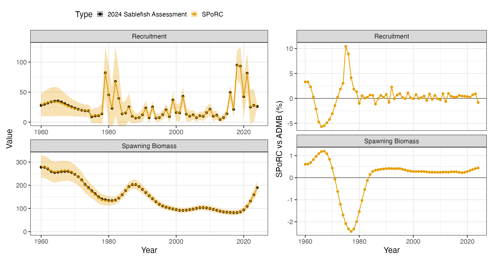

```{r, include = FALSE}
knitr::opts_chunk$set(
  collapse = TRUE,
  comment = "#>",
  eval = FALSE
)
```

## Overview

This case study sets up the 2024 federal Alaska sablefish stock assessment in
`SPoRC` and compares it against the operational ADMB model (`tem.tpl`). Unlike
the [eastern Bering Sea pollock case study](f_single_region_ebs_pollock_case_study.html),
which is an exact bridge, this one is a *close* bridge: the population dynamics
and most likelihood components correspond one to one, but a handful of
conventions in `tem.tpl` have no counterpart in `SPoRC` and are deliberately not
reproduced. Those are enumerated in
[Where the two models differ](#where-the-two-models-differ), and they are the
reason the two trajectories are close rather than identical.

The 2024 assessment treats sablefish on an Alaska-wide scale, from the Bering
Sea to the Eastern Gulf of Alaska, as a panmictic single-region model:

| Dimension | Value |
|---|---|
| Regions | 1 (panmictic, Bering Sea through Eastern Gulf of Alaska) |
| Years | 1960--2024 |
| Ages | 2--31 (30 age classes, plus group at 31) |
| Sexes | 2 (female, male) |
| Fishery fleets | 2 (fixed gear, trawl) |
| Survey fleets | 3 (domestic longline, domestic trawl, cooperative Japanese longline) |

Because the model is single region and single population, the $p$, $r$ and
$\tau$ subscripts of the [model equations](c_model_equations.html) all collapse
to one and are dropped from the notation below. The sex subscript $s$ is
retained, since sablefish is sex structured.

Everything the case study needs ships with the package in `sgl_rg_sable_data`.
The companion script that produced the figures below is
`dev/make_sporc_obj_figs/make_sgl_rg_sablefish_bridge_figs.R`, and the data
container itself is built by
`dev/make_sporc_obj_figs/make_sgl_rg_sabie_data_object.R`.

```{r setup, warning = FALSE, message = FALSE, eval = TRUE}
library(SPoRC)
library(here)
library(RTMB)
library(ggplot2)
data("sgl_rg_sable_data")

dat <- sgl_rg_sable_data
n_yrs <- length(dat$years)
n_ages <- length(dat$ages)
```

## Model dimensions

`Setup_Mod_Dim` builds the input list that every subsequent helper updates: a
data list, a parameter list, and a mapping list. Note that years and ages are
passed as *indices* rather than calendar values here, which is why the year
vector runs `1:65` rather than `1960:2024`.

```{r Setup Model Dimensions, message = FALSE}
input_list <- Setup_Mod_Dim(
  years = 1:length(dat$years),      # 1960-2024
  ages = 1:length(dat$ages),        # ages 2-31
  lens = seq(41, 99, 2),            # length bins
  n_regions = 1,
  n_sexes = dat$n_sexes,            # 1 = female, 2 = male
  n_fish_fleets = dat$n_fish_fleets, # 1 = fixed gear, 2 = trawl
  n_srv_fleets = dat$n_srv_fleets,
  n_pop = dat$n_pop,
  verbose = FALSE
)
```

## Recruitment

Sablefish assumes no stock recruit relationship. Recruitment arises about a mean
parameter $\mu^{\text{Rec}}$ with lognormal annual deviations, split evenly
between the sexes:

$$N_{y,a=1,s} = \mu^{\text{Rec}}\exp\left(\epsilon^{\text{Rec}}_{y} - \dfrac{\sigma^{2}_{\text{Rec},y}}{2}b_{y}\right)\psi_{s},\qquad \psi_{s} = 0.5$$

Two features of this expression carry most of the setup. The first is
$\sigma_{\text{Rec},y}$, which is not constant: the assessment uses an early
period value fixed at $0.4$ and a late period value that switches on in 1976,

$$\sigma_{\text{Rec},y} = \begin{cases} 0.4, & y < 1976\\ \sigma^{\text{late}}_{\text{Rec}}, & y \geq 1976\end{cases}$$

which is `sigmaR_switch` together with `sigmaR_spec = "fix_early_est_late"`. The
late value is estimated here to follow the assessment, though in practice it is
weakly informed and fixing it is the more defensible choice.

The second is $b_{y}$, the Methot and Taylor (2011) bias correction ramp. It
rises from zero over an early window, sits at its maximum through the
data-rich period, and descends again as recent cohorts become poorly observed:

$$b_{y} = \begin{cases}
0, & y < y^{\text{start}}\\
b^{\max}\dfrac{y - y^{\text{start}}}{y^{\text{full}} - y^{\text{start}}}, & y^{\text{start}} \leq y < y^{\text{full}}\\
b^{\max}, & y^{\text{full}} \leq y < y^{\text{last}}\\
b^{\max}\left(1 - \dfrac{y - y^{\text{last}}}{y^{\text{end}} - y^{\text{last}}}\right), & y \geq y^{\text{last}}
\end{cases}$$

The four breakpoints are supplied through `bias_year`. **These are indexed in
deviation-index space, not calendar years.** Passing calendar years leaves every
range empty and silently gives $b_{y} = 0$ throughout, which removes the bias
correction without any warning.

Initial age structure is a geometric series (`init_age_strc = 1`) depleted by a
historical fishing mortality:

$$N^{'}_{a,s} = \mu^{\text{Rec}}\exp\left(-(a-1)Z^{'}_{a,s} + \epsilon^{\text{Init}}_{a} - \dfrac{\sigma_{\text{Rec}}^{2}}{2}b\right)\psi_{s},\qquad Z^{'}_{a,s} = M_{a,s} + F^{\text{Init}}\,\text{Sel}^{\text{Fsh}}_{a,s,f=1}$$

with the plus group accumulated as a closed geometric sum. The 2024 assessment
builds its historical rate as `hist_hal_prop * exp(log_avg_F_fish1)`, a fixed
proportion of the fixed-gear mean fishing mortality, which is exactly
`init_F_form = "prop"` with `init_F_spec = "fix"`:

$$F^{\text{Init}} = \text{logit}^{-1}\left(\theta^{\text{Init}}\right)\exp\left(\mu^{\text{Fsh}}_{f=1}\right),\qquad \text{logit}^{-1}\left(\theta^{\text{Init}}\right) = 0.1$$

The `"prop"` form matters: because $F^{\text{Init}}$ moves with
$\mu^{\text{Fsh}}$, a single parameter both depletes the initial age structure
and scales the F series. That is the assessment's own construction, so it is
reproduced here, but `"abs"` is the better choice when a model's historical F is
conceptually independent of the mean F of the modeled period.

```{r Setup Recruitment, message = FALSE}
input_list <- Setup_Mod_Rec(
  input_list = input_list,
  rec_model = "mean_rec",
  do_rec_bias_ramp = 1,
  # bias_year is in DEV-INDEX space, not calendar years. The four breakpoints
  # are the start of the ascending limb, the start of full correction, the start
  # of the descending limb, and the last estimated deviation.
  bias_year = c(length(1960:1979),
                length(1960:1989),
                (length(1960:2023) - 5),
                length(1960:2024) - 2) + 1,
  sigmaR_switch = as.integer(length(1960:1975)),
  ln_sigmaR = array(log(c(0.4, 1.2)), dim = c(2, input_list$data$n_pop, input_list$data$n_regions)),
  sigmaR_spec = "fix_early_est_late",
  dont_est_recdev_last = 1,
  init_age_strc = 1,
  # hist_hal_F is a fixed proportion of the fixed-gear mean F in tem.tpl
  init_F_form = "prop",
  init_F_spec = "fix",
  init_F_par = array(stats::qlogis(0.1), dim = c(input_list$data$n_regions,
                                                 input_list$data$n_seas,
                                                 input_list$data$n_fish_fleets))
)
```

## Biological dynamics

Natural mortality is sex specific and fixed. The 2024 assessment estimates it
under a lognormal prior, with males carrying an offset $\delta^{M}$ from the
female value, but that offset has no direct counterpart in `SPoRC`, so both
values are fixed at the assessment's estimates instead:

$$M_{s} = \begin{cases} 0.1134156, & s = \text{female}\\ 0.1052175, & s = \text{male}\end{cases}$$

Spawning biomass is female only, evaluated at the spawning point within the
year:

$$\text{SSB}_{y} = \sum_{a} N_{y,a,s=1}\exp\left(-t^{\text{spawn}}Z_{y,a,s=1}\right)W_{y,a,s=1}\,\text{Mat}_{y,a}$$

Composition data are fit as both ages and lengths, so a size-age transition
matrix converts numbers at age to numbers at length, and an ageing error matrix
smears the expected age compositions before they reach the likelihood.

```{r Setup Biologicals, message = FALSE}
fixed_natmort <- array(0, dim = c(input_list$data$n_pop,
                                  input_list$data$n_regions,
                                  n_yrs, n_ages, input_list$data$n_sexes))
fixed_natmort[,,,,1] <- 0.1134156 # female M
fixed_natmort[,,,,2] <- 0.1052175 # male M

input_list <- Setup_Mod_Biologicals(
  input_list = input_list,
  WAA = dat$WAA,
  MatAA = dat$MatAA,
  AgeingError = as.matrix(dat$age_error),
  SizeAgeTrans = dat$SizeAgeTrans,
  Use_M_prior = 0,
  fit_lengths = 1,
  M_spec = "fix",
  Fixed_natmort = fixed_natmort
)
```

## Movement and tagging

The model is panmictic, so movement is an identity matrix and no tagging data
are used. Both still have to be declared.

```{r Setup Movement, message = FALSE}
input_list <- Setup_Mod_Movement(
  input_list = input_list,
  use_fixed_movement = 1,
  Fixed_Movement = NA,
  do_recruits_move = 0
)

input_list <- Setup_Mod_Tagging(
  input_list = input_list,
  use_conv_fish_tagging = rep(0, input_list$data$n_fish_fleets)
)
```

## Catch and fishing mortality

Fishing mortality is a mean rate with annual deviations, and catch is fit
lognormally:

$$\log F_{y,f} = \mu^{\text{Fsh}}_{f} + \epsilon^{F}_{y,f},\qquad \ell^{F} = \lambda^{F}\sum_{y}\sum_{f}\dfrac{\left(\epsilon^{F}_{y,f}\right)^{2}}{2\sigma_{F}^{2}}$$

The 2024 assessment writes both its catch and its F penalty as unweighted sums
of squares, `wt_ssqcatch * norm2(log(obs) - log(pred))` and
`wt_fmort_reg * norm2(log_F_devs)`. Setting $\sigma = 1/\sqrt{2}$ makes
$1/(2\sigma^{2}) = 1$, so `SPoRC`'s Gaussian form collapses to exactly that sum
of squares and the assessment's weights carry over unchanged as `Wt_Catch = 50`
and `Wt_F = 0.1`.

```{r Setup Catch and Fishing Mortality, message = FALSE}
input_list <- Setup_Mod_Catch_and_F(
  input_list = input_list,
  ObsCatch = dat$ObsCatch,
  UseCatch = dat$UseCatch,
  Use_F_pen = 1,
  sigmaC_spec = 'fix',
  sigmaF_spec = "fix",
  # sigma = 1/sqrt(2) makes 1/(2 sigma^2) = 1, so the Gaussian reduces to the
  # assessment's unweighted norm2 and its lambdas transfer directly.
  ln_sigmaC = array(log(sqrt(1/2)), dim = c(input_list$data$n_regions, n_yrs,
                                            input_list$data$n_seas,
                                            input_list$data$n_fish_fleets)),
  ln_sigmaF = array(log(sqrt(1/2)), dim = c(input_list$data$n_regions,
                                            input_list$data$n_seas,
                                            input_list$data$n_fish_fleets))
)
```

## Fishery index and compositions

Indices are fit lognormally. The 2024 assessment divides by the *coefficient of
variation* rather than the standard error,

$$\ell^{\text{Idx}} = \lambda^{\text{Idx}}\sum_{y}\dfrac{\left(\log I^{\text{obs}}_{y} - \log I^{\text{pred}}_{y}\right)^{2}}{2\,\text{CV}_{y}^{2}},\qquad \text{CV}_{y} = \dfrac{\text{SE}_{y}}{I^{\text{obs}}_{y}}$$

which is why the standard errors are passed as `ObsFishIdx_SE / ObsFishIdx`.
Passing the raw standard errors instead would weight the index by a factor of
$I^{\text{obs}}$ too many and effectively remove it from the fit.

Compositions are multinomial. Sablefish is sex structured but its *age*
compositions are not sex specific, so fishery ages are aggregated across sexes
(`agg`), meaning the expected proportions are summed over sexes before being
compared to the observations. Length compositions *are* sex specific and are fit
as `spltRspltS`, which normalizes each sex to sum to one separately, so no
implicit sex ratio is inferred from them.

Only the fixed-gear fleet has an index and age compositions; both fleets have
length compositions.

```{r Setup Fishery Indices and Compositions, message = FALSE}
input_list <- Setup_Mod_FishIdx_and_Comps(
  input_list = input_list,
  ObsFishIdx = dat$ObsFishIdx,
  # tem.tpl divides by the CV, not the SE
  ObsFishIdx_SE = dat$ObsFishIdx_SE / dat$ObsFishIdx,
  UseFishIdx = dat$UseFishIdx,
  ObsFishAgeComps = dat$ObsFishAgeComps,
  UseFishAgeComps = dat$UseFishAgeComps,
  ISS_FishAgeComps = dat$ISS_FishAgeComps,
  ObsFishLenComps = dat$ObsFishLenComps,
  UseFishLenComps = dat$UseFishLenComps,
  ISS_FishLenComps = dat$ISS_FishLenComps,
  fish_idx_type = c("biom", "none"),
  FishAgeComps_LikeType = c("Multinomial", "none"),
  FishLenComps_LikeType = c("Multinomial", "Multinomial"),
  # ages aggregate over sexes; lengths are split by sex
  FishAgeComps_Type = c("agg_Year_1-terminal_Fleet_1",
                        "none_Year_1-terminal_Fleet_2"),
  FishLenComps_Type = c("spltRspltS_Year_1-terminal_Fleet_1",
                        "spltRspltS_Year_1-terminal_Fleet_2")
)
```

## Survey indices and compositions

The three survey fleets are the domestic longline survey (abundance), the
domestic trawl survey (biomass), and the cooperative Japanese longline survey
(abundance). Age compositions are available for the two longline surveys and
aggregate over sexes; length compositions are available for all three and split
by sex. Surveys are timed halfway through the year, matching `tem.tpl`'s use of
mid-year survival $S^{\text{mid}}$ in its predicted indices:

$$I^{\text{pred}}_{y,f} = q_{f}\sum_{a}\sum_{s} N_{y,a,s}\exp\left(-0.5\,Z_{y,a,s}\right)\text{Sel}^{\text{Srv}}_{a,s,f}\,W_{y,a,s}$$

```{r Setup Survey Indices and Compositions, message = FALSE}
input_list <- Setup_Mod_SrvIdx_and_Comps(
  input_list = input_list,
  ObsSrvIdx = dat$ObsSrvIdx,
  ObsSrvIdx_SE = dat$ObsSrvIdx_SE / dat$ObsSrvIdx,
  UseSrvIdx = dat$UseSrvIdx,
  ObsSrvAgeComps = dat$ObsSrvAgeComps,
  ISS_SrvAgeComps = dat$ISS_SrvAgeComps,
  UseSrvAgeComps = dat$UseSrvAgeComps,
  ObsSrvLenComps = dat$ObsSrvLenComps,
  UseSrvLenComps = dat$UseSrvLenComps,
  ISS_SrvLenComps = dat$ISS_SrvLenComps,
  srv_idx_type = c("abd", "biom", "abd"),
  SrvAgeComps_LikeType = c("Multinomial", "none", "Multinomial"),
  SrvLenComps_LikeType = c("Multinomial", "Multinomial", "Multinomial"),
  SrvAgeComps_Type = c("agg_Year_1-terminal_Fleet_1",
                       "none_Year_1-terminal_Fleet_2",
                       "agg_Year_1-terminal_Fleet_3"),
  SrvLenComps_Type = c("spltRspltS_Year_1-terminal_Fleet_1",
                       "spltRspltS_Year_1-terminal_Fleet_2",
                       "spltRspltS_Year_1-terminal_Fleet_3")
)
```

## Fishery selectivity and catchability

The fixed-gear fleet is logistic, parameterized by the age at 50% selection and
a slope:

$$\text{Sel}^{\text{Fsh}}_{a,s,f=1} = \dfrac{1}{1 + \exp\left[-k_{s}\left(a - a^{50}_{s}\right)\right]}$$

and carries three time blocks, 1960--1994, 1995--2015, and 2016--2024,
reflecting the shift from the pre-IFQ fishery through the IFQ era. Catchability
is blocked on the same boundaries.

The trawl fleet is dome shaped, using the reparameterized gamma form in which
$a^{\max}$ is the age at maximum selection and $\gamma$ controls the steepness
of the descending limb:

$$p = \tfrac{1}{2}\left[\sqrt{\left(a^{\max}\right)^{2} + 4\gamma^{2}} - a^{\max}\right],\qquad \text{Sel}^{\text{Fsh}}_{a,s,f=2} = \left(\dfrac{a}{a^{\max}}\right)^{a^{\max}/p}\exp\left(\dfrac{a^{\max} - a}{p}\right)$$

Parameter sharing across sexes and blocks stabilizes the fit and cannot be
expressed through the `_spec` arguments, so the map is set by hand afterwards.
The first fixed-gear block shares its slope between sexes; the trawl fleet
shares parameters across all blocks.

```{r Setup Fishery Selectivity and Catchability, message = FALSE}
input_list <- Setup_Mod_Fishsel_and_Q(
  input_list = input_list,
  cont_tv_fish_sel = c("none_Fleet_1", "none_Fleet_2"),
  fish_sel_blocks = c("Block_1_Year_1-35_Fleet_1",
                      "Block_2_Year_36-56_Fleet_1",
                      "Block_3_Year_57-terminal_Fleet_1",
                      "none_Fleet_2"),
  fish_sel_model = c("logist1_Fleet_1", "gamma_Fleet_2"),
  fish_q_blocks = c("Block_1_Year_1-35_Fleet_1",
                    "Block_2_Year_36-56_Fleet_1",
                    "Block_3_Year_57-terminal_Fleet_1",
                    "none_Fleet_2"),
  fish_fixed_sel_pars_spec = c("est_all", "est_all"),
  fish_q_spec = c("est_all", "fix")
)

# share the slope across sexes in the early fixed-gear block
input_list$map$fish_fixed_sel_pars <- factor(c(1:7, 2, 8:11, rep(12:13, 3), rep(c(14, 13), 3)))
```

## Survey selectivity and catchability

The domestic longline survey is logistic with two time blocks, split at 2016.
The trawl survey uses a power function, a single-parameter descending form,

$$\text{Sel}^{\text{Srv}}_{a,s,f=2} = \dfrac{1}{a^{\phi_{s}}}$$

and the cooperative Japanese longline survey is logistic with its parameters
*fixed* at the assessment's values, since it ended in 1994 and is only weakly
informed by the remaining data. Its slope parameters are shared with the
domestic longline survey.

```{r Setup Survey Selectivity and Catchability, message = FALSE}
input_list <- Setup_Mod_Srvsel_and_Q(
  input_list = input_list,
  cont_tv_srv_sel = c("none_Fleet_1", "none_Fleet_2", "none_Fleet_3"),
  srv_sel_blocks = c("Block_1_Year_1-56_Fleet_1",
                     "Block_2_Year_57-terminal_Fleet_1",
                     "none_Fleet_2",
                     "none_Fleet_3"),
  srv_sel_model = c("logist1_Fleet_1", "exponential_Fleet_2", "logist1_Fleet_3"),
  srv_q_blocks = c("none_Fleet_1", "none_Fleet_2", "none_Fleet_3"),
  srv_fixed_sel_pars_spec = c("est_all", "est_all", "est_all"),
  srv_q_spec = c("est_all", "est_all", "est_all"),
  # tem.tpl predicts survey indices from mid-year survival
  t_srv = array(0.5, dim = c(input_list$data$n_regions,
                             input_list$data$n_seas,
                             input_list$data$n_srv_fleets))
)

# Longline survey slopes (indices 2 and 5) are shared across time blocks and
# with the cooperative Japanese survey, which estimates nothing of its own. The
# trawl survey's power function has a single parameter per sex (indices 7, 8).
input_list$map$srv_fixed_sel_pars <-
  factor(c(1:3, 2, 4:6, 5, rep(7, 4),
           rep(8, 4), rep(c(NA, 2), 2), rep(c(NA, 5), 2)))

# Cooperative Japanese survey logistic parameters, held at the 2024 values
input_list$par$srv_fixed_sel_pars[1,,,1,3] <- c(0.980660760456, 0.9295241)
input_list$par$srv_fixed_sel_pars[1,,,2,3] <- c(1.22224502478, 0.8821623)
```

## Weighting

Data sources carry a $\lambda$ weight that multiplies the whole component
likelihood, on top of the observed standard errors and input sample sizes
already supplied. For compositions these come from Francis reweighting; the
values below are the 2024 assessment's converged weights.

```{r Setup Weighting, message = FALSE}
dim_comps <- function(n_fleets) {
  array(NA, dim = c(input_list$data$n_regions, n_yrs, input_list$data$n_seas,
                    input_list$data$n_sexes, n_fleets))
}

Wt_FishAgeComps <- dim_comps(input_list$data$n_fish_fleets)
Wt_FishAgeComps[1,,,1,1] <- 0.826107286513784   # fixed gear ages

Wt_FishLenComps <- dim_comps(input_list$data$n_fish_fleets)
Wt_FishLenComps[1,,,1,1] <- 4.1837057381917     # fixed gear lengths, female
Wt_FishLenComps[1,,,2,1] <- 4.26969350917589    # fixed gear lengths, male
Wt_FishLenComps[1,,,1,2] <- 0.316485920691651   # trawl lengths, female
Wt_FishLenComps[1,,,2,2] <- 0.229396580680981   # trawl lengths, male

Wt_SrvAgeComps <- dim_comps(input_list$data$n_srv_fleets)
Wt_SrvAgeComps[1,,,1,1] <- 3.79224544725927     # domestic longline ages
Wt_SrvAgeComps[1,,,1,3] <- 1.31681114024037     # cooperative Japanese ages

Wt_SrvLenComps <- dim_comps(input_list$data$n_srv_fleets)
Wt_SrvLenComps[1,,,1,1] <- 1.43792019016567     # domestic longline, female
Wt_SrvLenComps[1,,,2,1] <- 1.07053763450712     # domestic longline, male
Wt_SrvLenComps[1,,,1,2] <- 0.670883273592302    # domestic trawl, female
Wt_SrvLenComps[1,,,2,2] <- 0.465207132450763    # domestic trawl, male
Wt_SrvLenComps[1,,,1,3] <- 1.27772810174693     # cooperative Japanese, female
Wt_SrvLenComps[1,,,2,3] <- 0.857519546948587    # cooperative Japanese, male

input_list <- Setup_Mod_Weighting(
  input_list = input_list,
  Wt_Catch = 50,
  Wt_FishIdx = 0.448,
  Wt_SrvIdx = 0.448,
  Wt_Rec = 1.5,
  Wt_F = 0.1,
  Wt_Tagging = 0,
  Wt_FishAgeComps = Wt_FishAgeComps,
  Wt_FishLenComps = Wt_FishLenComps,
  Wt_SrvAgeComps = Wt_SrvAgeComps,
  Wt_SrvLenComps = Wt_SrvLenComps
)
```

## Fitting

`fit_model` extracts the three lists and calls `MakeADFun` internally. The
`newton_loops` argument takes additional Newton steps using the Hessian and
gradient after the main optimizer converges, which serves as a convergence
check as well as a refinement.

```{r Fit Model, message = FALSE}
data <- input_list$data
parameters <- input_list$par
mapping <- input_list$map

sabie_rtmb_model <- fit_model(data, parameters, mapping,
                              random = NULL, newton_loops = 3, silent = TRUE)

sabie_rtmb_model$sd_rep <- RTMB::sdreport(sabie_rtmb_model)
```

## Comparison against the 2024 assessment

Because this is a single-population, single-region model, `SSB` and `Rec` are
dimensioned $n_{\text{pop}} \times n_{r} \times n_{y}$ and coerce to a vector
directly.

```{r Compare Models, message = FALSE}
ts_df <- rbind(
  data.frame(Par = "Spawning Biomass", Year = 1960:2024,
             RTMB = as.vector(sabie_rtmb_model$rep$SSB),
             ADMB = dat$admb_spbiom),
  data.frame(Par = "Recruitment", Year = 1960:2024,
             RTMB = as.vector(sabie_rtmb_model$rep$Rec),
             ADMB = dat$admb_recr)
)

ts_df$pct_diff <- 100 * (ts_df$RTMB - ts_df$ADMB) / ts_df$ADMB
```

| Quantity | Median difference | Maximum difference |
|---|---|---|
| Spawning biomass | $0.28$ % | $2.4$ % |
| Recruitment | $0.31$ % | $10.4$ % |

The joint negative log likelihood converges to $4411.99$ with a maximum
absolute gradient of $6\times10^{-12}$. The largest recruitment differences sit
in individual strong year classes, where a small shift in a deviation moves
that single year without moving the trajectory; spawning biomass, which
integrates over ages, stays within $2.4$ percent everywhere.



## Where the two models differ

The 2024 assessment estimates a single $\log M$ under a lognormal prior and adds a male offset $\delta^{M}$, optionally with annual and age deviations.
`SPoRC` parameterizes sex-specific natural mortality directly rather than as an
offset, so an exact match to the prior structure is not available. Both values
are therefore fixed at the assessment's estimates, which removes $M$ from the
comparison entirely rather than leaving it as an uncontrolled difference.

## References

Francis, R.I.C.C. 2011. Data weighting in statistical fisheries stock assessment
models. *Canadian Journal of Fisheries and Aquatic Sciences* 68: 1124--1138.

Methot, R.D., and Taylor, I.G. 2011. Adjusting for bias due to variability of
estimated recruitments in fishery assessment models. *Canadian Journal of
Fisheries and Aquatic Sciences* 68: 1744--1760.
