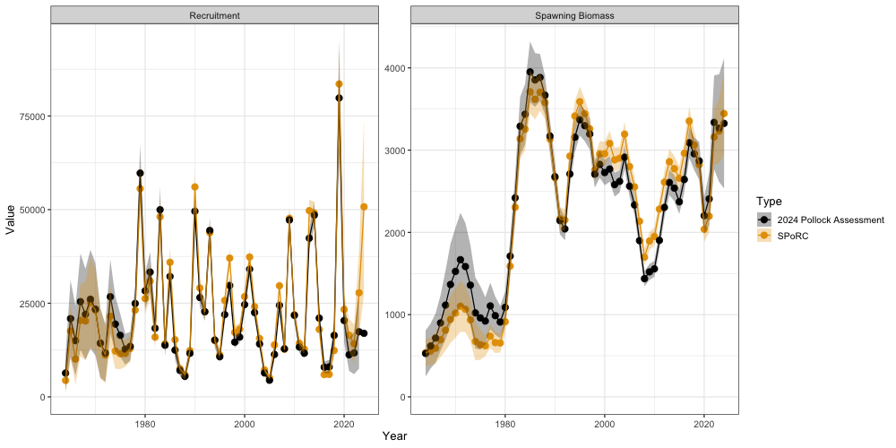
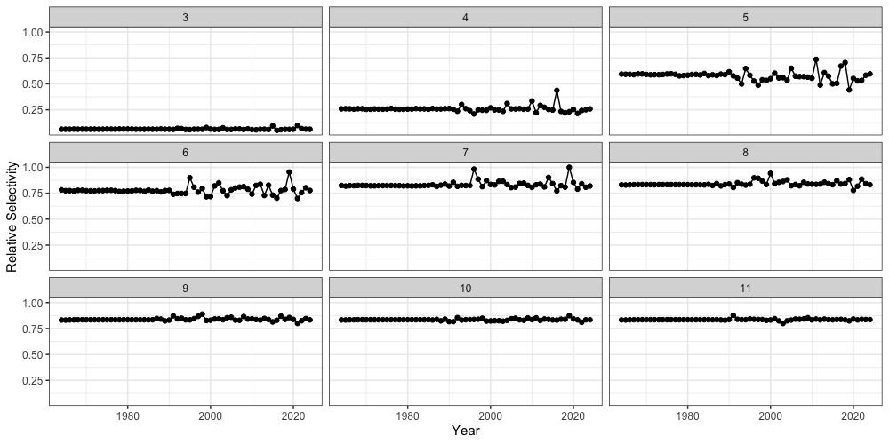

```{r, include = FALSE}
knitr::opts_chunk$set(
  collapse = TRUE,
  comment = "#>",
  eval = FALSE
)
```

## Overview

This case study reproduces the 2024 eastern Bering Sea walleye pollock
assessment in `SPoRC`. Every structural choice below follows the
assessment rather than `SPoRC`'s defaults, and the result is an exact bridge:
spawning biomass and recruitment agree with the ADMB model to within
$4\times10^{-6}$ percent, and the joint negative log likelihood is unchanged
between the two.

The model is single region, single sex, single season, with one fishery fleet
and four survey indices:

| Index | Source | Likelihood | Selectivity |
|---|---|---|---|
| Fishery CPUE | Early fishery catch rates, 1965--1976 | Normal | Fishery |
| Bottom trawl (BTS) | Shelf bottom trawl survey, 1982-- | Multivariate normal | Logistic, time varying, with a free age 1 |
| Acoustic trawl (ATS) | Acoustic trawl survey, 1994-- | Lognormal | Non-parametric, random walk |
| Vessel of opportunity (AVO) | Acoustic backscatter, 2006-- | Normal | Shared with the acoustic survey |
| Acoustic age 1 | Age 1 numbers from the acoustic survey | Lognormal | Shared with the acoustic survey |

The last of these is not a fifth survey. The pollock assessment fits the
acoustic survey's age 1 abundance as its own likelihood component
(`ats_age1_like`) with its own catchability, separate from the acoustic biomass
index and from its age composition. `SPoRC` attaches one index to one survey
fleet, so reproducing that component requires a fourth survey fleet restricted
to age 1.

Everything the case study needs, including the ADMB output it is compared
against, ships with the package in `sgl_rg_ebswp_data`. The companion script
that produced the figures below is
`dev/make_sporc_obj_figs/make_ebs_pollock_bridge_figs.R`, and the container
itself is built by `dev/make_sporc_obj_figs/make_ebs_pollock_data_object.R`.

```{r setup, eval = TRUE, warning = FALSE, message = FALSE}
library(SPoRC)
library(dplyr)
library(ggplot2)
data("sgl_rg_ebswp_data")

dat <- sgl_rg_ebswp_data
yrs <- dat$years
n_yrs <- length(yrs)
n_ages <- length(dat$ages)
n_srv <- dat$n_srv_fleets
```

The object carries three kinds of content: the model inputs
(`ObsCatch`, `WAA`, `ObsSrvIdx`, and so on), the ADMB maximum likelihood
estimate in `dat$mle`, used both as a starting point and to verify the
objective before any optimization, and the ADMB output in `dat$admb`, which is
the comparison target.

```{r, eval = TRUE}
names(dat$mle)
names(dat$admb)
```

## Model dimensions

Because the model is single region and single sex, the population, region,
season and sex subscripts used in the model equations all collapse to one, and
are dropped from the notation below.

```{r}
input_list <- Setup_Mod_Dim(
  years = yrs,
  ages = dat$ages,
  lens = NA,
  n_regions = dat$n_regions,
  n_sexes = dat$n_sexes,
  n_fish_fleets = dat$n_fish_fleets,
  n_srv_fleets = n_srv,
  n_seas = dat$n_seas,
  n_pop = dat$n_pop,
  natal_region = dat$natal_region,
  verbose = FALSE
)
```

## Recruitment

Pollock recruitment follows a Ricker stock recruit relationship with a one year
lag, so recruitment in year $y$ depends on spawning biomass in year $y-1$:

$$\text{Rec}_{y} = \alpha \text{SSB}_{y-1} \exp\left(-\beta \text{SSB}_{y-1}\right)\exp\left(\epsilon_{y}^{\text{Rec}} - \dfrac{\sigma_{R}^{2}}{2}\right)$$

with $\alpha$ and $\beta$ reparameterised through steepness $h$ and unfished
recruitment $R_0$. Steepness is estimated under a beta prior. In the 2024
assessment that
prior sits on the unrescaled $(0,1)$ support and is symmetric, so its centre is
$0.5$ rather than the $0.6$ its `steepnessprior` constant declares:

$$h \sim \text{Beta}\left(\mu = 0.5,\ \sigma = 0.09\right)$$

Three separate penalties act on recruitment, each with its own variance. The
stock recruit residuals are penalised over the years 1978 to 2022, excluding
1979:

$$\ell^{\text{Rec}} = \sum_{y \in \mathcal{Y}^{\text{SR}}} \dfrac{\left(\epsilon_{y}^{\text{Rec}}\right)^{2}}{2\sigma_{R}^{2}},\qquad \sigma_{R} = 1$$

The initial numbers at age carry weight $0.1$ and the recruitment level weight
$1$, which map onto $\sigma = 1/\sqrt{2w}$. The second recruitment statement is
a sum of squares on all log recruitments about their own mean:

$$\ell^{\text{RecLevel}} = \sum_{y} \dfrac{\left(\log \text{Rec}_{y} - \overline{\log \text{Rec}}\right)^{2}}{2\sigma^{2}},\qquad \sigma = 1/\sqrt{2}$$

Initial numbers at age are free parameters (`init_age_strc = 4`) rather than
derived from an equilibrium, and their penalty is centred on their own mean.

```{r}
inv_steepness <- function(s) qlogis((s - 0.2) / 0.8)

input_list <- Setup_Mod_Rec(
  input_list = input_list,
  # SR_ref_yr points spawning biomass per recruit at terminal year biologicals,
  # which is what the assessment's unfished spawning biomass uses.
  rec_model = "ricker_rec",
  rec_lag = 1,
  SR_ref_yr = n_yrs,
  # do_rec_bias_ramp = 0 sets the ramp to 1 throughout, so the recruitment
  # penalty is centred on -sigmaR^2/2, which is the assessment's +sigmaRsq/2 on the
  # residual.
  do_rec_bias_ramp = 0,
  sigmaR_switch = 1,
  sigmaR_spec = "fix",
  # The stock recruit residuals use sigr, fixed at 1. The initial ages carry
  # weight 0.1, which is sigma = 1/sqrt(2w).
  ln_sigmaR = array(c(log(1 / sqrt(0.2)), log(1)), dim = c(2, 1, 1)),
  init_age_strc = 4,
  equil_init_age_strc = 2,
  RecDevs_pen_center = "fixed",
  InitDevs_pen_center = "own_mean",
  ln_global_R0 = dat$mle$ln_global_R0,
  t_spawn = (4 - 1) / 12,
  use_rinit = 0,
  dont_est_recdev_last = 0,
  steepness_h = array(inv_steepness(dat$mle$steepness), dim = c(1, 1)),
  h_spec = "est_shared_pop_r",
  Use_h_prior = 1,
  h_prior = data.frame(pop = 1, region = 1, mu = 0.5, sd = 0.09, lb = 0, ub = 1),
  Use_rec_level_pen = 1,
  rec_level_pen_sigma = 1 / sqrt(2),
  rec_level_pen_center = "own_mean"
)
```

## Biological dynamics

Natural mortality is fixed and age specific:

$$M_{a} = \begin{cases} 0.9, & a = 1\\ 0.45, & a = 2\\ 0.3, & a \geq 3 \end{cases}$$

The assessment carries a different weight at age matrix for spawning biomass,
for catch, and for each survey index, which `SPoRC` supports through `WAA`,
`WAA_fish` and `WAA_srv`. Spawning biomass is therefore

$$\text{SSB}_{y} = \sum_{a} N_{y,a}\exp\left(-t^{\text{spawn}} Z_{y,a}\right) \text{WAA}_{y,a}\,\text{MatAA}_{a}$$

with spawning in March, $t^{\text{spawn}} = 3/12$.

Two composition conventions matter here. The 2024 assessment weights the
multinomial by the
*raw* observed composition and places its constant inside the logarithm only,
which is `comp_const_obs = 0`. `SPoRC`'s default instead weights by
$\text{obs} + \text{const}$, which is the unbiased choice since its stationary
point is $p = \text{obs}$, but it is a different model: on this bridge it moves
estimated spawning biomass by a median of 8.8 percent.

```{r}
fix_natmort <- array(0, dim = c(1, 1, n_yrs, n_ages, 1))
fix_natmort[, , , 1, ] <- 0.9
fix_natmort[, , , 2, ] <- 0.45
fix_natmort[, , , -c(1, 2), ] <- 0.3

input_list <- Setup_Mod_Biologicals(
  input_list = input_list,
  WAA = dat$WAA,
  WAA_fish = dat$WAA_fish,
  WAA_srv = dat$WAA_srv,
  MatAA = dat$MatAA,
  fit_lengths = 0,
  M_spec = "fix",
  Fixed_natmort = fix_natmort,
  # addtocomp must stay strictly positive, since at zero the offset term
  # evaluates 0*log(0).
  addtocomp = 1e-3,
  comp_const_obs = 0,
  addtosrvidx = 0.01,
  addtofishidx = 0
)
```

## Movement and tagging

The model is single region, so movement is an identity matrix and no tagging
data are used. Both still have to be declared.

```{r}
input_list <- Setup_Mod_Movement(
  input_list = input_list,
  use_fixed_movement = 1,
  Fixed_Movement = NA,
  do_recruits_move = 0
)

input_list <- Setup_Mod_Tagging(input_list = input_list, use_conv_fish_tagging = 0)
```

## Catch and fishing mortality

The 2024 assessment has no mean fishing mortality parameter: $\log F_y$ is a free annual
value penalised about its own mean. In `SPoRC` that is `ln_F_mean_spec = "fix"`,
which pins the mean at zero and maps it off so the deviations carry all of
$\log F$, together with `Fdev_pen_center = "own_mean"`:

$$\log F_{y} = \mu^{\text{Fsh}} + \epsilon_{y}^{F},\qquad \mu^{\text{Fsh}} \equiv 0$$

$$\ell^{F} = \sum_{y}\dfrac{\left(\epsilon_{y}^{F} - \overline{\epsilon^{F}}\right)^{2}}{2\sigma_{F}^{2}},\qquad \sigma_{F} = 1/\sqrt{2}$$

Catch is fit lognormally with a fixed standard deviation of $0.05$.

```{r}
input_list <- Setup_Mod_Catch_and_F(
  input_list = input_list,
  ObsCatch = dat$ObsCatch,
  UseCatch = dat$UseCatch,
  Use_F_pen = 1,
  Fdev_model = "iid",
  Fdev_pen_center = "own_mean",
  ln_F_mean_spec = "fix",
  sigmaF_spec = "fix",
  ln_sigmaF = array(log(1 / sqrt(2)), dim = c(1, 1, 1)),
  sigmaC_spec = "fix",
  ln_sigmaC = array(log(0.05), dim = c(1, n_yrs, 1, 1))
)
```

## Fishery index and compositions

The early fishery CPUE series covers twelve years and is fit on the arithmetic
scale with a normal likelihood. Fishery age compositions are multinomial.

```{r}
input_list <- Setup_Mod_FishIdx_and_Comps(
  input_list = input_list,
  ObsFishIdx = dat$ObsFishIdx,
  ObsFishIdx_SE = dat$ObsFishIdx_SE,
  UseFishIdx = dat$UseFishIdx,
  ObsFishAgeComps = dat$ObsFishAgeComps,
  UseFishAgeComps = dat$UseFishAgeComps,
  ISS_FishAgeComps = dat$ISS_FishAgeComps,
  ObsFishLenComps = array(NA_real_, dim = c(1, n_yrs, 1, length(input_list$data$lens), 1, 1)),
  UseFishLenComps = array(0, dim = c(1, n_yrs, 1, 1)),
  ISS_FishLenComps = array(0, dim = c(1, n_yrs, 1, 1, 1)),
  fish_idx_type = "biom",
  FishIdx_LikeType = "normal",
  FishAgeComps_LikeType = "Multinomial",
  FishLenComps_LikeType = "none",
  FishAgeComps_Type = "agg_Year_1-terminal_Fleet_1",
  FishLenComps_Type = "none_Year_1-terminal_Fleet_1"
)
```

## Survey indices and compositions

Each survey index has its own error structure. The bottom trawl index is fit
with a full covariance matrix, which enters as

$$\ell^{\text{BTS}} = \tfrac{1}{2}\left(\mathbf{I}^{\text{obs}} - \mathbf{I}^{\text{pred}}\right)^{\!\top}\mathbf{\Sigma}^{-1}\left(\mathbf{I}^{\text{obs}} - \mathbf{I}^{\text{pred}}\right)$$

with $\mathbf{\Sigma}$ supplied through `SrvIdx_Cov`. The acoustic index and the
age 1 index are lognormal, and the vessel of opportunity index is normal.

Two indexing conventions are needed here. `srv_idx_ages` restricts fleet 4 to
age 1, which is what makes it the age 1 index rather than a biomass index. And
the 2024 assessment normalises the acoustic compositions over ages 2--15 only, which is
`SrvAgeComps_bins`.

```{r}
input_list <- Setup_Mod_SrvIdx_and_Comps(
  input_list = input_list,
  ObsSrvIdx = dat$ObsSrvIdx,
  ObsSrvIdx_SE = dat$ObsSrvIdx_SE,
  UseSrvIdx = dat$UseSrvIdx,
  ObsSrvAgeComps = dat$ObsSrvAgeComps,
  ISS_SrvAgeComps = dat$ISS_SrvAgeComps,
  UseSrvAgeComps = dat$UseSrvAgeComps,
  ObsSrvLenComps = array(NA_real_, dim = c(1, n_yrs, 1, length(input_list$data$lens), 1, n_srv)),
  UseSrvLenComps = array(0, dim = c(1, n_yrs, 1, n_srv)),
  ISS_SrvLenComps = array(0, dim = c(1, n_yrs, 1, 1, n_srv)),
  srv_idx_type = c("biom", "biom", "biom", "abd"),
  # Fleet 4 is the acoustic survey's age 1 abundance.
  srv_idx_ages = list(NULL, NULL, NULL, 1),
  SrvAgeComps_bins = list(NULL, 2:15, NULL, NULL),
  SrvIdx_LikeType = c("mvn", "lognormal", "normal", "lognormal"),
  SrvIdx_Cov = list(dat$SrvIdx_Cov, NULL, NULL, NULL),
  SrvAgeComps_LikeType = c("Multinomial", "Multinomial", "none", "none"),
  SrvLenComps_LikeType = rep("none", n_srv),
  SrvAgeComps_Type = c("agg_Year_1-terminal_Fleet_1", "agg_Year_1-terminal_Fleet_2",
                       "none_Year_1-terminal_Fleet_3", "none_Year_1-terminal_Fleet_4"),
  SrvLenComps_Type = paste0("none_Year_1-terminal_Fleet_", 1:n_srv),
  t_srv = array(c(0.5, 0.5, 0, 0.5), dim = c(1, 1, n_srv))
)
```

## Fishery selectivity and catchability

Fishery selectivity is non-parametric on the log scale, with one coefficient per
age up to age 11 and a flat tail shared across ages 12--15, evolving as a random
walk:

$$\log \text{Sel}_{y,a}^{\text{Fsh}} = \theta_{a} + \delta_{y,a},\qquad \delta_{y,a} = \delta_{y-1,a} + \eta_{y,a},\quad \eta_{y,a}\sim N\left(0,\sigma_{\text{sel}}^{2}\right)$$

`fishsel_rw_init_sigma = NA` makes the walk start at zero under its own sigma
rather than free, because `norm2(sel_devs_fsh)` in the 2024 assessment weights every
increment equally, including the first.

```{r}
input_list <- Setup_Mod_Fishsel_and_Q(
  input_list = input_list,
  fish_sel_model = "nonparlog_Fleet_1",
  cont_tv_fish_sel = "rw_Fleet_1",
  fish_sel_blocks = "none_Fleet_1",
  fish_q_blocks = "none_Fleet_1",
  fish_fixed_sel_pars_spec = "est_all",
  fish_q_spec = "est_all",
  fishsel_pe_pars_spec = "fix",
  fish_sel_devs_spec = "est_all",
  fishsel_rw_init_sigma = NA,
  # Nested [[fleet]][[block]] and then the bin groups. Ages 12-15 share one
  # coefficient, and the deviations share the same grouping so they are not
  # estimated on bins with no free coefficient.
  fish_sel_nonpar_est_bins = list(list(list(1, 2, 3, 4, 5, 6, 7, 8, 9, 10, 11, 12:15))),
  fishsel_devs_shared_bins = list(1, 2, 3, 4, 5, 6, 7, 8, 9, 10, 11, 12:15)
)
```

## Survey selectivity and catchability

The three survey selectivity forms differ. The bottom trawl survey is logistic
with a year specific midpoint and slope plus a free annual age 1 value:

$$\text{Sel}_{y,a}^{\text{BTS}} = \dfrac{1}{1 + \exp\left(-k_{y}\left(a - a_{50,y}\right)\right)},\qquad a \geq 2$$

In the 2024 assessment the slope and midpoint *are* the deviations; there is no base pair,
so keeping a base alongside free deviation levels would be exactly redundant.
That is handled in the mapping section below.

The acoustic survey is non-parametric with coefficients over ages 2--8 and a
flat tail, evolving as a random walk, and the vessel of opportunity index shares
both its coefficients and its deviations. Catchability is arithmetic for the
trawl survey, geometric for the age 1 index, and estimated for the other two.

Because $q$ enters only as a multiplicative scalar on the predicted index, a
fleet that needs no prior on it can have it solved for rather than searched
over. Writing $I^{\text{pred}}_{y} = q\,U_{y}$ for the unscaled index $U_{y}$,
the lognormal maximum likelihood value of $q$ at any given value of the
remaining parameters is the geometric mean of the observed to predicted ratio:

$$\hat{q} = \exp\left(\dfrac{1}{n}\sum_{y}\left[\log I^{\text{obs}}_{y} - \log U_{y}\right]\right)$$

which is `srv_q_type = "geo"`. The expression above is the exact maximum likelihood value only
when the index standard errors are constant over the fitted years, which holds
for the age 1 index.

`"arith"` is the corresponding ratio of means, $\sum_{y} I^{\text{obs}}_{y} /
\sum_{y} U_{y}$. It is what the 2024 assessment applies to the trawl survey and
is used here for that reason.

`srvsel_pe_wt = c(0, 0, 0, 0)` is what keeps the survey deviations from being
constrained twice. `SPoRC` normally gives selectivity deviations a distribution
of their own, an iid or random walk density evaluated with the process error
sigmas, and adds that to the joint negative log-likelihood. The 2024 assessment
does no such thing for its surveys. It constrains them with the explicit shape
penalties set in the weighting section below, which act on log selectivity over
restricted age ranges and with a fixed predecessor rather than on the deviations
themselves. A weight of zero makes the objective skip the process error
likelihood for `ln_srvsel_devs` entirely, so the deviations remain estimated
parameters but enter the objective only through the data and those penalties.
This is also why `srvsel_pe_pars_spec` is `"fix"`: with the weight at zero the
sigmas never reach the objective and would have no gradient.

The fishery runs the other way round. Its `norm2(sel_devs_fsh)` term *is* a
random walk density up to a constant, so `fishsel_pe_wt` is left at its default
of one and `fishsel_pe_pars` is instead fixed at $\log(1/\sqrt{2})$ so that
$1/(2\sigma^{2}) = 1$ reproduces the unweighted sum of squares.

The weight applies only to the main deviations. The bin override deviations
carry their own process error, which no weight multiplies, so the trawl survey's
free annual age 1 value keeps its random walk density with the sigma fixed to
give the assessment's weight of 8.

```{r}
input_list <- Setup_Mod_Srvsel_and_Q(
  input_list = input_list,
  srv_sel_model = c("logist1_Fleet_1", "nonparlog_Fleet_2", "nonparlog_Fleet_3", "logist1_Fleet_4"),
  cont_tv_srv_sel = c("iid_Fleet_1", "rw_Fleet_2", "rw_Fleet_3", "none_Fleet_4"),
  srv_sel_blocks = paste0("none_Fleet_", 1:n_srv),
  srv_q_blocks = paste0("none_Fleet_", 1:n_srv),
  srv_fixed_sel_pars_spec = c("est_all", "est_all", "est_shared_f_2", "fix"),
  srv_sel_devs_spec = c("est_all", "est_all", "est_shared_f_2", "fix"),
  srvsel_pe_pars_spec = rep("fix", n_srv),
  srv_q_spec = rep("est_all", n_srv),
  srv_q_type = c("arith", "est", "est", "geo"),
  srvsel_pe_wt = c(0, 0, 0, 0),
  srv_sel_nonpar_est_bins = list(NULL,
                                 list(list(1, 2, 3, 4, 5, 6, 7, 8:15)),
                                 list(list(1:2, 3, 4, 5, 6, 7, 8:15)),
                                 NULL),
  srvsel_devs_shared_bins = list(1, 2, 3, 4, 5, 6, 7, 8:15),
  # the trawl survey's age 1 is a free annual value, not the logistic's
  srv_sel_bin_dev_bins = list(1, NULL, NULL, NULL),
  cont_tv_srvsel_bin_devs = c("rw", "none", "none", "none"),
  t_srv = array(c(0.5, 0.5, 0, 0.5), dim = c(1, 1, n_srv))
)
```

## Weighting and selectivity penalties

Beyond the data weights, the 2024 assessment carries a set of shape penalties on
selectivity. The fishery has a dome penalty over ages 6--12, curvature at the
first year and every change year, and a random walk penalty whose standard
deviation is $0.5$ except in two years where it opens to $1.9$. The trawl survey
has a year to year difference penalty over ages 3--14, and the acoustic survey a
dome penalty over ages 5--8:

$$\ell^{\text{Sel}} = w^{\text{dome}}\sum_{y}\sum_{a \in \mathcal{A}}\left[\max\left(0, \log\text{Sel}_{y,a} - \log\text{Sel}_{y,a+1}\right)\right]^{2} + \sum_{y} w_{y}^{\text{curve}}\left\|\Delta^{2}_{a}\log\text{Sel}_{y,\cdot}\right\|^{2} + \sum_{y} w_{y}^{\text{rw}}\left\|\log\text{Sel}_{y,\cdot} - \log\text{Sel}_{y-1,\cdot}\right\|^{2}$$

The stock recruit residual weights select the years the Ricker penalty applies
to, and the terminal acoustic age 1 observation is dropped.

```{r}
Wt_Rec <- array(0, dim = dim(input_list$par$ln_RecDevs))
Wt_Rec[1, 1, which(yrs %in% dat$yrs_srr)] <- 1
Wt_SrvIdx <- array(1, dim = c(1, n_yrs, 1, n_srv))
Wt_SrvIdx[1, max(which(yrs %in% dat$yrs_ats)), 1, 4] <- 0

yrs_ch_f <- dat$yrs_sel_ch_fsh
sig_ch <- rep(0.5, length(yrs_ch_f))
sig_ch[55:56] <- 1.9
curve_wt <- rep(0, n_yrs)
curve_wt[1] <- 1 / length(yrs_ch_f)
curve_wt[match(yrs_ch_f, yrs)] <- 1 / length(yrs_ch_f)
rw_wt <- rep(0, n_yrs)
rw_wt[match(yrs_ch_f, yrs)] <- 1 / (2 * sig_ch^2)

fish_pen_wts <- list(smooth_bin_diff = 3, smooth_bin_curve = curve_wt,
                     smooth_yr_diff = rw_wt, normalize = FALSE,
                     bin_range = list(smooth_bin_diff = c(6, 12)))

# The trawl difference runs from 1982, whose predecessor the assessment fixes at one.
bts_rw <- rep(0, n_yrs)
bts_rw[match(1982:2024, yrs)] <- 2
yrs_ch_a <- dat$yrs_sel_ch_ats
ats_curve <- rep(0, n_yrs)
ats_curve[match(yrs_ch_a, yrs)] <- 1
ats_rw <- rep(0, n_yrs)
ats_rw[match(yrs_ch_a, yrs)] <- 1 / (2 * 0.138^2)
# The acoustic shape penalty applies only from the survey's first year.
ats_shape <- rep(0, n_yrs)
ats_shape[match(1994:2024, yrs)] <- 1

srv_pen_wts <- list(
  list(smooth_yr_diff = bts_rw, normalize = FALSE, yr_diff_ref = 0,
       bin_range = list(smooth_yr_diff = c(3, 14))),
  list(smooth_bin_diff = ats_shape, smooth_bin_curve = ats_curve,
       smooth_yr_diff = ats_rw, normalize = FALSE,
       bin_range = list(smooth_bin_diff = c(5, 8))),
  # the vessel of opportunity index shares the acoustic curve, so it is not
  # penalised twice
  list(),
  list()
)

input_list <- Setup_Mod_Weighting(
  input_list = input_list,
  fish_sel_pen_wts = fish_pen_wts,
  srv_sel_pen_wts = srv_pen_wts,
  Wt_Catch = 1,
  Wt_FishIdx = 1,
  Wt_SrvIdx = Wt_SrvIdx,
  Wt_Rec = Wt_Rec,
  Wt_Init_Rec = 1,
  Wt_F = 1,
  Wt_Tagging = 0,
  Wt_FishAgeComps = array(1, dim = c(1, n_yrs, 1, 1, 1)),
  Wt_FishLenComps = array(1, dim = c(1, n_yrs, 1, 1, 1)),
  Wt_SrvAgeComps = array(1, dim = c(1, n_yrs, 1, 1, n_srv)),
  Wt_SrvLenComps = array(1, dim = c(1, n_yrs, 1, 1, n_srv))
)

data <- input_list$data
parameters <- input_list$par
mapping <- input_list$map
```

## Mapping

The setup functions already leave a parametric fleet's unused deviation slots
and a fleet with no time variation unmapped. What remains is the data window,
since deviations before a survey exists have nothing to inform them, and the
deviation groupings.

`SPoRC` parameterises selectivity deviations as levels while the 2024
assessment uses
increments. The two are equivalent, but the first year's level is redundant with
the coefficients and has to be held at zero, and bins within a group must move
together. `est_shared_b` would share a group across years as well, making
selectivity time invariant, so the maps are built explicitly.

```{r}
i_bts_all <- which(yrs >= 1982)
map_srvdev <- array(as.numeric(mapping$ln_srvsel_devs), dim = dim(parameters$ln_srvsel_devs))
map_srvdev[1, -i_bts_all, , 1, 1] <- NA
mapping$ln_srvsel_devs <- factor(map_srvdev)
data$map_ln_srvsel_devs <- map_srvdev

build_dev_map <- function(dim_arr, fleet, dev_years, groups) {
  m <- array(NA_real_, dim = dim_arr)
  k <- 1
  for(y in dev_years) {
    for(g in groups) {
      m[1, y, g, 1, fleet] <- k
      k <- k + 1
    }
  } # end y loop
  m
}

# The assessment applies sel_devs_fsh(ii) going from yrs_ch_fsh(ii) to the NEXT year, so
# the 59 changes land on 1966:2024 and log selectivity is identical in 1964 and
# 1965.
grp_f <- list(1, 2, 3, 4, 5, 6, 7, 8, 9, 10, 11, 12:15)
map_fishdev <- build_dev_map(dim(parameters$ln_fishsel_devs), 1, match(1966:2024, yrs), grp_f)
mapping$ln_fishsel_devs <- factor(map_fishdev)
data$map_ln_fishsel_devs <- map_fishdev

# The acoustic survey's deviations sit on ages 2-8 with 9-15 following age 8;
# age 1 never receives one.
grp_a <- list(2, 3, 4, 5, 6, 7, 8:15)
map_ats <- array(as.numeric(mapping$ln_srvsel_devs), dim = dim(parameters$ln_srvsel_devs))
map_ats[1, , , 1, 2:3] <- NA
k <- max(map_ats, na.rm = TRUE) + 1
for(y in match(yrs_ch_a, yrs)) {
  for(g in grp_a) {
    map_ats[1, y, g, 1, 2] <- k
    k <- k + 1
  }
} # end y loop
# The vessel of opportunity index is predicted from the acoustic selectivity
# itself, so it shares the deviations, not just the coefficients.
map_ats[1, , , 1, 3] <- map_ats[1, , , 1, 2]
mapping$ln_srvsel_devs <- factor(map_ats)
data$map_ln_srvsel_devs <- map_ats

# Acoustic age 1 log selectivity is held at zero rather than estimated, and the
# trawl survey has no base logistic pair, so its base is held at zero and the
# deviations carry the whole curve.
map_srvpar <- array(as.numeric(mapping$srv_fixed_sel_pars), dim = dim(parameters$srv_fixed_sel_pars))
map_srvpar[1, 1, 1, 1, 2:3] <- NA
map_srvpar[1, 1:2, 1, 1, 1] <- NA
mapping$srv_fixed_sel_pars <- factor(map_srvpar)

# The age 1 series' penalty weight is fixed at 8 rather than estimated.
mapping$srvsel_bin_devs_pe_pars <- factor(rep(NA, length(parameters$srvsel_bin_devs_pe_pars)))

map_bindev <- array(as.numeric(mapping$ln_srvsel_bin_devs), dim = dim(parameters$ln_srvsel_bin_devs))
map_bindev[1, -i_bts_all, , 1, 1] <- NA
mapping$ln_srvsel_bin_devs <- factor(map_bindev)
data$map_ln_srvsel_bin_devs <- map_bindev
```

One penalty has no counterpart in the setup functions. Because
$\exp(\theta + \delta)$ rescaled by its own mean is invariant to shifting
$\theta$ and $\delta$ together, the level has to be pinned or the likelihood is
flat along it. That is what the 2024 assessment's `avgsel` penalty does:

$$\ell^{\text{avgsel}} = w\left(\overline{\theta}\right)^{2}$$

```{r}
data$Use_fish_selex_penalty <- 1
fish_pen <- data.frame(region = 1, fleet = 1, block = 1, sex = 1, wt = 10)
fish_pen$par <- list(1:12)
data$fish_selex_penalty <- fish_pen

data$Use_srv_selex_penalty <- 1
srv_pen <- data.frame(region = 1, fleet = 2, block = 1, sex = 1, wt = 10)
srv_pen$par <- list(2:8)
data$srv_selex_penalty <- srv_pen
```

## Starting at the ADMB estimate

Before optimizing anything, it is worth checking that the objective is
reproduced *at a known point*. Setting every parameter to the pollock maximum
likelihood estimate and evaluating there separates a specification error from an
optimization difference: if the population and the likelihood agree at the ADMB
solution, the two models are the same model.

Most parameters can simply be assigned. Recruitment cannot, because the
deviations are stock recruit residuals and each year's residual depends on the
previous year's spawning biomass, so they are solved by forward substitution.
The catchabilities are recovered from the ratio of the ADMB predicted index to
`SPoRC`'s, which is exact because $q$ enters multiplicatively.

```{r}
parameters$ln_F_devs[1, , 1, 1] <- log(dat$mle$Fmort)
parameters$ln_InitDevs[1, 1, ] <- dat$mle$log_initdevs

parameters$fish_fixed_sel_pars[1, 1:n_ages, 1, 1, 1] <- dat$mle$pars_fsh
parameters$ln_fishsel_devs[1, 1:n_yrs, , 1, 1] <- dat$mle$devs_fsh
for(f in 2:3) {
  parameters$srv_fixed_sel_pars[1, 1:n_ages, 1, 1, f] <- dat$mle$pars_ats
  parameters$ln_srvsel_devs[1, 1:n_yrs, , 1, f] <- dat$mle$devs_ats
} # end f loop
parameters$srv_fixed_sel_pars[1, 1:2, 1, 1, 1] <- 0
parameters$ln_srvsel_devs[1, 1:n_yrs, 1, 1, 1] <- dat$mle$bts_b50_dev
parameters$ln_srvsel_devs[1, 1:n_yrs, 2, 1, 1] <- dat$mle$bts_k_dev
parameters$ln_srvsel_bin_devs[1, 1:n_yrs, 1, 1, 1] <- dat$mle$bts_age1_dev

parameters$fishsel_pe_pars[1, , 1, 1] <- log(1 / sqrt(2))
parameters$srvsel_bin_devs_pe_pars[1, , 1, 1] <- log(1 / sqrt(16))

obj <- fit_model(data, parameters, mapping, do_optim = FALSE, silent = TRUE)

# Recruitment deviations solved by forward substitution.
free <- obj$par
idx_rec <- which(names(free) == "ln_RecDevs")
for(it in 1:40) {
  r <- obj$report(free)
  gap <- log(dat$mle$Rec) - log(as.vector(r$Rec[1, 1, 1:n_yrs]))
  if(max(abs(gap)) < 1e-12) break
  free[idx_rec] <- free[idx_rec] + gap
} # end it loop

# Catchabilities recovered from the ratio of predicted indices.
r <- obj$report(free)
i_ats <- which(yrs %in% dat$yrs_ats)
i_avo <- which(yrs %in% dat$yrs_avo)
idx_q <- which(names(free) == "ln_srv_q")
free[idx_q] <- free[idx_q] + log(c(
  mean(dat$admb$eb_ats / as.vector(r$PredSrvIdx[1, 1, i_ats, 1, 2])),
  mean(dat$admb$pred_avo / as.vector(r$PredSrvIdx[1, 1, i_avo, 1, 3]))))
idx_fq <- which(names(free) == "ln_fish_q")
free[idx_fq] <- free[idx_fq] + log(mean(dat$admb$pred_cpue / as.vector(r$PredFishIdx[1, 1, 2:13, 1, 1])))
```

At that point every reported quantity agrees with the ADMB model to numerical
precision, and the gradient is already near zero:

```
fishery selectivity max pct diff: 4.8e-13
trawl selectivity   max pct diff: 1.4e-13
numbers at age      max pct diff: 1.2e-11
spawning biomass    max pct diff: 2.3e-12
jnLL at the pollock MLE:  1547.851
max |gradient| there   :  2.7e-05
```

## Fitting and comparison

Optimizing from that point moves nothing, which is the expected result when a
model is already at its own optimum.

```{r}
parameters2 <- obj$env$parList(free)
est <- fit_model(data, parameters2, mapping, do_optim = TRUE, newton_loops = 2, silent = TRUE)
est$sdrep <- RTMB::sdreport(est)
```

```
free parameters: 1207
final jnLL: 1547.851   max |gradient|: 1.4e-11
```

Spawning biomass and recruitment are compared below. Because the two series
overplot exactly, the percent difference needs its own panel to be readable at
all; its axis is in units of $10^{-6}$ percent.

| Quantity | Median difference | Maximum difference |
|---|---|---|
| Spawning biomass | $4.6\times10^{-7}$ % | $3.4\times10^{-6}$ % |
| Recruitment | $1.8\times10^{-7}$ % | $5.8\times10^{-6}$ % |



Time varying fishery selectivity is reproduced as well. Selectivity in this
model can exceed one, so the values are normalised to their maximum to make the
shape readable.


