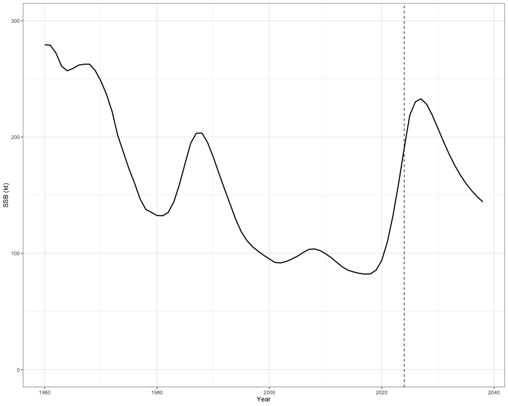
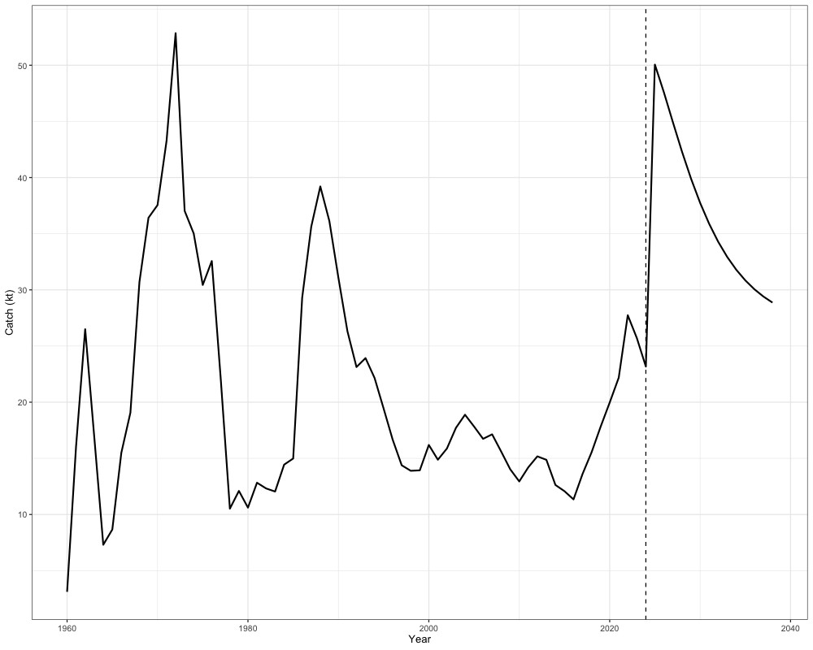
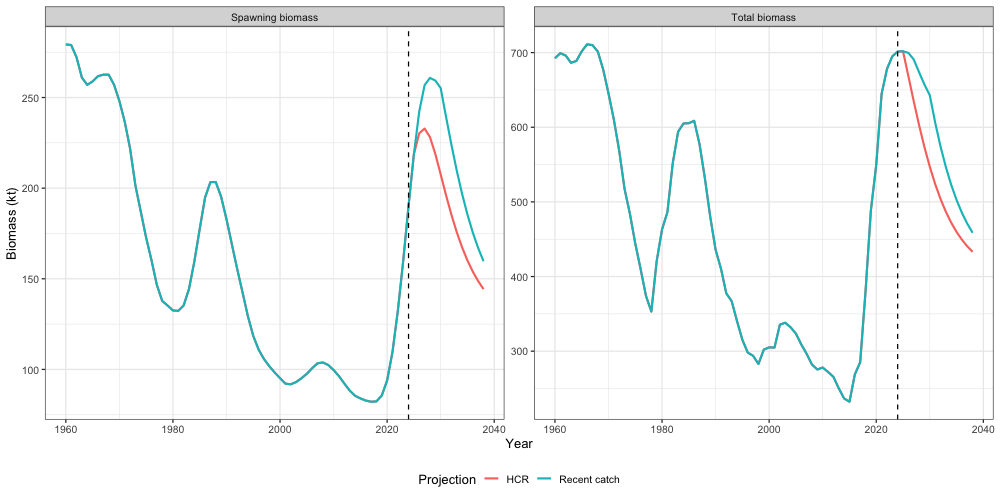
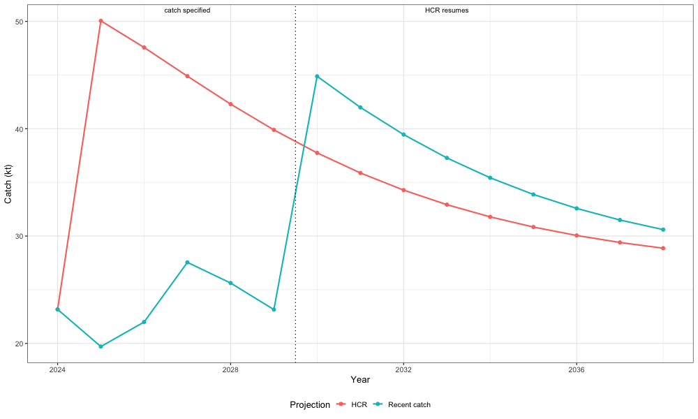
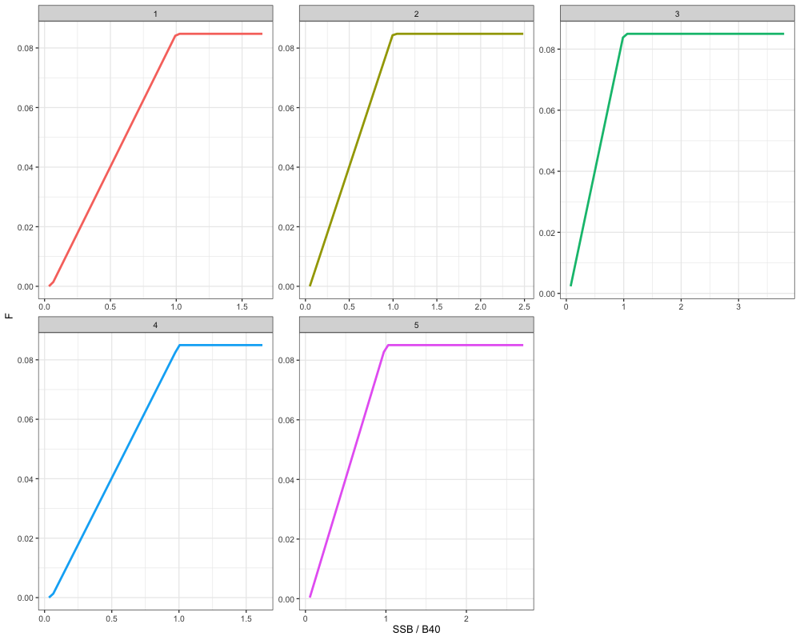
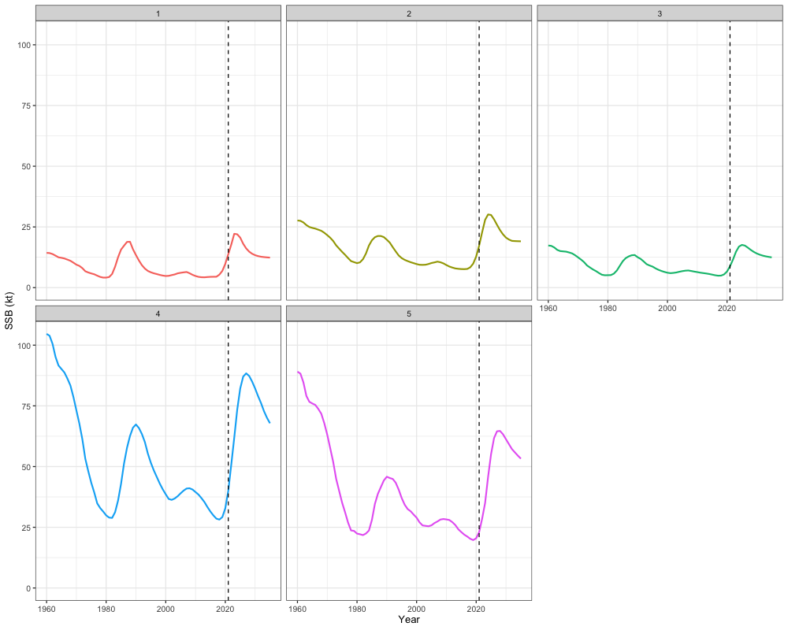
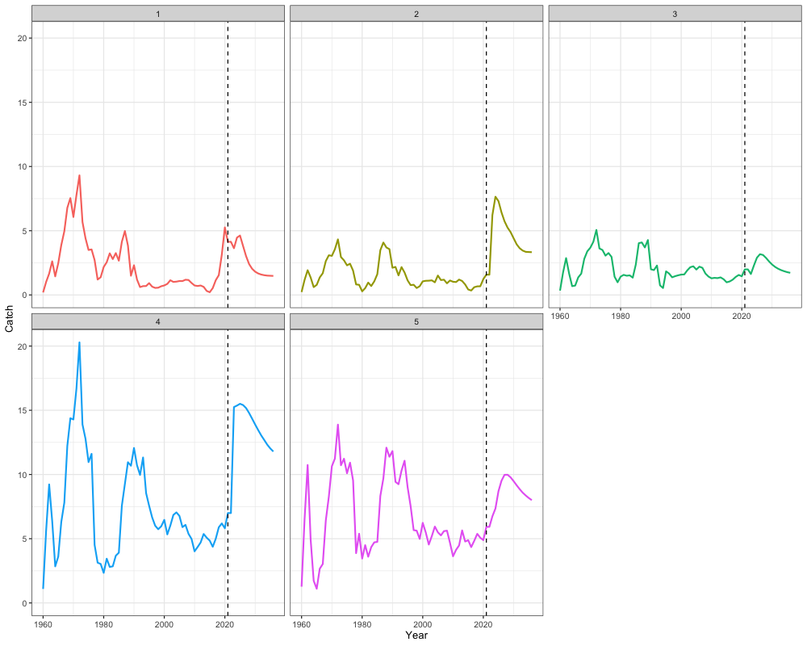
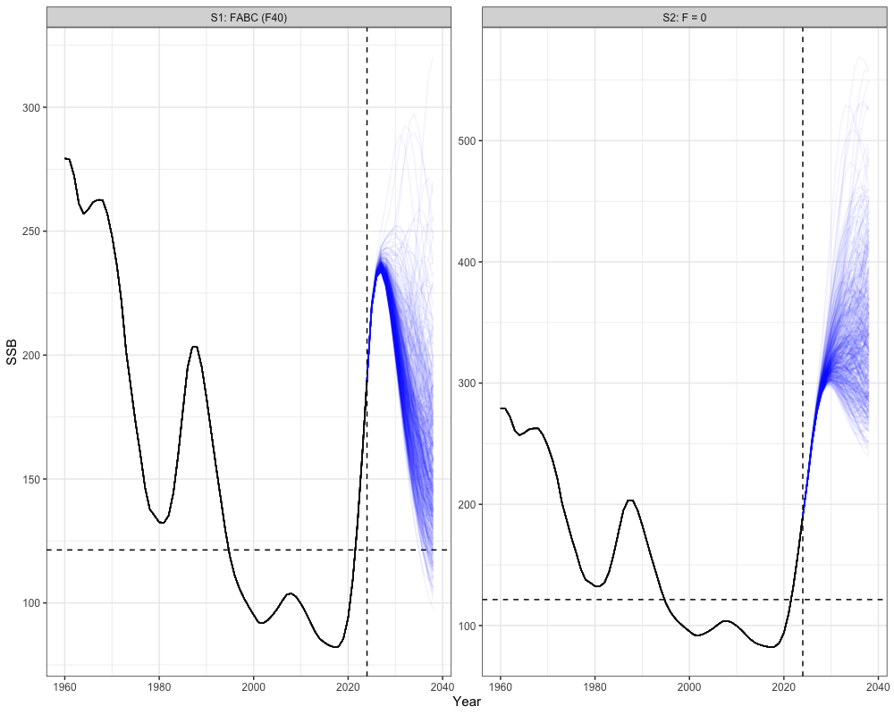
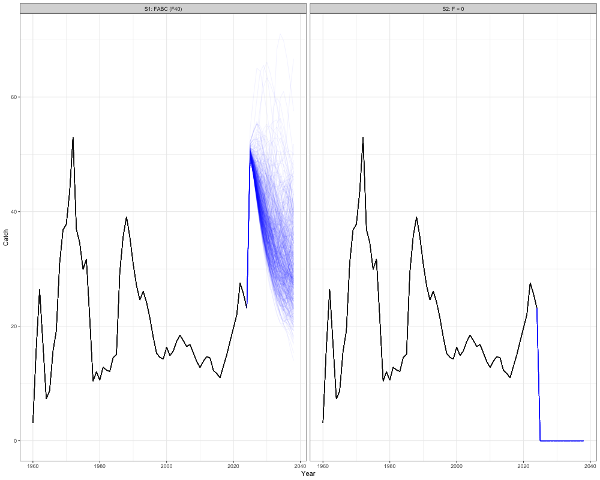

```{r, include = FALSE}
knitr::opts_chunk$set(
  collapse = TRUE,
  comment = "#>"
)
```

```{r setup, warning = FALSE, message = FALSE, eval = TRUE}
library(SPoRC) 
library(here)
library(RTMB)
library(ggplot2)
library(dplyr)
library(tidyr)
library(purrr)
```

Several options exist for deriving management reference points and catch advice in `SPoRC`. In this vignette, we will first discuss the mathematical details for deriving different management reference points, and then demonstrate how catch advice might be developed with estimated reference points.

## Reference Points

Deriving reference points in SPoRC is generally divided into
single-region and multi-region reference points, along with spawning
potential ratio ($SPR$) and maximum sustainable yield ($MSY$) reference
points. All per-recruit calculations propagate cohorts through $n_\tau$
seasons of duration $\Delta\tau_\tau$. In the following, we will discuss the mathematical details
pertaining to these key management quantities.

### Fishing Mortality Decomposition

Across all reference point calculations, total fishing mortality at age is decomposed into retained and dead discard components. For a given region $r$, season $\tau$, age $a$, and trial fishing mortality $F_x$:

$$F_{r,\tau,a}^{\text{ret}} = \sum_f \text{Frat}_{r,f,\tau} \cdot F_x \cdot \text{Sel}_{r,\tau,a,f}^{\text{Fsh}} \cdot \text{Sel}_{r,\tau,a,f}^{\text{Ret}}$$

$$F_{r,\tau,a}^{\text{disc}} = \sum_f \text{Frat}_{r,f,\tau} \cdot F_x \cdot \text{Sel}_{r,\tau,a,f}^{\text{Fsh}} \cdot \left(1 - \text{Sel}_{r,\tau,a,f}^{\text{Ret}}\right) \cdot \delta_{r,\tau,f}$$

$$Z_{r,\tau,a} = \text{Natmort}_{r,a} \cdot \Delta\tau_\tau + F_{r,\tau,a}^{\text{ret}} + F_{r,\tau,a}^{\text{disc}}$$

where $\text{Sel}^{\text{Fsh}}$ is total fishery selectivity, $\text{Sel}^{\text{Ret}}$ is retention selectivity, $\delta_{r,\tau,f}$ is the discard mortality rate (fraction of discarded fish that die), and $\text{Frat}_{r,f,\tau}$ is the relative fishing mortality fraction for fleet $f$ in region $r$ and season $\tau$ (derived from terminal year estimates). Only the dead fraction of discards contributes to $Z$; the surviving fraction $(1 - \delta)$ of discarded fish remains in the population. For MSY-based reference points, users have the option to define discard fleets, wherein landed yield is computed using only fleets where `is_discard_fleet = 0`; discard-only fleets still contribute to $Z$ and affect population dynamics.

### Single Region

Single-region reference points can currently be derived for $SPR$
reference points, which estimate the fishing mortality rate that reduces
spawning biomass per recruit ($SSBPR$) to $x\%\ $of the unfished level.
Additionally, $MSY$ reference points based on a Beverton-Holt
relationship, which estimate the fishing mortality rate that maximizes
long-term yield, can also be derived if density-dependence is assumed.

#### Spawning Potential Ratio

To derive $SPR$ reference points, a target percentage must be specified,
representing the $SSBPR$ under fishing relative to the unfished level.
Following that, several additional quantities are needed to compute
these reference points. These include:

-   the relative fishing mortality between fishery fleets and seasons
    ($\text{Frat}_{f,\tau} = \text{Fmort}_{y = n_{y},\tau,f}/\sum_{f}^{}{\text{Fmort}_{y = n_{y},\tau,f}}$),
-   fleet-specific total fishery selectivity
    ($\text{Sel}_{y = y^{*},\tau,a,s = 1,f}^{\text{Fsh}}$),
-   fleet-specific retention selectivity
    ($\text{Sel}_{y = y^{*},\tau,a,s = 1,f}^{\text{Ret}}$),
-   fleet-specific discard mortality rates ($\delta_{y = n_y,\tau,f}$),
-   natural mortality for females
    ($\text{Natmort}_{p,y = y^{*},a,s = 1}$),
-   spawning weight at age for females
    ($W_{p,y = y^{*},\tau^{spawn},a,s = 1}^{spawn}$),
-   maturity at age for females ($\text{Mat}_{p,y = y^{*},\tau^{spawn},a,s = 1}$),
-   spawn timing ($t^{spwn}$),
-   estimated recruitment values (${Rec}_{p,y}$),
-   the female recruitment sex ratio ($\psi_{p,y = y^{*},s = 1}$),
-   seasonal recruitment proportions ($\chi_{p,\tau}$),
-   stray rates between populations ($\phi_p$),
-   recruitment age ($RecAge$), and
-   the first year in the recruitment vector ($RecYear$) to be used for
    mean recruitment calculations.

For relative fishing mortality between fleets and discard mortality rates, the terminal year is
utilized for these calculations. In contrast, estimates based on a
user-defined averaging period ($y^{*}$; controlled by the `n_avg_yrs` argument) are used for
natural mortality, weight at age, maturity at age, total fishery selectivity, and retention selectivity.

$SPR\ $reference points are then derived by initializing per-recruit
numbers at the female recruitment sex-ratio scaled by the first-season
recruitment proportion:

$$N_{p,a = 1}^{fished} = \psi_{p,s = 1}\chi_{p,\tau = 1}$$

$$N_{p,a = 1}^{unfished} = \psi_{p,s = 1}\chi_{p,\tau = 1}$$

where $N_{p,a = 1}^{fished}$ and $N_{p,a = 1}^{unfished}$ are the fished and
unfished numbers at age per-recruit for population $p$, respectively. For seasons $\tau > 1$ and age $a = 1$, additional recruits are added:

$$N_{p,a=1}^{fished} \mathrel{+}= \psi_{p,s=1}\chi_{p,\tau}, \quad N_{p,a=1}^{unfished} \mathrel{+}= \psi_{p,s=1}\chi_{p,\tau}$$

Subsequent numbers at age per-recruit are computed with a seasonal exponential mortality model. Within each season $\tau$, the seasonal total mortality follows the decomposition described above, with the unfished mortality containing only natural mortality:

$$Z_{p,a,\tau}^{unfished} = \text{Natmort}_{p,a,s=1} \cdot \Delta\tau_\tau$$

For seasons within a given age class ($\tau < n_\tau$), within-season mortality is applied without ageing:

$$N_{p,a}^{fished} \leftarrow N_{p,a}^{fished} \cdot \exp\left(-Z_{p,a,\tau}^{fished}\right)$$

At the end of the final season ($\tau = n_\tau$), ageing occurs:

$$N_{p,a}^{fished} = N_{p,a-1}^{fished,\,\text{prev}} \cdot \exp\left(-Z_{p,a-1,n_\tau}^{fished}\right), \quad \text{for } 2 \leq a < a_+$$

The plus group ($a_+$) is solved analytically using the scalar geometric series, which is appropriate for the non-spatial case. Annual total fishing mortality for the plus group is accumulated across all seasons and both retained and dead discard components:

$$F_{p,a}^{\text{annual}} = \sum_\tau \left(F_{p,\tau,a}^{\text{ret}} + F_{p,\tau,a}^{\text{disc}}\right)$$

$$N_{p,a_{+}}^{fished} = N_{p,a_{+}-1}^{fished} \cdot \frac{\exp\left(-Z_{p,a_{+}-1}^{fished}\right)}{1 - \exp\left(-Z_{p,a_{+}}^{fished}\right)}$$

$$N_{p,a_{+}}^{unfished} = N_{p,a_{+}-1}^{unfished} \cdot \frac{\exp\left(-Z_{p,a_{+}-1}^{unfished}\right)}{1 - \exp\left(-Z_{p,a_{+}}^{unfished}\right)}$$

where $Z_{p,a_{+}}^{fished} = \text{Natmort}_{p,a_+} + F_{p,a_+}^{\text{annual}}$ and $Z_{p,a_{+}}^{unfished} = \text{Natmort}_{p,a_+}$ are the annual total mortality rates for the plus group. $N_{a}^{\text{fished}}$ can then be converted to fished $SSBPR$ with the following equation, where a mid-season spawning correction $t^{spawn}$ is applied:

$$SS{BPR}_{p}^{\text{fished}} = \sum_{a}^{}N_{p,a}^{\text{fished}} \cdot W_{p,\tau^{spawn},a,s = 1}^{spawn} \cdot \text{Mat}_{p,\tau^{spawn},a,s = 1} \cdot \exp\left( - t^{spawn} \cdot Z_{p,a,\tau^{spawn}}^{fished} \right)$$

Similarly, $N_{p,a}^{unfished}$ is converted to unfished $SSBPR$:

$$SS{BPR}_{p}^{\text{unfished}} = \sum_{a}^{}N_{p,a}^{\text{unfished}} \cdot W_{p,\tau^{spawn},a,s = 1}^{spawn} \cdot \text{Mat}_{p,\tau^{spawn},a,s = 1} \cdot \exp\left( - t^{spawn} \cdot Z_{p,a,\tau^{spawn}}^{unfished} \right)$$

When multiple populations are modeled ($n_p > 1$), effective spawning biomass per recruit is accumulated at each population's natal location, incorporating stray contributions from other populations:

$$\text{effSB}_{p_2} = SS{BPR}_{p_2}^{fished} + \sum_{p \neq p_2} \frac{\phi_p}{npop_r} \cdot SS{BPR}_{p}^{fished}$$

$$\text{effSB0}_{p_2} = SS{BPR}_{p_2}^{unfished} + \sum_{p \neq p_2} \frac{\phi_p}{npop_r} \cdot SS{BPR}_{p}^{unfished}$$

where $\phi_p$ is the stray rate of population $p$ and $npop_r$ is the number of populations sharing the natal region of $p_2$, used to preserve mass balance. The $SPR$ rate is then defined as:

$$SPR = \frac{\sum_{p}^{}\text{effSB}_p}{\sum_{p}^{}\text{effSB0}_p}$$

$F_{x}$ can then be solved for using a non-linear function minimizer by
minimizing the following criteria:

$$F_{x} = \arg\min_{F}\left\{ \left( \text{SPR}(F) - x\% \right)^{2} \right\}$$

Biological $SPR$-based reference points ($B_{p,x}$) are then computed as:

$$B_{p,x} = SS{BPR}_{p}^{\text{fished}} \cdot \frac{\sum_{RecYear}^{n_{y} - RecAge}{Rec}_{p,y}}{n_{y} - RecAge - RecYear}$$

where $SS{BPR}_{p}^{\text{fished}}\ $is multiplied by mean recruitment over
a user-defined period (i.e., $n_{y} - RecAge - RecYear$).

#### Maximum Sustainable Yield (Beverton-Holt)

Deriving $MSY$ based reference points using a Beverton-Holt stock
recruitment relationship involves maximizing the equilibrium yield per
recruit ($YPR$) and requires several additional inputs. These inputs
include:

-   the relative fishing mortality between fishery fleets and seasons
    ($\text{Frat}_{f,\tau}$),
-   fleet-specific total fishery selectivity
    ($\text{Sel}_{y = y^{*},\tau,a,s = 1,f}^{\text{Fsh}}$),
-   fleet-specific retention selectivity
    ($\text{Sel}_{y = y^{*},\tau,a,s = 1,f}^{\text{Ret}}$),
-   fleet-specific discard mortality rates ($\delta_{y = n_y,\tau,f}$),
-   natural mortality for females
    ($\text{Natmort}_{p,y = y^{*},a,s = 1}$),
-   spawning weight at age for females
    ($W_{p,y = y^{*},\tau^{spawn},a,s = 1}^{spawn}$),
-   maturity at age for females ($\text{Mat}_{p,y = y^{*},\tau^{spawn},a,s = 1}$),
-   spawn timing ($t^{spawn})$,
-   estimated recruitment values (${Rec}_{p,y}$),
-   the female recruitment sex ratio ($\psi_{p,y = y^{*},s = 1}$),
-   seasonal recruitment proportions ($\chi_{p,\tau}$),
-   stray rates between populations ($\phi_p$),
-   an estimate of virgin recruitment ($\mu_p^{Rec}$),
-   an estimate of steepness ($h_p$), and
-   an indicator for which fleets contribute to landed yield (`is_discard_fleet`).

$MSY$ reference points can then be derived using the standard
per-recruit calculations, where the initial number of fished and
unfished individuals are set at the female recruitment sex ratio scaled by the first-season recruitment proportion:

$$N_{p,a = 1}^{fished} = \psi_{p,s = 1}\chi_{p,\tau=1}, \quad N_{p,a = 1}^{unfished} = \psi_{p,s = 1}\chi_{p,\tau=1}$$

The numbers-at-age are decremented following the same seasonal exponential mortality model as described for $SPR$ above, with $F_x$ replaced by $F_{msy}$. Catch-at-age per recruit is accumulated across seasons using Baranov's catch equation, using only the landed fishing mortality from non-discard fleets:

$$C_{p,a,\tau} = N_{p,a}^{fished} \cdot \frac{\sum_{f \in \mathcal{F}^{\text{land}}}^{}\text{Frat}_{f,\tau} \cdot F_{\text{msy}} \cdot \text{Sel}_{a,s = 1,f}^{\text{Fsh}} \cdot \text{Sel}_{a,s=1,f}^{\text{Ret}}}{Z_{p,a,\tau}^{fished}} \cdot \left( 1 - \exp\left\lbrack - Z_{p,a,\tau}^{fished} \right\rbrack \right)$$

where $\mathcal{F}^{\text{land}}$ denotes fleets with `is_discard_fleet = 0`. Fished and unfished $SSBPR$ are derived as in the $SPR$ case, with $F_x$ replaced by $F_{msy}$. Effective spawning biomass per recruit is accumulated with stray rates as defined above, yielding $\text{effSB}_p$ and $\text{effSB0}_p$. Equilibrium recruitment ($EqRec_p$) is then solved analytically from the Beverton-Holt stock-recruitment relationship. Rearranging the equilibrium condition $R = f(R\cdot\phi_F)$ yields:

$$EqRec_p = \mu_p^{Rec} \cdot \frac{4h_p \cdot \text{effSB}_p - (1 - h_p) \cdot \text{effSB0}_p}{(5h_p - 1) \cdot \text{effSB}_p}$$

Yield and $B_{msy}$ are then derived by multiplying per-recruit quantities by equilibrium recruitment:

$$Yield_p = \sum_{\tau}^{}\sum_{a}^{}C_{p,a,\tau} \cdot W_{p,\tau,a,s = 1}^{spawn} \cdot EqRec_p$$

$$B_{p,msy} = SS{BPR}_{p}^{\text{fished}} \cdot EqRec_p$$

Lastly, $F_{msy}$ is solved for by minimizing the following criteria (maximizing total yield):

$$F_{msy} = \arg\min_{F}\left\{ -\sum_p Yield_p \right\}$$

### Multi-Region 

In general, multi-region reference points can be computed in a similar
manner as single-region reference points. The additional complication
when calculating spatial reference points includes the additional region
subscript for all quantities, as well as the potential need to account
for movement processes. All fishing mortality decompositions follow the same retained + dead discard structure described above, now additionally indexed by region $r$.

#### Spawning Potential Ratio

##### Independent

In the case where independent spatial regions are assumed (i.e., no
movement occurs among regions), $SPR$ rates can be calculated
independently for each region, which results in region-specific
$F_{r,x}$ and $B_{r,x}$ estimates. All calculations are derived in the
same manner as equations described for computing $SPR$ in the
single region case, with the exception that an additional region subscript is added to
all demographic rates. Following that, $F_{r,x}$ can then be solved for by minimizing
the following criteria for each region:

$$F_{r,x} = \arg\min_{F_{r}}\left\{ \left( \text{SPR}\left( F_{r} \right) - x\%\ \right)^{2} \right\}$$

Regional biological $SPR$-based reference points ($B_{p,x}$) can then be
derived by multiplying $SS{BPR}_{p,r}^{\text{fished}}$ by regional mean
recruitment over a user-defined period:

$$B_{p,r,x} = SS{BPR}_{p,r}^{\text{fished}} \cdot \frac{\sum_{RecYear}^{n_{y} - RecAge}{Rec}_{p,r,y}}{n_{y} - RecAge - RecYear}$$

##### Global

In contrast to computing reference points when assuming independent
spatial dynamics, $SPR$ rates can also be computed globally, where
movement occurs among regions. Given the assumption of global $SPR$
rates, this results in a global $F_{x}$ estimate, but regional estimates
of $B_{r,x}$ because mean recruitment estimates are defined on a
regional scale. Thus, the global $SPR$ solution results in a $F_{x}$
that reduces the global $SSBPR$ to $x\%$ of its unfished value, such
that the aggregate spawning biomass reaches equilibrium at
$\sum_{r}^{}B_{r,x}$ if applied over the long-term.

Deriving global $SPR$ reference points requires a different set of
inputs. These include:

-   the relative fishing mortality between fishery fleets and seasons
    ($\text{Frat}_{r,f,\tau} = \text{Fmort}_{r,y = n_{y},\tau,f}/\sum_{f}^{}{\text{Fmort}_{r,y = n_{y},\tau,f}}$),
-   fleet-specific total fishery selectivity
    ($\text{Sel}_{r,y = y^{*},\tau,a,s = 1,f}^{\text{Fsh}}$),
-   fleet-specific retention selectivity
    ($\text{Sel}_{r,y = y^{*},\tau,a,s = 1,f}^{\text{Ret}}$),
-   fleet-specific discard mortality rates ($\delta_{r,y = n_y,\tau,f}$),
-   natural mortality for females
    ($\text{Natmort}_{p,r,y = y^{*},a,s = 1}$),
-   spawning weight at age for females
    ($W_{p,r,y = y^{*},\tau^{spawn},a,s = 1}^{spawn}$),
-   maturity at age for females ($\text{Mat}_{p,r,y = y^{*},\tau^{spawn},a,s = 1}$),
-   seasonal movement matrices
    ($\mathbf{M}_{p,y = y^{*},\tau,a,s = 1}$),
-   single-season spawning movement matrices when $n_\tau = 1$ and $n_p > 1$
    ($\mathbf{M}^{spawn}_{p,y = y^{*},a,s = 1}$),
-   spawn timing ($t^{spwn}$),
-   estimated recruitment values (${Rec}_{p,r,y}$),
-   the female recruitment sex ratio ($\psi_{p,r,y = y^{*},s = 1}$),
-   seasonal recruitment proportions ($\chi_{p,\tau}$),
-   stray rates between populations ($\phi_p$),
-   natal regions ($r^{natal}_p$),
-   the recruitment proportions (apportionment) by area ($\zeta_{p,r}$),
-   recruitment age ($RecAge$), and
-   the first year in the recruitment vector ($RecYear$) to be used for
    mean recruitment calculations.

Global $SPR$ reference points are calculated by first setting the
regional numbers-at-age per-recruit to the estimated recruitment
apportionment parameters multiplied by the seasonal and sex-ratio factors:

$$N_{p,r,a = 1}^{\text{fished}} = \zeta_{p,r} \cdot \psi_{p,r,s = 1} \cdot \chi_{p,\tau=1}, \quad N_{p,r,a = 1}^{\text{unfished}} = \zeta_{p,r} \cdot \psi_{p,r,s = 1} \cdot \chi_{p,\tau=1}$$

For seasons $\tau > 1$ and age $a = 1$, additional recruits are added proportional to $\chi_{p,\tau}$.

**Seasonal transition operator.** Movement and mortality are applied together over each season by a single operator, whose form depends on the movement timing $\kappa$ (`move_timing`). Writing $\mathbf{Z}_{p,a,\tau}$ for the vector of total mortality over the season (retained and dead discard components as defined above), $\mathbf{M}_{p,\tau,a,s=1}$ for the movement fractions and $\mathbf{Q}_{p,\tau,a,s=1}$ for the instantaneous rate matrix (generator), both stored as $[\text{from},\text{to}]$:

$$\mathbf{T}_{p,\tau,a} = \left\{ \begin{matrix}
\mathbf{M}_{p,\tau,a,s=1} \, \text{diag}\left(e^{-\mathbf{Z}_{p,a,\tau}}\right) & \kappa = 0 \quad \text{(movement, then mortality)} \\
\text{diag}\left(e^{-\mathbf{Z}_{p,a,\tau}}\right) \mathbf{M}_{p,\tau,a,s=1} & \kappa = 1 \quad \text{(mortality, then movement)} \\
\left[\exp\left(\mathbf{A}_{p,\tau,a}\right)\right]^{\top}, \quad \mathbf{A}_{p,\tau,a} = \mathbf{Q}_{p,\tau,a,s=1}^{\top}\Delta\tau_\tau - \text{diag}\left(\mathbf{Z}_{p,a,\tau}\right) & \kappa = 2 \quad \text{(continuous)} \\
\end{matrix} \right.\ $$

Under $\kappa = 2$ movement and mortality act simultaneously, so the two cannot be separated into an ordered pair of steps; $\mathbf{Q}^{\top}$ converts the stored convention to the column convention used by the matrix exponential. Abundance is advanced by

$$\mathbf{N}_{p,a} \leftarrow \left(\mathbf{N}_{p,a}\right)^{\top}\mathbf{T}_{p,\tau,a}\quad\text{for }a = a_{\min},\ldots,a_+,\quad a_{\min} = \left\{ \begin{matrix}
1 & \text{if  recruits move} \\
2 & \text{otherwise} \\
\end{matrix} \right.\ $$

for both the fished and unfished vectors, with ageing at the end of the final season. Ages that do not move take $\mathbf{M} = \mathbf{I}$ and $\mathbf{Q} = \mathbf{0}$, which leaves survival unchanged under every $\kappa$. The three timings coincide exactly when $\mathbf{Z}$ is constant across regions, because a scalar multiple of the identity commutes with the generator.

**Spawning state.** Spawners are propagated a fraction $t^{spawn}$ into the spawning season, which fixes both where they spawn and how much mortality they have experienced:

$$\mathbf{N}_{p,a}^{spawn} = \left\{ \begin{matrix}
\left[\left(\mathbf{N}_{p,a}\right)^{\top}\mathbf{M}_{p,\tau^{spawn},a,s=1}\right] \odot e^{-t^{spawn}\mathbf{Z}_{p,a,\tau^{spawn}}} & \kappa = 0 \\
\mathbf{N}_{p,a} \odot e^{-t^{spawn}\mathbf{Z}_{p,a,\tau^{spawn}}} & \kappa = 1 \\
\exp\left(t^{spawn}\mathbf{A}_{p,\tau^{spawn},a}\right)\mathbf{N}_{p,a} & \kappa = 2 \\
\end{matrix} \right.\ $$

Under $\kappa = 0$ fish move at the start of the season and spawn at their post-movement location; under $\kappa = 1$ movement follows spawning, so they spawn where they started; under $\kappa = 2$ they are partially redistributed by the time they spawn. The $t^{spawn}$ mortality discount is carried inside $\mathbf{N}^{spawn}$ in all three cases rather than applied separately to $SSBPR$.

When $n_\tau = 1$ and $n_p > 1$ (single-season natal homing), a separate spawning movement matrix $\mathbf{M}^{spawn}_{p,a,s=1}$ then redistributes fish to natal grounds:

$$\mathbf{N}^{spawn}_{p,a} \leftarrow \left(\mathbf{N}^{spawn}_{p,a}\right)^{\top} \mathbf{M}^{spawn}_{p,a,s=1}$$

**Analytical plus-group solution.** For the spatial case, the scalar geometric series does not correctly accumulate the plus group under movement. Instead, the plus-group abundance vector $\mathbf{N}_{p,a_+}$ is solved analytically using four annual transition matrices that accumulate the effects of seasonal survival and movement for both the penultimate age and the plus-group age under fished and unfished conditions. Each annual matrix $\mathbf{T}_{p,a}$ is the year-long composition of the seasonal operators $\mathbf{T}_{p,\tau,a}$ defined above, transposed into the column convention so it acts on $\mathbf{N}$ directly:

$$\mathbf{T}_{p,a}^{\text{fished}} = \prod_{\tau=1}^{n_\tau} \left(\mathbf{T}_{p,\tau,a}\right)^{\top}$$

where the product is ordered sequentially across seasons, season 1 applied first. Under $\kappa = 0$ this reduces to the familiar $\prod_\tau \text{diag}(e^{-\mathbf{Z}_{p,a,\tau}}) \left(\mathbf{M}_{p,\tau,a,s=1}\right)^{\top}$. The plus-group equilibrium vector satisfies $\mathbf{N}_{p,a_+} = \mathbf{T}_{p,a_+} \mathbf{N}_{p,a_+} + \mathbf{T}_{p,a_+-1} \mathbf{N}_{p,a_+-1}$, which rearranges to the linear system:

$$\left(\mathbf{I} - \mathbf{T}_{p,a_+}^{\text{fished}}\right) \mathbf{N}_{p,a_+}^{\text{fished}} = \mathbf{T}_{p,a_+-1}^{\text{fished}} \mathbf{N}_{p,a_+-1}^{\text{fished}}$$

and the solution for both fished and unfished plus-group vectors is obtained via matrix inversion.

Regional fished and unfished numbers-at-age per-recruit can then be
converted to *SSBPR* quantities. For regional fished *SSBPR*
($SS{BPR}_{p,r}^{\text{fished}})$, this is written as:

$$SS{BPR}_{p,r}^{\text{fished}} = \sum_{a}^{}N_{p,r,a}^{spawn,\text{fished}} \cdot W_{p,r,\tau^{spawn},a,s = 1}^{spawn} \cdot \text{Mat}_{p,r,\tau^{spawn},a,s = 1}$$

where $N^{spawn}$ is the spawning state defined above; the $t^{spawn}$ mortality discount is already inside it and is not applied again here.

Regional unfished $SSBPR$ ($SS{BPR}_{p,r}^{\text{unfished}})$ is computed
in a similar manner. When multiple populations are modeled, effective spawning biomass per recruit at each population's natal region accounts for stray contributions, divided by $npop_r$ to preserve mass balance:

$$\text{effSB}_{p_2} = SS{BPR}_{p_2, r^{natal}_{p_2}}^{fished} + \sum_{p \neq p_2} \frac{\phi_p}{npop_r} \cdot SS{BPR}_{p, r^{natal}_{p_2}}^{fished}$$

The global $SPR$ rate is then defined as:

$$SPR = \frac{\sum_{p}^{}\text{effSB}_p}{\sum_{p}^{}\text{effSB0}_p}$$

When $n_p = 1$, this simplifies to $SPR = \sum_r SS{BPR}_r^{fished} / \sum_r SS{BPR}_r^{unfished}$. $F_{x}$ can then be solved for using a non-linear function minimizer by
minimizing the following criteria for global $SPR$:

$$F_{x} = \arg\min_{F}\left\{ \left( \text{SPR}(F) - x\% \right)^{2} \right\}$$

Biological $SPR$-based reference points are regional ($B_{p,r,x}$) and are derived by multiplying $SS{BPR}_{p,r}^{\text{fished}}$
by the total mean recruitment (summed across regions) for population $p$ over a user-defined period:

$$B_{p,r,x} = SS{BPR}_{p,r}^{\text{fished}} \cdot \frac{\sum_{RecYear}^{n_{y} - RecAge}\sum_r{Rec}_{p,r,y}}{n_{y} - RecAge - RecYear}$$

Thus, the global $SPR$ calculations result in a single $F_{x}$ and
regional $B_{p,r,x}$ estimates.

#### Maximum Sustainable Yield (Beverton-Holt)

Similar to deriving spatial reference points for $SPR$ rates,
$MSY$-based reference points assuming a Beverton-Holt stock recruitment
relationship can be derived either assuming independent populations
without movement or a global population with movement processes
incorporated. In cases where density-dependence is defined locally
(i.e., area-specific stock-recruitment curves), local $MSY$-based
reference points can also be derived (Kapur et al., 2021).

##### Independent

In the case where independent spatial regions are assumed,
region-specific $F_{r,msy}$ and $B_{r,msy}$ estimates can be obtained. All calculations are derived in the same manner as equations
described for computing $MSY$ in a single region case, with the
exception that demographic rates, fishery selectivity, retention selectivity, and discard mortality rates additionally
include a region subscript. Virgin recruitment is defined regionally as:

$$\mu_{p,r}^{Rec} = \mu_p^{Rec}\zeta_{p,r}$$

Equilibrium recruitment per region is then derived analytically as:

$${EqRec}_{p,r} = \mu_{p,r}^{Rec} \cdot \frac{4h_{p,r} \cdot \text{effSB}_{p,r} - (1-h_{p,r}) \cdot \text{effSB0}_{p,r}}{(5h_{p,r}-1) \cdot \text{effSB}_{p,r}}$$

$F_{r,msy}$ can then be solved for by minimizing (maximizing) yield for
each region independently:

$$F_{r,msy} = \arg\min_{F_{r}}\ \left\{-Yield_{r}\right\}$$

and $B_{p,r,msy}$ can then be written as:

$$B_{p,r,msy} = SS{BPR}_{p,r}^{fished} \cdot {EqRec}_{p,r}$$

##### Global

In a spatial context, global $MSY$ explicitly accounts for movement
dynamics and results in a single $F_{msy}$ estimate applied uniformly
across regions, but regional estimates of $B_{r,msy}$ because recruitment
parameters are defined regionally. This option is only valid for
single-population models ($n_p = 1$); multi-population models should use
the local $MSY$ approach given localized density-dependence when multiple populations occur within the model. 

The inputs, per-recruit accounting, seasonal mortality, movement, and analytical plus-group solution for global $MSY$ follow the same structure as described under global $SPR$ above, with $F_x$ replaced by $F_{msy}$. Additionally, catch-at-age per recruit is accumulated each season using only the landed fishing mortality,

$$\mathbf{F}^{\text{land}}_{a,\tau} = \sum_{f \in \mathcal{F}^{\text{land}}}\text{Frat}_{r,f,\tau} \cdot F_{\text{msy}} \cdot \text{Sel}_{r,a,s = 1,f}^{\text{Fsh}} \cdot \text{Sel}_{r,a,s=1,f}^{\text{Ret}}$$

taken from the fish where they actually are during the season:

$$C_{r,a,\tau} = \left\{ \begin{matrix}
\widetilde{N}_{r,a}^{\text{fished}} \cdot \dfrac{F^{\text{land}}_{r,a,\tau}}{Z_{r,a,\tau}} \cdot \left(1 - e^{-Z_{r,a,\tau}}\right), \quad \widetilde{\mathbf{N}}_{a}^{\text{fished}} = \left(\mathbf{N}_{a}^{\text{fished}}\right)^{\top}\mathbf{M}_{\tau,a,s=1} & \kappa = 0 \\
N_{r,a}^{\text{fished}} \cdot \dfrac{F^{\text{land}}_{r,a,\tau}}{Z_{r,a,\tau}} \cdot \left(1 - e^{-Z_{r,a,\tau}}\right) & \kappa = 1 \\
F^{\text{land}}_{r,a,\tau} \cdot \left[\left(\int_{0}^{1} e^{\mathbf{A}_{\tau,a}u}\,du\right)\mathbf{N}_{a}^{\text{fished}}\right]_{r} & \kappa = 2 \\
\end{matrix} \right.\ $$

Catch is taken at the post-movement location under $\kappa = 0$, where movement happens at the start of the season, and at the pre-movement location under $\kappa = 1$, where it happens at the end.

Under $\kappa = 2$ fish redistribute among regions while they are being caught, so the region-local $\tfrac{F}{Z}(1 - e^{-Z})$ form is not valid and the season-integrated (spatial Baranov) abundance is required instead. The integral runs over elapsed fraction of the season, since $\mathbf{A}_{\tau,a}$ already carries $\Delta\tau_\tau$ in both of its terms, and is evaluated together with $\exp(\mathbf{A}_{\tau,a})$ from the single block exponential

$$\exp\begin{pmatrix} \mathbf{A} & \mathbf{I} \\ \mathbf{0} & \mathbf{0} \end{pmatrix} = \begin{pmatrix} e^{\mathbf{A}} & \int_{0}^{1} e^{\mathbf{A}u}\,du \\ \mathbf{0} & \mathbf{I} \end{pmatrix}$$

In every case $\mathbf{N}_{a}^{\text{fished}}$ is abundance at the *start* of season $\tau$, carried forward across seasons by $\mathbf{T}_{\tau,a}$. This applies to the penultimate age and the plus group as well as to the ages advanced through the main loop: their catch is accumulated over the same seasonal sweep, so each season's catch is taken from the survivors of the preceding ones.

After computing $SS{BPR}_{r}^{fished}$ and $SS{BPR}_{r}^{unfished}$, equilibrium recruitment is derived as:

$${EqRec} = \mu^{Rec} \cdot \frac{4h \cdot \phi_F - (1-h) \cdot \phi_0}{(5h-1) \cdot \phi_F}$$

where $\phi_F = \sum_r SS{BPR}_r^{fished}$ and $\phi_0 = \sum_r SS{BPR}_r^{unfished}$. Yield and $B_{r,msy}$ are calculated as:

$${Yield} = \sum_{\tau}^{}\sum_{a}^{}\sum_{r}^{} C_{r,a,\tau} \cdot W_{r,\tau,a,s = 1}^{spawn} \cdot {EqRec}$$

$$B_{r,msy} = SS{BPR}_{r}^{\text{fished}} \cdot {EqRec}$$

$F_{msy}$ can then be solved for using the following:

$$F_{msy} = \arg\min_{F}\ \left\{-Yield\right\}$$

##### Local

A key challenge in estimating local spatial reference points (i.e.,
meta-population dynamics) is that combinations of local fishing
mortality rates can sometimes be non-identifiable, because multiple
combinations of local reference points can produce similar solutions.
However, as highlighted by Kapur et al., 2021, local spatial reference
points under density-dependence can potentially be estimated by tracking
area-specific yields resulting from a single recruit in each spawning
area. This allows the yield surface to be defined and can be used to
compute local reference points such as $F_{r,msy}$ and $B_{r,msy}$.

The following inputs are required for computing local $MSY$:

-   the relative fishing mortality between fishery fleets and seasons
    ($\text{Frat}_{r,f,\tau}$),
-   fleet-specific total fishery selectivity
    ($\text{Sel}_{r,y = y^{*},\tau,a,s = 1,f}^{\text{Fsh}}$),
-   fleet-specific retention selectivity
    ($\text{Sel}_{r,y = y^{*},\tau,a,s = 1,f}^{\text{Ret}}$),
-   fleet-specific discard mortality rates ($\delta_{r,y = n_y,\tau,f}$),
-   natural mortality for females
    ($\text{Natmort}_{p,r,y = y^{*},a,s = 1}$),
-   spawning weight at age for females
    ($W_{p,r,y = y^{*},\tau^{spawn},a,s = 1}^{spawn}$),
-   maturity at age for females ($\text{Mat}_{p,r,y = y^{*},\tau^{spawn},a,s = 1}$),
-   seasonal movement matrices
    ($\mathbf{M}_{p,y = y^{*},\tau,a,s = 1}$),
-   single-season spawning movement matrices when applicable
    ($\mathbf{M}^{spawn}_{p,y = y^{*},a,s = 1}$),
-   spawn timing ($t^{spwn}$),
-   the female recruitment sex ratio ($\psi_{p,r,y = y^{*},s = 1}$),
-   seasonal recruitment proportions ($\chi_{p,\tau}$),
-   an estimate of global virgin recruitment ($\mu_p^{Rec}$),
-   the local steepness value to be used ($h_{p,r}$),
-   stray rates ($\phi_p$),
-   natal regions ($r^{natal}_p$),
-   the recruitment proportions (apportionment) by area ($\zeta_{p,r}$), and
-   an indicator for which fleets contribute to landed yield (`is_discard_fleet`).

To ensure identifiability, quantities are tracked by origin region ($o$)
and destination region ($r$). Using standard per-recruit calculations,
each region is initialized with one female recruit:

$$N_{p,o,r,a = 1}^{\text{fished}} = \left\{ \begin{matrix}
\psi_{p,r,s = 1} \cdot \chi_{p,\tau=1} \cdot \zeta_{p,r},\ \ \text{if }o = r \\
0,\ \ \ \text{if }o\  \neq r \\
\end{matrix} \right.\ $$

For multi-population models, population $p$ recruits only into its own natal region. The same seasonal transition operator, spawning state, and analytical plus-group solution described under global $SPR$ and global $MSY$ are applied, with cohorts tracked by both origin $o$ and destination $r$. Catch-at-age per-recruit takes the same three forms in $\kappa$ given for global $MSY$, applied to each origin cohort $\mathbf{N}_{p,o,\cdot,a}^{\text{fished}}$ separately and with $F_{r,msy}$ now region-specific:

$$\mathbf{F}^{\text{land}}_{a,\tau} = \sum_{f \in \mathcal{F}^{\text{land}}}\text{Frat}_{r,f,\tau} \cdot F_{r,msy} \cdot \text{Sel}_{r,a,s = 1,f}^{\text{Fsh}} \cdot \text{Sel}_{r,a,s=1,f}^{\text{Ret}}$$

Each origin cohort is carried forward across seasons by its own $\mathbf{T}_{p,\tau,a}$ before its next season's catch is taken.

Regional equilibrium recruitment is computed by solving a non-linear Beverton-Holt
stock-recruitment relationship that ensures internal consistency. The specific
formulation differs between single-population and multi-population models.

**Single-population.** Equilibrium recruitment is tracked by origin region
($OrigEqRec_o$) and solved such that the recruitment produced at each destination
region is self-consistent. The effective fished SSB at destination region $r$ is
the sum of SBPR contributions from all origin regions weighted by their equilibrium
recruitment:

$$EqSSB_{r}^{fished} = \sum_{o}^{} SBPR_{o,r}^{fished} \cdot OrigEqRec_o$$

The Beverton-Holt parameters for each destination region are defined as:

$$A_r = 4h_r \zeta_r R_0, \quad B_r = (1-h_r)\sum_{o}^{} SBPR_{o,r}^{unfished} \cdot R_0 \cdot \zeta_o, \quad C_r = 5h_r - 1$$

Destination equilibrium recruitment is then:

$$DestEqRec_r = \frac{A_r \cdot EqSSB_r^{fished}}{B_r + C_r \cdot EqSSB_r^{fished}}$$

Newton-Raphson's method adjusts $OrigEqRec_o$ until $OrigEqRec_o = DestEqRec_o$
for all $o$. The Jacobian is derived analytically via the quotient rule applied to
the BH formula and the chain rule through the spatial redistribution of SSB:

$$J_{r,o} = \delta_{r,o} - \frac{A_r B_r}{(B_r + C_r \cdot EqSSB_r^{fished})^2} \cdot SBPR_{o,r}^{fished}$$

**Multi-population.** Equilibrium recruitment is tracked by population ($Req_p$)
at each population's natal region, with stray rates coupling the system across
populations. The effective fished SSB at population $p_2$'s natal region
accumulates contributions from all populations, divided by $npop_r$ to preserve mass balance:

$$\text{effSSB}_{p_2}^{fished} = SBPR_{p_2, r^{natal}_{p_2}}^{fished} \cdot Req_{p_2} + \sum_{p \neq p_2} \frac{\phi_p}{npop_r} \cdot SBPR_{p, r^{natal}_{p_2}}^{fished} \cdot Req_p$$

Virgin effective SSB (used to define the unfished equilibrium) is:

$$\text{effSSB0}_{p_2}^{virgin} = SBPR_{p_2, r^{natal}_{p_2}}^{unfished} \cdot R_{0,p_2} + \sum_{p \neq p_2} \frac{\phi_p}{npop_r} \cdot SBPR_{p, r^{natal}_{p_2}}^{unfished} \cdot R_{0,p}$$

The Beverton-Holt parameters for each population are defined at its natal region:

$$A_{p_2} = 4h_{p_2, r^{natal}_{p_2}} R_{0,p_2}, \quad B_{p_2} = (1-h_{p_2, r^{natal}_{p_2}}) \cdot \text{effSSB0}_{p_2}^{virgin}, \quad C_{p_2} = 5h_{p_2, r^{natal}_{p_2}} - 1$$

Destination equilibrium recruitment by population is then:

$$DestEqRec_{p_2} = \frac{A_{p_2} \cdot \text{effSSB}_{p_2}^{fished}}{B_{p_2} + C_{p_2} \cdot \text{effSSB}_{p_2}^{fished}}$$

Newton-Raphson's method adjusts $Req_p$ until $Req_p = DestEqRec_p$ for all $p$.
The Jacobian accounts for cross-population coupling through stray rates:

$$J_{p_2, p} = \delta_{p_2, p} - \frac{A_{p_2} B_{p_2}}{(B_{p_2} + C_{p_2} \cdot \text{effSSB}_{p_2}^{fished})^2} \cdot \phi_{p \to p_2} \cdot SBPR_{p, r^{natal}_{p_2}}^{fished}$$

where $\phi_{p \to p_2} = 1$ if $p = p_2$ and $\phi_{p \to p_2} = \phi_p / npop_r$ otherwise.

In both cases, total yield and $B_{p,r,msy}$ are then defined as:

$$Yield_{p,r} = \sum_{o}^{}\left(\sum_{\tau}^{}\sum_{a}^{} C_{p,o,r,a,\tau} \cdot W_{p,r,\tau,a,s=1}^{spawn}\right) \cdot \zeta_{p,o} \cdot OrigEqRec_p$$

$$B_{p,r,msy} = \sum_{o}^{} SBPR_{p,o,r}^{fished} \cdot OrigEqRec_p$$

$$F_{r,msy} = \arg\min_{F_{r,msy}} \left\{-\sum_{p}\sum_r Yield_{p,r}\right\}$$

# Deriving Catch Advice and Projections

A core part of the assessment process is to convert reference point estimates into catch advice. In the following sections, we will mathematically describe how catch advice is derived, and proceed to provide code examples for demonstration. To conduct projections from the terminal year, users must define the following quantities:

- Terminal year estimates of numbers-at-age,
- A user defined period of recruitment values to use,
- A user defined period of weight-at-age values to use for projections,
- A user defined period of natural mortality-at-age values to use for projections,
- A user defined period of maturity-at-age values to use for projections,
- A user defined period of fishery selectivity values to use for projections,
- A user defined period of movement values to use for projections, 
- Terminal year estimates of fishing mortality,
- Fishing mortality rate to use to decrement the population.

Optionally, users can define:

- Biological reference points to use to project fishing mortality in subsequent years, if a harvest control rule is utilized, and
- A function describing a harvest control rule.

In the first year of the projection period, projected fishing mortality is determined with estimates of fishing mortality in the terminal year of the assessment:

\[
projF_{r,\tau,y} = \sum_f Fmort_{r,y = term,\tau,f}
\]

Total mortality can then be computed as:

\[
F_{r,\tau,y,a,s,f} = projF_{r,\tau,y} \cdot Frat_{r,f,\tau} \cdot Sel^{Fsh}_{r,y,a,s,f}
\]

where the terminal year ratio $Frat$ splits into a seasonal split and a within-season fleet split,

\[
Frat_{r,f,\tau} = \underbrace{\frac{\sum_f Fmort_{r,y=term,\tau,f}}{\sum_\tau \sum_f Fmort_{r,y=term,\tau,f}}}_{\text{seasonal split } \phi_{r,\tau}} \cdot \underbrace{\frac{Fmort_{r,y=term,\tau,f}}{\sum_f Fmort_{r,y=term,\tau,f}}}_{\text{fleet split } \varphi_{r,\tau,f}}
\]

so that an annual fishing mortality $projF_{r,y}$ is distributed as $projF_{r,\tau,y} = projF_{r,y} \cdot \phi_{r,\tau}$. Writing it this way changes nothing for the options below, since $\phi \cdot \varphi$ recovers $Frat$ exactly, but it separates the two allocations so that catch-constrained projections can solve for a seasonal fishing mortality while holding the fleet split fixed (see *Projecting on a Catch Target*). Seasons the terminal year did not fish have $\phi_{r,\tau} = 0$ and $\varphi_{r,\tau,f} = 0$.

\[
Z_{p,r,\tau,y,a,s} = \sum_f F_{r,\tau,y,a,s,f} + NatMort_{p,r,y,a,s} \cdot \Delta\tau_\tau
\]

Similarly, projected numbers at age in the first year utilizes estimates of numbers at age in the terminal year of the assessment, for which movement has already been applied. A seasonal exponential mortality model is then used to determine the numbers at age in the next year ($y+1$):

\[
projN_{p,r,\tau,y,a,s} = N_{p,r,\tau=1,y = term,a,s}
\]

\[
\begin{aligned}
projN_{p,r,\tau+1,y,a,s} &= projN_{p,r,\tau,y,a,s}\exp(-Z_{p,r,\tau,y,a,s}), \quad \text{for } \tau < n_\tau \\
projN_{p,r,1,y+1,a+1,s} &= projN_{p,r,n_\tau,y,a,s}\exp(-Z_{p,r,n_\tau,y,a,s}), \quad \text{for } 1 \leq a < a_+
\end{aligned}
\]

Quantities of spawning stock biomass can then be computed as:

\[
projSSB_{p,r,y} = \sum_a projN_{p,r,\tau^{spawn},y,a,s=1}W_{p,r,\tau^{spawn},y,a,s=1}Mat_{p,r,\tau^{spawn},y,a,s=1}
\]

Projected total biomass is accumulated at the same point in the season, but over all ages and both sexes rather than mature females only, and without the maturity weighting:

\[
projTotBiom_{p,r,y} = \sum_s^{n_s} \sum_a^{a_+} projN_{p,r,\tau^{spawn},y,a,s}W_{p,r,\tau^{spawn},y,a,s}
\]

This is the same definition the estimation model uses for $TotBiom$, so the projected series continues the estimated one without a discontinuity at the terminal year. It is returned as `proj_Total_Biom`.

Additionally, quantities of projected catch can be derived using Baranov's catch equation:

\[
projC^a_{p,r,\tau,y,a,s,f} = \frac{Fmort_{r,\tau,y,f}Sel^{Fsh}_{r,y,a,s,f}}{Z_{p,r,\tau,y,a,s}} projN_{p,r,\tau,y,a,s} \left[1-\exp(-Z_{p,r,\tau,y,a,s})\right]
\]

\[
projCatch_{p,r,\tau,y,f} = \sum_a^{a_+} \sum_s^{n_s} projC^a_{p,r,\tau,y,a,s,f} \cdot W_{p,r,\tau,y,a,s,f}
\]

Fishing mortality in the next year can then be projected forward using either a harvest control rule, or projected forward using user inputs:

\[
projF_{r,y+1} = 
\begin{cases}
f(SSB_{r,y};\, BRP_{r,y};\, FRP_{r,y}) & \text{if using a HCR}  \\ 
f(Finput_{r,y}) & \text{if using a user defined fishing mortality rate} 
\end{cases}
\]

where $f()$ is a harvest control function that takes the inputs $SSB$, $BRP$ (biological reference points), and $FRP$ (a fishery reference point). Alternatively, $f()$ can be a user defined matrix of fishing mortality rates to use during the projection period across regions. Projected fishing mortality is then summed with natural mortality to compute the projected total mortality in a given projection year.

Both of these options set fishing mortality for year $y+1$ from quantities known at the end of year $y$. A third option instead constrains the catch itself, and is described next.

## Projecting on a Catch Target

Rather than specifying fishing mortality, users may specify the catch $\tilde{C}_{r,y}$ to be removed and solve for the fishing mortality that removes it. All estimated quantities and demographic assumptions are unchanged; only $projF$ moves. Formally, we require

\[
\sum_p \sum_\tau \sum_f projCatch_{p,r,\tau,y,f}\big(projF_{r,y}\big) = \tilde{C}_{r,y}
\]

This cannot be inverted in closed form. Projected catch in region $r$ is a function of fishing mortality in *every* region, because movement redistributes fish between the seasons over which catch accumulates; under continuous movement (`move_timing = 2`) catch is built on a season-integrated abundance that couples regions within a season as well. Where age-0 Beverton-Holt recruitment is used, $projF_{r,y}$ additionally alters $projSSB_{p,r,y}$ and hence the recruitment entering that same year. The left hand side is therefore the entire seasonal projection cycle, and $projF$ is obtained numerically by evaluating that cycle at trial values until the equality holds.

Because $projCatch$ increases monotonically in $projF$, a single unconstrained region is bracketed on $[0, F^{max}]$ and bisected, where failure to reach $\tilde{C}_{r,y}$ at $F^{max}$ identifies the target as unattainable. Where several regions are solved together, the system is solved jointly on the log scale, so that residuals are relative catch errors,

\[
\varepsilon_r = \log\left(\sum_p \sum_\tau \sum_f projCatch_{p,r,\tau,y,f}\right) - \log \tilde{C}_{r,y}
\]

Targets may be specified annually or seasonally. Given annual targets, a single $projF_{r,y}$ is solved per region and allocated over seasons using the terminal year seasonal split $\phi_{r,\tau}$ defined above. Given seasonal targets $\tilde{C}_{r,\tau,y}$, that allocation is released and a separate $projF_{r,\tau,y}$ is solved for each season, subject to the fleet split $\varphi_{r,\tau,f}$ remaining fixed. In the seasonal case the year is solved sequentially over $\tau$, which is exact because catch in season $\tau$ depends only on fishing mortality in seasons $\tau' \leq \tau$:

\[
\frac{\partial\, projCatch_{p,r,\tau,y,f}}{\partial\, projF_{r,\tau',y}} = 0, \quad \tau' > \tau
\]

Targets are set on regions, not on populations. Fishing mortality carries no population index, so where several populations occupy a region there is a single rate $projF_{r,y}$ to solve against several targets, and the division of catch between them follows their relative abundance and selectivity:

\[
\frac{projCatch_{p,r,\tau,y,f}}{projCatch_{p',r,\tau,y,f}} \;\; \text{is set by } projN \text{ and } Sel^{Fsh}, \text{ not by } projF_{r,y}
\]

which is the expected behaviour of a fishery that cannot select on population identity. Population-specific catch should therefore be summed to a regional total before being supplied. The realised split is still available in `proj_Catch`, which retains its population dimension, and comparing it against an expected split is a useful diagnostic of movement and relative abundance. Where populations are region-exclusive the two quantities coincide and no aggregation is needed.

Years in which no target is supplied revert to the harvest control rule or user-specified fishing mortality described above, so that a projection may combine a period of prescribed catch with a subsequent period under a management procedure. Projection year 1 reproduces the terminal assessment year at $\sum_f Fmort_{r,y=term,\tau,f}$ unless it too is constrained, which is appropriate where the terminal year is incomplete and its catch is itself projected.

Recruitment dynamics are then projected in each year following the initial projection year. In particular, several recruitment projection options are available. These include both deterministic predictions as well as the ability to incorporate stochasticity into recruitment projections.

In particular, deterministic recruitment has the option to be projected forward as `zero`:

\[
projN_{p,r,\tau=1,y,1,s} = 0, \quad \text{if } y > 1
\]

where no recruitment occurs. Deterministic recruitment can also be projected forward using mean recruitment (`mean_rec`) from a matrix of estimated recruitment values from the assessment model supplied by the user:

\[
projN_{p,r,\tau=1,y,1,s} = \frac{\sum_y Rec_{p,r,y}}{n} \cdot \chi_{p,\tau=1} \cdot \psi_{p,r,s}, \quad \text{if } y > 1
\]

Alternatively, users can also specify a Beverton-Holt stock recruitment function (`bh_rec`) to be used for deterministic recruitment projection, which then requires users to supply the necessary parameter inputs. In the case where local recruitment is specified, this is computed as (i.e., metapopulation dynamics):

\[
projN_{p,r,\tau=1,y,1,s} = \frac{4\cdot h_{p,r} \cdot R_{p,r,0} \cdot projSSB_{p,r}}{SSB_{p,r}^{\text{unfished}} \cdot (1 - h_{p,r}) + projSSB_{p,r} \cdot (5 \cdot h_{p,r} - 1)}
\]

By contrast, if global recruitment is specified, this is computed as:

\[
projN_{p,r,\tau=1,y,1,s} = \left( \frac{4\cdot h_p \cdot R_{p,0} \cdot \sum_r projSSB_{p,r}}{\sum_r SSB_{p,r}^{\text{unfished}} \cdot (1 - h_p) + \sum_r projSSB_{p,r} \cdot (5 \cdot h_p - 1)} \right) \zeta_{p,r}
\]

where density-dependence occurs globally, and a recruitment apportionment parameter is utilized to partition global recruits in a given year.

Lastly, users can specify recruitment projections to be stochastic, wherein an inverse Gaussian (`inv_gauss`) distribution parameterized based on estimated recruitment values from the assessment model is utilized to project recruitment into the future:

\[
\text{AMeanRec}_{p,r} = \frac{1}{Y} \sum_{y = avg}^{Y} \text{Rec}_{p,r,y}
\]

\[
\text{HMeanRec}_{p,r} = \left( \frac{1}{Y} \sum_{y = avg}^{Y} \frac{1}{\text{Rec}_{p,r,y}} \right)^{-1}
\]

\[
\gamma_{p,r} = \frac{\text{AMeanRec}_{p,r}}{\text{HMeanRec}_{p,r}}, \quad \beta_{p,r} = \text{AMeanRec}_{p,r}, \quad \delta_{p,r} = \frac{1}{\gamma_{p,r} - 1}
\]

For each year a random draw is made from a standard normal distribution, which is then transformed:
  
\[
\psi_y = B_y^2, \quad \text{where } B_y \sim N(0,1)
\]

\[
\omega_{p,r,y} = \beta_{p,r} \left( 1 + \frac{\psi_y - \sqrt{4 \delta_{p,r} \psi_y + \psi_y^2}}{2 \delta_{p,r}} \right)
\]

\[
\zeta_{p,r,y} = \beta_{p,r} \left( 1 + \frac{\psi_y + \sqrt{4 \delta_{p,r} \psi_y + \psi_y^2}}{2 \delta_{p,r}} \right)
\]

\[
\theta_{p,r,y} = \frac{\beta_{p,r}}{\beta_{p,r} + \omega_{p,r,y}}
\]

Then, a draw is conducted $\sim U(0,1)$, and simulated recruitment is defined as:

\[
\text{Rec}_{p,r,y}^{\text{sim}} =
  \begin{cases}
\omega_{p,r,y}, & \text{if } U_y \leq \theta_{p,r,y} \\
\zeta_{p,r,y}, & \text{otherwise}
\end{cases}
\]

Thus, this inverse Gaussian mixture ensures the simulated values have approximately the correct mean and variability based on historical recruitment values.

After recruitment processes occur, movement is applied (only in projected years $y > 1$, as it has already been accounted for in the terminal year estimates of numbers at age), followed by the seasonal exponential mortality model. Projected spawning stock biomass and catch are then derived, and fishing mortality in subsequent years is updated accordingly. Catch advice for the year following the terminal assessment year corresponds to the projected catch in projection year 2 (i.e., $projCatch_{r, y = 2, f}$).

## How the Projection Module is Organized

`Do_Population_Projection()` is a loop over projection years. Within each year it does four things in order, which determines what each `fmort_opt` setting is able to condition on.

1. **Generate this year's recruitment.** For all recruitment options other than age-0 Beverton-Holt (`bh_rec_opt$rec_lag = 0`), the year's recruitment is known before the year runs, because it depends on a previous year's spawning biomass. It is apportioned across regions, sexes, and seasons and inserted into the first age class.
2. **Figure out this year's fishing mortality**, $projF_{r,\tau,y}$, by region and season. Which rule does this is what `fmort_opt` selects; see the table below.
3. **Run the season loop.** For each season in turn: insert any seasonal recruits, build $F_{r,\tau,y,a,s,f}$ and $Z_{p,r,\tau,y,a,s}$, apply movement, apply mortality and (in the last season) ageing, derive spawning biomass in the spawning season, and derive catch with the Baranov equation.
4. **Set next year's fishing mortality**, where the rule is one that works off this year's outcome (the harvest control rule options).

### Setting Projected Fishing Mortality

Four options are available, and they differ in *when* $projF$ can be known and therefore in where in the annual cycle they are applied.

| `fmort_opt` | $projF_{r,y}$ is set from | Applied at |
|---|---|---|
| `"Input"` | `f_ref_pt[r, y-1]`, a fixed user-supplied $F$ | end of year $y-1$ |
| `"HCR"` | `HCR_function()` of region $r$'s own SSB in year $y-1$ | end of year $y-1$ |
| `"HCR_global"` | `HCR_function()` of SSB summed over all regions in year $y-1$ | end of year $y-1$ |
| `"Catch"` | solved so that realised catch equals `catch_input[r, y]` | start of year $y$ |

The first three depend only on the *previous* year's quantities, so they are computed at the end of the previous year. This is why `f_ref_pt[r, y]` sets the fishing mortality applied in year $y+1$ rather than year $y$.

**`catch_input` does not carry that lag.** `catch_input[r, y]` is the catch taken *during* projection year $y$, aligned with `proj_Catch[, r, y, , ]` in the returned list. The two conventions differ, so take care when mixing them.

Under every option, projection year 1 replays the terminal assessment year at $\sum_f Fmort_{r,y=term,\tau,f}$, and the first actual projected year is year 2. The one exception is `catch_terminal_yr = TRUE`, described below.

### Arguments for Catch Targets

The equations of the catch solve is given under *Projecting on a Catch Target* above. The arguments controlling it are:

- **`catch_input`** carries the targets, and its shape selects annual or seasonal targeting. Given `[n_regions, n_proj_yrs]`, one annual fishing mortality per region is solved and distributed at the terminal year seasonal splits. Given `[n_regions, n_proj_yrs, n_seas]`, a separate fishing mortality is solved per region and season. Either way the fleet split within a season is held at terminal year ratios, so fleet-specific targets are not supported. `catch_input[r, y]` is the catch taken *in* year `y`, which is not the same convention as `f_ref_pt[r, y]`, which sets fishing mortality in year `y + 1`.
- **`catch_fallback_opt`** (`"HCR"`, `"HCR_global"`, or `"Input"`) governs years left `NA`. Note that `NA` (no target, use the fallback) and `0` (a target of no fishing) mean different things, and that a year must be either fully specified or fully `NA` across regions and seasons.
- **`catch_terminal_yr`** additionally solves projection year 1. This overrides the fishing mortality the assessment estimated for that year, and so changes the numbers-at-age entering year 2. With $n_\tau > 1$ the terminal year takes all of its seasons from the terminal numbers-at-age rather than propagating them, so only the last season's fishing mortality carries into year 2; earlier seasons still take their catch but do not otherwise feed forward.
- **`catch_f_max`** bounds the search, and **`catch_tol`** and **`catch_max_iter`** control convergence.

Two returned quantities support the option. `proj_F_seas` `[n_regions, n_proj_yrs + 1, n_seas]` breaks `proj_F` out by season, and is the only place the answer lives when seasonal targets are used. `proj_catch_resid`, shaped like `catch_input`, holds the relative miss $\varepsilon_r$ on each target and is `NA` for years without one. It should be checked directly rather than relying on warnings alone.

# Code Demonstration

In the subsequent sections, we will demonstrate how reference points, catch projections, catch advice, and stochastic projections can be derived and conducted using `SPoRC`. These features rely on users to have a report file from a `SPoRC` model, and we have generally coded this in a way that there is flexibility for users to define how projections are done.

## Getting Reference Points

### Single Region

To illustrate how reference points are derived, we begin by extracting the report file from the single-region sablefish case study (sgl_rg_sable_rep). We then call the Get_Reference_Points function to calculate the reference points. In the example below, we estimate the $F_{40}$ and $B_{40}$ values in a single-region context. This requires passing the sablefish data file (`sgl_reg_sable_data`) to the data argument, the report file to the rep argument, and setting the SPR rate (`SPR_x`) to 0.4. We also specify that the reference point is SPR-based and pertains to a single region. Additional inputs include the first year of recruitment used for calculating $B_{40}$, the recruitment age (which excludes the last `rec_age` years when computing the mean), the timing of spawning, and the sex ratio used in the $B_{40}$ calculation. Note that the sablefish example does not utilize a stock recruitment relationship. However, if a Beverton-Holt stock recruitment relationship is utilized and users want to estimate MSY-based reference points, this can be derived by setting `what = 'BH_MSY'`. The `n_avg_yrs` argument controls how many terminal years of demographic rates (selectivity, natural mortality, weight, maturity) are averaged before computing reference points; the default is 1 (terminal year only). The `is_discard_fleet` argument (relevant only for MSY methods) is an integer vector of length `n_fish_fleets` indicating which fleets should be excluded from landed yield calculations (0 = landing fleet, 1 = discard-only fleet).

```{r}
data("sgl_rg_sable_rep") # read in single region report
data("sgl_rg_sable_data") # read in single region data 

# single area model
sgl_ref_pt <- Get_Reference_Points(data = sgl_rg_sable_data,
                                   rep = sgl_rg_sable_rep,
                                   SPR_x = 0.4,
                                   type = 'single_region',
                                   what = 'SPR',
                                   calc_rec_st_yr = 20,
                                   rec_age = 2,
                                   )
sgl_ref_pt$f_ref_pt # F40
sgl_ref_pt$b_ref_pt # B40
```

### Multi Region

In the following, we will demonstrate how spatial reference points can be derived. In general, this is similar to the single region case, except that a spatial model and associated report files will be needed. Again, we will use the five-region sablefish case study as an example, where we will estimate both independent SPR rates and global SPR rates. In contrast to the single region case, `type` would now need to be specified as `multi_region`. Additionally, for independent SPR rates where movement dynamics are ignored, `what` is now set at `independent_SPR`. All the other arguments are defined the same as the example above. Given that these are treated as independent populations, fishery reference points and biological reference points are region-specific and can be applied accordingly.

```{r}
data("mlt_rg_sable_rep") # read in multi region report
data("mlt_rg_sable_data") # read in multi region data 

# multi region model with independent SPR
mlt_ref_pt_indp <- Get_Reference_Points(data = mlt_rg_sable_data,
                                        rep = mlt_rg_sable_rep,
                                        SPR_x = 0.4,
                                        type = 'multi_region',
                                        what = 'independent_SPR',
                                        calc_rec_st_yr = 20,
                                        rec_age = 2,
                                        sex_ratio_f = array(0.5, dim = c(mlt_rg_sable_data$n_pop,
                                                                         mlt_rg_sable_data$n_regions))
                                        )
mlt_ref_pt_indp$f_ref_pt # F40
mlt_ref_pt_indp$b_ref_pt # B40
```

By contrast, users can also specify global SPR rates. This involves simply changing the `what` argument to `global_SPR`, which results in a single $F_{40}$ being estimated, but region-specific $B_{p,r,40}$ given that regional estimates of recruitment are utilized. Note that the $F_{40}$ outputs 5 values for the 5 regions modelled in the case study, but these values are all identical.

```{r}
data("mlt_rg_sable_rep") # read in multi region report
data("mlt_rg_sable_data") # read in multi region data 

# multi region model with global SPR
mlt_ref_pt_global <- Get_Reference_Points(data = mlt_rg_sable_data,
                                          rep = mlt_rg_sable_rep,
                                          SPR_x = 0.4,
                                          type = 'multi_region',
                                          what = 'global_SPR',
                                          calc_rec_st_yr = 20,
                                          rec_age = 2,
                                          sex_ratio_f = array(0.5, dim = c(
                                            mlt_rg_sable_data$n_pop,
                                            mlt_rg_sable_data$n_regions
                                          ))
                                          )
mlt_ref_pt_global$f_ref_pt # F40
mlt_ref_pt_global$b_ref_pt # B40
```

Similarly, MSY-based reference points assuming a Beverton-Holt stock recruitment function can be specified as well. This can be easily specified and involves either assuming independent populations (`what = 'independent_BH_MSY'`) or a population with global density dependence (`what = 'global_BH_MSY'`). For MSY-based methods, the `is_discard_fleet` argument can be used to exclude discard-only fleets from the landed yield calculation while still allowing them to contribute to total mortality.

## Conducting Catch Projections to Derive Catch Advice (Deterministic Recruitment)

### Single Region
Next, using the reference points derived from the single region case study, we can conduct population and catch projections to derive catch advice. Note that this will require users to have a data file to extract the relevant demographic rates and data components, as well as a report file to extract necessary estimates to conduct projections. Let us first define a threshold harvest control rule to utilize in our population projections, although note that this is not strictly necessary.

```{r, eval = F}
# Define HCR to use
HCR_function <- function(x, frp, brp, alpha = 0.05) {
  stock_status <- x / brp
  if(stock_status >= 1) f <- frp
  if(stock_status > alpha && stock_status < 1) f <- frp * (stock_status - alpha) / (1 - alpha)
  if(stock_status < alpha) f <- 0
  return(f)
}

# Create a tibble for plotting
hcr_df <- tibble(
  i = 1:200,
  SSB_B40 = i / sgl_ref_pt$b_ref_pt,
  F = sapply(i, function(x) {
    HCR_function(x = x, frp = sgl_ref_pt$f_ref_pt, brp = sgl_ref_pt$b_ref_pt)
  })
)

ggplot(hcr_df, aes(x = SSB_B40, y = F)) +
  geom_line(color = "steelblue", size = 1) +
  labs(x = "SSB / B40", y = "F") +
  theme_bw(base_size = 13)
```


We can define all the inputs needed to run the population projection:

```{r}

data("sgl_rg_sable_rep") # read in single region report
data("sgl_rg_sable_data") # read in single region data 

# Setup necessary inputs
t_spawn <- 0 # spawn timing
n_proj_yrs <- 15 # number of projection years
n_regions <- 1 # number of regions
n_ages <- length(sgl_rg_sable_data$ages) # number of ages
n_sexes <- sgl_rg_sable_data$n_sexes # number of sexes
n_fish_fleets <- sgl_rg_sable_data$n_fish_fleets # number of fishery fleets
n_seas <- 1
n_pop <- 1
do_recruits_move <- 0 # recruits don't move
terminal_NAA <- array(sgl_rg_sable_rep$NAA[,,length(sgl_rg_sable_data$years),,,], dim = c(n_pop, n_regions, n_seas, n_ages, n_sexes)) # terminal numbers at age
terminal_NAA0 <- array(sgl_rg_sable_rep$NAA0[,,length(sgl_rg_sable_data$years),,,], dim = c(n_pop, n_regions, n_seas, n_ages, n_sexes)) # terminal numbers at age
WAA <- array(0, dim = c(n_pop, n_regions, n_proj_yrs, n_seas, n_ages, n_sexes))
for(y in 1:n_proj_yrs) WAA[,,y,,,] <- sgl_rg_sable_data$WAA[,,length(sgl_rg_sable_data$years),,,]
WAA_fish <- array(0, dim = c(n_pop, n_regions, n_proj_yrs, n_seas, n_ages, n_sexes, n_fish_fleets))
for(y in 1:n_proj_yrs) WAA_fish[,,y,,,,] <- sgl_rg_sable_data$WAA[,,length(sgl_rg_sable_data$years),,,]
MatAA <- array(0, dim = c(n_pop, n_regions, n_proj_yrs, n_seas, n_ages, n_sexes))
for(y in 1:n_proj_yrs) MatAA[,,y,,,] <- sgl_rg_sable_data$MatAA[,,length(sgl_rg_sable_data$years),,,]
fish_sel <- array(0, dim = c(n_pop, n_regions, n_proj_yrs, n_seas, n_ages, n_sexes, n_fish_fleets))
for(y in 1:n_proj_yrs) fish_sel[,,y,,,,] <- sgl_rg_sable_rep$fish_sel[,,length(sgl_rg_sable_data$years),,,,]
Movement <- array(rep(sgl_rg_sable_rep$Movement[,,,length(sgl_rg_sable_data$years),,,], each = n_proj_yrs), dim = c(n_pop, n_regions, n_regions, n_seas, n_proj_yrs, n_ages, n_sexes)) # movement
terminal_F <- array(sgl_rg_sable_rep$Fmort[,length(sgl_rg_sable_data$years),,], dim = c(n_regions, n_seas, n_fish_fleets)) # terminal F
natmort <- array(0, dim = c(n_pop, n_regions, n_proj_yrs, n_ages, n_sexes))
for(y in 1:n_proj_yrs) natmort[,,y,,] <- sgl_rg_sable_rep$natmort[,,length(sgl_rg_sable_data$years),,]
recruitment <- array(sgl_rg_sable_rep$Rec[,,20:(length(sgl_rg_sable_data$years) - 2)], dim = c(n_pop, n_regions, length(20:(length(sgl_rg_sable_data$years) - 2)))) # recruitment values to use for mean recruitment calculations or inverse gaussian parameterization
sexratio <- array(0.5, dim = c(n_pop, n_regions, n_proj_yrs, n_sexes)) # recruitment sex ratio

# Define reference points to use in HCR
f_ref_pt = array(sgl_ref_pt$f_ref_pt, dim = c(n_regions, n_proj_yrs))
b_ref_pt = array(sgl_ref_pt$b_ref_pt, dim = c(n_pop, n_regions, n_proj_yrs))
```

Note that in these projections, all demographic rates (e.g., weight-at-age, movement, maturity) use estimates from the terminal year of the assessment. However, this is not required, users may instead define demographic rates for the projection period using other approaches (e.g., averages over the last 5 years). A population projection can then be conducted with the `Do_Population_Projection` function:

```{r, eval = F}
out <- Do_Population_Projection(n_proj_yrs = n_proj_yrs,
                               n_regions = n_regions,
                               n_ages = n_ages,
                               n_sexes = n_sexes,
                               sexratio = sexratio,
                               n_fish_fleets = n_fish_fleets,
                               do_recruits_move = do_recruits_move,
                               recruitment = recruitment,
                               terminal_NAA = terminal_NAA,
                               terminal_NAA0 = terminal_NAA0,
                               n_pop = 1,
                               terminal_F = terminal_F,
                               natmort = natmort,
                               WAA = WAA,
                               WAA_fish = WAA_fish,
                               MatAA = MatAA,
                               fish_sel = fish_sel,
                               Movement = Movement,
                               f_ref_pt = f_ref_pt,
                               b_ref_pt = b_ref_pt,
                               HCR_function = HCR_function,
                               recruitment_opt = "mean_rec",
                               fmort_opt = "HCR",
                               t_spawn = t_spawn)
```

The outputted object from the function then includes the projected fishing mortality rates, the projected catch (i.e., the catch advice), the projected spawning stock biomass, the projected numbers at age, and the projected total mortality at age. We can plot a few of these quantities out below. In the example below, we show the projected SSB:

```{r, eval = F}
combined_ssb <- c(sgl_rg_sable_rep$SSB[1,1, -65], out$proj_SSB[1,1,])
years <- 1960:(2023 + n_proj_yrs)

ssb_df <- tibble(Year = years, SSB = combined_ssb)

ggplot(ssb_df, aes(x = Year, y = SSB)) +
  geom_line(size = 1) +
  geom_vline(xintercept = 2024, linetype = "dashed") +
  scale_y_continuous(limits = c(0, 300)) +
  labs(x = "Year", y = "SSB (kt)") +
  theme_bw(base_size = 13)
```



as well as projected catches, which can then be the basis of management advice:

```{r, eval = F}
combined_catch <- c(
  rowSums(sgl_rg_sable_rep$PredCatch[1, 1, -65, 1, ]),
  rowSums(out$proj_Catch[1, 1, , 1, ])
)

years <- 1960:(2023 + n_proj_yrs)
catch_df <- tibble(Year = years, Catch = combined_catch)

ggplot(catch_df, aes(x = Year, y = Catch)) +
  geom_line(size = 1) +
  geom_vline(xintercept = 2024, linetype = "dashed") +
  labs(x = "Year", y = "Catch (kt)") +
  theme_bw(base_size = 13)
sum(out$proj_Catch[1,1,2,1,]) # Catch advice in terminal year + 1
```



Importantly, catch advice should be based on terminal year+1 rather than the first projection year, since the first projection year serves only as an initialization step for the projection.

### Projecting on a Specified Catch

Rather than allowing a harvest control rule to determine fishing mortality, catch can be specified directly, with the projection solving for the fishing mortality required to remove the specified catch. This approach is particularly useful for harvest projections in years when catch information has been updated but a new assessment has not been conducted. In such cases, the most recent assessment provides the initial conditions for the projection, and observed catches are applied directly to the projected population in the corresponding years. No other components of the model are changed. The projection retains the same terminal-year numbers-at-age, demographic rates, and recruitment assumptions from the most recent assessment; only $projF$ is adjusted to achieve the specified catch. For demonstration, we apply the observed catch from the most recent five years to the first five years of the projection, after which the harvest control rule resumes.

#### Lining Catch Up With Projection Years for Harvest Projection Updates

Note that **projection year 1 is the terminal assessment year replayed, not a projected year.** It reproduces the terminal year at the fishing mortality the assessment estimated, and exists to carry the terminal numbers-at-age into year 2. The first genuinely projected year is index 2. This is the same reason catch advice is read from `proj_Catch[, , 2, , ]` rather than index 1 in the harvest control rule example above.

Note also that **`catch_input` is indexed by the year the catch is taken.** `catch_input[r, y]` is the catch removed during projection year `y`, so it lines up directly with `proj_Catch[, r, y, , ]` and `proj_SSB[, r, y]`. This is deliberately *not* the convention `f_ref_pt` uses: `f_ref_pt[r, y]` sets fishing mortality in year `y + 1`, because a harvest control rule reads year `y`'s spawning biomass to set the following year's rate. A catch target carries no such lag, since the fishing mortality that takes a given catch is solved against that same year's numbers-at-age.

For the sablefish model the terminal assessment year is 2024 and `n_proj_yrs` is 15, so `catch_input[1, 2:6] <- recent_catch` maps as:

| `catch_input` column | Projection year | Calendar year | What sets fishing mortality |
|---|---|---|---|
| 1 (ignored here) | 1 | 2024 | terminal year replayed at its estimated $F$ |
| 2 | 2 | 2025 | `recent_catch[1]` = 19.71 |
| 3 | 3 | 2026 | `recent_catch[2]` = 21.99 |
| 4 | 4 | 2027 | `recent_catch[3]` = 27.55 |
| 5 | 5 | 2028 | `recent_catch[4]` = 25.62 |
| 6 | 6 | 2029 | `recent_catch[5]` = 23.15 |
| 7 to 15 (`NA`) | 7 to 15 | 2030 to 2038 | `catch_fallback_opt`, here the harvest control rule |

Column 1 is left `NA` because `catch_terminal_yr` defaults to `FALSE`, which leaves the terminal year fished at its estimated rate. Setting it to `TRUE` instead solves column 1 against its own target, which is the appropriate choice when the terminal year is not yet complete and its catch is itself a projection, as is often the case when an assessment is conducted partway through a year. Be aware that doing so overrides the fishing mortality the assessment estimated for that year and therefore changes the numbers-at-age entering year 2, so the two runs are not directly comparable.

Sanity checks worth running on any catch projection are that residuals are `NA` exactly where no target was set, and that the solved fishing mortality is finite and sensible:

```{r, eval = F}
out_catch$proj_catch_resid[1, ] # ~1e-7 in years 2 to 6, NA in year 1 and years 7 to 15
out_catch$proj_F[1, 1]          # 0.0394, the terminal year's estimated F, untouched
rowSums(terminal_F)             # 0.0394, the same value, confirming year 1 was not solved
```

Every input below is the one defined for the single-region example above:

```{r, eval = F}
n_yrs <- length(sgl_rg_sable_data$years) # terminal year index

# the five most recent years of observed catch, summed over fleets
recent_catch <- apply(sgl_rg_sable_data$ObsCatch[1, (n_yrs - 4):n_yrs, 1, , drop = FALSE], 2, sum)
recent_catch # 19.71 21.99 27.55 25.62 23.15

# NA leaves a year to catch_fallback_opt, so only projection years 2 to 6 are
# constrained. Note catch_input is indexed by the year the catch is taken, so
# column 2 is terminal year + 1 (column 1 is the terminal year itself, which is
# left alone here because catch_terminal_yr defaults to FALSE).
catch_input <- array(NA, dim = c(n_regions, n_proj_yrs))
catch_input[1, 2:6] <- recent_catch

out_catch <- Do_Population_Projection(n_proj_yrs = n_proj_yrs,
                                      n_regions = n_regions,
                                      n_ages = n_ages,
                                      n_sexes = n_sexes,
                                      sexratio = sexratio,
                                      n_fish_fleets = n_fish_fleets,
                                      do_recruits_move = do_recruits_move,
                                      recruitment = recruitment,
                                      terminal_NAA = terminal_NAA,
                                      terminal_NAA0 = terminal_NAA0,
                                      n_pop = 1,
                                      terminal_F = terminal_F,
                                      natmort = natmort,
                                      WAA = WAA,
                                      WAA_fish = WAA_fish,
                                      MatAA = MatAA,
                                      fish_sel = fish_sel,
                                      Movement = Movement,
                                      recruitment_opt = "mean_rec",
                                      fmort_opt = "Catch",
                                      catch_input = catch_input,
                                      # years left NA revert to the HCR, which needs its usual inputs
                                      catch_fallback_opt = "HCR",
                                      f_ref_pt = f_ref_pt,
                                      b_ref_pt = b_ref_pt,
                                      HCR_function = HCR_function,
                                      t_spawn = t_spawn)
```

Always confirm the solver landed on the targets before interpreting anything else. `proj_catch_resid` holds how much the specified catch is missed by and is `NA` in years without a target:

```{r, eval = F}
out_catch$proj_catch_resid[1, ] # ~1e-7 in years 2 to 6, NA thereafter
out_catch$proj_F[1, 2:6]        # 0.0331 0.0372 0.0475 0.0455 0.0424
sgl_ref_pt$f_ref_pt             # 0.0863
```

The fishing mortality implied by recent catch is roughly half of $F_{40}$, so this is a considerably less aggressive trajectory than the harvest control rule would have prescribed. We can see the implications of this by plotting spawning biomass and total biomass against the harvest control rule projection from the previous section. 

```{r, eval = F}
n_hist <- n_yrs - 1 # projection year 1 reproduces the terminal year, so drop it here
years <- 1960:(2023 + n_proj_yrs)

biom_df <- bind_rows(
  tibble(Year = years, Biomass = c(sgl_rg_sable_rep$SSB[1,1,-n_yrs], out$proj_SSB[1,1,]),
         Quantity = "Spawning biomass", Projection = "HCR"),
  tibble(Year = years, Biomass = c(sgl_rg_sable_rep$SSB[1,1,-n_yrs], out_catch$proj_SSB[1,1,]),
         Quantity = "Spawning biomass", Projection = "Recent catch"),
  tibble(Year = years, Biomass = c(sgl_rg_sable_rep$Total_Biom[1,1,-n_yrs], out$proj_Total_Biom[1,1,]),
         Quantity = "Total biomass", Projection = "HCR"),
  tibble(Year = years, Biomass = c(sgl_rg_sable_rep$Total_Biom[1,1,-n_yrs], out_catch$proj_Total_Biom[1,1,]),
         Quantity = "Total biomass", Projection = "Recent catch")
)

ggplot(biom_df, aes(x = Year, y = Biomass, color = Projection)) +
  geom_line(linewidth = 1) +
  geom_vline(xintercept = 2024, linetype = "dashed") +
  facet_wrap(~Quantity, scales = "free_y") +
  labs(x = "Year", y = "Biomass (kt)", color = "Projection") +
  theme_bw(base_size = 13) +
  theme(legend.position = "bottom")
```



Because catch is pinned for the first five projected years, the two runs differ only in fishing mortality over that period, and spawning biomass under the recent-catch trajectory sits above the harvest control rule run. Once the targets run out the harvest control rule takes over, and it responds to the higher biomass the constrained years produced rather than to the trajectory it would have followed on its own:

```{r, eval = F}
catch_df <- bind_rows(
  tibble(Year = years[-(1:n_hist)], Catch = apply(out$proj_Catch[,1,,,, drop = FALSE], 3, sum),
         Projection = "HCR"),
  tibble(Year = years[-(1:n_hist)], Catch = apply(out_catch$proj_Catch[,1,,,, drop = FALSE], 3, sum),
         Projection = "Recent catch")
)

ggplot(catch_df, aes(x = Year, y = Catch, color = Projection)) +
  geom_line(linewidth = 1) +
  geom_point(size = 2) +
  geom_vline(xintercept = 2029.5, linetype = "dotted") +
  annotate("text", x = 2027, y = Inf, label = "catch specified", vjust = 1.5, size = 3.5) +
  annotate("text", x = 2033, y = Inf, label = "HCR resumes", vjust = 1.5, size = 3.5) +
  labs(x = "Year", y = "Catch (kt)", color = "Projection") +
  theme_bw(base_size = 13) +
  theme(legend.position = "bottom")
```



A target larger than can be taken at `catch_f_max` (default 5) is unreachable. In that case fishing mortality is capped there, a warning names the affected regions, and `proj_catch_resid` records how far short the catch fell, so an infeasible request is never silently reported as met.

### Multi Region

In the following, we will then demonstrate how catch projections can be conducted in a multi-region context, using independent SPR rates, such that there are region-specific estimates of $F_{r,40}$ and $B_{r,40}$. In general, the steps are similar to the single-region case. Again, we will utilize the harvest control rule function defined above. Given that each region has their own unique estimates, this will result in different harvest control rules being applied to each region:

```{r, eval = F}
HCR_function <- function(x, frp, brp, alpha = 0.05) {
  stock_status <- x / brp
  if(stock_status >= 1) f <- frp
  if(stock_status > alpha && stock_status < 1) f <- frp * (stock_status - alpha) / (1 - alpha)
  if(stock_status < alpha) f <- 0
  return(f)
}

hcr_df <- expand.grid(j = 1:5, i = 1:50) %>%
  mutate(
    frp = mapply(function(j) mlt_ref_pt_indp$f_ref_pt[j], j),
    brp = mapply(function(j) mlt_ref_pt_indp$b_ref_pt[j], j),
    F = mapply(function(i, j) {
      HCR_function(x = i, frp = mlt_ref_pt_indp$f_ref_pt[j], brp = mlt_ref_pt_indp$b_ref_pt[j])
    }, i, j),
    SSB_B40 = i / brp
  )

ggplot(hcr_df, aes(x = SSB_B40, y = F, color = factor(j))) +
  geom_line(lwd = 1.3) +
  facet_wrap(~j, scales = 'free') +
  labs(x = "SSB / B40", y = "F", color = 'Region') +
  theme_bw(base_size = 13) +
  theme(legend.position = 'none')
```



Let's then define all the inputs needed to run the population projection:

```{r}

data("mlt_rg_sable_rep") # read in multi region report
data("mlt_rg_sable_data") # read in multi region data 

# Setup necessary inputs
t_spawn <- 0
n_proj_yrs <- 15
n_regions <- 5
n_ages <- length(mlt_rg_sable_data$ages)
n_sexes <- mlt_rg_sable_data$n_sexes
n_fish_fleets <- mlt_rg_sable_data$n_fish_fleets
do_recruits_move <- 0
n_pop <- 1
n_seas <- 1
terminal_NAA <- array(mlt_rg_sable_rep$NAA[,,length(mlt_rg_sable_data$years),,,], dim = c(n_pop, n_regions, n_seas, n_ages, n_sexes))
terminal_NAA0 <- array(mlt_rg_sable_rep$NAA0[,,length(mlt_rg_sable_data$years),,,], dim = c(n_pop, n_regions, n_seas, n_ages, n_sexes))
WAA <- array(rep(mlt_rg_sable_data$WAA[,,length(mlt_rg_sable_data$years),,,], each = n_proj_yrs), dim = c(n_pop, n_regions, n_proj_yrs, n_seas, n_ages, n_sexes))
WAA_fish <- array(rep(mlt_rg_sable_data$WAA[,,length(mlt_rg_sable_data$years),,,], each = n_proj_yrs), dim = c(n_pop, n_regions, n_proj_yrs, n_seas, n_ages, n_sexes, n_fish_fleets))
MatAA <- array(rep(mlt_rg_sable_data$MatAA[,,length(mlt_rg_sable_data$years),,,], each = n_proj_yrs), dim = c(n_pop, n_regions, n_proj_yrs, n_seas, n_ages, n_sexes))
fish_sel <- array(rep(mlt_rg_sable_rep$fish_sel[,,length(mlt_rg_sable_data$years),,,,], each = n_proj_yrs), dim = c(n_pop, n_regions, n_proj_yrs, n_seas,  n_ages, n_sexes, n_fish_fleets))
Movement <- abind::abind(replicate(n_proj_yrs, mlt_rg_sable_rep$Movement[,,,length(mlt_rg_sable_data$years),,,,drop = FALSE], simplify = FALSE), along = 4)
terminal_F <- array(mlt_rg_sable_rep$Fmort[,length(mlt_rg_sable_data$years),,], dim = c(n_regions, n_seas, n_fish_fleets))
natmort <- array(mlt_rg_sable_rep$natmort[,,length(mlt_rg_sable_data$years),,], dim = c(n_pop, n_regions, n_proj_yrs, n_ages, n_sexes))
recruitment <- array(mlt_rg_sable_rep$Rec[,,20:(length(mlt_rg_sable_data$years) - 2)], dim = c(n_pop, n_regions, length(20:(length(mlt_rg_sable_data$years) - 2))))
sexratio <- array(0.5, dim = c(n_pop, n_regions, n_proj_yrs, n_sexes))

# Define independent SPR reference points to use in HCR
f_ref_pt_indp = array(mlt_ref_pt_indp$f_ref_pt, dim = c(n_regions, n_proj_yrs))
b_ref_pt_indp = array(mlt_ref_pt_indp$b_ref_pt, dim = c(n_pop, n_regions, n_proj_yrs))
```

When global reference points (SPR or MSY-based) are used, the same fishing mortality ($F$) is applied across all regions because only a single global $F$ is estimated. This is illustrated below:

```{r}
f_ref_pt_global = array(mlt_ref_pt_global$f_ref_pt, dim = c(n_regions, n_proj_yrs))
b_ref_pt_global = array(mlt_ref_pt_global$b_ref_pt, dim = c(n_pop, n_regions, n_proj_yrs))
```

By contrast, the independent SPR approach assigns a region-specific $F$ value. For example, in the first projection year:

```{r}
f_ref_pt_indp[,2] # independent SPR
f_ref_pt_global[,2] # global SPR
b_ref_pt_indp[,,2] # independent SPR
b_ref_pt_global[,,2] # global SPR
```

For the projections that follow, we use independent SPR rates to allow for region-specific reference points:

```{r, eval = F}
out <- Do_Population_Projection(n_proj_yrs = n_proj_yrs,
                              n_regions = n_regions,
                              n_ages = n_ages,
                              n_sexes = n_sexes,
                              sexratio = sexratio,
                              n_fish_fleets = n_fish_fleets,
                              do_recruits_move = do_recruits_move,
                              recruitment = recruitment,
                              terminal_NAA = terminal_NAA,
                              terminal_NAA0 = terminal_NAA0,
                              terminal_F = terminal_F,
                              n_pop = 1,
                              natmort = natmort,
                              WAA = WAA,
                              WAA_fish = WAA_fish,
                              MatAA = MatAA,
                              fish_sel = fish_sel,
                              Movement = Movement,
                              f_ref_pt = f_ref_pt_indp,
                              b_ref_pt = b_ref_pt_indp,
                              HCR_function = HCR_function,
                              recruitment_opt = "mean_rec",
                              fmort_opt = "HCR",
                              t_spawn = t_spawn)
```

Again, we can visualize what these projections look like in terms of SSB and catch advice:
```{r, eval = F}
combined_ssb <- cbind(mlt_rg_sable_rep$SSB[1,,-62], out$proj_SSB[1,,])
combined_ssb_df <- reshape2::melt(combined_ssb) %>% 
  rename(Region = Var1, Year = Var2, SSB = value)

ggplot(combined_ssb_df, aes(x = Year + 1959, y = SSB, color = factor(Region))) +
  geom_line(size = 1) +
  geom_vline(xintercept = 2021, linetype = "dashed") +
  facet_wrap(~Region) +
  scale_y_continuous(limits = c(0, NA)) +
  labs(x = "Year", y = "SSB (kt)") +
  theme_bw(base_size = 13) +
  theme(legend.position = 'none')
```




```{r, eval = F}
combined_catch <- cbind(apply(mlt_rg_sable_rep$PredCatch, c(2,3), sum), apply(out$proj_Catch, c(2,3), sum))
combined_catch_df <- reshape2::melt(combined_catch) %>% 
  rename(Region = Var1, Year = Var2, Catch = value)

ggplot(combined_catch_df, aes(x = Year + 1959, y = Catch, color = factor(Region))) +
  geom_line(size = 1) +
  geom_vline(xintercept = 2021, linetype = "dashed") +
  facet_wrap(~Region) +
  scale_y_continuous(limits = c(0, NA)) +
  labs(x = "Year", y = "Catch") +
  theme_bw(base_size = 13) +
  theme(legend.position = 'none')

rowSums(out$proj_Catch[1,,2,1,]) # Catch advice by region in terminal year + 1
``` 



## Conducting Stochastic Population Projections

In the final section of this vignette, we demonstrate how to conduct stochastic population projections. For simplicity, we focus on the single-region case, though the approach extends similarly to multi-region scenarios. Stochastic projections follow the same general structure as deterministic ones, with the key difference being that `recruitment_opt = 'inv_gauss'` is specified to introduce variability in recruitment. For demonstration purposes, we will set up the following projection scenarios:

1. Using $F_{40}$ for projections, where an HCR is applied to adjust $F_{40}$ in each projection year,
2. Using $F = 0$ for projections.

```{r, eval = F}
data("sgl_rg_sable_rep")
data("sgl_rg_sable_data")

n_sims <- 1e3
t_spawn <- 0
n_proj_yrs <- 15
n_regions <- 1
n_ages <- length(sgl_rg_sable_data$ages)
n_sexes <- sgl_rg_sable_data$n_sexes
n_fish_fleets <- sgl_rg_sable_data$n_fish_fleets
do_recruits_move <- 0
n_pop <- 1
n_seas <- 1
terminal_NAA <- array(sgl_rg_sable_rep$NAA[,,length(sgl_rg_sable_data$years),,,], dim = c(n_pop, n_regions, n_seas, n_ages, n_sexes))
terminal_NAA0 <- array(sgl_rg_sable_rep$NAA0[,,length(sgl_rg_sable_data$years),,,], dim = c(n_pop, n_regions, n_seas, n_ages, n_sexes))
WAA <- array(0, dim = c(n_pop, n_regions, n_proj_yrs, n_seas, n_ages, n_sexes))
for(y in 1:n_proj_yrs) WAA[,,y,,,] <- sgl_rg_sable_data$WAA[,,length(sgl_rg_sable_data$years),,,]
WAA_fish <- array(0, dim = c(n_pop, n_regions, n_proj_yrs, n_seas, n_ages, n_sexes, n_fish_fleets))
for(y in 1:n_proj_yrs) WAA_fish[,,y,,,,] <- sgl_rg_sable_data$WAA[,,length(sgl_rg_sable_data$years),,,]
MatAA <- array(0, dim = c(n_pop, n_regions, n_proj_yrs, n_seas, n_ages, n_sexes))
for(y in 1:n_proj_yrs) MatAA[,,y,,,] <- sgl_rg_sable_data$MatAA[,,length(sgl_rg_sable_data$years),,,]
fish_sel <- array(0, dim = c(n_pop, n_regions, n_proj_yrs, n_seas, n_ages, n_sexes, n_fish_fleets))
for(y in 1:n_proj_yrs) fish_sel[,,y,,,,] <- sgl_rg_sable_rep$fish_sel[,,length(sgl_rg_sable_data$years),,,,]
Movement <- array(rep(sgl_rg_sable_rep$Movement[,,,length(sgl_rg_sable_data$years),,,], each = n_proj_yrs), dim = c(n_pop, n_regions, n_regions, n_proj_yrs, n_seas, n_ages, n_sexes))
terminal_F <- array(sgl_rg_sable_rep$Fmort[,length(sgl_rg_sable_data$years),,], dim = c(n_regions, n_seas, n_fish_fleets))
natmort <- array(sgl_rg_sable_rep$natmort[,,length(sgl_rg_sable_data$years),,], dim = c(n_pop, n_regions, n_proj_yrs, n_ages, n_sexes))
recruitment <- array(sgl_rg_sable_rep$Rec[,,20:(length(sgl_rg_sable_data$years) - 2)], dim = c(n_pop, n_regions, length(20:length(sgl_rg_sable_data$years) - 2)))
sexratio <- array(0.5, dim = c(n_pop, n_regions, n_proj_yrs, n_sexes))
```

We can then define our two projection scenarios and arrays to store results in:

```{r, eval = F}
proj_inputs <- list(
  list(f_ref_pt = array(sgl_ref_pt$f_ref_pt, dim = c(n_regions, n_proj_yrs)),
       b_ref_pt = array(sgl_ref_pt$b_ref_pt, dim = c(n_pop, n_regions, n_proj_yrs)),
       fmort_opt = 'HCR'),
  list(f_ref_pt = array(0, dim = c(n_regions, n_proj_yrs)),
       b_ref_pt = NULL,
       fmort_opt = 'Input')
)

all_scenarios_f <- array(0, dim = c(n_regions, n_proj_yrs, n_sims, length(proj_inputs)))
all_scenarios_ssb <- array(0, dim = c(n_regions, n_proj_yrs, n_sims, length(proj_inputs)))
all_scenarios_catch <- array(0, dim = c(n_regions, n_proj_yrs, n_fish_fleets, n_sims, length(proj_inputs)))
```

```{r, eval = F}
set.seed(123)
for (i in seq_along(proj_inputs)) {
  for (sim in 1:n_sims) {
    out <- Do_Population_Projection(n_proj_yrs = n_proj_yrs,
                                    n_regions = n_regions,
                                    n_ages = n_ages,
                                    n_sexes = n_sexes,
                                    sexratio = sexratio,
                                    n_fish_fleets = n_fish_fleets,
                                    do_recruits_move = do_recruits_move,
                                    recruitment = recruitment,
                                    terminal_NAA = terminal_NAA,
                                    terminal_NAA0 = terminal_NAA0,
                                    terminal_F = terminal_F,
                                    natmort = natmort,
                                    WAA = WAA,
                                    n_pop = 1,
                                    WAA_fish = WAA_fish,
                                    MatAA = MatAA,
                                    fish_sel = fish_sel,
                                    Movement = Movement,
                                    f_ref_pt = proj_inputs[[i]]$f_ref_pt,
                                    b_ref_pt = proj_inputs[[i]]$b_ref_pt,
                                    HCR_function = HCR_function,
                                    recruitment_opt = "inv_gauss",
                                    fmort_opt = proj_inputs[[i]]$fmort_opt,
                                    t_spawn = t_spawn)
    all_scenarios_ssb[,,sim,i] <- out$proj_SSB
    all_scenarios_catch[,,,sim,i] <- out$proj_Catch
    all_scenarios_f[,,sim,i] <- out$proj_F[,-(n_proj_yrs+1)]
  }
  print(i)
}
```

Finally, we can plot these stochastic simulations to inspect results:
```{r, eval = F}
historical <- reshape2::melt(array(rep(sgl_rg_sable_rep$SSB, n_sims),
                                   dim = c(n_regions, length(sgl_rg_sable_data$years), n_sims))) %>%
  mutate(Year = Var2 + 1959, Scenario = "FABC (F40)", Type = "Historical") %>%
  rename(Region = Var1, Simulation = Var3, SSB = value)

scenarios <- reshape2::melt(all_scenarios_ssb) %>%
  mutate(Year = Var2 + 2023,
         Scenario = case_when(Var4 == 1 ~ "S1: FABC (F40)", Var4 == 2 ~ "S2: F = 0"),
         Type = "Projection") %>%
  rename(Region = Var1, Simulation = Var3, SSB = value)

scenarios_unique <- unique(scenarios$Scenario)
historical_expanded <- historical[rep(1:nrow(historical), times = length(scenarios_unique)), ]
historical_expanded$Scenario <- rep(scenarios_unique, each = nrow(historical))
combined_ssb <- bind_rows(historical_expanded, scenarios)

combined_ssb %>%
  ggplot(aes(x = Year, y = SSB, group = interaction(Scenario, Simulation), color = Type)) +
  geom_line(alpha = 0.05) +
  facet_wrap(~Scenario, scales = 'free') +
  geom_hline(yintercept = sgl_ref_pt$b_ref_pt, lty = 2) +
  geom_vline(xintercept = 2024, lty = 2) +
  scale_color_manual(values = c("Historical" = "black", "Projection" = "blue")) +
  theme_bw(base_size = 15) +
  theme(legend.position = 'none')
```



```{r, eval = F}
historical <- reshape2::melt(array(rep(sgl_rg_sable_data$ObsCatch, n_sims),
                                   dim = c(n_regions, length(sgl_rg_sable_data$years), sgl_rg_sable_data$n_fish_fleets, n_sims))) %>%
  mutate(Year = Var2 + 1959, Scenario = "FABC (F40)", Type = "Historical") %>%
  rename(Region = Var1, Simulation = Var4, Fleet = Var3, Catch = value) %>%
  select(-Var2)

historical$Catch[is.na(historical$Catch)] <- 0

scenarios <- reshape2::melt(all_scenarios_catch) %>%
  mutate(Year = Var2 + 2023,
         Scenario = case_when(Var5 == 1 ~ "S1: FABC (F40)", Var5 == 2 ~ "S2: F = 0"),
         Type = "Projection") %>%
  rename(Region = Var1, Simulation = Var4, Catch = value, Fleet = Var3) %>%
  select(-c(Var2, Var5))

scenarios_unique <- unique(scenarios$Scenario)
historical_expanded <- historical[rep(1:nrow(historical), times = length(scenarios_unique)), ]
historical_expanded$Scenario <- rep(scenarios_unique, each = nrow(historical))
combined_cat <- bind_rows(historical_expanded, scenarios)

combined_cat %>%
  group_by(Year, Scenario, Simulation, Type, Region) %>%
  summarize(Catch = sum(Catch)) %>%
  ggplot(aes(x = Year, y = Catch, group = interaction(Scenario, Simulation), color = Type)) +
  geom_line(alpha = 0.05) +
  facet_wrap(~Scenario) +
  coord_cartesian(ylim = c(0, NA)) +
  scale_color_manual(values = c("Historical" = "black", "Projection" = "blue")) +
  theme_bw() +
  theme(legend.position = 'none')
```



#  References

Kapur, M.S., Siple, M.C., Olmos, M., Privitera-Johnson, K.M., Adams, G.,
Best, J., Castillo-Jordán, C., Cronin-Fine, L., Havron, A.M., Lee, Q.,
Methot, R.D., Punt, A.E., 2021. Equilibrium reference point calculations
for the next generation of spatial assessments. Fisheries Research 244,
106132. https://doi.org/10.1016/j.fishres.2021.106132
