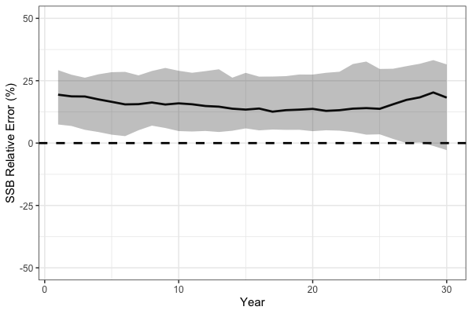

```{r setup, include=FALSE}
knitr::opts_chunk$set(
  collapse = TRUE,
  comment = "#>"
)
```

# Simulation Cross-Testing in `SPoRC`
Simulation testing stock assessment models is integral to evaluating robustness and understanding how models perform under model misspecification. The `SPoRC` framework supports simulation testing in three forms:  
- Self-testing: the estimation model (EM) has the same structure as the operating model (OM).  
- Cross-testing: the EM differs structurally from the OM, allowing assessment of bias and sensitivity to incorrect assumptions.  
- Closed loop simulations (see Closed Loop Simulations vignette example). 

In this first section of the vignette, we present a cross-test example. The operating model (OM; simulated truth) assumes a logistic selectivity curve for the fishery, while the estimation model (`SPoRC`; EM) incorrectly specifies a dome-shaped (gamma) selectivity curve.  

The OM defines the biological processes, fishing dynamics, survey structure, and recruitment assumptions. Unless otherwise noted, the OM observation model uses default settings:  

- Composition Input Sample Size = 100, with Multinomial sampling (Fishery and Survey)
- Survey index SD = 0.2, with lognormal observations
- Catch SD = 0.02, with lognormal observations  

## Define Model Dimensions

We start by defining the structural dimensions of the operating model.

```{r, eval=FALSE}
library(SPoRC)
library(dplyr)
library(ggplot2)

sim_list <- Setup_Sim_Dim(
  n_sims        = 50,  # number of simulations
  n_yrs         = 30,  # number of years
  n_regions     = 1,   # single region
  n_ages        = 10,  # number of ages
  n_lens        = NULL,# no length structure
  n_sexes       = 1,   # single sex
  n_fish_fleets = 1,   # one fishery fleet
  n_srv_fleets  = 1,    # one survey fleet
  n_pop         = 1    # number of pops
)

# Create storage containers
sim_list <- Setup_Sim_Containers(sim_list)
```

## Fishing Processes

The fishery selectivity in the OM is logistic, centered around age 5.

```{r, eval=FALSE}
sim_list <- Setup_Sim_Fishing(sim_list = sim_list, # update simulate list
                              # Logistic selectivity
                              fish_sel_input = replicate(
                                n = sim_list$n_sims,
                                array(rep(1 / (1 + exp(-3 * ((1:sim_list$n_ages) - 5))), each = sim_list$n_yrs),
                                      dim = c(sim_list$n_pop, sim_list$n_regions, sim_list$n_yrs, sim_list$n_seas, sim_list$n_ages,
                                              sim_list$n_sexes, sim_list$n_fish_fleets))
                              )
)
```

## Survey Processes

We specify survey selectivity as logistic, centered around age 3.

```{r, eval=FALSE}
sim_list <- Setup_Sim_Survey(
  sim_list = sim_list,
  # Logistic selectivity
  srv_sel_input = replicate(
    n = sim_list$n_sims,
    array(rep(1 / (1 + exp(-1 * ((1:sim_list$n_ages) - 3))), each = sim_list$n_yrs),
          dim = c(sim_list$n_pop, sim_list$n_regions, sim_list$n_yrs, sim_list$n_seas, sim_list$n_ages,
                  sim_list$n_sexes, sim_list$n_srv))
  )
)
```

## Biological Dynamics

Biological parameters are set for natural mortality, maturity-at-age, and weight-at-age. These values are relatively arbitrary and are specified to generically represent a fairly short-lived species.

```{r, eval=FALSE}
sim_list <- Setup_Sim_Biologicals(
  sim_list = sim_list, # simualtion list
  natmort_input = replicate(n = sim_list$n_sims, array(0.3, dim = c(sim_list$n_pop, sim_list$n_regions, sim_list$n_yrs,
                                                                    sim_list$n_ages, sim_list$n_sexes))), # natural mortality
  WAA_input = replicate(n = sim_list$n_sims, array(rep(5 / (1 + exp(-3 * ((1:sim_list$n_ages) - 3))), each = sim_list$n_yrs),
                                                   dim = c(sim_list$n_pop, sim_list$n_regions, sim_list$n_yrs, sim_list$n_seas, sim_list$n_ages, sim_list$n_sexes))), # weight at age
  WAA_fish_input = replicate(n = sim_list$n_sims, array(rep(5 / (1 + exp(-3 * ((1:sim_list$n_ages) - 3))), each = sim_list$n_yrs),
                                                        dim = c(sim_list$n_pop, sim_list$n_regions, sim_list$n_yrs, sim_list$n_seas, sim_list$n_ages, sim_list$n_sexes, sim_list$n_fish_fleets))), # fishery weight at age
  WAA_srv_input = replicate(n = sim_list$n_sims, array(rep(5 / (1 + exp(-3 * ((1:sim_list$n_ages) - 3))), each = sim_list$n_yrs),
                                                       dim = c(sim_list$n_pop, sim_list$n_regions, sim_list$n_yrs, sim_list$n_seas, sim_list$n_ages, sim_list$n_sexes, sim_list$n_srv_fleets))), # survey weight at age
  MatAA_input = replicate(n = sim_list$n_sims, array(rep(1 / (1 + exp(-3 * ((1:sim_list$n_ages) - 3))), each = sim_list$n_yrs),
                                                     dim = c(sim_list$n_pop, sim_list$n_regions, sim_list$n_yrs, sim_list$n_seas, sim_list$n_ages, sim_list$n_sexes))) # maturity at age
)

```

## Tagging and Movement

For this example, tagging is disabled and no movement is modeled.
```{r, eval=FALSE}
sim_list <- Setup_Sim_Tagging(
  sim_list = sim_list, # simulation list
  use_conv_fish_tagging = 0
)

# No Movement
sim_list$Movement <- array(1, dim = c(sim_list$n_pop, sim_list$n_regions, sim_list$n_regions, sim_list$n_yrs, sim_list$n_seas, sim_list$n_ages, sim_list$n_sexes, sim_list$n_sims))
```

## Recruitment

Recruitment is modeled with mean recruitment dynamics, where `R0_input` is the mean recruitment parameter centered at a value of 5.

```{r, eval=FALSE}
sim_list <- Setup_Sim_Rec(
  sim_list = sim_list,
  R0_input = replicate(n = sim_list$n_sims, expr = array(5, dim = c(sim_list$n_pop, sim_list$n_regions, sim_list$n_yrs))), # R0
  ln_sigmaR = array(log(1), dim = c(2, sim_list$n_pop, sim_list$n_regions)),
  recruitment_opt = 'mean_rec',
  init_age_strc = 1 # using geometric series scalar to initialize popn
)
```

## Run the Operating Model

```{r, eval=FALSE}
set.seed(123)
sim_obj <- Simulate_Pop_Static(sim_list = sim_list, output_path = NULL) # get simulated datasets
```

The object `sim_obj` contains the simulated population, fishery, and survey data ready to pass to the EM for cross-testing.

## Define Estimation Model
After simulating the operating model (OM), we can set up the estimation model (EM) in `SPoRC`.  
In this cross-test, the EM incorrectly assumes a dome-shaped (gamma) fishery selectivity,  
even though the OM used logistic selectivity. In general, EM settings are identical to the OM, except for fishery selectivity.

```{r, eval = FALSE}
setup_em <- function(sim_obj, sim) {

  # Extract simulation data for current year and replicate
  sim_data <- simulation_data_to_SPoRC(sim_env = sim_obj, y = sim_obj$n_years, sim = sim)

  # Setup model dimensions
  input_list <- Setup_Mod_Dim(
    years = 1:sim_obj$n_years,
    ages = 1:sim_obj$n_ages,
    lens = sim_obj$n_lens,
    n_regions = sim_obj$n_regions,
    n_sexes = sim_obj$n_sexes,
    n_fish_fleets = sim_obj$n_fish_fleets,
    n_srv_fleets = sim_obj$n_srv_fleets,
    n_pop = sim_obj$n_pop,
    verbose = FALSE
  )

  # Recruitment setup
  input_list <- Setup_Mod_Rec(
    input_list = input_list,
    do_rec_bias_ramp = 0, # not doing bias ramp
    sigmaR_switch = 1, # when to switch from early to late sigmaR (switch in first year)
    ln_sigmaR = array(log(1), dim = c(2, input_list$data$n_pop, input_list$data$n_regions)), # 2 values for early and late sigma
    rec_model = "mean_rec",
    sigmaR_spec = "fix", # fix early sigmaR and late sigmaR
    init_age_strc = 1, # geometric series to derive initial age structure
    equil_init_age_strc = 2, # estimating all intial age deviations
    ln_global_R0 = log(5)
  )

  # Biological setup
  input_list <- Setup_Mod_Biologicals(
    input_list = input_list,
    # Data inputs
    WAA = sim_data$WAA,
    MatAA = sim_data$MatAA,
    WAA_fish = sim_data$WAA_fish,
    WAA_srv = sim_data$WAA_srv,
    fit_lengths = 0, # not fitting lengths
    AgeingError = sim_data$AgeingError,
    M_spec = "fix",     # fixing natural mortality
    Fixed_natmort = array(0.3, dim = c(input_list$data$n_pop, input_list$data$n_regions, length(input_list$data$years),  length(input_list$data$ages), input_list$data$n_sexes))
  )

  # Movement and tagging
  input_list <- Setup_Mod_Tagging(input_list = input_list, use_conv_fish_tagging = 0)
  input_list <- Setup_Mod_Movement(
    input_list = input_list,
    use_fixed_movement = 1,
    Fixed_Movement = NA,
    do_recruits_move = 0
  )

  # Fishery catch & fishing mortality
  input_list <- Setup_Mod_Catch_and_F(
    input_list = input_list,
    # Data inputs
    ObsCatch = sim_data$ObsCatch,
    UseCatch = sim_data$UseCatch,
    # Model options
    Use_F_pen = 1,
    sigmaC_spec = "fix",
    # Fixing sigma C and F
    ln_sigmaC = sim_data$ln_sigmaC,
    ln_sigmaF = array(log(1), dim = c(input_list$data$n_regions, input_list$data$n_seas, input_list$data$n_fish_fleets))
    )

  # Survey selectivity and catchability
  input_list <- Setup_Mod_FishIdx_and_Comps(
    input_list = input_list,
    # Data inputs
    ObsFishIdx = sim_data$ObsFishIdx,
    ObsFishIdx_SE = sim_data$ObsFishIdx_SE,
    UseFishIdx = sim_data$UseFishIdx,
    ObsFishAgeComps = sim_data$ObsFishAgeComps,
    ObsFishLenComps = sim_data$ObsFishLenComps,
    UseFishAgeComps = sim_data$UseFishAgeComps,
    UseFishLenComps = sim_data$UseFishLenComps,
    ISS_FishAgeComps = sim_data$ISS_FishAgeComps,
    ISS_FishLenComps = sim_data$ISS_FishLenComps,
    # Model options
    fish_idx_type = c("biom"),
    FishAgeComps_LikeType = c("Multinomial"),
    FishLenComps_LikeType = c("none"),
    FishAgeComps_Type = c("agg_Year_1-terminal_Fleet_1"),
    FishLenComps_Type = c("none_Year_1-terminal_Fleet_1")
  )

  # Survey indices and compositions
  input_list <- Setup_Mod_SrvIdx_and_Comps(
    input_list = input_list,
    # Data inputs
    ObsSrvIdx = sim_data$ObsSrvIdx,
    ObsSrvIdx_SE = sim_data$ObsSrvIdx_SE,
    UseSrvIdx = sim_data$UseSrvIdx,
    ObsSrvAgeComps = sim_data$ObsSrvAgeComps,
    ObsSrvLenComps = sim_data$ObsSrvLenComps,
    UseSrvAgeComps = sim_data$UseSrvAgeComps,
    UseSrvLenComps = sim_data$UseSrvLenComps,
    ISS_SrvAgeComps = sim_data$ISS_SrvAgeComps,
    ISS_SrvLenComps = sim_data$ISS_SrvLenComps,
    # Model options
    srv_idx_type = c("biom"),
    SrvAgeComps_LikeType = c("Multinomial"),
    SrvLenComps_LikeType = c("none"),
    SrvAgeComps_Type = c("agg_Year_1-terminal_Fleet_1"),
    SrvLenComps_Type = c("none_Year_1-terminal_Fleet_1")
  )


  # Fishery selectivity and catchability
  input_list <- Setup_Mod_Fishsel_and_Q(
    input_list = input_list,
    # Model options
    fish_sel_model = c("gamma_Fleet_1"), # fishery selex model (NOTE: ASSUMES DOMED)
    fish_fixed_sel_pars_spec = c("est_all"), # whether to estiamte all fixed effects for fishery selectivity
    fish_q_spec = "est_all" # estimate fishery q
  )

  # Survey selectivity and catchability
  input_list <- Setup_Mod_Srvsel_and_Q(
    input_list = input_list,
    # Model options
    srv_sel_model = c("logist2_Fleet_1"), # survey selectivity form
    srv_fixed_sel_pars_spec = c("est_all"), # whether to estimate all fixed effects for survey selectivity
    srv_q_spec = c("est_all")  # whether to estiamte all fixed effects for survey catchability
  )

  # Data weighting
  input_list <- Setup_Mod_Weighting(
    input_list = input_list,
    Wt_Catch = 1,
    Wt_FishIdx = 1,
    Wt_SrvIdx = 1,
    Wt_Rec = 1,
    Wt_F = 1,
    Wt_Tagging = 0,
    Wt_FishAgeComps = array(1, dim = c(input_list$data$n_regions, length(input_list$data$years), input_list$data$n_seas,
                                       input_list$data$n_sexes, input_list$data$n_fish_fleets)),
    Wt_FishLenComps = array(1, dim = c(input_list$data$n_regions, length(input_list$data$years), input_list$data$n_seas,
                                       input_list$data$n_sexes, input_list$data$n_fish_fleets)),
    Wt_SrvAgeComps = array(1, dim = c(input_list$data$n_regions,length(input_list$data$years), input_list$data$n_seas,
                                      input_list$data$n_sexes, input_list$data$n_srv_fleets)),
    Wt_SrvLenComps = array(0, dim = c(input_list$data$n_regions, length(input_list$data$years), input_list$data$n_seas,
                                      input_list$data$n_sexes, input_list$data$n_srv_fleets))
  )

  return(input_list)

}
```

## Run Cross-Test Analysis

After setting up the EM, we can run the cross-test by fitting the model to each simulated dataset.  
We store the resulting spawning stock biomass (SSB) estimates for comparison with the OM.

```{r, eval = FALSE}
ssb_results <- array(NA, dim = c(sim_list$n_yrs, sim_list$n_sims)) # storage container
for(i in 1:sim_obj$n_sims) {

  input_list <- setup_em(sim_obj, sim = i) # setup EM

  # fit model
  model <- fit_model(input_list$data,
                     input_list$par,
                     input_list$map,
                     random = NULL,
                     silent = TRUE
                     )

  ssb_results[,i] <- as.vector(model$rep$SSB) # save results

} # end i loop
```

As expected, the simulation cross-test demonstrates that misspecification of fishery selectivity leads to biased estimates of key population quantities.  In particular, spawning stock biomass (SSB) is positively biased because the EM incorrectly assumes dome-shaped selectivity while the true OM selectivity is logistic, treating a portion of the population as invulnerable to the fishery, leading to an overestimation of stock size.

```{r, eval = FALSE}
# Process SSB results
ssb_df_res <- reshape2::melt(ssb_results) %>%
  rename(Year = Var1, Sim = Var2, Est = value) %>%
  dplyr::left_join(reshape2::melt(sim_obj$SSB) %>%
                     dplyr::rename(Region = Var2, Year = Var3, Sim = Var4, True = value), by = c("Year", "Sim")) %>%
  dplyr::mutate(RE = (Est - True) / True * 100) %>%
  dplyr::group_by(Year) %>%
  dplyr::summarize(median = median(RE, na.rm = TRUE),
                   lwr = quantile(RE, 0.1, na.rm = TRUE),
                   upr = quantile(RE, 0.8, na.rm = TRUE))

# plot!
print(
  ggplot(ssb_df_res, aes(x = Year, y = median, ymin = lwr, ymax = upr)) +
    geom_line(lwd = 1.3) +
    geom_hline(yintercept = 0, lwd = 1.3, lty = 2) +
    coord_cartesian(ylim = c(-50, 50)) +
    geom_ribbon(alpha = 0.3) +
    theme_bw(base_size = 15) +
    labs(x = 'Year', y = 'SSB Relative Error (%)')
)
```





# Self Testing

In addition to simulation cross-testing, users can also conduct self-tests. Simulation self-testing is useful because it helps evaluate model robustness in the context of parameter identifiability. Ideally, a simulation self-test should return unbiased parameter estimates on average. If it does not, this generally indicates a lack of identifiability for some parameters given the available data. Here, we demonstrate simulation self-testing using Dusky Rockfish as an example. Simulation self-testing is facilitated by the helper function `simulation_self_test`, which allows users to conduct simulations using a fitted `SPoRC` model (i.e., providing `data`, `parameters`, `mapping`, `rep`, and `sd_rep`). To reduce computation time, we parallelize the simulations across 8 cores and output estimates of SSB and recruitment.

```{r, eval = FALSE}
# load in dusky rockfish model
data("dusky_rtmb_model")

# Using Dusky Rockfish as example to conduct simulation self-testing
self_test <- simulation_self_test(
  data = dusky_rtmb_model$data,
  parameters = dusky_rtmb_model$parameters,
  mapping = dusky_rtmb_model$mapping,
  random = NULL,
  rep = dusky_rtmb_model$rep,
  sd_rep = dusky_rtmb_model$sdrep,
  n_sims = 300,
  newton_loops = 3,
  do_sdrep = FALSE,
  do_par = TRUE,
  n_cores = 8,
  output_path = NULL,
  what = c("SSB", "Rec")
)
```

`simulation_self_test` has two designs. Under `sim_type = "conditional"` (the default) every replicate runs at the fitted parameters and the fitted process deviations (recruitment, the numbers at age state, and the catchability, movement, growth and selectivity deviations), and only the observations are drawn again. It checks whether the data return the population the fit describes, which tests the observation model and how well the data identify the parameters. In theory, process sds come back low under it, since the replicates are run on deviations the fit has already shrunk toward zero. Under `sim_type = "joint"` each replicate draws its parameters from the fit's joint precision (`RTMB::sdreport(obj, getJointPrecision = TRUE)`, passed with `obj`), then every process is drawn new at those parameters from the penalty the estimation model puts on it, then the observations. It checks whether the model recovers a population it could itself have generated, process sds included, and each replicate is compared with its own truth. F deviations estimated as penalized fixed effects are not redrawn (only redrawn under Laplace approimation).

Also note that a fit with movement random effects (`move_year_re`, `move_age_re`, `move_pop_re`, `move_seas_re` or `move_sex_re` in `Setup_Mod_Movement()`) comes into the self test and the closed loop on its own without additional setup. A conditional self test and a closed loop's fitted years keep the fit's deviations, so the historical movement is the fit's. A joint self test draws every year new, and a closed loop draws its projection years, from the process the estimation model penalizes, at the fitted sd and correlations (each replicate's own under joint), a closed loop's AR1 continuing from the last fitted year, and the movement matrix is rebuilt from them before the population is run. An operating model built by hand from such a fit takes the same step through `Setup_Sim_Movement()`, which stores the fit's switches, process error parameters and movement arguments on the simulation list; `Setup_sim_env()` then draws and rebuilds. A fit whose movement deviations a dsem holds or links is drawn by `Setup_Sim_DSEM()` instead and rebuilt through the same arguments.

```{r, eval = FALSE}
# a fit with AR1 movement deviations over years, sex-specific and correlated across sexes
input_list <- Setup_Mod_Movement(input_list, use_fixed_movement = 0, Fixed_Movement = NA,
                                 move_year_re = "ar1", move_sex_re = "us")
fit <- fit_model(input_list$data, input_list$par, input_list$map, random = "move_devs")

# an operating model built by hand: the fit's movement, then its deviation process
sim_list$Movement <- replicate(sim_list$n_sims, fit$rep$Movement)
sim_list <- Setup_Sim_Movement(sim_list, fit$data, fit$env$parList())
sim_env <- Setup_sim_env(sim_list) # every replicate now holds its own move_devs and Movement
```

A fit with growth deviations (`growth_tv_model` or `growth_semipar` in `Setup_Mod_Biologicals()`) can be setup in the same way. As for movement, a conditional self test and a closed loop's fitted years keep the fit's deviations, and a joint self test draws every year at each replicate's own growth parameters, as a closed loop draws its projection years given the fitted ones, from the form the estimation model penalizes them under, iid, random walk, separable AR1 or the three dimensional field, at the fitted process error parameters and under the fit's maps, so a random walk steps on from the last fitted year, the correlated forms are drawn conditional on the fitted years, a cell the map fixes stays at zero and a shared level takes one draw; weight at age, the size-age keys and selectivity at age are then rebuilt through the fit's own `Get_Growth()`. An operating model built by hand without `n_cond_yrs` on its simulation list draws every year. Under cohort growth only the years before the propagation starts are built up front, and the annual cycle advances the rest from each replicate's own numbers at age. An operating model built by hand takes the step through `Setup_Sim_Growth_RE()`, which needs the fit's report under selectivity at length. A dsem holding or linking any growth deviation draws both arrays through `Setup_Sim_DSEM()` instead. A random walk whose first year the estimation model gives the diffuse `growth_rw_init_sigma` keeps that year at the replicate's own value, since a diffuse start leaves the level to the data rather than to the process, and the walk steps on from it; under `growth_rw_init_sigma = NA` the first year is drawn at the walk's own sd, as the penalty reads it. F and recruitment walks treat their diffuse first year the same way.

```{r, eval = FALSE}
# a fit with iid deviations on L1 and a random walk on K, their sds estimated
input_list <- Setup_Mod_Biologicals(input_list, ..., growth_tv_model = c(L1 = "iid", K = "rw"), growth_tv_sigma_spec = "est")
fit <- fit_model(input_list$data, input_list$par, input_list$map, random = "ln_growth_devs")

# an operating model built by hand: the fit's growth, then its deviation process
sim_list$WAA <- replicate(sim_list$n_sims, fit$rep$WAA) # and WAA_fish, WAA_srv, SizeAgeTrans_fish, SizeAgeTrans_srv the same way
sim_list <- Setup_Sim_Growth_RE(sim_list, fit$data, fit$env$parList(), rep = fit$rep)
sim_env <- Setup_sim_env(sim_list) # every replicate now holds its own ln_growth_devs and weight at age
```

Recruitment is treated the same way in the self test. A conditional self test runs each replicate on the fit's recruitment, and a joint self test applies deviations drawn from the penalty the fit puts on them to the stock-recruit curve at each replicate's parameters: about minus half the variance times that year's bias ramp under `"iid"`, from the previous year under `"rw"`, and about the centered mean under `"ar1"`, each at the early or late sigma and narrowed by `Wt_Rec` as the weighted penalty is. A deviation the fit leaves unpenalized keeps the fit's value, which covers the first years under `dont_pen_recdev_first`, a walk's first year under its diffuse start, and a deviation mapped off. The initial age deviations are the fit's under conditional, and under joint they are drawn from their own penalty as well, about minus half the early variance times the bias ramp at the year each age was born, a second sex tied to the first through its penalty when `Use_init_sex_pen = 1`. An operating model built by hand passes deviations of its own through `ln_RecDevs_input` in `Setup_Sim_Rec()`.

Priors and penalties need separate treatment. A prior's mean is data each refit reads, but the self test does not redraw it with the observations, so wherever the data pulled the fit away from a prior every replicate is pulled back toward it, and the self test reports a bias the design creates rather than the estimator. `prior_means = "truth"` centers each catchability, natural mortality, steepness, R0 and selectivity prior on the value the replicate ran on and keeps its sd, and puts the mode of each Dirichlet (movement, recruitment apportionment) and mean and sd beta (stray rate, tag reporting rate) on the value the replicate ran on while keeping its concentration, so none of them pulls at the truth (the symmetric beta on the tag reporting rate sits at one half by construction and is left as given); `"off"` turns the priors off, which frees any parameter only a prior identifies, and the default `"assessment"` keeps them as the assessment gives them. A penalty that describes a process, a deviation with an sd, is drawn from instead, as above. A penalty that regularizes, such as the smoothness and curvature penalties on a bicubic selectivity surface, has no mean or sd to draw from, and any bias it shows is therfore real. Note that recruitment deviations estimated as penalized fixed effects rather than integrated out are likely to show a real bias too, an R0 that rises to reproduce the indices from shrunk deviations, while spawning biomass, F and the mean of the estimated recruitments stay close to the truth.

A fit with catchability deviations (`fish_q_model` or `srv_q_model` set to `"iid"`, `"rw"` or `"ar1"`) is treated the same way in the self test. A conditional self test keeps the fit's deviations, and a joint self test draws every year fresh from the form the estimation model penalizes, at each replicate's own sigma and correlation, as a closed loop draws its projection years on from the last fitted one. A year that `q_re_years` leaves out, or a region with no index, keeps the fit's value, since the fit estimates no deviation there, and a walk the fit starts diffusely (`srv_q_rw_init_sigma`) keeps its first estimated year at the replicate's own value, as the F, selectivity and growth walks do. An operating model built by hand sets the same process through `Setup_Sim_q_devs()`.

A fit with selectivity deviations (`cont_tv_fish_sel`, `cont_tv_ret_sel`, `cont_tv_srv_sel`, or the bin-override deviations) is treated the same way. A conditional self test keeps the fit's deviations, and a joint self test draws them fresh in every fitted year from the form `Get_PE_loglik()` penalizes them under, at the fitted process error parameters and under the fit's maps, so a shared level takes one draw; selectivity at age is then rebuilt through the fit's own `Get_Selex_Array()`. F and discard mortality deviations are drawn the same way, F under `Fdev_model` with a closed year bridged at the elapsed number of years, but by default only when the fit integrates them out through `random`. As fixed effects their penalty is usually a loose constraint (`sigmaF = 1` by default), and drawing from it would replace the fitted F with noise, so a joint self test takes them from the parameter draw; an operating model built by hand draws them from the penalty anyway with `F_devs_draw = "all"` in `Setup_Sim_Fleet_Devs()`. In the drawn cells F is `exp(ln_F_mean + ln_F_devs)`. Selectivity at length is drawn at length and read through each replicate's own size-age key, by the growth rebuild when there is one. A penalty weighted by `*_pe_wt` is drawn at its sd over the square root of the weight, as F and discard mortality deviations are under `Wt_F` and `Wt_D` and recruitment and the initial ages under `Wt_Rec` and `Wt_Init_Rec`, and every refit keeps those weights, so it is the fit's own estimator; the data weights go to one in the refits, the observations having been drawn at the error they imply. A cell the fit's map fixes keeps its value, which a walk or a correlated field steps from. An F penalty that is off or centered on its own mean keeps the fit's deviations, with a message. A series shared over regions, sexes, bins or fleets is drawn once and written everywhere it appears. At-age data whose ages are correlated (`AgeObsCorr_*`) are drawn under the fit's form and correlations, the residuals of a fleet drawn whole before the first year. A closed loop draws selectivity deviations on through its projection years from the last fitted year under the same process, keeping the fitted years' selectivity and its standardization as the fit had them, while F past the fit stays the control rule's; a bicubic surface, with no year weights past the fit, repeats its last year. A random walk's first year follows the same rule as for growth, keeping the replicate's own value under the diffuse `*sel_rw_init_sigma` start. An operating model built by hand takes the step through `Setup_Sim_Fleet_Devs()`, and `Simulate_Pop_Static()` returns the draws as `ln_F_devs`, `logit_dmr_devs`, `ln_fishsel_devs` and the rest.

The observations are drawn under the likelihood the fit evaluates them with, so a self test refits data of the kind it was fit to. A data source reported once a year (`*_seas_Type = "aggSeas"`) is drawn once from the year's numbers, into the season the fit's `Use` array holds it in; a discard fraction is the year's discards over the year's catch, summed over populations and seasons before the ratio is taken, as the estimation model now predicts it. An index whose sd is partly estimated (`sigmaFishIdx_spec` or `sigmaSrvIdx_spec`) is drawn at the sd the fit forms, while the operating model keeps the reported errors the refit reads. A multivariate normal index is drawn over its whole covariance for the cells it covers. Negative binomial tag recaptures over pooled populations, ages or sexes (`conv_tag_*_pool`) are drawn once per pool at the fitted overdispersion, and the population-specific and year-total at-age data sources are drawn like the others. `simulation_data_to_SPoRC()` returns all of them, at-age data with the operating model's own use flags.

A fit whose length compositions are recorded on coarser bins than the population (`LenBinMap` in `Setup_Mod_Biologicals()`), or are selected at length (`FishLenComps_sel` or `SrvLenComps_sel` set to `"length"`), also comes into the self test and the closed loop without additional setup. The operating model maps each expected length composition onto the recorded bins before drawing it, as the estimation model maps it before evaluating the likelihood, and reads each expected age composition and each age-at-length row through the fleet's ageing error the same way, so a simulated composition comes from the distribution the fit evaluates. Under selectivity at length it spreads the fish at each age over length and selects them length by length from the fit's selectivity at length, as the estimation model does, and the conditional age-at-length is drawn from that same catch or index at length and age. An operating model built by hand takes the map through `n_obs_lens` in `Setup_Sim_Dim()` and `LenBinMap_input` in `Setup_Sim_Biologicals()`, and the selectivity at length through `fish_sel_l_input` and `ret_sel_l_input` in `Setup_Sim_Fishing()` and `srv_sel_l_input` in `Setup_Sim_Survey()`.

Neither `Setup_Sim_Movement()` nor `Setup_Sim_Growth_RE()` is required to read anything that an optimizer produced; both only need `data` and a parameter list in a fit's own array shape, so a process error series can be specified manually in place of an estimated one. This can be done with the function `Setup_Sim_Movement()`'s own replicate loop calls, matched to `data` and `pars` by `match_model_args()` the same way; although both functions are internal. Movement is self-contained enough that `Setup_Mod_Dim()` and `Setup_Mod_Movement()` alone give it everything it reads, with no `input_list` needed beforehand either, the same way a pure cross-test never uses one:

```{r, eval = FALSE}
# a bare input_list built from the OM's own dimensions, no EM or data involved
input_list <- Setup_Mod_Dim(years = 1:sim_list$n_yrs, ages = 1:sim_list$n_ages, lens = NULL,
                            n_regions = sim_list$n_regions, n_sexes = sim_list$n_sexes,
                            n_fish_fleets = sim_list$n_fish_fleets, n_srv_fleets = sim_list$n_srv_fleets,
                            n_pop = sim_list$n_pop)

# movement specified by hand instead of estimated
input_list <- Setup_Mod_Movement(input_list, use_fixed_movement = 0, Fixed_Movement = NA,
                                 move_year_re = "ar1", move_sex_re = "us")
input_list$par$move_pe_pars[] <- ... # chosen sd / correlation, not an estimate

move_args <- SPoRC:::match_model_args(SPoRC:::Get_Movement, input_list$data, input_list$par,
                                      n_yrs = sim_list$n_yrs, n_proj_yrs_devs = 0, n_ages = sim_list$n_ages)
movement <- do.call(SPoRC:::Get_Movement, move_args)

sim_list$Movement <- replicate(sim_list$n_sims, movement$Movement)
sim_list <- Setup_Sim_Movement(sim_list, input_list$data, input_list$par)
sim_env <- Setup_sim_env(sim_list) # every replicate now holds its own move_devs and Movement
```

Growth setup needs a little bit more, since `Get_Growth()` also reads `t_fish`, `t_srv`, `spawn_seas` and `t_spawn`, the within-season timing that `Setup_Mod_FishIdx_and_Comps()`, `Setup_Mod_SrvIdx_and_Comps()` and `Setup_Mod_Rec()` would otherwise supply from real fleet data. Plain placeholders for that timing, written onto `data` directly, serve just as well when nothing is actually being fit:

```{r, eval = FALSE}
# growth specified by hand instead of estimated, same dimensions plus length bins
input_list <- Setup_Mod_Biologicals(input_list, ..., growth_tv_model = c(L1 = "iid", K = "rw"), growth_tv_sigma_spec = "est")
input_list$par$growth_pe_pars[] <- ... # chosen sd, not an estimate

# the timing Setup_Mod_FishIdx_and_Comps / Setup_Mod_SrvIdx_and_Comps / Setup_Mod_Rec would otherwise supply
input_list$data$t_fish <- array(0, dim = c(input_list$data$n_regions, input_list$data$n_seas, input_list$data$n_fish_fleets))
input_list$data$t_srv <- array(0, dim = c(input_list$data$n_regions, input_list$data$n_seas, input_list$data$n_srv_fleets))
input_list$data$spawn_seas <- 1
input_list$data$t_spawn <- 0

growth_args <- SPoRC:::match_model_args(SPoRC:::Get_Growth, input_list$data, input_list$par, n_yrs = sim_list$n_yrs)
growth <- do.call(SPoRC:::Get_Growth, growth_args)

sim_list$WAA <- replicate(sim_list$n_sims, growth$WAA) # and WAA_fish, WAA_srv, SizeAgeTrans_fish, SizeAgeTrans_srv the same way
sim_list <- Setup_Sim_Growth_RE(sim_list, input_list$data, input_list$par, rep = NULL)
sim_env <- Setup_sim_env(sim_list) # every replicate now holds its own ln_growth_devs and weight at age
```

When no process error is wanted at all, none of this internal stuff is needed either: `sim_list$Movement` and growth's `sim_list$WAA` / `WAA_fish` / `WAA_srv` / `SizeAgeTrans_fish` / `SizeAgeTrans_srv` can be filled in directly, the same way the cross-test example above sets a flat `sim_list$Movement` by hand. `Setup_Sim_Movement()` and `Setup_Sim_Growth_RE()` exist only to draw and rebuild a deviation series around those arrays; skip both, and the internal calls above, once the arrays themselves are what is being specified.

The self-test indicates that the model is generally able to recover the overall trends well. However, some biases manifest in the early and late periods, likely due to uncertainty in catch data in the early period and a lack of age composition data during these periods.

```{r, eval = FALSE}
# Process self test results
self_test_res <- reshape2::melt(self_test$SSB) %>%
  dplyr::rename(Pop = Var1, Region = Var2, Year = Var3, Sim = Var4, Est = value) %>%
  dplyr::left_join(reshape2::melt(dusky_rtmb_model$rep$SSB) %>%
                     dplyr::rename(Region = Var2, Year = Var3, Best = value),
                   by = c("Region", "Year")) %>%
  dplyr::mutate(Type = 'SSB') %>%
  dplyr::bind_rows(
    reshape2::melt(self_test$Rec) %>%
  dplyr::rename(Pop = Var1, Region = Var2, Year = Var3, Sim = Var4, Est = value) %>%
      dplyr::left_join(reshape2::melt(dusky_rtmb_model$rep$Rec) %>%
                         dplyr::rename(Region = Var2, Year = Var3, Best = value),
                       by = c("Region", "Year")) %>%
      dplyr::mutate(Type = 'Rec')
  )

print(
  ggplot() +
    geom_line(self_test_res, mapping = aes(x = Year, y = Est, group = Sim)) +
    geom_line(self_test_res, mapping = aes(x = Year, y = Best), color = 'red', lty = 2, lwd = 1.3) +
    coord_cartesian(ylim = c(0, NA)) +
    facet_wrap(~Type, scales = 'free') +
    theme_bw(base_size = 15)
)
```


