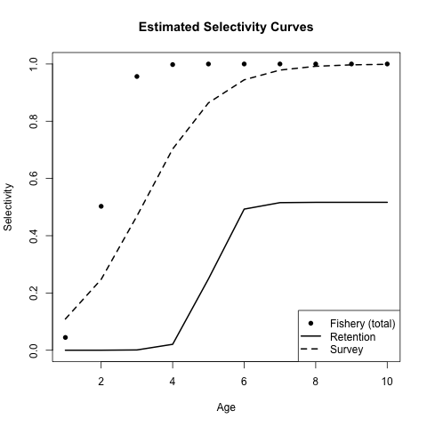
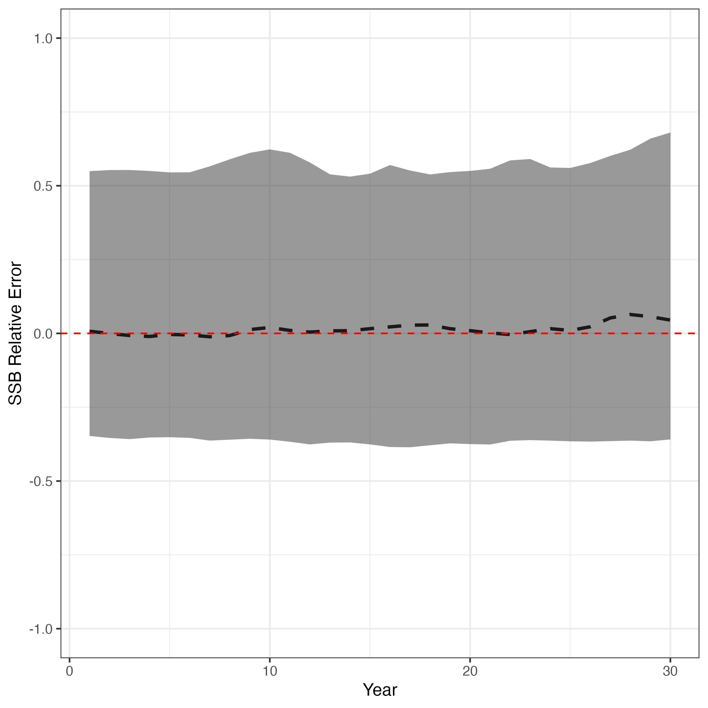

```{r, include = FALSE}
knitr::opts_chunk$set(
  collapse = TRUE,
  comment = "#>"
)
```

In some cases, some fisheries discard a portion of their catch at sea (i.e., non-retained catch). `SPoRC` supports explicit discard and retention modeling through several interconnected components:

- Total selectivity (`fish_sel`): the probability of encountering (catching)
  a fish at age.
- Retention selectivity (`ret_sel`): the probability that a caught fish is
  retained (landed), conditional on capture.
- Discard mortality rate (`dmr`): the fraction of discarded fish that die 

In the following, we will demonstrate how discarding and retention dynamics can be leveraged in both simulation and estimation using `SPoRC`.

## Operating Model Configuration

We begin by setting up a simple OM that consists of one region, one population, one sex, as well as single fishery and survey fleet. Note that data uncertainty (e.g., survey index standard deviations and input sample sizes) use the default settings. 

```{r, eval = FALSE}
library(SPoRC)

sim_list <- Setup_Sim_Dim(
  n_sims        = 50,
  n_yrs         = 30,
  n_regions     = 1,
  n_ages        = 10,
  n_lens        = NULL,
  n_sexes       = 1,
  n_fish_fleets = 1,
  n_srv_fleets  = 1,
  n_pop         = 1
)

sim_list <- Setup_Sim_Containers(sim_list)
```


### Fishery Selectivity and Retention

Total fishery selectivity follows a logistic curve with an inflection near age 2,
while retention selectivity is an asymptotic logistic that plateaus at 0.5
(i.e., fully selected older fish have only a 50% chance of being
retained). The dead discard rate is set at 0.5 across all years. Note that discard units to generate a discard time-series are in units of biomass fractions (default behavior). 

```{r, eval = FALSE}
sim_list <- Setup_Sim_Fishing(
  sim_list = sim_list,
  # Total fishery selectivity (logistic, inflection ~ age 2)
  fish_sel_input = replicate(
    n = sim_list$n_sims,
    array(
      rep(1 / (1 + exp(-3 * ((1:sim_list$n_ages) - 2))), each = sim_list$n_yrs),
      dim = c(sim_list$n_pop, sim_list$n_regions, sim_list$n_yrs,
              sim_list$n_seas, sim_list$n_ages, sim_list$n_sexes,
              sim_list$n_fish_fleets)
    )
  ),
  # Retention selectivity (asymptotic logistic, max ~ 0.5)
  ret_sel_input = replicate(
    n = sim_list$n_sims,
    array(
      rep(0.5 / (1 + exp(-3 * ((1:sim_list$n_ages) - 5))), each = sim_list$n_yrs),
      dim = c(sim_list$n_pop, sim_list$n_regions, sim_list$n_yrs,
              sim_list$n_seas, sim_list$n_ages, sim_list$n_sexes,
              sim_list$n_fish_fleets)
    )
  ),
  # Dead discard rate = 0.5
 dmr_input = array(0.5, dim = c(sim_list$n_regions, sim_list$n_yrs,
                                 sim_list$n_seas, sim_list$n_fish_fleets,
                                 sim_list$n_sims))
)
```

### Survey Process

The survey uses a logistic selectivity with a more gradual slope and later
inflection (age 3), mimicking a gear that selects somewhat older fish than the
fishery.

```{r, eval = FALSE}
sim_list <- Setup_Sim_Survey(
  sim_list = sim_list,
  srv_sel_input = replicate(
    n = sim_list$n_sims,
    array(
      rep(1 / (1 + exp(-1 * ((1:sim_list$n_ages) - 3))), each = sim_list$n_yrs),
      dim = c(sim_list$n_pop, sim_list$n_regions, sim_list$n_yrs,
              sim_list$n_seas, sim_list$n_ages, sim_list$n_sexes,
              sim_list$n_srv)
    )
  )
)
```

### Biological Parameters

Natural mortality is fixed at 0.3. Weight-at-age and maturity-at-age both follow
logistic growth/maturation curves with inflection at age 3.
```{r, eval = FALSE}
sim_list <- suppressWarnings(
  Setup_Sim_Biologicals(
    sim_list = sim_list,
    natmort_input = replicate(
      n = sim_list$n_sims,
      array(0.3, dim = c(sim_list$n_pop, sim_list$n_regions,
                         sim_list$n_yrs, sim_list$n_ages, sim_list$n_sexes))
    ),
    WAA_input = replicate(
      n = sim_list$n_sims,
      array(
        rep(5 / (1 + exp(-3 * ((1:sim_list$n_ages) - 3))), each = sim_list$n_yrs),
        dim = c(sim_list$n_pop, sim_list$n_regions, sim_list$n_yrs,
                sim_list$n_seas, sim_list$n_ages, sim_list$n_sexes)
      )
    ),
    WAA_fish_input = replicate(
      n = sim_list$n_sims,
      array(
        rep(5 / (1 + exp(-3 * ((1:sim_list$n_ages) - 3))), each = sim_list$n_yrs),
        dim = c(sim_list$n_pop, sim_list$n_regions, sim_list$n_yrs,
                sim_list$n_seas, sim_list$n_ages, sim_list$n_sexes,
                sim_list$n_fish_fleets)
      )
    ),
    WAA_srv_input = replicate(
      n = sim_list$n_sims,
      array(
        rep(5 / (1 + exp(-3 * ((1:sim_list$n_ages) - 3))), each = sim_list$n_yrs),
        dim = c(sim_list$n_pop, sim_list$n_regions, sim_list$n_yrs,
                sim_list$n_seas, sim_list$n_ages, sim_list$n_sexes,
                sim_list$n_srv_fleets)
      )
    ),
    MatAA_input = replicate(
      n = sim_list$n_sims,
      array(
        rep(1 / (1 + exp(-3 * ((1:sim_list$n_ages) - 3))), each = sim_list$n_yrs),
        dim = c(sim_list$n_pop, sim_list$n_regions, sim_list$n_yrs,
                sim_list$n_seas, sim_list$n_ages, sim_list$n_sexes)
      )
    )
  )
)
```

### Tagging and Movement

No tagging or movement is used in this example.
```{r, eval = FALSE}
sim_list <- Setup_Sim_Tagging(
  sim_list       = sim_list,
  use_conv_fish_tagging = 0
)

sim_list$Movement <- array(
  1,
  dim = c(sim_list$n_pop, sim_list$n_regions, sim_list$n_regions,
          sim_list$n_yrs, sim_list$n_seas, sim_list$n_ages,
          sim_list$n_sexes, sim_list$n_sims)
)
```

### Recruitment
Recruitment follows a mean-recruitment model (no stock–recruit relationship) with
`R0` = 5 and recruitment variability (`sigmaR`) of 0.5.

```{r, eval = FALSE}
sim_list <- Setup_Sim_Rec(
  sim_list       = sim_list,
  R0_input       = replicate(
    n    = sim_list$n_sims,
    expr = array(5, dim = c(sim_list$n_pop, sim_list$n_regions, sim_list$n_yrs))
  ),
  ln_sigmaR      = array(log(0.5), dim = c(2, sim_list$n_pop, sim_list$n_region)),
  recruitment_opt = "mean_rec",
  init_age_strc  = 1
)
```

## Data Simulation
With the OM fully specified, we simulate population dynamics and generate
observation data.

```{r, eval = FALSE}
set.seed(777)
sim_obj <- Simulate_Pop_Static(sim_list = sim_list, output_path = NULL)
```

## Estimation Model

The estimation model mirrors the OM structure but estimates key parameters: fishery
selectivity (logistic), retention selectivity (asymptotic logistic), survey
selectivity (logistic), catchability, recruitment deviations, and the dead
discard rate. The function below encapsulates the full EM setup for a single
simulation replicate.

```{r, eval = FALSE}
setup_em <- function(sim_obj, sim) {

  # get simulation data
  sim_data <- simulation_data_to_SPoRC(
    sim_env = sim_obj, y = sim_obj$n_years, sim = sim
  )

  # Model dimensions
 input_list <- Setup_Mod_Dim(
    years          = 1:sim_obj$n_years,
    ages           = 1:sim_obj$n_ages,
    lens           = sim_obj$n_lens,
    n_regions      = sim_obj$n_regions,
    n_sexes        = sim_obj$n_sexes,
    n_fish_fleets  = sim_obj$n_fish_fleets,
    n_srv_fleets   = sim_obj$n_srv_fleets,
    n_pop          = sim_obj$n_pop,
    natal_region   = sim_obj$natal_region,
    verbose        = FALSE
  )

  # Recruitment
  input_list <- Setup_Mod_Rec(
    input_list        = input_list,
    do_rec_bias_ramp  = 0,
    sigmaR_switch     = 1,
    ln_sigmaR         = array(log(0.5), c(2, input_list$data$n_pop,
                                          input_list$data$n_regions)),
    rec_model         = "mean_rec",
    sigmaR_spec       = "fix",
    init_age_strc     = 1,
    equil_init_age_strc = 2,
    ln_global_R0      = log(5)
  )

  # Biologicals
  input_list <- Setup_Mod_Biologicals(
    input_list    = input_list,
    WAA           = sim_data$WAA,
    MatAA         = sim_data$MatAA,
    WAA_fish      = sim_data$WAA_fish,
    WAA_srv       = sim_data$WAA_srv,
    fit_lengths   = 0,
    AgeingError   = sim_data$AgeingError,
    M_spec        = "fix",
    Fixed_natmort = array(0.3, dim = c(input_list$data$n_pop,
                                       input_list$data$n_regions,
                                       length(input_list$data$years),
                                       length(input_list$data$ages),
                                       input_list$data$n_sexes))
  )

  # Tagging and movement (none)
  input_list <- Setup_Mod_Tagging(input_list = input_list, use_conv_fish_tagging = 0)
  input_list <- Setup_Mod_Movement(
    input_list         = input_list,
    use_fixed_movement = 1,
    Fixed_Movement     = NA,
    do_recruits_move   = 0
  )

  # Catch, fishing mortality, and discards
  input_list <- Setup_Mod_Catch_and_F(
    input_list     = input_list,
    ObsCatch       = sim_data$ObsCatch,
    UseCatch       = sim_data$UseCatch,
    Use_F_pen      = 1,
    sigmaC_spec    = "fix",
    ln_sigmaC      = sim_data$ln_sigmaC,
    ln_sigmaF      = array(log(1), dim = c(input_list$data$n_regions,
                                           input_list$data$n_seas,
                                           input_list$data$n_fish_fleets)),
    
    # Discard data (discard units are biomass fractions as default)
    ObsDiscard     = sim_data$ObsDiscard, # observed discards
    UseDiscard     = sim_data$UseDiscard, # using discards
    sigma_dmr_spec = "fix", # fixing the SD of the discard mortality rate deviations
    dmr_mean_spec  = "est_all", # estimating the mean discard mortality rate
    # dmr_dev_spec is left at its "fix" default here, so no annual deviations
    # are estimated and dmr is the estimated mean in every year
    ln_sigmaD      = sim_data$ln_sigmaD # discard time series uncertainty
  )

  # Fishery indices and compositions (retained + discard)
  input_list <- Setup_Mod_FishIdx_and_Comps(
    input_list = input_list,

    # Fishery index
    ObsFishIdx    = sim_data$ObsFishIdx,
    ObsFishIdx_SE = sim_data$ObsFishIdx_SE,
    UseFishIdx    = sim_data$UseFishIdx,

    # Retained age compositions
    ObsFishAgeComps  = sim_data$ObsFishAgeComps,
    ObsFishLenComps  = sim_data$ObsFishLenComps,
    UseFishAgeComps  = sim_data$UseFishAgeComps,
    UseFishLenComps  = sim_data$UseFishLenComps,
    ISS_FishAgeComps = sim_data$ISS_FishAgeComps,
    ISS_FishLenComps = sim_data$ISS_FishLenComps,

    fish_idx_type        = "biom",
    FishAgeComps_LikeType = "Multinomial",
    FishLenComps_LikeType = "none",
    FishAgeComps_Type     = "agg_Year_1-terminal_Fleet_1",
    FishLenComps_Type     = "none_Year_1-terminal_Fleet_1",

    # Discard age compositions
    ObsFishAgeComps_discard      = sim_data$ObsFishAgeComps_discard,
    UseFishAgeComps_discard      = sim_data$UseFishAgeComps_discard,
    ISS_FishAgeComps_discard     = sim_data$ISS_FishAgeComps_discard,
    FishAgeComps_discard_LikeType = rep("Multinomial", input_list$data$n_fish_fleets),
    FishAgeComps_discard_Type     = "agg_Year_1-terminal_Fleet_1",
  )

  # Survey indices and compositions
  input_list <- Setup_Mod_SrvIdx_and_Comps(
    input_list = input_list,
    ObsSrvIdx        = sim_data$ObsSrvIdx,
    ObsSrvIdx_SE     = sim_data$ObsSrvIdx_SE,
    UseSrvIdx        = sim_data$UseSrvIdx,
    ObsSrvAgeComps   = sim_data$ObsSrvAgeComps,
    ObsSrvLenComps   = sim_data$ObsSrvLenComps,
    UseSrvAgeComps   = sim_data$UseSrvAgeComps,
    UseSrvLenComps   = sim_data$UseSrvLenComps,
    ISS_SrvAgeComps  = sim_data$ISS_SrvAgeComps,
    ISS_SrvLenComps  = sim_data$ISS_SrvLenComps,
    srv_idx_type          = "biom",
    SrvAgeComps_LikeType  = "Multinomial",
    SrvLenComps_LikeType  = "none",
    SrvAgeComps_Type      = "agg_Year_1-terminal_Fleet_1",
    SrvLenComps_Type      = "none_Year_1-terminal_Fleet_1"
  )

  # Fishery selectivity: logistic for total, asymptotic logistic for retention
  input_list <- Setup_Mod_Fishsel_and_Q(
    input_list              = input_list,
    fish_sel_model          = "logist1_Fleet_1",
    fish_fixed_sel_pars_spec = "est_all",
    fish_q_spec             = "est_all",
    ret_sel_model           = "asymplogist1_Fleet_1",
    ret_fixed_sel_pars_spec = "est_all",
    use_fixed_ret_sel       = 0
  )

  # Survey selectivity
  input_list <- Setup_Mod_Srvsel_and_Q(
    input_list              = input_list,
    srv_sel_model           = "logist1_Fleet_1",
    srv_fixed_sel_pars_spec = "est_all",
    srv_q_spec              = "est_all"
  )

  # Data weighting (no data weights used)
  input_list <- Setup_Mod_Weighting(
    input_list     = input_list,
    Wt_Catch       = 1,
    Wt_FishIdx     = 1,
    Wt_SrvIdx      = 1,
    Wt_Rec         = 1,
    Wt_F           = 1,
    Wt_Discard     = 1,
    Wt_D           = 1,
    Wt_FishAgeComps = array(1, dim = c(input_list$data$n_regions,
                                       length(input_list$data$years),
                                       input_list$data$n_seas,
                                       input_list$data$n_sexes,
                                       input_list$data$n_fish_fleets)),
    Wt_FishLenComps = array(1, dim = c(input_list$data$n_regions,
                                       length(input_list$data$years),
                                       input_list$data$n_seas,
                                       input_list$data$n_sexes,
                                       input_list$data$n_fish_fleets)),
    Wt_SrvAgeComps = array(1, dim = c(input_list$data$n_regions,
                                      length(input_list$data$years),
                                      input_list$data$n_seas,
                                      input_list$data$n_sexes,
                                      input_list$data$n_srv_fleets)),
    Wt_FishAgeComps_discard = array(1, dim = c(input_list$data$n_regions,
                                               length(input_list$data$years),
                                               input_list$data$n_seas,
                                               input_list$data$n_sexes,
                                               input_list$data$n_fish_fleets))
  )

  return(input_list)
}
```

## Fitting Across Simulations

We loop over all 50 simulation replicates, fit the EM to each, and store the
estimated SSB trajectories. 

```{r, eval = FALSE}
ssb_results <- array(NA, dim = c(sim_list$n_yrs, sim_list$n_sims))

for (i in 1:sim_obj$n_sims) {

  # setup EM from above
  input_list <- setup_em(sim_obj, sim = i)
  
  # fit model
  model <- fit_model(
    input_list$data,
    input_list$par,
    input_list$map,
    random       = NULL,
    silent       = TRUE,
    do_optim     = TRUE,
    newton_loops = 3
  )

  ssb_results[, i] <- as.vector(model$rep$SSB)
}
```

### Selectivity Estimates

Plotting selectivity curves from the final replicate gives a quick visual check
that the EM recovers the OM's total selectivity, retention selectivity, and
survey selectivity.
```{r, eval = FALSE}
plot(model$rep$fish_sel[1, 1, 1, 1, , 1, 1],
     ylim = c(0, 1), xlab = "Age", ylab = "Selectivity",
     pch = 16, main = "Estimated Selectivity Curves")
lines(model$rep$ret_sel[1, 1, 1, 1, , 1, 1], lwd = 2)
lines(model$rep$srv_sel[1, 1, 1, 1, , 1, 1], lty = 2, lwd = 2)
legend("bottomright",
       legend = c("Fishery (total)", "Retention", "Survey"),
       pch = c(16, NA, NA), lty = c(NA, 1, 2), lwd = 2)
```


### SSB Relative Error

We also compute relative error in SSB across all simulations and years to evaluate
estimation performance. In general, we see that the model is unbiased and is able to recover the true spawning stock biomass values, though estiamtes later on demonstrate slightly larger biases (as expected, given data availiability in an age-structured model). 

```{r, eval = FALSE}
library(dplyr)
library(ggplot2)
library(reshape2)

ssb_df_res <- reshape2::melt(ssb_results) %>%
  rename(Year = Var1, Sim = Var2, Est = value) %>%
  left_join(
    melt(sim_obj$SSB) %>%
      rename(Pop = Var1, Region = Var2, Year = Var3, Sim = Var4, True = value),
    by = c("Year", "Sim")
  ) %>%
  mutate(RE = (Est - True) / True) %>% 
  group_by(Year) %>% 
  summarize(
    lwr = quantile(RE, 0.025),
    upr = quantile(RE, 0.975),
    RE = median(RE))

ggplot(ssb_df_res, aes(x = Year, y = RE, ymin = lwr, ymax = upr)) +
  geom_line(lwd = 1.3, lty = 2) +
  geom_ribbon(alpha = 0.5) +
  geom_hline(yintercept = 0, lty = 2, color = "red") +
  labs(x = "Year", y = "SSB Relative Error") +
  theme_bw(base_size = 14) +
  coord_cartesian(ylim = c(-1, 1))
```


