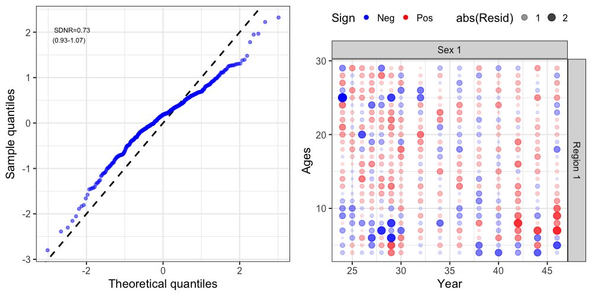
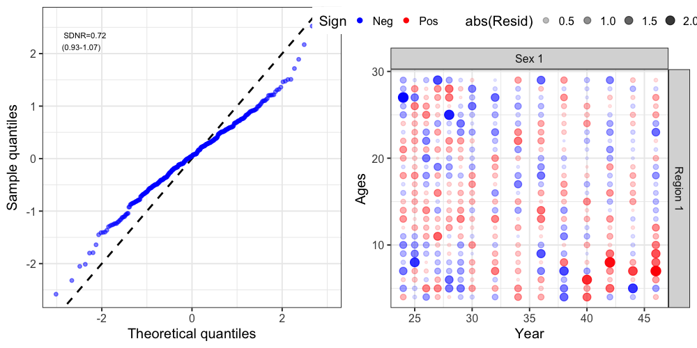
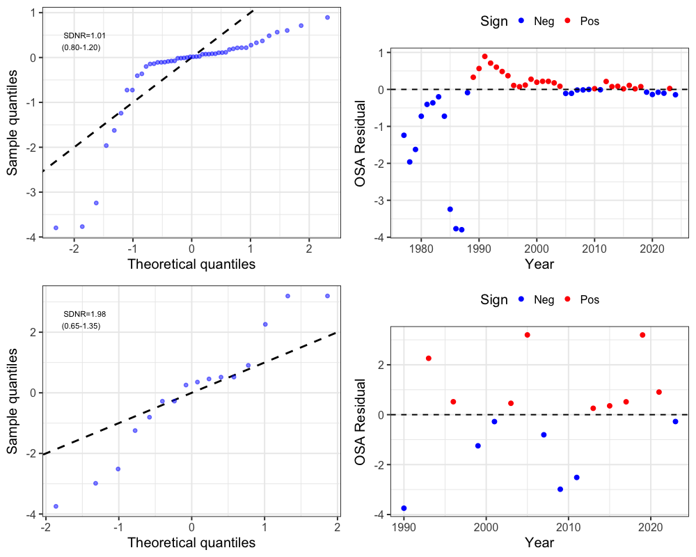
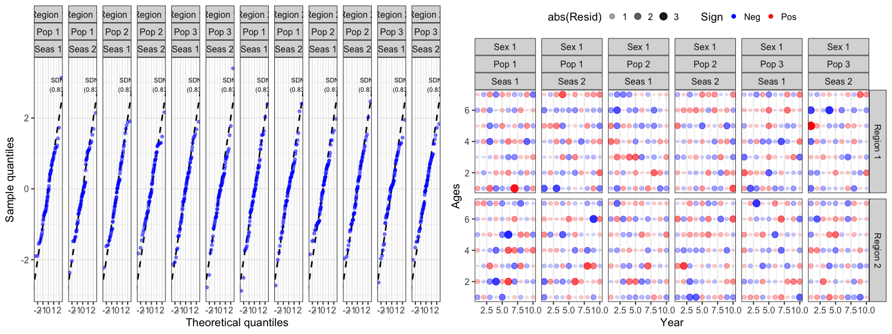
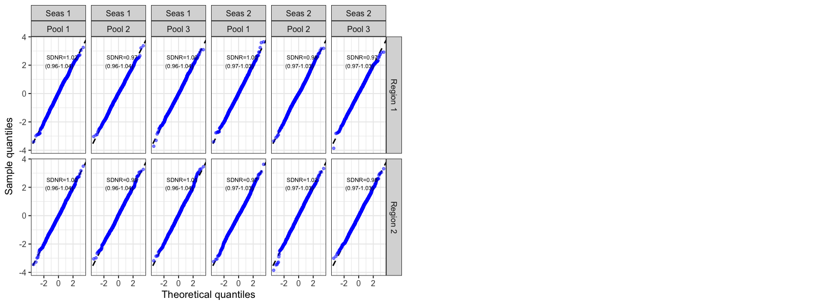
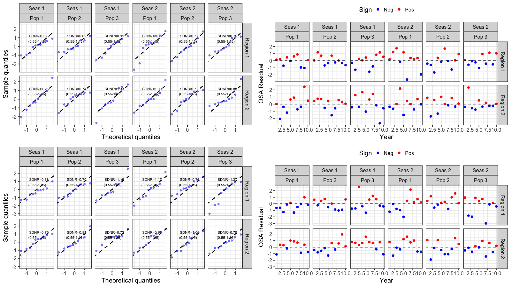

## Age-disaggregated observations

Catch at age, discards at age, and the fishery and survey indices at age all
support one-step-ahead residuals. Pass the at-age name as `index_source`:

```{r, eval = F}
osa <- get_osa(model = fitted, data = input_list$data, index_source = "CatchAA")
plot_resids(osa)
```

Valid at-age sources are `"CatchAA"`, `"DiscardAA"` and `"SrvIdxAA"`, each with a `pop = TRUE` variant. The returned data frame carries
an extra `age` column, which the residual plots facet on.

```{r, include = FALSE}
knitr::opts_chunk$set(
  collapse = TRUE,
  comment = "#>"
)
```

Raw (Pearson) residuals from compositional, count, and index data can be difficult to interpret given that multinomial/Dirichlet-multinomial proportions are correlated within a year (they must sum to one), tag recapture counts are correlated across cohorts and liberty classes, and even continuous index/catch observations are correlated through the shared state variables (abundance, selectivity) that predict them. One-step-ahead (OSA) residuals remove these correlations by computing, for each observation, the residual of its predictive distribution conditional on all previous observations. Thus, this conditioning should theoretically remove all associated correlaitons and the result should behave like iid standard normal deviates if the model is correctly specified, making standard diagnostics (QQ-plots, SDNR, autocorrelation) meaningful.

`SPoRC` computes OSA residuals through a single entry point, `get_osa()`, which supports two independent computation modes and every major data type in the package:

| Data type | `get_osa()` argument | Family |
|---|---|---|
| Age/length compositions | `comp_source = "FishAge"/"FishLen"/"SrvAge"/"SrvLen"` | discrete (multinomial/DM) or continuous (logistic-normal) |
| Population-specific compositions | add `pop = TRUE` | same as above |
| Discard compositions | add `discard = TRUE` | same as above |
| Conventional tag recoveries | `tag = TRUE` | discrete (count or comp-conditioned) |
| Catch | `index_source = "Catch"` | continuous (log-normal) |
| Discards | `index_source = "Discard"` | continuous (log-normal) |
| Fishery index | `index_source = "FishIdx"` | continuous (log-normal) |
| Survey index | `index_source = "SrvIdx"` | continuous (log-normal) |
| Any index source, population-specific | add `pop = TRUE` | continuous (log-normal) |

Every `get_osa()` call returns a list with a single element, `res`, a data frame of residuals that can be passed directly to `plot_resids()`, which produces a QQ-plot (with an SDNR annotation) and a second diagnostic plot (a bubble plot for compositions/tags, or a residual-vs-year plot for index-type data). 

# Two computation modes

External (post-hoc), `get_osa(obs_mat = , exp_mat = , N = , ...)`. Works with any fitted model, no special setup required. Observed/expected arrays (typically pulled from `get_comp_prop()`) are handed to the `compResidual` package, which builds a small  TMB model and computes OSA residuals independently of how the main model was fit.

Internal (model-based), `get_osa(model = , data = , ...)`. Internal OSA is only required for composition data and conventional tagging data. Catch and abundance index observations (Catch/Discard/FishIdx/SrvIdx) are handled automatically through the model likelihood and do not require any additional setup. To obtain internal OSA residuals for composition and/or tagging data, the model must be re-fit with `do_internal_comp_osa = TRUE` and/or `do_internal_conv_tag_osa = TRUE` in `Setup_Mod_Dim()`. These options wrap the relevant observations in `RTMB::OBS()` at the point they enter the model likelihood, allowing `RTMB::oneStepPredict()` to operate directly on the fitted model object. 

When `do_internal_comp_osa = TRUE`, the observed composition proportions (`Obs`) are internally converted to integer counts (e.g., `ISS × Wt × Obs`) before entering the multinomial or Dirichlet-multinomial likelihood, since these likelihoods are defined on count data. The resulting counts are rounded to the nearest integer. This generally has negligible impact when the effective sample size (e.g., `ISS × Wt`) is large, but users should be aware that it can alter the likelihood relative to using continuous proportions. This is particularly relevant when applying Francis or other composition reweighting methods, since the weighted effective sample size determines the counts supplied to the likelihood.

It is strongly recommended that the composition weighting factors (`Wt_*`) remain at their default values when using internal OSA. These weights are applied after the likelihood contribution has been calculated rather than being passed directly into `dnorm()`, `dmultinom()`, `ddirmult()`, or other likelihood functions. Consequently, they are not incorporated into the one-step-ahead predictive distribution and can produce OSA diagnostics that are difficult to interpret or inconsistent with the fitted objective function. 

Both modes are demonstrated below on the same real dataset (single-region GOA Dusky Rockfish) so the two can be compared directly, plus a simulated multi-population, tagging-enabled model for the internal-only data types.

```{r setup, eval = FALSE}
library(SPoRC)
library(tidyverse)
data("sgl_rg_dusky_data")
```

# External OSA residuals

Any already-fitted model works. `get_comp_prop()` extracts observed/expected proportions from the model report, and `get_osa()` (no `model=` argument) computes OSA residuals from those arrays via `compResidual`.

```{r, eval = FALSE}
input_list <- Setup_Mod_Dim(
  years = sgl_rg_dusky_data$years,
  ages = sgl_rg_dusky_data$mod_ages,
  lens = sgl_rg_dusky_data$lens,
  n_regions = sgl_rg_dusky_data$n_regions,
  n_sexes = sgl_rg_dusky_data$n_sexes,
  n_fish_fleets = sgl_rg_dusky_data$n_fish_fleets,
  n_srv_fleets = sgl_rg_dusky_data$n_srv_fleets,
  verbose = FALSE
  # note: do_internal_comp_osa is NOT set here which is not needed for the
  # external path
)

input_list <- Setup_Mod_Rec(
    input_list = input_list,
    do_rec_bias_ramp = 1,
    bias_year = rep(length(sgl_rg_dusky_data$years), 4),
    sigmaR_switch = 1,
    ln_sigmaR = array(-0.1068576, dim = c(2, input_list$data$n_pop, input_list$data$n_regions)),
    rec_model = "mean_rec",
    sigmaR_spec = "fix",
    init_age_strc = 1,
    ln_global_R0 = log(2.7),
    t_spawn = sgl_rg_dusky_data$spwn_month
  )

  input_list <- Setup_Mod_Biologicals(
    input_list = input_list,
    WAA = sgl_rg_dusky_data$waa_arr,
    MatAA = sgl_rg_dusky_data$mataa_arr,
    fit_lengths = 1,
    SizeAgeTrans = sgl_rg_dusky_data$sizeage,
    AgeingError = sgl_rg_dusky_data$age_error_matrix,
    M_spec = "fix",
    Fixed_natmort = sgl_rg_dusky_data$fix_natmort,
    addtocomp = 0.00001
  )

  input_list <- Setup_Mod_Movement(
    input_list = input_list,
    use_fixed_movement = 1,
    Fixed_Movement = NA,
    do_recruits_move = 0
  )

  input_list <- Setup_Mod_Tagging(input_list = input_list, use_conv_fish_tagging = 0)

  input_list <- Setup_Mod_Catch_and_F(
    input_list = input_list,
    ObsCatch = sgl_rg_dusky_data$ObsCatch,
    UseCatch = sgl_rg_dusky_data$UseCatch,
    Use_F_pen = 1,
    sigmaC_spec = "fix",
    Catch_Constant = 0.00001,
    ln_sigmaC = array(log(sqrt(1 / (2 * c(rep(2, 15), rep(50, 33))) )), dim = c(input_list$data$n_regions, length(input_list$data$years),
                                                input_list$data$n_seas, input_list$data$n_fish_fleets)),
    ln_sigmaF = array(log(sqrt(1 / 4)), dim = c(input_list$data$n_regions, input_list$data$n_seas,
                                                input_list$data$n_fish_fleets))
  )

  input_list <- Setup_Mod_FishIdx_and_Comps(
    input_list = input_list,
    ObsFishIdx = sgl_rg_dusky_data$ObsFishIdx,
    ObsFishIdx_SE = sgl_rg_dusky_data$ObsFishIdx_SE,
    UseFishIdx = sgl_rg_dusky_data$UseFishIdx,
    ObsFishAgeComps = sgl_rg_dusky_data$ObsFishAgeComps,
    UseFishAgeComps = sgl_rg_dusky_data$UseFishAgeComps,
    ISS_FishAgeComps = sgl_rg_dusky_data$ISS_FishAgeComps,
    ObsFishLenComps = sgl_rg_dusky_data$ObsFishLenComps,
    UseFishLenComps = sgl_rg_dusky_data$UseFishLenComps,
    ISS_FishLenComps = sgl_rg_dusky_data$ISS_FishLenComps,
    fish_idx_type = c("none"),
    FishAgeComps_LikeType = c("Multinomial"),
    FishLenComps_LikeType = c("Multinomial"),
    FishAgeComps_Type = c("agg_Year_1-terminal_Fleet_1"),
    FishLenComps_Type = c("agg_Year_1-terminal_Fleet_1")
  )

  input_list <- Setup_Mod_SrvIdx_and_Comps(
    input_list = input_list,
    ObsSrvIdx = sgl_rg_dusky_data$ObsSrvIdx,
    ObsSrvIdx_SE = (sgl_rg_dusky_data$ObsSrvIdx_SE / sgl_rg_dusky_data$ObsSrvIdx) / sqrt(1.66),
    UseSrvIdx = sgl_rg_dusky_data$UseSrvIdx,
    ObsSrvAgeComps = sgl_rg_dusky_data$ObsSrvAgeComps,
    ISS_SrvAgeComps = sgl_rg_dusky_data$ISS_SrvAgeComps,
    UseSrvAgeComps = sgl_rg_dusky_data$UseSrvAgeComps,
    ObsSrvLenComps = sgl_rg_dusky_data$ObsSrvLenComps,
    UseSrvLenComps = sgl_rg_dusky_data$UseSrvLenComps,
    ISS_SrvLenComps = sgl_rg_dusky_data$ISS_SrvLenComps,
    srv_idx_type = c("biom"),
    SrvAgeComps_LikeType = c("Multinomial"),
    SrvLenComps_LikeType = c("Multinomial"),
    SrvAgeComps_Type = c("agg_Year_1-terminal_Fleet_1"),
    SrvLenComps_Type = c("agg_Year_1-terminal_Fleet_1")
  )

  input_list <- Setup_Mod_Fishsel_and_Q(
    input_list = input_list,
    cont_tv_fish_sel = c("none_Fleet_1"),
    fish_sel_blocks = c("none_Fleet_1"),
    fish_sel_model = c("logist2_Fleet_1"),
    fish_q_blocks = c("none_Fleet_1"),
    fish_fixed_sel_pars_spec = c("est_all"),
    fish_q_spec = c("fix")
  )

  srv_q_prior <- data.frame(region = 1, block = 1, fleet = 1, mu = 1, sd = 0.447213595)

  input_list <- Setup_Mod_Srvsel_and_Q(
    input_list = input_list,
    cont_tv_srv_sel = c("none_Fleet_1"),
    srv_sel_blocks = c("none_Fleet_1"),
    srv_sel_model = c("logist2_Fleet_1"),
    srv_q_blocks = c("none_Fleet_1"),
    srv_fixed_sel_pars_spec = c("est_all"),
    srv_q_spec = c("est_all"),
    Use_srv_q_prior = 1,
    srv_q_prior = srv_q_prior,
    t_srv = array(0, dim = c(input_list$data$n_regions, input_list$data$n_seas, input_list$data$n_srv_fleets))
  )

  input_list <- Setup_Mod_Weighting(
    input_list
  )


model <- fit_model(input_list$data, input_list$par, input_list$map,
                   random = NULL, newton_loops = 3, silent = TRUE)

# Modeled ages span sgl_rg_dusky_data$mod_ages (4:33, 30 ages), but observed
# fishery/survey age compositions only report ages 4:30 (27 bins, an
# ageing-error offset), comp bin labels use the *observed* bin range.
obs_age_bins <- 4:30

comp_prop <- get_comp_prop(input_list$data, model$rep,
                           age_labels = obs_age_bins,
                           len_labels = sgl_rg_dusky_data$lens,
                           year_labels = sgl_rg_dusky_data$years)

fishages_ext <- get_osa(
  obs_mat = comp_prop$Obs_FishAge_mat,
  exp_mat = comp_prop$Pred_FishAge_mat,
  N = input_list$data$ISS_FishAgeComps[1, which(input_list$data$UseFishAgeComps[,,1,1] == 1), 1, 1, 1] *
    unique(input_list$data$Wt_FishAgeComps[1, which(input_list$data$UseFishAgeComps[,,1,1] == 1), 1, , 1]),
  years = which(input_list$data$UseFishAgeComps[,,1,1] == 1),
  fleet = 1,
  bins = obs_age_bins,
  seas = 1,
  comp_type = 0, # aggregated across sex/region
  bin_label = "Ages"
)

resid_ext <- plot_resids(fishages_ext)
resid_ext[[1]] # QQ-plot with SDNR
resid_ext[[2]] # bubble plot of residuals by year x age
```



# Internal OSA residuals

## Composition and index data

Refitting the same Dusky Rockfish model with `do_internal_comp_osa = TRUE` switches on `RTMB::OBS()` tracking for every composition source, plus (unconditionally, no extra flag needed) `Catch`, `Discard`, `FishIdx`, and `SrvIdx`. `get_osa()` is then called with `model =`/`data =` instead of `obs_mat =`/`exp_mat =`.

```{r, eval = FALSE}
input_list <- Setup_Mod_Dim(
  years = sgl_rg_dusky_data$years,
  ages = sgl_rg_dusky_data$mod_ages,
  lens = sgl_rg_dusky_data$lens,
  n_regions = sgl_rg_dusky_data$n_regions,
  n_sexes = sgl_rg_dusky_data$n_sexes,
  n_fish_fleets = sgl_rg_dusky_data$n_fish_fleets,
  n_srv_fleets = sgl_rg_dusky_data$n_srv_fleets,
  verbose = FALSE,
  do_internal_comp_osa = TRUE # the only change needed vs. the external setup
)

input_list <- Setup_Mod_Rec(
    input_list = input_list,
    do_rec_bias_ramp = 1,
    bias_year = rep(length(sgl_rg_dusky_data$years), 4),
    sigmaR_switch = 1,
    ln_sigmaR = array(-0.1068576, dim = c(2, input_list$data$n_pop, input_list$data$n_regions)),
    rec_model = "mean_rec",
    sigmaR_spec = "fix",
    init_age_strc = 1,
    ln_global_R0 = log(2.7),
    t_spawn = sgl_rg_dusky_data$spwn_month
  )

  input_list <- Setup_Mod_Biologicals(
    input_list = input_list,
    WAA = sgl_rg_dusky_data$waa_arr,
    MatAA = sgl_rg_dusky_data$mataa_arr,
    fit_lengths = 1,
    SizeAgeTrans = sgl_rg_dusky_data$sizeage,
    AgeingError = sgl_rg_dusky_data$age_error_matrix,
    M_spec = "fix",
    Fixed_natmort = sgl_rg_dusky_data$fix_natmort,
    addtocomp = 0.00001
  )

  input_list <- Setup_Mod_Movement(
    input_list = input_list,
    use_fixed_movement = 1,
    Fixed_Movement = NA,
    do_recruits_move = 0
  )

  input_list <- Setup_Mod_Tagging(input_list = input_list, use_conv_fish_tagging = 0)

  input_list <- Setup_Mod_Catch_and_F(
    input_list = input_list,
    ObsCatch = sgl_rg_dusky_data$ObsCatch,
    UseCatch = sgl_rg_dusky_data$UseCatch,
    Use_F_pen = 1,
    sigmaC_spec = "fix",
    Catch_Constant = 0.00001,
    ln_sigmaC = array(log(sqrt(1 / (2 * c(rep(2, 15), rep(50, 33))) )), dim = c(input_list$data$n_regions, length(input_list$data$years),
                                                input_list$data$n_seas, input_list$data$n_fish_fleets)),
    ln_sigmaF = array(log(sqrt(1 / 4)), dim = c(input_list$data$n_regions, input_list$data$n_seas,
                                                input_list$data$n_fish_fleets))
  )

  input_list <- Setup_Mod_FishIdx_and_Comps(
    input_list = input_list,
    ObsFishIdx = sgl_rg_dusky_data$ObsFishIdx,
    ObsFishIdx_SE = sgl_rg_dusky_data$ObsFishIdx_SE,
    UseFishIdx = sgl_rg_dusky_data$UseFishIdx,
    ObsFishAgeComps = sgl_rg_dusky_data$ObsFishAgeComps,
    UseFishAgeComps = sgl_rg_dusky_data$UseFishAgeComps,
    ISS_FishAgeComps = sgl_rg_dusky_data$ISS_FishAgeComps,
    ObsFishLenComps = sgl_rg_dusky_data$ObsFishLenComps,
    UseFishLenComps = sgl_rg_dusky_data$UseFishLenComps,
    ISS_FishLenComps = sgl_rg_dusky_data$ISS_FishLenComps,
    fish_idx_type = c("none"),
    FishAgeComps_LikeType = c("Multinomial"),
    FishLenComps_LikeType = c("Multinomial"),
    FishAgeComps_Type = c("agg_Year_1-terminal_Fleet_1"),
    FishLenComps_Type = c("agg_Year_1-terminal_Fleet_1")
  )

  input_list <- Setup_Mod_SrvIdx_and_Comps(
    input_list = input_list,
    ObsSrvIdx = sgl_rg_dusky_data$ObsSrvIdx,
    ObsSrvIdx_SE = (sgl_rg_dusky_data$ObsSrvIdx_SE / sgl_rg_dusky_data$ObsSrvIdx) / sqrt(1.66),
    UseSrvIdx = sgl_rg_dusky_data$UseSrvIdx,
    ObsSrvAgeComps = sgl_rg_dusky_data$ObsSrvAgeComps,
    ISS_SrvAgeComps = sgl_rg_dusky_data$ISS_SrvAgeComps,
    UseSrvAgeComps = sgl_rg_dusky_data$UseSrvAgeComps,
    ObsSrvLenComps = sgl_rg_dusky_data$ObsSrvLenComps,
    UseSrvLenComps = sgl_rg_dusky_data$UseSrvLenComps,
    ISS_SrvLenComps = sgl_rg_dusky_data$ISS_SrvLenComps,
    srv_idx_type = c("biom"),
    SrvAgeComps_LikeType = c("Multinomial"),
    SrvLenComps_LikeType = c("Multinomial"),
    SrvAgeComps_Type = c("agg_Year_1-terminal_Fleet_1"),
    SrvLenComps_Type = c("agg_Year_1-terminal_Fleet_1")
  )

  input_list <- Setup_Mod_Fishsel_and_Q(
    input_list = input_list,
    cont_tv_fish_sel = c("none_Fleet_1"),
    fish_sel_blocks = c("none_Fleet_1"),
    fish_sel_model = c("logist2_Fleet_1"),
    fish_q_blocks = c("none_Fleet_1"),
    fish_fixed_sel_pars_spec = c("est_all"),
    fish_q_spec = c("fix")
  )

  srv_q_prior <- data.frame(region = 1, block = 1, fleet = 1, mu = 1, sd = 0.447213595)

  input_list <- Setup_Mod_Srvsel_and_Q(
    input_list = input_list,
    cont_tv_srv_sel = c("none_Fleet_1"),
    srv_sel_blocks = c("none_Fleet_1"),
    srv_sel_model = c("logist2_Fleet_1"),
    srv_q_blocks = c("none_Fleet_1"),
    srv_fixed_sel_pars_spec = c("est_all"),
    srv_q_spec = c("est_all"),
    Use_srv_q_prior = 1,
    srv_q_prior = srv_q_prior,
    t_srv = array(0, dim = c(input_list$data$n_regions, input_list$data$n_seas, input_list$data$n_srv_fleets))
  )

  input_list <- Setup_Mod_Weighting(
    input_list
  )
  
model <- fit_model(input_list$data, input_list$par, input_list$map,
                   random = NULL, newton_loops = 3, silent = TRUE)

# Composition OSA: comp_source identifies the data source, family whether
# the fitted likelihood for that source is discrete (multinomial/DM) or
# continuous (logistic-normal)
fishages_int <- get_osa(model = model, data = input_list$data,
                        comp_source = "FishAge", family = "discrete",
                        bins = obs_age_bins, bin_label = "Ages")
resid_int <- plot_resids(fishages_int)
```



Index-type sources use `index_source` instead of `comp_source`/`family`, there is no likelihood-family choice to make, since these are always continuous log-normal observations (currently), and no `bins`/`bin_label` since there's no bin dimension. `plot_resids()` returns a QQ-plot paired with a residual-vs-year plot instead of a bubble plot. The residuals for catch appear visually 'odd' likely due to a change in the variance of the distribution between early and late periods, reflecting a change in catch observations for Dusky rockfish during these periods (i.e., catches were recorded a a mix of different rockfish species earlier in the time series, and the variance is adjusted to reflect increased uncertainty in the catch observation).

```{r, eval = FALSE}
catch_int  <- get_osa(model = model, data = input_list$data, index_source = "Catch")
srvidx_int <- get_osa(model = model, data = input_list$data, index_source = "SrvIdx")
# index_source = "Discard"/"FishIdx" follow the identical interface (omitted
# here ... this Dusky Rockfish case study sets fish_idx_type = "none" and
# doesn't model discards, so those sources have no data to show)

resid_catch  <- plot_resids(catch_int)
resid_srvidx <- plot_resids(srvidx_int)
```



## Population-specific and tagging data

Population-specific composition/index residuals (`pop = TRUE`) and conventional tag recovery residuals (`tag = TRUE`) require the model to actually have population-specific and/or tagging data, so this section switches to a simulated 3-population, 2-region, 2-season model with natal homing movement and conventional tagging, fit with both `do_internal_comp_osa = TRUE` and `do_internal_conv_tag_osa = TRUE`. The following code chunk is purely for demonstration purposes.

```{r, eval = FALSE}
input_pop <- Setup_Mod_Dim(
  years = 1:sim_obj$n_years, ages = 1:sim_obj$n_ages, lens = sim_obj$n_lens,
  n_regions = sim_obj$n_regions, n_sexes = sim_obj$n_sexes,
  n_fish_fleets = sim_obj$n_fish_fleets, n_srv_fleets = sim_obj$n_srv_fleets,
  n_seas = sim_obj$n_seas, n_pop = sim_obj$n_pop,
  natal_region = c(1, 1, 2), verbose = FALSE,
  do_internal_comp_osa = TRUE,
  do_internal_conv_tag_osa = TRUE
)

model_pop <- fit_model(input_pop$data, input_pop$par, input_pop$map,
                       random = NULL, newton_loops = 3, silent = TRUE)
```

Population-specific composition OSA (`pop = TRUE`, joint-sex in this example):

```{r, eval = FALSE}
comp_pop <- get_osa(model = model_pop, data = input_pop$data, comp_source = "FishAge",
                    pop = TRUE, family = "discrete", bins = input_pop$data$ages, bin_label = "Ages")
resid_comp_pop <- plot_resids(comp_pop)
```



Conventional tag recovery OSA (`tag = TRUE`), faceted by region, recovery season, fleet, and movement/tag pooling group whenever the residual data span more than one level of each. This is a bit unwieldy to inspect given the number of dimensions (release cohort, recapture region, age, year at liberty etc) and so only qqplot's are shown for tagging data. 

```{r, eval = FALSE}
tag_osa <- get_osa(model = model_pop, data = input_pop$data, tag = TRUE)
resid_tag <- plot_resids(tag_osa)
```



Population-specific index OSA (`index_source = ` + `pop = TRUE`):

```{r, eval = FALSE}
catch_pop_osa  <- get_osa(model = model_pop, data = input_pop$data, index_source = "Catch", pop = TRUE)
srvidx_pop_osa <- get_osa(model = model_pop, data = input_pop$data, index_source = "SrvIdx", pop = TRUE)

resid_catch_pop  <- plot_resids(catch_pop_osa)
resid_srvidx_pop <- plot_resids(srvidx_pop_osa)
```



# Other options

`get_osa()`'s internal mode exposes two further arguments:

- `osa_method`: overrides `RTMB::oneStepPredict()`'s `method` argument. Must be one of `"oneStepGeneric"`, `"oneStepGaussianOffMode"`, or `"oneStepGaussian"`, the `"cdf"` method is deliberately disallowed because it is numerically fragile for the discrete (multinomial/count) likelihoods used here and can silently return mis-calibrated residuals. Defaults to `"oneStepGeneric"` for discrete composition/tag families and `"oneStepGaussianOffMode"` for continuous (logistic-normal composition or index-type) families.
- `parallel`: passed straight through to `RTMB::oneStepPredict(parallel = )`. Useful for large composition/tag datasets where OSA computation dominates runtime; verified to give numerically identical residuals to `parallel = FALSE`.

```{r, eval = FALSE}
get_osa(model = model, data = input_list$data, index_source = "SrvIdx",
       osa_method = "oneStepGaussian", parallel = TRUE)
```
