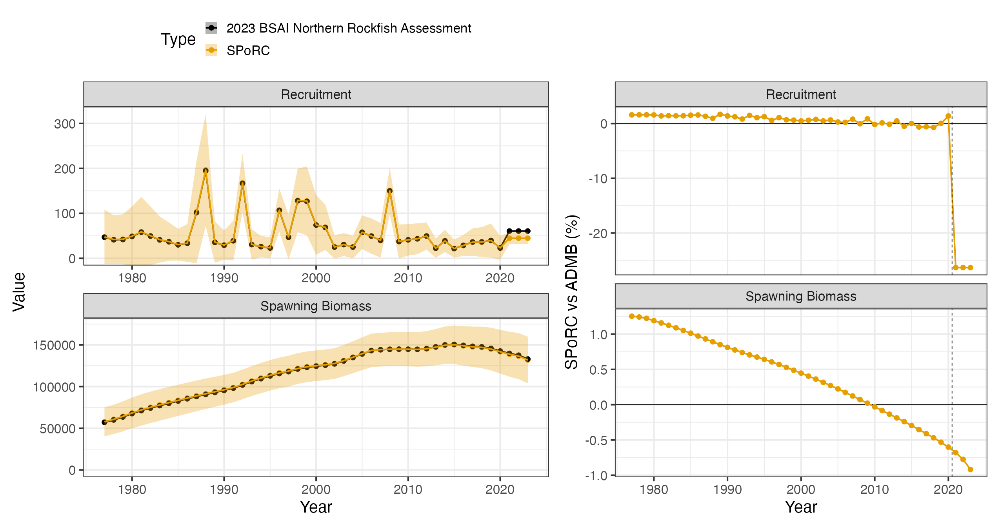
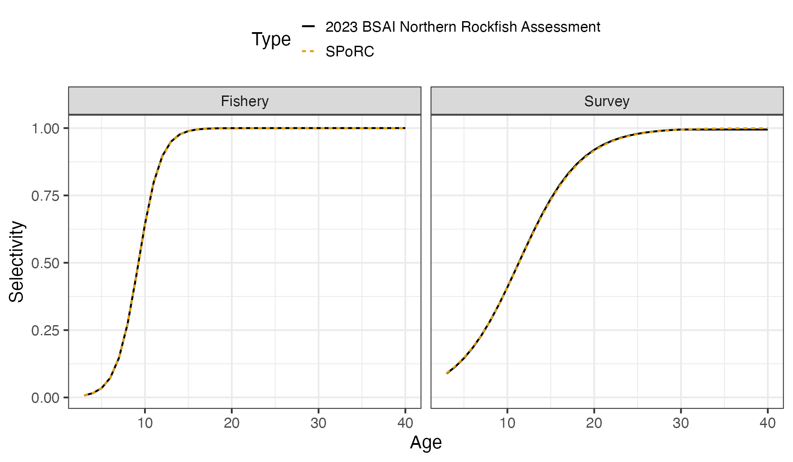

```{r, include = FALSE}
knitr::opts_chunk$set(
  collapse = TRUE,
  comment = "#>",
  eval = FALSE
)
```

## Overview

This case study reproduces the 2023 Bering Sea and Aleutian Islands northern
rockfish assessment in `SPoRC`. Every structural choice below follows the
assessment rather than `SPoRC`'s defaults. 

The model is single region, single sex, single season, with one fishery fleet
and one survey:

| Source | Years | Observations | Likelihood |
|---|---|---|---|
| Catch | 1977--2023 | 47 | Lognormal, weighted |
| Aleutian Islands survey biomass | 1991--2022 | 13 | Lognormal |
| Fishery age compositions | 2000--2021 | 17 | Multinomial |
| Fishery length compositions | 1977--2022 | 11 | Multinomial |
| Survey age compositions | 1991--2022 | 13 | Multinomial |

Model ages run 3 to 45 with a plus group, while the assessment reports over
observed ages 3 to 40 with its last column an age 40 plus aggregation. Lengths
run 15 to 38 cm.

```{r setup, warning = FALSE, message = FALSE, eval = FALSE}
library(SPoRC)
library(dplyr)
library(ggplot2)
data("sgl_rg_bsai_nork_data")

dat <- sgl_rg_bsai_nork_data
yrs <- dat$years
n_yrs <- length(yrs)
n_ages <- length(dat$ages)
n_obs_ages <- length(dat$obs_ages)
```

## Model dimensions

Because the model is single region and single sex, the population, region,
season and sex subscripts used in the model equations all collapse to one, and
are dropped from the notation below.

```{r, eval = FALSE}
input_list <- Setup_Mod_Dim(
  n_pop = dat$n_pop,
  years = yrs,
  ages = dat$ages,
  lens = dat$lens,
  n_regions = dat$n_regions,
  n_sexes = dat$n_sexes,
  n_fish_fleets = dat$n_fish_fleets,
  n_srv_fleets = dat$n_srv_fleets,
  n_seas = dat$n_seas,
  verbose = FALSE
)
```

## Recruitment and the initial age structure

Recruitment is a mean with annual deviations rather than a stock recruit
function, and the last three years take the mean outright:

$$\text{Rec}_{y} = R_{0}\exp\left(\epsilon_{y}^{\text{Rec}}\right),\qquad \epsilon_{y}^{\text{Rec}} \equiv 0 \text{ for the last three years}$$

The initial age structure is where this assessment differs most from a `SPoRC`
default. Its `fyear_ac_option 3` gives the first year its own scalar,
independent of the recruitment level, with deviations that ages beyond the
observed range share:

$$N_{1,a} = \exp\left(\log R^{\text{init}} - M(a-1) + \phi_{a}\right)$$

`use_rinit = 1` is what creates that separate scalar, and
`equil_init_age_strc = "stoch_shared_ages"` with an explicit
`init_age_devs_shared` vector is what makes the ages past the observed range
share the last deviation. `SPoRC` carries the initial numbers as multiplicative
deviations from an equilibrium age structure rather than as the structure
itself, so the seeding step below converts between the two.

The bias ramp is on with every ramp year at the terminal year, which centres the
recruitment penalty on $-\sigma_{R}^{2}/2$. That matches the shifted deviations
the seeds carry, described in the seeding section.

```{r, eval = FALSE}
input_list <- Setup_Mod_Rec(
  input_list = input_list,
  rec_model = "mean_rec",
  do_rec_bias_ramp = 1,
  bias_year = rep(n_yrs, 4),
  sigmaR_switch = 1,
  ln_sigmaR = array(log(dat$sigmaR), dim = c(2, dat$n_pop, dat$n_regions)),
  equil_init_age_strc = "stoch_shared_ages",
  init_age_devs_shared = c(1:(n_obs_ages - 1), rep(n_obs_ages - 1, n_ages - n_obs_ages)),
  dont_est_recdev_last = 3,
  sigmaR_spec = "fix",
  init_age_strc = 1,
  t_spawn = (dat$spawn_mo - 1) / 12,
  use_rinit = 1
)
```

## Biological dynamics

Natural mortality is estimated under a lognormal prior. The assessment states
its prior as a mean of $0.06$ on the natural scale, so the median supplied to
`SPoRC` is shifted by $\exp(-\text{CV}^{2}/2)$ to put the prior mean where the
assessment puts it:

$$\ell^{M} = \dfrac{\left(\log M - \log\left[\mu_{M}e^{-\text{CV}_{M}^{2}/2}\right]\right)^{2}}{2\,\text{CV}_{M}^{2}}$$

Weight at age is year varying, and the fishery carries its own weight at age
matrix through `WAA_fish`, which prices the catch, while the population matrix
prices spawning biomass and the survey.

```{r, eval = FALSE}
input_list <- Setup_Mod_Biologicals(
  input_list = input_list,
  WAA = dat$WAA,
  WAA_fish = dat$WAA_fish,
  MatAA = dat$MatAA,
  fit_lengths = 1,
  SizeAgeTrans = dat$SizeAgeTrans,
  AgeingError = dat$AgeingError,
  M_spec = "est_ln_M",
  Use_M_prior = 1,
  M_prior = data.frame(popblk = 1, regionblk = 1, yearblk = 1, ageblk = 1, sexblk = 1,
                       mu = dat$mean_M * exp(-dat$cv_M^2 / 2), sd = dat$cv_M),
  addtosrvidx = 1e-13,
  addtocomp = 1e-13
)
```

## Movement and tagging

The model is single region, so movement is an identity matrix and no tagging
data are used. Both still have to be declared.

```{r, eval = FALSE}
input_list <- Setup_Mod_Movement(input_list = input_list, use_fixed_movement = 1,
                                 Fixed_Movement = NA, do_recruits_move = 0)

input_list <- Setup_Mod_Tagging(input_list = input_list, use_conv_fish_tagging = 0)
```

## Catch and fishing mortality

The assessment writes its catch and F statements as weighted sums of squares
with weights $200$ and $0.1$. A weighted sum of squares and a normal likelihood
with a fixed standard deviation are the same statement up to a constant, related
by $\sigma = 1/\sqrt{2w}$, so both weights are carried inside the standard
deviations rather than applied outside the sums.

```{r, eval = FALSE}
suppressWarnings(
  input_list <- Setup_Mod_Catch_and_F(
    input_list = input_list,
    ObsCatch = dat$ObsCatch,
    UseCatch = dat$UseCatch,
    Use_F_pen = 1,
    sigmaC_spec = "fix",
    ln_sigmaC = array(log(sqrt(1 / (2 * dat$catch_wt))),
                      dim = c(dat$n_regions, n_yrs, dat$n_seas, dat$n_fish_fleets)),
    ln_sigmaF = array(log(sqrt(1 / (2 * dat$fmort_wt))),
                      dim = c(dat$n_regions, dat$n_seas, dat$n_fish_fleets))
  )
)
```

## Fishery compositions

There is no fishery index in this assessment, only compositions, so
`fish_idx_type` is `"none"` and the index arrays are declared empty.

```{r, eval = FALSE}
input_list <- Setup_Mod_FishIdx_and_Comps(
  input_list = input_list,
  ObsFishIdx = array(NA, dim = c(dat$n_regions, n_yrs, dat$n_seas, dat$n_fish_fleets)),
  ObsFishIdx_SE = array(NA, dim = c(dat$n_regions, n_yrs, dat$n_seas, dat$n_fish_fleets)),
  UseFishIdx = array(0, dim = c(dat$n_regions, n_yrs, dat$n_seas, dat$n_fish_fleets)),
  ObsFishAgeComps = dat$ObsFishAgeComps,
  UseFishAgeComps = dat$UseFishAgeComps,
  ISS_FishAgeComps = dat$ISS_FishAgeComps,
  ObsFishLenComps = dat$ObsFishLenComps,
  UseFishLenComps = dat$UseFishLenComps,
  ISS_FishLenComps = dat$ISS_FishLenComps,
  fish_idx_type = "none",
  FishAgeComps_LikeType = "Multinomial",
  FishLenComps_LikeType = "Multinomial",
  FishAgeComps_Type = "agg_Year_1-terminal_Fleet_1",
  FishLenComps_Type = "agg_Year_1-terminal_Fleet_1"
)
```

## Survey index and compositions

The Aleutian Islands bottom trawl survey supplies a biomass index and age
compositions. The index is lognormal with year specific standard errors, and the
survey is fit at mid year.

```{r, eval = FALSE}
input_list <- Setup_Mod_SrvIdx_and_Comps(
  input_list = input_list,
  ObsSrvIdx = dat$ObsSrvIdx,
  ObsSrvIdx_SE = dat$ObsSrvIdx_SE,
  UseSrvIdx = dat$UseSrvIdx,
  ObsSrvAgeComps = dat$ObsSrvAgeComps,
  ISS_SrvAgeComps = dat$ISS_SrvAgeComps,
  UseSrvAgeComps = dat$UseSrvAgeComps,
  ObsSrvLenComps = dat$ObsSrvLenComps,
  UseSrvLenComps = dat$UseSrvLenComps,
  ISS_SrvLenComps = dat$ISS_SrvLenComps,
  srv_idx_type = "biom",
  SrvAgeComps_LikeType = "Multinomial",
  SrvLenComps_LikeType = "Multinomial",
  SrvAgeComps_Type = "agg_Year_1-terminal_Fleet_1",
  SrvLenComps_Type = "agg_Year_1-terminal_Fleet_1"
)
```

## Fishery selectivity and catchability

Both fleets use the slope and $a_{50}$ parameterisation of the logistic, which
is `logist1`:

$$\text{Sel}_{a} = \dfrac{1}{1 + \exp\left[-k\left(a - a_{50}\right)\right]}$$

Selectivity is time invariant, so there are no deviations and no process error.
Fishery catchability is not used, because there is no fishery index to scale.

```{r, eval = FALSE}
input_list <- Setup_Mod_Fishsel_and_Q(
  input_list = input_list,
  cont_tv_fish_sel = "none_Fleet_1",
  fish_sel_blocks = "none_Fleet_1",
  fish_sel_model = "logist1_Fleet_1",
  fish_q_blocks = "none_Fleet_1",
  fish_fixed_sel_pars_spec = "est_all",
  fish_q_spec = "fix"
)
```

## Survey selectivity and catchability

Two constraints on the survey side are worth stating carefully.

The catchability prior has a coefficient of variation of $0.001$, which is tight
enough to pin $q$ at one. That is the assessment's intent, and it is why the
$q$ prior term is $3\times10^{-6}$ rather than a live contribution.

The selectivity constraint is not a prior on the selectivity *parameters*. The
assessment penalises the realized selectivity value at age 30 towards one with a
standard deviation of $0.003$:

$$\ell^{\text{Sel}} = \dfrac{\left(\text{Sel}_{30} - 1\right)^{2}}{2\times0.003^{2}}$$

`type = "value"` in `srv_selex_prior` makes exactly that statement, and it is
load bearing: without it the survey age compositions do not identify the
selectivity asymptote.

```{r, eval = FALSE}
input_list <- Setup_Mod_Srvsel_and_Q(
  input_list = input_list,
  cont_tv_srv_sel = "none_Fleet_1",
  srv_sel_blocks = "none_Fleet_1",
  srv_sel_model = "logist1_Fleet_1",
  srv_q_blocks = "none_Fleet_1",
  srv_fixed_sel_pars_spec = "est_all",
  srv_q_spec = "est_all",
  Use_srv_q_prior = 1,
  srv_q_prior = data.frame(region = 1, block = 1, fleet = 1,
                           mu = dat$mean_q * exp(-dat$cv_q^2 / 2), sd = dat$cv_q),
  t_srv = array(0.5, dim = c(dat$n_regions, dat$n_seas, dat$n_srv_fleets)),
  Use_srv_selex_prior = 1,
  srv_selex_prior = data.frame(region = 1, fleet = 1, block = 1, sex = 1,
                               par = which(dat$ages == 30),
                               mu = 1.0, sd = 0.003, type = "value")
)
```

## Weighting

The catch and F weights are already inside their standard deviations, so the
only weights left are the composition multipliers, which are the assessment's
McAllister Ianelli values and ship in the data object.

```{r, eval = FALSE}
input_list <- Setup_Mod_Weighting(
  input_list = input_list,
  Wt_Catch = 1, Wt_FishIdx = 1, Wt_SrvIdx = 1,
  Wt_Rec = 1, Wt_F = 1, Wt_Tagging = 0,
  Wt_FishAgeComps = dat$Wt_FishAgeComps,
  Wt_FishLenComps = dat$Wt_FishLenComps,
  Wt_SrvAgeComps = dat$Wt_SrvAgeComps,
  Wt_SrvLenComps = dat$Wt_SrvLenComps
)
```

## Starting at the ADMB estimate

Before optimizing anything, it is worth checking that the model is reproduced
*at a known point*. Setting every parameter to the assessment's maximum
likelihood estimate and evaluating there separates a specification error from an
optimization difference: if the population and the likelihood agree at the ADMB
solution, the two models are the same model.

Two conversions are needed. The assessment builds its three deviation free
terminal recruits as $\exp(\overline{\log R} + \sigma_{R}^{2}/2)$ while leaving
the estimated years raw, and its recruitment deviations are a `dev_vector`
constrained to sum to zero. Carrying the bias correction in `ln_global_R0` and
shifting every seeded deviation down by the same amount reproduces both the
recruitment series and the penalty value exactly.

The initial age structure conversion is the second. The assessment writes the
first year directly, while `SPoRC` carries multiplicative deviations from an
equilibrium age structure, so the deviations are the log ratio of the two.

```{r, eval = FALSE}
mle <- dat$mle
s2 <- dat$sigmaR^2 / 2

input_list$par$ln_global_R0[] <- mle$mean_log_rec + s2
input_list$par$ln_RecDevs[1, 1, ] <- mle$rec_dev - s2
input_list$par$ln_rinit <- mle$log_rinit
input_list$par$ln_M[] <- log(mle$M)
input_list$par$ln_srv_q[] <- log(mle$q_srv)
input_list$par$ln_F_mean[] <- mle$log_avg_fmort
input_list$par$ln_F_devs[1, , 1, 1] <- mle$fmort_dev
input_list$par$fish_fixed_sel_pars[] <- log(c(mle$sel_a50_fish, mle$sel_aslope_fish))
input_list$par$srv_fixed_sel_pars[] <- log(c(mle$sel_a50_srv, mle$sel_aslope_srv))

# The assessment's initial numbers at age against SPoRC's equilibrium reference.
NAA_equil <- exp(mle$log_rinit) * exp(-(0:(n_ages - 1)) * mle$M)
NAA_equil[n_ages] <- NAA_equil[n_ages - 1] * exp(-mle$M) / (1 - exp(-mle$M))
NAA_styr <- NAA_equil
for(j in 2:n_obs_ages) {
  NAA_styr[j] <- exp(mle$log_rinit - mle$M * (j - 1) + mle$fydev[j - 1])
} # end j loop
for(j in (n_obs_ages + 1):n_ages) {
  NAA_styr[j] <- exp(mle$log_rinit - mle$M * (j - 1) + mle$fydev[length(mle$fydev)])
} # end j loop
NAA_styr[n_ages] <- exp(mle$log_rinit - mle$M * (n_ages - 1) +
                          mle$fydev[length(mle$fydev)]) / (1 - exp(-mle$M))
input_list$par$ln_InitDevs[1, 1, , ] <- (log(NAA_styr) - log(NAA_equil))[-1]
```

One thing `SPoRC` cannot express is the assessment's `nselages` edge hold, which
evaluates the logistic over ages 3 to 30 only and holds both curves at the age
30 value beyond that. For the seed evaluation the survey curve is supplied as a
fixed input with that hold applied, which isolates the likelihoods from the
selectivity form. The refit below estimates the uncapped logistic instead, and
that is the only specification difference between the two stages.

```{r, eval = FALSE}
bridge_list <- input_list
bridge_list$data <- cap_bsai_nork_srv_sel(bridge_list$data, dat)

obj <- fit_model(bridge_list$data, bridge_list$par, bridge_list$map,
                 do_optim = FALSE, silent = TRUE)
r <- obj$rep
```

At that point every reported quantity agrees with the ADMB model:

```
fishery selectivity max pct diff: 1.3e-04
survey selectivity  max pct diff: 3.3e-04
numbers at age      max pct diff: 5.0e-04
spawning biomass    max pct diff: 3.9e-04
recruitment         max pct diff: 2.5e-04
fishing mortality   max pct diff: 4.4e-04
```

The likelihood is checked the same way. `SPoRC` writes each component as a
proper density while the assessment drops normalising constants, so a like for
like comparison subtracts exactly the constants the assessment omits. The
survey statement keeps its $\log\sigma$ term but drops $\sqrt{2\pi}$, and its
standard errors vary by year, so that constant is summed over the observations
rather than counted. The recruitment penalty keeps its $\log\sigma_{R}$ terms
over the recruitment and initial age deviations together, which is why it is
negative: $\sigma_{R}$ is $0.75$.

| Component | `SPoRC` | Assessment |
|---|---|---|
| Catch sum of squares | 0.00417 | 0.0000209 |
| Survey index | 8.78014 | 8.78103 |
| Fishery age compositions | 257.649 | 257.649 |
| Fishery length compositions | 84.2464 | 84.2464 |
| Survey age compositions | 198.736 | 198.736 |
| Recruitment | -1.73126 | -1.73126 |
| F regularity | 5.98039 | 5.98039 |
| Survey selectivity prior | 1.56319 | 1.56319 |
| $M$ prior | 0.253029 | 0.253029 |
| $q$ prior | 0.00000349 | 0.00000349 |
| **Like for like total** | **555.481** | **555.4816** |

Nine of the ten components land on the assessment's value. The catch statement
is the exception, and both sides are numerically zero against an objective of
$555$: the assessment fits catch to $2\times10^{-5}$ and `SPoRC` to
$4\times10^{-3}$, which is a difference in how near exactly catch is driven
rather than a difference in the statement. The assessment estimates maturity
inside its template while `SPoRC` fixes it, so its maturity likelihood is
removed from its side of the total.

## Fitting and comparison

```{r, eval = FALSE}
est <- fit_model(input_list$data, input_list$par, input_list$map,
                 random = NULL, newton_loops = 3, silent = TRUE)
est$sdrep <- RTMB::sdreport(est)
```

```
free parameters: 137
final jnLL: 591.667   max |gradient|: 2.4e-12
pdHess: TRUE
```

The refit moves further from the assessment than the other rockfish bridges do,
by a median of $0.6$ percent in spawning biomass, and the reason is the
selectivity form rather than anything in the likelihoods. The refit estimates an
uncapped logistic where the assessment holds its curve flat past age 30, so the
two are fitting slightly different shapes over the oldest ages, which the survey
age compositions do see.

| Quantity | Median difference | Maximum difference |
|---|---|---|
| Spawning biomass | 0.60 % | 1.25 % |
| Recruitment, estimated years | 0.82 % | 1.69 % |



The dashed rule marks where the estimated recruitment deviations stop. Over the
three terminal years the assessment builds recruitment as the mean of the
lognormal and `SPoRC` as the median, so a ratio of
$\exp(\sigma_{R}^{2}/2) = 1.3248$ is expected there by convention. The observed
ratio is $1.3573$, and the remainder is the shift in the estimated recruitment
level between the two fits rather than a second convention.



The survey panel is where the refit and the assessment part company, for the
reason given above.
